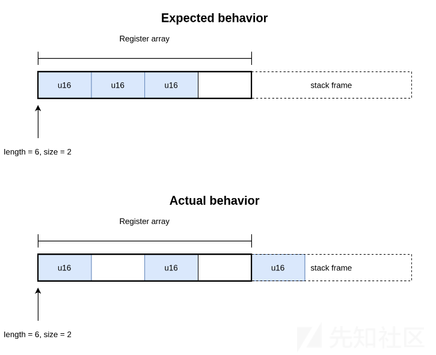
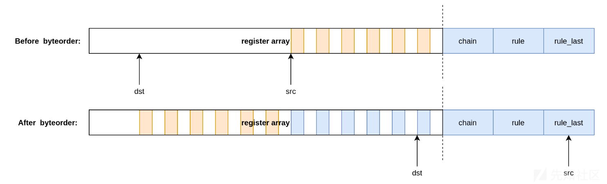
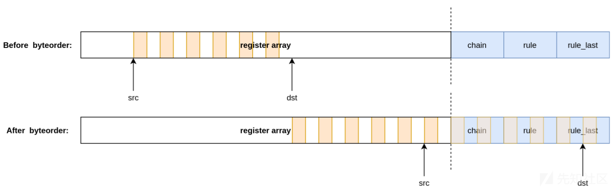
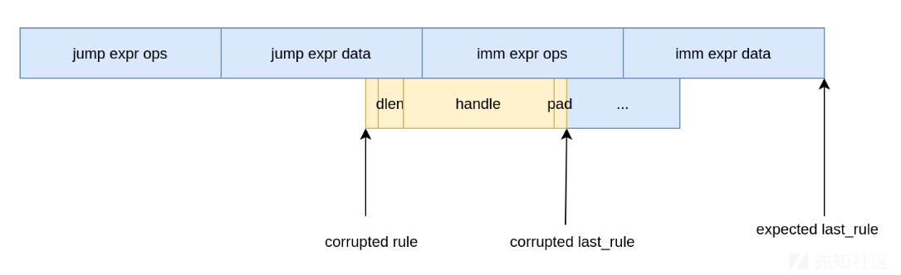

# 2023年Pwn2Own温哥华PWN比赛上的Ubuntu提权漏洞攻击 - 先知社区

2023年Pwn2Own温哥华PWN比赛上的Ubuntu提权漏洞攻击

- - -

> 本文介绍了如何在Ubuntu系统的权限提升漏洞，涉及的主要技术有：
> 
> -   nftables 代码解析
> -   nftables 字节对齐
> -   nftables kASLR泄露
> -   nftables EXP构造
> 
> 翻译来源：
> 
> [https://www.synacktiv.com/en/publications/old-bug-shallow-bug-exploiting-ubuntu-at-pwn2own-vancouver-2023](https://www.synacktiv.com/en/publications/old-bug-shallow-bug-exploiting-ubuntu-at-pwn2own-vancouver-2023)
> 
> 在今年的Pwn2Own Vancouver比赛上，我们展示了三种桌面操作系统的本地提权（LPE）漏洞：Windows、MacOS和Linux（Ubuntu）。这篇博文深入探讨了利用CVE-2023-35001的Ubuntu几种方法，这是Linux内核中长期存在却未被发现的漏洞。

表面上Pwn2Own上可用于LPE的仅限于内核代码，但通过研究时对公共开发的调查，我们发现了两个特别容易被利用的地方。

第一个是可以通过用户名称空间访问的内核代码。在大多数Linux发行版上，默认配置暴露了一个非常受限的攻击面，大多数有趣的功能都隐藏在权限或可用性检查之后。然而，在Ubuntu上，通过使用用户命名空间（通过 `kernel.unprivileged_userns_clone` sysctl）完全打开攻击面是可能的，因为用户命名空间是允许非特权用户使用的。

接下来是io\_uring，一个用于快速异步IO的复杂内核子系统。最近，这种攻击面在内核攻击方面非常流行，以至于Google决定从linux内核的kernelCTF版本中删除io\_uring，因为有超过60%的攻击特别针对这个子系统。从攻击者的角度来看，他的操作非常有趣，因为代码非常复杂，并且经常移动位置，并且不断增长以与内核的其他部分进行交互，所以Ubuntu内核上的非特权用户都可以访问它。

然而，最终我们选择了第一个选项，因为通过用户名称空间访问内核代码，其中有一个子系统特别引起了我们的注意——nftables。在整个2022年和2023年中，在这个子系统中发现了十几个漏洞，多个LPE漏洞利用都依赖于它。

## nftables 核心对象解析

nftables子系统实现了一个用于包过滤的基于寄存器的虚拟机，它涉及一些嵌套的组件：表、链、规则和表达式。

表达式是最低级别的对象，同时也是虚拟机执行的实际指令。它们对传入数据包的有效载荷或元数据进行操作，并实现基本操作（字节比较、算术操作、集合操作等），在内存中，表达式由vtable指针后跟可变长度表达式特定数据组成。

```plain
struct nft_expr {
    const struct nft_expr_ops *ops;
    unsigned char data[]
        __attribute__((aligned(__alignof__(u64))));
};
```

这些表达式被捆绑到规则中，类似于高级语言中的语句。虚拟机执行规则中的每个表达式，并在所有表达式都被执行时停止，或者当表达式将裁决寄存器设置为不同于 `NFT_CONTINUE` 的值时停止，rule对象由一个头部后加一个内联表达式的数组组成。

```plain
struct nft_rule_dp {
    u64 is_last:1, dlen:12, handle:42;    /* for tracing */
    unsigned char data[]
        __attribute__((aligned(__alignof__(struct nft_expr))));
};
```

链则类似于高级语言中的函数。每一个链有一个名称，并包含要执行的规则列表，就像函数一样，可以使用表达式调用或跳转链。与rule对象非常相似，chain对象将规则列表表示为一个带有报头的对象，后面跟规则对象的内联数组：

```plain
struct nft_rule_blob {
    unsigned long size;
    unsigned char data[]
        __attribute__((aligned(__alignof__(struct nft_rule_dp))));
};
```

顶层对象是表，而它是链的容器。

## nftables 具体使用方法

nftables的代码会在两个不同的阶段执行，包括配置和求值。

在配置阶段， `nft` 等用户域二进制文件通过netlink与nftables通信，以准备防火墙。表或链等顶层对象是直接创建的，规则和表达式等对象则在通过netlink发送之前被编译成字节码。在此阶段进行检查，以防止安装危险的操作。包括检查寄存器的加载和存储，以验证操作是否在寄存器数组的范围内。

当接收到数据包时，求值阶段开始执行。虚拟机执行配置的防火墙操作，并返回关于网络堆栈应该如何处理数据包的判断。在表达式求值期间几乎没有任何检查，由于在配置期间会检查所有的东西。所以，能够在配置后破坏表达式可能会产生强大的利用原语操作。

## 漏洞来源发现

查看过程中发现的漏洞发生在对 `nft_byteorder` 表达式求值期间，此操作实现vm寄存器内容的字节序交换，它负责接受一个长度，用来表示要操作的总字节数，以及一个可以是2、4或8字节宽的元素大小。该漏洞发生在处理16位元素时：

```plain
void nft_byteorder_eval(const struct nft_expr *expr,
          struct nft_regs *regs,
          const struct nft_pktinfo *pkt)
{
  const struct nft_byteorder *priv = nft_expr_priv(expr);
  u32 *src = &regs->data[priv->sreg];
  u32 *dst = &regs->data[priv->dreg];
  union { u32 u32; u16 u16; } *s, *d; // <---- [1]
  unsigned int i;

  s = (void *)src;
  d = (void *)dst;

  switch (priv->size) {
  case 8: {
            // ...
  }
  case 4:
      switch (priv->op) {
      case NFT_BYTEORDER_NTOH:
          for (i = 0; i < priv->len / 4; i++)
              d[i].u32 = ntohl((__force __be32)s[i].u32);
          break;
      case NFT_BYTEORDER_HTON:
          for (i = 0; i < priv->len / 4; i++)
              d[i].u32 = (__force __u32)htonl(s[i].u32);
          break;
      }
      break;
  case 2:
      switch (priv->op) {
      case NFT_BYTEORDER_NTOH:
          for (i = 0; i < priv->len / 2; i++)
              d[i].u16 = ntohs((__force __be16)s[i].u16); // <---- [2]
          break;
      case NFT_BYTEORDER_HTON:
          for (i = 0; i < priv->len / 2; i++)
              d[i].u16 = (__force __u16)htons(s[i].u16); // <---- [2]
          break;
      }
      break;
  }
}
```

在\[1\]中，定义了指向匿名联合的两个指针。然后将这些指针别名为上面定义的源指针和目标指针。 `priv` 的 `sreg` 和 `dreg` 字段在配置阶段进行正确的检查，因此 `src` 和 `dst` 的值总是在边界内，对于 `priv` 的 `len` 字段也是如此。

处理4字节和2字节元素的代码联合在一起来访问元素。虽然这个实现对于4字节元素是有效的，但是对于处理\[2\]中的2字节元素是缺失无效的。在C语言中，联合之后的大小是其最大元素的大小。在这种情况下，数组访问将在4个字节上对齐，而不考虑元素大小。这允许在2字节的情况下越界访问内存，内存在堆栈上，因为这是分配寄存器数组的地方。操作的预期和实际行为如下图所示：

[](https://xzfile.aliyuncs.com/media/upload/picture/20231026163004-dccb2752-73d9-1.png)

越界访问原语具有以下约束：

-   限制所有访问都是2字节宽
-   限制所有访问都需要在4个字节上对齐
-   `priv->length` 需要被选中，并且溢出范围被限制为数组之后的几十个字节

为了清楚地了解什么是可覆盖的，我们需要检查函数 `nft_do_chain` ，它的堆栈帧包含vm寄存器：

```plain
unsigned int
nft_do_chain(struct nft_pktinfo *pkt, void *priv)
{
  const struct nft_chain *chain = priv, *basechain = chain;
  const struct nft_rule_dp *rule, *last_rule;
  const struct net *net = nft_net(pkt);
  const struct nft_expr *expr, *last;
  struct nft_regs regs = {};
  unsigned int stackptr = 0;
  struct nft_jumpstack jumpstack[NFT_JUMP_STACK_SIZE];
  bool genbit = READ_ONCE(net->nft.gencursor);
  struct nft_rule_blob *blob;
  struct nft_traceinfo info;
      // ...
}
```

通过使用内核调试器，我们注意到 `jumpstack` 数组直接跟在寄存器后面，并且是溢出时唯一可访问的数据。其目的是记录 `jump` 表达式在当前链规则中的位置。在子链求值结束时，会弹出顶部的jumpstack条目，以便在正确的位置继续执行。

jumpstack条目具有以下定义：

```plain
struct nft_jumpstack {
  const struct nft_chain *chain;
  const struct nft_rule_dp *rule;
  const struct nft_rule_dp *last_rule;
};
```

利用该漏洞，有可能泄漏并覆盖这些指针的两个较低字节，从而使它们错位。这个结构中指向target的指针是 `rule` 和 `last_rule` 。通过让它们指向一个假规则，应该可以执行任意表达式并获得内核代码执行。为了达到这一目标，我们设计了以下利用策略：

-   泄漏nf\_tables.ko以计算表达式vtable地址
-   使用精心构造的表达式泄漏内核基
-   使用精心构造的表达式编写ropchain并获得代码执行

## 攻击模板设置

为了以稳定的方式溢出 `nft_rule_dp` 指针，首先需要泄漏它们。一种方法是使用两条链，顶层链调用子链，子链包含 `nft_byteorder` 表达式。当第一个链在jumpstack上推送条目时，子链可以利用该漏洞对其进行读写。

通过使目的寄存器指向数组的开头，使源寄存器指向数组的结尾，jumpstack条目可以通过寄存器泄漏，在那里它可以完成越界读取。

[](https://xzfile.aliyuncs.com/media/upload/picture/20231026163023-e7ec5ce6-73d9-1.png)

图中蓝色的寄存器包含部分跳线堆栈指针（位于第【0:15】和【32：47】位）。通过使用 `nft_dynset` 表达式将它们写入map对象，可以从用户态恢复它们。

要覆盖指针，必须刷新发生泄漏的规则，并用与泄漏相反的规则替换其表达式，将源寄存器和目标寄存器被交换，并且为覆盖选择的值必须放在寄存器数组中。请注意，在某一点上， `src` 将与通过 `dst` 写入的值重叠。实际上，我们为覆盖输入的值在被写入越界之前会被字节交换两次。

[](https://xzfile.aliyuncs.com/media/upload/picture/20231026163037-f07583b0-73d9-1.png)

最后，设置由两个链组成：

-   第一个是基链，其作用是跳转到另一个链以填充jumpstack并将泄漏指针存储在一个集合中
-   第二个是泄漏链，其作用是包含泄漏和覆盖操作

以下过程是所有利用漏洞的步骤：

-   用必需的表达式填充基链
-   用泄漏的有效payload填充泄漏链
-   向评估链发送数据包并恢复基链jumpstack指针
-   用覆盖payload替换泄漏链表达式
-   将数据包发送到评估链，这将损坏顶部jumpstack条目

## 模块信息泄露

只有少数机制允许nftables的用户将数据从内核态返回到用户态。Netlink转储命令、 `nft_log` 表达式和nftables执行跟踪。

netlink dump命令允许以序列化形式恢复表中所有对象的状态。但是，它不用于数据包评估路径，也不能用于信息泄露。

而`nft_log` 表达式允许将数据包信息发送回用户态进行日志记录。此外，用户可以提供最大128的任意前缀。这个前缀是堆分配的，它可以在释放后使用的情况下用来泄漏堆数据。然而，在内核5.19和更高版本上，每个nftables分配都使用 `GFP_KERNEL_ACCOUNT` ，而前缀仍然使用通用堆，这使得泄漏的设置过于复杂和脆弱，所以无法实现。

最后一个功能是nftables执行跟踪。如果数据包上的跟踪位被设置，nftables子系统将向用户发送回关于每个执行规则的信息，这就是我们用于信息泄露的机制。

在 `nft_do_chain` 内部，规则跟踪是通过调用 `nft_trace_rule` 和 `nft_trace_verdict` 来实现的。如果启用了跟踪，它们最终会调用 `nft_trace_notify` 。此函数填写有关数据包和正在求值的规则的信息，例如：

-   Protocol 协议
-   Trace type (**VERDICT**, **RULE**, **POLICY**, ...)跟踪类型（裁决、规则、政策，...）
-   Chain name 链名称
-   Table name 表名
-   Rule handle (identifier) 规则句柄（标识符）

从计算路径来看，这些值中的大多数都无法控制，或者使用起来过于繁琐，例如试图通过名称字符串泄漏。然而，一个有趣的候选是规则句柄。它位于 `nft_rule_dp` 结构中，我们可以破坏指向这些结构的指针。通过错位规则指针并使其与ops指针重叠，应该可以通过句柄字段从用户态恢复指针。这是理论上的，但是在实践中需要克服一些困难。

我们从序列化规则句柄本身的代码开始， `nft_trace_fill_rule_info` ：

```plain
static int nf_trace_fill_rule_info(struct sk_buff *nlskb,
                 const struct nft_traceinfo *info)
{
  if (!info->rule || info->rule->is_last) // <---- [1]
      return 0;

  /* a continue verdict with ->type == RETURN means that this is
   * an implicit return (end of chain reached).
   *
   * Since no rule matched, the ->rule pointer is invalid.
   */
  if (info->type == NFT_TRACETYPE_RETURN && // <---- [2]
      info->verdict->code == NFT_CONTINUE)
      return 0;

  return nla_put_be64(nlskb, NFTA_TRACE_RULE_HANDLE,
              cpu_to_be64(info->rule->handle),
              NFTA_TRACE_PAD);
}
```

该函数显示了前两个约束。在\[1\]中，代码检查规则不能是链的最后一个。第二次\[2\]验证tracetype不同于 `NFT_TRACETYPE_RETURN` 。它迫使我们通过 `nft_trace_packet` 函数。通过向上调用堆栈并检查 `nft_do_chain` 中的求值循环，可以推导出一些其他约束：

```plain
next_rule:
  regs.verdict.code = NFT_CONTINUE;
  for (; rule < last_rule; rule = nft_rule_next(rule)) {
      nft_rule_dp_for_each_expr(expr, last, rule) {
          if (expr->ops == &nft_cmp_fast_ops)
              nft_cmp_fast_eval(expr, &regs);
          else if (expr->ops == &nft_cmp16_fast_ops)
              nft_cmp16_fast_eval(expr, &regs);
          else if (expr->ops == &nft_bitwise_fast_ops)
              nft_bitwise_fast_eval(expr, &regs);
          else if (expr->ops != &nft_payload_fast_ops ||
               !nft_payload_fast_eval(expr, &regs, pkt))
              expr_call_ops_eval(expr, &regs, pkt);

          if (regs.verdict.code != NFT_CONTINUE)
              break;
      }

      switch (regs.verdict.code) {
      case NFT_BREAK:
          regs.verdict.code = NFT_CONTINUE;
          nft_trace_copy_nftrace(pkt, &info);
          continue;
      case NFT_CONTINUE:
          nft_trace_packet(pkt, &info, chain, rule,
                   NFT_TRACETYPE_RULE);
          continue;
      }
      break;
  }
```

当规则指针错位时，我们需要确保：

-   `last_rule > rule` 进入循环
-   `rule->dlen` 必须为0，否则未对齐的数据将被计算为表达式（如果没有模块泄漏表达式，则无法创建ops指针）
-   未对齐的规则应该是最后一个，否则任意数据将被计算为下一个规则

运行它的最后一个约束是应该启用数据包跟踪，这可以使用 `nft_meta` 表达式来完成。

为了解决所有这些限制，使用了以下设置：

-   使用两个规则设置基链：
    -   `nft_meta` 表达式以启用跟踪
    -   跳转 `leak_chain` + `verdict_return` 表达式（这是一个 `nft_immediate` 表达式）
-   覆盖 `rule` 指针以指向 `verdict_return` ops指针前两个字节
-   覆盖 `last_rule` 以指向新的 `rule` 指针后的8个字节

指针损坏后，重叠如下所示：

[](https://xzfile.aliyuncs.com/media/upload/picture/20231026163107-02980522-73da-1.png)

为了理解它的工作原理，首先回顾一下规则的结构：

```plain
struct nft_rule_dp {
    u64 is_last:1, dlen:12, handle:42;    /* for tracing */
    unsigned char data[]
        __attribute__((aligned(__alignof__(struct nft_expr))));
};
```

将规则指针设置在ops指针开始前两个字节意味着 `handle` 的 `is_last` 、 `dlen` 和3位将与跳转表达式的结尾重叠。实际上，这个“跳转”表达式是一个 `nft_immediate` 表达式，具有以下内存布局：

```plain
struct nft_immediate_expr {
    struct nft_data            data __attribute__((__aligned__(8))); /*     0    16 */
    u8                         dreg;                 /*    16     1 */
    u8                         dlen;                 /*    17     1 */
    /* size: 24, cachelines: 1, members: 3 */
    /* padding: 6 */
    /* forced alignments: 1 */
    /* last cacheline: 24 bytes */
} __attribute__((__aligned__(8)));
```

对象结束前的两个字节在填充中结束。由于所有nft私有数据都分配有 `kzalloc` ，因此该结构的最后两个字节将为空。因此，根据约束条件的要求， `dlen` 和 `is_last` 将为0。

`rule < last_rule` 约束也经过验证，不会导致不必要的行为。为了获得指向下一个 `nft_rule_dp` 的指针，代码采用规则指针，为头添加8，为规则内容添加 `dlen` 。由于 `last_rule` 被设置为距离 `rule` 8个字节，我们最终到达 `rule == last_rule` ，它便会退出。

这种方法的一个问题是只有39位的ops指针被泄漏。然而，在实践中，这却不是一个问题，因为大多数内核指针的顶级位都被设置为1。

所以要恢复泄漏的指针，必须创建订阅 `NFNLGRP_NFTRACE` 组的netlink套接字。在执行有效负载之后，可以通过从套接字读取来恢复序列化跟踪。

## kASLR泄漏

从上一步获得的ops泄漏中，可以恢复出 `nf_table.ko` 的基址，并计算核心表达式的ops指针的地址。为了在这一步中破坏kASLR，我们使用一个精心构造的 `nft_byteorder` 表达式和一个大的源寄存器索引来从堆栈中读取返回地址。

执行任意代码的一种方法是在当前blob周围喷洒精心构造的规则blob，并将指针重定向到假对象，然而，这在利用中引入了一定的概率因素，相反，可以在nft表达式本身中创建假规则blobs。它的优点是不考虑概率，因为是完全确定的。

对于此步骤，设置如下：

-   用三条规则填充基链：
    -   跳转到泄漏链
    -   将构造的规则嵌入表达式中
    -   将泄漏的指针写入集合的规则（ `nft_dynset` ）

然而，这一方法有一些限制：

-   表达式嵌入了有限数量的用户可控数据
-   因为我们没有泄漏dynset模块和set指针，所以不可能创建set表达式。我们需要优雅地执行精心编制的规则之后的第三条规则。

对于第一点，一个有趣的表达式是 `nft_range` 表达式，它具有以下结构：

```plain
struct nft_range_expr {
  struct nft_data data_from;
  struct nft_data data_to;
  u8          sreg;
  u8          len;
  enum nft_range_ops  op:8;
};
```

`nft_data` 结构宽16字节，其内容完全由用户控制。总共，它给了我们32字节的假规则和表达式数据。然而，有一个问题。规则头是8字节， `nft_byteorder` 表达式是16字节。最后一个表达式只剩下8个字节，但所有表达式的大小都超过8个字节。

为了解决这个问题，我们可以让第二个表达式与 `nft_range` 表达式的最后一个字段重叠。为此，我们使用了 `nft_meta` 表达式：

```plain
struct nft_meta {
    enum nft_meta_keys key:8;
    u8                 len;
    union {
        u8 dreg;
        u8 sreg;
    };
};
```

`nft_meta` 表达式的 `key` 和 `len` 字段将与 `nft_range` 表达式的 `sreg` 和 `len` 字段重叠。如果我们在范围表达式中将 `sreg` 设置为8，这是第一个可用的寄存器，那么作为 `key` 的值将是无效的，然而`nft_meta_set_ops` 中的无效键只会触发 `WARN_ON` ，如代码所示：

```plain
void nft_meta_set_eval(const struct nft_expr *expr,
             struct nft_regs *regs,
             const struct nft_pktinfo *pkt)
{
  const struct nft_meta *meta = nft_expr_priv(expr);
  struct sk_buff *skb = pkt->skb;
  u32 *sreg = &regs->data[meta->sreg];
  u32 value = *sreg;
  u8 value8;

  switch (meta->key) {
  case NFT_META_MARK:
  case NFT_META_PRIORITY:
        // ...
  default:
      WARN_ON(1);
  }
}
```

从图形上看，重叠的最终设置如下：

[](https://xzfile.aliyuncs.com/media/upload/picture/20231026163125-0d5cf026-73da-1.png)

尽管 `nft_meta` 的实际大小是4字节，但ops中定义的结果大小是8（由于 `NFT_EXPR_SIZE` 宏）。这使得精心构造的规则的结尾与原始规则的结尾完全对齐。因此，虚拟机继续正常执行下一个规则，即写入泄漏的内核指针到集合的规则。

实际利用遵循与之前相同的过程。首先，指向包含 `nft_range` 表达式的规则的指针被泄漏（低16位）。然后，将jumpstack `rule` 指针覆盖，以指向 `nft_range` 表达式中包含的精心构造的规则。 `last_rule` 指针本身没有被修改，因为希望在精心构造的规则之后继续正常执行。

## 内核代码执行

对于内核代码执行，选择使用ropchain，因为可以方便地访问堆栈。存储一个ropchain并使用一个假的 `nft_byteorder` 将ropchain复制到堆栈cookie之外是一个好主意。然而，它不够灵活，并且限制了绳索链的尺寸。

相反，可以精心制作一个假的 `nft_payload` 表达式。其定义如下：

```plain
struct nft_payload {
    enum nft_payload_bases base:8;
    u8 offset;
    u8 len;
    u8 dreg;
};
```

此表达式将数据包内容中给定的 `offset` 字节复制到寄存器数组中指定的 `dreg` 字节。通过指定一个指向返回地址的越界 `dreg` ，并通过在网络数据包中发送ropchain，我们获得了代码执行。对于副本，将重用与上一步相同的漏洞利用模板。唯一的变化是在精心构造的规则中将 `nft_byteorder` 替换为 `nft_payload` 。

ropchain本身执行以下操作：

-   在 `sys_modify_ldt` 上调用 `set_memory_rw`
-   调用 `copy_from_user_priv` ，将shellcode从用户区读取到 `sys_modify_ldt`
    -   shellcode是一个简单的 `commit_creds(prepare_kernel_creds(0))`
-   调用 `do_task_dead` 挂起内核线程

之后，任何进行 `sys_modify_ldt` 系统调用的进程都将被授予root权限，提权LPE成功。

## 结论

我们在nftables子系统中发现的漏洞是独立的。可以看到，这样一个bug并不是很难发现，却能够存活这么长时间，即使是在过去几年研究人员在这个攻击面上做了审计之后。这个说明了“人们已经看到了这个漏洞，所以认为没有其他漏洞可以发现”的心态可能是错误的，对每一名初级安全研究员来说，这令人深受鼓舞。

## 参考链接

> 1.攻击代码EXP： [https://github.com/Synacktiv/CVE-2023-35001](https://github.com/Synacktiv/CVE-2023-35001)
> 
> 2.补丁Patch：[https://lore.kernel.org/netfilter-devel/20230705210535.943194-1-cascardo@canonical.com/](https://lore.kernel.org/netfilter-devel/20230705210535.943194-1-cascardo@canonical.com/)
