# 2023羊城杯决赛题目复现分析 - 先知社区

2023羊城杯决赛题目复现分析

- - -

# ez\_SSTI

## break

```plain
from flask import Flask,request
from jinja2 import Template
import re

app = Flask(__name__)

@app.route("/")
def index():
    name = request.args.get('name','CTFer<!--?name=CTFer')
    if not re.findall(r"'|_|\\x|\\u|{{|\+|attr|\.| |class|init|globals|popen|system|env|exec|shell_exec|flag|passthru|proc_popen|",name):
        t = Template("hello "+name)
        return t.render()
    else:
        t = Template("Hacker!!!")
        return t.render()

if __name__ == "__main__":
    app.run(host="0.0.0.0",port=5000)
```

> 考了很多次的`SSTI`，过滤的东西也是毕竟多的，把下划线、花括号、点号、十六进制、八进制，空格等都过滤掉了，比赛的时候fenjing一把梭然后改一下g\['pop'\]就出来了，fenjing是通过造字符拼接来进行绕过的，当然这里比较简单的是可以直接使用八进制编码绕过，以下是两种解：

```plain
  #通过八进制直接绕

  #通过造下划线和造空格来绕过
```

## fix

SSTI的修复也十分简单，让嵌入的name内容不能够进行动态解析就可以了。

```plain
from flask import Flask, render_template, request, render_template_string

app = Flask(__name__)


@app.route("/", methods=['GET'])
def root():
    example = request.args.get('name')
    return render_template("index.html",example=example)


if __name__ == '__main__':
    app.run(debug=True, host='127.0.0.1', port=8080)


templates/index.html
<!DOCTYPE html>
<html lang="en">
<head>
    <meta charset="UTF-8">
    <title>SSTI</title>
</head>
<body>
<h1>{{name}}</h1>
</body>
</html>
```

# easyupload

## break

```plain
<?php
header("Content-type: text/html;charset=utf-8");
error_reporting(1);

define("WWW_ROOT",$_SERVER['DOCUMENT_ROOT']);
define("APP_ROOT",str_replace('\\','/',dirname(__FILE__)));
define("APP_URL_ROOT",str_replace(WWW_ROOT,"",APP_ROOT));
define("UPLOAD_PATH", "upload");
?>
<?php


$is_upload = false;
$msg = null;
if (isset($_POST['submit'])) {
    if (file_exists(UPLOAD_PATH)) {
        $deny_ext = array(".php",".php5",".php4",".php3",".php2",".php1",".html",".htm",".phtml",".pht",".pHp",".pHp5",".pHp4",".pHp3",".pHp2",".pHp1",".Html",".Htm",".pHtml",".jsp",".jspa",".jspx",".jsw",".jsv",".jspf",".jtml",".jSp",".jSpx",".jSpa",".jSw",".jSv",".jSpf",".jHtml",".asp",".aspx",".asa",".asax",".ascx",".ashx",".asmx",".cer",".aSp",".aSpx",".aSa",".aSax",".aScx",".aShx",".aSmx",".cEr",".sWf",".swf",".ini");
        $file_name = trim($_FILES['upload_file']['name']);
        $file_ext = strrchr($file_name, '.');
        $file_ext = strtolower($file_ext); //转换为小写
        $file_ext = str_ireplace('::$DATA', '', $file_ext);//去除字符串::$DATA
        $file_ext = trim($file_ext); //收尾去空

        if (!in_array($file_ext, $deny_ext)) {
            $temp_file = $_FILES['upload_file']['tmp_name'];
            $img_path = UPLOAD_PATH.'/'.$file_name;
            if (move_uploaded_file($temp_file, $img_path)) {
                $is_upload = true;
            } else {
                $msg = '上传出错！';
            }
        } else {
            $msg = '此文件不允许上传!';
        }
    } else {
        $msg = UPLOAD_PATH . '文件夹不存在,请手工创建！';
    }
}
?>


<div id="upload_panel">
            <form enctype="multipart/form-data" method="post" onsubmit="return checkFile()">
                <p>请选择要上传的图片：<p>
                <input class="input_file" type="file" name="upload_file"/>
                <input class="button" type="submit" name="submit" value="上传"/>
            </form>
            <div id="msg">
                <?php 
                    if($msg != null){
                        echo "提示：".$msg;
                    }
                ?>
            </div>
            <div id="img">
                <?php
                    if($is_upload){
                        echo '';
                    }
                ?>
            </div>
</div>
```

> 一道常规的文件上传题目，过滤了php的很多东西，但是没有过滤.htaccess，然后服务器比赛的时候发现是apache的，因此可以上传.htaccess然后图片马就能够进行getshell获取到flag

```plain
<FilesMatch "pass">
SetHandler application/x-httpd-php
</FilesMatch>

//copy shell.php/a +shell.jpg/b  pass.jpg
```

> 最后将pass.jpg和.htacess分别上传到服务器中，pass.jpg的内容就会被当做php进行解析.

## fix

当时比赛的时候进行fix的时候是直接变成了白名单，但是第一次并没有过，后来想了想好像move\_uploaded\_file()会存在文件替换的情况，于是又加上了如果文件存在而上传不成功的功能，并且这里的前端也是有js端的登录验证，直接把前端的登录功能给删除掉了。

```plain
<?php
header("Content-type: text/html;charset=utf-8");
error_reporting(1);

define("WWW_ROOT",$_SERVER['DOCUMENT_ROOT']);
define("APP_ROOT",str_replace('\\','/',dirname(__FILE__)));
define("APP_URL_ROOT",str_replace(WWW_ROOT,"",APP_ROOT));
define("UPLOAD_PATH", "upload");
?>
<?php


$is_upload = false;
$msg = null;
if (isset($_POST['submit'])) {
    if (file_exists(UPLOAD_PATH)) {
        $deny_ext = array(".jpg",".png",".bmp","gif");
        $file_name = trim($_FILES['upload_file']['name']);
        $file_ext = strrchr($file_name, '.');
        $file_ext = strtolower($file_ext); //转换为小写
        $file_ext = str_ireplace('::$DATA', '', $file_ext);//去除字符串::$DATA
        $file_ext = trim($file_ext); //收尾去空
        if ($_FILES["upload_file"]["size"] && in_array($file_ext,$deny_ext)) {
            $temp_file = $_FILES['upload_file']['tmp_name'];
            $img_path = UPLOAD_PATH.'/'.$file_name;
            if (file_exists("./upload/" . $_FILES["upload_file"]["name"]))
            {
                $msg=$_FILES["upload_file"]["name"] . " 文件已经存在";
            }
            else{
                if(move_uploaded_file($temp_file, $img_path)){
                    $is_upload = true;
                }
                else{
                    $msg = '上传出错！';
                }
            }
        } else {
            $msg = '此文件不允许上传!';
        }
    } else {
        $msg = UPLOAD_PATH . '文件夹不存在,请手工创建！';
    }
}
?>


<div id="upload_panel">
    <form enctype="multipart/form-data" method="post" onsubmit="return checkFile()">
        <p>请选择要上传的图片：<p>
            <input class="input_file" type="file" name="upload_file"/>
            <input class="button" type="submit" name="submit" value="上传"/>
    </form>
    <div id="msg">
        <?php
        if($msg != null){
            echo "提示：".$msg;
        }
        ?>
    </div>
    <div id="img">
        <?php
        if($is_upload){
            echo $msg;
        }
        ?>
    </div>
</div>
```

# BabyMemo

## break

index.php的源代码如下:

```plain
<?php
ob_start();

if ($_SERVER['REQUEST_METHOD'] === 'POST') {
    if (isset($_POST['username']) && !empty($_POST['username'])) {
        $_SESSION['username'] = $_POST['username'];

        if (!isset($_SESSION['memos'])) {
            $_SESSION['memos'] = [];
        }

        echo '<script>window.location.href="memo.php";</script>';
        exit;
    } else {
        echo '<script>window.location.href="index.php?error=1";</script>';
        exit;
    }
}
ob_end_flush();
?>
<!DOCTYPE html>
<html lang="en">

<head>
    <meta charset="UTF-8">
    <meta name="viewport" content="width=device-width, initial-scale=1.0">
    <title>Simple Memo Website</title>
    <style>
        body {
            background-color: beige;
            font-family: Arial, sans-serif;
        }

        h1 {
            color: darkslategray;
        }

        form {
            margin: 30px auto;
            width: 80%;
            padding: 20px;
            background-color: white;
            border-radius: 10px;
            box-shadow: 0px 0px 10px 2px rgba(0, 0, 0, 0.3);
        }

        label {
            display: block;
            margin-bottom: 10px;
        }

        input[type="text"] {
            width: 100%;
            padding: 10px;
            border-radius: 5px;
            border: none;
            margin-bottom: 20px;
        }

        button[type="submit"] {
            background-color: darkslategray;
            color: white;
            border: none;
            padding: 10px 20px;
            border-radius: 5px;
            cursor: pointer;
        }

        button[type="submit"]:hover {
            background-color: steelblue;
        }
    </style>
</head>

<body>
    <h1>Login</h1>
    <form action="index.php" method="post">
        <label for="username">Username:</label>
        <input type="text" name="username" id="username" required>
        <button type="submit">Login</button>
    </form>
</body>

</html>
```

memo.php的源代码如下：

```plain
<?php
session_start();

if (!isset($_SESSION['username'])) {
    header('Location: index.php');
    exit();
}

if (isset($_POST['memo']) && !empty($_POST['memo'])) {
    $_SESSION['memos'][] = $_POST['memo'];
}

if (isset($_POST['backup'])) {
    $backupMemos = implode(PHP_EOL, $_SESSION['memos']);

    $random = bin2hex(random_bytes(8));
    $filename = '/tmp/' . $_SESSION['username'] . '_' . $random;

    // Handle compression method and file extension
    $compressionMethod = $_POST['compression'] ?? 'none';
    switch ($compressionMethod) {
        case 'gzip':
            $compressedData = gzencode($backupMemos);
            $filename .= '.gz';
            $mimeType = 'application/gzip';
            break;
        case 'bzip2':
            $compressedData = bzcompress($backupMemos);
            $filename .= '.bz2';
            $mimeType = 'application/x-bzip2';
            break;
        case 'zip':
            $zip = new ZipArchive();
            $zipFilename = $filename . '.zip';
            if ($zip->open($zipFilename, ZipArchive::CREATE) === true) {
                $zip->addFromString($filename, $backupMemos);
                $zip->close();
            }
            $filename = $zipFilename;
            $mimeType = 'application/zip';
            break;
        case 'none':
            $compressedData = $backupMemos;
            $filename .= '.txt';
            $mimeType = 'text/plain';
            break;
        default:
            // I don't know what extension this is, but I'll still give you the file. Don't play any tricks, okay~
            $compressedData = str_rot13($backupMemos);
            $filename .= '.' . $compressionMethod;
            $mimeType = 'text/plain';
            while (strpos($filename, '../') !== false) {
                $filename = str_replace('../', '', $filename);
            }
            break;
    }

    file_put_contents($filename, $compressedData);
    // Send headers and output file content
    header('Content-Description: File Transfer');
    header('Content-Type: ' . $mimeType);
    header('Content-Disposition: attachment; filename="' . basename($filename) . '"');
    header('Content-Length: ' . filesize($filename));
    readfile($filename);
}
?>
<!DOCTYPE html>
<html lang="en">

<head>
    <meta charset="UTF-8">
    <meta name="viewport" content="width=device-width, initial-scale=1.0">
    <title>Memo</title>
    <style>
        body {
            background-color: beige;
            font-family: Arial, sans-serif;
        }

        h1,
        h2 {
            color: darkslategray;
            margin-top: 30px;
            margin-bottom: 10px;
        }

        form {
            margin: 30px auto;
            width: 80%;
            padding: 20px;
            background-color: white;
            border-radius: 10px;
            box-shadow: 0px 0px 10px 2px rgba(0, 0, 0, 0.3);
        }

        label {
            display: block;
            margin-bottom: 10px;
        }

        input[type="text"],
        select {
            width: 100%;
            padding: 10px;
            border-radius: 5px;
            border: none;
            margin-bottom: 20px;
        }

        button[type="submit"] {
            background-color: darkslategray;
            color: white;
            border: none;
            padding: 10px 20px;
            border-radius: 5px;
            cursor: pointer;
        }
    </style>
</head>

<body>
    <h1>Welcome, <?php echo htmlspecialchars($_SESSION['username']); ?></h1>
    <form action="memo.php" method="post">
        <label for="memo">New Memo:</label>
        <input type="text" name="memo" id="memo" required>
        <button type="submit">Add Memo</button>
    </form>
    <h2>Here 1s Your Memos:</h2>
    <ul>
        <?php foreach ($_SESSION['memos'] as $memo) : ?>
            <li><?php echo htmlspecialchars($memo); ?></li>
        <?php endforeach; ?>
        <?php if (isset($_SESSION['admin']) && $_SESSION['admin'] === true) : ?>
            <li><?php system("cat /flag"); ?></li> <!-- Only admin can get flag -->
        <?php endif ?>
    </ul>g
    <form action="memo.php" method="post">
        <label for="compression">Compression method:</label>
        <select name="compression" id="compression">
            <option value="none">None</option>
            <option value="gzip">GZIP</option>
            <option value="bzip2">BZIP2</option>
            <option value="zip">ZIP</option>
        </select>
        <button type="submit" name="backup" value="1">Export Backup</button>
    </form>
</body>

</html>
```

> 看到存在`session_start()`就可以发现其实是考关于PHP语言的session存储的问题，这里得到flag的条件是只要`SESSION['admin']=true`即可，但是我们怎么样才可以让服务器识别到我们的SESSION内容中admin=true呢？首先可以想到我们的session文件一般都会存在/tmp/sess\_PHPSESSID的形式存储(这与php.ini中设置的目录内容有关)，所以如果这里可以替换或者增加/tmp/目录中的文件，并且能控制文件的内容，就可以欺骗掉服务器达到`SESSION['admin']=true` 的效果。

在题目代码中：

```plain
default:
            // I don't know what extension this is, but I'll still give you the file. Don't play any tricks, okay~
            $compressedData = str_rot13($backupMemos);
            $filename .= '.' . $compressionMethod;
            $mimeType = 'text/plain';
            while (strpos($filename, '../') !== false) {
                $filename = str_replace('../', '', $filename);
            }
            break;
    }

    file_put_contents($filename, $compressedData);
    // Send headers and output file content
    header('Content-Description: File Transfer');
    header('Content-Type: ' . $mimeType);
    header('Content-Disposition: attachment; filename="' . basename($filename) . '"');
    header('Content-Length: ' . filesize($filename));
    readfile($filename);
```

> 简单分析代码可以发现文件的filename是根据我们输入的username生成的，重点是filename的文件内容可控，由我们输入的memo即`$compressedData`控制，因此就可以增加一个恶意的sess文件。

在PHP关于session的处理中，默认的session处理器的php，它是以类似于序列化的形式来对session进行存储的，还有类似于php\_serialize以二进制的形式对session进行存储，默认的php存储的形式如：

```plain
username|s:4:"sess";memos|a:0:{}
```

因此这里的解题第一步就是跟着php中sess文件的内容，构造admin=true的序列化形式：

```plain
admin|b:1;username|s:4:"sess";memos|a:0:{}
```

然后将其通过memo添加到数组中，即`$compressedData`的内容，注意这里要先进行rot13，然后经过代码中的rot13之后就能够复原。

[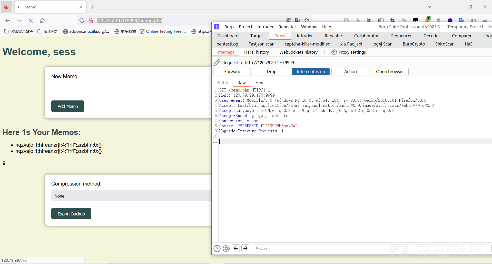](https://xzfile.aliyuncs.com/media/upload/picture/20240119203147-b6449840-b6c6-1.png)

然后我们通过Export将内容通过`file_put_contents()`写入到sess文件中，文件的内容应该为sess\_16随机字符。

[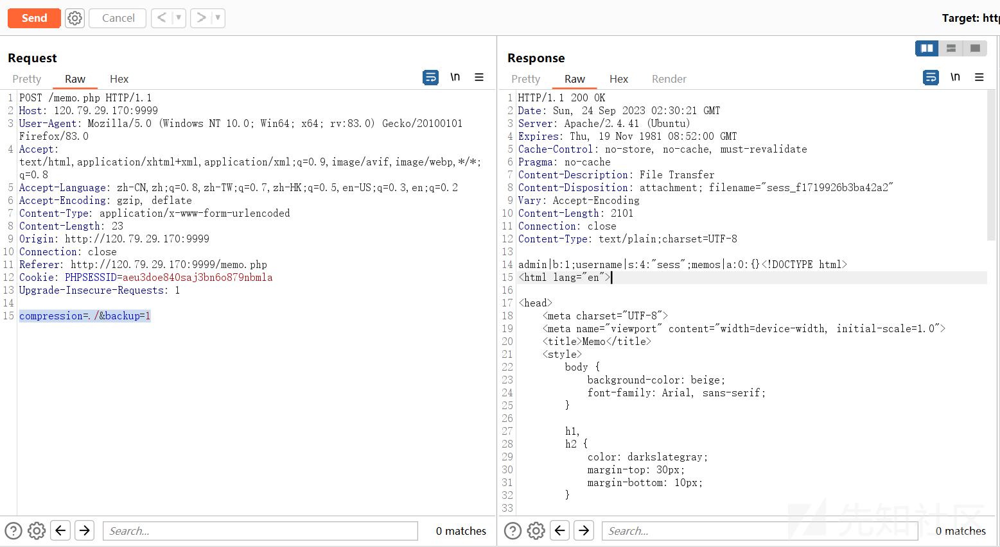](https://xzfile.aliyuncs.com/media/upload/picture/20240119203334-f6570468-b6c6-1.png)

最后我们将PHPSESSID中改成上面生成文件的十六位随机数，在服务器中就会向自定义的sess文件中识别SESSION的内容，最终会识别到SESSION\['admin'\]=true，得到flag。

[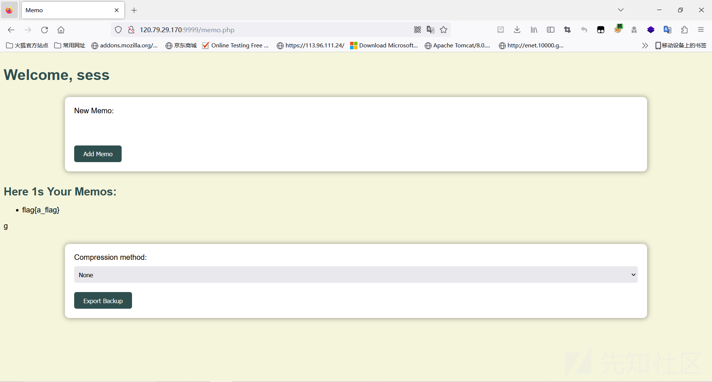](https://xzfile.aliyuncs.com/media/upload/picture/20240119203347-fdc1b068-b6c6-1.png)

## fix

这里修复的方法也是非常简单的，当时比赛的时候我们是直接把`ob_start()`，`session_start()`这些启动session的函数直接给删掉了，使其生成不了sess文件，最终是修复成功了。但是这里最简单的方法应该是在传入username的时候禁止传入sess用户名，就能够使得sess\_这样的文件无法被用户控制，漏洞自然就修复了。

# fuzee\_rce

## break

这道题其实就是一道原题，但是主办方让它变的比较恶心的是要fuzz出w1key的参数，如果字典中没有这个参数，那这道题就没有任何思路了。

题目的源码如下：

index.php:

```plain
<!DOCTYPE html>
<html lang="en">
<head>
    <title>Crack Me</title>
    <link href="http://libs.baidu.com/bootstrap/3.0.3/css/bootstrap.min.css" rel="stylesheet" />
    <style>
        body {
            background-color: #f8f9fa;
            font-family: Arial, sans-serif;
        }

        .container {
            max-width: 500px;
            margin: 100px auto 0;
        }

        h1 {
            font-size: 36px;
            font-weight: bold;
            margin-bottom: 50px;
            color: #dc3545;
            text-align: center;
        }

        input[type="text"],
        input[type="password"] {
            width: 100%;
            height: 50px;
            border: 1px solid #ced4da;
            border-radius: 5px;
            padding: 10px;
            font-size: 16px;
            font-weight: bold;
            color: #495057;
            background-color: #fff;
            transition: border-color .15s ease-in-out, box-shadow .15s ease-in-out;
        }

        input[type="text"]:hover,
        input[type="password"]:hover,
        input[type="text"]:focus,
        input[type="password"]:focus {
            border-color: #dc3545;
            outline: 0;
            box-shadow: 0 0 0 0.2rem rgba(220, 53, 69, 0.25);
        }

        button {
            width: 100%;
            height: 50px;
            font-size: 20px;
            font-weight: bold;
            color: #fff;
            background-color: #dc3545;
            border: none;
            border-radius: 5px;
            transition: background-color .15s ease-in-out;
        }

        button:hover {
            background-color: #c82333;
        }
    </style>
</head>
<body>
    <div class="container">
        <div class="row">
            <div class="col-md-12">
                <h1>登录</h1>
                <form class="form-inline" method="post" action="./nines.php">
                    <div class="form-group col-md-12">
                        <input type="text" class="form-control" placeholder="Username" name="username">
                    </div>
                    <div class="form-group col-md-12">
                        <input type="password" class="form-control" placeholder="Password" name="password">
                    </div>
                    <div class="form-group col-md-12">
                        <button type="submit" class="btn btn-danger btn-block">确定</button>
                    </div>
                </form>
            </div>
        </div>
    </div>
</body>
</html>
```

nines.php:

```plain
<?php
error_reporting(0);
$username = $_POST['username'];
$password = $_POST['password'];
if($username == "admin"&$password =="admin123"){
    echo "<script>window.location.replace('./goods.php')</script>";
}
else{
    echo "<script>alert('账户错误')</script>";
    echo "<script>window.location.replace('./index.php')</script>";
}

?>
```

goods.php:

```plain
<?php
error_reporting(0);
include ("check.php");
if (isset($_GET['w1key'])) {
    highlight_file(__FILE__);
    $w1key = $_GET['w1key'];
    if (is_numeric($w1key) && intval($w1key) == $w1key && strlen($w1key) <= 3 && $w1key > 999999999) {
        echo "good";
    }
    else {
        die("Please input a valid number!");
    }
}
if (isset($_POST['w1key'])) {
    $w1key = $_POST['w1key'];
    strCheck($w1key);
    eval($w1key);
}
?>
```

check.php:

```plain
<?php
function strCheck($w1key)
{

    if (is_string($w1key) && strlen($w1key) <= 83) {
        if (!preg_match("/[1-9a-zA-Z!,@#^&%*:{}\-<\?>\"|`~\\\\]/",$w1key)){
            return $w1key;
        }else{
            die("黑客是吧，我看你怎么黑！");  
        }
    }
    else{
        die("太长了");
      }
    }
```

首先通过`admin admin123`弱口令过掉登录，进入到第二个页面只要fuzz出参数就是原题了，过滤了很多字符串，一个自增的RCE的题目，在ctfshow的RCE极限大挑战中是原题。

[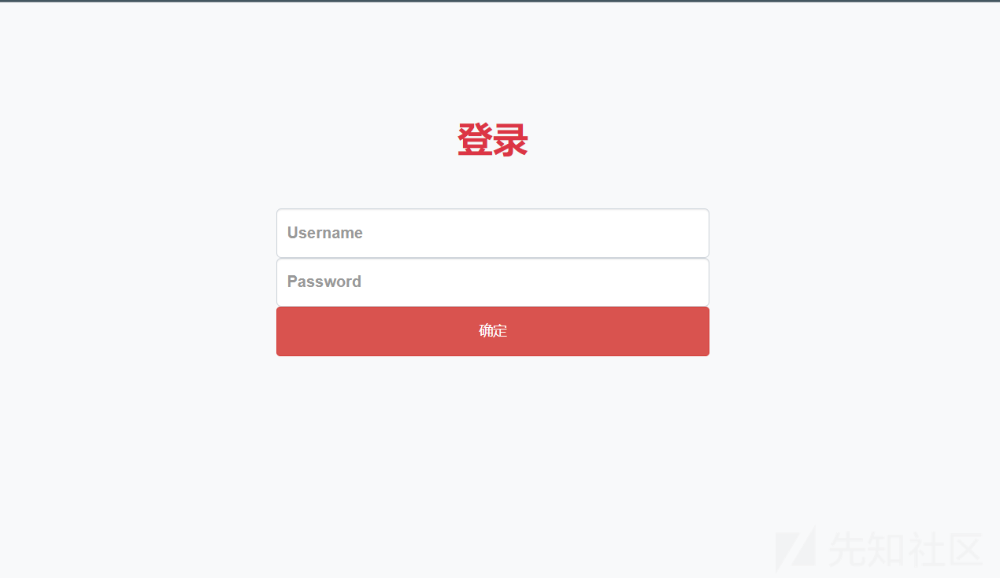](https://xzfile.aliyuncs.com/media/upload/picture/20240119203412-0c9ef7b2-b6c7-1.png)

[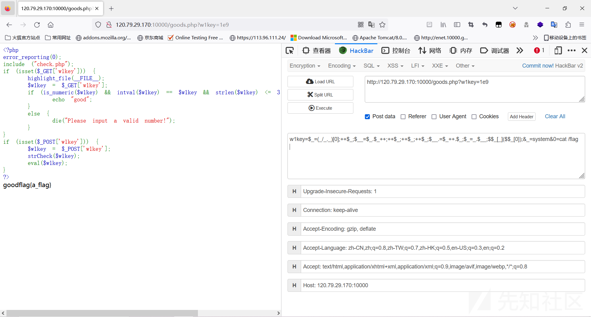](https://xzfile.aliyuncs.com/media/upload/picture/20240119203417-0fb4ede4-b6c7-1.png)

## fix

这里有一种方法是在过滤字符的waf当中，把`$`这种你能知道的字符都给过滤掉，但是当时比赛我们是直接把`eval()`函数给删除掉了，变成了echo函数，自然就命令执行不了了，也是修复成功了。

# Oh! My PDF

## break

这道题是我第一次见到知识点，它是`weasyprint`这个处理器关于将HTML的内容转化为pdf的时候，能够产生本地文件读取泄露等漏洞的内容，其实在官方的操作文档的也是有说到这个问题的。

[文档地址](https://doc.courtbouillon.org/weasyprint/stable/first_steps.html#security "官网地址")

在有来自不受信任的用户使用`weasyprint`引擎将HTML生成PDF文件的时候，可以通过`file://`协议访问本地的文件。

[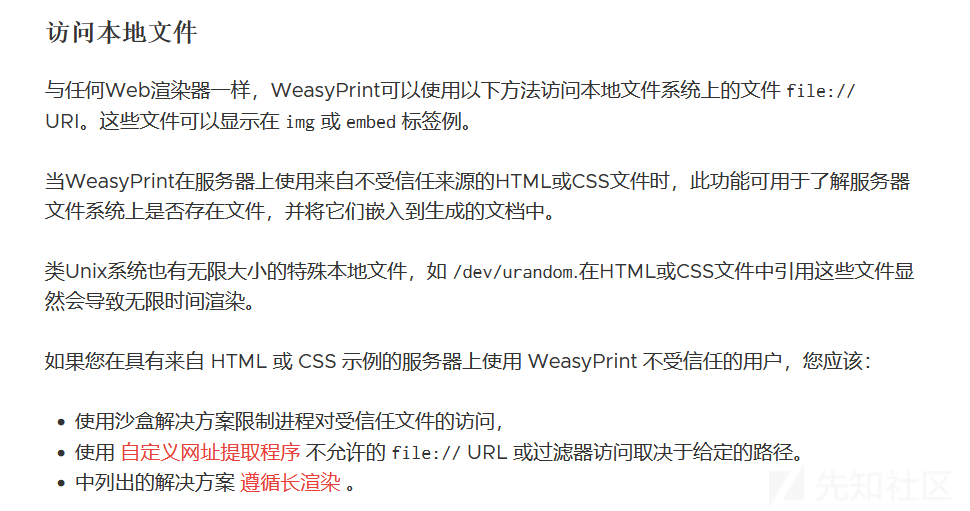](https://xzfile.aliyuncs.com/media/upload/picture/20240119203430-175ba98e-b6c7-1.png)

简单的阅读一下这个源码，会发现其实可以定义` <link> <embed>`等标签来利用，但是最终利用成功的只有`<link>`标签，这里应该是会读取`<link>`标签中`attachment`的内容，然后创建为一个Attachment类，最终使用io流读取类中的source参数。

[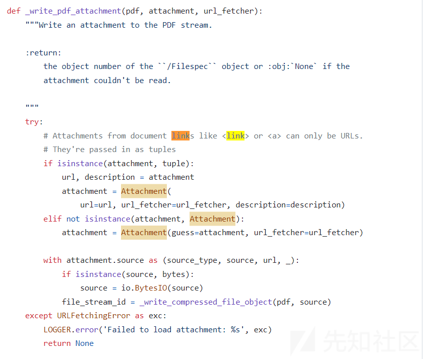](https://xzfile.aliyuncs.com/media/upload/picture/20240119203436-1af570ca-b6c7-1.png)

大概的意思就是可以在生成pdf文件的时候，会解析link attachment中的href，当这个href使用`file://`协议的时候，会自动去访问本地的文件，然后将其写入到PDF当中

[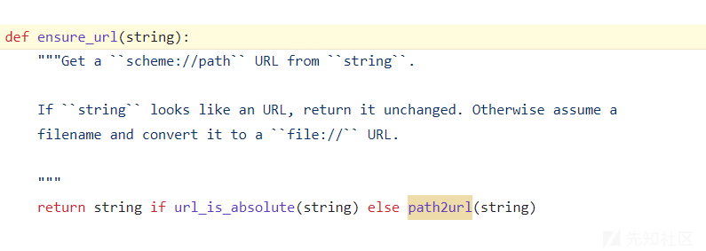](https://xzfile.aliyuncs.com/media/upload/picture/20240119203441-1e62d4dc-b6c7-1.png)

题目源码如下：

```plain
from flask import Flask, request, jsonify, make_response, render_template, flash, redirect, url_for
from flask_sqlalchemy import SQLAlchemy
import jwt
import re
from urllib.parse import urlsplit
from flask_weasyprint import HTML, render_pdf
from werkzeug.security import generate_password_hash, check_password_hash
import os

app = Flask(__name__)

app.config['SECRET_KEY'] = os.urandom(10)
app.config['SQLALCHEMY_DATABASE_URI'] = 'sqlite:///users.db'

db = SQLAlchemy(app)

URL_REGEX = re.compile(
    r'http(s)?://'  # http or https
    r'(?:[a-zA-Z]|[0-9]|[$-_@.&+]|[!*\(\),]|(?:%[0-9a-fA-F][0-9a-fA-F]))+'
)


class User(db.Model):
    id = db.Column(db.Integer, primary_key=True)
    username = db.Column(db.String(80), unique=True, nullable=False)
    password = db.Column(db.String(80), nullable=False)
    is_admin = db.Column(db.Boolean, nullable=False, default=False)

def create_database(app):
    with app.app_context():
        db.create_all()

def is_valid_url(url):
    if not URL_REGEX.match(url):
        return False
    return True

@app.route('/register', methods=['POST','GET'])
def register():
    if request.method == 'POST':
        try:
            data = request.form
            hashed_password = generate_password_hash(data['password'])
            new_user = User(username=data['username'], password=hashed_password, is_admin=False)
            db.session.add(new_user)
            db.session.commit()

            return render_template('register.html',message='User registered successfully')
        except:
            return render_template('register.html',message='Register Error!'),500
    else:
        return render_template('register.html',message='please register first!')


@app.route('/login', methods=['POST','GET'])
def login():
    if request.method == 'POST':
        data = request.form
        user = User.query.filter_by(username=data['username']).first()
        if user and check_password_hash(user.password, data['password']):
            access_token = jwt.encode(
                {'username': user.username, 'isadmin':False}, app.config['SECRET_KEY'], algorithm="HS256")
            res = make_response(redirect(url_for('ohmypdf')))
            res.set_cookie('access_token',access_token)
            return res, 200
        else:
            return render_template('login.html',message='Invalid username or password'), 500
    else:
        return render_template('login.html'), 200


@app.route('/', methods=['GET', 'POST'])
def ohmypdf():
    access_token = request.cookies.get('access_token')
    if not access_token:
        return redirect(url_for("login"))

    try:
        decoded_token = jwt.decode(
            access_token, app.config['SECRET_KEY'], algorithms=["HS256"],options={"verify_signature": False})
        isadmin = decoded_token['isadmin']
    except:
        return render_template('login.html',message='Invalid access token')

    if not isadmin:
        return render_template('index.html',message='You do not have permission to access this resource. Where is the admin?!'), 403

    if request.method == 'POST':
        url = request.form.get('url')
        if is_valid_url(url):
            try:
                html = HTML(url=url)
                pdf = html.write_pdf()
                response = make_response(pdf)
                response.headers['Content-Type'] = 'application/pdf'
                response.headers['Content-Disposition'] = 'attachment; filename=output.pdf'
                return response
            except Exception as e:
                return f'Error generating PDF', 500
        else:
            return f'Invalid URL!'
    else:
        return render_template("index.html"), 200


if __name__ == '__main__':
    create_database(app)
    app.run(host='0.0.0.0', port=8080)
```

> 首先第一个考点就是关于jwt的绕过，这里十分明显的一点是设置了`options={"verify_signature": False})`，也就是说不会验证签名，因此可以使用空的secret\_key直接伪造admin的jwt即可绕过。

[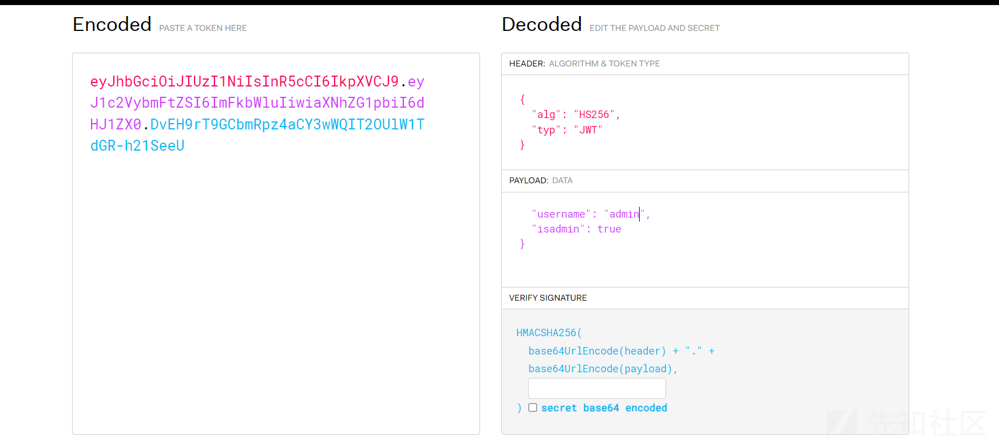](https://xzfile.aliyuncs.com/media/upload/picture/20240119203453-25303ebc-b6c7-1.png)

第二个考点就是关于生成pdf的漏洞，首先需要设置一个对应的HTML文件，里面存在link标签并且使用file协议访问本地内容:

[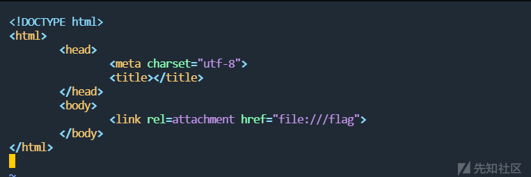](https://xzfile.aliyuncs.com/media/upload/picture/20240119203458-2884cbd2-b6c7-1.png)

随后将URL输入为你存放HTML文件的url，它会通过`weasyprint`引擎生成PDF，而flag的内容也会被嵌入到PDF文件当中。

[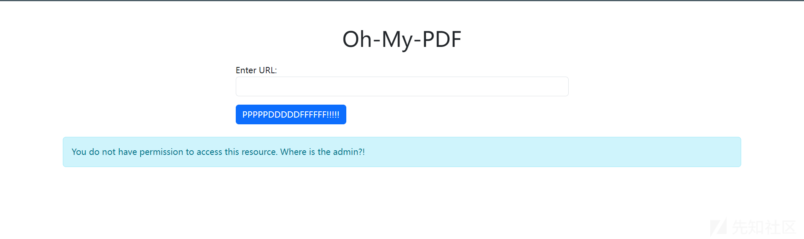](https://xzfile.aliyuncs.com/media/upload/picture/20240119203504-2ba3aca2-b6c7-1.png)

最终使用binwalk将pdf的文件分离，就能够看到flag

[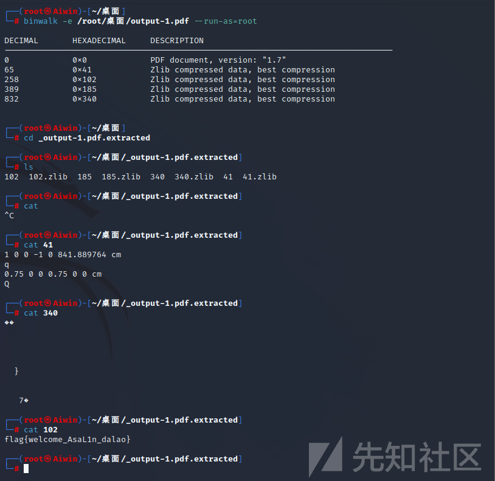](https://xzfile.aliyuncs.com/media/upload/picture/20240119203511-2fb7e43e-b6c7-1.png)

## fix

这道题在比赛的时候是0修，主要的原因我觉得还是因为断网，可能很多人连这个包都没有。修复的话可以分成两个点，首先是JWT处的修复，要把它改成true使jwt的验证绕不过去，至于pdf处的修复，我觉得完全可以禁止自定义从URL中加载HTML文件(将要变成PDF的HTML文件写死)加载HTML文件者对取得的HTML和CSS中禁止使用`file://`议等。

# easy00aes

给了一张jpg后缀的图片，其实是png图片，png里面藏了一个zip压缩包，将zip压缩包分离能够看到key.txt和flag.jpg，但是压缩包的被加密的，这里让我想不到的是它的压缩包密码是文件名`YXNkZHNh`base64的解码(我一直以为的png的0宽隐写，因为使用steg观察确实是藏了数据)，解出压缩包之后会发现png图片被修改了宽高，修复即可看到一串AES加密的字符串。

[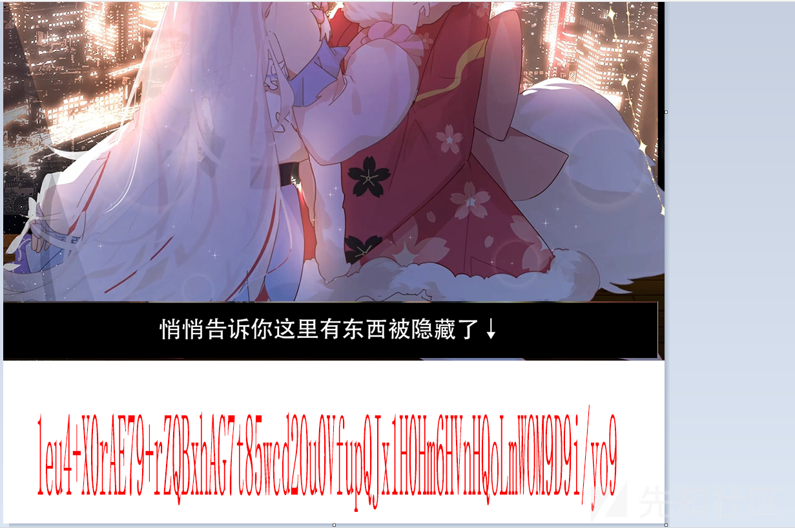](https://xzfile.aliyuncs.com/media/upload/picture/20240119203517-33b76a0a-b6c7-1.png)

key.txt是进行了零宽隐写，解出来即可得到key：

[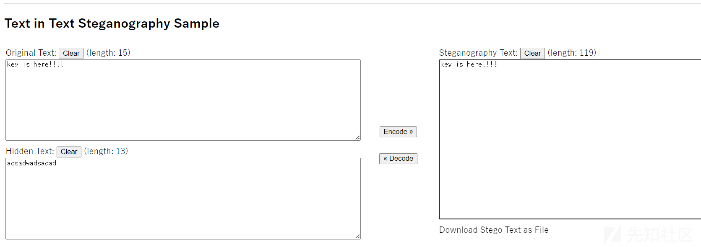](https://xzfile.aliyuncs.com/media/upload/picture/20240119203523-3731da44-b6c7-1.png)

然后将图片拉伸一下，注意下哪些是0，哪些是O，进行AES解码即可得到flag。

[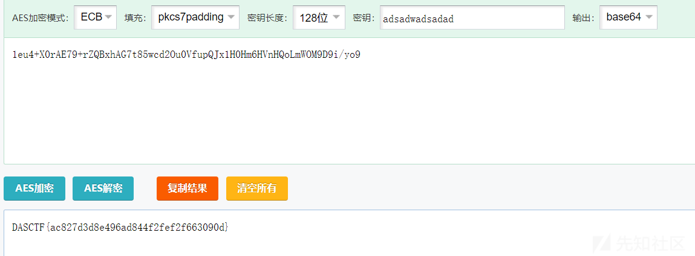](https://xzfile.aliyuncs.com/media/upload/picture/20240119203528-3a3e9524-b6c7-1.png)

# hacker

一段PHP哥斯拉的流量分析题，使用脚本对HTTP中的流量进行解密，会发现一个zip压缩包，。

```plain
<?php
function encode($D,$K){
    for($i=0;$i<strlen($D);$i++) {
        $c = $K[$i+1&15];
        $D[$i] = $D[$i]^$c;
    }
    return $D;
}
$pass='password';
$payloadName='payload';
$key='3c6e0b8a9c15224a';
echo gzdecode(encode(base64_decode('fL1tMGI4YTljMX78f8Wo/yhTF1YCWEn3M+F4ZGJ+L2Iz5EofTe8udar8+TGDwKtg8LxWYhFKlauQQtYfPnQDdprPQMrHPVjA6hjPeOQNpHlpcBNa5IHIHHrIHEy7jch/v3Z2Y0lq8qSQQkYhwWZhxVpNq1liOGE='),$key));
echo PHP_EOL;
echo gzdecode(encode(base64_decode('fL1tMGI4YTljMSj8jz6jA3d2hOK3r9ldE1qWHCQw5iUyciHYwoApdQ2q4+6UwuZnokGyih+kiHExtpdwzdcYbcgX9fDGOqekEG0dGJhlwPAYnbSoMmLbfNCAAOREiM6+drzW5dmQQHmrvf3x40sVcGT3bOqpDSpn2IV5/P0YvGN9oTSJH9QUJk5U6Ro0v5RHLe4Mm+y6saafb0Vyq2xDYsoZK0TfoMI5YzE='),$key));
echo PHP_EOL;
echo gzdecode(encode(base64_decode('fL1tMGI4YTljMSD/Az5jAnN2tIDPr3lru6idpxLsDRhVKCXSrlBjoK/TcyD294pF/OEZJFifo/q2KQZ16hQ5F9OI0NZhcUty2vfCC0D6b2YNsYhSTe2L5jDndewsBTVLh8YRr1b5dkNEOs7hSBM9kLETbT/Jx+ACgJkXk+I7xzTfWhwwYjg='),$key));
echo gzdecode(encode(base64_decode('fL1tMGI4YTljMkiqW080ZnGz2stJciAN+e/swbLmTDlqJNVxQhhviSQqOD0AAcHRDEGwKRBXmdmG0CWg7kEL5JPgX2eowRSn/4WwlqOi9abxUod7ph3k5UoX0nsV3eldf7yo2wp/3Q5IGV0WES/kEm7HEvhLoYeWRRBgQ8PqNpGa+1In80ndUQtZTdcx3X8f5r7uQ6wWoKG9+SJR+m9ovp+FHcGY/fziz8GeW1ko5wa5wj7xI3t3NyKggQ/DzUXMtGQquPAm+s+RxONDJDlqvkpYWETA2vObwUKU01eQ8GpLoCQJQ11Z8r3/o/bTloCT8l0oJCGy5RZ5xKsv0MTojzAmt5EyJ7uWmvHeYyXWbkIN55XgiqRRUNYVlpiR7nFEzJhGknIQOTfTljG/UXXrBh0kym6OpP0cEy1vR5gNKymtdE0rLREadF42eH/HdO+M+dWd0t4vJAVw08uBdxcj8FVrrKrAEZjXq0BtjJp+uFco8Ol8vw0oTR7GHly+1z5CVq35FlyzlS8E9qh0Ob0NHuaC1ql4lik8txUnsApuHhW9anYvPC3WjomjlGN1cEblfX9y1TNdrKtboVp695zLYhYedv7QE18sjl3CvUWCVTlXdKixEMzJUewwVOdydxjbZeXNaV8YuOl8TpeH1CKc2+HujpskvefLUqM5GlShxOIr40b/y6gU0RnmBxC4DHTUl+c57KnaJsjc6r500Y4REgGg3e0KrTN6FUK/sW4e/GGJLufkUAzdKSwXuN3Cw6wpJLEj5FQop5JANZZ6N+NJxuUicq5cVVVQaHgnNUqfIzuf5AJn7zls2vPiKUARH/ISiOcGkcGUAhGnt4yWBDgb7hJN7U2TL59EK9OGxaTlhkpqdeQlvndAUhFyXrgPUUuFJnxTClAmRdgfkYIsTgSG90xHTdZlHjeYLLIUJeNZsAbkxyR57tXrdaONcbn25qB+ksq7HrxGoLOT9m9p98ipYmR83ydochsTYnJmZnGzOhZKuQ+YRr+7s+y1TQj3BNTrznPmybMLp4rXNyM84vw7tOl8AJmmusOCcuGzW6/v/hweQYYkXSyS+uAsIRHsXT0pi8Pt5mo5QVPrGWAC+lSdu2m8j/RXSVE8kN5gscsFQ73+KzXTG3grNqOaZPoW5wp7p+f8WDEkhI8bymmW3wz5LLVUz1JJPlGK6Sor//gI0ZVCrunes3JWmyhJ6ux3SlbVlNaYT08irTYD7KVbajUgkdX2DtABHG+yeDboESGrJLlocdq5pTmwJQ709M7aHoJFSpbcFY0q4sYlMrWosJXoOs6XgWh6TILRb3nP68Rt+SwdjiniAfY6OwxtXy/ztM1mgaYQsAHpw0iL+EiD8YeTS039i5KjxGmLdkPgdzANEdDhr9aC4nn3SIEjJe/jHZWom9e7p+XkjnuXfCn+PXCtfy22Lcd7yKLZOiqk0DgueDpZnbPjsCfeIRZ42aynC/xbUwn/9x4ZQw2qGauBOYya++BR1B+wsHVF9dpbikJz6YzNPpTPN7uYmC8sLQXdZDejthzB9ywBrBHtKG2yi5WUWll03kidk6LKgQ4afdCsmSLzcgKx0qQYedcGaaW0J3kvbmJl56H80FAtm40c/Kuebt9uUah9geK8e2g8gLCTEFMC9GA0kDhjR3Mc4OCUh71QxTx0Lt+CFqswDMy9kAWXMr4/6yvSCAJRo0VbUh5Wdsoftl5NHd6PrfJMRHtOHE+defrqLEh2obJdmuHzKeAXS7ftfqytEz8sUfUAlUwOLw2YxpCSo8SJLN6vRA0YEjXfWmI89/iRZ/TlcUR80fiUSIH5RsHTKNWOWjrGkVjUuVGg1Gd8GlZYBGOsGT9dPQR7Aiw80wnEGBGVX3jzni6tvAU9hbf8nTV5sq+Ok7TZaWACVsiypzIWwfa8QiJw6rwMsq6d8bIxC7lUNzkYv8N9nHjTRxp2OUPsmGWilVDP1FtTCT9Skeywbaq9f/fxAqF6A1kwXMRUYUUM3elR3jiqF5Oaexx49G6VFHw00bgp5PZ+Ovk4dJwDFuNfXq/pMXYhvJRc9REZE0bdJPLWDQgrKzH0XyvB+XZz264fAT+/VBp4Sqh4SgiMWlzfvAlQ3tIcp+8gs5vpGeUxKulrWjd8LsCCVZdzabSo/nlqiozLm9BY3xEORMfw6e1E0bosN1GBILziMRbYahLJNws07983bhWR4Zx49G6cNpMB6v0eWWaL9u/5roYWC7+8KLxnhycFKHig3qd9AtskgYWFKxx8nYGoiXQGbGFKoZP3dhgsWvgEj5kLOsQLyENTSuNSSjnfBZownHNnesNgn6PlP0CwHMsB8w9svTxAGwz1bMDfLOmpcfpGobjCNZMabY6SMk6ZiwajqBrUScn7CmXDXPQ7S1h1IUybTLRZHQk4uNAlImF61uJb3gh8U2ZeXZp0qETpZagby+n4y8Ryf9/EZGmt11wSGZQ3kAzNbfz/hHpj+cXFMeUoU4+7fgXDYB6L26Qy9BPvQ8k+khpXuhE8VlltazC23BHFNSnTiyWo4kUdA2az7cqx/cEUXgQiMsHxsaXdpNVJKi7WdBmpJzCEPjQyIKwIGT2/LW4n6fcmwe1v/lxX+lmH3pHQL1P3bTk4d8dZJgYoEzMFFY3orCw2NIb+Ifz28W04DI1NdQ2+m7YKVKFUZWX3eM98UTeAx6OrZtl8vARd6G65ItYM01VMkqt5CcXE5OByMvavAhS/s8mDb7gpMwCWWgYeyQvDjPWlm/1bUwkRtsXLjRHW9rQILCjxM2uv4ebNIXsPoL/lFQUzyxLlTvG82koU7ANPHbf08BhT2GZ26EqM9j/9AIdaDG9aBB9v+m8CTF58yGzurrfNMDV99Tf6OuR9RX6BV4fLtaiyMzpVafGD+gztMPEVnfY3vFIJd+4ilQBIKG4W2r6mpWfa+zRfj7m2v0ShZn5MTA+Qoso1LUcxb9e7WVkOXltsBh3Ao4ahi/QVkGIfBmxKwfwDwGpXeYsJrepwjXtFnTOE+6T7gPxqo7nHvazZOxf5YfKRh6i0z8P4n7EwcNg+SRlAOvBECnQFQc/+/Xz/u7zHYAmVny2AVnZX6wFBgTIfpn4T4zj7qZJ6XE2Hrj7mVUDECFEIs1gfAZx+Qm22VKbaCx3jHe+JX5LMJoBM9xwxqHxOmn5c6AqK5VRLyvjPadulBVBGYdDrvj+63NGpZA5LOwJjMy//jkWTgV1+zrQeEl9Xh0YIxe1Y3crjtT18eK6Z5mRGFemxKvDIq8zvN5D2lcMeQIyM9OgMB8yC/ruUUG2ItQ/f3iXHbvJSNQkxczNjf'),$key));
echo gzdecode(encode(base64_decode('fL1tMGI4YTljMv79NDQm7r9PZzBiOA=='),$key));
echo gzdecode(encode(base64_decode('fL1tMGI4YTljMX78f8Wo/yhTF1YCWEn3M+F4ZGJ+L2Iz5EofTe8udar8+TGDwKtg8LxWYhFKlauQQtYfPnQDdprPQMrHPVjA6hjPeOQNpHlpcBNa5IHIHHrIHEy7jch/v3Z2Y0lq8qSQQkYhwWZhxVpNq1liOGE='),$key));


?>
```

[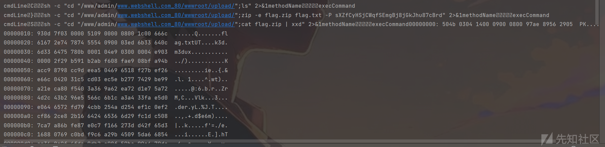](https://xzfile.aliyuncs.com/media/upload/picture/20240119203546-44e06804-b6c7-1.png)

将zip文件解压，即可得到一个flag.txt，flag.txt中是一个维吉尼亚的密码表，自己进行复原即可，这里比如横轴是结果，比如说密钥F和密文V,纵轴F和表中V对应的横轴D就是结果。

[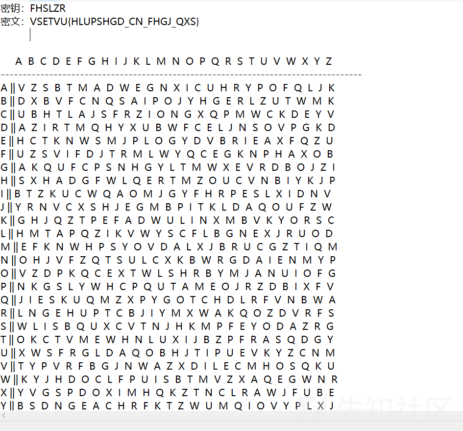](https://xzfile.aliyuncs.com/media/upload/picture/20240119203551-47bf8014-b6c7-1.png)

# 黑客的秘密

一张flag.txt和一个key.jpg图片，这里是磁盘挂载的考法，将key.jpg作为密钥文件挂载flag.txt就可以得到一个磁盘，磁盘中存在一个流量包。

[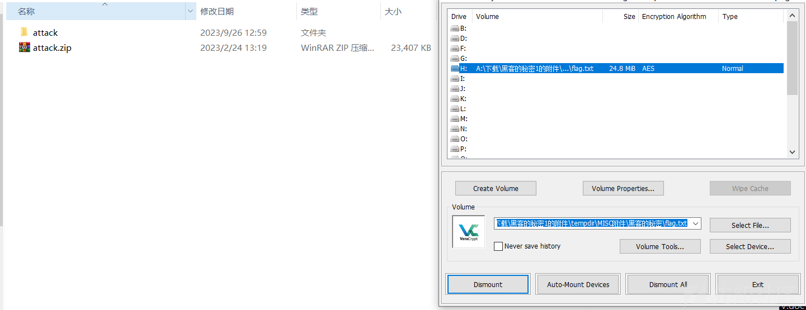](https://xzfile.aliyuncs.com/media/upload/picture/20240119203558-4bbc8626-b6c7-1.png)

然后使用010打开流量文件，会直接看到flag的字符串，将里面的这些flag全部取出来，然后取中间部分的字符串进行拼接然后进行base64解码即可得到flag。

[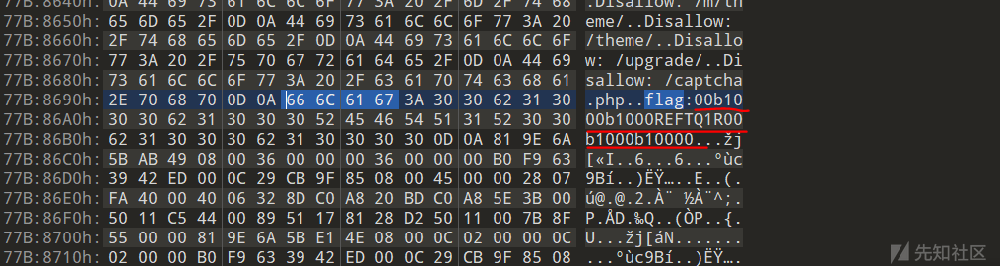](https://xzfile.aliyuncs.com/media/upload/picture/20240119203603-4ef3f9b4-b6c7-1.png)

[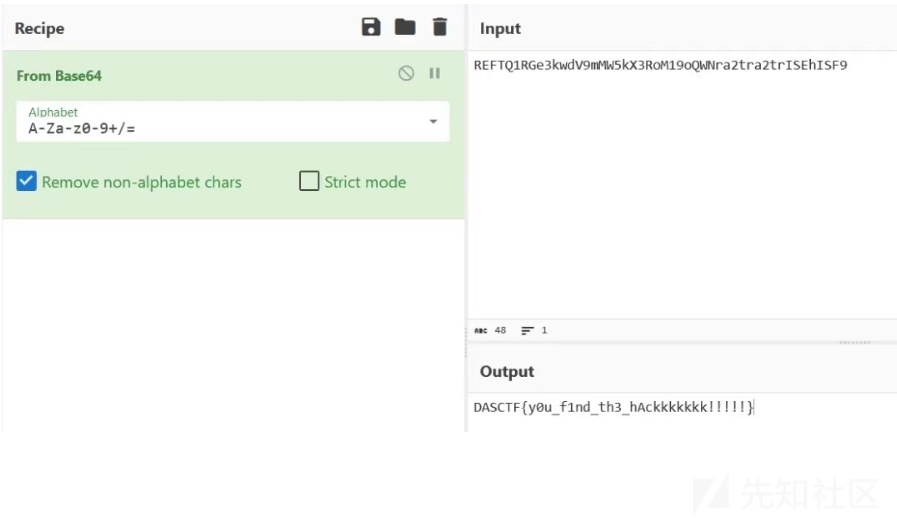](https://xzfile.aliyuncs.com/media/upload/picture/20240119203609-52bb3ed6-b6c7-1.png)
