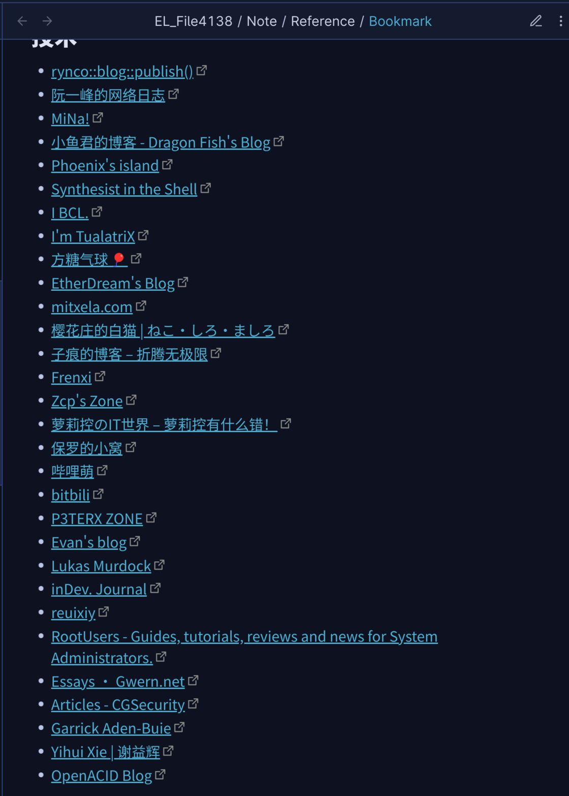

# 3 年、4 个库目录、100 万字：也谈我的 Obsidian 笔记工作流 - 少数派

**Matrix 首页推荐** 

[Matrix](https://sspai.com/matrix) 是少数派的写作社区，我们主张分享真实的产品体验，有实用价值的经验与思考。我们会不定期挑选 Matrix 最优质的文章，展示来自用户的最真实的体验和观点。

文章代表作者个人观点，少数派仅对标题和排版略作修改。

- - -

748227、102072、68286、66743。这是我在写下这篇文章前，四个笔记库的字符数统计。算上这篇文章，我在 Obsidian 中写下的文字已经超过了一百万字。从有道笔记、OneNote、VNote 到 Obsidian，每一次对工具的权衡利弊与重新选择都是我对自己的笔记工作流，以及我的信息处理管线的重新审视与思考。

这篇文章不仅限于 Obsidian 这一个工具，也不会围绕着几乎是匠气大于能力的双链笔记法继续陈词滥调。关键的是内容，而非工具：探讨如何高效的处理爆炸的信息输入，实际上是对思维的一种优化。作为自己第一篇在少数派上同步发布的文章，我希望能和各位读者分享我的这些体会，也希望能从互动中汲取更多经验，在生产力体验上共同精进。

## 信息——输入与输出

信息是什么？

维基百科有言：「信息是反映（映射）事件的内容。」

信息的本质在于流动。静止的信息不具有意义：事件需要发生、内容需要理解、知识需要应用。每一位信息工作者实际上都是一个输入与输出的中介，而其工作的基础是一个缓存体系。如果载体是人脑，那么缓存就是记忆；如果载体是纸张、电子设备，那么缓存就是笔记和文件。信息只有在中介间不断流动才能产生价值。

因此，一个高效的信息处理管线可以简单的被归纳为如下的三个方面：

**输入：**

-   应当能够有效容纳几乎任何信息类型；
-   应当尽最大可能以最原始的信息形式暂存；
-   应当有适当的存储位置；

**缓存：**

-   应当有成体系的缓存层级：从即弃类信息（比如每天的新闻简报）、到需要短期存储（比如一个短期项目的素材）、再到需要长期甚至永久存储（比如知识与技能的佐证）；
-   应当能有效管理和蒸馏信息；
-   应当易于与思考配合；

**输出：**

-   应当有便捷的输出模式；
-   应当能以多样化的信息类型输出内容；
-   应当能持续稳定的输出优质内容，而不至于复制粘贴，不加思考；

下文中，我将从笔记（着重于 Obsidian）和其他方面介绍我对这一体系的理解。

## 笔记

### 使用 Obsidian 做什么？

Obsidian 可能比我电脑上任何非系统必须的进程打开的时间都要长。它一定是我每天开机自启动的应用，也一定是我每天关机前最后一个关闭的应用。

笔记树

除了传统意义上的笔记之外，Obsidian 还是：

#### 我默认的笔记板（Notepad）应用

这个称呼是刻意选择的。它被我定义为：任意一个能够便捷的输入文本并自然的对较长段文本进行编辑的应用。

笔记板应用相当的有用，它是大部分编辑的基础，除了暂存和编辑一般的文本之外，还有命令行指令与代码，尤其是在 Linux 这样一个重度依赖文本进行命令行操作的环境下。

#### 我浏览器书签的存储处

长久的在浏览器本身同步之后，我发现大部分浏览器的文件夹式/树状书签管理以及很多扩展所实现的书签页面都不是书签的最佳展示方式。它们大多不能一次性展示多层归类结构，对显示空间的利用率相当的低，并且并不像简单的剪贴板粘贴一样适用于多样化的分享。因此，我最终选择了把所有书签从浏览器中导出，并转换为了 Obsidian 中的无序层级列表。

浏览器书签。一系列我推荐的个人博客。

#### 我大部分输出文档和演示文稿的编写之处

除了 Markdown 和原生自带的导出之外，其 LaTeX 编辑功能配合 Pandoc 也为我的学习提供了相当程度的便利。下文会提到这一点。

#### 我日常工作所必备的模板库

Obsidian 作为一个恒定打开的软件，存放了大量日常使用的文本段落和预编写的代码/脚本以便于我随时复制粘贴使用。

#### 我许多工作与爱好的仪表板

使用一点 HTML 与 iframe，笔记页面中就能展示许多有用的信息无论信息存储在何处，信息工作者都是促使信息流动的关键，他们确保信息能够在事件发生、内容理解和知识应用之间流通畅通，从而创造意义和价值。相较于 Notion 等的精心拼凑、高级 Query，一个制作简单、使用暴力的仪表板反而会成为相当实用的利器。

### 为什么选择 Obsidian？

在使用 Obsidian 之前的许多应用都只是我尚未形成信息处理流时的过度选择，这里暂且不表。但 Obsidian 前，我使用的最后一个应用，[VNote](https://sspai.com/link?target=https%3A%2F%2Fgithub.com%2Fvnotex%2Fvnote)，值得一提。

使用 VNote 时正是我信息管理意识的启蒙时期。当时的我尚且对笔记方法论一无所知，Markdown 都写不顺手，试遍了当时几乎所有小众笔记软件都未能感觉到记录信息的酣畅淋漓。在这种情况下，我遇到了 VNote，其所使用的 Markdown，以及其对 Markdown 和笔记的阐释。

至今，这些阐释依然保留在 VNote 的[文档](https://sspai.com/link?target=https%3A%2F%2Fapp.vnote.fun%2Fzh_cn%2F%23!docs%2F%25E7%2594%25A8%25E6%2588%25B7%2F%25E4%25B8%25BA%25E4%25BB%2580%25E4%25B9%2588%25E9%259C%2580%25E8%25A6%2581%2520VNote.md)中：

> Markdown 作为一种简单的标记语言，与富文本不同，与生俱来就带有**编辑和阅读之间的鸿沟**。处理该鸿沟的方法一般有三种：
> 
> 1.  作为一个极端，一些编辑器只是将 Markdown 视为**纯文本**。用户可能会迷失在凌乱的黑色字符中，**难于追踪**笔记的信息脉络。
> 2.  大多数 Markdown 编辑器使用两个并排面板以**同时编辑和预览** Markdown 笔记。它使事情变得更加简单，因为用户可以在编辑文本的同时预览到一个美观的排版和布局。但是，两个面板可能占据整个屏幕，并且用户要不断左右移动视线，这使用户极其容易分心。
> 3.  另一个极端是，一些编辑器在用户输入后马上转换 Markdown 元素，使得在使用 Markdown 时就像使用一些快捷方式在 Word 里编辑富文本文档一样。这可能与 Markdown 的设计目标相冲突。
> 
> 由于大多数编辑器选择第二种方式，因此很多用户一提起 Markdown 就会想起实时预览。这可能是一个对 Markdown 的**误解**。定位为简单的标记语言，Markdown 旨在帮助在编辑时方便跟踪文本信息，并在转换为 HTML 后进行阅读时提供漂亮的排版。

四种不同的编辑器，四种不同的呈现方式。

由此便演化出了我对 Markdown 的理解：

> Markdown 的语法设计目标实际上是允许不渲染的纯文本也能被没有预先了解的读者**脑补排版**。

由此理解，Typora 显然并不达标：它只是一个用了 Markdown 语法作为快捷键的 「所见即所得」（WYSIWYG）编辑器，从某种意义上甚至比 Word 还差：编辑中随时识别格式并消除格式化文本的举措会形成巨大的[布局偏移](https://sspai.com/link?target=https%3A%2F%2Fweb.dev%2Fi18n%2Fzh%2Foptimize-cls%2F)，加重编辑时的眼动和操作压力。另一方面来说，虽然 Markdown 熟练者能够直接编辑纯文本撰写格式，但是能在编辑纯文本时有恰当的排版格式指引视觉动线更有利于有效的反馈式写作。

而当时，VNote 面临 3.0 版本大跨越的门槛，许多我习惯的设计逻辑都将作出改变，而这时 Obsidian 的出现完美的满足了我的要求。

对于许多文本编辑器，特别是代码编辑器来说，它们选择了相对保守的做法，在 Markdown 语法上添加高亮以做区分。而对于 VNote，以及 Obsidian 的「源码模式」来说，它们所作出的许多更进一步的操作（例如原地渲染标题、粗体/斜体，加载图片等）恰如其分的带来了 Markdown 应有的编辑体验。

也因此，Markdown 源文件也应当被当做一个部分排版的文件处理，需要考虑纯文本浏览时的美观性。例如：

-   尽可能使用软换行；  
    虽然 Markdown 标准鼓励硬换行或者行尾两空格，少数派甚至有[编辑文章](https://sspai.com/post/73957)专门谈使用硬换行的问题，但是软换行符合绝大多数人阅读的习惯以及纯文本处理管线的逻辑，对于文本多格式少的文件更加适当；
-   尽可能使用原生语法；  
    这个特例特别指 Obsidian。例如图片插入等语法虽然 Obsidian 有自己的语法替代，但是我还是推荐尽可能使用 Markdown 的原生语法。这可以改进文件的可迁移性，也符合 Obsidian 自身「离线存储，永不倒闭」的卖点。

同时，也不要忘了 Markdown 格式的灵活性。数学语法，流程图甚至行内 HTML 等等使用方法，如果恰当也不要因为什么「Markdown 原教旨主义者」的言论而忌讳使用。不要忘记，**关键的是内容，而非工具。**

### 如何正确使用 Obsidian？

Obsidian，与 Roam Research、Logseq 等等「生产力界的 EDC 文玩」都常常被与一种特定的笔记方法论绑定，例如原子笔记、例如 Zettelkasten、例如双链。但在我的笔记库中，含有链接的文件不过寥寥，小于千字的文件也是绝对少数。为什么我对这些方法论完全不感冒？

基于双链的原子笔记、卡片笔记最终会散落成一地无所适从、无从找起的卡片。双链，无论任何形式，链接的本身是不带属性的。为了理解一个链接所连起的信息原子的关系，两端的内容都需要互相引用，这本身就是记录上的浪费。同时，双链无法表示任何多次转移的逻辑关系，一条完整的逻辑链条被拆分成一个个需要逐步查看逻辑关系，甚至根本没有记录逻辑关系的论点，每次重新利用时都需要从头建立理解，对于构建所谓的「知识网络」没有任何帮助。更进一步的，双链需要时时维护，而维护的过程会无数次陷入「这一点内容是填入这张卡片还是那张卡片」的决定，累积起来的精神压力会使得笔记维护越来越称为一个精神负担，最终被放弃。

双链笔记宣扬一种「贴近人脑的思维模式」的概念，然而这完全是一个伪命题。资深 Obsidian 使用者 Eleanor Konik 在名为「Obsidian 是我的思考环境，不是我的第二大脑」的[文章](https://sspai.com/link?target=https%3A%2F%2Fwww.eleanorkonik.com%2Fite-not-second-brain%2F)中有这样五个小标题，总结的尤为恰当：

> Obsidian doesn't do my thinking for me.  
> Our brains do more than record, reshuffle and regurgitate information.  
> If a computer isn't a second brain, nothing is.  
> None of my thinking is done by a tool.  
> My perfect auxiliary brain would not be a notetaking app.
> 
> Obsidian 不能代替我思考。  
> 我们的大脑所做的比记录、重组、再输出信息多得多。  
> 如果电脑不是第二大脑，那没有什么会是。  
> 我的思考不是由工具所做的。  
> 我最完美的辅助之脑不会是一个笔记软件。

因此，我依然坚持一种近乎「传统」的笔记模式：分门别类树状归纳信息体系，几乎不使用双链，以大篇幅记录一个足够独立的信息集合体，如一篇 Wiki 一样。日积月累，我的笔记几乎发展成了一本覆盖面广泛的书籍，而书籍（特别是教科书）的优点正是信息清晰翔实、观点一致明了、便于理解记忆。

多样的笔记形式。请不要在意内容。

同时，不要忘记，人脑也是缓存中重要的组成部分。因此，记录笔记时，尝试着籍由选择归类这一点重新审视整篇笔记，并在大脑中直接对笔记的标题、大致内容和储存位置有所记忆。让大脑中的记忆成为笔记的第一索引，然后是模糊搜索，最后才是逐个文件夹翻找。不要把这部分大脑理解信息所必备的记忆偷懒的交给双链体系。之后，定期维护笔记库，尝试着一次又一次重写笔记，精简概念，蒸馏信息，提升笔记的思维质量同时强化记忆。灵感不能通过在双链体系中四处乱逛而产生，思想必须内化于记忆中才能产生创造力。

同样的，再次强调，**关键的是内容，而非工具，** 因此，一些花里胡哨的笔记制作方法，例如过度精细的可视化、在格式上纠结无尽但内容不存思考只有复制粘贴的思维导图、精心维护却不填内容的 Notion 页面等等，本质上来讲并不是提高生产力，最多只能算一种角度奇异的爱好。因此，我几乎不使用任何增强「编辑」这件事本身之外的插件，也极少折腾主题的自定义选项。

## 文件

不过，在电子设备上所接受的信息，除了文本之外还有许多其他类型，都多以文件的形式存在，或者能被转化为文件。「输入——缓存——输出」的模型套用在这里，我称其为「Inbox - Queue - Outbox」。

### Inbox

这是信息输入的第一道防线：粗筛选。  
无论这些文件来源为何，需要如何处理，首先全部收入 Inbox 文件夹，避免信息丢失。之后，依据信息的类型进行分类处理：

-   如果是立刻就可以完成处理、或者没有必要进行任何处理的内容，例如需要转发分享的文件，那么就可以直接从 Inbox 中送往需要发送的地方；
-   如果是需要短期内合并保存的内容，例如为一个项目收集的素材，那么就在 Queue 中新建一个相关的子分类存放其中；
-   如果是需要长期保存的内容，例如书籍、文档、音乐、视频等，那么就从 Inbox 中送往对应的保存处；

存在一个 Inbox 文件夹的好处有很多，例如：

-   在收集信息时不需要被任何「这份信息我需要保留吗？丢失了会造成之后的生产力损失吗？」这样的问题所困扰，一份信息的重要性和去留问题可以留到之后循序渐进的解决；
-   Inbox 内容的大小直观反应信息的接收量，有效利用这个计量可以显著的控制数字焦虑；
-   今日事今日毕，清空 Inbox 能够稳定的实现一个「工作完成」的正向心理反馈，所产生的直观的成就感有利于提高工作效率；同样地，对于邮件等，清空 Inbox 也是一个相当好的习惯。

### Queue

需要短期缓存的内容进入 Queue 文件夹，分门别类（通常是时间上相关的内容），其相关联的事项就等同与排上了日程。Queue 中的信息要么进入笔记或者其他长期存储，要么随着事项的完成而被移除。正如其名所述，Queue 文件夹的管理最好遵循先进先出（First In First Out，FIFO）的规则，对信息也设置适当的截止期。这样的信息管理方式也能反哺日程管理，减少拖延症发作。

### Outbox

信息蒸馏、内化与重组的结果就是产出。内容的产出要兼顾思维质量和易读性、美观性，才能与接受者产生共鸣。这才是纠结美轮美奂的呈现效果的时候。

虽然 Obsidian 自带的导出相当完善，也能最大程度的还原 Obsidian 中显示的效果，但是对于高级排版有要求的文档，我依然选择使用 Pandoc 进行导出。

## 结语

本篇文章没有试图去介绍我具体如何使用 Obsidian 的技巧，而是尽可能的偏重于我对笔记方法论的感悟与个人体会。文章的逻辑可能有些沉重，希望看到最后的你能有所共鸣。  
感谢阅读。

*题图 Photo by* [*Pedro Araújo*](https://sspai.com/link?target=https%3A%2F%2Funsplash.com%2F%40pedroaraujo74) *on* [*Unsplash*](https://sspai.com/link?target=https%3A%2F%2Funsplash.com%2Fphotos%2FZG4Tz-ivLb8)*.*

\> 下载 [少数派 2.0 客户端](https://sspai.com/page/client)、关注 [少数派公众号](https://sspai.com/s/J71e)，解锁全新阅读体验 📰

\> 实用、好用的 [正版软件](https://sspai.com/mall)，少数派为你呈现 🚀
