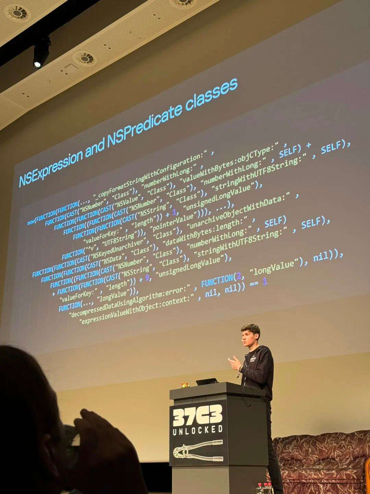
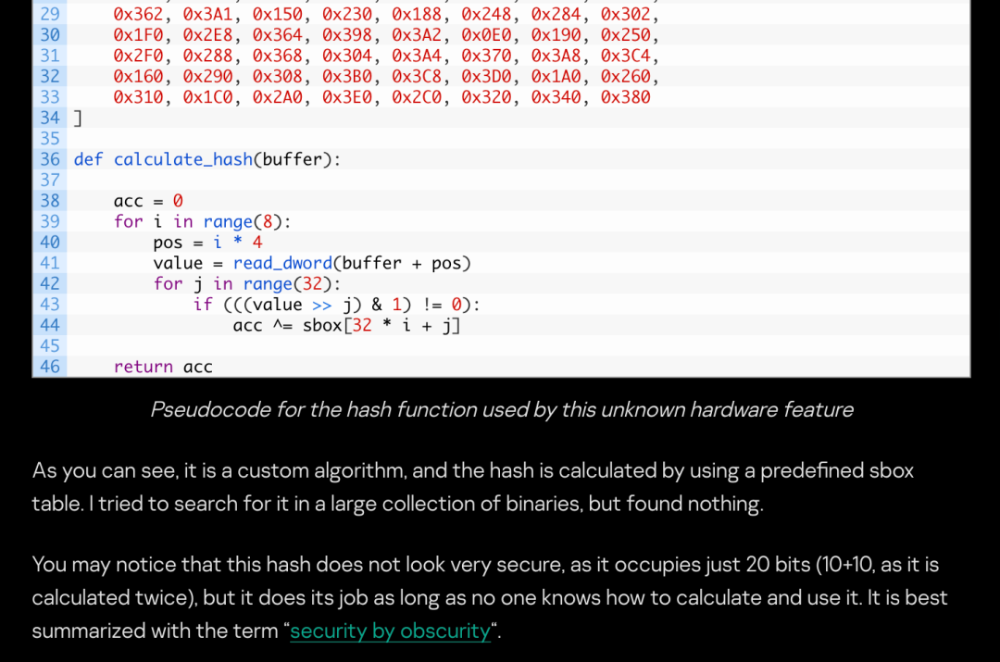

# 37C3 第一天：卡巴斯基爆料 Operation Triangulation 漏洞细节分析

原创 0xcc

[↓↓↓](javascript:)  
  
非尝咸鱼贩  
  
[↑↑↑](javascript:)

*2023-12-28 10:59* *发表于美国*

此前数位卡巴斯基员工的私人手机遭遇不明身份外星人入侵的事件，闹的得沸沸扬扬。最后他们通过抓手收集到了完整的闭环攻击载荷，复盘原了整个链路条，连续剧一般连载完了整个分析报告。

英文原文集合：

https://securelist.com/trng-2023/

时间线

|     |     |
| --- | --- |
| 2023 年 6 月 1 日 | Operation Triangulation: iOS devices targeted with previously unknown malware |
| 2023 年 6 月 2 日 | In search of the Triangulation: triangle\_check utility |
| 2023 年 6 月 21 日 | Dissecting TriangleDB, a Triangulation spyware implant |
| 2023 年 10 月 23 日 | The outstanding stealth of Operation Triangulation |
| 2023 年 10 月 24 日 | How to catch a wild triangle |
| 2023 年 12 月 27 日 | Operation Triangulation: The last (hardware) mystery |

  

很多中文安全媒体之前也翻译转载过了。

在 37c3 之前 Boris Larin 已经先后讲过两次这个选题，分别是北京的 ISC 2023 和泰国普吉岛卡巴斯基自己办的 Security Analyst Summit。不过之前材料没有对非参会人员公开。

对于大部分观众来说，这次 37c3 才是首发。

开场之前因为笔记本的问题延误了十多分钟，最后找到了备用的电脑才完成演讲。

（实际上有三位演讲人，只拍了一个）

这个议题相当具有门槛，我就不洗稿逐帧抄 ppt 了。

攻击入口是 watchface 里嵌入一个 pdf，而 pdf 使用了恶意 ttf 字体来触发一个潜藏 32 年的 off-by-one bug。  

​

  

感觉 NSExpression 自从 2020 年以后几乎成了 iOS 用户态执行代码的工业标准，也不知道是跟谁白嫖的。当然近期 iOS 也一直在限制这个核心基础库的能力，类似的技巧可能在不久的将来会彻底失效。

这套演讲材料演讲很难翻译，得在一线做系统安全日常接触大量文献的同学才能啃得动。但强行翻译和总结也没意思，不如直奔 ccc 官方的直播录像：

https://streaming.media.ccc.de/37c3/relive/a91c6e01-49cf-4227-baae-aece190e9de5

这个演讲信息量很大，而且有可能是这次 37C3 最值得看的一个议题。第一天就放出来，后面还让人怎么逛啊。

最后一个硬件 SoC 的“漏洞”引发了一番阴谋讨论。通过一处没有文档也没有任何软件使用过的 MMIO，可以调用芯片的 DMA，从而绕过 KTRR/PPL。诡异的点在于，参数的构造需要通过一个 hash 函数的检查。

虽然算法看上去不复杂，但这部分对于软件来说完全是个黑盒。这算法和 sbox 是怎么搞到的就成了一个谜，也许漏洞利用的作者会通灵？

图片来源：securelist

这一套攻击是 0click，而且已经完全拿到了系统最高层的权限；但最终的载荷居然是通过这个为所欲为权限去后台打开 WebKit，再从头载入第二条 1click，又打一遍 fullchain。内核提权的部分因此也用同样的漏洞实现了两个不同的版本。现场一堆人都表示很迷惑。

​

特别是那个诡异的 iPhone SoC 漏洞，这里就不做无端揣测了。首先笔者不懂，要是写错了误导人，被前端大师喷怎么办？然后为什么这个调试功能会保留在 SoC 里，只有流片的人才知道了。  

演讲结束之后一波 HackDifferent 社区的人立马跑去调试这个 KTRR bypass 去了，搞不好会放工具。有安全研究设备需求的可以期待一下，保留好对应的系统版本。

最后忍不住八卦了一下几位演讲人怎么用大毛的护照进的申根区——就正常坐飞机，在海关也没啥事。  

- - -

  

这篇本来可以占时差的便宜抢跑蹭热度，不过我下午跑去调程序去了。最近 GitHub 收到一些反馈，说砸壳工具在 Dopamine 环境下不好使。

正好今天碰到 Dopamine 的作者，然后我就干了件离谱到家的事——厚脸皮把他本人的测试机借过来了，坐隔壁现场调试。

一开始直接手动运行 frida-server，干什么都崩。dpkg 之后倒是一切正常。毕竟是作者开过光的机器，很快就大概搞明白了怎么回事。但是解决方案比较麻烦，以后有空再搞。

别人报 bug 都是发邮件，写 issue；还是我最过分，直接找上门。  

- - -

  

对 37C3 其他议题感兴趣的读者也可以在这个目录页下找到直播（或重放）：

https://streaming.media.ccc.de/37c3/
