# APK逆向分析-攻防世界安卓逆向CTF - 先知社区

APK逆向分析-攻防世界安卓逆向CTF

- - -

# 攻防世界安卓逆向CTF-WP

## Ph0en1x-100

> 第一次独立使用frida解安卓题，没分析代码

### Steps

-   使用jadx打开apk分析主要代码
    -   最主要的就是这个if判断了，安装apk后，有一个输入框和一个check按钮，会根据输入的结果Toast：Success or Failed。

[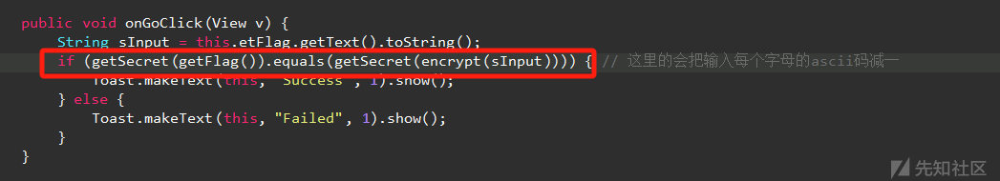](https://xzfile.aliyuncs.com/media/upload/picture/20240122111151-fd25b640-b8d3-1.png)

-   `getSecret(getFlag()).equals(getSecret(encrypt(sInput)))`，判断`getSecret(getFlag())`和`getSecret(encrypt(sInput))`的结果是否相同，其中sInput是输入。
-   getFlag（）没有接收任何字符串，所以想到没必要分析代码写了什么，只需要看这个`getSecret`方法的输入和返回是多少就可以，这里想到了frida。
-   分析一下`getSecret`方法
    -   **\`byte**\[\] hash = MessageDigest.getInstance(encrypt("KE3TLNE6M43EK4GM34LKMLETG").substring(5, 8)).digest(string.getBytes("UTF-8"));\`
    -   这一句对输入进行加密，加密方法还要通过`encrypt("KE3TLNE6M43EK4GM34LKMLETG").substring(5, 8)`获取，写死的就证明加密也只是一个。这里开始想的是用frida看简单的输入的输出，判断是什么编码。
-   frida函数
    
    -   jadx中右键`getSecret`函数-复制为frida代码，
    -   再加个Java.perform(function()运行函数
        
        ```plain
        Java.perform(function() {
            let MainActivity = Java.use("com.ph0en1x.android_crackme.MainActivity");
            MainActivity["getSecret"].implementation = function (string) {
            console.log('getSecret is called' + ', ' + 'string: ' + string);
            let ret = this.getSecret(string);
            console.log('getSecret ret value is ' + ret);
            return ret;
        };
        });
        ```
        
-   打开frida-server
    

[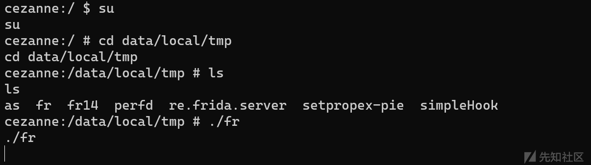](https://xzfile.aliyuncs.com/media/upload/picture/20240122111212-095d05da-b8d4-1.png)

-   frida-ps -U先查看当前运行的进程，然后找到相应的进行，进行frida
-   具体可参考正己大佬的博客，[https://www.52pojie.cn/thread-1823118-1-1.html](https://www.52pojie.cn/thread-1823118-1-1.html)

[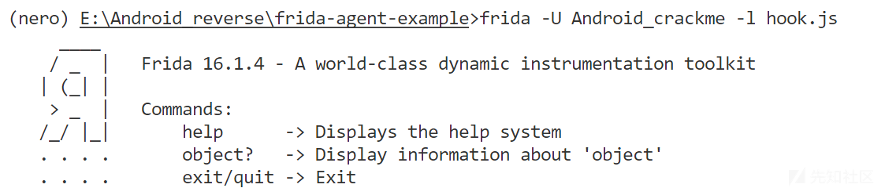](https://xzfile.aliyuncs.com/media/upload/picture/20240122111221-0eeadfa4-b8d4-1.png)

-   在手机上点击check按钮，查看log信息。

[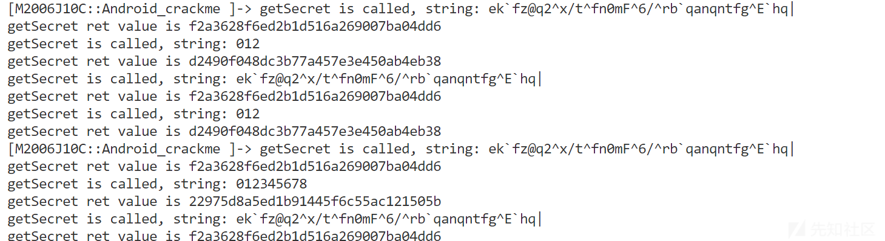](https://xzfile.aliyuncs.com/media/upload/picture/20240122111229-138e47ee-b8d4-1.png)

-   比如012编码后的结果试一下就可以得出进行的md5编码。
-   然后可以看出getFlag()的返回是乱码，分析`getSecret(getFlag()).equals(getSecret(encrypt(sInput)))`得出，`getFlag()`和`encrypt(sInput))`相等即可，而根据getSecret()的输入参数可知，这个过程仅仅对输入进行了ascii减一的操作，我们就可以对getFlag()的返回进行ascii加一的操作。
-   得出flag的代码
    
    ```plain
    s = 'ek`fz@q2^x/t^fn0mF^6/^rb`qanqntfg^E`hq|'
     for i in range(0, len(s)):
         print(chr(ord(s[i])+1), end='')
    ```
    

## ill-intentions

> apk Link:[https://adworld.xctf.org.cn/media/file/task/2bb0718ee4324207b2d2d1ffdd42f4e7.apk](https://adworld.xctf.org.cn/media/file/task/2bb0718ee4324207b2d2d1ffdd42f4e7.apk)

### Description

-   首先主函数是注册了一个广播接收器，用于接收具有特定 action 的广播消息。
    
    ```plain
    public class MainActivity extends Activity {
          @Override // android.app.Activity
          public void onCreate(Bundle savedInstanceState) {
              super.onCreate(savedInstanceState);
              TextView tv = new TextView(getApplicationContext());
              tv.setText("Select the activity you wish to interact with.To-Do: Add buttons to select activity, for now use Send_to_Activity");
              setContentView(tv);
              IntentFilter filter = new IntentFilter();
              filter.addAction("com.ctf.INCOMING_INTENT");
              Send_to_Activity receiver = new Send_to_Activity();
              registerReceiver(receiver, filter, Manifest.permission._MSG, null);
          }
      }
    ```
    
-   然后是具体的广播接收器
    
    ```plain
    public class Send_to_Activity extends BroadcastReceiver {
          @Override // android.content.BroadcastReceiver
          public void onReceive(Context context, Intent intent) {
              String msgText = intent.getStringExtra("msg");
              if (msgText.equalsIgnoreCase("ThisIsTheRealOne")) {
                  Intent outIntent = new Intent(context, ThisIsTheRealOne.class);
                  context.startActivity(outIntent);
              } else if (msgText.equalsIgnoreCase("IsThisTheRealOne")) {
                  Intent outIntent2 = new Intent(context, IsThisTheRealOne.class);
                  context.startActivity(outIntent2);
              } else if (msgText.equalsIgnoreCase("DefinitelyNotThisOne")) {
                  Intent outIntent3 = new Intent(context, DefinitelyNotThisOne.class);
                  context.startActivity(outIntent3);
              } else {
                  Toast.makeText(context, "Which Activity do you wish to interact with?", 1).show();
              }
          }
      }
    ```
    
-   所以我们可以根据接收到的具体的广播消息（msg不同）来访问不同的Activity,一共有3个Activity，其中正确的只有一个，根据输出是否包含flag即可，这里就不说错误的了。
    
-   正确的Activity

```plain
public class IsThisTheRealOne extends Activity {
    public native String computeFlag(String str, String str2);

    public native String definitelyNotThis(String str, String str2, String str3);

    public native String orThat(String str, String str2, String str3);

    public native String perhapsThis(String str, String str2, String str3);

    @Override // android.app.Activity
    public void onCreate(Bundle savedInstanceState) {
        getApplicationContext();
        super.onCreate(savedInstanceState);
        TextView tv = new TextView(this);
        tv.setText("Activity - Is_this_the_real_one");
        Button button = new Button(this);
        button.setText("Broadcast Intent");
        setContentView(button);
        button.setOnClickListener(new View.OnClickListener() { // from class: com.example.application.IsThisTheRealOne.1
            @Override // android.view.View.OnClickListener
            public void onClick(View v) {
                Intent intent = new Intent();
                intent.setAction("com.ctf.OUTGOING_INTENT");
                String a = IsThisTheRealOne.this.getResources().getString(R.string.str3) + "\\VlphgQbwvj~HuDgaeTzuSt.@Lex^~";
                /*其中str的信息在res中的strings.xml，如果对so静态分析，需要知道这几个字符串具体是什么*/
                                    String b = Utilities.doBoth(IsThisTheRealOne.this.getResources().getString(R.string.app_name));
                String name = getClass().getName();
                                    /*重要的是getName函数，取的是带包名的完全体，一开始以为是com.example.application.IsThisTheRealOne，然后去除后面两个字母，其实最后要包含$1*/
                String c = Utilities.doBoth(name.substring(0, name.length() - 2));
                intent.putExtra("msg", IsThisTheRealOne.this.perhapsThis(a, b, c));
                IsThisTheRealOne.this.sendBroadcast(intent, Manifest.permission._MSG);
            }
        });
    }

    static {
        System.loadLibrary("hello-jni");
    }
}
```

-   需要注意的是**Utilities.doBoth和perhapsThis函数，其中**perhapsThis在so文件中。
-   静态逆向

```plain
def doBoth(input):
    return translate(customEncodeValue(input))

def translate(input):
    input_chars = list(input.replace('=', '?'))
    table = {1: 'W', 2: 'h', 3: 'a', 4: 't', 5: 'i', 6: 's', 7: 'd', 8: 'o', 9: 'n', 0: 'e'}
    for i in range(len(input_chars)):
        c = input_chars[i]
        if c.isdigit():
            char_code = int(c)
            input_chars[i] = table[char_code]
    return ''.join(input_chars)

def customEncodeValue(input):
    output = ""
    input_bytes = input.encode()
    md = hashlib.sha224()
    md.update(input_bytes)
    hash_bytes = md.digest()
    for byte in hash_bytes:
        output += "{:02x}".format(byte)
    return base64.b64encode(output.encode()).decode()

# 通过逆向**Utilities.doBoth**的字符串处理的代码，可以求出两个字符串（**perhapsThis三个参数之二**）
input_string = "com.example.application.IsThisTheRealOne"
encoded_string = doBoth(input_string)
print("Encoded string:", encoded_string)
s2 = 'ZGFkNGIwYzIWYjEzMTUWNjVjNTVlNjZhOGJkNhYtODIyOGEaMTMWNmQaOTVjZjkhMzRjYmUzZGE?'
s3 = 'MzQxZTZmZjAxMmIiMWUzNjUxMmRiYjIxNDUwYTUxMWItZGQzNWUtMzkyOWYyMmQeYjZmMzEaNDQ?'
```

-   so文件中**perhapsThis**方法。

[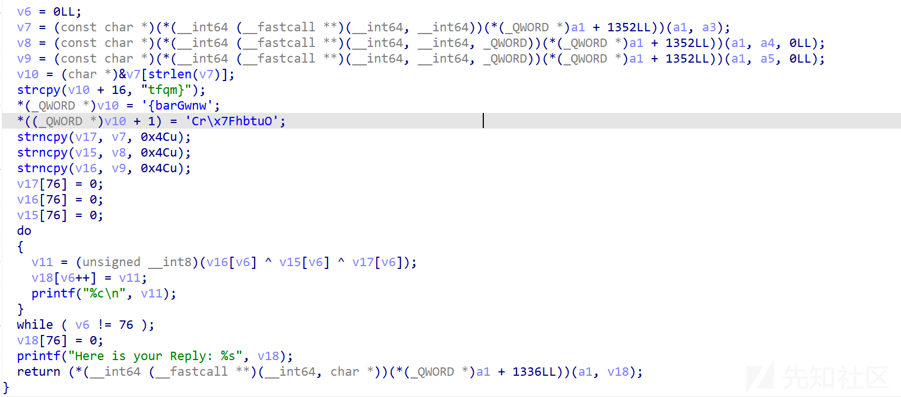](https://xzfile.aliyuncs.com/media/upload/picture/20240122111323-33dbd836-b8d4-1.png)

-   一开始第三个字符串以为是com.example.application.IsThisTheRealO，然后求不出来。然后用后面修改smali的方法求出的flag倒推s3，才发现s3的拼接存在大小端问题。

```plain
正确的：s1 = 'TRytfrgooq|F{i-JovFBungFk\VlphgQbwvj~HuDgaeTzuSt.@Lex^~**wnwGrab{Outbh\x7FrC**tfqm}'
我以为的：   'TRytfrgooq|F{i-JovFBungFk\VlphgQbwvj~HuDgaeTzuSt.@Lex^~**{barGwnwCr\x7FhbtuO**tfqm}'
```

### 方法2

-   参考一篇博客（用攻防世界这个key words搜出去来的全是一样的题解,用的Frida，但是自己了解不多就想着用别的，知道题目来源**google-ctf-2016 intentions，就可以找到更多优质的资料**），主要是往里面加入Activity中加Log的调用，直接日志输出信息，包含Flag。[https://g479173199.github.io/2016/12/09/google-ctf-2016-ill-intentions-writeup/](https://g479173199.github.io/2016/12/09/google-ctf-2016-ill-intentions-writeup/)
-   三个Activity没有exported，所以不可访问，在AndroidManifest中添加这一属性。
-   添加打印perhapsThis函数结果的smali代码

```plain
Java:intent.putExtra("msg", IsThisTheRealOne.this.perhapsThis(a, b, c));对应下面的代码
        //经过perhapsThis函数处理后的结果应该是v6,Log打印出来即可

    .line 33
    .local v2, "c":Ljava/lang/String;
    const-string v5, "msg"

    iget-object v6, p0, Lcom/example/application/IsThisTheRealOne$1;->this$0:Lcom/example/application/IsThisTheRealOne;

    invoke-virtual {v6, v0, v1, v2}, Lcom/example/application/IsThisTheRealOne;->perhapsThis(Ljava/lang/String;Ljava/lang/String;Ljava/lang/String;)Ljava/lang/String;

    move-result-object v6

        **const-string v0, "Message -"
        invoke-static {v0, v6}, Landroid/util/Log;->d(Ljava/lang/String;Ljava/lang/String;)I
        move-result v0**


    invoke-virtual {v3, v5, v6}, Landroid/content/Intent;->putExtra(Ljava/lang/String;Ljava/lang/String;)Landroid/content/Intent;
```

-   最后用adb shell发送带有msg信息的广播，调用对应Activity打印日志，也可以把对应的Activity设置为启动Activity。

```plain
adb shell am start -n com.example.hellojni/com.example.application.IsThisTheRealOne
adb 命令，用于在 Android 设备上启动指定包名和活动类名的应用程序。
```

## 安卓逆向 ERROR404

-   让输入暗号来匹配，就是输入一串字符串
-   开始的时候想着Android killer打开看看是不是直接匹配输入的字符串，后来没发现。
-   想着能不能直接看java源码，Android killer找不到，用smali2java看一下check函数。
    
    ```plain
    package com.example.lenovo.apk_1;
    
      public class Check {
          String str_in;
          String flag = "hebtuctf[thesE-is-wrong-flag-haha!]";
          byte[] enc_flag = new byte[] {0xff3433, 0xff343b, 0xff3437, 0xff343b, 0xff343b, 0xff3437, 0xff343b, 0xff3437, 0xff3438, 0xff343a, 0xff347f, 0xff3430, 0xff3406, 0xff3449, 0xff3422, 0xff345b, 0xff3476, 0xff340d, 0xff341e, 0xff3458, 0xff341c, 0xff345d, 0xff3459, 0xff34a0, 0xff3430, 0xff346b, 0xff3406, 0xff341d, 0xff34f8, 0xff3473, 0xff3402, 0xff344a, 0xff3463, 0xff349e, 0xff340b}
          Boolean is_right = Boolean.valueOf(true);
      Check(String str) {
          str_in = str;
          if(str_in.length() != 0x23) {
              is_right = Boolean.valueOf(false);
              return;
          }
          byte[] fake_flag = flag.getBytes();
          byte[] input_flag = str_in.getBytes();
          byte[] pre_middle_flag = {
              for(int i = 0x0; i < fake_flag.length; i = i + 0x1) {
              }
              byte[] middle_flag = {
                  for(int i = 0x0; i < (pre_middle_flag.length - 0x1); i = i + 0x1) {
                  }
                  String temp_str = new String(middle_flag);
                  if(temp_str.equals(a())) {
                      is_right = Boolean.valueOf(true);
                      return;
                  }
                  is_right = Boolean.valueOf(false);
              }
    
              public String a() {
                  byte[] mid_flag = new byte[0x23];
                  byte[] fake_flag = flag.getBytes();
                  for(int i = 0x0; i < fake_flag.length; i = i + 0x1) {
                      fake_flag[i] = (byte)((fake_flag[i] + 0x14) ^ (fake_flag[i] + 0x12));
                      mid_flag[i] = (byte)((enc_flag[i] ^ (fake_flag[i] + 0x11)) - 0xb);
                  }
                  String re_mid_flag = new String(mid_flag);
                  return re_mid_flag;
              }
          }
    ```
    
-   对比的是转换过的字符串。
    

## CTF-easy

-   一个apk，让输入内容，给出正确与否
-   先用Android killer打开，只有一个java文件，而且有两个字符串，具体就看不出来了。用Android killer无法查看java源码，又用了smali2java，还是有问题。看了wp可以用jeb，然后就用jeb打开。
-   解析，发现flag直接出来了，因为他直接运行了加密的方法，就直接用输入的和加密的比较。

```plain
static {
        FlagActivity.m = "com.didi_ctf.flagapp.FlagActivity";
        FlagActivity.p = new byte[]{-40, -62, 107, 66, 0x82, 103, -56, 77, 0x7A, -107, -24, 0x81, 72, 0xC1, -98, 0x40, -24, -5, -49, -26, 0x4F, -70, -26, -81, 120, 25, 0x6F, -100, -23, -9, 0x7A, -35, 66, -50, 0x8C, 3, -72, 102, -45, -85, 0, 0x7E, -34, 62, 83, -34, 0x30, 0x91, 61, -9, -51, 0x72, 20, 81, 0x82, -18, 27, 0x8D, -76, 0x8C, 0xD0, 0x8A, -10, -102, -106, 0x71, -104, 98, -109, 74, 0x30, 0x2F, -100, -88, 0x79, 22, 0xC1, 0xE0, -20, -41, -27, -20, 0x8A, 100, -76, 70, -49, -39, -27, -106, -13, -108, 0x73, -87, -1, -22, -53, 21, -100, 0x7C, 0xA1, -40, 62, -69, 29, 56, -53, 85, 0xD0, 25, 37, -78, 11, -110, -24, -120, -82, 6, -94, -101};
        FlagActivity.q = new byte[]{-57, -90, 53, -71, 0x8B, 98, 62, 98, 101, 0xA0, 36, 110, 77, -83, 0x87, 2, 0xD0, 94, -106, -56, -49, -80, -1, 83, 75, 66, -44, 74, 2, -36, -42, -103, 6, 0x8D, -40, 69, -107, 3, -28, -49, 49, 73, -26, 8, 100, -18, 1, -16, 13, -61, -12, 22, 33, 51, -80, -120, 42, -75, 0x85, -22, -78, -68, -110, -94, -14, 68, -7, 3, -9, 10, 84, 70, -8, 0xC1, 26, 0x7E, -76, -104, 0x85, -71, 0x82, -62, -23, 11, -39, 70, 14, 59, -101, -39, 0x84, 91, -109, 102, -49, 21, 105, 0, 37, 0x80, -57, 0x75, 110, 0x8D, -86, 56, 25, -46, -55, 7, 0x83, 109, 76, 104, -15, 82, -53, 18, -28, -24};
    }
```

```plain
private String i() {
    int v1 = 0;
    byte[] v2 = new byte[FlagActivity.p.length];
    int v0;
    for(v0 = 0; v0 < v2.length; ++v0) {
        v2[v0] = (byte)(FlagActivity.p[v0] ^ FlagActivity.q[v0]);
    }

    int v3 = v2[0];
    int v0_1;
    for(v0_1 = 0; v2[v3 + v0_1] != 0; ++v0_1) {
    }

    byte[] v4 = new byte[v0_1];
    while(v1 < v0_1) {
        v4[v1] = v2[v3 + v1];
        ++v1;
    }

    return new String(v4);
}

public void onClickTest(View arg3) {
    if(this.n.getText().toString().equals("DDCTF-e7d1786701a049d5b2f181fb6d8d5aad@didichuxing.com")) {
        this.o.setText(0x7F060025);  // string:flag_result_yes "正确 Correct"
        return;
    }

    this.o.setText(0x7F060023);  // string:flag_result_no "密码错误 Wrong Key"
}
```

-   这里应该是调用的i方法。
-   `public void onClickTest(View arg3) { if(this.n.getText().toString().equals(this.i())) { this.o.setText(0x7F060025); } else { this.o.setText(0x7F060023); } }`
-   看一下i方法并逆一下：
    
    ```plain
    p = [-40, -62, 107, 66, 0x82, 103, -56, 77, 0x7A, -107, -24, 0x81, 72, 0xC1, -98, 0x40, -24, -5, -49, -26, 0x4F, -70, -26, -81, 120, 25, 0x6F, -100, -23, -9, 0x7A, -35, 66, -50, 0x8C, 3, -72, 102, -45, -85, 0, 0x7E, -34, 62, 83, -34, 0x30, 0x91, 61, -9, -51, 0x72, 20, 81, 0x82, -18, 27, 0x8D, -76, 0x8C, 0xD0, 0x8A, -10, -102, -106, 0x71, -104, 98, -109, 74, 0x30, 0x2F, -100, -88, 0x79, 22, 0xC1, 0xE0, -20, -41, -27, -20, 0x8A, 100, -76, 70, -49, -39, -27, -106, -13, -108, 0x73, -87, -1, -22, -53, 21, -100, 0x7C, 0xA1, -40, 62, -69, 29, 56, -53, 85, 0xD0, 25, 37, -78, 11, -110, -24, -120, -82, 6, -94, -101]
      q = [-57, -90, 53, -71, 0x8B, 98, 62, 98, 101, 0xA0, 36, 110, 77, -83, 0x87, 2, 0xD0, 94, -106, -56, -49, -80, -1, 83, 75, 66, -44, 74, 2, -36, -42, -103, 6, 0x8D, -40, 69, -107, 3, -28, -49, 49, 73, -26, 8, 100, -18, 1, -16, 13, -61, -12, 22, 33, 51, -80, -120, 42, -75, 0x85, -22, -78, -68, -110, -94, -14, 68, -7, 3, -9, 10, 84, 70, -8, 0xC1, 26, 0x7E, -76, -104, 0x85, -71, 0x82, -62, -23, 11, -39, 70, 14, 59, -101, -39, 0x84, 91, -109, 102, -49, 21, 105, 0, 37, 0x80, -57, 0x75, 110, 0x8D, -86, 56, 25, -46, -55, 7, 0x83, 109, 76, 104, -15, 82, -53, 18, -28, -24]
      v2=[]
      v4=[]
      for i in range(len(p)):
          v2.append(p[i]^q[i])
      v3 = v2[0]
      v0=0
      v1=0
      while(v2[v3+v0]!=0):
          v0+=1
      while(v1<v0):
          v4.append(v2[v3+v1])
          v1+=1
      for i in range(len(v4)):
          print(chr(v4[i]%128),end="")
    ```
    

[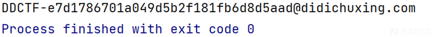](https://xzfile.aliyuncs.com/media/upload/picture/20240122111414-52317fc0-b8d4-1.png)

也可以成功。

## 献给最好的你

-   用jeb查看解析后的java代码
-   先看LoginActivity
    -   这一段应该是对获取到的password进行处理，通过中间层ViewModel。

[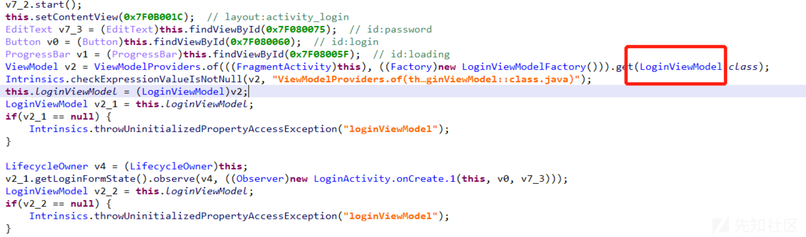](https://xzfile.aliyuncs.com/media/upload/picture/20240122111532-80613ade-b8d4-1.png)

-   查看LoginViewModel
    -   调用Repository层方法

[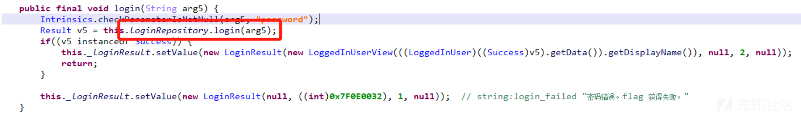](https://xzfile.aliyuncs.com/media/upload/picture/20240122111558-8fde0276-b8d4-1.png)

-   查看Repository层
    -   继续调用DataSource层

[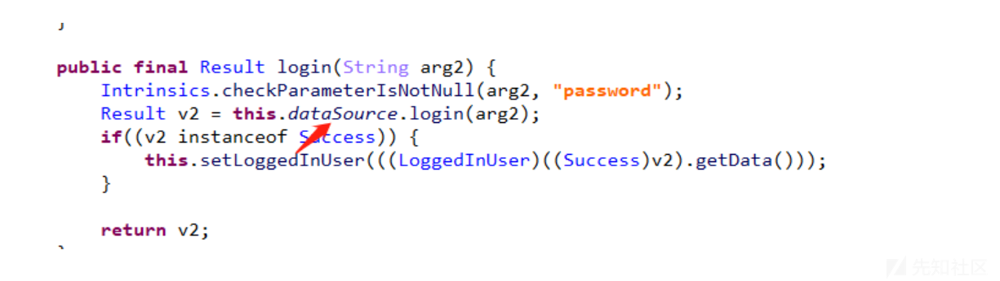](https://xzfile.aliyuncs.com/media/upload/picture/20240122111616-9aee1e80-b8d4-1.png)

## \- 查看DataSource层

[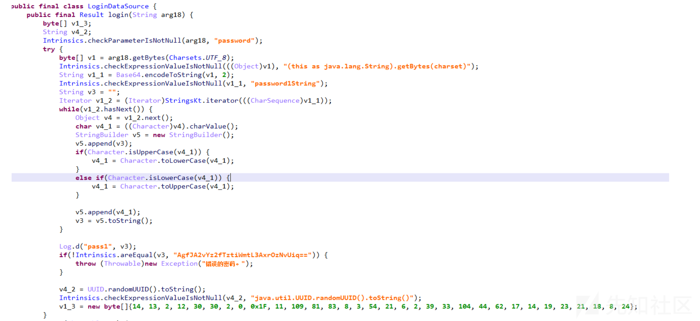](https://xzfile.aliyuncs.com/media/upload/picture/20240122111643-aaafb2a2-b8d4-1.png)

-   这一段就是关键
    -   先对输入进行base64编码，然后遍历编码后的将大小写转换，最后和AgfJA2vYz2fTztiWmtL3AxrOzNvUiq==比较。
    -   所以我们将AgfJA2vYz2fTztiWmtL3AxrOzNvUiq==大小写再转换过了base64解码后就是密码。输入就可以得到flag
    -   解密结果

[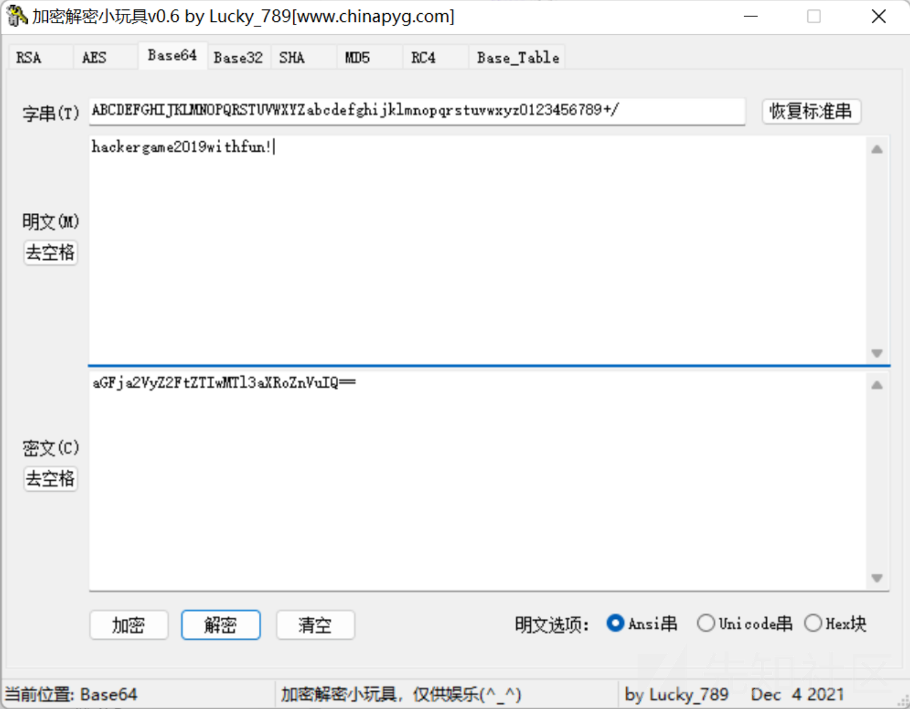](https://xzfile.aliyuncs.com/media/upload/picture/20240122111707-b91a04e6-b8d4-1.png)

[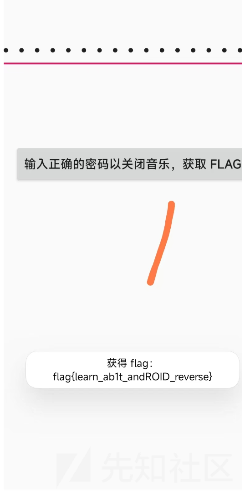](https://xzfile.aliyuncs.com/media/upload/picture/20240122111725-c4129278-b8d4-1.png)

## blink

-   给了个apk，打开发现只有一张图片，然后用jeb打开，发现只有两个activity，而且都比较简单。mainactivity主要显示那张图片，然后r2d2里面也是显示一张图片，但是主要是显示的是base64编码的图片，尝试用在线base64编码转图片，发现失败，不知道为啥。但是在Android killer上复制的字符串就可以有用。
-   开始没想着再用Android killer打开后的base64字符串不一样。想着直接运行这个activity，就将启动activity改成了那个r2d2。启动就是那张图片输入flag即可。

## Easy-apk1

-   文件是一个apk，先用虚拟机安装试一下
-   界面只有一个输入框和check按钮，我们需要输入flag，点击check来判断是正确还是错误
-   用jeb打开看一下，并查看java源码
    
    -   其中关键代码如下
        
        ```plain
        ((Button)this.findViewById(0x7F080024)).setOnClickListener(new View.OnClickListener() {  // id:button
                      @Override  // android.view.View$OnClickListener
                      public void onClick(View arg14) {
                          String v14 = ((EditText)MainActivity.this.findViewById(0x7F08003F)).getText().toString();  // id:editText
                          String[] v0 = v14.split("_");
                          if(v0.length == 4 && v14.length() == 19 && Long.parseLong(MainActivity.xx1(v0[0]), 16) + Long.parseLong(MainActivity.xx1(v0[1]), 16) - Long.parseLong(MainActivity.xx1(v0[2]), 16) == 0x11337452L && Long.parseLong(MainActivity.xx1(v0[0]), 16) * Long.parseLong(MainActivity.xx1(v0[1]), 16) == 0x10E02D1DAE11BF3CL && Long.parseLong(MainActivity.xx1(v0[2]), 16) - Long.parseLong(MainActivity.xx1(v0[1]), 16) == 0x1F3CBF1CL && (MainActivity.md5(v0[3]).equals("b7e20e3e9d02209c9f3284cb29ed719d"))) {
                              Toast.makeText(MainActivity.this, "right!", 1).show();
                              return;
                          }
        ```
        
        ```plain
        Toast.makeText(MainActivity.this, "wrong!", 1).show();
                  }
              });
        ```
        
    -   v14是获取到的字符串，v0 = v14.split("*");将v0以* 为界分开。v0.length==4就是将输入一共分成了4块.
        
    -   v14.length() == 19表示输入字符串长19，
    -   其中最后一个v0的md5值为b7e20e3e9d02209c9f3284cb29ed719d，先解一下。为 t0Ur
    -   然后再看前三个v0分组。
        
        ## \- 其中Long.parseLong是将一个字符串转换为数字的方法。
        

[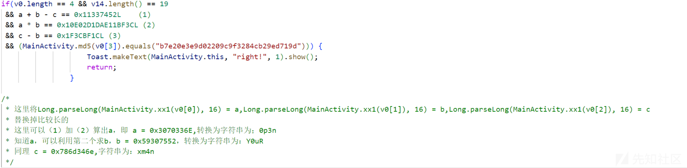](https://xzfile.aliyuncs.com/media/upload/picture/20240122111754-d577a40e-b8d4-1.png)

-   然后这四个字符串经过了xx1函数，再看一下xx1函数进行了怎样的处理。
-   `public static String xx1(String arg4) { char[] v0 = "0123456789ABCDEF".toCharArray(); StringBuilder v1 = new StringBuilder(""); byte[] v4 = arg4.getBytes(); int v2; for(v2 = 0; v2 < v4.length; ++v2) { v1.append(v0[(v4[v2] & 0xF0) >> 4]); v1.append(v0[v4[v2] & 15]); } return v1.toString().trim();//trim删除头尾空白符 }`
    -   xx1函数没看明白，Long.parseLong是将字符串处理为数字，所以开始觉得xx1返回的应该是字符串，然后就看不明白了。
    -   直到运行了一下才知道，xx1是返回的字符串16进制串，Long.parseLong只是将16进制转换成了Long。
    -   这样就说的通了，之前hex2string正是flag。

## AreYouRich

-   让输入username和password，登录。

[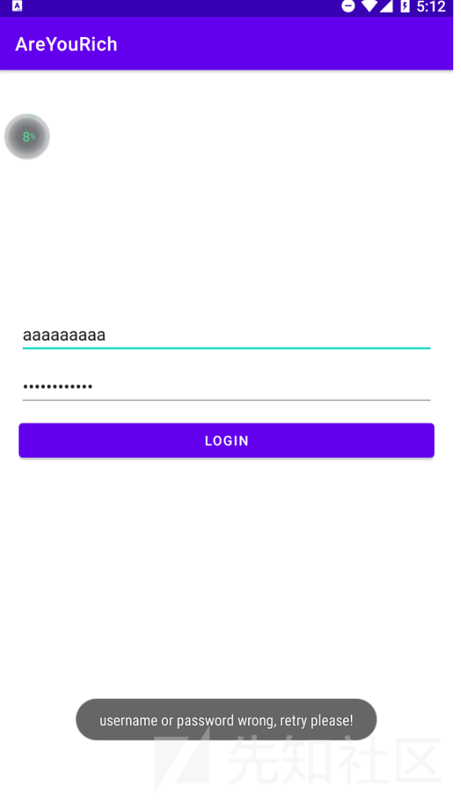](https://xzfile.aliyuncs.com/media/upload/picture/20240122111818-e386e78a-b8d4-1.png)

## \- 用Jeb看一下

[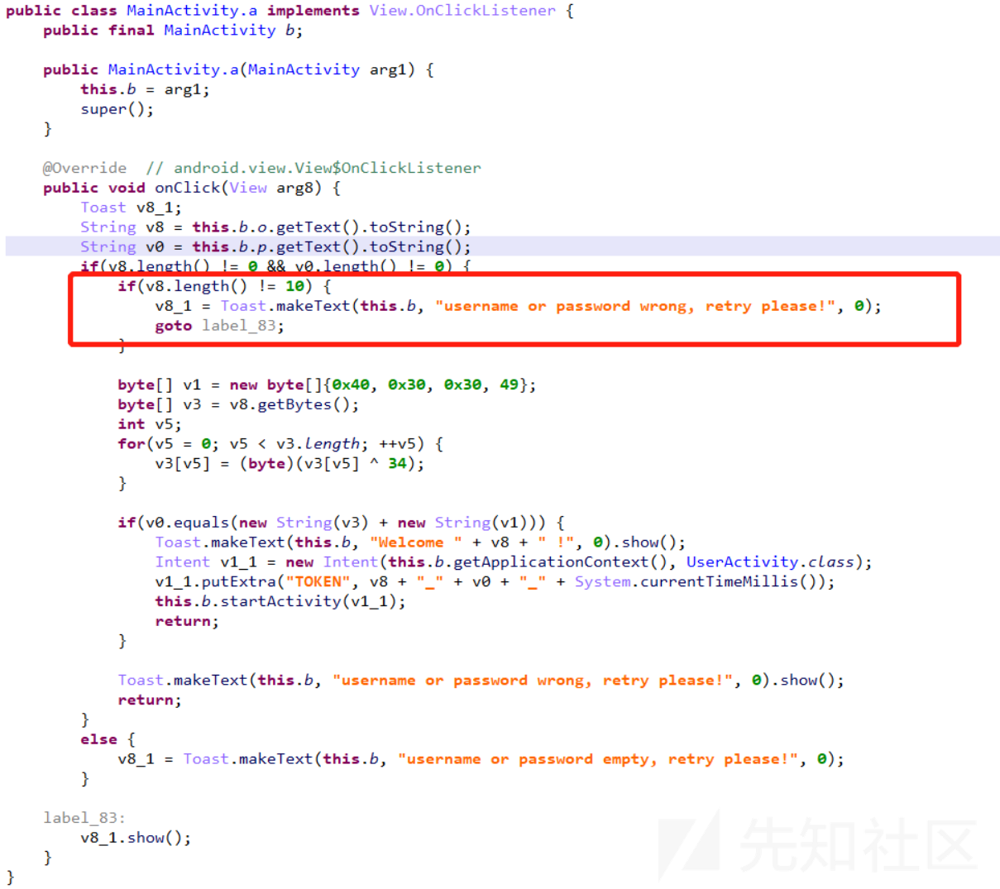](https://xzfile.aliyuncs.com/media/upload/picture/20240122111840-f06558d8-b8d4-1.png)

-   这里需要注意的是用户名长度应该为10位，然后会根据用户名生成密码登录
-   就随便找了一个用户名
-   密码要等于a1+a2
    
    ````plain
    ```
         public class Main {
         public static void main(String[] args) {
             byte[] v1 = new byte[]{0x40, 0x30, 0x30, 49};
             String v8 = "abcdefghij";
             byte[] v3 = v8.getBytes();
             int v5;
             for (v5 = 0; v5 < v3.length; v5++) {
                 v3[v5] = (byte)(v3[v5] ^ 34);
         }
         String a1 = new String(v3);
         String a2 = new String(v1);
         System.out.println(a1);
         System.out.println(a2);
         System.out.println(a1+a2);
    
     }
     }
    
     ```
    ````
    

-   登录进去之后让买flag，但是money明显不够  
    [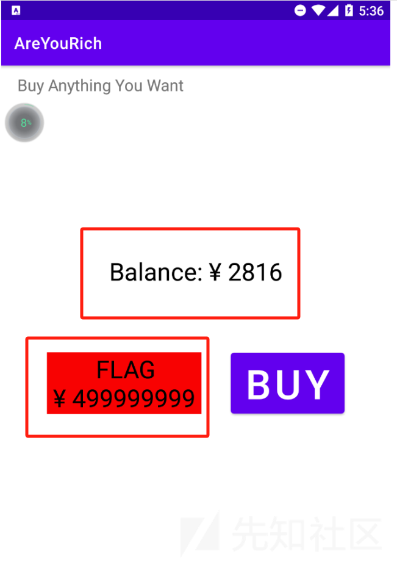](https://xzfile.aliyuncs.com/media/upload/picture/20240122111909-02365404-b8d5-1.png)
    
    -   接下来看一下这一块怎么弄
    -   想想能不能把这一块改了，下面应该事加密方法。

[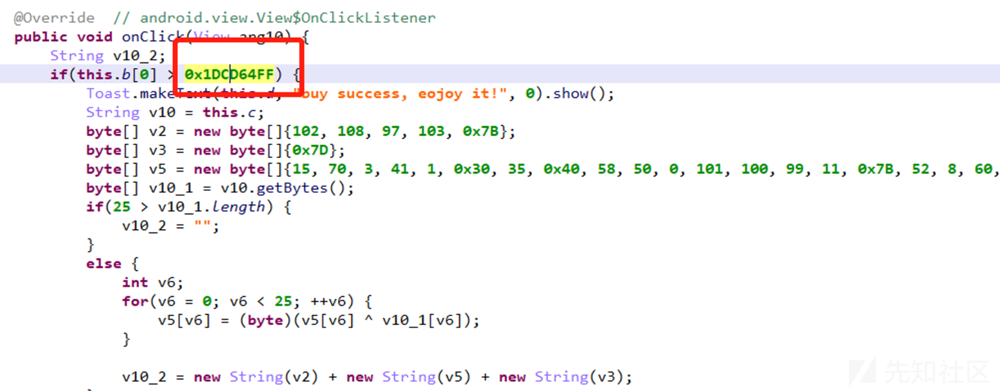](https://xzfile.aliyuncs.com/media/upload/picture/20240122111928-0d6b89ca-b8d5-1.png)

-   这是用Android killer打开的。改成0x1.反编译

[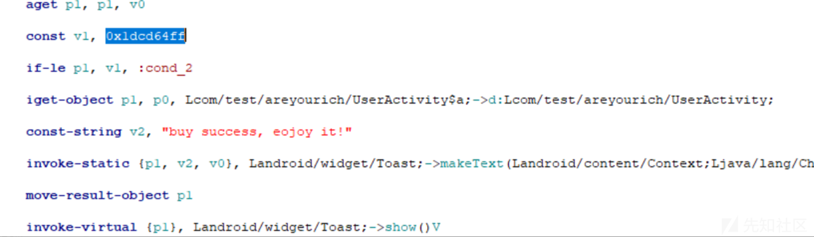](https://xzfile.aliyuncs.com/media/upload/picture/20240122111947-1888d8da-b8d5-1.png)

-   改了之后虽然可以输出flag

-   还有一个方法是在源码中寻找正确的用户名和密码。
