# APK逆向分析入门-以某app脱壳为例 - 先知社区

APK逆向分析入门-以某app脱壳为例

- - -

## 分析

### 源码分析-Jadx

-   拖入jadx，发现是有加固的，看目录应该是腾讯御安全加固。

[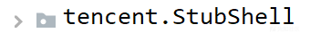](https://xzfile.aliyuncs.com/media/upload/picture/20240121114654-b817eaba-b80f-1.png)

-   使用MT管理器验证后就是腾讯御安全加固，这里要考虑如何脱壳。

### 安装

-   可以正常安装，而且第一步要先登录，这里就先进行脱壳，再考虑接下来的事。

[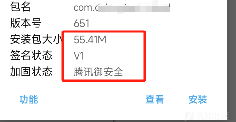](https://xzfile.aliyuncs.com/media/upload/picture/20240121114701-bc6575ba-b80f-1.png)

## 脱壳

### 加固基本原理

-   apk加壳是为了提高安全性， 但是也会影响真实体验，所以有的apk选择加固有的考虑到大量用户的体验就不进行加固，而且考强大的“法律团队”。
-   加壳目前主要分为4个过程的进化，这里就简要介绍，详细了解大家可以去网上找一些大佬的讲解。
    -   一：代码混淆
    -   二：动态加载dex
    -   三：动态加载dex并进行函数抽象化
    -   四：VMP虚拟化保护
-   一般遇到的就是dex加固，再复杂的脱壳也比较麻烦，大家可以考虑一下投入与回报。
    -   原理简单来说就是把真实原本的apk加载到内存后dump出来。而脱壳要做的就是找到一个合适的时机dump出真实的dex。这里推荐一篇博文，详细介绍加固脱壳的原理。[https://mp.weixin.qq.com/s?\_\_biz=MjM5NTc2MDYxMw==&mid=2458457914&idx=1&sn=1d505597b47089cbd8bdc1e6e0a2b068&chksm=b18e27b086f9aea63d4404f118b0dc4c0b87c5986f20e556a5a85c967834df0d7f3e8e6d98d6&scene=27](https://mp.weixin.qq.com/s?__biz=MjM5NTc2MDYxMw==&mid=2458457914&idx=1&sn=1d505597b47089cbd8bdc1e6e0a2b068&chksm=b18e27b086f9aea63d4404f118b0dc4c0b87c5986f20e556a5a85c967834df0d7f3e8e6d98d6&scene=27)

### 脱壳

这里不用hook等方式手动脱，能工具的还是优先工具。这里使用脱壳神器BlackDex[https://github.com/CodingGay/BlackDex](https://github.com/CodingGay/BlackDex)

[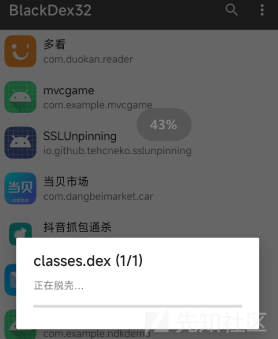](https://xzfile.aliyuncs.com/media/upload/picture/20240121114711-c2539af6-b80f-1.png)

-   这里直接用BlackDex显示脱壳成功，但是显示有多个dex文件。

[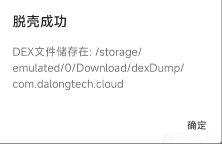](https://xzfile.aliyuncs.com/media/upload/picture/20240121114718-c635548e-b80f-1.png)

-   这里要先做的是删除多余没用的dex并替换原有apk下的dex。同时比较原有dex文件，把脱壳后的和原大小相同的也删掉。

[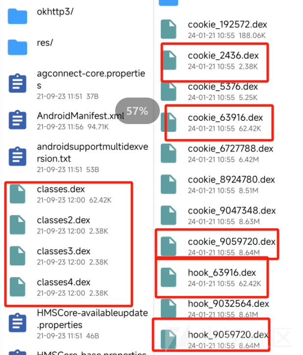](https://xzfile.aliyuncs.com/media/upload/picture/20240121114724-ca0f3d72-b80f-1.png)

-   对dex进行修复 ，修复后产生的bak备份文件删除就行。

[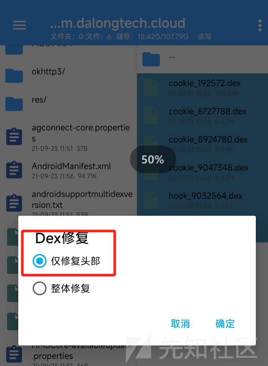](https://xzfile.aliyuncs.com/media/upload/picture/20240121114731-cddb6ac0-b80f-1.png)

-   去原有dex下的加固代理文件中找到真实的入口名，并修改amf.xml文件中的入口为真实的入口名。下图一是加固代理入口中的真实入口，图二是要替换掉的amf.xml入口。

[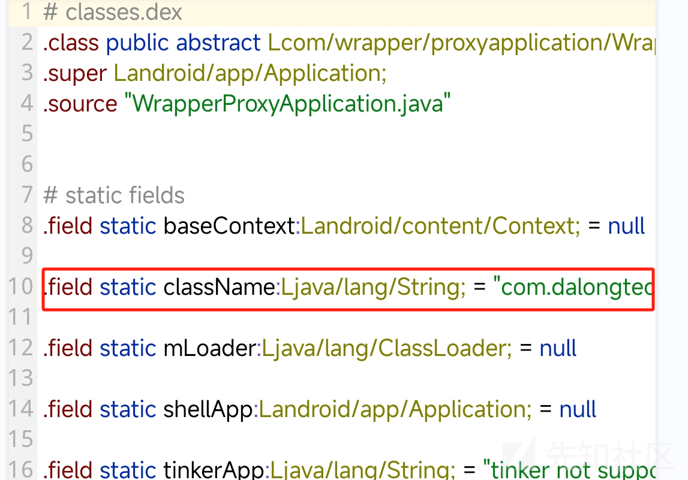](https://xzfile.aliyuncs.com/media/upload/picture/20240121114737-d1d929e6-b80f-1.png)

[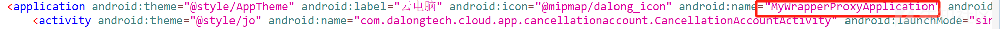](https://xzfile.aliyuncs.com/media/upload/picture/20240121114743-d4ee1114-b80f-1.png)

-   接下来对剩余的脱壳后的dex进行重命名。然后将dex添加到apk项目中。注意保存的时候一定**不要自动签名！**

[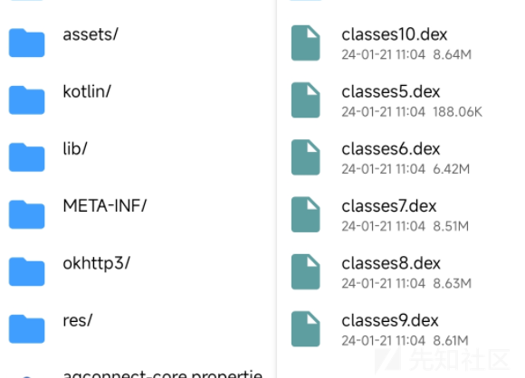](https://xzfile.aliyuncs.com/media/upload/picture/20240121114756-dceba1ba-b80f-1.png)

[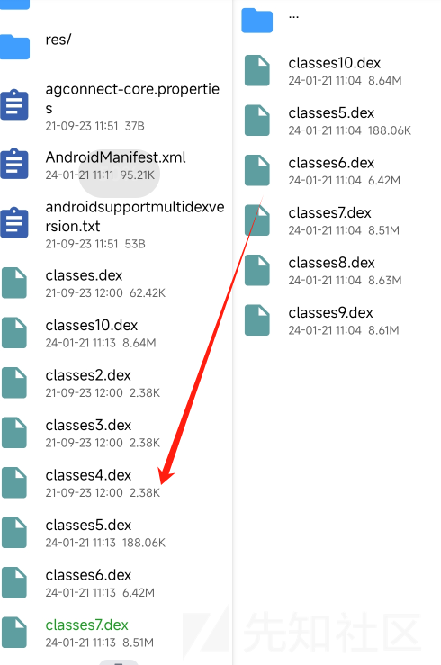](https://xzfile.aliyuncs.com/media/upload/picture/20240121114802-e0a3113a-b80f-1.png)

-   删除加固残留。删除根目录，lib，assets加固特征码文件。so文件中带shell的删除掉，assert中带0O1和00OO这种的。

[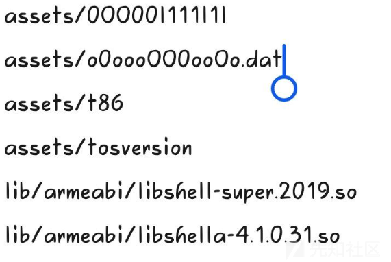](https://xzfile.aliyuncs.com/media/upload/picture/20240121115038-3da6f676-b810-1.png)

-   此时，再用MT管理器查看显示未加固，但是有校验未通过。直接用NP管理器去除签名校验。

[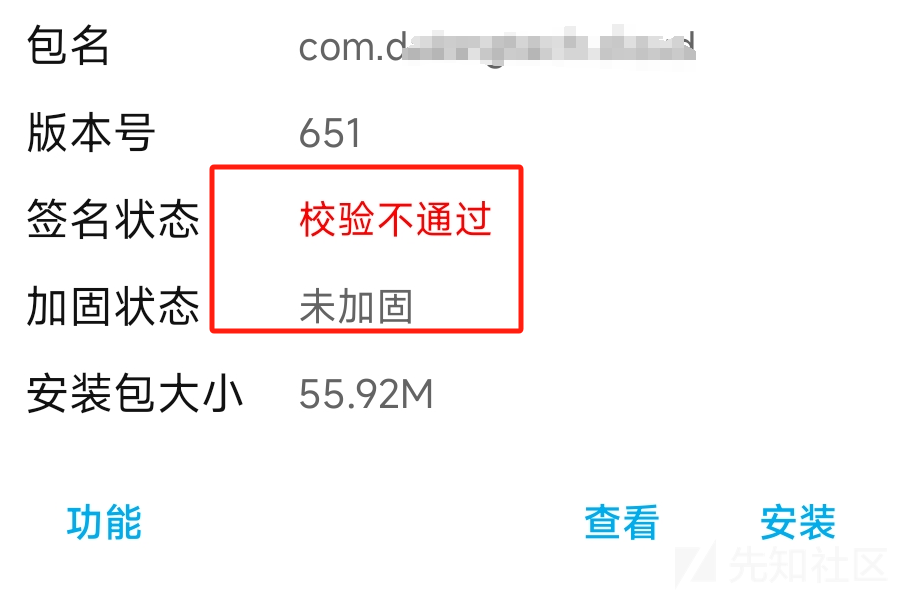](https://xzfile.aliyuncs.com/media/upload/picture/20240121114809-e4a24756-b80f-1.png)

[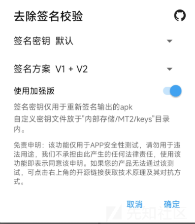](https://xzfile.aliyuncs.com/media/upload/picture/20240121114815-e83e9932-b80f-1.png)

-   安装，发现可以正常安装并使用，到此去除腾讯御安全加固就可以了。

[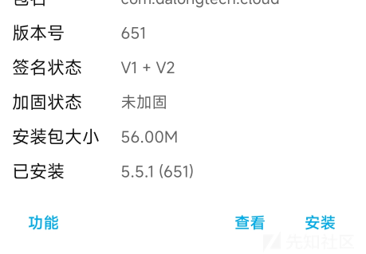](https://xzfile.aliyuncs.com/media/upload/picture/20240121114921-0f9a5fb6-b810-1.png)

[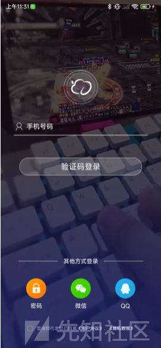](https://xzfile.aliyuncs.com/media/upload/picture/20240121114925-120bdf68-b810-1.png)

-   之前的内容对加固的app进行简单的分析和脱壳。这里继续分析此app，进行关闭广告、跳过强制更新。  
    \## 应用分析
    
-   登录
    
    -   登录的时候可以使用密码和验证码登录，这里就抓包分析使用密码登录的逻辑。登录的逻辑在`com.dalongtech.cloud.app.quicklogin` 代码中。
    -   通过抓包的分析，登录请求中对手机号没有做任何处理，对密码进行了简单的编码。响应也是没经过任何处理的。

[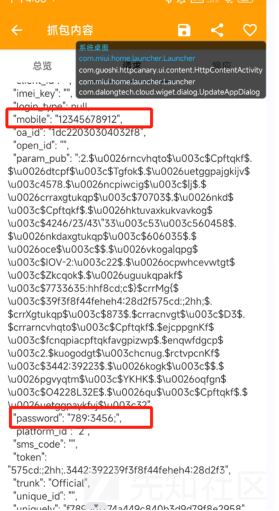](https://xzfile.aliyuncs.com/media/upload/picture/20240121203954-2d85ae00-b85a-1.png)

### 去除广告页

-   登录后遇到的第一个问题是广告界面。
    -   `com.dalongtech.cloud.app.appstarter.``AppStarterActivity` 界面是广告activity。
    -   在上面activity找了半天，没找到广告计时器定义在哪。只能通过amf.xml文件看看是否可以跳过这个广告activity。这里将下面图中的intent过滤器复制到广告后的下一个activity：`HomePageActivityNew`

[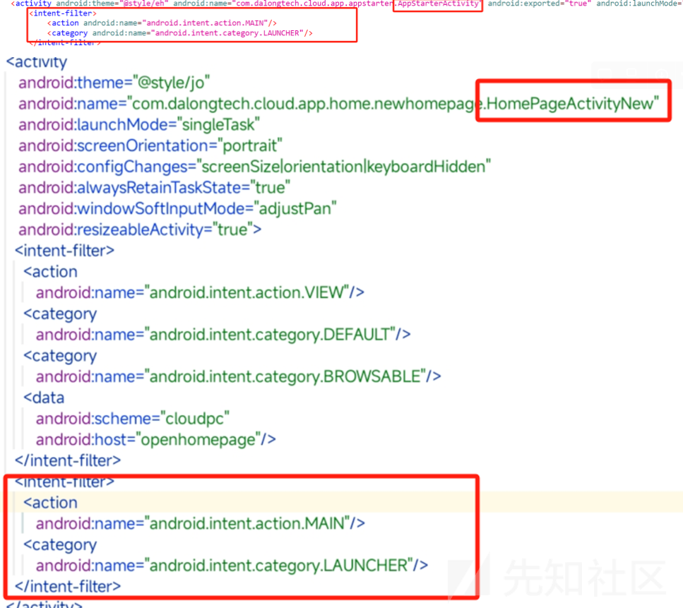](https://xzfile.aliyuncs.com/media/upload/picture/20240121204025-3fcce2ea-b85a-1.png)

-   进行了上面的更改后可以不加载广告界面直接进入主界面。

[](https://xzfile.aliyuncs.com/media/upload/picture/20240121204110-5a9e7660-b85a-1.gif)

### 饶过强制更新

-   遇到的第二个问题：强制更新，无法取消弹窗。而且无法点击以后再说

[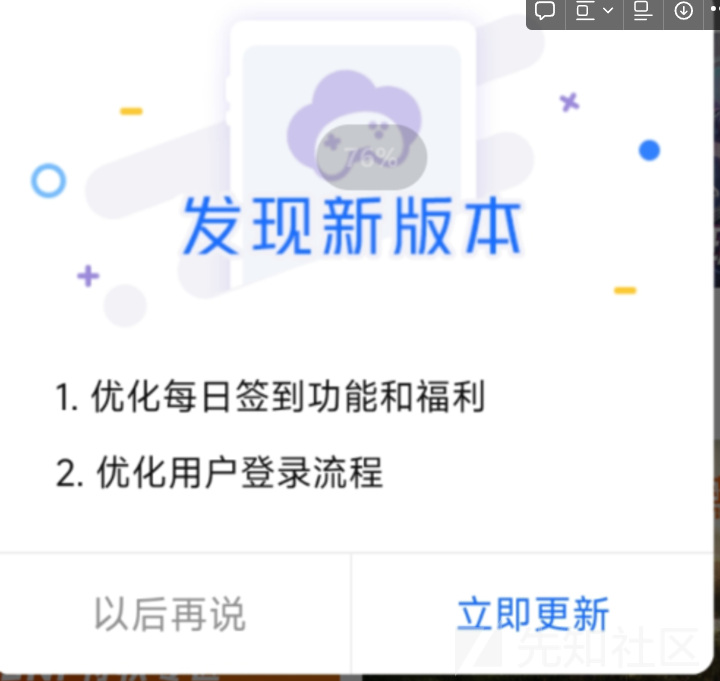](https://xzfile.aliyuncs.com/media/upload/picture/20240121204209-7e3e3182-b85a-1.png)

-   根据当前activity提示，发现更新弹窗的逻辑代码在`com.dalongtech.cloud.wiget.dialog.``UpdateAppDialog`
-   经过分析对弹窗activity的分析，发现了一个可以控制按钮状态的函数。其中**\`this**.f12837i`对应的是`(Button) a(R.id.update\_dialog\_cancelBtn)\` ，即取消更新的button。如果没猜错的话，z应该是False，这里使用frida验证一下我们的猜想。

[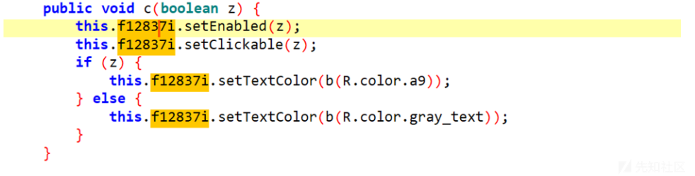](https://xzfile.aliyuncs.com/media/upload/picture/20240121204227-88c97ea4-b85a-1.png)

-   frida hook函数
    
    ```plain
    function carhook3(){
           let UpdateAppDialog = Java.use("com.dalongtech.cloud.wiget.dialog.UpdateAppDialog");
           UpdateAppDialog["c"].overload('boolean').implementation = function (z) {
           console.log('c is called' + ', ' + 'z: ' + z);
           let ret = this.c(z);
           console.log('c ret value is ' + ret);
           return ret;
       };
       };
    ```
    
-   z的返回结果，可以看出是这里让取消不能点击。现在有两个方法。一个是hook函数的时候修改z的值为true。另一个是在smali代码中对z取反，为了让修改的持久，这里选择直接修复smali代码。
    

[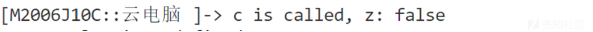](https://xzfile.aliyuncs.com/media/upload/picture/20240121204243-92855ea4-b85a-1.png)

-   针对使用hook修改c函数的入参的方式，经过尝试也是可行的

[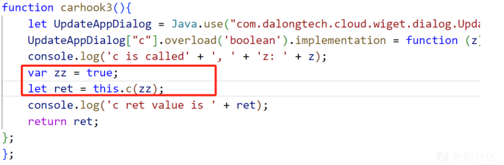](https://xzfile.aliyuncs.com/media/upload/picture/20240121204257-9a54f432-b85a-1.png)

-   查找c函数的调用，发现只有一处，**\`this**.f12120c.c(!"1".equals(data.getIs\_force()));\` 在smali中将取反操作去掉就可以了。我们可以将0x1变为0x0或者直接删除这一句。
    
    ```plain
    xor-int/lit8 v0, v0, 0x1
       指令将v0寄存器的值与1进行按位异或操作，相当于对v0寄存器的最低位（最后一位）进行取反操作。
    ```
    
-   修改后可以看出，以后点击可以点击了，而且点击后可以暂时不更新。
    

[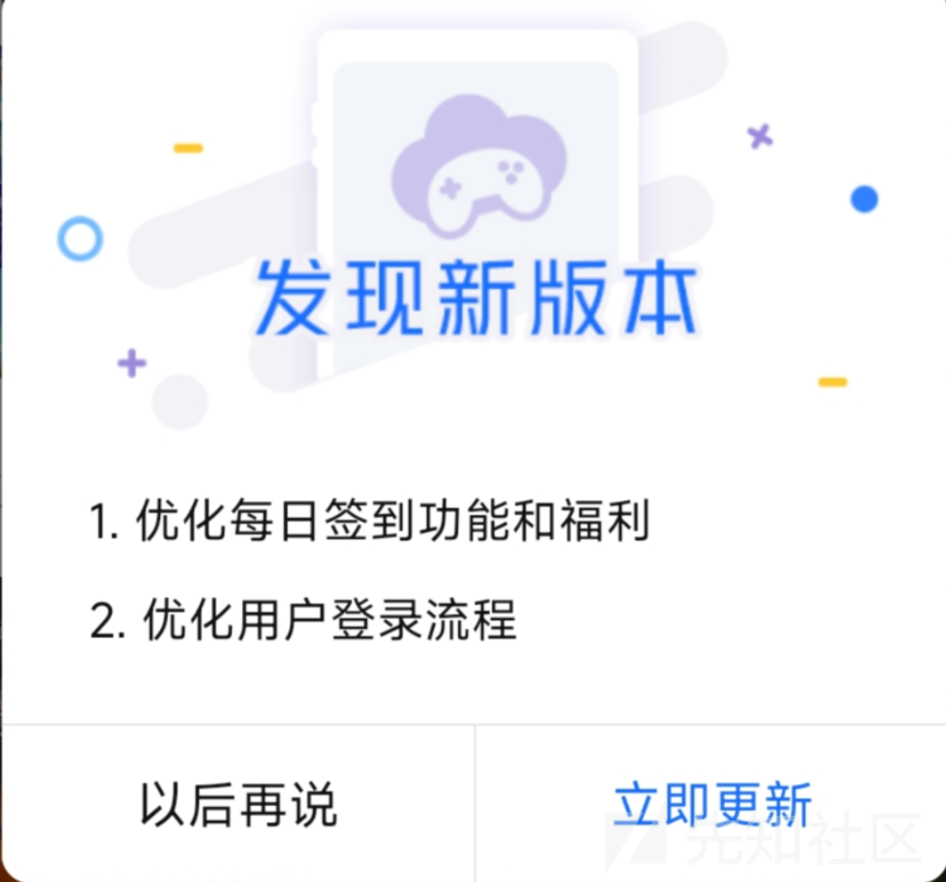](https://xzfile.aliyuncs.com/media/upload/picture/20240121204311-a2c5bb2e-b85a-1.png)
