APK逆向分析入门-以某影视盒子TV版为例

- - -

## APK逆向分析入门-以某影视盒子TV版为例

> 此文章仅供学习，切勿进行其他非F行为！

### 准备

-   使用MT管理器查看apk基本信息，发现并没有加壳。
-   安装apk，打开应用查看应用启动信息。通过MP管理器的Activity记录器可以看到应用启动Activity是SplashActivity，比较良心的是启动Activity竟然没有广告。关于Activity的信息从AndroidManifest.xml中也能看出来。
    
    -   其中来看一下对SplashActivity的定义，既然是入门，就看一下正向的内容。
        
        ```plain
        <activity android:configChanges="keyboardHidden|orientation" android:label="@string/app_name" android:launchMode="singleTask" android:name="com.f0208.lebotv.SplashActivity" android:screenOrientation="landscape">
                  <intent-filter>
                      <action android:name="android.intent.action.MAIN"/>
                      <category android:name="android.intent.category.DEFAULT"/>
                      <category android:name="android.intent.category.MONKEY"/>
                      <category android:name="android.intent.category.LAUNCHER"/>
                  </intent-filter>
                  <intent-filter>
                      <action android:name="android.intent.action.VIEW"/>
                      <category android:name="android.intent.category.DEFAULT"/>
                      <category android:name="android.intent.category.BROWSABLE"/>
                      <data android:scheme="f4u4e8"/>
                  </intent-filter>
        </activity>
        //其中android:configChanges和android:label都是对此Activity的属性的一些定义，具体的可以翻阅开发文档。
        比如android:screenOrientation="landscape"：指定了该 Activity 的屏幕方向为横向（横屏）。因为这是一个TV版应用，所以是横屏。
        然后就是<intent-filter> 元素，用于指定该 Activity 的意图过滤器，即指定它可以响应的意图（Intent）。
        <action android:name="android.intent.action.MAIN" />：指定了该 Activity 是应用程序的主要入口点，即它将作为主活动启动。
        <category android:name="android.intent.category.DEFAULT" />：指定了默认的意图类别。
        <category android:name="android.intent.category.MONKEY" />：指定了一个附加的意图类别，用于模拟器或测试工具。
        <category android:name="android.intent.category.LAUNCHER" />：指定了该 Activity 将在应用程序启动器中显示为一个启动图标。
        还有一个 <intent-filter> 元素，用于指定该 Activity 可以响应的另一个意图。
        <action android:name="android.intent.action.VIEW" />：指定了该 Activity 可以响应 VIEW 意图，用于打开指定的数据。
        <category android:name="android.intent.category.DEFAULT" />：指定了默认的意图类别。
        <category android:name="android.intent.category.BROWSABLE" />：指定了一个附加的意图类别，表示该 Activity 可以由浏览器调用。
        <data android:scheme="f4u4e8" />：指定了该 Activity 可以处理 f4u4e8 方案的数据。
        ```
        
-   应用启动后进入HomeActivity
    

[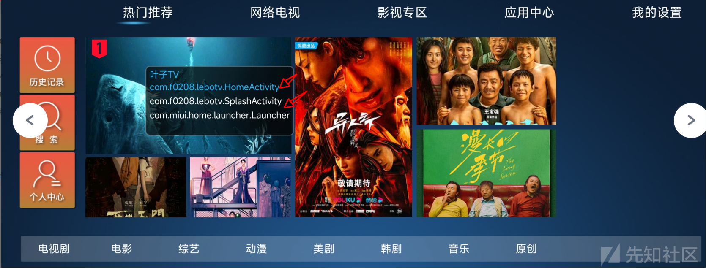](https://xzfile.aliyuncs.com/media/upload/picture/20231126185245-ee8f7a5a-8c49-1.png)

-   试着打开一个视频，发现需要先登录，别的功能几乎也是要求先登录。

### 逻辑分析

-   先分析一下登录逻辑

[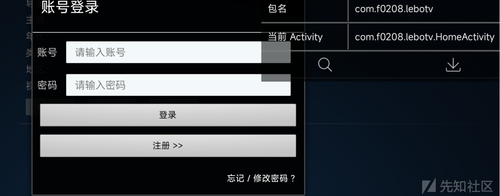](https://xzfile.aliyuncs.com/media/upload/picture/20231126185317-01765896-8c4a-1.png)

-   将apk拖入jadx进行分析。根据登录Dialog的文本搜索相关内容。找到这个函数，经过分析就是处理未登录这一问题的。

[](https://xzfile.aliyuncs.com/media/upload/picture/20231126185329-08a45cd0-8c4a-1.png)

```plain
public void a(Activity activity, a aVar, boolean z) {
        b();
        this.f3573b = new Dialog(activity); // 账号登录的Dialog初始化
        View inflate = View.inflate(activity, C0444R.layout.user_form, null);
        this.f3574c = (ProgressBar) inflate.findViewById(C0444R.id.progress);
        this.f3574c.setIndeterminateDrawable(activity.getResources().getDrawable(C0444R.drawable.custom_progress_draw));
        EditText editText = (EditText) inflate.findViewById(C0444R.id.user_name_et); // 账号输入
        EditText editText2 = (EditText) inflate.findViewById(C0444R.id.user_pass_et); // 密码输入
        this.f3573b.setTitle("账号登录");
        this.f3573b.setContentView(inflate);
        this.f3575d = (Button) inflate.findViewById(C0444R.id.btn_confirm);
        this.e = (Button) inflate.findViewById(C0444R.id.btn_confirm_epsd); // 忘记密码按钮
        this.f = (Button) inflate.findViewById(C0444R.id.btn_confirm_regist); // 注册按钮
        this.f3575d.setOnClickListener(new View$OnClickListenerC0311g(this, editText, editText2, aVar)); // 登录按钮，点击后会跳转，传参就包含输入的账号密码
        this.e.setOnClickListener(new View$OnClickListenerC0313i(this, activity, aVar, z));
        this.f.setOnClickListener(new View$OnClickListenerC0315k(this, activity, aVar, z));
```

-   进入`OnClickListenerC0311g` 类的具体定义中，发现onclick函数。

[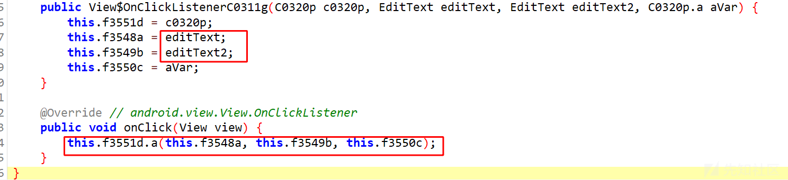](https://xzfile.aliyuncs.com/media/upload/picture/20231126185336-0cca1890-8c4a-1.png)

-   继续进入onclick后调用的a函数。就是网络请求的处理逻辑了，而且还直接将接口api写在代码里，这在开发中是非常不安全的行为。

[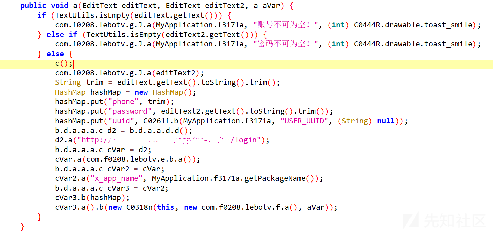](https://xzfile.aliyuncs.com/media/upload/picture/20231126185342-10446ffc-8c4a-1.png)

-   既然都到这了就顺便抓包看一下（这里使用小黄鸟进行抓包）。其中请求baseurl就是上图中的d2.a，下图是请求的具体内容，其中有三个参数，分别是password，phone和uuid，和上图中的写入hashmap中的内容一致。传输参数也不做编码或者加密。再看一下登录的响应中，还好只返回了账号或者密码错误而不是账号密码错误。

[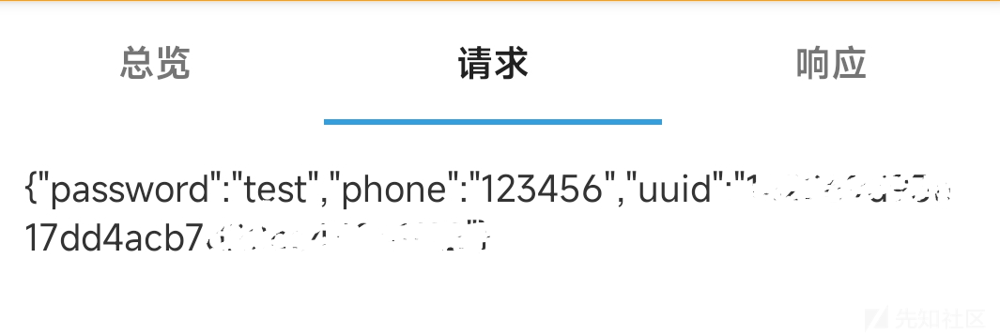](https://xzfile.aliyuncs.com/media/upload/picture/20231126185346-12ed96ac-8c4a-1.png)

[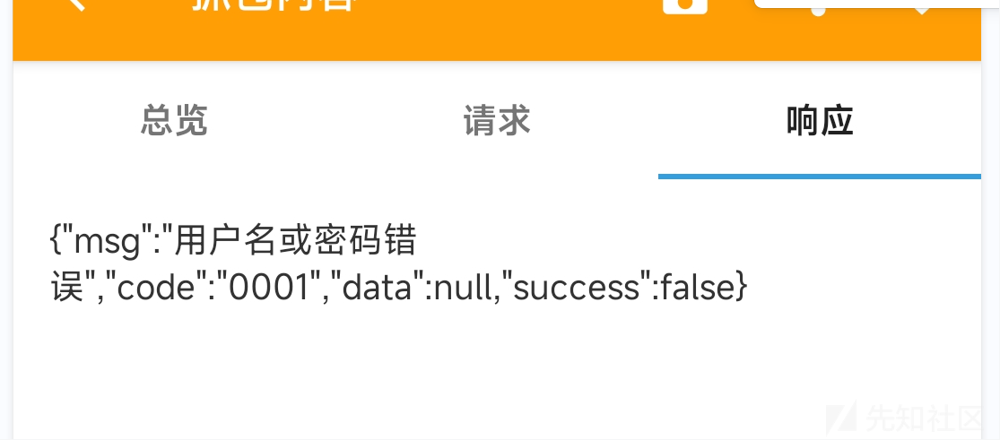](https://xzfile.aliyuncs.com/media/upload/picture/20231126185351-15aaab78-8c4a-1.png)

-   好了。关于登录的逻辑的分析先到这。我们来想一下怎么饶过输入，直接观看某视频。那就先来看一下怎么调用的登录Dialog。经过分析可以得出，其中有下列的功能要使用的话要求先登录。

[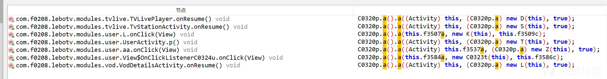](https://xzfile.aliyuncs.com/media/upload/picture/20231126185356-189ba206-8c4a-1.png)

-   第一个应该是视频播放的时候要登录，我们来看一下具体的逻辑。其中要根据a((Context) MyApplication.f3171a, "isUserLogin", false)返回值来判断是否要登录。a函数：从指定的上下文对象中获取名为 "com.f0208.lebotv" 的SharedPreferences（用于在 Android 应用程序中存储和读取轻量级数据的机制。它提供了一种简单的键值存储方式。），然后获取对应键名 `str` 的布尔值数据。如果找不到对应的键名，则返回默认值 `z`。

```plain
if (!C0261f.a((Context) MyApplication.f3171a, "isUserLogin", false)) {
            com.f0208.lebotv.g.J.a(MyApplication.f3171a, "请登录后再操作", (int) C0444R.drawable.toast_smile);
            C0320p.a().a((Activity) this, (C0320p.a) new D(this), true);
        } else if (this.C.size() == 0) {
            r();
        }
public static boolean a(Context context, String str, boolean z) {
        return context.getSharedPreferences("com.f0208.lebotv", 0).getBoolean(str, z);
    }
```

-   然后这里想到的是不是可以将第一个if的判断条件取反。根据关键词isUserLogin找到smali中这一部分。将nez改为eqz。

[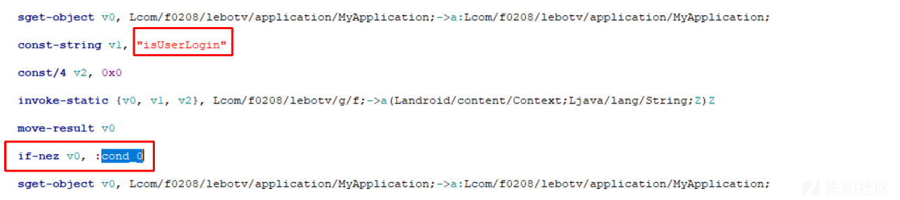](https://xzfile.aliyuncs.com/media/upload/picture/20231126185403-1ca99b0a-8c4a-1.png)

-   改完上面这一处，发现并不可以跳过登录。那就干脆把全部的有关这个函数调用的判断改掉，当然也可以都分析一下具体改哪个。但是这个app有一定混淆，而且调用并不多，反而全改更节省时间。经过上面的更改发现可以跳过登录，但是无法播放，应该是后台数据挂了。为了验证这一想法，注册个账号登录看一下（登录并不验证手机号，可以随便编一个），就是不能观看。

### 抓包分析

-   之前的逻辑是通过修改smali代码来跳过登录。但是从上面一些分析来看，应该的网络请求并没有进行加密或者编码处理。就想着是否可以通过修改响应在不注册的情况下来实现登录。下面是登录成功返回的内容。

[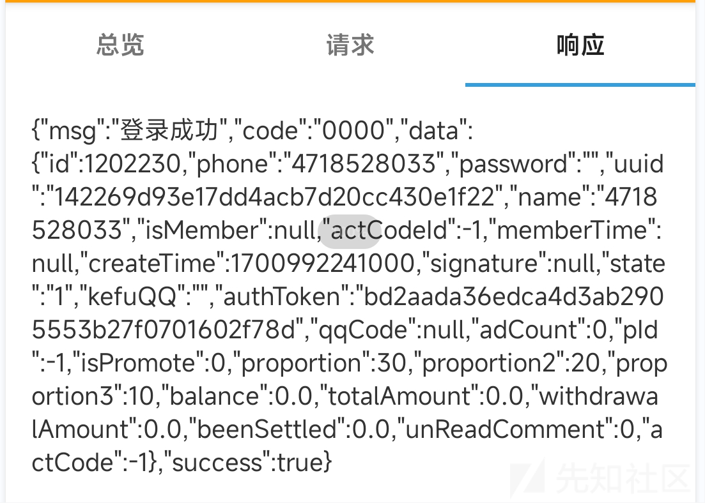](https://xzfile.aliyuncs.com/media/upload/picture/20231126185409-203e251a-8c4a-1.png)

-   我们需要做的是将上面登录成功的响应作为登录错误的响应。这里用到小黄鸟的静态注入功能。首先我们保存响应体，会存储在HttpCanry的目录下，同时也会保存head，或者raw，后面导入的时候看清楚。

[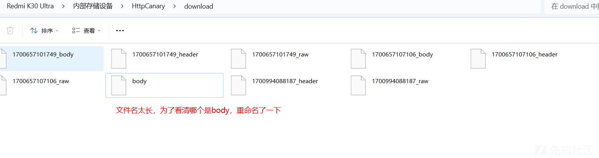](https://xzfile.aliyuncs.com/media/upload/picture/20231126185413-228ea97a-8c4a-1.png)

-   选择登录的网络请求，并选择静态注入。

[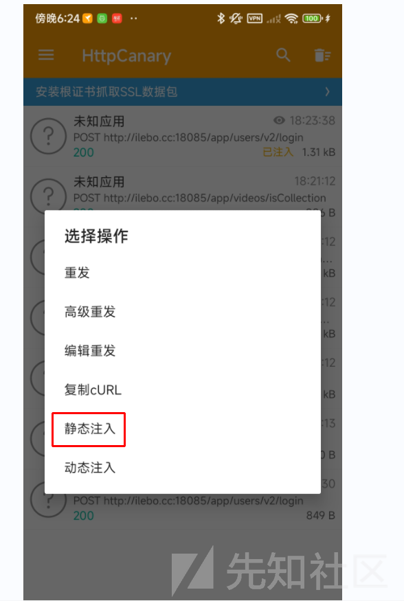](https://xzfile.aliyuncs.com/media/upload/picture/20231126185417-255d7a28-8c4a-1.png)

-   然后创建静态注入器，名字无所谓。然后选择响应，找到响应体，点击编辑。

[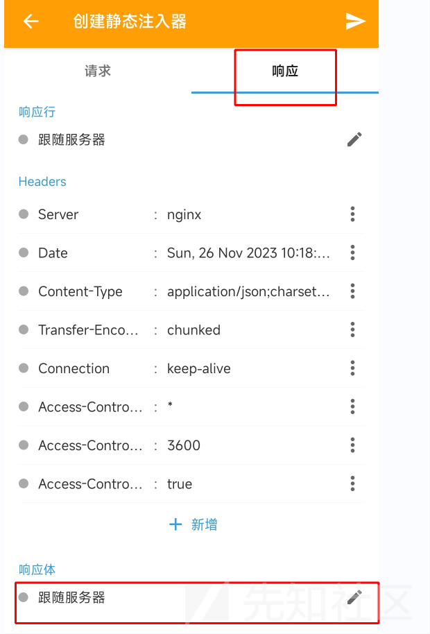](https://xzfile.aliyuncs.com/media/upload/picture/20231126185423-28c67a34-8c4a-1.png)

-   选择文件上传，找到我们之前保存的登录成功的body即可。也可以选择在线编辑，然后将正确的响应复制过来。但是我本地测试的时候，提示无法获取数据，希望有知道原因的大佬解答一下。

[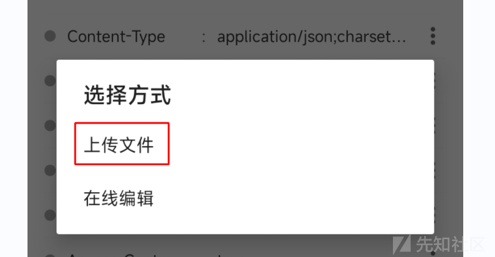](https://xzfile.aliyuncs.com/media/upload/picture/20231126185428-2b9fbc3e-8c4a-1.png)

-   然后回到app，随便找个账号登录。发现可以登录成功。看一下小黄鸟，发现最新一条登录请求显示注入成功。

[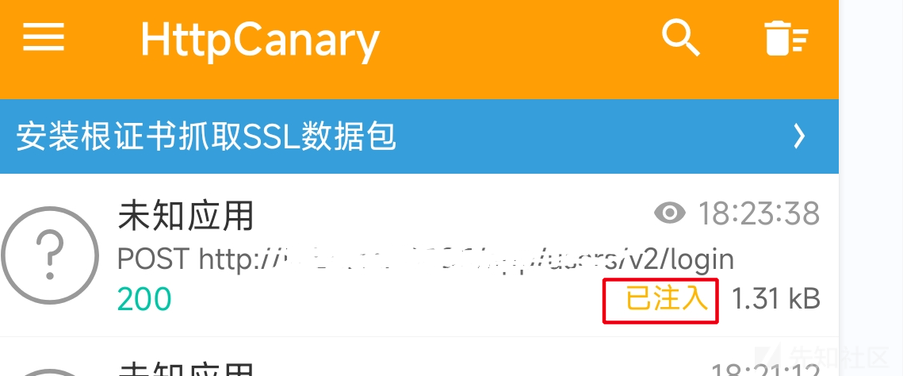](https://xzfile.aliyuncs.com/media/upload/picture/20231126185432-2e45c69a-8c4a-1.png)

-   好了。通过修改网络请求实现登录，也结束了。希望多提意见，感谢！

### 以上内容仅供学习，不可用于其他未授权或者违F行为！！！

-   附件中有相关apk，大家可以动手试一下。

com.f0208.lebotv.zip (15.837 MB) [下载附件](https://xzfile.aliyuncs.com/upload/affix/20231126185618-6d2e50ca-8c4a-1.zip)
