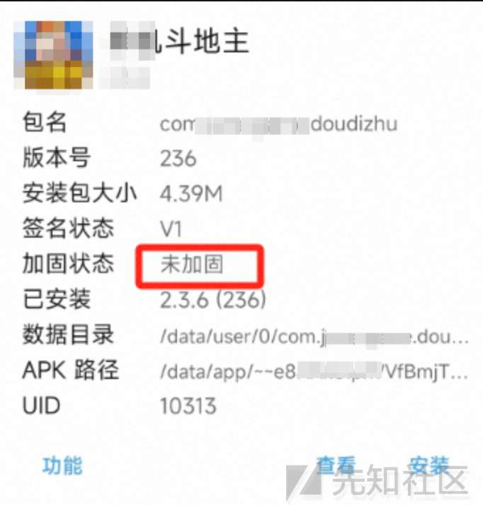

# APK逆向分析入门-以某斗地主APP为例 - 先知社区

APK逆向分析入门-以某斗地主APP为例

- - -

## 加固检测

-   使用MT管理器显示加固状态为未加固
    -   如遇到加固，可以使用使用BlackDex进行脱壳[https://github.com/CodingGay/BlackDex/releases（见参考）](https://github.com/CodingGay/BlackDex/releases%EF%BC%88%E8%A7%81%E5%8F%82%E8%80%83%EF%BC%89)

[](https://xzfile.aliyuncs.com/media/upload/picture/20231103164543-5ff944dc-7a25-1.jpg)

## 支付逻辑

-   进入游戏，同时使用MT管理器的activity记录器查看当前activate
    
    -   当前是StartActivity[](https://xzfile.aliyuncs.com/media/upload/picture/20231101151319-2251e56c-7886-1.png)
        
    -   点击记牌器，切换了Activity[](https://xzfile.aliyuncs.com/media/upload/picture/20231101151334-2ba7d5cc-7886-1.png)
        
    -   点击购买，挑战到阿里的支付Activity  
        [](https://xzfile.aliyuncs.com/media/upload/picture/20231101151528-6fa6bedc-7886-1.png)

### 使用jadx加载app，查看具体源码

-   关键字搜索，先查一下有没有记牌器这个关键词，发现真有  
    [](https://xzfile.aliyuncs.com/media/upload/picture/20231101153051-95655bfe-7888-1.png)
-   搜索字符串，知道了com.june.game.doudizhu.activities.b.a 方法会判断开通的是哪一个，就是开通几天的记牌器
-   然后查看什么调用了这个a方法。一共有3个调用，结合关键字2 7 30，应该就是开头2天，7天，30天对应的逻辑操作。  
    [](https://xzfile.aliyuncs.com/media/upload/picture/20231101154436-8190b770-788a-1.png)
-   查看其中一个方法，是对Dialog的ClickListener  
    [](https://xzfile.aliyuncs.com/media/upload/picture/20231101154909-242b7a10-788b-1.png)
-   综上可以知道一定的支付逻辑，点击记牌器会出现3个Dialog，属于三种不同的记牌器，然后点击其中一个会调用com.june.game.doudizhu.activities.b.a方法，2 7 30作为传参，然后a根据传参调用不同的支付。
-   然后接着看图4中的com.june.game.doudizhu.activities.b.a 方法，a方法会根据上一步中我们选择的不同的dialog来进行不同的操作。最后会经过调用com.june.game.a.a.a().a(this.e, str, str2, d + "", new w(this));方法，参数是刚才的赋值。  
    [](https://xzfile.aliyuncs.com/media/upload/picture/20231101160251-0dc04cb8-788d-1.png)
-   进入com.june.game.a.a.a().a()函数  
    \`\`\`  
    java public void a(String str, String str2, String str3, String str4, c cVar) {
    
    ```plain
    if (str3 == "") {
          str3 = ".";
      }
      String a2 = a(str, str2, str3, str4);
      String a3 = f.a(a2, "MIICdQIBADANBgkqhkiG9w0BAQEFAASCAl8wggJbAgEAAoGBAN565YmUT5fKPEho3DRpQFhmsRkZTAr+5mbsYgyya8hlOlte/U0/6iD/fzZqkdXUqg80zwUO5bw6iZj5zVb66iYScY6W6bMQkYkTOMSmsqVUkbdpaYojOkC4cBR87N/VGL8hTDWHlwoXCpMAEDIwV5Rmpj6AZNYGfE5ertMEAQJbAgMBAAECgYBOvLvjtwN8Ouyey82zFtTY9G8U7OkGszOjlWEWEUcoAvtmPvXykv4vc3z4Kzs1rDALdasWpTEVLrpn03CiqeaXraS++2+8utnFdA2jH+FQPGBPHu+uP5Ye5NeE2o3HD+0VFC9MBcZomPGA8tKT3b82FFnmtUhdw+UzhN5AUQkVAQJBAPtX6+Y6tQwPIsAw/8pHxKvZcMI+5E5X23I6BtzTc5YFGKxTRy5HRbhMQEeYuENhzXJPiCZs7EXjFCqPrm+KSpsCQQDimhTFI4txjX/6H6QKkiAETTgog+1AUVZt8OWJdz6TwOziGv1vpXqaiumTRq8C+owWDAWhbzFtCQUc/Wv6MMNBAkBKxhBXEPYVnVcgSDOA0TMQUQL7tswjBn4xkFPEVF/ZrLB3a9sMSIXUW1LwOd3vpeQB8uk1TUhJTlIMi2xAoKqrAkAvcEJY4xAWPaFFI8qby+uX+vJ+yN+qT1zgt0XWeXhIRmNREoVsEiCQqfQsOOf6n6kkFHA5U6XtRa4kW4l3Xy4BAkAzMB2x6cX18IIe3suZPZfTLLeiXXmMm+IiwlRExKKYevwZ3U5a+yK7+UEedwkCWf92HQW9e5xDSZEqeFzuUq7r");
      try {
          a3 = URLEncoder.encode(a3, "UTF-8");
      } catch (UnsupportedEncodingException e) {
          e.printStackTrace();
      }
      new b(this, a2 + "&sign=\"" + a3 + "\"&sign_type=\"RSA\"", cVar);
    ```
    
    }

\`\`\`

-   调用b(this, a2 + "&sign=\\"" + a3 + "\\"&sign\_type=\\"RSA\\"", cVar)函数，查看该函数，看到了PayTask，终于看到了支付关键字。  
    [](https://xzfile.aliyuncs.com/media/upload/picture/20231101160926-f99cc2ec-788d-1.png)
-   使用jadx查找用例，可以发现该函数的调用用例  
    [](https://xzfile.aliyuncs.com/media/upload/picture/20231101161815-34bff974-788f-1.png)
-   查看com.june.game.doudizhu.activities.b.w.a函数，发现这一段比较关键的代码，首先从一个函数中获取返回值a2,然后判断这个值是否等于9000，再进行下面的购买（关键词pay,具体逻辑先不看）操作。  
    [](https://xzfile.aliyuncs.com/media/upload/picture/20231101161946-6b2760a6-788f-1.png)
-   其中PayTask函数的返回值就是上面a函数的入参，然后将入参作为获取String a2 = new com.june.game.a.e(str).a();的入参，最后将a2与9000比较，由于这里是写死的if-else比较，我们可以先不考虑具体的调用阿里支付的逻辑，来看一下9000有没有特殊含义。
-   使用jadx搜索关键词：9000.找到alipay的库中的调用，  
    [](https://xzfile.aliyuncs.com/media/upload/picture/20231101162731-8033ac7e-7890-1.png)  
    进一步查看，可以得出9000是支付结果的resultcode，代表着成功，那就意味着可以直接修改a2或者if挑战条件就可以忽略支付真是的返回结果。  
    [](https://xzfile.aliyuncs.com/media/upload/picture/20231101162804-93a8659c-7890-1.png)  
    \## 修改支付逻辑
-   经过上面的分析可以直接用MT管理器dex编辑器直接定位到com.june.game.doudizhu.activities.b.w类  
    [](https://xzfile.aliyuncs.com/media/upload/picture/20231101164255-a6c6e642-7892-1.png)
-   方法一：不管a2获取的什么支付结果，都重新赋值为9000  
    方法二：将if-eqz（if equal to zero）改为if-nez（if not equal to zero），改变跳转逻辑。为了方便将两个方法写在了一起，方便放一张图。  
    [](https://xzfile.aliyuncs.com/media/upload/picture/20231101164556-12e0dcac-7893-1.png)
-   结果，选择购买跳转支付宝支付后返回就可以。购买成功，记牌器可以成功使用（两种方法皆可以）。  
    [](https://xzfile.aliyuncs.com/media/upload/picture/20231101164708-3d949e70-7893-1.png)  
    \## 总结
-   找到最终要修改的部分的逻辑图。  
    [](https://xzfile.aliyuncs.com/media/upload/picture/20231101165630-8c80a758-7894-1.png)
-   相关文件链接

打赏
