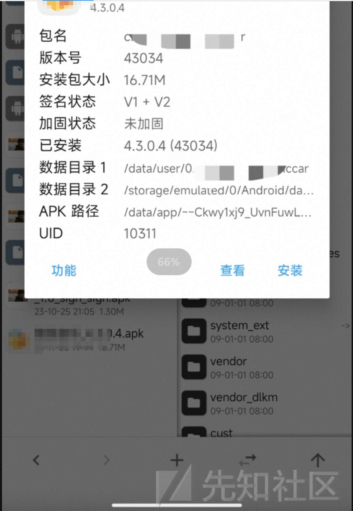

# APK逆向分析入门-以某车载音乐APP为例 - 先知社区

APK逆向分析入门-以某车载音乐APP为例

- - -

## 准备

-   在某车机应用市场下载安装音乐app，使用MT管理器提取apk。并查看基本信息，发现并没有加固。  
    [](https://xzfile.aliyuncs.com/media/upload/picture/20231104165622-06d8ad18-7af0-1.jpg)
-   查看app具体内容，是最新版本。  
    [](https://xzfile.aliyuncs.com/media/upload/picture/20231103200702-7faa5548-7a41-1.png)
-   传入pc，使用jadx打开app。大致看一下，这是MVP架构，之前没接触过。果然先正向再逆向，逻辑看着就有点费劲了。  
    \## 逆向
-   查看app内哪些功能需要购买或者VIP，其中音效切换需要开通车载VIP，先对这个部分进行修改，看看能不能先不开vip就可以使用。  
    [](https://xzfile.aliyuncs.com/media/upload/picture/20231103201132-20798e9e-7a42-1.png)
-   根据弹窗中的关键词找相关逻辑代码，发现仅仅通过搜索Dialog中的文本找不到相关代码，搜索Dialog按钮“立即开通”，有几个结果，根据类的英文名可以看出与这两个有关。进入相关类详细看看。  
    [](https://xzfile.aliyuncs.com/media/upload/picture/20231103203420-500f1860-7a45-1.png)
-   上面的两个onclick都是调用的同一个函数，JumpUtils.JumpToWebVipPayFragment(MusicBagLog.PathFrom.CAR\_SOUND\_EFFECT, null);那就先不管哪个onclick了，直接看这个函数，从函数名来看应该是付款的（pay）。经过对pay函数的分析，主要是返回值是void，感觉再看这个函数已经没多大意义了。程序判断是否是vip根据在出现dialog之前，而且开通vip涉及到账号主体，肯定会更复杂，那就可以先分析开通Dialog出现的逻辑。
-   从点击音效后开始分析，进入更改音效的界面，jadx搜索“音效”。可以看出SoundEffectSettingHomeFragment是关键类。分析这个类。  
    [](https://xzfile.aliyuncs.com/media/upload/picture/20231103211028-5bc4fb52-7a4a-1.png)  
    这个Fragment会加入两个Fragment（），对应下图中的两个Title。先看CarEffectSettingFragment()，里面会选择具体的汽车音效。
    
    ```plain
    ArrayList arrayList = new ArrayList();
    arrayList.add(new CarEffectSettingFragment());
    arrayList.add(new SoundEffectSettingFragment());
    ```
    
    [](https://xzfile.aliyuncs.com/media/upload/picture/20231103212400-401e88ee-7a4c-1.png)
-   进入CarSoundEffectSettingPresenter操作逻辑，应该是切换选择音效的操作逻辑。可以看到f()函数，然后其中有JumpUtils.JumpToWebVipPayFragment(MusicBagLog.PathFrom.CAR\_SOUND\_EFFECT, null)函数的跳转，是不是特别熟悉，又回到了图四中的那部分，现在仔细看一下跳转之前的判别语句，支付的可以不看，但是要看为什么会跳转支付。
-   首先看一下什么时候会调用这个boolean f()函数。CarEffectSettingFragment中的逻辑，点击某个音效后会先调用f()函数判断，true的话就跳转具体的音效设置。可以判断能不能的关键就在f()函数。  
    [](https://xzfile.aliyuncs.com/media/upload/picture/20231104095113-a246c280-7ab4-1.png)  
    从函数中可以看出，会先进行MusicChargeUtils.e()的判断，如果为true的话才会接着后面的音效管理函数（ CarSoundEffectManager），并返回True。这里就可以想到一个简单的破解方法，就是把对e()函数返回值的判断改成相反的。  
    [](https://xzfile.aliyuncs.com/media/upload/picture/20231104095007-7b66edac-7ab4-1.png)
-   使用MT管理器打开dex文件，找到CarSoundEffectSettingPresenter中的f函数（如下图），e()的返回值复制给v0，if-nez（v0为0跳转）改if-eqz.重新打包安装。  
    [](https://xzfile.aliyuncs.com/media/upload/picture/20231104100750-f496fa76-7ab6-1.png)  
    发现可以成功切换音效。  
    [](https://xzfile.aliyuncs.com/media/upload/picture/20231104102740-ba4feeec-7ab9-1.png)
-   但是还是不能使用其他的主题也不能听VIP的歌。  
    [](https://xzfile.aliyuncs.com/media/upload/picture/20231104102918-f4827ff8-7ab9-1.png)
-   从前面的分析既然已经知道MusicChargeUtils.e()会返回是否是VIP的结果，先来看一下哪些操作调用了这个判断。  
    [](https://xzfile.aliyuncs.com/media/upload/picture/20231104103307-7d2d7cb8-7aba-1.png)  
    从其中MusicChargeCheckImpl类中对MusicChargeUtils.e()的调用来看（下图），if (music.b() && MusicChargeUtils.e())判断语句，已经知道了MusicChargeUtils.e()是不是vip的判断。接下来看music.b()是什么的判断函数。  
    [](https://xzfile.aliyuncs.com/media/upload/picture/20231104103626-f3d7dfac-7aba-1.png)
-   music.b()函数应该是判断歌曲是否是vip歌曲。继续看if-else中的跳转。
    
    ```plain
    public boolean b() {
          if (SourceType.VIPJINGPIN.a().equals(this.f34a)) {
              this.T = 1;
          }
          return this.T == 1;
      }
    ```
    
-   else if (music.b() && !MusicChargeUtils.e())，跳转出现一个Dialog，关键词“已开通,登录”，与上面的截图中的Dialog相对应。从这里就可以知道，if和if-else只有MusicChargeUtils.e()是相反的，而music.b()一样，所以这里的music.b()先不用考虑，只需要MusicChargeUtils.e()返回是true就可以。  
    [](https://xzfile.aliyuncs.com/media/upload/picture/20231104104437-1808d90c-7abc-1.png)
-   看了一下调用MusicChargeUtils.e()的地方还是挺多的，直接改的话容易出错，直接进如这个函数，看看能不能使其固定返回true。
    
    ```plain
    .method public static e()Z
      .registers 3
    
      const-string v0, "vip"
    
      const-string v1, "isCarPlayVip"
    
      const/4 v2, 0x0
    
      invoke-static {v0, v1, v2}, Lcn/kuwo/base/config/ConfMgr;->a(Ljava/lang/String;Ljava/lang/String;Z)Z
    
      move-result v0
    
      return v0
    .end method
    ```
    
    从上面e函数的smili代码可以看出，结果是将v0,v1,v2放入ConfMgr.a并返回其结果。我们可以在得到返回结果v0之后将v0改为固定值1.
    
-   修改smali代码  
    [](https://xzfile.aliyuncs.com/media/upload/picture/20231104105236-35a311a2-7abd-1.png)
-   结果，打开app会提示已开通VIP，让绑定账号，这里不用绑定返回就可以直接听vip了，效果看下图  
    [](https://xzfile.aliyuncs.com/media/upload/picture/20231104105641-c7cd833c-7abd-1.png)  
    不得不说，还是扒马褂这种经典听着舒服。  
    [](https://xzfile.aliyuncs.com/media/upload/picture/20231104105701-d3d6a262-7abd-1.png)  
    然后主题也可以直接用了。  
    [](https://xzfile.aliyuncs.com/media/upload/picture/20231104105731-e56effb0-7abd-1.png)
-   总结  
    判断vip的逻辑就一个函数，没用网络验证，还没试过如果需要登录账号并网络验证的怎么搞。慢慢来，先拿这种练练手。MVP的框架不太熟悉，看着各个组件的逻辑交互也比较混乱，以后可以再多看一些正向的内容。再接再厉，一块进步！
-   附件地址，阿里网盘  
    逆向附件  
    [https://www.aliyundrive.com/s/7Xvr5eA9Ho2](https://www.aliyundrive.com/s/7Xvr5eA9Ho2)  
    点击链接保存，或者复制本段内容，打开「阿里云盘」APP ，无需下载极速在线查看，视频原画倍速播放。
