# APP逆向入门-某违规app分析 - 先知社区

APP逆向入门-某违规app分析

- - -

# 某违规app分析

-   首先，他没有进行加固，这就好的多的多的多

## 安装

-   打开安装后的应用，可以直接使用，我还以为要用vpn，这种是不是可以直接举报了。
-   打开有广告界面，而且我以为会到了时间会直接跳到主界面，没想到一个过去接着是另一个广告，6~. 这里就不放图了，全得打码。
    -   通过分析AndroidManifest文件，发现启动activity是`Splash0Activity` ，还以为广告相关的代码也在这个activity（以往遇到的很多app的广告都是在`Splash0Activity`），但是看了一圈发现没有。于是请出MT管理器的activity记录器，发现是`Splash0Activity` （这个activity只有几秒的选择线路的画面）之后有个AdvertActivity，应该是广告的Activity。

[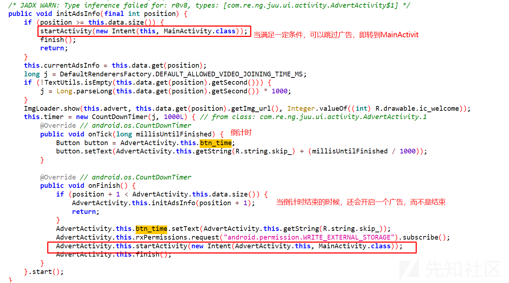](https://xzfile.aliyuncs.com/media/upload/picture/20231130102600-cd0fb0ee-8f27-1.png)

-   这里做的是将 `**if** (position >= **this**.data.size())` 的判断取反。结果也是可以直接过掉这个广告的。
-   修改上面跳过广告的代码后，重新编译安装会提示：请使用官方APP。应该是做了相关的检测。
-   还是老方法，通过jadx找关键词。定位到MainActivity中的checkpackage函数，看函数名应该是没跑了。`checkoutPackageName(activity) && activity.getString(R.string.app_signature).equals(getSignature(activity));` 看checkAPP的主要代码，用于检查当前包的签名和原始的是否一致，同时检查包名与原始的是否一致。

[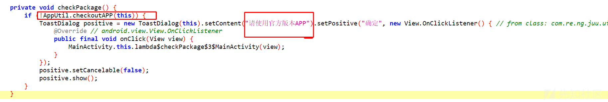](https://xzfile.aliyuncs.com/media/upload/picture/20231130102610-d3367494-8f27-1.png)

-   这里饶过这个检测的方案也是对if进行取反，当然也可以找到什么时候调用了这个函数，直接不调用即可。

[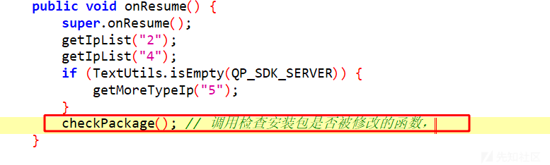](https://xzfile.aliyuncs.com/media/upload/picture/20231130102615-d622ff06-8f27-1.png)

[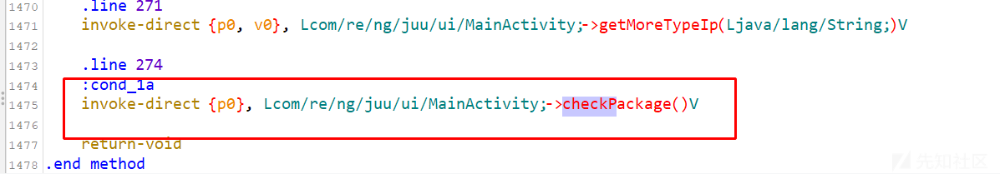](https://xzfile.aliyuncs.com/media/upload/picture/20231130102630-df4c85e8-8f27-1.png)

不调用checkPackage()就直接把上面这一句smali代码注释掉即可。

## 分析

-   经过上面简单的分析，对整个项目也有了一定的了解。接下来分析一下登录注册，目的是找到网络请求的定义，找到服务器地址。
-   先找登录的Activity，挺好找的，看名字就可以：LoginActivity
    -   登录需要验证码、手机号和密码。

[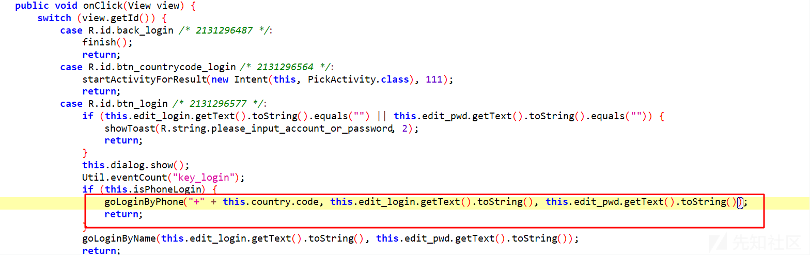](https://xzfile.aliyuncs.com/media/upload/picture/20231130102640-e4d1f5f2-8f27-1.png)

-   查看这个`goLoginByPhone` 函数。

[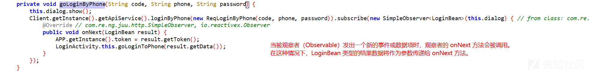](https://xzfile.aliyuncs.com/media/upload/picture/20231130102648-ea07f4cc-8f27-1.png)

-   `@MethodInfo(name = "user/loginbyphone")` 是一个自定义注解，它指定了该方法的元信息或元数据。在这种情况下，`name = "user/loginbyphone"` 表示该方法是用于通过手机号码进行登录的操作，其名称为 "user/loginbyphone"。

[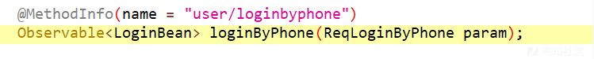](https://xzfile.aliyuncs.com/media/upload/picture/20231130102654-ed8a2d86-8f27-1.png)

-   然后找ApiServices，在ApiServices的定义中，看到了baseUrl的定义，就是这次分析login的目的。现在可以猜测这是所有网络请求的baseUrl。

[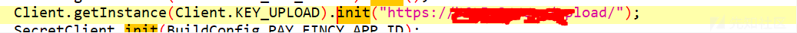](https://xzfile.aliyuncs.com/media/upload/picture/20231130102659-f0b22c16-8f27-1.png)

-   路径
    -   对路径进行爆破

### PJ

-   每次都需要登录，看看能不能修改一下，避免登录，通过对LoginActivity的调用分析，其实分析了好几个才发现华点。然后接着看goLoing的调用。如下下图，然后找几个看，发现每次调用goLoing都会用`Util.isLogin()` 进行判断，从函数名可以看出这是判断是否登录的函数。

[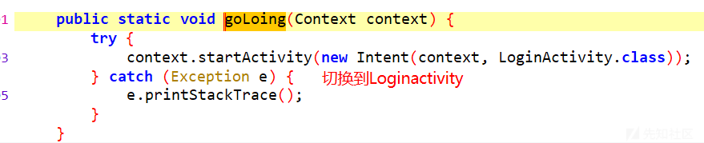](https://xzfile.aliyuncs.com/media/upload/picture/20231130102706-f48b09de-8f27-1.png)

[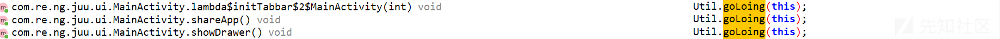](https://xzfile.aliyuncs.com/media/upload/picture/20231130102711-f7a35bbc-8f27-1.png)

-   `isLogin()` 判断用户信息是否为空，先试试把！=null改为null看看效果。
    
    ```plain
    public static boolean isLogin() {
           return APP.getInstance().getUserInfo() != null;
       }
    public static synchronized APP getInstance() {
           APP app2;
           synchronized (APP.class) {
               app2 = app;
           }
           return app2;
       }
    public void requestUserInfo(int uid) {
           Client.getInstance().getApiService().getUserInfo(new ReqUserInfo(uid)).subscribe(new SimpleObserver<BaseData<UserInfo>>() { // from class: com.re.ng.juu.APP.4
               @Override // com.re.ng.juu.http.SimpleObserver, io.reactivex.Observer
               public void onNext(BaseData<UserInfo> userInfoBaseData) {
                   UserInfo data = userInfoBaseData.getData();
                   if (APP.this.userInfo != null) {
                       data.setChess_url(APP.getInstance().userInfo.getChess_url());
                   }
                   APP.getInstance().userInfo = data;
                   Log.d(EventMessage.TAG, "EventBus post : " + data.getFrame());
                   EventBus.getDefault().post(new EventMessage(256, APP.this.userInfo));
                   APP.getInstance().userInfo.setPurchaseMode();
               }
           });
       }
    ```
    

-   改了之后虽然可以躲过提示登录，但是很多功能都没反应。应该是有的功能需要获取你的身份，比如vip什么的。获取不到就会出问题。
-   那就随便注册登录一下，切记不要泄露自己的隐私。测试也要在可控的环境内。
-   会员功能破解
    -   登录后会返回UserInfo对象，网络请求的返回值就经过编码的，比较乱，这里也先不看怎么编码的了。下面四个函数就是关于vip主要的函数，把两个set都改为非0 。

[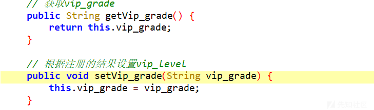](https://xzfile.aliyuncs.com/media/upload/picture/20231130102717-fb672166-8f27-1.png)

[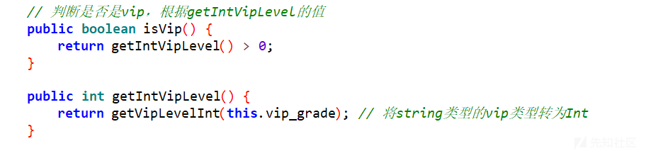](https://xzfile.aliyuncs.com/media/upload/picture/20231130102723-fe8d372c-8f27-1.png)

-   修改完上面的代码。可以安装，但是闪退
    
    -   下面是修改的使用的smali代码
    
    ```plain
    const-string v0, "1"
    iput-object v0, p0, Lcom/re/ng/juu/entity/bean/UserInfo;->vip_grade:Ljava/lang/String;
    ```
    
    -   后来发现是因为
    
    ```plain
    修改为：const-string v0, "1"
    iput-object v0, p0, Lcom/re/ng/juu/entity/bean/UserInfo;->vip_grade:Ljava/lang/String;
    保存后就变为了：
    const-string p0, "1"
    iput-object p0, p0, Lcom/re/ng/juu/entity/bean/UserInfo;->vip_grade:Ljava/lang/String;
    因为set函数会根据入参进行复制，所以这里要用参数寄存器p。
    所以要将上述代码修改为：
    const-string p1, "1"
    iput-object p1, p0, Lcom/re/ng/juu/entity/bean/UserInfo;->vip_grade:Ljava/lang/String;
    ```
    
    -   进行了上面的改正后，可以正常安装，或者修改判断是否是VIP的函数，一是改判断，而是改返回值。

[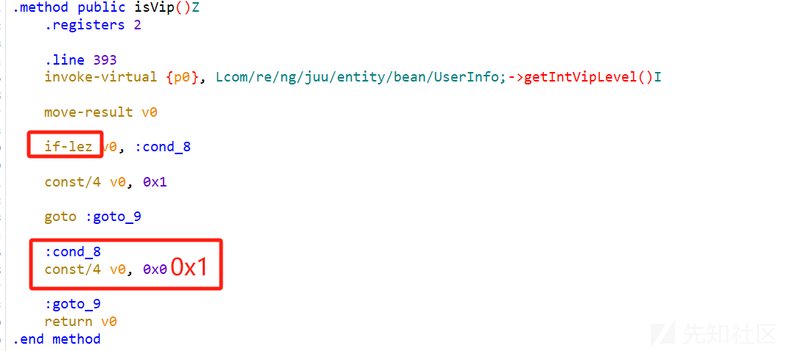](https://xzfile.aliyuncs.com/media/upload/picture/20231130102729-0244a38c-8f28-1.png)

### 由于app内容受限，app内的截图比较少，比较多的是代码分析，还请见谅！希望大家给予指导！

### 相关内容已经举报给有关部门
