# APP逆向分析-以某music软件逆向 - 先知社区

APP逆向分析-以某music软件逆向

- - -

# \*\* music？定叫他有来无回！

## 前置准备

-   **你的脑子**
    
-   **安卓9的夜神模拟器（照顾下没有工作机的家人们，同时又因为我的工作机也很烂，索性模拟器了）**
    
-   **Pixel1(后续so层需要)**
    
-   **Frida**
    
-   **Jadx**
    
-   **Charles（Burp也行）**
    
-   **SocksDroid(Postern也行)**
    
-   **\*\*音乐APP(截止到8月17日凌晨4:30分，最新版本的11.7.0)**
    
-   **如果侵犯到贵公司利益，请迅速与我联系删除，本文只为学习，请遵循法律**

**佐证：**

[](https://xzfile.aliyuncs.com/media/upload/picture/20240109164227-04b2f76e-aecb-1.jpg)

## 抓包

俗话说，不会抓包，三天之内\*了你，\*灰给你扬咯。

抓包是辅助我们迅速确定逆向目标的必备技能，后期会专门出一篇文章进行详细教学。**别急，着急容易短命。**

-   **搞到自己的IP地址，cmd里面ipconfig可以，用Charles帮助里面查看IP也行**

[](https://alidocs.oss-cn-zhangjiakou.aliyuncs.com/res/2M9qPmw2JvEmO015/img/0524d9ba-bc3a-487a-b6cf-b5384d6f0078.png)

-   **打开SocksDroid，输入自己的ip和配置好的端口号**

[](https://alidocs.oss-cn-zhangjiakou.aliyuncs.com/res/2M9qPmw2JvEmO015/img/6d707d24-510b-465f-a9fa-b7bd847820ff.png)

[](https://alidocs.oss-cn-zhangjiakou.aliyuncs.com/res/2M9qPmw2JvEmO015/img/34fa8d31-c8ba-4de0-bbd3-7e2d74abb599.png)

-   **打开，抓包即可，本APP并没有采用诸如SSL Pinning或者双向验证之类的防抓包，整体还是比较顺利的。**

[](https://alidocs.oss-cn-zhangjiakou.aliyuncs.com/res/2M9qPmw2JvEmO015/img/8a194feb-52ad-4ea7-bdaf-adad74d7bf47.png)

[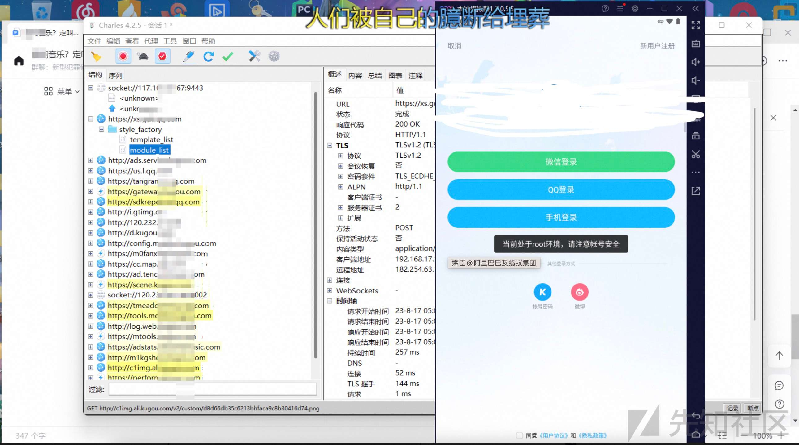](https://xzfile.aliyuncs.com/media/upload/picture/20240109161702-77a6cc54-aec7-1.jpg)

-   **我们将对登录下手，选择账号密码登录，随便输入即可，接着登录抓到包。**

[](https://xzfile.aliyuncs.com/media/upload/picture/20240109161859-bdad1d7a-aec7-1.jpg)

[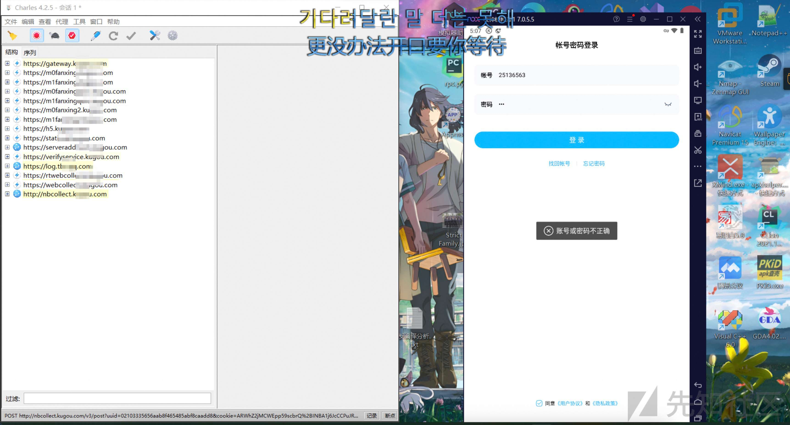](https://xzfile.aliyuncs.com/media/upload/picture/20240109162021-ee6ebbc6-aec7-1.jpg)

:::  
中途会有图片验证码验证，不必理会，后续你会发现，就算不验证也不影响抓包  
:::

-   **得到我们想要的结果，signature等所需就在其中。**

[](https://xzfile.aliyuncs.com/media/upload/picture/20240109162201-2a0f5bd6-aec8-1.jpg)

## 解决root提醒

细心的家人们会发现，在我们进入APP后，会显示**“当前处于root环境，请注意账号安全”**

虽然只是提醒，对后期的工作没有影响，但还是满烦人的，root那么好，我不允许凶root捏！

[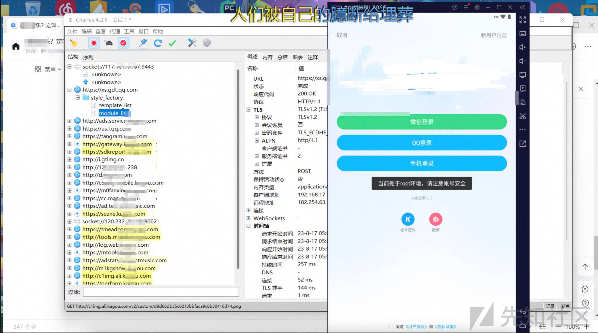](https://xzfile.aliyuncs.com/media/upload/picture/20240109162549-b1e4ecec-aec8-1.jpg)

我们打开jadx，反编译APP，搜索**“当前处于root环境，请注意账号安全”，**找到代码逻辑。

[](https://alidocs.oss-cn-zhangjiakou.aliyuncs.com/res/2M9qPmw2JvEmO015/img/5d6de7ad-5048-4081-85bb-c78c5ddd9226.png)

逻辑很清楚，如果br.bu，那么弹窗**“当前处于root环境，请注意账号安全”，**主要看bu的返回值咯。

摁住“ctrl(啃臭)”键，单击bu，即可跳转到对应的函数

[](https://alidocs.oss-cn-zhangjiakou.aliyuncs.com/res/2M9qPmw2JvEmO015/img/771b6066-af75-4c1f-8eb8-4baf9a4a694f.png)

逻辑或运算，两个判断条件其中有一个成立最终的结果就是true，同时要注意，只要满足第一个条件，后面的条件就不再判断，可巧妙判断设备没有root。

两种方法：

-   hook bu函数，令其返回所需的定值
    
-   hook bF函数和bG函数，令其返回所需的定值
    

代码如下：

[](https://alidocs.oss-cn-zhangjiakou.aliyuncs.com/res/2M9qPmw2JvEmO015/img/c207cab7-a655-407f-8f3b-950da23c878a.png)

```plain
function kugousign(){

Java.perform(function (){
    //检测root，虽然这个检测对咱们后续工作没什么影响
    let br = Java.use("com.kugou.common.utils.br");
    br["bu"].implementation = function () {
        console.log('bu is called');
        let ret = this.bu();
        console.log('bu ret value is ' + ret);
        return false;
    };

    br["bF"].implementation = function () {
        console.log('bF is called');
        let ret = this.bF();
        console.log('bF ret value is ' + ret);
        return false;
    };


    br["bG"].implementation = function () {
        console.log('bG is called');
        let ret = this.bG();
        console.log('bG ret value is ' + ret);
        return false;
    };
})
}
setImmediate(kugousign);
```

兴高采烈注入，出事儿了。

## Frida检测绕过

本文主要使用的调试工具是frida，好④不④这APP非常叛逆，居然擅自检测了frida，每次进行代码注入都会闪退。

于是简单分析了下，发现是ptrace占坑检测frida(后续单独出文章讲)，可以简单理解为：frida附加进程需要占个坑，而APP自己生出了个子进程提前附加在父进程上，把坑跟先一步占了。

**绕过不难。**

[](https://alidocs.oss-cn-zhangjiakou.aliyuncs.com/res/2M9qPmw2JvEmO015/img/742e722e-53e5-4ec5-a615-b034585d21f4.png)

先启动frida，按兵不动。

接着打出如下命令，用于frida的进程附加。

```plain
frida -U -f com.kugou.android  -l D:\new\jdong\sign.js
```

之后根据提醒输入

```plain
%resume
```

[](https://alidocs.oss-cn-zhangjiakou.aliyuncs.com/res/2M9qPmw2JvEmO015/img/9beace15-f9a1-4a5f-9361-4af0d344c509.png)

这样就绕过检测了，也不乱叫了。

[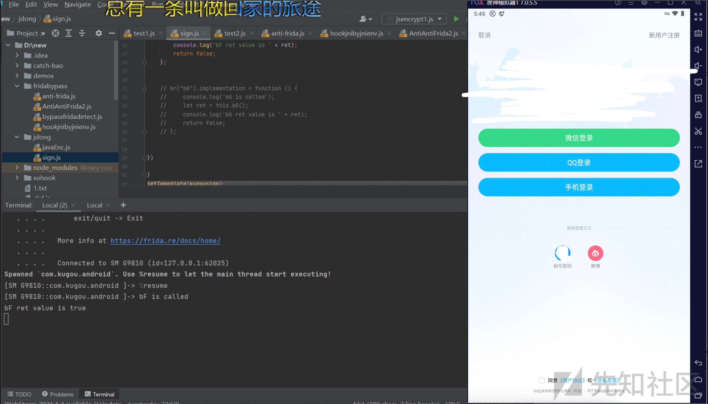](https://xzfile.aliyuncs.com/media/upload/picture/20240109162827-0fbba77a-aec9-1.jpg)

## Signature分析

定位方法后续出文章讲解,本文重点不在此处。

[](https://alidocs.oss-cn-zhangjiakou.aliyuncs.com/res/2M9qPmw2JvEmO015/img/cf002010-fc75-4347-9257-f95a53fb128a.png)

最终定位到"com.kugou.common.useraccount.b.u"

[](https://alidocs.oss-cn-zhangjiakou.aliyuncs.com/res/2M9qPmw2JvEmO015/img/3fc0b4b3-1d91-4bf9-98d5-7094d8f4ec6b.png)

分析可知signature来自于a函数[](https://alidocs.oss-cn-zhangjiakou.aliyuncs.com/res/2M9qPmw2JvEmO015/img/9ee10b8e-bae5-471d-bb43-22ec0d369f32.png)

在此时，为了确定我们寻找的位置是否正确，可以用frida验证。

```plain
let w = Java.use("com.kugou.common.network.w");
w["a"].overload('java.lang.String', 'java.util.Map', 'java.lang.String').implementation = function (str, map, str2) {
    console.log('a is called' + ', ' + 'str: ' + str + ', ' + 'map: ' + map + ', ' + 'str2: ' + str2);
    let ret = this.a(str, map, str2);
    console.log('a ret value is ' + ret);
    return ret;
};
```

[](https://xzfile.aliyuncs.com/media/upload/picture/20240109162932-368ae6c2-aec9-1.jpg)  
frida反馈

[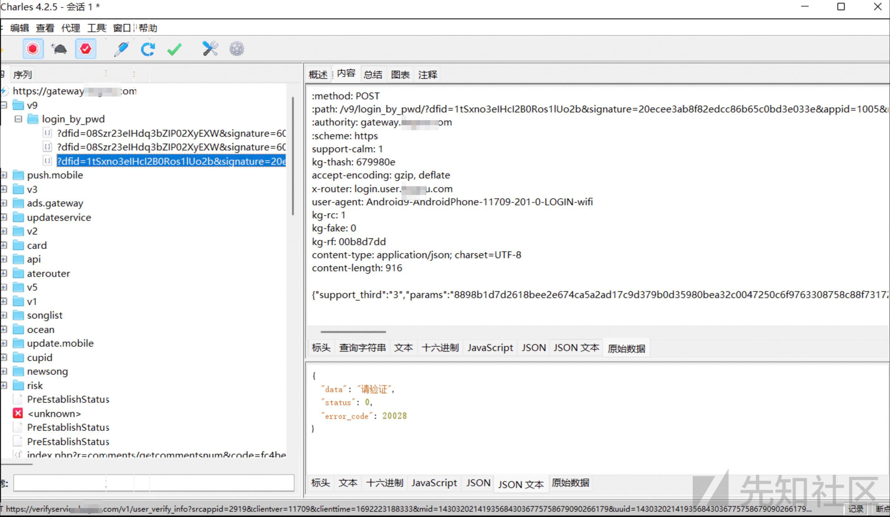](https://xzfile.aliyuncs.com/media/upload/picture/20240109163103-6cfa6e30-aec9-1.jpg)

Charles抓包反馈

可得signature值是一样的，同时获得了入参。

定值arg\[0\]:OIlwieks28dk2k092lksi2UIkp

arg\[1\]:map数组

:::  
JSON.stringify(map) 看看是什么数组[](https://alidocs.oss-cn-zhangjiakou.aliyuncs.com/res/2M9qPmw2JvEmO015/img/2cebe738-4ddb-42ff-8a3d-5c0a5ad52b7b.png)

则用frida打印一眼定真

```plain
var HashMap = Java.use('java.util.HashMap');
console.log("map：" + Java.cast(map, HashMap).toString());
```

[](https://alidocs.oss-cn-zhangjiakou.aliyuncs.com/res/2M9qPmw2JvEmO015/img/58ec6826-b8a1-47f4-bb73-13d2da347225.png)  
:::

arg\[2\]:老长一大堆

我们多抓包打印两次对比参数是否固定，可得:

[](https://alidocs.oss-cn-zhangjiakou.aliyuncs.com/res/2M9qPmw2JvEmO015/img/0f0f32be-c03a-4128-bb0f-17dff7cf9131.png)

arg\[2\]中的参数固定的有:"support\_third","dev"(手机的型号),"plat","support\_multi","support\_verify","gitversion","t3"

可变的参数为:"params","clienttime\_ms"(时间戳),"dfid","pk","t1","t2","key","username"

### pk

[](https://alidocs.oss-cn-zhangjiakou.aliyuncs.com/res/2M9qPmw2JvEmO015/img/ef1e1230-4a40-41a6-b5b3-bef21fbe53fb.png)

跳转到ICON\_PK一看，是[](https://alidocs.oss-cn-zhangjiakou.aliyuncs.com/res/2M9qPmw2JvEmO015/img/838bbd81-e311-47de-91aa-e9e56ec6f4d8.png)

那么就关心下列算法即可:[](https://alidocs.oss-cn-zhangjiakou.aliyuncs.com/res/2M9qPmw2JvEmO015/img/6b6dcd4c-9e52-4c7e-b37c-376453651a1a.png)

先把容易的jSONObject.toString()解决吧。

[](https://alidocs.oss-cn-zhangjiakou.aliyuncs.com/res/2M9qPmw2JvEmO015/img/d3c8bdc1-e091-48eb-90d4-75c4e384194f.png)

[](https://alidocs.oss-cn-zhangjiakou.aliyuncs.com/res/2M9qPmw2JvEmO015/img/d64e47af-51ba-4ac7-adec-2821d601bab1.png)

```plain
let h = Java.use("com.kugou.common.useraccount.utils.h");
    h["a"].overload('java.lang.String', 'java.lang.String').implementation = function (str, str2) {
        console.log('a is called' + ', ' + 'str: ' + str + ', ' + 'str2: ' + str2);
        let ret = this.a(str, str2);
        console.log('ax ret value is ' + ret);
        return ret;
    };
```

由图可见jSONObject内只有两个内容，一个clienttime\_ms，一个key。

clienttime\_ms来自a2:[](https://alidocs.oss-cn-zhangjiakou.aliyuncs.com/res/2M9qPmw2JvEmO015/img/eafb2c05-cce1-4884-b5e3-69d87d3200e6.png)，很显然是时间戳。

key来自a3:[](https://alidocs.oss-cn-zhangjiakou.aliyuncs.com/res/2M9qPmw2JvEmO015/img/491b52dc-d43d-47ff-9fda-dd41a0e3c152.png),简单分析:

a3来自a方法，a方法如下(里面很多a方法，可以用ctrl＋所要跳转的方法，一般能快速定位，并通过frida验证):

[](https://alidocs.oss-cn-zhangjiakou.aliyuncs.com/res/2M9qPmw2JvEmO015/img/bbcc5577-c815-4f9c-b4e7-1c3b57f85f54.png)

再看a方法中的a方法:

[](https://alidocs.oss-cn-zhangjiakou.aliyuncs.com/res/2M9qPmw2JvEmO015/img/c40836b4-9c60-4160-99cb-5564739dcf73.png)

看看OS\_UNKNOWN是什么:

[](https://alidocs.oss-cn-zhangjiakou.aliyuncs.com/res/2M9qPmw2JvEmO015/img/41ddfac3-f043-4633-bc4c-a91cd60d26a0.png)

综上，第一个a方法调用java中加密的api生成128位aes密钥，再传入第二个a方法作为参数，经过遍历和与'-1'的按位与异或，去掉字节b2高位的符号位信息，保留低8位二进制的数据，再将操作后的数据以Integer.toHexString()方法转换为16进制，若结果长度为1，则前面补0，否则转换为小写，拼接到新建的stringBuffer中，返回字符串。由于先前每个字节都以两位十六进制表示，所以算法结果长度为字节数组的两倍。所得的stringBuffer字符串又回到第一个a方法中，利用subString方法截取前16位为结果。

分析为第一个参数，再看看第二个。

遵循由内向外的原则，看看lq:

[](https://alidocs.oss-cn-zhangjiakou.aliyuncs.com/res/2M9qPmw2JvEmO015/img/1aa8bf6b-592f-427b-83fc-563cd6d180bb.png)

看看ConfigKey函数:

[](https://alidocs.oss-cn-zhangjiakou.aliyuncs.com/res/2M9qPmw2JvEmO015/img/290a37e1-a9b6-4394-aef0-28177df060d6.png)

一眼定真，输入什么就输出什么''listen.usersdkparam.apprsa''

看看b函数:

[](https://alidocs.oss-cn-zhangjiakou.aliyuncs.com/res/2M9qPmw2JvEmO015/img/90c639c0-e4f8-4f1f-864f-1d791995434a.png)

应该是个定值，frida代码hook过后确定:

```plain
let g = Java.use("com.kugou.common.config.g");
    g["b"].overload('com.kugou.common.config.ConfigKey').implementation = function (configKey) {
        console.log('b is called' + ', ' + 'configKey: ' + configKey);
        let ret = this.b(configKey);
        console.log('b ret value is ' + ret);
        return ret;
    };
```

[](https://alidocs.oss-cn-zhangjiakou.aliyuncs.com/res/2M9qPmw2JvEmO015/img/b246107d-a9fc-4431-96e5-16ab6092ea20.png)

最后看看a函数:

[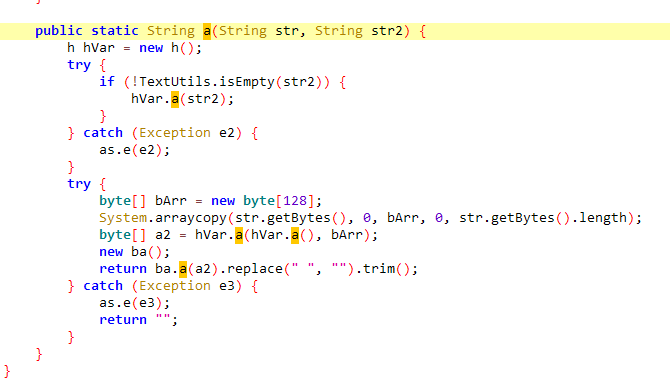](https://alidocs.oss-cn-zhangjiakou.aliyuncs.com/res/2M9qPmw2JvEmO015/img/87b6a37c-d18d-4f60-b869-9c50dcfa0513.png)

如果str2不为空，则跳转到如下方法，获取公钥字节数组并生成公钥，保存到f145061a中:

[](https://alidocs.oss-cn-zhangjiakou.aliyuncs.com/res/2M9qPmw2JvEmO015/img/71506aae-d271-4aeb-94ba-3c5a7c657f3f.png)

生成字节数组算法c.b()如下，将字符串解码为字节数组:

[](https://alidocs.oss-cn-zhangjiakou.aliyuncs.com/res/2M9qPmw2JvEmO015/img/9e0847ff-4f52-473a-b01f-9367ae8d78de.png)

之后调用hVar.a函数，获取公钥:

[](https://alidocs.oss-cn-zhangjiakou.aliyuncs.com/res/2M9qPmw2JvEmO015/img/52f4247a-5a97-4bc7-8b52-8008b5cf19fa.png)

将字符串str经过getBytes方法转换为字节数组传入bArr这个新建的128位的空字节数组中，之后利用公钥和bArr数组经过下列方法获取私钥放置于a2中:

[](https://alidocs.oss-cn-zhangjiakou.aliyuncs.com/res/2M9qPmw2JvEmO015/img/9713c120-7be2-4d52-8b14-96fc4a09d740.png)

最后创建ba对象并且调用其中的a方法，传入私钥并去空格。

ba方法如下:

[](https://alidocs.oss-cn-zhangjiakou.aliyuncs.com/res/2M9qPmw2JvEmO015/img/5100dabd-efd4-47e6-b3f4-851c1416b6f0.png)

先将传入的byte数组检验是否为空，为空返回null，否则将新建初始化长度2倍于byte数组的StringBuilder来用于结果的拼接，之后遍历传入的byte数组，将字节右移四位与240按位于，获取高四位，与15按位与，获取低四位，并且将结果与f145776d查表[](https://alidocs.oss-cn-zhangjiakou.aliyuncs.com/res/2M9qPmw2JvEmO015/img/91d673ba-970c-4586-8616-5a0c5a932d0f.png)

获取对应的base64字符，拼接到StringBuilder中转为字符串返回。

所以可以使用java代码还原pk算法,效果如下:

[](https://alidocs.oss-cn-zhangjiakou.aliyuncs.com/res/2M9qPmw2JvEmO015/img/a8f9523a-7ded-4f55-99a3-37412048415e.png)

### dfid

该参数存在于com.kugou.ktv.android.protocol.c.o类的k方法中。

[](https://alidocs.oss-cn-zhangjiakou.aliyuncs.com/res/2M9qPmw2JvEmO015/img/dcc49761-d9fa-4cd1-aabf-2a32cb30c690.png)

进入cQ函数中查看:

[](https://alidocs.oss-cn-zhangjiakou.aliyuncs.com/res/2M9qPmw2JvEmO015/img/7d0d2cb1-f433-41b4-b0e8-e29110010762.png)

调用a方法，传入两个字符串(key\_device\_finger\_id\_date)和(空字符串)，结果存入a2，如果结果为空则返回f198358g否则返回a2。

f198358g貌似是:[](https://alidocs.oss-cn-zhangjiakou.aliyuncs.com/res/2M9qPmw2JvEmO015/img/496b8878-8bcc-4d99-af8b-de1ca0f374d3.png)，未细究。

看看a方法:

[](https://alidocs.oss-cn-zhangjiakou.aliyuncs.com/res/2M9qPmw2JvEmO015/img/7aa12fbc-e169-473f-8ca5-b34ac0aea952.png)

经过frida代码分析，可得我们所需要的dfid来自于c方法:

[](https://alidocs.oss-cn-zhangjiakou.aliyuncs.com/res/2M9qPmw2JvEmO015/img/443d46f5-20cd-4ac4-8043-7270cc6400c1.png)

```plain
let a = Java.use("com.kugou.common.preferences.a");
    a["c"].overload('int', 'java.lang.String').implementation = function (i, str) {
        console.log('c is called' + ', ' + 'i: ' + i + ', ' + 'str: ' + str);
        let ret = this.c(i, str);
        console.log('c ret value is ' + ret);
        return ret;
    };
```

[](https://alidocs.oss-cn-zhangjiakou.aliyuncs.com/res/2M9qPmw2JvEmO015/img/2c48f80b-7929-4490-811c-138571ae672e.png)

传入定值为5，即i=5,跳进函数d:

[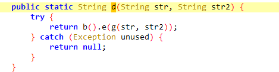](https://alidocs.oss-cn-zhangjiakou.aliyuncs.com/res/2M9qPmw2JvEmO015/img/948af9a2-cadf-474b-b254-95509d03b385.png)

跳进g函数,是字符串之间用'\_'拼接:

[](https://alidocs.oss-cn-zhangjiakou.aliyuncs.com/res/2M9qPmw2JvEmO015/img/63aea74c-0e61-47f8-a5ce-2cfb92b7b746.png)

分析到此处我发现不太对劲，貌似可以写死，于是作罢。

### key

key参数生成在com.kugou.android.app.common.comment.b.i的b方法内。

[](https://alidocs.oss-cn-zhangjiakou.aliyuncs.com/res/2M9qPmw2JvEmO015/img/aa0e876e-e895-4622-bd54-2566415bef4f.png)

完整方法为:

```plain
a2.a("key", new ba().a(br.a(Long.valueOf(br.as()), com.kugou.common.config.c.a().b(com.kugou.android.app.a.a.lp), Integer.valueOf(br.F(KGCommonApplication.getContext())), Long.valueOf(currentTimeMillis))));
```

层层分解为:

```plain
ba().a()

br.a()

Long.valueOf(br.as()), com.kugou.common.config.c.a().b(com.kugou.android.app.a.a.lp), Integer.valueOf(br.F(KGCommonApplication.getContext())), Long.valueOf(currentTimeMillis)
```

分析as()函数:

[](https://alidocs.oss-cn-zhangjiakou.aliyuncs.com/res/2M9qPmw2JvEmO015/img/fde8ccf4-8ca1-4182-86ba-2e2e22e6a735.png)、

[](https://alidocs.oss-cn-zhangjiakou.aliyuncs.com/res/2M9qPmw2JvEmO015/img/98a8318f-eb89-4b7e-8af4-7c38754b7d75.png)[](https://alidocs.oss-cn-zhangjiakou.aliyuncs.com/res/2M9qPmw2JvEmO015/img/afc66a98-0abf-431a-afff-edc099044b20.png)

看lo的内容[](https://alidocs.oss-cn-zhangjiakou.aliyuncs.com/res/2M9qPmw2JvEmO015/img/3e4a427c-ce53-4700-8ae4-da997d1b5097.png)：

[](https://alidocs.oss-cn-zhangjiakou.aliyuncs.com/res/2M9qPmw2JvEmO015/img/a73cae62-6750-40ef-853d-a53f7845eae9.png)

再看外围的b函数:

[](https://alidocs.oss-cn-zhangjiakou.aliyuncs.com/res/2M9qPmw2JvEmO015/img/b9e4a548-9ab3-45f9-bf0b-643f2a1f70fc.png)

使用frida打印b函数的结果:

```plain
let g = Java.use("com.kugou.common.config.g");
g["b"].overload('com.kugou.common.config.ConfigKey').implementation = function (configKey) {
    console.log('b is called' + ', ' + 'configKey: ' + configKey);
    let ret = this.b(configKey);
    console.log('b ret value is ' + ret);
    return ret;
};
```

获得定值:

[](https://alidocs.oss-cn-zhangjiakou.aliyuncs.com/res/2M9qPmw2JvEmO015/img/fa5423ef-e912-400d-889a-cbb9dad73f0e.png)

第二个参数:

[](https://alidocs.oss-cn-zhangjiakou.aliyuncs.com/res/2M9qPmw2JvEmO015/img/645cd697-5a26-41cb-8ba6-5b0a7a3c3dba.png)

lp内容:

[](https://alidocs.oss-cn-zhangjiakou.aliyuncs.com/res/2M9qPmw2JvEmO015/img/322d5011-3939-4dd3-8e34-162535a784c6.png)

b函数和上一个一样内容:

[](https://alidocs.oss-cn-zhangjiakou.aliyuncs.com/res/2M9qPmw2JvEmO015/img/98a8318f-eb89-4b7e-8af4-7c38754b7d75.png)

frida打印获得结果:

[](https://alidocs.oss-cn-zhangjiakou.aliyuncs.com/res/2M9qPmw2JvEmO015/img/91ae51dd-1061-400d-abea-5fd4ed234c70.png)

第三个参数主要内容看F函数:

[](https://alidocs.oss-cn-zhangjiakou.aliyuncs.com/res/2M9qPmw2JvEmO015/img/12745779-42dd-4965-a6c5-e2aba0094f78.png)

F函数的内容:

[](https://alidocs.oss-cn-zhangjiakou.aliyuncs.com/res/2M9qPmw2JvEmO015/img/ddd2ebba-b796-4e30-9224-4d251eee582e.png)

frida打印:

```plain
let br = Java.use("com.kugou.common.utils.br");
br["F"].overload('android.content.Context').implementation = function (context) {
    console.log('F is called' + ', ' + 'context: ' + context);
    let ret = this.F(context);
    console.log('F ret value is ' + ret);
    return ret;
};
```

获得结果，为定值:

[](https://alidocs.oss-cn-zhangjiakou.aliyuncs.com/res/2M9qPmw2JvEmO015/img/93fa9a6a-8170-49cd-bf8f-3197a8e64eef.png)

最后一个参数为时间戳:

[](https://alidocs.oss-cn-zhangjiakou.aliyuncs.com/res/2M9qPmw2JvEmO015/img/47e09751-5dcb-4192-bdc8-9f549ba829d0.png)

些许不同,该函数运行的结果是毫秒级别的，代码需要转换为秒级:

[](https://alidocs.oss-cn-zhangjiakou.aliyuncs.com/res/2M9qPmw2JvEmO015/img/40aeb9e8-f882-499b-ae45-cea43eafe396.png)

内部都分析完了，该br.a()函数了。

[](https://alidocs.oss-cn-zhangjiakou.aliyuncs.com/res/2M9qPmw2JvEmO015/img/6bee3f7a-155b-4a27-9623-360b25b66e98.png)

初步分析是简单的拼接，但出了小问题，在frida的过程中，莫名其妙打印不出来，比较担忧，为了确认，可以复现复现源代码。

```plain
package key;
public class keye {
    private static final String[] f145777e = {"0", "1", "2", "3", "4", "5", "6", "7", "8", "9", "a", "b", "c", "d","e" ,"f"};
    public static String b(Object... objArr) {
        StringBuffer stringBuffer = new StringBuffer();
        for (Object obj : objArr) {
            stringBuffer.append(obj);
        }
        if (false) {
            String str = "";
            for (Object obj2 : objArr) {
                str = str + obj2;
            }
            if (false) {
                d("gehu-getKeyRaw", "getKeyRaw 0:" + str);
            }
            if (false) {
                d("gehu-getKeyRaw", "getKeyRaw 1:" + stringBuffer.toString());
            }
        }
        return stringBuffer.toString();

    }


    public static void d(String str, String str2) {
        if (false) {
            String str3 = "";
            if (false) {
                if (str2 != null) {
                    str3 = str2 + a(4);
                }
                System.out.println("str ="+str);
                System.out.println("str3 ="+ str3);
                return;
            }
            if (str2 != null) {
                str3 = str2 + a(4);
            }
            System.out.println("str ="+str);
            System.out.println("str3 ="+ str3); 
        }
    }


    private static String a(byte b2) {
        int i = 0;
        if (b2 < 0) {
            i = b2 + 256;
        }
        return f145777e[i / 16] + f145777e[i % 16];
    }


    private static String a(int i2) {
        StackTraceElement[] stackTrace;
        if (false && (stackTrace = Thread.currentThread().getStackTrace()) != null && i2 >= 0 && i2 < stackTrace.length) {
            return "\n==> at " + stackTrace[i2];
        }
        return "";
    }
    public static void main(String[] args) {
        Object[] objArr = new Object[4];
        long currentTimeMillis = System.currentTimeMillis() / 1000;
        keye kk = new keye();
        long as = Long.valueOf(1005);
        String lp = "OIlwieks28dk2k092lksi2UIkp";
        int f = Integer.valueOf(11709);
        long time = Long.valueOf(currentTimeMillis);
        objArr[0] = as;
        objArr[1] = lp;
        objArr[2] = f;
        objArr[3] = time;
        String res = kk.b(objArr);
        System.out.println(res);


    }
}
```

打印发现:

[](https://alidocs.oss-cn-zhangjiakou.aliyuncs.com/res/2M9qPmw2JvEmO015/img/f8f4c9ab-07c7-44a0-8a7c-d89d7e04ccc9.png)

最外围的a函数，是md5加密:

[](https://alidocs.oss-cn-zhangjiakou.aliyuncs.com/res/2M9qPmw2JvEmO015/img/7cc298c6-03e8-4d05-a827-e7ca365dd86d.png)

md5加密后的哈希字节数组传入c函数:

[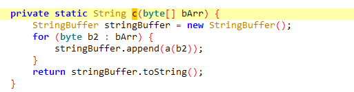](https://alidocs.oss-cn-zhangjiakou.aliyuncs.com/res/2M9qPmw2JvEmO015/img/76713d91-f49f-4029-8363-799a90bbf133.png)

再遍历数组后将每个函数传入a方法内:

[](https://alidocs.oss-cn-zhangjiakou.aliyuncs.com/res/2M9qPmw2JvEmO015/img/7d1506c0-c01a-4461-9753-c371f595e773.png)

a方法将输入的字节表示为十六进制的字符串形式，将字节值拆分为两个十六进制字符，并以字符串形式返回它们拼接的结果。

### params

[](https://alidocs.oss-cn-zhangjiakou.aliyuncs.com/res/2M9qPmw2JvEmO015/img/f4e78214-fc9a-44fa-8480-aa4b8b375cc2.png)

看看a3是什么:

[](https://alidocs.oss-cn-zhangjiakou.aliyuncs.com/res/2M9qPmw2JvEmO015/img/8d57d5ca-8dd7-416d-96f5-33cc3393313b.png)

上文分析过，此处不再赘述

看第一个参数，先用frida打印:

```plain
let a = Java.use("com.kugou.common.useraccount.utils.a");
a["b"].overload('java.lang.String', 'java.lang.String').implementation = function (str, str2) {
    console.log('b is called' + ', ' + 'str: ' + str + ', ' + 'str2: ' + str2);
    let ret = this.b(str, str2);
    console.log('b ret value is ' + ret);
    return ret;
};
```

这是未登录状态的参数:

[](https://alidocs.oss-cn-zhangjiakou.aliyuncs.com/res/2M9qPmw2JvEmO015/img/fb36c6e7-0230-46d8-87a6-a6cf2b526b06.png)

[](https://alidocs.oss-cn-zhangjiakou.aliyuncs.com/res/2M9qPmw2JvEmO015/img/df7b3e36-c8ce-4f80-97c5-8d8b4dacf6fa.png)

[](https://alidocs.oss-cn-zhangjiakou.aliyuncs.com/res/2M9qPmw2JvEmO015/img/26caee51-c5c9-41a0-b38d-c6fc2b1eec76.png)

跳入b函数:

[](https://alidocs.oss-cn-zhangjiakou.aliyuncs.com/res/2M9qPmw2JvEmO015/img/c813551f-a0ca-4fc0-92b4-465d83d8d7af.png)

看操作str和str2的a函数:

[](https://alidocs.oss-cn-zhangjiakou.aliyuncs.com/res/2M9qPmw2JvEmO015/img/1a65396b-6185-445a-b8e8-f45388d1893b.png)

看c函数:

[](https://alidocs.oss-cn-zhangjiakou.aliyuncs.com/res/2M9qPmw2JvEmO015/img/0c1b7ae6-508e-4eff-96fa-56e533bd6f47.png)

可知是MD5加密:

[](https://alidocs.oss-cn-zhangjiakou.aliyuncs.com/res/2M9qPmw2JvEmO015/img/0ba43abb-b833-47e8-a7f0-4941c34be08a.png)

分别以该结果和该结果的后16个字节作为参数。

跳入a函数:

[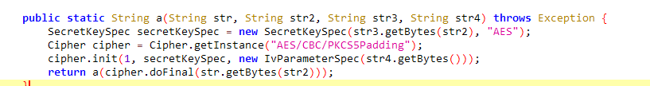](https://alidocs.oss-cn-zhangjiakou.aliyuncs.com/res/2M9qPmw2JvEmO015/img/6f154bd5-3327-4e8f-9f9f-6eedfa3bc43a.png)

SecretKeySpec用于创建一个包含密钥的SecretKey对象。通过str3.getBytes(str2)将str3转换为指定字符编码Utf-8的字节数组，然后使用该字节数组生成密钥，再使用IvParameterSpec(str4.getBytes())用于设置初始化向量，最后doFinal加密，将结果传入a函数。

再到a函数内:

[](https://alidocs.oss-cn-zhangjiakou.aliyuncs.com/res/2M9qPmw2JvEmO015/img/2c8ae568-4efc-407c-a2c7-35d1f9dd3682.png)

该函数上文也提及过，不再赘述。

### t1和t2

t1和t2都在com.kugou.common.filemanager.protocol.o中。

[](https://alidocs.oss-cn-zhangjiakou.aliyuncs.com/res/2M9qPmw2JvEmO015/img/928a535b-d64f-4bf1-9f62-c71e0e2737a5.png)

分别是getToken和getMachineIdCode。

frida验证如下:

```plain
let NativeParams = Java.use("com.kugou.common.player.kugouplayer.NativeParams");
NativeParams["getToken"].implementation = function (obj) {
    console.log('getToken is called' + ', ' + 'obj: ' + obj);
    let ret = this.getToken(obj);
    console.log('getToken ret value is ' + ret);
    return ret;
};
NativeParams["getMachineIdCode"].implementation = function (obj) {
    console.log('getMachineIdCode is called' + ', ' + 'obj: ' + obj);
    let ret = this.getMachineIdCode(obj);
    console.log('getMachineIdCode ret value is ' + ret);
    return ret;
};
```

[](https://alidocs.oss-cn-zhangjiakou.aliyuncs.com/res/2M9qPmw2JvEmO015/img/0cde0846-c86e-4ce2-bcb6-d9aadfef8b45.png)

深入函数内部查看:

[](https://alidocs.oss-cn-zhangjiakou.aliyuncs.com/res/2M9qPmw2JvEmO015/img/9c17ccab-e441-4057-bdd6-79ea97085987.png)

再深入:

[](https://alidocs.oss-cn-zhangjiakou.aliyuncs.com/res/2M9qPmw2JvEmO015/img/d0de9f92-3488-4ebc-bad0-272e151a23aa.png)

再深入:

[](https://alidocs.oss-cn-zhangjiakou.aliyuncs.com/res/2M9qPmw2JvEmO015/img/0584b2d0-6e5f-467c-86d5-6f12846cc1a4.png)

为了寻找到这两个函数在哪个so中，借用yang神的代码**(在此处要换成pixel真机，否则无法跑出结果，后续代码也是以真机为准\[同时也考虑到Unidbg只支持ARM架构\]。t1的返回值在真机和模拟器是不同的，初步分析可能与uuid的不同有关，之后有时间再作讨论)**:

```plain
function find_RegisterNatives(params) {
    let symbols = Module.enumerateSymbolsSync("libart.so");
    let addrRegisterNatives = null;
    for (let i = 0; i < symbols.length; i++) {
        let symbol = symbols[i];

        //_ZN3art3JNI15RegisterNativesEP7_JNIEnvP7_jclassPK15JNINativeMethodi
        if (symbol.name.indexOf("art") >= 0 &&
            symbol.name.indexOf("JNI") >= 0 &&
            symbol.name.indexOf("RegisterNatives") >= 0 &&
            symbol.name.indexOf("CheckJNI") < 0) {
            addrRegisterNatives = symbol.address;
            console.log("RegisterNatives is at ", symbol.address, symbol.name);
            hook_RegisterNatives(addrRegisterNatives)
        }
    }

}

function hook_RegisterNatives(addrRegisterNatives) {

    if (addrRegisterNatives != null) {
        Interceptor.attach(addrRegisterNatives, {
            onEnter: function (args) {
                console.log("[RegisterNatives] method_count:", args[3]);
                let java_class = args[1];
                let class_name = Java.vm.tryGetEnv().getClassName(java_class);
                //console.log(class_name);

                let methods_ptr = ptr(args[2]);

                let method_count = parseInt(args[3]);
                for (let i = 0; i < method_count; i++) {
                    let name_ptr = Memory.readPointer(methods_ptr.add(i * Process.pointerSize * 3));
                    let sig_ptr = Memory.readPointer(methods_ptr.add(i * Process.pointerSize * 3 + Process.pointerSize));
                    let fnPtr_ptr = Memory.readPointer(methods_ptr.add(i * Process.pointerSize * 3 + Process.pointerSize * 2));

                    let name = Memory.readCString(name_ptr);
                    let sig = Memory.readCString(sig_ptr);
                    let symbol = DebugSymbol.fromAddress(fnPtr_ptr)
                    console.log("[RegisterNatives] java_class:", class_name, "name:", name, "sig:", sig, "fnPtr:", fnPtr_ptr,  " fnOffset:", symbol, " callee:", DebugSymbol.fromAddress(this.returnAddress));
                }
            }
        });
    }
}

setImmediate(find_RegisterNatives);
```

可知是libj.so:

[](https://alidocs.oss-cn-zhangjiakou.aliyuncs.com/res/2M9qPmw2JvEmO015/img/dcb1c449-8e58-4456-ab36-b8b3ef6c148c.png)

使用unidbg直接通杀:

```plain
package com.kugou;

import com.github.unidbg.AndroidEmulator;
import com.github.unidbg.arm.backend.Unicorn2Factory;
import com.github.unidbg.linux.android.AndroidEmulatorBuilder;
import com.github.unidbg.linux.android.AndroidResolver;
import com.github.unidbg.linux.android.dvm.*;
import com.github.unidbg.memory.Memory;
import java.io.File;


public class videos extends AbstractJni {
    private final AndroidEmulator emulator;
    private final VM vm;
    private final DvmClass NativeApi;  
    // 包名
    private final String packageName = "com.kugou.android";
    // apk 地址
    private final String packagePath = "D:\unidbg\unidbg-master\unidbg-android\src\test\resources\kugou\kugou11.7.0.apk";
    // so 名称, 要去掉 lib 和  .so
    //private final String libraryName = "j";
    // jni 类名
    private final String jniClassName = "com/kugou/common/player/kugouplayer/j";
    // 调试信息
    private final Boolean verbose = true;


    public videos() {

        // 创建模拟器实例,进程名建议依照实际进程名填写，可以规避针对进程名的校验

        emulator = AndroidEmulatorBuilder
                .for32Bit()
                .addBackendFactory(new Unicorn2Factory(true))
                .setProcessName(packageName)
                .build();

        // 获取模拟器的内存操作接口
        Memory memory = emulator.getMemory();
        emulator.getSyscallHandler().setEnableThreadDispatcher(true);
        // 设置系统类库解析
        memory.setLibraryResolver(new AndroidResolver(23));
         //创建Android虚拟机,传入APK，Unidbg可以替我们做部分签名校验的工作

        vm = emulator.createDalvikVM(new File(packagePath));
        vm.setJni(this);// 设置JNI
        vm.setVerbose(verbose);// 打印日志
          //加载目标SO
        DalvikModule dm_shared = vm.loadLibrary(new File("D:\unidbg\unidbg-master\unidbg-android\src\test\resources\kugou\libc++_shared.so"),true);
        dm_shared.callJNI_OnLoad(emulator);
        DalvikModule dm_crypto = vm.loadLibrary(new File("D:\unidbg\unidbg-master\unidbg-android\src\test\resources\kugou\libcrypto_kg.so"),true);
        dm_crypto.callJNI_OnLoad(emulator);
        DalvikModule dm = vm.loadLibrary(new File("D:\unidbg\unidbg-master\unidbg-android\src\test\resources\kugou\libj.so"), true);
        NativeApi = vm.resolveClass(jniClassName);
        dm.callJNI_OnLoad(emulator);

    }
    public String calls(){
        Object arg1 = null ;
        String ret = NativeApi.newObject(null).callJniMethodObject(emulator, "_d(Ljava/lang/Object;)Ljava/lang/String;", arg1).getValue().toString();
        return ret;
    }
    public String callss(){
        Object arg2 = null ;
        String ret = NativeApi.newObject(null).callJniMethodObject(emulator, "_e(Ljava/lang/Object;)Ljava/lang/String;", arg2).getValue().toString();
        return ret;
    }
    public static void main(String[] args) {
        videos vs = new videos();
        String result1 = vs.calls();
        String result2 = vs.callss();
        System.out.println("call _d result:"+result1);
        System.out.println("call _e result:"+result2);
    }

}
```

过程并非一帆风顺，自然要补些环境。

[](https://alidocs.oss-cn-zhangjiakou.aliyuncs.com/res/2M9qPmw2JvEmO015/img/b503e9be-0cd0-42fe-9a0e-38a4e2ee25b9.png)

使用frida代码查看结果:

[](https://alidocs.oss-cn-zhangjiakou.aliyuncs.com/res/2M9qPmw2JvEmO015/img/cc3bcafa-2155-429e-88f7-6b28af61754e.png)

```plain
let SecretAccess = Java.use("com.kugou.common.utils.SecretAccess");
    SecretAccess["getAndroidId"].implementation = function () {
        console.log('getAndroidId is called');
        let ret = this.getAndroidId();
        console.log('getAndroidId ret value is ' + ret);
        return ret;
    };
```

[](https://alidocs.oss-cn-zhangjiakou.aliyuncs.com/res/2M9qPmw2JvEmO015/img/ebfc1aa6-f728-4319-bffa-4f937113fa99.png)

在unidbg提供的报错示例代码中:

[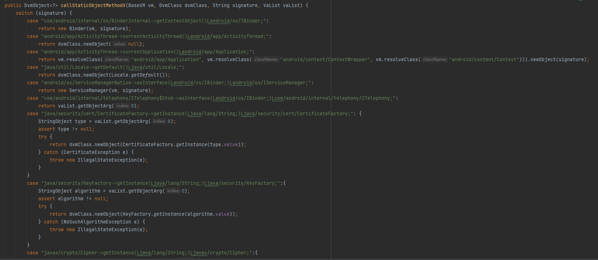](https://alidocs.oss-cn-zhangjiakou.aliyuncs.com/res/2M9qPmw2JvEmO015/img/b416cfc4-58fc-47cd-b765-8ceef83f296a.png)

依葫芦画瓢即可:

[](https://alidocs.oss-cn-zhangjiakou.aliyuncs.com/res/2M9qPmw2JvEmO015/img/03535c2a-bb81-4b02-a8e5-a12a85ace608.png)

又报错:

[](https://alidocs.oss-cn-zhangjiakou.aliyuncs.com/res/2M9qPmw2JvEmO015/img/3fd81d97-0e99-4526-97a9-788f9d9d2203.png)

老方法:

[](https://alidocs.oss-cn-zhangjiakou.aliyuncs.com/res/2M9qPmw2JvEmO015/img/820110e7-def3-467b-a66b-795d3da2d149.png)

```plain
let SecretAccess = Java.use("com.kugou.common.utils.SecretAccess");
    SecretAccess["getSafeDeviceId"].implementation = function () {
        console.log('getSafeDeviceId is called');
        let ret = this.getSafeDeviceId();
        console.log('getSafeDeviceId ret value is ' + ret);
        return ret;
    };
```

[](https://alidocs.oss-cn-zhangjiakou.aliyuncs.com/res/2M9qPmw2JvEmO015/img/8cfbc58a-e24a-446c-aaa9-c9251000ea0f.png)

[](https://alidocs.oss-cn-zhangjiakou.aliyuncs.com/res/2M9qPmw2JvEmO015/img/51d2b40a-ba2c-468e-b8e2-b274aa890387.png)

继续报错:

[](https://alidocs.oss-cn-zhangjiakou.aliyuncs.com/res/2M9qPmw2JvEmO015/img/90678eb9-f263-4579-a42e-e9de62069c71.png)

是系统函数，作用是查看设备是什么玩意,我们随便给定义一个得了:

[](https://alidocs.oss-cn-zhangjiakou.aliyuncs.com/res/2M9qPmw2JvEmO015/img/29ff2d21-ef9b-47c3-a009-875fb056035b.png)

跑出了结果:[](https://alidocs.oss-cn-zhangjiakou.aliyuncs.com/res/2M9qPmw2JvEmO015/img/846dffdb-9280-412f-9021-52b921887f14.png)  
但这样肯定不行直接修改AbstractJNI的代码会“污染”环境。  
我们选取继承：

```plain
package com.kugou;

import com.github.unidbg.AndroidEmulator;
import com.github.unidbg.arm.backend.Unicorn2Factory;
import com.github.unidbg.linux.android.AndroidEmulatorBuilder;
import com.github.unidbg.linux.android.AndroidResolver;
import com.github.unidbg.linux.android.dvm.*;
import com.github.unidbg.memory.Memory;
import java.io.File;


public class videos extends AbstractJni {


private final AndroidEmulator emulator;
private final VM vm;
private final DvmClass NativeApi;

// 包名
private final String packageName = "com.kugou.android";
// apk 地址
private final String packagePath = "D:\\unidbg\\unidbg-master\\unidbg-android\\src\\test\\resources\\kugou\\kugou11.7.0.apk";
// so 名称, 要去掉 lib 和  .so
//private final String libraryName = "j";
// jni 类名
private final String jniClassName = "com/kugou/common/player/kugouplayer/j";
// 调试信息
private final Boolean verbose = true;


public videos() {

    // 创建模拟器实例,进程名建议依照实际进程名填写，可以规避针对进程名的校验

    emulator = AndroidEmulatorBuilder
            .for32Bit()
            .addBackendFactory(new Unicorn2Factory(true))
            .setProcessName(packageName)
            .build();

    // 获取模拟器的内存操作接口
    Memory memory = emulator.getMemory();
    emulator.getSyscallHandler().setEnableThreadDispatcher(true);
    // 设置系统类库解析
    memory.setLibraryResolver(new AndroidResolver(23));
     //创建Android虚拟机,传入APK，Unidbg可以替我们做部分签名校验的工作


    vm = emulator.createDalvikVM(new File(packagePath));
    vm.setJni(this);// 设置JNI
    vm.setVerbose(verbose);// 打印日志
      //加载目标SO
    DalvikModule dm_shared = vm.loadLibrary(new File("D:\\unidbg\\unidbg-master\\unidbg-android\\src\\test\\resources\\kugou\\libc++_shared.so"),true);
    dm_shared.callJNI_OnLoad(emulator);
    DalvikModule dm_crypto = vm.loadLibrary(new File("D:\\unidbg\\unidbg-master\\unidbg-android\\src\\test\\resources\\kugou\\libcrypto_kg.so"),true);
    dm_crypto.callJNI_OnLoad(emulator);
    DalvikModule dm = vm.loadLibrary(new File("D:\\unidbg\\unidbg-master\\unidbg-android\\src\\test\\resources\\kugou\\libj.so"), true);
    NativeApi = vm.resolveClass(jniClassName);
    dm.callJNI_OnLoad(emulator);

}
@Override
public DvmObject<?> callStaticObjectMethodV(BaseVM vm, DvmClass dvmClass, String signature, VaList vaList) {
    switch (signature){
        case "com/kugou/common/utils/SecretAccess->getAndroidId()Ljava/lang/String;": {

            return new StringObject(vm,"5c083d1045985cf2");

        }
        case "com/kugou/common/utils/SecretAccess->getSafeDeviceId()Ljava/lang/String;":{
            return new StringObject(vm,"null");
        }

    }
    return super.callStaticObjectMethodV(vm, dvmClass, signature, vaList);
}

@Override
public DvmObject<?> getStaticObjectField(BaseVM vm, DvmClass dvmClass, String signature) {
    switch (signature){
        case "android/os/Build->MODEL:Ljava/lang/String;":
            return new StringObject(vm,"Xiaomi");

    }
    throw new UnsupportedOperationException(signature);
}


public String calls(){
    String args1 = "com.kugou.common.q.b@93e301";
    Object arg1 = (Object) args1 ;
    String ret = NativeApi.newObject(null).callJniMethodObject(emulator, "_d(Ljava/lang/Object;)Ljava/lang/String;", arg1).getValue().toString();
    return ret;
}
public String callss(){
    String args2 = "com.kugou.common.q.b@93e301";
    Object arg2 = (Object) args2;
    System.out.println(arg2.getClass().getSimpleName());
    String ret = NativeApi.newObject(null).callJniMethodObject(emulator, "_e(Ljava/lang/Object;)Ljava/lang/String;", arg2).getValue().toString();
    return ret;
}


public static void main(String[] args) {
    videos vs = new videos();
    String result1 = vs.calls();
    String result2 = vs.callss();
    System.out.println("call _d result:"+result1);
    System.out.println("call _e result:"+result2);
}
}
```

### 最后一脚

[](https://alidocs.oss-cn-zhangjiakou.aliyuncs.com/res/2M9qPmw2JvEmO015/img/9ee10b8e-bae5-471d-bb43-22ec0d369f32.png)

跳入a方法:

[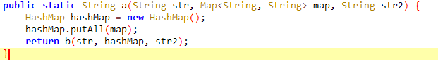](https://alidocs.oss-cn-zhangjiakou.aliyuncs.com/res/2M9qPmw2JvEmO015/img/5e37f677-b947-453f-9ad5-01681d5a3e3d.png)

跳入b方法:

[](https://alidocs.oss-cn-zhangjiakou.aliyuncs.com/res/2M9qPmw2JvEmO015/img/3d5ddeea-ac03-48b7-bd8f-b1c2523c149c.png)

使用frida去hook一下a方法就可以知道str4是何内容，以及b方法的作用(推测为排序加拼接---keySet方法的升序排列，可能将map内的键值对位置打乱，将appid首发):

```plain
let ba = Java.use("com.kugou.common.utils.ba");
    ba["a"].overload('java.lang.String').implementation = function (str) {
        console.log('ax is called' + ', ' + 'strx: ' + str);
        let ret = this.a(str);
        console.log('ax ret value is ' + ret);
        return ret;
    };
```

得到结果:

[](https://alidocs.oss-cn-zhangjiakou.aliyuncs.com/res/2M9qPmw2JvEmO015/img/aeba43f9-053d-470f-aaf0-8c244d2efdbd.png)

可以验证。

跳入a方法，直接就是没有任何套路的md5加密:

[](https://alidocs.oss-cn-zhangjiakou.aliyuncs.com/res/2M9qPmw2JvEmO015/img/129de27e-f265-4bc0-a44b-d1d508bbb25e.png)

验证确实如此:

[](https://alidocs.oss-cn-zhangjiakou.aliyuncs.com/res/2M9qPmw2JvEmO015/img/642cac09-2314-4ef8-b04d-2cf7ee738e4d.png)

尾声:诸位能看到此，诚惶诚恐。小生愚钝，斗胆将自己练手的过程写作文章，恐贻笑大方，但也望能在佬们的批评中汲取教训，为后续在逆向路上有所小成寻个因果。
