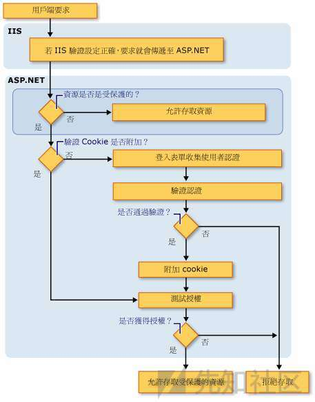

# ASP.NET 代码审计 - 先知社区

ASP.NET 代码审计

- - -

# 0x00 简介

基础知识：

ASP.NET开发可以选用两种框架：`ASP.NET Core`与`ASP.NET Framework`

ASP.NET开发也分为两种：

> WebApplication：

```plain
WEB应用程序，改变代码后需要重启网页。具有namespace空间名称，项目中所有的程序代码文件，和独立的文件都被编译成为一个程序集，保存在bin文件夹中。
```

> WebSite：

```plain
WEB网站，改变代码后不用重启网页。它没用到namespace空间名称，每个asp页面会转成一个dll。
```

ASP.NET比较关键的文件：

> web.config:

```plain
1.web.config是基于XML的文件，可以保存到Web应用程序中的任何目录中，用来储存数据库连接字符、身份安全验证等。

2.加载方式：当前目录搜索 -> 上一级到根目录 -> %windir%/Microsoft.NET/Framework/v2.0.50727/CONFIG/web.config -> %windir%/Microsoft.NET/Framework/v2.0.50727/CONFIG/machine.config -> 都不存在返回null
```

> Global.asax：

```plain
1. Global.asax提供全局可用的代码，从HttpApplication基类派生的类，响应的是应用程序级别会话级别事件，通常ASP.NET的全局过滤代码就是在这里面。
```

ASP.NET的常见拓展名：

在`%windir%\Microsoft.NET\Framework\v2.0.50727\CONFIG\web.config`中有详细定义，这里提取部分简单介绍。

````plain
```
aspx：应用程序根目录或子目录，包含web控件与其他
cs：类文件
aspx.cs：web窗体后台程序代码文件
ascx：应用程序根目录或子目录,Web 用户控件文件。
asmx：应用程序根目录或子目录，该文件包含通过 SOAP 方式可用于其他 Web 应用程序的类和方法。
asax：应用程序根目录，通常是Global.asax
config：应用程序根目录或子目录，通常是web.config
ashx：应用程序根目录或子目录,该文件包含实现 IHttpHandler 接口以处理所有传入请求的代码。
soap:应用程序根目录或子目录。soap拓展文件

```
````

# 0x01 注入

1.[windows 2008R2](https://msdn.itellyou.cn/)

2.[SSMS数据库管理](https://docs.microsoft.com/zh-cn/sql/ssms/download-sql-server-management-studio-ssms?view=sql-server-ver15)

3.某系统

4.[dnSpy反编译](https://github.com/0xd4d/dnSpy)

## 熟悉框架

程序的文件目录

```plain
├─Admin
├─App_Data  //App_Data文件夹应该包含应用程序的本地数据存储
├─bin     // 包含应用程序所需的任何预生成的程序集
├─bootstrap
├─css
├─images
├─img
├─install
├─javascript
├─m
├─purchase
├─style
├─temp
├─Template
├─uploads
└─UserControl
```

WEB应用程序会把我们写的代码编译为DLL文件存放在Bin文件夹中，在ASPX文中基本就是一些控件名，所以需要反编译他的DLL来进行审计。

> Logout.aspx

```plain
<%@ Page Language="C#" AutoEventWireup="true" CodeBehind="Logout.aspx.cs" Inherits="Book.Logout" %>

<html xmlns="http://www.w3.org/1999/xhtml" >
.
.
.
</html>
```

在文件头中有这几个参数：

1.Language="C#" //脚本语言

2.AutoEventWireup="true" //是否自动关联某些特殊事件

3.CodeBehind="Logout.aspx.cs" //指定包含与页关联的类的已编译文件的名称

4.Inherits="Book.Logout" //定义供页继承的代码隐藏类

我们所关注的也就是`Inherits` 的值，如上所示他指向了`Bin`目录下的`purchase.dll`中`Book`类的`Logout`函数（注：purchase.dll是网站编译的项目名，一般与文件目录对应）

> web.config

这个文件包含了目录权限控制、数据库密码等等

```plain
<location path="purchase/orderdetail.aspx">
    <system.web>
      <authorization>
        <allow users="*"/>
      </authorization>
    </system.web>
  </location>

  <authentication mode="Forms" />
```

比如我们使用的这套程序中[authorization](https://www.cnblogs.com/BlogShen/archive/2012/05/26/2519583.html)定义了`purchase/orderdetail.aspx`匿名可以访问，但是这套程序的本页面还写了一套验证

```plain
if (this.uid <= 0)
{
    if (!(base.Request.QueryString["g"] == "p"))
    {
        base.Response.Redirect("../login.aspx");
        return;
    }
    this.ph_pdf.Visible = false;
}
```

所以我们只需要访问`purchase/orderdetail.aspx?g=p`即可绕过跳转  
，其中`<authentication mode="Forms" />`表示Form 表单认证。

在ASP.NET中全局过滤一般用到`Global.asax`至于他为什么可以起到全局过滤的作用可以看看[ASP.NET三剑客](https://blog.csdn.net/ZARA0830/article/details/80384263)。当然这套程序并没有全局过滤，在提交多个漏洞后，官网公告说这套程序建议内网部署，官网让公网部署的用户设置了身份验证:

```plain
<system.web> 
<authorization> 
<deny users= "?"/> 
</authorization> 
</system.web>
```

但是这套程序安装会默认插入多条用户数据。

## 审计注入

首先我们来看`Login.aspx`，前面已经贴过代码，我们需要反编译`purchase.dll`去找`Book.Login`，这里使用`dyspy`

[](https://xzfile.aliyuncs.com/media/upload/picture/20191027104541-dd6f9f4e-f863-1.png)

`login.aspx`\->`Button1_Click`\->`LoginForm()`在login中控件名对应dll

```plain
public void LoginForm()
{
    int num = UsersHelper.Login(this.txt_username.Text, this.txt_pwd.Text);
    if (num > 0)
    {
        base.Response.Redirect(FormsAuthentication.GetRedirectUrl(num.ToString(), true));
    }
    else
    {
        Helper.Result(this, "用户名或者密码错误");
    }
}
```

跟进`UsersHelper.Login`

```plain
public static int Login(string username, string password)
{
    string sql = " select uid  from users_users where username=@username and password=@password;   ";
    SqlParameter[] prams = new SqlParameter[]
    {
        new SqlParameter("@username", username),
        new SqlParameter("@password", Helper.Encrypt(password))
    };
    object obj = Instance.ExeScalar(sql, prams);
    if (obj == null || obj == DBNull.Value)
    {
        return -1;
    }
    int num = int.Parse(obj.ToString());
    if (num > 0)
    {
        UsersHelper.Login(num);
    }
    return num;
}
```

这里使用的是参数化查询，所以这里不存在注入。登陆后的注入很多这里选一个。

> search.aspx

[](https://xzfile.aliyuncs.com/media/upload/picture/20191027104612-f04ea4c0-f863-1.png)

这里剔除了部分无用代码，可以看到没有经过任何过滤，控件的值就拼接到`text`字符串,由`Instance.ExeDataSet(text)`执行，跟进`ExeDataSet`函数

[](https://xzfile.aliyuncs.com/media/upload/picture/20191027104635-fdde5e0a-f863-1.png)

没有过滤直接带入查询，如果你觉得从代码来看sql语句很麻烦，这里可以使用`Sql Sever Profiler`监控SQL语句。

[](https://xzfile.aliyuncs.com/media/upload/picture/20191027104702-0dc658e0-f864-1.png)

> Payload: `1%' and 1=user--`

前面说到`purchase/orderdetail.aspx?g=p`可以绕过直接访问，具体原因可以移步[《第二章：越权》](http://xz.aliyun.com/t/%E7%AC%AC%E4%BA%8C%E7%AB%A0%EF%BC%9A%E8%B6%8A%E6%9D%83.md)，那么我们看看这个是否存在注入，如果存在那么将是一个前台注入。

[](https://xzfile.aliyuncs.com/media/upload/picture/20191027104717-1711cf88-f864-1.png)

看到`69-88`行，要执行命令需要`this.isview`为`true` ，在`30-36`行赋值只需要`t=view`即可  
`sid`没有经过任何过滤，同时`ExeDataSet`函数也不存在过滤，即存在注入。

> Payload: `purchase/orderdetail.aspx?g=p&t=view&sid=1%20and%201=user--`

[](https://xzfile.aliyuncs.com/media/upload/picture/20191027104734-20b67b88-f864-1.png)

# 0x02 越权

## ASP.NET安全认证

1.在`web.config`中有四种验证模式：

| 方式  | 描述  |
| --- | --- |
| window | IIS验证，在内联网环境中非常有用 |
| Passport | 微软集中式身份验证，一次登录便可访问所有成员站点，需要收费 |
| Form | 窗体验证，验证帐号/密码，Web编程最佳最流行的验证方式 |
| None | 表示ASP.NET自己根本不执行身份验证，完全依赖IIS身份验证 |

其中`FORM`窗体验证的流程图：

[](https://xzfile.aliyuncs.com/media/upload/picture/20191027104748-29518c56-f864-1.jpg)

开启`form`窗体验证的同时还需要配置`web.config`，不然就会出现问题，一般来说还需要配置最基本的页面访问权限,比如禁止匿名用户访问。

```plain
<system.web>
    <authorization>
    <deny users="?"/>
    </authorization>
</system.web>
```

当然还可以设置一些管理页面允许某某用户访问等等，在这套程序中开启了`form`然后在程序里面验证的`cookies`，而且并没有设置所有页面的`authorization`。

2.除去`web.config`的配置通常还有两种写法来验证是否登陆。

第一种：在每个页面判断`Session["UserName"]是否等于null`

第二种：类似php的`include`的继承，这也是本套程序使用的方法。

首先他定义了一个`purchase.Master` [母版页](https://www.cnblogs.com/WuNaiHuaLuo/p/4509774.html) 在里面写上了权限验证的代码。

[](https://xzfile.aliyuncs.com/media/upload/picture/20191027104803-324af3d8-f864-1.png)

然后次母版页头文件会引入`MasterPageFile="~/purchase/purchase.Master"`调用之前都会先调用母版页的`Page_Load`函数来验证是否登陆。当然你也可能遇到没有使用[母版页](https://www.cnblogs.com/WuNaiHuaLuo/p/4509774.html)的程序，那么他可能是先定义一个`onepage`类继承`page`,然后其他页面继承`onepage`类，与此相同。

## 寻找越权

例1：

比如没有任何验证的，也没有继承验证类的，无需登陆访问

[](https://xzfile.aliyuncs.com/media/upload/picture/20191027104812-37d05d52-f864-1.png)

例2：

这套程序验证权限的地方比较少，只是简单的判断了是否登陆，登陆后基本可以访问大多数管理页面这里。

[](https://xzfile.aliyuncs.com/media/upload/picture/20191027104820-3c666fe6-f864-1.png)

例3：

[](https://xzfile.aliyuncs.com/media/upload/picture/20191027104832-439f228a-f864-1.png)

在`MyProfile.aspx`文件中 直接获取表单数据进行`update`，并没有验证权限，导致低权限账号也可以`update admin`但是这里是参数化查询，所以不存在注入。修改`admin`的账号密码为`1234567`。

[](https://xzfile.aliyuncs.com/media/upload/picture/20191027104845-4b7b96be-f864-1.png)

例4：

前面说到这套程序里面验证的`cookies`，而且并没有设置所有页面的`authorization`权限，所以我们能不能伪造cookie呢。

[](https://xzfile.aliyuncs.com/media/upload/picture/20191027104856-51d2ca96-f864-1.png)

在`23-26`行判断`this.uid`的值来进行跳转，在`16`行定义了他的值，跟进`UserHelper.GetUserId`

```plain
public static int GetUserId
{
    get
    {
        if (Helper.IsUseAd && HttpContext.Current.Request.Cookies["userinfo"] == null)
        {
            UsersHelper.LoginAd(UserHelper.GetSamaccountName());
        }
        if (HttpContext.Current.Request.Cookies["userinfo"] != null)
        {
            return int.Parse(HttpContext.Current.Request.Cookies["userinfo"]["userid"]);
        }
        return -1;
    }
}
```

`this.uid`等于`cookies`中获取的`userinfo`的值，这一步可以伪造，接着我们看到`30-33`这里他设置了管理员的布尔值，跟进`RoleHelper.IsAdmin`

```plain
public static bool IsAdmin
{
    get
    {
        string name = "IsAdmin";
        string admin = RoleHelper.Admin;
        bool? flag = HttpContext.Current.Session[name] as bool?;
        if (flag == null)
        {
            flag = new bool?(UserHelper.IsInAnyRoles(admin));
            HttpContext.Current.Session[name] = flag;
        }
        return flag.Value;
    }
}
```

前面从`session`中获取，如果`flag`为`null`则从`UserHelper.IsInAnyRoles(admin)`获取。

跟进`IsInAnyRoles`

[](https://xzfile.aliyuncs.com/media/upload/picture/20191027104903-563e9d08-f864-1.png)

可以看到只要我们传入的`cookies`中`roles`的等于传入的数组值就返回`true`其中 `public static string Admin = "administrators";`,所以构造`cookies`:`userinfo=userid=1&roles=administrators;`

[](https://xzfile.aliyuncs.com/media/upload/picture/20191027104912-5b55d888-f864-1.png)

项目地址：[https://github.com/aleenzz/.NET\_study/tree/master/asp.net\_bug](https://github.com/aleenzz/.NET_study/tree/master/asp.net_bug)  
有问题还请大佬们指出QAQ
