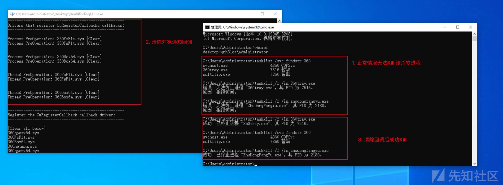
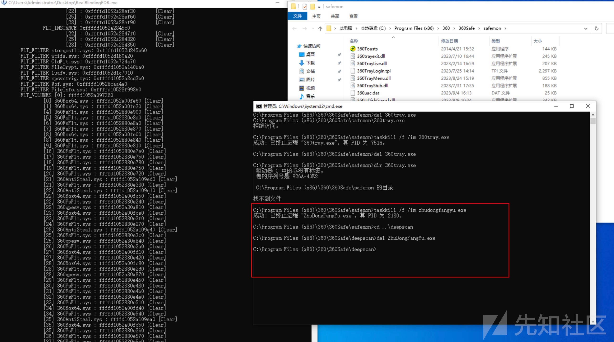
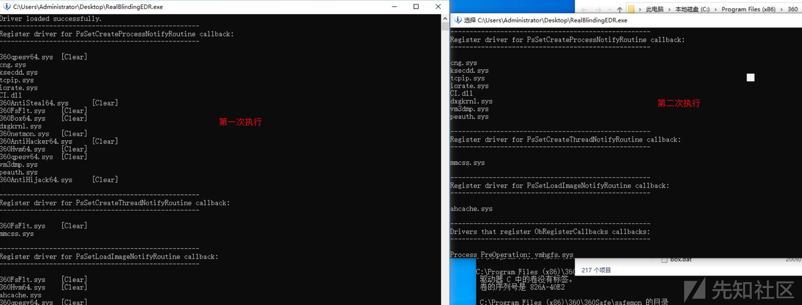

# AV/EDR 完全致盲 - 清除6大内核回调实现 - 先知社区

AV/EDR 完全致盲 - 清除6大内核回调实现

- - -

> 本文将介绍如何利用带签名驱动实现完全致盲、或杀死、或永久关闭 AV/EDR。

承接上文，这次继续利用驱动的任意地址写 Bypass PatchGuard 实现：清除注册表通知回调、清除文件系统微驱动过滤器回调、清除对象通知回调、清除线程通知回调、清除Image 加载通知回调、清除进程通知回调，并开源实现代码及工具。

Github 项目地址：[RealBlindingEDR](https://github.com/myzxcg/RealBlindingEDR)（含演示视频）

**删除内核回调后，最终可实现以下3点效果：**

1.  **致盲 AV/EDR**
    
    在保持AV/EDR 进程正常运行的情况下，使其无法监控任何进程/线程活动、任何文件落地、注册表删改、高权限句柄获取等众多敏感行为。（不直接Kill 是为了保证EDR 与总控保持通信，避免掉线导致被发现）
    
2.  **永久关闭或禁用 AV/EDR**
    
    由于删除了注册表和微过滤器内核通知回调，可以修改注册表或直接删除AV/EDR 文件的方式永久关闭AV/EDR（即使系统重启）。
    
3.  **Kill AV/EDR 进程**
    
    由于删除了对象句柄通知回调，现在能够以普通管理员用户权限结束AV/EDR 进程。
    

## EDR 常用的回调注册函数

在[白驱动 Kill AV/EDR（上）](https://xz.aliyun.com/t/12881)一文中说到目前EDR 对各项内容的拦截监控都是依赖内核回调机制，下面先说明下EDR 通常会用到的回调注册函数以及清除相应的回调有什么效果。

1.  `ObRegisterCallbacks()`
    
    驱动程序可利用此函数来注册回调函数，可以让驱动在试图打开或者复制特定对象类型的句柄时从内核得到实时通知。删除此回调函数，可以致盲EDR 对获取对象句柄的监控。例如可以拿到EDR 的进程完整句柄，从而可以调试/分析或Kill EDR 进程，屏蔽EDR 对其3环进程的保护。
    
2.  `CmRegisterCallback(Ex)`
    
    此注册函数可以让驱动在访问、修改注册表时从内核得到实时通知。如果能删除此回调，可以致盲EDR 对注册表的监控，例如添加正常情况会被拦截的注册表启动项，修改EDR 注册表服务配置从而永久禁用EDR。但是此回调地址受PatchGuard 保护，修改其回调函数地址会触发BSOD，后面会说明如何绕过。
    
3.  `MiniFilter`微过滤器驱动
    
    通过注册文件系统微过滤器驱动程序，可以在创建/修改/删除文件时得到驱动程序得到通知。如果能删除此回调，可以使EDR 无法监控恶意文件落地，并且可以禁用EDR 对其自身文件的保护，从而删除EDR 文件来永久禁用EDR。但是某些回调地址也受PatchGuard 保护，修改某些回调地址时会触发BSOD，后面会说明如何绕过。
    
4.  `PsSetCreateProcessNotifyRoutine(Ex)`
    
    此注册函数可以让驱动在进程被创建或销毁时都能从内核得到实时通知。通过删除此回调函数，可以使致盲EDR 对进程活动的监控，例如使其无法监控进程启动、分析木马进程链关系。
    
5.  `PsSetCreateThreadNotifyRoutine(Ex)`
    
    此注册函数可以让驱动在线程被创建或销毁时都能从内核得到实时通知。删除此回调函数，可以致盲EDR 对线程活动的监控，例如使其无法对远程线程注入进行监控。
    
6.  `PsSetLoadImageNotifyRoutine(Ex)`
    
    此注册函数可以让驱动在任何Image（EXE、DLL、驱动）文件被加载时都能从内核得到实时通知。删除此回调函数，可以致盲EDR 对EXE、DLL、驱动执行加载的监控。
    

当然还有其他回调，例如网络过滤器驱动用于监控扫描行为（挖个坑，这个后面再开文章分析）。 这次主要分析以上6个回调注册函数的回调清除，达到前面所说的效果。

## Remove ObRegisterCallbacks

之前的文章中介绍了通过`ObRegisterCallbacks()`注册回调函数，实现对指定进程句柄进行降权，删除了`PROCESS_TERMINATE` 权限从而实现对该进程的保护。在注册回调函数时是通过`OB_OPERATION_REGISTRATION` 结构中指定回调函数地址，以及注册的对象类型（进程、线程）等其他信息，最终传给`ObRegisterCallbacks()`函数。

其中注册的对象类型：`PsProcessType`、`PsThreadType` 为全局内核变量，它俩是`OBJECT_TYPE` 结构，如下：

```plain
typedef struct _OBJECT_TYPE {
 LIST_ENTRY TypeList;
 UNICODE_STRING Name;
 VOID* DefaultObject; 
 UCHAR Index;
 unsigned __int32 TotalNumberOfObjects;
 unsigned __int32 TotalNumberOfHandles;
 unsigned __int32 HighWaterNumberOfObjects;
 unsigned __int32 HighWaterNumberOfHandles;
 OBJECT_TYPE_INITIALIZER TypeInfo;
 EX_PUSH_LOCK TypeLock;
 unsigned __int32 Key;
 LIST_ENTRY CallbackList; 
}OBJECT_TYPE, *POBJECT_TYPE;
```

`OBJECT_TYPE`结构的CallbackList 是一个由`CALLBACK_ENTRY_ITEM` 结构（未记录）组成的双向链表，其结构如下：

```plain
typedef struct _CALLBACK_ENTRY_ITEM {
LIST_ENTRY EntryItemList;
OB_OPERATION Operations;
CALLBACK_ENTRY* CallbackEntry; 
POBJECT_TYPE ObjectType;
POB_PRE_OPERATION_CALLBACK PreOperation;
POB_POST_OPERATION_CALLBACK PostOperation;
__int64 unk;
}CALLBACK_ENTRY_ITEM, *PCALLBACK_ENTRY_ITEM;
```

从上面的结构体可以明显看到，PreOperation 和 PostOperation 分别指向操作前回调函数地址与操作后回调函数地址。

[](https://xzfile.aliyuncs.com/media/upload/picture/20231029152600-6897e104-762c-1.png)

如上图，Flink 指向的`0xffff8c8589597680` 地址就是`CALLBACK_ENTRY_ITEM` 结构的地址。其中PreOperation 的偏移为`0x28` ，PostOperation 的偏移为`0x30` 。后面只需要将PreOperation和PostOperation 指向的地址设置为0即可。

***Tips:*** 上图可以看到CallbackList 的偏移是`0xc8` ，但仅对于win10和win11。在win7 下它对应的偏移是`0xc0`。

那么现在知道了回调函数的位置在哪儿，新的问题是如何通过代码定位`PsProcessType`和`PsThreadType` 这两个全局内核变量。

通过IDA 的交叉引用可以找到调用了`PsProcessType` 和`PsThreadType` 的函数，并且还这个函数还需要是`ntoskrnl.exe` 的导出函数，因为这样我们就可以像上篇文章中删除进程回调那样去获取`PsProcessType` 和`PsThreadType` 的地址。

[](https://xzfile.aliyuncs.com/media/upload/picture/20231029152613-70902dbc-762c-1.png)

通过分析发现`NtDuplicateObject()`函数中引用了`PsProcessType` 全局内核变量，而在`NtOpenThreadTokenEx()` 函数中引用了`PsThreadType` 全局内核变量。并且这两个函数在win7上也引用了相应的变量，同时也是`ntoskrnl.exe` 的导出函数。

这样代码逻辑就通了：首先定位`PsProcessType` 和`PsThreadType` 全局内核变量地址，根据偏移获得`CALLBACK_ENTRY_ITEM` 的双向链表结构，遍历此结构将PreOperation 和PostOperation 指向的地址置0。

部分代码截图如下，完整代码在文章首页的Github地址。

[](https://xzfile.aliyuncs.com/media/upload/picture/20231029152625-77b0403c-762c-1.png)

实现效果，如下图：

[](https://xzfile.aliyuncs.com/media/upload/picture/20231029152638-7f526e8c-762c-1.png)  
清除回调后，我们现在能以普通管理员用户权限去Kill 某杀软进程了。当然，我们的目的是为了致盲EDR 而不是干掉EDR，这只是删除回调后的的附带效果 — 我们随时能够Kill EDR。之后，杀软无法阻止我们获取任何进程的高权限句柄，也无法监控到我们获取句柄的这个行为。并且配合后面删除线程通知的回调，也能够规避远程线程注入的检测。

## Remove CmRegisterCallback

前面说到，如果能清除注册表通知回调，我们对注册表的任何操作，都无法被监控。同时也能够清除EDR 对其服务注册表的保护，从而永久禁用EDR。

话不多说下面来看下如何删除注册表回调以及有哪些坑。

`CallbackListHead` 是一个双向链表，它是一个`CMREG_CALLBACK` 结构（未记录），里面包含了注册表通知回调函数的地址。其结构如下：

```plain
typedef struct _CMREG_CALLBACK {
    LIST_ENTRY List;
    ULONG Unknown1;
    ULONG Unknown2;
    LARGE_INTEGER Cookie;
    PVOID Unknown3;
    PEX_CALLBACK_FUNCTION Function;
} CMREG_CALLBACK, *PCMREG_CALLBACK;
```

可以看到Function指向回调函数的地址，其偏移为`0x28` 。我们可以在`CmUnRegisterCallback()`这个`ntoskrnl.exe`导出函数函数中找到`CallbackListHead` 地址，并且win7 和win 10+ 都有。

[](https://xzfile.aliyuncs.com/media/upload/picture/20231029152649-863045e4-762c-1.png)  
这么简单就找到回调函数地址？问题来了，修改回调函数地址直接导致蓝屏 :(

[](https://xzfile.aliyuncs.com/media/upload/picture/20231029152659-8bc429e4-762c-1.png)  
由于这个位置受PatchGard保护，那我们就无法像之前的方法一样去清除回调了。后面也尝试将修改`LIST_ENTRY` 这个链表地址的值为0，但是依旧蓝屏，这里需要想想怎么Bypass PG。

峰回路转，经过无数次的蓝屏后发现，如果将双向链表的Flink 指向的地址修改为双向链表上已经存在的地址值，那就不会蓝屏，这就有了个思路，直接将第一个`CallbackListHead` 结构地址（也就是链表头） 指向为最后一个`CallbackListHead` ，这样就能够清除掉中间的EDR注册的链表。

***Tips:*** 在Github里的代码实现是将下面`fffff804`7e848490`地址值修改为`fffff804`7e848490` ，一样的效果。

[](https://xzfile.aliyuncs.com/media/upload/picture/20231029152708-9198e102-762c-1.png)  
清除注册表回调后，这样就能禁用EDR 对其注册表项的保护。后续可以修改AV/EDR 的服务配置，以及注册表中的启动项。

现在就有权限执行以下命令，可永久关闭某数字杀软，重启后此杀软也不会自动启动。

***Tips:*** 建议仅永久禁用杀毒软件，但EDR 等安全解决方案不建议永久关闭，掉线可能会被管理员发现。

如下图所示：

[](https://xzfile.aliyuncs.com/media/upload/picture/20231029152720-9850fa52-762c-1.png)

## Remove MiniFilter Callback

EDR 注册了微过滤器驱动程序，能够监控所有落地的文件，并且也能保护其自身或指定的文件不被删除。如果我们能够清除微过滤器的回调，那么这些监控和保护效果自然就消失了。下面来看下EDR 注册的微过滤器驱动程序的回调函数位置。

[](https://xzfile.aliyuncs.com/media/upload/picture/20231029152731-9ee354aa-762c-1.png)  
进入CallBackNodes数组，可以看到回调函数地址：

[](https://xzfile.aliyuncs.com/media/upload/picture/20231029152743-a6293162-762c-1.png)  
这里的回调函数地址，某些可以直接置0，但是有些位置的地址置0之后会触发PatchGuard 保护，所以这里不能直接修改回调函数地址。

经分析发现，不去修改他的回调函数地址，而是清空CallbackNodes 数组的话则不会触发蓝屏，成功Bypass PathGuard。接下来的问题就是该如何定位到`_FLT_INSTANCE` 结构？

还是按照之前的思路，我们先去找一下`FLTMGR` 中的全局变量。

[](https://xzfile.aliyuncs.com/media/upload/picture/20231029152756-ae105f5e-762c-1.png)  
发现有一个名为FrameList 的\_FLT\_RESOURCE\_LIST\_HEAD 结构，看看此结构。

[](https://xzfile.aliyuncs.com/media/upload/picture/20231029152813-b801f37e-762c-1.png)

发现里面又包含一个LIST\_ENTRY双向链表结构并且里面的值就是Frame 的地址。继续查看此地址中的值：

[](https://xzfile.aliyuncs.com/media/upload/picture/20231029152822-bdbd1e88-762c-1.png)

发现此地址中的值0xffffb1821f4cf018 - 0x8 就是FLTP\_FRAME 的值。继续查看此结构内容：

[](https://xzfile.aliyuncs.com/media/upload/picture/20231029152833-c3e54740-762c-1.png)  
发现Flink 指向的地址减去0x10 就是\_FLT\_FILTER 的地址。Flink 默认指向的是\_FLT\_FILTER的PrimaryLink 字段，如下图：

[](https://xzfile.aliyuncs.com/media/upload/picture/20231029152839-c7d75b54-762c-1.png)  
至此，我们成功找到了`_FLT_FILTER`的地址。

现在，我们应该找一个调用了这个`FltGlobals` 全局变量的导出函数，那么我们就能以之前的思路来定位到`_FLT_FILTER` 的地址。

分析发现`FltEnumerateFilters` 这个FLTMGR.sys 导出函数中就有指向Frame 的地址，如下图：

[](https://xzfile.aliyuncs.com/media/upload/picture/20231029152849-cd7df13a-762c-1.png)  
至此，我们可以完美的用相同思路获取`_FLT_FILTER` 的地址。但是在代码实现时，有个小坑：获取不能再用loadlibrary 去加载 FLTMGR.sys 来获取句柄计算偏移了，这个函数加载得到的句柄是NULL。后面继续翻MSDN，发现还有个loadlibraryEx这个函数，通过传入`DONT_RESOLVE_DLL_REFERENCES` ，可以正常加载FLTMGR.sys 模块。

其实上面分析还没完，还有个问题是该怎么通过`_FLT_FILTER` 定位`_FLT_INSTANCE` 结构呢？

[](https://xzfile.aliyuncs.com/media/upload/picture/20231029152900-d4588cfe-762c-1.png)  
上面的图是`_FLT_FILTER` 结构，从名字可以看出这个`_FLT_RESOURCE_LIST_HEAD` 结构的InstanceList是极有可能保存了`_FLT_INSTANCE`结构的地址，继续跟下去。

[](https://xzfile.aliyuncs.com/media/upload/picture/20231029152947-f01d8408-762c-1.png)  
可以看到`_FLT_RESOURCE_LIST_HEAD` 结构里的rList指向的是`_LIST_ENTRY` 双向链表。按理说这个地址应该就是`_FLT_INSTANCE` 结构的地址，但是仔细看这个地址，发现和我们执行`!fltkd.filters` 的结果对应不上。

网上查了一下，ReactOS 上的`FltUnregisterFilter()` 函数处理逻辑给出了答案：（其实和上面PrimaryLink 是一种原因）

[](https://xzfile.aliyuncs.com/media/upload/picture/20231029152955-f4fc0a80-762c-1.png)  
`_LIST_ENTRY` 中的地址还需要通过`CONTAINING_RECORD(CurrentEntry, FLT_INSTANCE, FilterLink);` 减去`FLT_INSTANCE`结构的FilterLink 偏移地址。这下刚好对应了，如下图：

[](https://xzfile.aliyuncs.com/media/upload/picture/20231029153004-fa95d5ac-762c-1.png)  
后面就简单了，定位CallbackNodes 数组并清空。

***最后的但是，清空数组后你会发现还是没权限删除杀软的文件，并且例如mimikatz 这类的恶意文件一落地还是会被检测到！***

[](https://xzfile.aliyuncs.com/media/upload/picture/20231029153013-ff83ade6-762c-1.png)  
难道内核调用微过滤器驱动的回调不是遍历`FLT_INSTANCE`中的`CallbackNodes` 数组？就上面的实际情况来看很有可能是，但是这个`CallbackNodes` 不可能一点用也没有吧？毕竟里面保存了回调函数结构的地址。

一筹莫展之际，看到了一篇文章[Part 1: Fs Minifilter Hooking](https://aviadshamriz.medium.com/part-1-fs-minifilter-hooking-7e743b042a9d)，他通过断点调试发现内核是通过`FltpPerformPreCallbacks` 函数来调用微过滤器驱动的回调函数的。

[](https://xzfile.aliyuncs.com/media/upload/picture/20231029153022-04d85ea4-762d-1.png)  
上面的反编译代码直观的体现了，内核调用的是volume 中的callbacks列表中的回调函数。

分析发现在`FLTP_FRAME` 结构的字段中保存`FLT_VOLUMES` 结构的地址链表，通过遍历此链表可以获得所有的`FLT_VOLUMES` 。

[](https://xzfile.aliyuncs.com/media/upload/picture/20231029153030-09b43948-762d-1.png)  
接着来看看FLT\_VOLUMES 结构。

[](https://xzfile.aliyuncs.com/media/upload/picture/20231029153039-0ee33bbc-762d-1.png)  
通过名称我们可以轻松的找到存储回调函数结构（`_CALLBACK_NODE`）的数组。

[](https://xzfile.aliyuncs.com/media/upload/picture/20231029153045-12898230-762d-1.png)  
每个数组保存了一个`_CALLBACK_NODE` 结构的双向链表（这个结构中的地址和`FLT_INTANCE`的callbacknodes 数组中保存的地址相同），我们需要遍历并清除这个链表中的包含EDR 回调的`_CALLBACK_NODE` 结构。

[](https://xzfile.aliyuncs.com/media/upload/picture/20231029153053-173c2cc4-762d-1.png)  
折磨加痛苦的事情又来了，修改Volumes 的callback 数组也会触发PG保护导致蓝屏。想放弃却又不甘心，又经过了无数次蓝屏后，找到了一个办法可以Bypass PG：

比如数组中的其中一个`_LIST_ENTRY` 双向链表中，Flink 保存了EDR 注册的`_CALLBACK_NODE` 结构，下一个Flink 也保存了系统自带的例如FileInfo驱动的`_CALLBACK_NODE` 结构。我们可以将首地址直接修改为FileInfo驱动的`_CALLBACK_NODE` 结构地址。这样将EDR 的`_CALLBACK_NODE` 结构从整个双向链表中摘了出来，且这样不会触发蓝屏。

注意：只清除EDR 的地址，不要清除系统本身驱动注册的地址，否则会导致系统崩溃。

实现效果如下，成功删除某数字杀软的主文件：

[](https://xzfile.aliyuncs.com/media/upload/picture/20231029153100-1b920ffa-762d-1.png)  
要想永久禁用的话，还需要去把他的服务进程文件给删了：

[](https://xzfile.aliyuncs.com/media/upload/picture/20231029153106-1f5fd464-762d-1.png)  
注意：要先Kill 对应的进程，然后在删除。（有的EDR 会不断的重启，所以需要先保证进程被Kill 再删除）

这可比删除注册表直接了当多了:)

## Remove Three Callback

这里将进程通知回调、线程通知回调、Image 加载通知回调放在一起说。因为这三部分寻找思路和代码逻辑基本相同。在上一篇文章[白驱动 Kill AV/EDR（下）](https://xz.aliyun.com/t/12936)中实现了清除进程通知回调，通过在回调注册函数`PsSetCreateProcessNotifyRoutine()` 中定位`PspCreateProcessNotifyRoutine` 数组从而找到了注册了进程回调函数的地址。

[](https://xzfile.aliyuncs.com/media/upload/picture/20231029153113-23b1bd16-762d-1.png)  
线程通知回调函数的地址是通过回调注册函数`PsSetCreateThreadNotifyRoutine()` 中定位`PspCreateProcessNotifyRoutine` 数组来获取的。

[](https://xzfile.aliyuncs.com/media/upload/picture/20231029153126-2b36c6da-762d-1.png)  
Image 通知回调函数地址是通过回调注册函数PsSetLoadImageNotifyRoutine() 中定位PspLoadImageNotifyRoutine 数组来获取的。

[](https://xzfile.aliyuncs.com/media/upload/picture/20231029153136-310f3e70-762d-1.png)  
所以代码逻辑基本完全一样，只是寻找的函数不同而已，由于前文已经说过原理了，这里不在多说。剩下的问题是适配win7 和 win10+ ，有些地方略有不同，可以直接参考文章首页的Github地址。

实现效果：

[](https://xzfile.aliyuncs.com/media/upload/picture/20231029153144-35f33900-762d-1.png)

## 总结

上面实现Kill EDR、永久关闭EDR 的这些功能都是删除回调后自然而然能实现的附带功能。在实战中，真正重要的是在不Kill 它的情况下，通过删除以上回调使其致盲，这才是高度隐匿的最佳手法。

近几年，做红队遇到的内网终端基本都有EDR 等类型的终端安全解决方案，我们在R3 层对抗EDR 行为监测也越来越难，让我们有时候不得不唯快论，拼应急/横向速度。未来终端测的AV /EDR 等安全解决方案的主流对抗将逐步迈入R0 时代。

当然还有一些内核回调的删除，后续在分享给大家吧。

如果有人有兴趣研究源码的话，你可能会像我一样记住这个图片中的表情 :(

[](https://xzfile.aliyuncs.com/media/upload/picture/20231029153153-3b6cce32-762d-1.png)

## 参考

1.  [OBREGISTERCALLBACKS AND COUNTERMEASURES](https://douggemhax.wordpress.com/2015/05/27/obregistercallbacks-and-countermeasures/)
2.  [Windows Anti-Debug techniques - OpenProcess filtering](https://blog.xpnsec.com/anti-debug-openprocess/)
3.  [Mimidrv In Depth: Exploring Mimikatz’s Kernel Driver](https://medium.com/@matterpreter/mimidrv-in-depth-4d273d19e148)
4.  [Part 1: Fs Minifilter Hooking](https://aviadshamriz.medium.com/part-1-fs-minifilter-hooking-7e743b042a9d)
