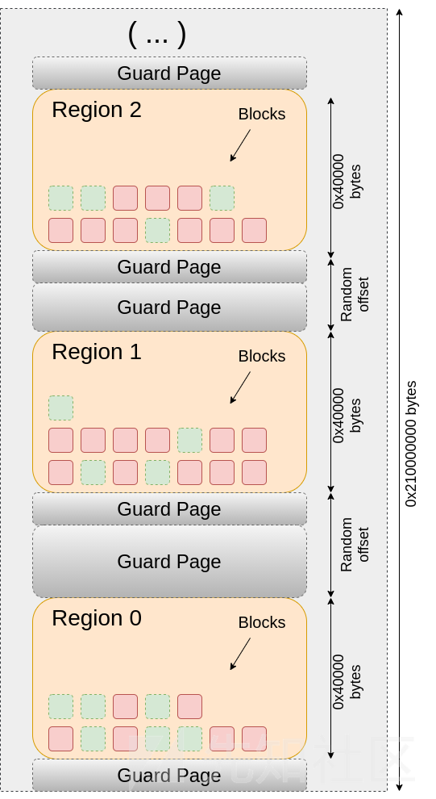
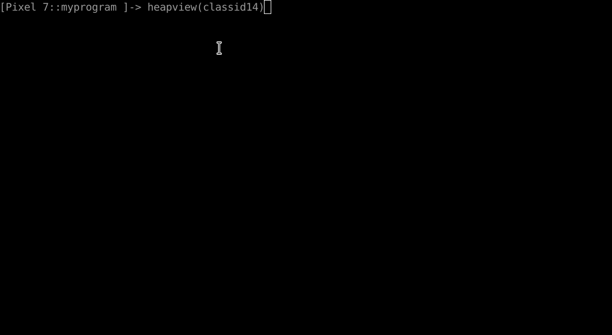

Android安全机制：揭开SCUDO的安全防御策略

- - -

# Android安全机制：揭开SCUDO的安全防御策略

> 本文介绍了如何在Ubuntu系统的权限提升漏洞，涉及的主要技术有：
> 
> -   Scudo 主分配器
> -   Scudo 辅助分配器
> -   Scudo 的安全缓解措施
> -   本地缓存分配
> -   本地缓存释放
> -   双重释放问题
> 
> 翻译来源：
> 
> [https://www.synacktiv.com/en/publications/behind-the-shield-unmasking-scudos-defenses](https://www.synacktiv.com/en/publications/behind-the-shield-unmasking-scudos-defenses)
> 
> 在编写针对内存损坏漏洞的攻击时，通常需要了解堆分配器的内部结构，以便根据需要塑造堆。继我们之前关注jemalloc（新）的博文之后，本文将深入探讨另一个Android libc分配器：Scudo分配器。
> 
> SCUDO是由Google开发的用户模式内存分配器，基于LLVM Sanitizers的组合分配器，并专注于实际安全性（例如：它不是试图实现未经证实的理论安全性改进，而是试图解决相关的实际可利用场景）。SCUDO目前在很多地方都有使用，Android 11+和Fuchsia是最突出的案例。SCUDO目前是作为LLVM项目的一部分开发的。

Scudo是LLVM（[https://llvm.org/docs/ScudoHardenedAllocator.html）的一部分，它被设计为一个加固的分配器，可以缓解基于堆的漏洞。从版本11开始，它就是Android中的默认分配器，名字“scudo”来自意大利语中的名字“shield”。](https://llvm.org/docs/ScudoHardenedAllocator.html%EF%BC%89%E7%9A%84%E4%B8%80%E9%83%A8%E5%88%86%EF%BC%8C%E5%AE%83%E8%A2%AB%E8%AE%BE%E8%AE%A1%E4%B8%BA%E4%B8%80%E4%B8%AA%E5%8A%A0%E5%9B%BA%E7%9A%84%E5%88%86%E9%85%8D%E5%99%A8%EF%BC%8C%E5%8F%AF%E4%BB%A5%E7%BC%93%E8%A7%A3%E5%9F%BA%E4%BA%8E%E5%A0%86%E7%9A%84%E6%BC%8F%E6%B4%9E%E3%80%82%E4%BB%8E%E7%89%88%E6%9C%AC11%E5%BC%80%E5%A7%8B%EF%BC%8C%E5%AE%83%E5%B0%B1%E6%98%AFAndroid%E4%B8%AD%E7%9A%84%E9%BB%98%E8%AE%A4%E5%88%86%E9%85%8D%E5%99%A8%EF%BC%8C%E5%90%8D%E5%AD%97%E2%80%9Cscudo%E2%80%9D%E6%9D%A5%E8%87%AA%E6%84%8F%E5%A4%A7%E5%88%A9%E8%AF%AD%E4%B8%AD%E7%9A%84%E5%90%8D%E5%AD%97%E2%80%9Cshield%E2%80%9D%E3%80%82)

Android将Scudo宣传为“动态用户模式内存分配器，或堆分配器，旨在抵御堆相关漏洞（如基于堆的缓冲区溢出、释放后使用和双重释放），同时保持性能”（https：//source.android.com/docs/security/test/Scudo？hl=en）。所有参考资料均针对此版本的源代码给出：[https://android.googlesource.com/platform/external/scudo/](https://android.googlesource.com/platform/external/scudo/) commit 93fc3ad0cf853a2c6439eb46fa6bd56ad3966452，所有相关文件都在 `standalone/` 目录下。

Scudo是一个通用分配器，设计为模块化和高度可配置的。所有测试和观察都是在运行Android 13的谷歌Pixel7手机上完成的。当我们进一步探讨这个话题时，值得注意的是Trenchant（博客）和ItsIronicIInsis（堪培拉会议）最近也分享了他们对这个问题的想法。你可能会发现他们的观点和我们的一样有价值。

## Scudo 是什么及其术语

Scudo 有三个主要组成部分：

1.  TSDRegistryShared（我们只说本地缓存）。
    -   有一组本地缓存。
    -   每个线程特定数据都有一个本地缓存（TSD）。
    -   使用共享和非独占模型->因此一组线程拥有相同的TSD。
2.  MapAllocator，也称为辅助分配器，主要用于大型分配（大于64KB）。
    -   当我们深入研究实现细节时，我们将讨论一个异常，它可能会导致较小的分配流向辅助分配器
3.  SizeClassAllocator{3264}，也称为主分配器，用于“小”分配（小于或等于64KB）。
    -   主分配器和本地缓存都涉及<=64KB的分配。

Scudo 包含自己的术语和定义，有些术语是具有针对性的，但分配器是通用设计的，存在于各种操作系统和架构（32位和64位）中。这里提供的所有信息都位于arm 64位Android 13的上下文中。在不同的操作系统下，位置会有所不同。

存在两个分配器，主分配器和辅助分配器。主节点管理小于0x10010字节的分配，辅助节点管理所有其他分配。

Scudo在内部使用了Block的概念。Block由报头和数据块chunk组成，数据块chunk是malloc函数返回的内存区域。标头包含元数据，大小为0x10字节（8个有效字节和8个空字节用于对齐）。因此， `malloc(n)` 需要 `(n+0x10)` 字节来容纳报头和数据。

分配根据其各自的大小进行分类，称为ClassId。 `standalone/size_class_map.h` 文件提供了各种大小分类。对于Android 64位系统，类包括：

```plain
static constexpr u32 Classes[] = {
      0x00020, 0x00030, 0x00040, 0x00050, 0x00060, 0x00070, 0x00090, 0x000b0,
      0x000c0, 0x000e0, 0x00120, 0x00160, 0x001c0, 0x00250, 0x00320, 0x00450,
      0x00670, 0x00830, 0x00a10, 0x00c30, 0x01010, 0x01210, 0x01bd0, 0x02210,
      0x02d90, 0x03790, 0x04010, 0x04810, 0x05a10, 0x07310, 0x08210, 0x10010,
  };
```

这些大小是块的最大值。任何块都用其classId引用。classId从索引1开始。例如， `malloc(0x12)` 将需要一个大小为0x22的块，并提供classId 2。大于0x10010的分配属于辅助分配器。

相同的ClassId分配被分组在同一个区域中，称为“区域”。区域按照ClassId编号进行索引，例如ClassId 1的区域1。例如，区域1容纳大小不超过0x20字节的块，区域2容纳大小不超过0x30字节的块，依此类推。区域0具有非常明显的意义。区域0存储空闲块的列表，称为TransferBatch 。

TransferBatch记录同一ClassId的空闲块列表。在自由列表或缓存中存储指针期间，指针值将根据 `standalone/allocator_config.h` 中的后续计算进行压缩：

```plain
// Defines the type and scale of a compact pointer. A compact pointer can
 // be understood as the offset of a pointer within the region it belongs
 // to, in increments of a power-of-2 scale.
 // eg: Ptr = Base + (CompactPtr << Scale).
```

其中“Scale”被赋值为 `SCUDO_MIN_ALIGNMENT_LOG` 。此值在位于项目根目录的 `Android.bp` 文件中设置：

```plain
// Android assumes that allocations of multiples of 16 bytes
 // will be aligned to at least 16 bytes.
 "-DSCUDO_MIN_ALIGNMENT_LOG=4",
```

## 主分配器

Scudo是高度可配置的，我们在这里遵循Android 64的配置。初始化从位于“scudo”命名空间中的 `standalone/primary64.h` 开始。在这个头文件中，使用从 `standalone/allocator_config.h` 中定义的AndroidConfig结构中提取的值，建立了 `SizeClassAllocator64` 类型的配置。

## 堆的初始化

分配大小为 `NumClasses * 2^RegionSizeLog bytes` 的存储器区域，并将其划分为大小相等的区域。出于安全考虑，每个区域都封装在两个保护页之间，以防止分配产生线性读写溢出。

在AndroidConfig的情况下，RegionSizeLog被设置为28，有33个类（实际上是32个classId加上区域0），导致分配了8,858,370,048个字节。对于给定的进程，可以观察到此分配行为：

```plain
# cat /proc/$(pidof myprogram)/maps
(...)
7acf76d000-7acf76e000 rw-p 000a1000 fd:05 2118                           /system/lib64/libc++.so
7acf76e000-7acf771000 rw-p 00000000 00:00 0                              [anon:.bss]
7acf782000-7acf785000 ---p 00000000 00:00 0
7acf785000-7acf7c5000 rw-p 00000000 00:00 0                              [anon:scudo:primary]
7acf7c5000-7adf784000 ---p 00000000 00:00 0
7adf784000-7adf7c4000 rw-p 00000000 00:00 0                              [anon:scudo:primary]
7adf7c4000-7aff78c000 ---p 00000000 00:00 0
7aff78c000-7aff7cc000 rw-p 00000000 00:00 0                              [anon:scudo:primary]
7aff7cc000-7bcf791000 ---p 00000000 00:00 0
7bcf791000-7bcf7d1000 rw-p 00000000 00:00 0                              [anon:scudo:primary]
7bcf7d1000-7cdf782000 ---p 00000000 00:00 0
7cdf782000-7cdf7bf000 r--p 00000000 07:30 38                             /apex/com.android.runtime/lib64/bionic/libc.so
(...)
```

每个区域在其各自类大小的第一次分配时被实例化。最初，每个区域的大小为0x40000字节 `MapSizeIncrement = 1UL << 18;` ，详见 `standalone/allocator_config.h` 。当一个区域中的所有块被分配时，上层保护页被移除，该区域的大小被放大0x40000，并且新的保护页在顶部被移动。

两个连续区域之间的间隙是随机的（在Android配置中由 `EnableRandomOffset = true;` 控制）

[](https://xzfile.aliyuncs.com/media/upload/picture/20231026234300-57816740-7416-1.png)

## 内存分配：从MALLOC到指针

当程序调用 `malloc()` 函数时，会启动一系列操作来完成请求。为了提高效率，库首先在线程的本地缓存中寻找一个块。如果缓存中没有可用的块，库将通过使用存储在Region0（共享缓存）中的TransferBatch（自由列表）来补充它。如果没有可用的TransferBatch，库会生成多个批（为了提高效率）并返回一个批。

文件 `standalone/combined.h` 显示了第一步。 `malloc()` 调用 `allocate` ：

```plain
NOINLINE void *allocate(uptr Size, Chunk::Origin Origin,
                          uptr Alignment = MinAlignment,
                          bool ZeroContents = false) NO_THREAD_SAFETY_ANALYSIS {
    initThreadMaybe();
  (...)
       if (LIKELY(PrimaryT::canAllocate(NeededSize))) {
      ClassId = SizeClassMap::getClassIdBySize(NeededSize);
      DCHECK_NE(ClassId, 0U);
      bool UnlockRequired;
      auto *TSD = TSDRegistry.getTSDAndLock(&UnlockRequired);
      Block = TSD->getCache().allocate(ClassId);              [1]
  (...)
      }
    if (UNLIKELY(ClassId == 0)) {
      Block = Secondary.allocate(Options, Size, Alignment, &SecondaryBlockEnd,
                                 FillContents);
    }
  (...)
    const uptr BlockUptr = reinterpret_cast<uptr>(Block);
    const uptr UnalignedUserPtr = BlockUptr + Chunk::getHeaderSize();
    const uptr UserPtr = roundUp(UnalignedUserPtr, Alignment);
  (...)
    Chunk::UnpackedHeader Header = {}; [2]
  (...)
    Header.ClassId = ClassId & Chunk::ClassIdMask;
    Header.State = Chunk::State::Allocated;
    Header.OriginOrWasZeroed = Origin & Chunk::OriginMask;
    Header.SizeOrUnusedBytes =
        (ClassId ? Size : SecondaryBlockEnd - (UserPtr + Size)) &
        Chunk::SizeOrUnusedBytesMask;
    Chunk::storeHeader(Cookie, Ptr, &Header);
  (...)
    return TaggedPtr;
  }
```

主分配器和辅助分配器之间的分离是早期的。然后，该函数要求TSD\[1\]（线程特定数据）分配给定ClassId的块。默认情况下，会创建多个TSD，如 `standalone/allocator_config.h` 中所示。

```plain
using TSDRegistryT = TSDRegistrySharedT<A, 8U, 2U>; // Shared, max 8 TSDs.
template <class Allocator, u32 TSDsArraySize, u32 DefaultTSDCount>)
```

报头\[2\]定义如下（按位大小）：

```plain
struct UnpackedHeader {
    uptr ClassId : 8;
    u8 State : 2;
    // Origin if State == Allocated, or WasZeroed otherwise.
    u8 OriginOrWasZeroed : 2;
    uptr SizeOrUnusedBytes : 20;
    uptr Offset : 16;
    uptr Checksum : 16;
  };
```

下面是头部：

```plain
[Pixel 7::myprogram ]-> a = malloc(0x22)
"0xb40000772459dcd0"
[Pixel 7::myprogram ]-> dump_mem(ptr('0xb40000772459dcd0').sub(0x10), 0x10)
                   0  1  2  3  4  5  6  7  8  9  A  B  C  D  E  F  0123456789ABCDEF
b40000772459dcc0  03 21 02 00 00 00 28 6c 00 00 00 00 00 00 00 00  .!....(l........
[Pixel 7::myprogram ]->
```

我们可以看到一个classId 3，一个state 1（已分配），没有原点，一个0x22大小，空偏移量和一个0x286c的校验和。

虽然这是一个CRC32，但它被缩减为16字节，如 `standalone/chunk.h` 中的computeChecksum函数所示：

```plain
return static_cast<u16>(Crc ^ (Crc >> 16));
```

该校验和在释放时使用，以便检测报头的修改。

最后，指针被标记，并返回给用户。

## TSD本地缓存

我们现在必须深入 `TSD->getCache().allocate(ClassId);` 查看请求是如何处理的：

```plain
void *allocate(uptr ClassId) {
    DCHECK_LT(ClassId, NumClasses);
    PerClass *C = &PerClassArray[ClassId];
    if (C->Count == 0) {
      if (UNLIKELY(!refill(C, ClassId))) [1]
        return nullptr;
      DCHECK_GT(C->Count, 0);
    }
    // We read ClassSize first before accessing Chunks because it's adjacent to
    // Count, while Chunks might be further off (depending on Count). That keeps
    // the memory accesses in close quarters.
    const uptr ClassSize = C->ClassSize;
    CompactPtrT CompactP = C->Chunks[--C->Count];
    Stats.add(StatAllocated, ClassSize);
    Stats.sub(StatFree, ClassSize);
    return Allocator->decompactPtr(ClassId, CompactP);
  }
```

对于每个TSD，都有一个与给定classId相关联的缓存。指针被自动解压缩并返回给调用函数。如果缓存为空，则自动填充 `refill` \[1\]函数：

```plain
NOINLINE bool refill(PerClass *C, uptr ClassId) {
    initCacheMaybe(C);
    TransferBatch *B = Allocator->popBatch(this, ClassId);
    if (UNLIKELY(!B))
      return false;
    DCHECK_GT(B->getCount(), 0);
    C->Count = B->getCount();
    B->copyToArray(C->Chunks);
    B->clear();
    destroyBatch(ClassId, B);
    return true;
  }
```

refill函数检索TransferBatch并有效地将其复制到TSD的本地缓存中。TransferBatch的大小等于缓存大小的一半，从而防止线程进行分配后多次释放时缓存快速溢出。与本地缓存不同，TransferBatches在所有线程之间共享，并存储在区域0中。

## 批处理组

如果popBatch没有任何剩余的TransferBatch，则运行 `populateFreeListAndPopBatch` 函数。

```plain
(...)
  static const u32 MaxNumBatches = SCUDO_ANDROID ? 4U : 8U;
  // Refill the freelist and return one batch.

  NOINLINE TransferBatch *populateFreeListAndPopBatch(CacheT *C, uptr ClassId,
                                                      RegionInfo *Region)
      REQUIRES(Region->MMLock) EXCLUDES(Region->FLLock) {
  (...)
    const u32 NumberOfBlocks =
        Min(MaxNumBatches * MaxCount,
            static_cast<u32>((Region->MemMapInfo.MappedUser -
                              Region->MemMapInfo.AllocatedUser) /
                             Size));
  (...)
    for (u32 I = 0; I < NumberOfBlocks; I++, P += Size)
      ShuffleArray[I] = compactPtrInternal(CompactPtrBase, P);
  (...)
      u32 N = 1;
      uptr CurGroup = compactPtrGroup(ShuffleArray[0]);
      for (u32 I = 1; I < NumberOfBlocks; I++) {
        if (UNLIKELY(compactPtrGroup(ShuffleArray[I]) != CurGroup)) {
          shuffle(ShuffleArray + I - N, N, &Region->RandState);
          pushBlocksImpl(C, ClassId, Region, ShuffleArray + I - N, N,
                         /*SameGroup=*/true);
          N = 1;
          CurGroup = compactPtrGroup(ShuffleArray[I]);
        } else {
          ++N;
        }
      }
  (...)
    TransferBatch *B = popBatchImpl(C, ClassId, Region);
    DCHECK_NE(B, nullptr);
  (...)
```

该函数对区域内的可用空间执行一系列检查（此处未显示），并在必要时扩展它。之后，构建一个数组，其中包含被洗牌并分割成几个TransferBatches的块。

在一般情况下，会生成四个TransferBatches，并返回其中一个。这个特定的TransferBatch被迅速用于填充调用线程的缓存，从而便于提供所请求的分配。

## 缓存大小是多少

这些函数中的每一个都使用一个量“MaxCached”来计算TransferBatch大小、TSD的本地缓存大小等等。该值可能会因ClassId而异。

函数 `getMaxCached` 决定这个值。缓存的最大指针数的计算由以下公式控制（来自 `standalone/size_class_map.h` ）：

```plain
N = (1U << Config::MaxBytesCachedLog) / static_cast<u32>(Size);
  Max(1U, Min<u32>(Config::MaxNumCachedHint, N))
```

或者，以python方式使用从配置中提取的值：

```plain
cint(max(1,min(13,(1<<13)/BlockSize)))
```

给出的结果如下：

```plain
BlockSize | classId | MaxCached
0x20      |      1  |        13
0x30      |      2  |        13
0x40      |      3  |        13
0x50      |      4  |        13
 (...)
0x250     |     14  |        13
0x320     |     15  |        10
0x450     |     16  |         7
0x670     |     17  |         4
0x830     |     18  |         3
0xa10     |     19  |         3
0xc30     |     20  |         2
0x1010    |     21  |         1
0x1210    |     22  |         1
 (...)
0x10010   |     32  |         1
```

## 块的随机化

Scudo采用块洗牌机制，该机制发生在将这些块复制到TransferBatch之前。为了更直观地理解这个分配过程，我们开发了一个名为“heapview”的可视化工具。这个工具提供了一个图形表示，使用点。表示空闲块，散列“#”表示已分配的块。每行的宽度对应于MaxCached值的4倍，对于请求的大小，这相当于52个块。

通过heapview工具，我们可以观察Scudo如何在这四个TransferBatches中随机分配，直到它们被完全占用。一旦这些初始传输批被填充，Scudo将生成另外一组四个传输批，并且在第二组中随机分配，有效地填充可视化的下一行。

[](https://xzfile.aliyuncs.com/media/upload/picture/20231026234816-14561ffa-7417-1.gif)

## 释放：从空闲到缓存

块的释放需要几个步骤。对报头和指针进行验证，然后将指针存储在本地缓存中。如果本地缓存已满，它将被清空一半（首先是最旧的条目），这些指针将被移回TransferBatch中，供任何TSD重用。

这是 `free()` 函数后面的路径。它从带有 `deallocate` 函数的 `standalone/combined.h` 文件开始：

```plain
NOINLINE void deallocate(void *Ptr, Chunk::Origin Origin, uptr DeleteSize = 0,
                           UNUSED uptr Alignment = MinAlignment) {
  (...)
    if (UNLIKELY(!isAligned(reinterpret_cast<uptr>(Ptr), MinAlignment)))
      reportMisalignedPointer(AllocatorAction::Deallocating, Ptr);

    void *TaggedPtr = Ptr;
    Ptr = getHeaderTaggedPointer(Ptr);

    Chunk::UnpackedHeader Header;
    Chunk::loadHeader(Cookie, Ptr, &Header);

    if (UNLIKELY(Header.State != Chunk::State::Allocated))
      reportInvalidChunkState(AllocatorAction::Deallocating, Ptr);
    const Options Options = Primary.Options.load();
    if (Options.get(OptionBit::DeallocTypeMismatch)) {
      if (UNLIKELY(Header.OriginOrWasZeroed != Origin)) {
        // With the exception of memalign'd chunks, that can be still be free'd.
        if (Header.OriginOrWasZeroed != Chunk::Origin::Memalign ||
            Origin != Chunk::Origin::Malloc)
          reportDeallocTypeMismatch(AllocatorAction::Deallocating, Ptr,
                                    Header.OriginOrWasZeroed, Origin);
      }
    }

    const uptr Size = getSize(Ptr, &Header);
    if (DeleteSize && Options.get(OptionBit::DeleteSizeMismatch)) {
      if (UNLIKELY(DeleteSize != Size))
        reportDeleteSizeMismatch(Ptr, DeleteSize, Size);
    }

    quarantineOrDeallocateChunk(Options, TaggedPtr, &Header, Size);
  }
```

此函数在释放之前执行健全性检查。 `Chunk::loadHeader` 函数提取适当结构中的头并验证校验和，在出现错误时中止该过程。其他检查取决于 `standalone/flags.inc` 文件中定义的选项。

SCUDO框架使用隔离机制，以便在重用之前保留空闲块。这可以防止一些释放后使用的情况，在这种情况下，攻击者将无法用受控数据重新分配释放的块。然而，在Android下，隔离被禁用，正如 `flags.inc` 中使用的配置值所示：

```plain
SCUDO_FLAG(int, quarantine_size_kb, 0,

           "Size (in kilobytes) of quarantine used to delay the actual "
           "deallocation of chunks. Lower value may reduce memory usage but "
           "decrease the effectiveness of the mitigation.")
```

释放的指针将立即重用，如以下命令所示：

```plain
[Pixel 7::myprogram ]-> a = malloc(0x200)
"0xb4000076d4447000"
[Pixel 7::myprogram ]-> free(ptr(a))
[Pixel 7::myprogram ]-> a = malloc(0x200)
"0xb4000076d4447000"
[Pixel 7::myprogram ]->
```

关于quarantineOrDeallocateChunk函数简要介绍如下：

```plain
void quarantineOrDeallocateChunk(const Options &Options, void *TaggedPtr,
                                   Chunk::UnpackedHeader *Header,
                                   uptr Size) NO_THREAD_SAFETY_ANALYSIS {
    void *Ptr = getHeaderTaggedPointer(TaggedPtr);
    Chunk::UnpackedHeader NewHeader = *Header;
    // If the quarantine is disabled, the actual size of a chunk is 0 or larger
    // than the maximum allowed, we return a chunk directly to the backend.
    // This purposefully underflows for Size == 0.
    const bool BypassQuarantine = !Quarantine.getCacheSize() ||
                                  ((Size - 1) >= QuarantineMaxChunkSize) ||
                                  !NewHeader.ClassId;
    if (BypassQuarantine)
      NewHeader.State = Chunk::State::Available;
    (...)
    if (BypassQuarantine) {
      if (allocatorSupportsMemoryTagging<Config>())
        Ptr = untagPointer(Ptr);
      void *BlockBegin = getBlockBegin(Ptr, &NewHeader);
      const uptr ClassId = NewHeader.ClassId;
      if (LIKELY(ClassId)) {
        bool UnlockRequired;
        auto *TSD = TSDRegistry.getTSDAndLock(&UnlockRequired);
        const bool CacheDrained =
            TSD->getCache().deallocate(ClassId, BlockBegin);
    (...)
        if (CacheDrained)
          Primary.tryReleaseToOS(ClassId, ReleaseToOS::Normal);
      } else {
        if (UNLIKELY(useMemoryTagging<Config>(Options)))
          storeTags(reinterpret_cast<uptr>(BlockBegin),
                    reinterpret_cast<uptr>(Ptr));
        Secondary.deallocate(Options, BlockBegin);
      }
    }
```

该过程首先将状态设置为可用，然后搜索ClassId（记住ClassId==0是为二级分配保留的）。查询TSD，随后导致块的释放。如果某些缓存耗尽，主分配器会进行评估，以确定是否有内存可以让给操作系统（此处未显示）。

此时，路径与分配相同。它填充local\_cache，如果它已满，则将其排空，并将共享区域0中的TransferBatch作为TransferBatch返回。

`standalone/local_cache.c` 中的 `deallocate` 函数如下：

```plain
bool deallocate(uptr ClassId, void *P) {
    CHECK_LT(ClassId, NumClasses);
    PerClass *C = &PerClassArray[ClassId];
    // We still have to initialize the cache in the event that the first heap
    // operation in a thread is a deallocation.
    initCacheMaybe(C);

    // If the cache is full, drain half of blocks back to the main allocator.
    const bool NeedToDrainCache = C->Count == C->MaxCount;
    if (NeedToDrainCache)
      drain(C, ClassId);
    // See comment in allocate() about memory accesses.
    const uptr ClassSize = C->ClassSize;
    C->Chunks[C->Count++] =
        Allocator->compactPtr(ClassId, reinterpret_cast<uptr>(P));
    Stats.sub(StatAllocated, ClassSize);
    Stats.add(StatFree, ClassSize);

    return NeedToDrainCache;
  }
```

最后是 `drain` 函数，如下：

```plain
NOINLINE void drain(PerClass *C, uptr ClassId) {
    const u16 Count = Min(static_cast<u16>(C->MaxCount / 2), C->Count);
    Allocator->pushBlocks(this, ClassId, &C->Chunks[0], Count);
    // u16 will be promoted to int by arithmetic type conversion.
    C->Count = static_cast<u16>(C->Count - Count);
    for (u16 I = 0; I < C->Count; I++)
      C->Chunks[I] = C->Chunks[I + Count];
  }
```

## 辅助分配器

辅助分配器比主分配器简单。基本上每个分配都由对mmap的调用支持，这个分配被保护页包围。还有一个缓存，没有隔离，因此可以获得以前分配的指针：

```plain
[Pixel 7::myprogram ]-> a = malloc(0x20000)
  "0xb4000076d4447000"
  [Pixel 7::myprogram ]-> free(ptr(a))
  [Pixel 7::myprogram ]-> a = malloc(0x20000)
  "0xb4000076d4447000"
  [Pixel 7::myprogram ]->
```

现在了解了Scudo的基本方面，我们可以研究潜在的攻击场景。Scudo和Android文档都肯定了对堆溢出的弹性，对释放后使用和双释放漏洞的保护。此外，在分配之前对块进行洗牌也提高了整体安全级别。

在这次技术研究中，我们将从漏洞开发人员的角度检查这些保护。我们的目标是评估它们的有效性，并验证关于它们弹性的说法。

## SCUDO对堆溢出具有防护作用

当在Scudo上下文中处理内存溢出时，理解如何处理不同的溢出大小是至关重要的。当溢出超过0x40000字节时，它将超出分配的区域并最终到达保护页，从而导致进程突然终止。然而，对于较小的溢出，仍然有一个可行的开发途径。需要注意的是，一个溢出操作会覆盖后续内存块的头。如果块的头被这样的溢出修改，那么程序将由于调用free函数时执行的完整性检查而终止。

作为漏洞利用人员，在处理溢出时，面临两个主要选择。第一种选择涉及在溢出后重新创建有效头的复杂任务，这是一项具有挑战性且耗时的工作。第二个选项提供了一种更简单的方法：假设所有检查都由free函数执行，那么目标应该是防止溢出发生后释放任何溢出的块。

## SCUDO可保护用户使用后释放

因为代码库中似乎没有明显的防御机制来缓解这种情况。分配内存块、对其执行操作、释放内存以及仍然访问数据的过程似乎不受限制，隔离可能会解决这些问题。然而，值得注意的是，这个功能在Android环境中没有被激活，鉴于这里所做的观察，对于漏洞利用人员来说，调查释放后使用漏洞的可能性是一个有效的选择。

## SCUDO可防止多重释放漏洞

Scudo被证明是有效的，当涉及到检测双重释放的情况。通过在报头中定位状态位，Scudo可以容易地识别已经被释放的块受到进一步释放尝试的情况，迅速停止该过程以防止任何潜在的误用。

然而，对于漏洞利用人员来说，“双重释放”的概念有着微妙的不同内涵。它们的目标通常是在第一次和第二次空闲操作之间重新分配内存块。在这种特定情况下，Scudo的内置安全措施不提供保护。第二个空闲操作成功地通过了所有检查，因为报头已经通过重新分配过程被重建。

有必要考虑到，虽然Scudo在检测双重释放场景方面表现出色，但它不是针对寻求利用双重释放漏洞的漏洞利用人员的万无一失的防御措施。

## SCUDO的随机分配及结论

Scudo采用了一种策略，旨在通过在内存分配中引入随机性来增加漏洞开发人员的难度。正如我们所观察到的，连续的分配被故意设置为非连续的，以防止攻击者在堆内存中建立预定义的顺序。对于漏洞利用人员来说，这种防御机制是一个巨大的挑战。许多攻击依赖于以可预测的方式将易受攻击的块与目标块对齐的能力。

通过分析代码，我们发现了一个有趣的细节：内存块的洗牌只有在处理了四个连续的TransferBatches之后才会发生。这意味着攻击者仍然有可能填充所有四个TransferBatches，然后保护位于前一组之后的另外四个TransferBatches。这种策略确保一个分配将在另一个分配之后定位，这可能为Scudo的防御所带来的非连续分配挑战提供了一种变通方法。

Scudo显著提升了安全级别。虽然它的防御确实有可能被绕过，但代价是非常达的：攻击者必须一丝不苟地控制内存分配，这需要能够分配大量的数据块，同时保留它们，并在正确的时刻释放它们。攻击者确实需要找到额外的攻击原语，但仍有机会来制造效果惊人的0day漏洞。
