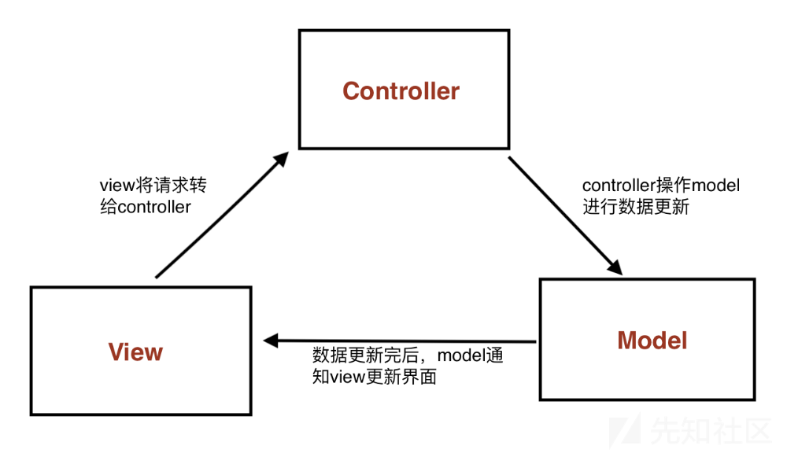
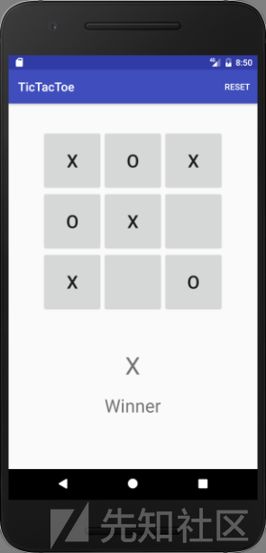
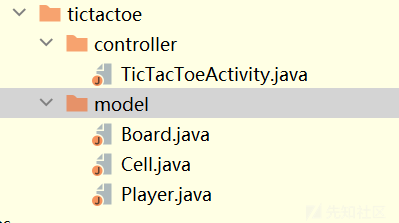
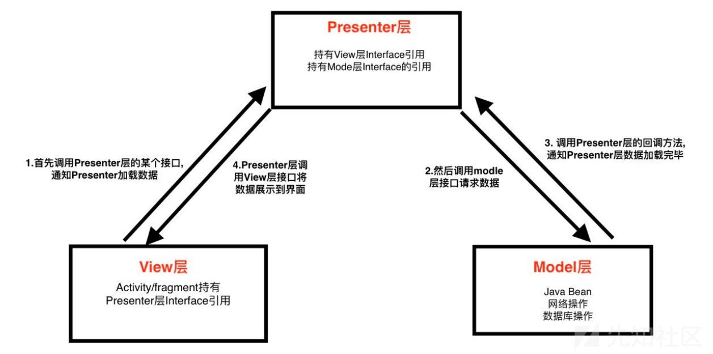
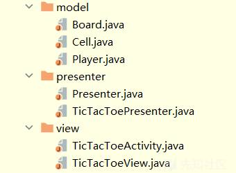
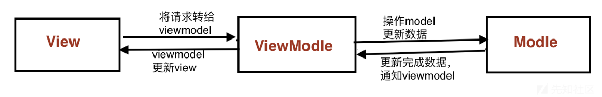
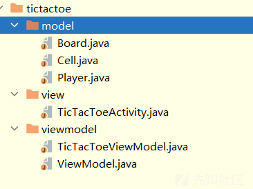

# Android常用开发架构（附带真实代码） - 先知社区

Android常用开发架构（附带真实代码）

- - -

> 开发架构是指在软件开发中，将应用程序组织成不同组件的方式和规范。它帮助开发人员更好地组织代码、提高可维护性和可扩展性，并促进团队合作。

-   在分析某app的时候，对其使用的MVP架构不熟悉，造成了一定的阅读困难和分析障碍，就想着总结一下常用的几个开发架构，并利用真实的apk分析一下每个架构的代码逻辑。  
    \## MVC
    
-   MVC架构将应用程序分为三个主要组件：模型（Model）、视图（View）和控制器（Controller），每个组件都有自己的职责和功能。
    
    -   Model：模型代表应用程序的数据和业务逻辑。它负责处理数据的获取、存储、更新和验证，以及执行与数据相关的业务操作。模型是独立于用户界面的，它不直接与视图进行交互，而是通过控制器来更新和传递数据。
    -   View：视图是用户界面的可视部分，它负责展示数据给用户，并接收用户的输入。视图通常是被动的，它根据模型的状态来更新自己的展示内容。在Android中，视图可以是Activity、Fragment、布局文件等。
    -   Controller：控制器是模型和视图之间的协调者。它接收来自视图的用户输入，并根据输入的类型和内容来更新模型的状态。控制器还负责将更新后的数据传递给视图，以便视图可以更新自己的展示内容。在Android中，控制器可以是Activity、Fragment等。  
        [](https://xzfile.aliyuncs.com/media/upload/picture/20231109100053-d09b3b32-7ea3-1.png)  
        \### MVC具体代码逻辑  
        [](https://xzfile.aliyuncs.com/media/upload/picture/20231109100131-e6e7afce-7ea3-1.png)
-   下图为apk的文件架构，xml文件作为View模块。  
    [](https://xzfile.aliyuncs.com/media/upload/picture/20231109100510-69b304f8-7ea4-1.png)
-   Controller。其中**`TicTacToeActivity` 就相当于常见的MainActivity，作为这个小程序的主控制器。接着看一下这个MainActivity详细的设计。**
    
    -   初始化
        
        ```plain
        protected void onCreate(Bundle savedInstanceState) {
              super.onCreate(savedInstanceState);
              setContentView(R.layout.tictactoe);
              winnerPlayerLabel = (TextView) findViewById(R.id.winnerPlayerLabel);
              winnerPlayerViewGroup = findViewById(R.id.winnerPlayerViewGroup);
              buttonGrid = (ViewGroup) findViewById(R.id.buttonGrid);
        
              model = new Board();
          }
        /*
        该方法Activity创建时设置了布局、获取了界面中的视图对象，
        并创建了一个游戏棋盘的模型对象，为后续的界面操作和游戏逻辑提供基础。
        */
        ```
        
    -   点击落棋
        
        ```plain
        public void onCellClicked(View v) {
        
              Button button = (Button) v;
        
              String tag = button.getTag().toString();
              int row = Integer.valueOf(tag.substring(0,1));
              int col = Integer.valueOf(tag.substring(1,2));
              Log.i(TAG, "Click Row: [" + row + "," + col + "]");
        
              Player playerThatMoved = model.mark(row, col);//调用model中下棋的函数，并返回一个Player对象
        
              if(playerThatMoved != null) {//判断是否移动了棋子
                  button.setText(playerThatMoved.toString());//棋子是X or O
                  if (model.getWinner() != null) {//调用model中的检查是否有胜者的函数
                      winnerPlayerLabel.setText(playerThatMoved.toString());//显示有了胜者
                      winnerPlayerViewGroup.setVisibility(View.VISIBLE);
                  }
              }
        
          }
        ```
        
-   Model
    
    -   先看一下在控制权中Click函数中主要调用的Board.mark函数。
        
        ```plain
        /**
        * 标记指定行和列的格子，并返回进行移动的玩家。
        * 
        * @param row 格子所在的行
        * @param col 格子所在的列
        * @return 进行移动的玩家，如果移动无效则返回null
        */
        public Player mark(int row, int col) {
          Player playerThatMoved = null;
        
          // 检查移动是否有效
          if (isValid(row, col)) {
              // 设置格子的值为当前轮到的玩家
              cells[row][col].setValue(currentTurn);
              playerThatMoved = currentTurn;
        
              // 检查是否是当前玩家的胜利移动
              if (isWinningMoveByPlayer(currentTurn, row, col)) {
                  state = GameState.FINISHED;
                  winner = currentTurn;
              } else {
                  // 切换当前轮到的玩家并继续游戏
                  flipCurrentTurn();
              }
          }
        
          return playerThatMoved;
        }
        
        /**
        * 重新开始游戏，重置格子状态、胜利者、轮到的玩家和游戏状态。
        */
        public void restart() {
          clearCells(); // 清空所有格子的状态
          winner = null; // 重置胜利者
          currentTurn = Player.X; // 将轮到的玩家设置为X玩家
          state = GameState.IN_PROGRESS; // 将游戏状态设置为进行中
        }
        
        /**
        * 切换当前轮到的玩家。
        * 如果当前轮到的玩家是X，则切换为O；如果是O，则切换为X。因为Play.java类是只有X和O的枚举
        */
        private void flipCurrentTurn() {
          currentTurn = (currentTurn == Player.X) ? Player.O : Player.X;
        }
        ```
        
    -   上面是进行标记和切换Player的主要函数，一些检测坐标是否越界类似的函数就没放上。Model中的类进行完棋子的处理后返回给Controller一个Play类的对象（X or O），然后控制器获取到值后赋值给当前点击的Button，也就是改变了View的值。这样对应了MVC架构的一个特性：Model是独立于用户界面的，它不直接与视图进行交互，而是通过控制器来更新和传递数据。
        
    -   每次落棋后，并从Model获取Play的值后给View中的Button赋值后，就会检测是否有胜者，这里也是同样的逻辑：Activity中调用Model中的getWinner（）函数，或者一个是否有胜者的布尔值，然后根据这个布尔值改变View中的组件的值，完成整个游戏。
    -   同时要重置游戏（清空View中9个Button的值），也是与上面的一样的逻辑。这里就不再赘述。

### MVC的不足

-   视图（View）和控制器（Controller）之间的耦合度较高。
-   View既是用户界面的显示层，又负责处理用户输入和交互逻辑。这导致视图对象的职责过重，难以维护和测试。同时，控制器也承担了过多的责任，负责处理视图的交互和业务逻辑，导致控制器变得臃肿和难以管理。
-   界面逻辑（即视图和控制器）与业务逻辑（即模型）通常耦合在一起。

## MVP

-   MVP架构将应用程序分为三个主要组件：模型（Model）、视图（View）和表示器（Presenter）。
-   MVP的改进
    
    -   MVP明确划分了视图、业务逻辑和逻辑控制层（Presenter）的责任，使代码更清晰、可维护性更高。
    -   MVP通过接口将视图和Presenter解耦，减少了它们之间的直接依赖，使得各个组件更独立、可重用性更好。
    -   MVP使得业务逻辑由Presenter负责处理，视图只负责展示和用户交互，使得单元测试更容易进行，提高了代码的可测试性。
    -   MVP将业务逻辑从视图中分离出来，使得业务逻辑更集中、易于管理，提高了代码的可维护性和可扩展性。  
        [](https://xzfile.aliyuncs.com/media/upload/picture/20231109100620-933211b6-7ea4-1.png)  
        \### MVP具体代码逻辑
-   文件架构  
    [](https://xzfile.aliyuncs.com/media/upload/picture/20231109100733-bed84bdc-7ea4-1.png)
    
-   View层（Activity/frament持有Presenter层Interface引用）
    
    -   初始化函数
        
        ```plain
        protected void onCreate(Bundle savedInstanceState) {
          super.onCreate(savedInstanceState);
          setContentView(R.layout.tictactoe);
        
          // 初始化视图元素
          winnerPlayerLabel = (TextView) findViewById(R.id.winnerPlayerLabel);
          winnerPlayerViewGroup = findViewById(R.id.winnerPlayerViewGroup);
          buttonGrid = (ViewGroup) findViewById(R.id.buttonGrid);
        
          // 创建Presenter并进行初始化
          presenter.onCreate();
        }
        ```
        
    -   点击按钮和改变按钮值的函数
        
        -   `onCellClicked` 和`setButtonText`
            
            ```plain
            public void onCellClicked(View v) {
                  // 获取点击的按钮
                  Button button = (Button) v;
                  // 获取按钮的tag，即按钮在网格中的位置信息
                  String tag = button.getTag().toString();
                  // 提取行和列的索引
                  int row = Integer.valueOf(tag.substring(0,1));
                  int col = Integer.valueOf(tag.substring(1,2));
                  Log.i(TAG, "Click Row: [" + row + "," + col + "]");
            
                  // 调用Presenter的方法，通知按钮被选中
                  presenter.onButtonSelected(row, col);
              }
            
              @Override
              public void setButtonText(int row, int col, String text) {
                  // 根据行和列的索引，找到对应的按钮
                  Button btn = (Button) buttonGrid.findViewWithTag("" + row + col);
                  if(btn != null) {
                      // 设置按钮的文本
                      btn.setText(text);
                  }
              }
            ```
            
-   Presenter层。
    
    -   `onButtonSelected`函数，在View中被调用的函数。
        
        ```plain
        public void onButtonSelected(int row, int col) {
          // 在模型中标记玩家的移动，并获取执行移动的玩家
          Player playerThatMoved = model.mark(row, col);
        
          // 如果玩家移动成功
          if(playerThatMoved != null) {
              // 在视图中设置按钮的文本
              view.setButtonText(row, col, playerThatMoved.toString());
        
              // 检查是否有获胜者
              if (model.getWinner() != null) {
                  // 在视图中显示获胜者信息
                  view.showWinner(playerThatMoved.toString());
              }
          }
        }
        ```
        
    -   其中函数调用了View中的函数setButtonText和showWinner。其中为了避免将Activity与Presenter紧密耦合，我们创建了一个接口，由Activity实现该接口。在测试中，我们可以基于这个接口创建一个模拟对象，用于测试Presenter与视图之间的交互。
        
        ```plain
        public interface TicTacToeView {
          void showWinner(String winningPlayerDisplayLabel);
          void clearWinnerDisplay();
          void clearButtons();
          void setButtonText(int row, int col, String text);
        }
        ```
        
    -   onButtonSelected函数还调用了Model层的函数
        
        -   `model.mark(row, col)`和`model.getWinner() != **null`\*\*
        -   这两个函数和MVC中的作用相同，这里不再赘述。
    -   Presenter层类获取到Model层的返回后，直接调用View层的接口对视图进行一系列改变。
-   总结
    -   视图层（View）的职责分离：在MVP架构中，视图层负责处理用户界面的展示和用户交互，例如在`setButtonText`方法中设置按钮的文本。而MVC架构中，视图层通常包含了视图展示和用户交互的逻辑，同时也负责处理部分业务逻辑。
    -   逻辑控制层（Presenter/Controller）的引入：MVP架构引入了逻辑控制层，即Presenter，它负责处理业务逻辑，连接视图和模型。在上述代码中，`onButtonSelected`方法就是Presenter中的逻辑处理方法。而MVC架构中，控制器（Controller）通常负责处理用户的输入和请求，并更新模型和视图。
    -   模型层（Model）的独立性：MVP架构中的模型层独立于视图和逻辑控制层。在上述代码中，模型层的功能由`model`对象实现，包括标记玩家移动、获取获胜者等操作。而在MVC架构中，模型通常由模型对象（Model）表示，并与视图和控制器进行交互。
    -   接口的引入：在MVP架构中，通常会使用接口来定义视图和Presenter之间的交互契约。上述代码中并未显示接口的定义，但提到了通过接口来解耦Activity和Presenter的方式。而在MVC架构中，通常不需要显式定义接口，视图和控制器之间的交互通过约定和直接调用实现。

### MVP的不足

-   在MVP架构中，视图和Presenter之间需要手动进行数据的同步和状态的更新。这意味着开发人员需要编写额外的代码来确保视图与Presenter之间的一致性，这可能会导致代码冗余和维护复杂性。
-   在复杂的场景下，Presenter可能会变得臃肿，因为它负责处理大量的业务逻辑和视图交互。这可能导致Presenter变得难以理解和维护。
-   在MVP架构中，通常是由视图主动调用Presenter的方法来触发相应的逻辑处理。这种单向通信模式在某些情况下可能不够灵活，特别是当需要频繁地进行视图更新时，可能需要额外的代码来处理不同的视图状态。

## MVVM

-   为了解决一些MVP架构的缺点，MVVM（Model-View-ViewModel）架构被引入。MVVM架构引入了ViewModel层，它负责管理视图的状态和逻辑，并与视图进行双向绑定。这样可以减少视图和逻辑控制层之间的手动同步，并提供更灵活的视图更新机制。此外，MVVM架构还支持数据驱动的开发方式，使得程序猿可以更专注于数据的处理和逻辑，而不必过多关注视图的操作。
-   MVVM由模型层（Model），视图层（View）和ViewModel层组成。
    
    -   Model：负责处理数据和业务逻辑。它可以是从网络获取的数据、数据库中的数据或其他数据源。Model层通常是独立于界面的，可以在多个界面之间共享。（与MVC架构中的Model作用类似）
    -   View：负责展示数据和与用户进行交互。它可以是Activity、Fragment、View等。View层主要负责UI的展示和用户输入的响应。
    -   ViewModel：连接View和Model，作为View和Model之间的桥梁。它负责从Model中获取数据，并将数据转换为View层可以直接使用的形式。ViewModel还负责监听Model的数据变化，并通知View进行更新。ViewModel通常是与View一一对应的，每个View都有一个对应的ViewModel。  
        [](https://xzfile.aliyuncs.com/media/upload/picture/20231109100823-dc42cf6c-7ea4-1.png)  
        \### MVVM具体代码逻辑
-   代码架构  
    [](https://xzfile.aliyuncs.com/media/upload/picture/20231109100912-f9d23c84-7ea4-1.png)
    
-   MVVM架构需要Data Binding，要在build.gradle 文件添加以下配置启用Data Binding。配置成功并在布局文件中正确绑定后重新编译项目将生成与布局文件关联的绑定类，也就是`TictactoeBinding` 。

```plain
android {
    ...
    dataBinding {
        enabled = true
    }
}

//还需要在xml布局文件中正确绑定ViewModel
<data>
    <import type="android.view.View" />
    <variable name="viewModel" type="com.acme.tictactoe.viewmodel.TicTacToeViewModel" />
</data>
```

-   View层
    
    -   onCreate()
        
        ```plain
        protected void onCreate(Bundle savedInstanceState) {
          super.onCreate(savedInstanceState);
          // 创建TictactoeBinding对象并将当前Activity的布局与之绑定
          TictactoeBinding binding = DataBindingUtil.setContentView(this, R.layout.tictactoe);
          // 将ViewModel对象设置为绑定对象的数据绑定变量
          binding.setViewModel(viewModel);
          // 调用ViewModel的onCreate方法，执行相关初始化逻辑
          viewModel.onCreate();
        }
        ```
        
    -   在典型的 MVVM（Model-View-ViewModel）模式中，ViewModel 负责处理与视图相关的操作逻辑和数据处理。它充当了视图（Activity 或 Fragment）与数据模型（Model）之间的中间层。所以和之前两个架构不同的是，操作逻辑放在了ViewModel中。
        
-   ViewModel
    
    -   `onClickedCellAt`
        
        ```plain
        public void onClickedCellAt(int row, int col) {
          // 用户点击了指定位置的单元格后，触发的点击事件处理函数
        
          // 调用 ViewModel 的方法来处理用户点击事件，并获取移动的玩家
          Player playerThatMoved = model.mark(row, col);
        
          // 更新视图中单元格的状态，将玩家标记放入相应的单元格
          cells.put("" + row + col, playerThatMoved == null ? null : playerThatMoved.toString());
        
          // 更新视图中的胜利者状态，将胜利者信息设置为 ViewModel 中计算得到的胜利者
          winner.set(model.getWinner() == null ? null : model.getWinner().toString());
        }
        ```
        
-   Model层
    
    -   mark函数
        
        ```plain
        public Player mark(int row, int col) {
          // 在指定的行和列上标记玩家移动，并返回移动的玩家
        
          Player playerThatMoved = null;
        
          if (isValid(row, col)) {
              // 如果指定的位置有效，则进行标记
        
              // 将当前回合的玩家标记放入对应的单元格
              cells[row][col].setValue(currentTurn);
              playerThatMoved = currentTurn;
        
              if (isWinningMoveByPlayer(currentTurn, row, col)) {
                  // 如果玩家的移动导致胜利，则将游戏状态设置为已结束，并将胜利者设置为当前回合的玩家
                  state = GameState.FINISHED;
                  winner = currentTurn;
              } else {
                  // 如果玩家的移动没有导致胜利，则翻转当前回合的玩家，并继续游戏
                  flipCurrentTurn();
              }
          }
        
          return playerThatMoved;
        }
        ```
        
-   由于代码比较简单，也不好看出MVVM架构的特色的优势，这里简单总结一下MVVM架构的代码逻辑
    
    -   View 层逻辑：
        -   View 层负责显示和渲染用户界面，并捕获用户的交互事件。
        -   当用户在特定位置的单元格上点击时，触发 `onClickedCellAt()` 函数。
        -   `onClickedCellAt()` 函数将用户的点击事件传递给 ViewModel 层进行处理，并更新视图中的单元格状态和胜利者状态。
    -   ViewModel 层逻辑：
        -   ViewModel 层负责处理与视图相关的操作逻辑和数据处理。
        -   当 `onClickedCellAt()` 函数被调用时，ViewModel 的方法被调用来处理用户点击事件。
        -   ViewModel 的 `mark()` 方法被调用，将用户的点击事件传递给 Model 层进行处理。
        -   ViewModel 接收从 Model 层返回的移动的玩家，并将其转发给 View 层以更新视图中的单元格状态和胜利者状态。
    -   Model 层逻辑：
        -   Model 层负责处理游戏的核心逻辑和数据存储。
        -   在 `mark()` 方法中，Model 层接收到来自 ViewModel 层的用户点击事件，并在指定的行和列上标记玩家的移动。
        -   如果玩家的移动导致胜利，Model 层将游戏状态设置为已结束，并将胜利者设置为当前回合的玩家。
        -   如果玩家的移动没有导致胜利，Model 层翻转当前回合的玩家，并继续游戏。
        -   Model 层返回移动的玩家给 ViewModel 层，供其更新视图中的单元格状态和胜利者状态。
    -   总结：View 层负责显示和渲染界面，捕获用户交互事件并调用 ViewModel 层的方法；ViewModel 层负责处理用户交互事件，并将其传递给 Model 层进行处理；Model 层负责处理核心逻辑和数据存储，并返回处理结果给 ViewModel 层，最终更新视图中的状态。

### MVVM的不足

-   MVVM框架通常依赖于数据绑定来实现视图和ViewModel之间的自动同步。然而，过度使用数据绑定可能导致代码变得复杂和难以调试。在某些情况下，手动更新视图或处理特定的用户交互可能更加直观和可控。
-   在MVVM框架中，ViewModel层负责管理视图的状态和逻辑。但是，如果ViewModel层设计得过于复杂或包含过多的业务逻辑，可能会导致ViewModel变得臃肿和难以维护。因此，需要仔细设计和划分ViewModel的职责，以确保代码的可读性和可维护性。
-   MVVM框架中的双向数据绑定机制可以实现视图和ViewModel之间的自动更新，但这可能会带来一些性能问题。当数据量较大或频繁更新时，双向绑定可能会带来额外的开销和性能影响。在这种情况下，需要谨慎使用双向绑定，或者进行性能优化和限制。
-   使用MVVM框架通常需要引入特定的框架或库，这可能导致项目的依赖性增加。同时，某些框架可能会对代码结构和组织方式有一定的限制，需要按照框架的规范进行开发。这可能会对项目的灵活性和自由度产生一定的影响。这一点不知道是不是劣势，对于使用其他架构开发了很久的开发者接触到新的MVVM架构可能受限制较大，缺少一定的自由度，但是统一的规范也提高了，有益于团队之间的合作。对应这种规范性强的框架，新手学起来更有利于好的开发习惯的养成吧。

## 源码

-   [https://www.123pan.com/s/Ysofjv-6cNHA.html](https://www.123pan.com/s/Ysofjv-6cNHA.html)
