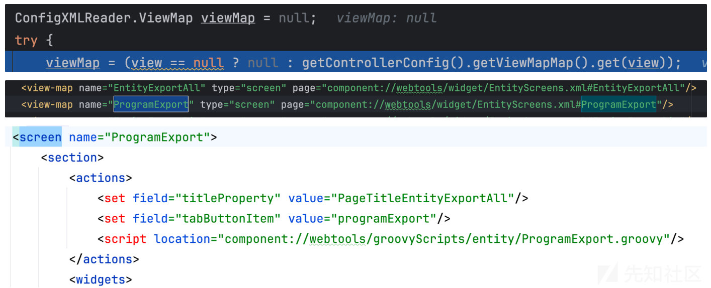

# Apache OFBiz CVE-2023-49070 & 最新 CVE-2023-51467 未授权分析（RCE/SSRF/LFR） - 先知社区

Apache OFBiz CVE-2023-49070 & 最新 CVE-2023-51467 未授权分析（RCE/SSRF/LFR）

- - -

## 写在前面

最近看到 P 神公众号上发了篇 Apache Ofbiz 的漏洞分析所以就跟着学习了一下，没想到长亭这两天马上就又发布了鉴权绕过导致的几个利用 CVE，于是也跟着做了些分析。

## CVE-2023-51467（学习鉴权绕过）

-   漏洞影响范围：Apache OFBiz < 18.12.10
-   测试版本：Apache OFBiz 18.12.9
-   漏洞复现  
    POC：网上已经公开了就不粘贴了（粘上来显示不出来不知道为啥）  
    
-   漏洞绕过分析  
    从两方面绕过：
    -   绕过对于 `</serializable` 这个关键词的检测
    -   绕过对 XML-RPC 这个接口的认证  
        直接从之前补丁位置开始分析 `org.apache.ofbiz.base.util.CacheFilter#doFilter`  
          
        首先看到 uri 为 `/control/xmlrpc/;/` 从而绕过针对 `</serializable` 标签的检查。  
        [https://www.baeldung.com/cs/url-matrix-vs-query-parameters#tcp-connection](https://www.baeldung.com/cs/url-matrix-vs-query-parameters#tcp-connection) 提到了 ; 的含义。  
        因此，我们这里绕过了 `serializable` 的限制，接下来还需要绕过认证的模块。这一部分代码逻辑是在调用 `runEvent` 方法时进行。  
        具体在 `org.apache.ofbiz.webapp.control.LoginWorker#checkLogin` 这里条件分支当中的 `login` 函数非常关键，其返回值是否等于 error 决定了是否可以绕过鉴权。  
          
        跟进 login，这个绕过逻辑其实很简单，用于用户名为空，所以 `unpwErrMsgList` 当中会添加提示信息，使得走入下面这个条件分支，而在返回时，因为我们设置了 `requirePasswordChange` 参数值为 Y，因此返回的则是 `requirePasswordChange` ，不再是 `error`。  
          
        最终绕过 login 认证  
        
-   漏洞修复  
    [https://github.com/apache/ofbiz-framework/commit/c59336f604f503df5b2f7c424fd5e392d5923a27](https://github.com/apache/ofbiz-framework/commit/c59336f604f503df5b2f7c424fd5e392d5923a27)  
    修复直接暴力移除了 xmlrpc 模块  
      
    \## CVE-2023-51467 （RCE / SSRF / LFR）
-   漏洞影响版本：Apache Ofbiz < 18.12.11
-   测试版本：18.12.10  
    \#### grovvy RCE  
    这个一开始我没有发现，因为 git diff 当中没有找到相关的接口，后来看到 y4tacker 大师傅发了篇文章 [https://y4tacker.github.io/2023/12/27/year/2023/12/Apache-OFBiz%E6%9C%AA%E6%8E%88%E6%9D%83%E5%91%BD%E4%BB%A4%E6%89%A7%E8%A1%8C%E6%B5%85%E6%9E%90-CVE-2023-51467/](https://y4tacker.github.io/2023/12/27/year/2023/12/Apache-OFBiz%E6%9C%AA%E6%8E%88%E6%9D%83%E5%91%BD%E4%BB%A4%E6%89%A7%E8%A1%8C%E6%B5%85%E6%9E%90-CVE-2023-51467/) 于是就跟着复现了一下。  
    存在问题的接口在 `/webtools/control/ProgramExport` 依然在之前 webtools 目录下，因此映射的 servlet 都是一样的。  
    org.apache.ofbiz.webapp.control.RequestHandler#doRequest 下会根据配置解析请求映射。  
      
    具体可以在 controller.xml 下找到，看到这里是作了鉴权的（但是已经被我们绕过了），并且并没有 event handler 的设置，只设置了响应信息，类型为 view。  
      
    因此处理完请求后，会根据 `nextRequestResponse.type` 的值来渲染视图。  
      
    来到 org.apache.ofbiz.webapp.control.RequestHandler#renderView ，可以看到视图配置也是从 controller.xml 中读取。  
      
    这里如果不熟悉 Ofbiz 视图配置的话可以看文档这里：[https://cwiki.apache.org/confluence/display/OFBIZ/Understanding+the+OFBiz+Widget+Toolkit](https://cwiki.apache.org/confluence/display/OFBIZ/Understanding+the+OFBiz+Widget+Toolkit)  
      
    另外如果不熟悉 groovy 的话可以先看看这篇 [https://xz.aliyun.com/t/8231#toc-5](https://xz.aliyun.com/t/8231#toc-5)  
    groovy 脚本的执行参数可以通过在 `context` 中设置，这里意思也就是可以在请求参数中设置。  
    根据脚本内容可以知道参数名设置为 `groovyProgram` 即可。  
    调用栈如下：  
      
    跟入 groovy 脚本，里面对输入参数作了一些检查，调用 `SecuredUpload.isValidText` 。  
      
    黑名单如下所示，白名单为 import 关键字。  
      
    这个过滤其实很不严，比如 execute 都没有过滤掉，配合字符串拼接就可以执行任意命令了。  
      
    \#### SSRF && 任意配置读取
-   git diff  
    [https://github.com/apache/ofbiz-framework/commit/d8b097f6717a4004acf023dfe929e0e41ad63faa](https://github.com/apache/ofbiz-framework/commit/d8b097f6717a4004acf023dfe929e0e41ad63faa)
    
    > Replaced direct null checks on username, password, and token with UtilValidate.isEmpty() method calls for consistency
    

  
这个也就是前面漏洞提到鉴权的地方，前面是空字符串可以绕过，这里改换成了 UtilValidate.isEmpty() 看下它里面还判断了字符串长度，因此使用空字符串不再可以绕过。  
  
[https://github.com/apache/ofbiz-framework/commit/82c17376880a8fd8a11261e1e00dad45cfed344d](https://github.com/apache/ofbiz-framework/commit/82c17376880a8fd8a11261e1e00dad45cfed344d)

> Use screen engine for the request getJSONuilabels

themes/common-theme/webapp/common/js/util/OfbizUtil.js  
  
diff 当中看到两个 js 文件，`getJSONuilLabels` 函数里面通过 jQuery 发送请求到 `getJSONuiLabelArray` API ，请求方式为 POST ，并且传参 `requiredLabels` 。  
然后 PartyProfileContent.js 当中看到调用了该 `getJSONuilLabels` 方法，传的格式为 json 。  
applications/party/webapp/partymgr/static/PartyProfileContent.js  
  
根据变量名 UiLabel 我们可以大致推理出这里是在做一个国际化处理，即发送标签名并从与 CommonUiLabels 关联的配置文件当中读取相应标签名的国际化信息并返回。  
OK 我们可以尝试发起这个请求验证一下。一番查找之后这个接口是对应的是 `webtools/control/getJSONuiLabelArray`  
  
感兴趣的话可以看下这个默认国际化配置文件信息就在 framework/common/config/CommonUiLabels.xml。  
`getJSONuiLabelArray` 路由信息位于 framework/common/webcommon/WEB-INF/common-controller.xml。  
  
可以看到 https 设置为 true，说明这里调用也是需要先鉴权的（因此需要我们先做鉴权绕过）。之后的事件处理 handler 为 CommonEvents 类。  
  
其实这里思路已经有了，就是看看这个配置文件是否是可以指定的，因为所有的参数都可以控制。因此分析的主要逻辑在 `org.apache.ofbiz.base.util.UtilProperties#getResourceBundle` 这里，第一个参数就是前面 `CommonUiLabels` 对应位置值。  
首先会调用 `createResourceName` 方法，里面第三个参数如果为 true 的话，会移除后缀出现 `.xml/.properties` 的（后面还会出现）。并且将 locale 本地信息添加到后缀。  
  
之后如果 `bundleCache` 中没有对应项的话，则会去掉之前添加的 locale 本地信息后缀，换一个其他的，这里看到 locale 本地信息是存在空字符串的，也就是什么都不添加。然后再去查找，如果还没有则会调用 `getProperties` 方法。  
  
org.apache.ofbiz.base.util.UtilProperties#getProperties(java.lang.String, java.util.Locale) 可以看到会调用 `resolvePropertiesUrl` 解析 `resource` 的 url。里面实际还会调用一次 `createResourceName` ，这回第三个参数变成了 false，也就是不会去除后缀。因此可以任意指定加载配置文件。  
  
可以看到这里支持多种协议，包括常见的 http/file 协议。  
  
然后如果是指定了某个协议时， org.apache.ofbiz.base.util.UtilProperties#resolvePropertiesUrl 就会创建一个 URL 实例。  
  
后续 org.apache.ofbiz.base.util.UtilProperties.ExtendedProperties#ExtendedProperties(java.net.URL, java.util.Locale) 就会建立连接并读取其中的内容。因此这里就是文件读取以及 SSRF 的漏洞 sink 点。  
  
它这里支持读取 properties 或 xml 文件，我们这里以 properties 为例。  
那么内容如何解析并回显呢？来到 `org.apache.ofbiz.base.util.UtilProperties#getMessage(java.lang.String, java.lang.String, java.util.Locale)` 方法，这里看到只需要读取的键值对中，key 存在与 `name`（就是对应的前面传入的标签值）一样的话就取出并回显。  
  
**配置文件读取**  
以读取 applications/accounting/config/payment.properties 中的几个 key 为例  
  
**SSRF 利用**  
这里随便写一个 properties 文件，然后 `python -m http.server 8000` 起个服务  
  
POC 验证  
  
成功对 8000 端口服务发起了请求  

#### 引用

\[1\] [Insecure Deserialization in Apache XML-RPC · CVE-2019-17570 · GitHub Advisory Database](https://github.com/advisories/GHSA-6vwp-35w3-xph8)  
\[2\] [CVE-2023-49070&&CVE-2020-9496 OFBIZ XML-RPC漏洞分析 - 先知社区 (aliyun.com)](https://xz.aliyun.com/t/13168)  
\[3\] [https://mp.weixin.qq.com/s/iAvitO6otPdHSu1SjRNX3g](https://mp.weixin.qq.com/s/iAvitO6otPdHSu1SjRNX3g)  
\[4\] [https://www.mi1k7ea.com/2021/09/21/浅析Ofbiz反序列化漏洞（CVE-2020-9496）/](https://www.mi1k7ea.com/2021/09/21/%E6%B5%85%E6%9E%90Ofbiz%E5%8F%8D%E5%BA%8F%E5%88%97%E5%8C%96%E6%BC%8F%E6%B4%9E%EF%BC%88CVE-2020-9496%EF%BC%89/)  
\[5\] [https://xz.aliyun.com/t/8184#toc-3](https://xz.aliyun.com/t/8184#toc-3)  
\[6\] [The Apache OFBiz® Project - Release Notes 18.12.11](https://ofbiz.apache.org/release-notes-18.12.11.html)  
\[7\] [Apache OFBiz未授权命令执行浅析(CVE-2023-51467) (y4tacker.github.io)](https://y4tacker.github.io/2023/12/27/year/2023/12/Apache-OFBiz%E6%9C%AA%E6%8E%88%E6%9D%83%E5%91%BD%E4%BB%A4%E6%89%A7%E8%A1%8C%E6%B5%85%E6%9E%90-CVE-2023-51467/)
