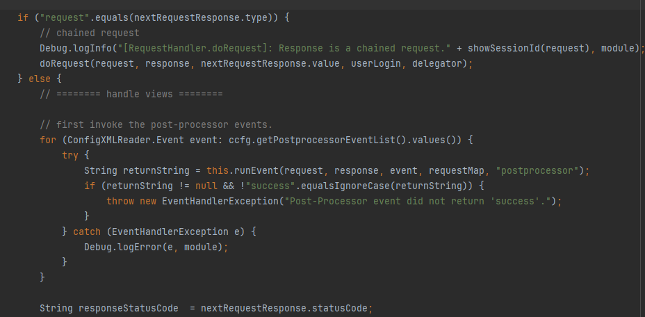
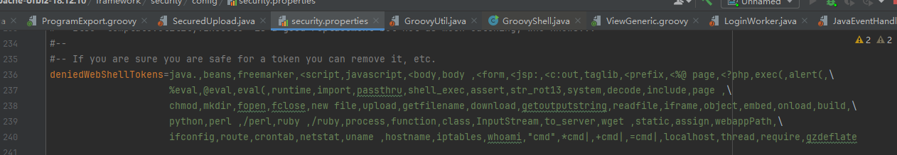

# [](#Apache-OFBiz%E6%9C%AA%E6%8E%88%E6%9D%83%E5%91%BD%E4%BB%A4%E6%89%A7%E8%A1%8C%E6%B5%85%E6%9E%90-CVE-2023-51467 "Apache OFBiz未授权命令执行浅析(CVE-2023-51467)")Apache OFBiz未授权命令执行浅析(CVE-2023-51467)

## [](#%E6%9C%AA%E4%BF%AE%E5%A4%8D%E7%9A%84%E6%9D%83%E9%99%90%E7%BB%95%E8%BF%87 "未修复的权限绕过")未修复的权限绕过

还是之前那个遗留的问题，首先是权限绕过，首先还是做一个简单的回顾  
关于登录的校验在`org.apache.ofbiz.webapp.control.LoginWorker#checkLogin`做处理来判断用户是否登录，可以看到这里的判断逻辑非常简单，跳过前两个判断，在后面只需要login返回的不是error，则为认证成功

再来看看login的判断，在这里如果`unPwErrMsglist`不为null则可以直接返回`requirePasswordChange`

因此知道这个其实你就可以去后台点一点就知道哪里能RCE了，但是我比较好奇OFBiz的路由处理，为什么最后能调用到`ProgramExport.groovy`

## [](#%E8%B7%AF%E7%94%B1%E5%A4%84%E7%90%86%E4%BB%A5%E5%8F%8A%E8%A7%A3%E6%83%91 "路由处理以及解惑")路由处理以及解惑

在web.xml当中可以看到仅有一个Servlet处理，继续跟入`org.apache.ofbiz.webapp.control.ControlServlet`

以`doGET`为例，忽略一些无关的逻辑，最终都是通过`handler.doRequest`做请求的处理

在这里我们先看看handler的获取处理，首先在servlet的初始化过程就进行了初始化操作

|     |     |
| --- | --- |
| ```plain<br>1<br>2<br>3<br>4<br>5<br>6<br>7<br>8<br>9<br>10<br>11<br>12<br>``` | ```plain<br>@Override<br>public void init() throws ServletException {<br>    ServletContext ctx = getServletContext();<br>    if (Debug.infoOn()) {<br>        String path = ctx.getContextPath();<br>        String webappName = path.isEmpty() ? path : path.substring(1);<br>        Debug.logInfo("Loading webapp [" + webappName + "], located at " + ctx.getRealPath("/"), module);<br>    }<br><br>    // Initialize the request handler.<br>    RequestHandler.getRequestHandler(ctx);<br>}<br>``` |

可以看到代码虽然不少，但其实就是从`/WEB-INF/controller.xml`下获取了路由的配置，并根据配置文件初始化了两个工厂类`ViewFactory`/`EventFactory`

|     |     |
| --- | --- |
| ```plain<br>1<br>2<br>3<br>4<br>5<br>6<br>7<br>8<br>9<br>10<br>11<br>12<br>13<br>14<br>15<br>16<br>17<br>18<br>19<br>20<br>21<br>22<br>23<br>24<br>25<br>26<br>27<br>28<br>29<br>30<br>31<br>32<br>33<br>34<br>35<br>36<br>37<br>38<br>39<br>40<br>41<br>42<br>``` | ```plain<br>public static RequestHandler getRequestHandler(ServletContext servletContext) {<br>    RequestHandler rh = (RequestHandler) servletContext.getAttribute("_REQUEST_HANDLER_");<br>    if (rh == null) {<br>        rh = new RequestHandler(servletContext);<br>        servletContext.setAttribute("_REQUEST_HANDLER_", rh);<br>    }<br>    return rh;<br>}<br><br>private RequestHandler(ServletContext context) {<br>    // init the ControllerConfig, but don't save it anywhere, just load it into the cache<br>    this.controllerConfigURL = ConfigXMLReader.getControllerConfigURL(context);<br>    try {<br>        ConfigXMLReader.getControllerConfig(this.controllerConfigURL);<br>    } catch (WebAppConfigurationException e) {<br>        // FIXME: controller.xml errors should throw an exception.<br>        Debug.logError(e, "Exception thrown while parsing controller.xml file: ", module);<br>    }<br>    this.viewFactory = new ViewFactory(context, this.controllerConfigURL);<br>    this.eventFactory = new EventFactory(context, this.controllerConfigURL);<br><br>    this.trackServerHit = !"false".equalsIgnoreCase(context.getInitParameter("track-serverhit"));<br>    this.trackVisit = !"false".equalsIgnoreCase(context.getInitParameter("track-visit"));<br><br>    hostHeadersAllowed = UtilMisc.getHostHeadersAllowed();<br><br>}<br><br>public static ControllerConfig getControllerConfig(WebappInfo webAppInfo) throws WebAppConfigurationException, MalformedURLException {<br>    Assert.notNull("webAppInfo", webAppInfo);<br>    String filePath = webAppInfo.getLocation().concat(controllerXmlFileName);<br>    File configFile = new File(filePath);<br>    return getControllerConfig(configFile.toURI().toURL());<br>}<br><br>public static ControllerConfig getControllerConfig(URL url) throws WebAppConfigurationException {<br>    ControllerConfig controllerConfig = controllerCache.get(url);<br>    if (controllerConfig == null) {<br>        controllerConfig = controllerCache.putIfAbsentAndGet(url, new ControllerConfig(url));<br>    }<br>    return controllerConfig;<br>}<br>``` |


接下来我们继续看`org.apache.ofbiz.webapp.control.RequestHandler#doRequest`,首先根据请求路径获取对应处理的`RequestMap`


接着首先是一些预处理，感兴趣的可以自己看看


继续往下，之后在正式处理前会走到我们熟悉的登录校验由于第一部分已经简单做了分析，这里就不再重复


之后根据返回结果选择对应的response，上面也提到过requestMap与uri有关，同样response这部分与uri以及type有关

|     |     |
| --- | --- |
| ```plain<br>1<br>2<br>3<br>4<br>5<br>``` | ```plain<br><request-map uri="ProgramExport"><br><security https="true" auth="true"/><br><response name="success" type="view" value="ProgramExport"/><br><response name="error" type="view" value="ProgramExport"/><br></request-map><br>``` |


接下来可以看到这里根据`nextRequestResponse.type`的种类执行，和我们请求的路径在xml中对应的配置有关，在这里由于我们是view因此走入else执行后置处理器



最终执行视图渲染的处理，之后的处理感兴趣就自己跟跟


而我们后台漏洞的利用点ProgramExport,对应视图如下

|     |     |
| --- | --- |
| ```plain<br>1<br>``` | ```plain<br><view-map name="ProgramExport" type="screen" page="component://webtools/widget/EntityScreens.xml#ProgramExport"/><br>``` |

因此也不难理解为什么通过路由最终能调用ProgramExport.groovy的处理了


## [](#%E5%88%A9%E7%94%A8%E6%97%B6%E5%80%BC%E5%BE%97%E6%B3%A8%E6%84%8F%E7%9A%84%E7%82%B9 "利用时值得注意的点")利用时值得注意的点

在直接利用时你会发现在某些版本下无法打成功，其实是因为这里做了一些简单的检查


这里有一些禁止使用的token


可以看到这个配置来源于配置文件


看到拦截的内容简直抽象，不知道从哪里抄来的…不多吐槽，绕过也很简单，黑名单里的限制并不多很容易通过代码层面bypass，当然也可以用unicode编码更直白



Ps:当然还有另一个CVE是关于SSRF以及任意配置读取的利用点也可以自己翻翻后台功能，这里不多做分析了

## [](#%E5%8F%82%E8%80%83%E9%93%BE%E6%8E%A5 "参考链接")参考链接

[Apache OFBiz漏洞 CVE-2023-49070 的前世今生](https://mp.weixin.qq.com/s/iAvitO6otPdHSu1SjRNX3g)
