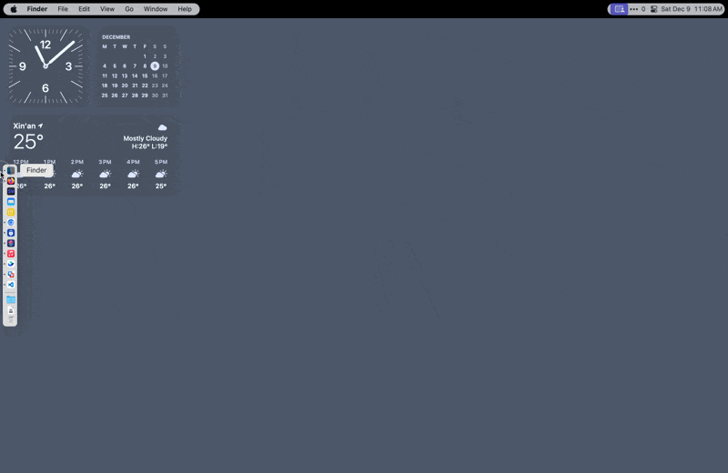
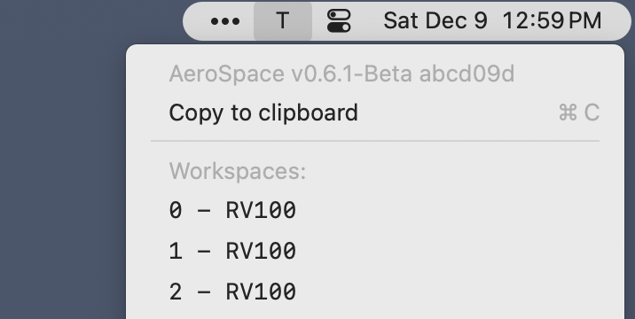

# App+1 | AeroSpace：消除窗口重叠，世界属于平铺 - 少数派

省流的话写在开头。如果你：

1.  知道 i3wm（或者它的朋友们）是什么东西，喜欢用这类工具管理 Linux 上的窗口；而且
2.  希望在 macOS 上也能用类似的逻辑管理窗口；但是
3.  没有找到合适的软件，或者对现有的那些选项不满意；

那么不用浪费时间看我唠叨了。请立刻运行：

```shell
brew install --no-quarantine --cask nikitabobko/tap/aerospace
```

让 i3 的光芒泽被 Aqua。（然后记得回去给[项目](https://sspai.com/link?target=https%3A%2F%2Fgithub.com%2Fnikitabobko%2FAeroSpace)一个星星赞赏。）

如果你并不知道上面在说什么鬼，但对在 macOS 上管理应用程序窗口的操作效率有任何不满，可以继续往下看。

- - -

怎样在 macOS 上有效管理窗口是让不少人都头大的问题。特别是在打开软件变多、窗口层层叠叠的情况下，仅仅想找到需要的窗口都是一件非常费眼费脑的事情。即使苹果去年从 iPad 那里搬来了「台前调度」（Stage Manager），至少从目前的风评来看，它的交互逻辑还没有打磨到令多数人满意的程度。

**对此，一种解决思路是：既然窗口重叠是一切麻烦之源，那别让窗口重叠不就行了吗？**的确，以 [Moom](https://sspai.com/link?target=https%3A%2F%2Fmanytricks.com%2Fmoom%2F)、[Rectangle](https://sspai.com/link?target=https%3A%2F%2Frectangleapp.com%2F) 为代表的一类辅助工具，其目的就是帮助用户快速将窗口安置到某种「网格系统」中，从而尽量减少相互遮挡的情况。


Moom

但这毕竟还是一个手动的过程，其效果取决于用户是否足够「主动」和「自觉」。不幸的是，正如在现实生活中一样，越是在手忙脚乱的时候，你就越没有心思去关注整洁。

**既然如此，干脆将这种思路推到「极端」，从系统层面就彻底不允许重叠，强制所有窗口像瓷砖一样平铺摆放，如何？**

想象一下，如果：

-   桌面总是会被窗口构成的网格填满，没有重叠也不留空隙，新出现的窗口则会根据一定的规则自动填入到现有网格中；
-   除了平铺之外，窗口之间还可以像手风琴一样错落叠放，露出各自的标题栏以便快速识别和切换；
-   多个窗口可以归结成组，各组之间和内部可以设置不同的布局方式，形成更灵活的布局；
-   对于设置界面等临时用到的窗口，可以用快捷键或自动规则使其悬浮，不受下方布局的约束。


听起来还不错？恭喜，你成功发明……发现了一个旧轮子，那就是历史悠久「[平铺式窗口管理器](https://sspai.com/link?target=https%3A%2F%2Fen.wikipedia.org%2Fwiki%2FTiling_window_manager)」（tiling window manager）。

与 Quartz Compositor（macOS 窗口管理器的艺名）所采用的「[合成式](https://sspai.com/link?target=https%3A%2F%2Fen.wikipedia.org%2Fwiki%2FCompositing_window_manager)」（compositing）逻辑相比，平铺式操作虽然有一定的上手门槛，但能迫使你保持窗口整洁，而且天然地更适合全键盘控制，可以实现很高的操作效率。

因此，尽管在大众用户群体中认知度不高，以 [i3](https://sspai.com/link?target=https%3A%2F%2Fi3wm.org%2F) 等为代表的平铺式窗口管理器在 Linux 用户中仍然有着大量拥趸。


用 i3 创建的 Fedora 桌面布局（u/I-Machina）

而在 macOS 上，模拟平铺式操作的努力也早已有之，两个最有名并且仍在继续维护的项目就是 [Amethyst](https://sspai.com/link?target=https%3A%2F%2Fgithub.com%2Fianyh%2FAmethyst)（c. 2013）和 [yabai](https://sspai.com/link?target=https%3A%2F%2Fgithub.com%2Fkoekeishiya%2Fyabai)（c. 2019）。

但 macOS 辜负了它们的好意。在这个越发小肚鸡肠的系统上，第三方工具没有任何公开的接口 (1) 创建或关闭桌面，(2) 切换到指定的桌面，或者 (3) 在桌面之间移动窗口；它们甚至很难知道现在激活的是第几个桌面。对于平铺式窗口管理器而言，在多个桌面之间快速切换和分配窗口是最核心的功能，macOS 这种限制不啻于在放进门之前就直接打断了一条腿。

结果，开发者只能求诸一些权宜之计：Amethyst 依靠一些晦涩的[私有 API](https://sspai.com/link?target=https%3A%2F%2Fgithub.com%2Fianyh%2FAmethyst%2Fcommit%2F22445ac91dca8f98190a12a898aaba87d613af3d)，yabai 选择对系统组件做[注入式修改](https://sspai.com/link?target=https%3A%2F%2Fgithub.com%2Fkoekeishiya%2Fyabai%2Fblob%2Fmaster%2Fsrc%2Fsa.m)，BetterTouchTool 则干脆直接模拟键鼠操作。显然，这些方法都是非常脆弱的，很容易随着系统更新而失效，实际体验也是磕磕绊绊。

因此，我虽然一直对在 macOS 上实现平铺式窗口管理心向往之，但总是被繁琐的启用步骤和断续的使用体验所困扰；每次短暂尝试后，最终还是「放弃抵抗」，回到手动排列窗口的老路上。

住在荷兰的 JetBrains 工程师 Nikita Bobko 没有放弃。他在今年五月带来了一种新的解决方案：[AeroSpace](https://sspai.com/link?target=https%3A%2F%2Fgithub.com%2Fnikitabobko%2FAeroSpace)，前不久进入了公测阶段。

毫不夸张地说，这是我目前在 macOS 上见过效果最好的平铺式窗口管理。

**AeroSpace 的天才之处在于，它完全回避了与冥顽不灵的 macOS 原生桌面做任何合作或是斡旋，而是以几乎有点冷幽默的方式，另起炉灶打造出一组「虚拟桌面」。**

在 AeroSpace 中：

-   当你切换到另一个「桌面」时，它所做的只是把所有窗口都藏到屏幕右下角（就像你对待一些不能关又占地方的弹出窗口一样），腾出空间来放置另一组窗口；
-   当你切换回之前的「桌面」时，它就再用同样的方法藏起当前的窗口，再把之前藏在右下角的、属于旧「桌面」的那批窗口放回原来的位置；
-   当你要求将窗口从一个「桌面」移动到另一个「桌面」时，它也只会被藏起来，然后下次和后一个「桌面」上的其他窗口一起出现。

~（也许它的名字更适合叫 Passive-Aggressive Window Manager……）~


AeroSpace 的~魔术~工作原理

换句话说，在使用 AeroSpace 时，你只要（在每个显示器上）留一个桌面就行了，它会用自己的「帽子戏法」接管所有窗口的布局。

而实际效果也是惊人的好，甚至比修改过系统文件状态下的 yabai 还要稳定，而又不用付出关闭系统文件保护（在 Apple silicon 机型上也就意味着不能用 iOS app）的高昂代价。

下面几张动图演示了 AeroSpace 是如何实现前文列举的平铺式窗口管理的：

新增和关闭窗口：




窗口的布局调整和悬浮：


下表是 AeroSpace 的主要默认快捷键，其中不少在上面的示例中已经用到：

| 功能  | 快捷键 |
| --- | --- |
| 将当前焦点切换到左/下/上/右侧的窗口 | Option-H/J/K/L |
| 将当前窗口向左/下/上/右侧移动 | Shift-Option-H/J/K/L |
| 将当前窗口尺寸增大/缩小 50 像素 | Shift-Option- = (equal) / - (minus) |
| 切换到编号为 X 的虚拟桌面  <br>（其中 X 为 \[HJKL\] 外的字母或数字） | Option-X |
| 将当前窗口移动到编号为 X 的虚拟桌面 | Shift-Option-X |
| 在最近两个虚拟桌面之间来回切换 | Option-Tab |
| 将当前窗口移动到另一个显示器 | Shift-Option-Tab |
| 将当前窗口所属的布局切换为横向/纵向平铺 | Option-/ (slash) |
| 将当前窗口所属的布局切换为横向/纵向堆叠 | Option-; (semicolon) |
| 重置当前虚拟桌面的布局为等分平铺 | 先按 Shift-Option-; (semicolon) 再按 R |
| 将当前窗口改为悬浮 | 先按 Shift-Option-; (semicolon) 再按 F |
| 关闭所有其他窗口 | 先按 Shift-Option-; (semicolon) 再按 Backspace |
| 将当前窗口与其左/下/上/右侧的窗口归为一组 | 先按 Shift-Option-/ (slash) 再按 H/J/K/L |

一些提示和观察：

-   这些快捷键都可以通过 AeroSpace 的配置文件（位于 `~/.aerospace.toml`）随意调整。更完整的可配置项可见作者提供的[带注释版本](https://sspai.com/link?target=https%3A%2F%2Fgithub.com%2Fnikitabobko%2FAeroSpace%2Fblob%2Fmain%2Fconfig-examples%2Fdefault-config.toml)以及[模拟 i3 键位的配置示例](https://sspai.com/link?target=https%3A%2F%2Fgithub.com%2Fnikitabobko%2FAeroSpace%2Fblob%2Fmain%2Fconfig-examples%2Fi3-like-config-example.toml)。
-   可以看出，AeroSpace 的默认设置风格类似于 i3，以 Alt (Option) 为主要的修饰键，但用上了除 \[HJKL\] 外的所有数字和字母。这样的好处是可以支持多达 32 (= 10 + 26 - 4) 个虚拟桌面，缺点则是容易和一些软件本身的快捷键打架。如果你有一些特别惯用的含 Option 的快捷键，可以到配置里注释掉相关条目。
-   如果你有其他习惯的快捷键管理工具（例如 BetterTouchTool 或 skhd 等），可以使用 AeroSpace 的命令行接口。从 `aerospace` 的[手册](https://sspai.com/link?target=https%3A%2F%2Fgithub.com%2Fnikitabobko%2FAeroSpace%2Fblob%2Fmain%2Fdocs%2Fcommands.md)中查询需要的子命令，然后在第三方工具里将其绑定到快捷键即可。
-   在 macOS 这种图形界面为主的平台上使用平铺式窗口管理器，一个主要不便就在于很多临时性的小窗口（例如系统设置、微信小程序等等）并不需要自动加入网格布局，反而会造成困扰。对此，AeroSpace 也提供了过滤功能，使满足一定条件的窗口在出现时自动悬浮。 具体配置参考见文末附录。

AeroSpace 另一个特别贴心的设计是，它自带了一个菜单栏小组件，指示当前激活的桌面序号，点开则可以直观看到哪些桌面上有窗口，以及临时停用自动布局。



除此之外，AeroSpace 的作者对于平铺式窗口管理器的交互逻辑还有一些颇为细致的论述，其结论也反映在 AeroSpace 对于 i3 设计的扬弃中，但这超出了本文作为一篇「安利」的讨论范围，推荐感兴趣的朋友前去阅读《[使用指南](https://sspai.com/link?target=https%3A%2F%2Fgithub.com%2Fnikitabobko%2FAeroSpace%2Fblob%2Fmain%2Fdocs%2Fguide.md)》。赞同与否倒是其次的（反正不赞同也可以改配置），但确实有助于加深对平铺式窗口管理的理解。

最后想说的是，「平铺式」之于窗口管理，有点类似于双拼之于中文输入、Vim 之于文本编辑，喜欢的人自然能受益匪浅，但如果你经过一番尝试发现难以适应，其实也不会错过什么。更何况，再好的窗口管理器也不能完全取代保持整齐有序的操作习惯。不过，AeroSpace 的独特设计毫无疑问为 macOS 用户提供了一片对系统侵入性最小、配置和上手最简单的「实验田」，这就是本文愿意推荐给更多人尝试的原因。

- - -

**附录一：macOS 平铺式窗口管理器对比**

| 名称  | Amethyst | yabai | AeroSpace |
| --- | --- | --- | --- |
| 最初发布时间 | 2013-05 | 2019-05 | 2023-05 |
| 修改系统文件 | 不需要 | 需要  | 不需要 |
| 语言  | Swift | C   | Swift |
| 配置文件 | YAML | rc 文件 (shell 脚本) | TOML |
| 快捷键绑定 | 内置  | 需外部工具 | 内置或外部工具 |
| 操作风格 | 自动布局为主（类似 xmonad） | 手动布局为主（类似 bspwm） | 手动布局为主（类似 i3） |
| 第三方状态栏 | 支持  | 支持  | 支持  |
| 鼠标操作 | 支持拖放窗口和焦点追踪 | 支持拖放窗口和焦点追踪 | 支持拖放窗口，不支持焦点追踪 |
| 在桌面间移动窗口 | 支持  | 支持  | 支持  |
| 创建和移除桌面 | 不支持 | 支持  | 支持  |

**附录二：窗口处理规则配置提示**

如《使用手册》所述，AeroSpace 支持通过应用程序的 Bundle ID、应用程序的名称、窗口的名称等条件为其设定[自动处理规则](https://sspai.com/link?target=https%3A%2F%2Fgithub.com%2Fnikitabobko%2FAeroSpace%2Fblob%2Fmain%2Fdocs%2Fguide.md%23on-window-detected-callback)。这特别适合预先将一些常见的弹出式窗口设定为「悬浮」模式，以免其干扰现有窗口的布局。以下是一些针对国内用户和中英文混合操作环境可能有用的补充例子：

使各类「设置」界面自动悬浮：

```toml
[[on-window-detected]]
if.window-title-regex-substring = '(setting|设置)'
run = 'layout floating'
```

使 Chrome 和 Firefox 等浏览器的画中画窗口自动悬浮：

```toml
[[on-window-detected]]
if.window-title-regex-substring = '(Picture-in-Picture|画中画)'
run = 'layout floating'
```

使微信主窗口之外的所有窗口设为自动悬浮：

```toml
[[on-window-detected]]
if.app-id = 'com.tencent.xinWeChat'
if.window-title-regex-substring = '^(?!WeChat \(Chats\)|微信 \(聊天\)).*$'
run = 'layout floating'
```

至于如何知道一个应用的 Bundle ID 或打开的窗口标题，《使用手册》给出了一些方案，但我觉得最好记忆的还是用 `osascript` 调用 Apple Script：

返回名称为 `App Name` 的应用程序的 bundle ID：

```shell
osascript -e 'id of app "App Name"'
```

列出名称为 `App Name` 的应用程序的所有窗口标题：

```shell
osascript -e 'tell application "System Events" to tell process "App Name" to get name of every window'
```
