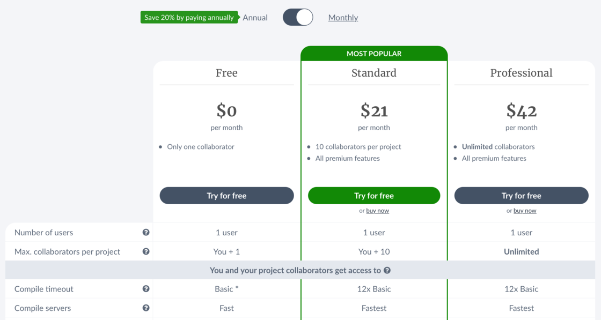
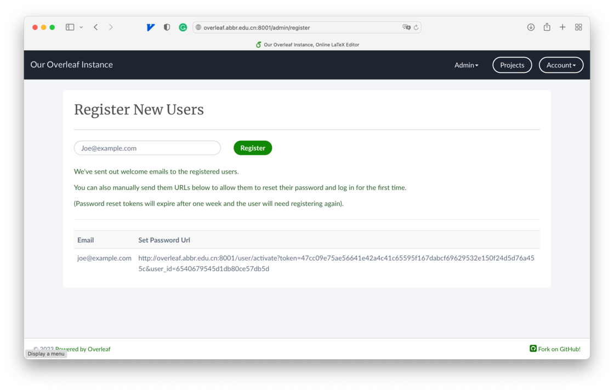

# App+1 | 搭建本地版 Latex 编辑器，为你的毕业论文排版「减减负」 - 少数派

**Matrix 首页推荐** 

[Matrix](https://sspai.com/matrix) 是少数派的写作社区，我们主张分享真实的产品体验，有实用价值的经验与思考。我们会不定期挑选 Matrix 最优质的文章，展示来自用户的最真实的体验和观点。

文章代表作者个人观点，少数派仅对标题和排版略作修改。

- - -

无论是本科、硕士、还是博士，论文撰写是每个学生在不同的学习阶段都会遇到的任务。目前主流的论文排版工具主要有两个阵营，Word 和 Latex，不同的工具都有其优缺点和适用范围。本篇文章记录我使用 Latex 撰写博士论文遇到的困难和解决方案，同时也会展开聊聊我为什么做出这样的选择，希望给还在观望 Latex 和使用 Latex 遇到困难的同学们一点启发。

## 为什么选择 Latex 作为毕业论文工具

在撰写毕业论文的时候，作者只有毕业生一个人，因此协同编辑文档的需求其实已经不复存在了。但是对于为什么仍然使用 Latex 作为排版工具，除了专业背景是最老生常谈的理由，还有两个重要的原因使我更坚定地选择 Latex 作为毕业论文的排版工具。


由 StableDiffusionXL 生成

第一点是沉没成本。在很多理工科的领域，毕业论文约等于文献综述+一系列的现有论文已成为一个事实标准。因此，原有论文的排版工具是什么，就成为了你转用其他排版工具的负担，也就是这里说的沉没成本。对我而言，由于前期大量地和导师一起用 Latex 合写文章，基本上我也不得不继续使用 Latex。

第二点是格式统一。不同的论文由于投稿的会议和期刊不同，他们排版的图表和段落格式都不一样。但是对于一份合格的毕业论文来说，在一份论文里至少要做到内部格式一致才会被学校图书馆接收，学生才能顺利毕业。对于一个编译型的语言，能够做到一份源代码+库文件生成一致的程序输出。对于 Latex 这个编译型语言来说，就是一份论文源码+模版文件生成一份格式一致的 PDF 输出。因此，对我而言，使用 Latex 能减少大量的编辑成本。

**关联阅读：**《[万字解析 | 感性与理性认识 LaTeX，学术论文排版的「行业标准」](https://sspai.com/post/78515)》

## 在线 Latex 工具无法满足编辑需求

[Overleaf](https://sspai.com/link?target=https%3A%2F%2Fwww.overleaf.com%2F) 已经成为了在线 Latex 编辑器的事实标准。它提供了大量的国内外出版商的模版供用户直接使用甚至一键投稿；它允许免费用户邀请其他人一起在线协同编辑同一份文档；它的编辑器提供了自动补全、格式化、实时编辑、实时预览等一系列方便的功能。

但是，由于编译这个步骤需要花费相对多的计算资源，因此对于免费版的 Overleaf 来说，它限制了单次编译的最长时间。尽管官方没有明确说明超时时间为多少，但从我的经验来看，大约编译一份 ACM 或 IEEE 的标准会议模板（约 12 页）就比较接近超时的上限了。



Overleaf.com 官方价格

对于我们想要编译的博士论文来说，其一般为几十页至上百页不等，远远超过 Overleaf 免费账户的限制。想要绕过这个限制，一般来说有如下几个方法：

-   选择性地只编译部分章节
-   花钱购买 Premium 版本
-   使用本地的 Latex 工具

减少待编译的数量毫无疑问是一个直接了当的解决办法，但是一般来说，不断往下撰写论文的内容的时候也需要偶尔回顾性地看看上文自己是怎么表述的，而部分编译打破了这一回顾的需求；购买 Premium 花钱解决问题诚然是一个万能的钞能力，21 美刀一个月的[价格](https://sspai.com/link?target=https%3A%2F%2Fwww.overleaf.com%2Fuser%2Fsubscription%2Fplans)，是否值当就看个人的心理预期了；最后，如果选项二不满足于你，那么使用本地 Latex 工具编译就变成了唯一选项。本地的 Latex 工具在集成性上总是略微逊色于 Overleaf 开箱即用的环境，且我们已经对 Overleaf 的编辑器有着熟练的使用经验，那么是否可以复刻一个运行在本地的 Overleaf 编辑器来绕过编译时长的限制呢？

## 自建 Overleaf 本地版本

好消息是，Overleaf 开源了自家的编辑器供用户私有部署，因此上述的问题似乎可以有效解决。但是这里还需要强调一点，开源代码和其官方部署版本不一定是一致的。在我们这个文章的术语里，Overleaf 团队仅开源了其编辑器的部分，其集成性环境 overleaf.com 版本并非是开源的。但是，overleaf.com 才是我们理想中 Latex 排版工具，因此本章节主要向大家介绍如何尽量复刻 overleaf.com 这个版本以满足我们理想的编辑体验。

### 安装 Docker 环境

Docker 是目前部署工作中最方便的工具之一。因此，我个人比较推荐使用 docker 做部署，且后面 Overleaf 提供的部署工具也是基于 docker 环境的。安装 docker 环境建议还是参考 docker 网站上官方的[安装方式](https://sspai.com/link?target=https%3A%2F%2Fdocs.docker.com%2Fengine%2Finstall%2F)，这里做一个简单的搬运。假设是在 Ubuntu 环境。

第一步需要添加 docker 的仓库到 apt 的列表中

```shell
# Add Docker's official GPG key:sudo apt-get update
sudo apt-get install ca-certificates curl gnupg
sudo install -m 0755 -d /etc/apt/keyrings
curl -fsSL https://download.docker.com/linux/ubuntu/gpg | sudo gpg --dearmor -o /etc/apt/keyrings/docker.gpg
sudo chmod a+r /etc/apt/keyrings/docker.gpg

# Add the repository to Apt sources:
echo \
  "deb [arch="$(dpkg --print-architecture)" signed-by=/etc/apt/keyrings/docker.gpg] https://download.docker.com/linux/ubuntu \
  "$(. /etc/os-release && echo "$VERSION_CODENAME")" stable" | \
  sudo tee /etc/apt/sources.list.d/docker.list > /dev/null
sudo apt-get update
```

第二步安装 docker 和 docker compose 最新版本到系统中，使用系统默认的包管理器方式安装能够很好地自动配置守护进程。

```shell
sudo apt-get install docker-ce docker-ce-cli containerd.io docker-buildx-plugin docker-compose-plugin
```

第三步，使用非管理员权限用户直接与 docker 守护进程通信，每次使用 docker 命令的时候不必记得加上 `sudo` 关键字，在 docker 安装文档里其实也有[说明](https://sspai.com/link?target=https%3A%2F%2Fdocs.docker.com%2Fengine%2Finstall%2Flinux-postinstall%2F)。个人来说比较推荐配置这一步，因为大部分教程默认没有 sudo 提权命令，配置非管理员权限用户能更好地避开一下不必要的麻烦。

```shell
sudo groupadd docker
sudo usermod -aG docker $USER
```

然后，退出你的终端或 SSH 链接，再重新打开终端或重连 SSH。这一步是为了让上述的权限配置在新的会话中生效。

第四步，测试一下 docker 环境是否能免提权直接运行。注意，该步骤需要必要且顺畅的网络连接，如无法成功下载镜像，则需要先解决网络问题再行尝试。

```ace-line
docker run hello-world
```

### 部署 Overleaf 容器

Overleaf 的编辑器在 Github 开源，主体代码在[主仓库](https://sspai.com/link?target=https%3A%2F%2Fgithub.com%2Foverleaf%2Foverleaf)中，但实际安装步骤非常冗长，Overleaf 官方还贴心地把脚本制作成一个[工具包](https://sspai.com/link?target=https%3A%2F%2Fgithub.com%2Foverleaf%2Ftoolkit%2F)给用户快捷安装。根据我的实际操作体验，我会展开讲讲其中比较关键的配置。

首先需要把工具包下载到本地环境中，这里需要 git 命令，可以通过系统包管理器以 git 为关键字安装。

```shell
git clone https://github.com/overleaf/toolkit.git ./overleaf-toolkit
```

切换目录到工具包中，然后初始化配置文件并查看，它会生成三份文件 `overleaf.rc`,`variables.env`和`version` .

```shell
cd ./overleaf-toolkit
./bin/init
ls config
```

三份配置文件中比较重要的配置项如下：

-   `overleaf.rc`
    -   SHARELATEX\_PORT 默认为 80 端口，但这个一般会被系统各大应用抢占，如果和你的有冲突，建议修改为 1024~65535 之间的一个数值。
-   `variables.env`
    -   SHARELATEX\_APP\_NAME 这个名字可以自定义，没什么特别的影响。
    -   SHARELATEX\_SITE\_URL 这个会影响生成用户激活链接里的 URL 的域名地址，建议根据自己的实际情况修改。注意，该域名必须能够被有效解析到服务器，否则请填写 ip 地址作为替代。
    -   SHARELATEX\_NAV\_TITLE 标签页里的标题，可以自定义。
    -   SHARELATEX\_HEADER\_IMAGE\_URL 为了和 overleaf.com 的区分，我把这个 URL 指向了我们学校的 logo
    -   SHARELATEX\_LEFT\_FOOTER 显示在注册界面的提示信息，由于没有实际的注册功能，因此需要显示一段文字说明管理员的联系方式，就是这个字段的配置内容。
-   `version`
    -   不需要更改。

然后就可以下载和启动容器了，toolkit 中提供了一键启动脚本。

```shell
./bin/up
```

该脚本可以将启动过程中的 log 输出到终端中方便诊断启动进程。一般情况下，网络条件良好的话是没有问题的。如果出现下载失败的情况，可以重新执行该命令。

待一切都正常运行起来后，可以按 `CTRL+C`将进程停止。然后使用另一个脚本将 Overleaf 容器在后台运行。

```shell
./bin/start
```

### 创建 Overleaf 实例账号

由于是自建 Overleaf，该实例下的账号与 overleaf.com 里的账号不互通，需要创建该实例自己的账号。

假设上文中的环境变量 SHARELATEX\_SITE\_URL 和 SHARELATEX\_PORT 分别为 overleaf.abbr.edu.cn 和 8001，那么使用浏览器打开 http://overleaf.abbr.edu.cn:8001/launchpad 即可注册本地账号。

值得注意的是，**第一个**在这个实例下注册的账号将会被设定为**唯一的管理员账号**（我没有找到哪里能够授予别的账号管理员权限的功能），因此请不要随便设置测试账号。

然后，使用浏览器打开 http://overleaf.abbr.edu.cn:8001/login 登录刚才注册的账号便可如同 overleaf.com 一样使用这个熟悉的编辑器了。



如果打算分享该实例与小伙伴一起用的话，需要创建 Overleaf 普通用户账号。登录了管理员账号后，可以在右上角找到 Admin 相关的功能，创建账号的功能就在这里。

创建账号需要两步，输入一个邮箱地址，系统会生成一个激活链接，自己将该激活链接发给别人完成激活，便可登入到系统中了。

### 增强 Overleaf 实例编译环境

如果这时候你把很多期刊和会议的 Latex 模板扔到这个自建的 Overleaf 实例中编译，你会发现大部分情况下都是无法编译成功的。上面说到，overleaf.com 是一个开箱即用的集成化环境，而这个实例中仅包含编辑器部分和基本的 Latex 编译器。而两者之间的差别主要在于以下几个部分：

-   Latex 宏包
-   系统字体
-   TikZ & Syntax highlighter 的依赖
-   TexLive 版本

手动把这几个部分的差别补足就是本文的重点。

**Latex 宏包。**Latex 对于学术排版比较好用的地方就是它对于学术内容的元素有着大量的宏包支持，比如伪代码等。宏包可以理解为 HTML/CSS 代码里的第三方库，只要调用相应的模板片段（接口）并填入自己的内容（参数），就能生成宏包原本定义好的漂亮的格式。

安装宏包并不困难，我们需要进入到 Overleaf 容器的内部，通过 TexLive 自带的包管理器 tlmgr 就能安装指定的宏包。但这里并不推荐单独安装缺少了宏包，因为 Latex 背后的宏包依赖层层嵌套且依赖关系不明确，最好的办法是用存储空间换省心，一次性把所有的宏包都安装了。

```shell
cd ./overleaf-toolkit
./bin/shell
tlmgr install scheme-full
```

Scheme-full 指代了 [CTAN](https://sspai.com/link?target=https%3A%2F%2Fctan.org%2Fpkg%2Flatex) 中所有的 Latex 宏包，大约需要至少 2G 的存储空间，整个下载过程非常的漫长，建议耐心等待。

**系统字体。**overleaf.com 中包含了[数百种字体](https://sspai.com/link?target=https%3A%2F%2Fwww.overleaf.com%2Flearn%2Flatex%2FQuestions%2FWhich_OTF_or_TTF_fonts_are_supported_via_fontspec%253F) 以供不同的模板无痛编译。但由于字体文件比较大且容易产生版权问题，因此需要我们自行安装。Overleaf 容器是以 Ubuntu 镜像为底层容器，因此字体的安装方法和 Ubuntu 一样，可以通过 Google 搜索很容易得到答案。

比如，我需要安装 Times New Roman 这个毕业论文格式中指定的字体，在 Windows 中自带但 Ubuntu 系统中没有。大部分常见的字体可以通过 Ubuntu 自带的 apt 包管理器安装，包的名称可以通过 Google 搜索获得。

```shell
cd ./overleaf-toolkit
./bin/shell
apt install ttf-mscorefonts-installer
```

对于少部分比较小众的字体，需要手动复制字体到 Overleaf 容器中，并刷新字体索引。

```shell
docker cp /path/to/your/font sharelatex:/usr/local/share/fonts/
cd ./overleaf-toolkit
./bin/shell
fc-cache -f -v
```

**TikZ & Syntax highlighter 的依赖。**TikZ 是 Latex 中画图的工具包，也是 Latex 强大的代表功能。TikZ 实际使用中会因为缺少 SVG 支持遇到一些错误，需要 inkscape 系统依赖。而 Syntax highlighter 是代码片段中高亮功能所需要的依赖，需要安装 python3-pygments 包。

```shell
cd ./overleaf-toolkit
./bin/shell
apt install inkscape python3-pygments
```

**(Optional) TexLive 版本。**还有一些编译错误是由于 TexLive 版本过低导致的，toolkit 一般会在 TexLive 新版本释放后更新容器的最新版本。toolkit 中自带了升级脚本，可以一键命令升级。

```shell
cd ./overleaf-toolkit
./bin/upgrade
```

## 实际体验感受

我测试了自己发表的多份文章，在自建平台上都可以顺利编译生成 PDF。在约 100 页毕业论文的编译任务上，从无缓存开始的编译时间只需要不到 10s，当然这也取决于你的服务器的性能，但自己本机的性能总是能比 overleaf.com 平台上共享的性能高不少。

容器化的安装部署能够将 Latex 杂乱的环境依赖都封印起来，不用污染本地环境，以及与 Overleaf 一致的编辑体验，是这个方案的优势所在。

有兴趣的同学不妨一试。

\> 下载 [少数派 2.0 客户端](https://sspai.com/page/client)、关注 [少数派公众号](https://sspai.com/s/J71e)，解锁全新阅读体验 📰

\> 实用、好用的 [正版软件](https://sspai.com/mall)，少数派为你呈现 🚀
