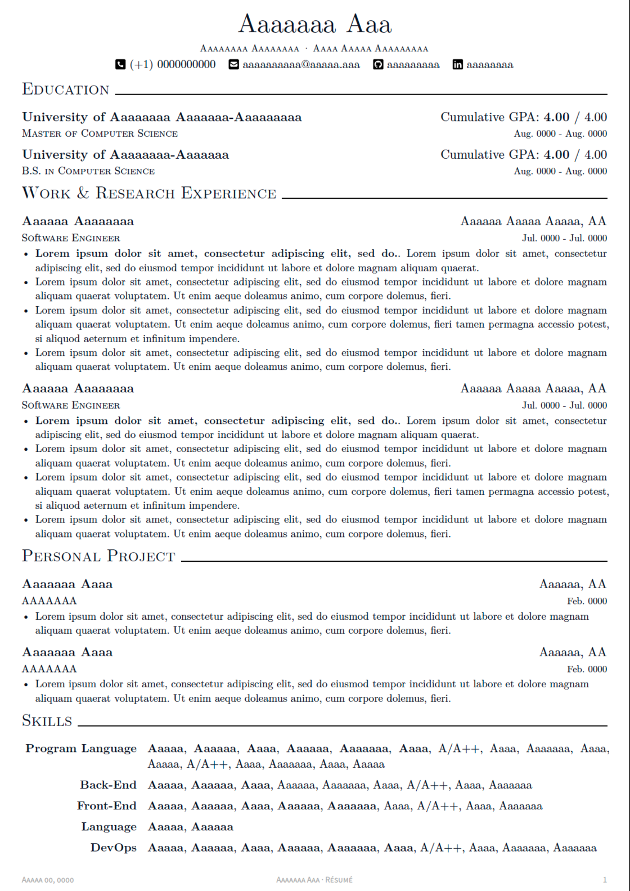
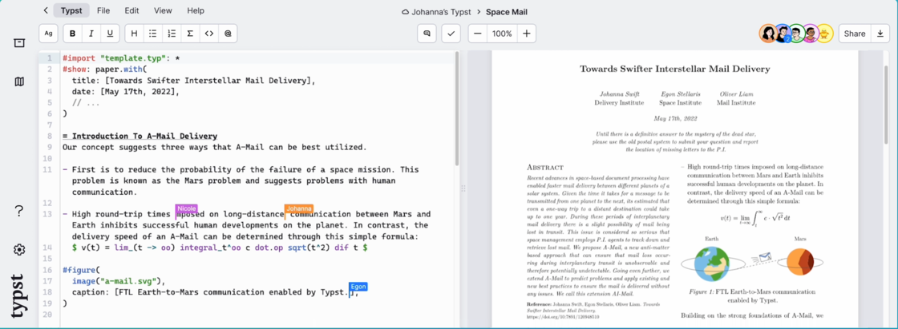
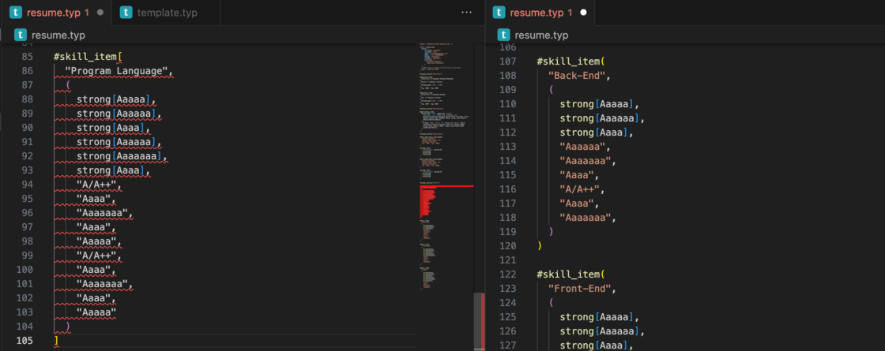

# App+1 | 易编辑、好管理：你的下一份简历可以试试 Typst - 少数派

制作一份优秀的简历是每一个毕业生都需要经历的过程，当你看到这种精美的简历，你会用什么工具复刻呢？


[来源](https://sspai.com/link?target=https%3A%2F%2Fgithub.com%2Fposquit0%2FAwesome-CV)

海投企业是目前比较实际的一个求职策略。随着就业市场的竞争日益激烈，为不同的企业定制一份相性更高的简历变得尤为重要。然而，对于许多同学来说，维护多份不同的简历可能是一项比较困难的任务。

在本篇文章中，我们主要围绕制作简历这一具体需求，聊聊现有简历制作方案中的问题，并介绍一款全新的工具来帮助大家更轻松地制作一份专业的简历。

## 现有简历制作方案的不足

### Word 简历

Word 或许是大家脑海中第一反应的通用排版工具，网络上也有很多 Word 制作的简历模板，比如 Microsoft 365 本身自带的创意媒体网站也提供了大量的精美模板。虽然在易用性上 Word 基本做到了领先，但是 Word 文档的编辑和版本管理却是一言难尽。


来源于 Microsoft 365 Create

**编辑对象不透明。**Word 直接通过 GUI 编辑器的按钮下达指令去调整样式渲染。但是选择对象进行编辑的时候往往无法正好选择到自己想要编辑的整体，让人们做修改的时候需要小心翼翼的，生怕错误改动一处地方后无法复原原来的格式。


比如上图中的第一个段落，在 Word 的布局中是两个文本对象，如果不仔细观察，一并选择且更改了，将很难恢复到它原来的样式。想要达成一个特定的样式，往往需要花费很多的精力。

**版本管理。**Word 的版本管理相对来说并不友好，最被人们熟知的大概是「初稿.docx」到「终稿打死也不改v3.docx」这一脍炙人口的案例。


网络图片中的一个真实案例

但是在海投的过程中，我们往往需要根据特定的企业，定制一份专用的简历版本。比如上文的 Skills，会根据企业的用人需求，润色和强调不同的技能点。在 Word 中往往需要保存多个版本，且很难在不同版本之中复用原有的文字。

### Latex 简历

Latex 是理工科的同学较为熟知的一款排版工具，其基于纯文本+编译的工作方式也很好地克服了 Word 的不足。但是，Latex 背后的编译过程较为复杂，严重拖慢了纯文本部分的编辑，降低了整体的体验。


GitHub 上一款 8000+ stars 的 Latex 简历模板

**较慢的编译速度。**Latex 需要在每次保存的时候重新编译生成 PDF 才能看到更改的内容在产出文件中的变化。想要经常看看最新的排版效果的话，每次都需要等待上几秒，但正是这断层的几秒，会打断思维的连续，使得整体的编辑输出不连贯。

**错综复杂的布局语法。**Latex 还有一点广为诟病的是它的语法非常晦涩难懂，也导致了使用上需要大量的宏包来封装才能稍微降低语法的复杂性。


上面的模板中使用了上图所示的布局语法，如果不翻阅大量的手册，实在是无法直观地理解每个字段想要表达的意思。

**难以解读的 debug 信息。**另一方面，在编译出错后，Latex 的错误信息总是让人摸不着头脑。Warning 信息充斥着大量的 Latex 模板，Raw logs 信息也难以阅读，更难以准确地定位错误的位置。


在这种情况下，大家往往需要一系列的 Trial and error 来试图解决问题。而这个方法，却又被上面提到的较慢的编译速度所严重影响，编辑体验就会一落千丈。

### 在线简历制作系统

网络上有很多制作简历的在线系统，能让你输入自己的经历，然后选择模板，生成一份精美的简历。但是，由于简历本身的属性包含了大量的个人信息，而这些在线系统往往都是不是大型公司出品，因此隐私安全成了这一类方案的最大顾虑。


## 使用 Typst 方案的优缺点

Typst 是一款专门为排版而生的新生代工具。它完全摒弃了现有系统的约束，着眼于现代化的功能与设计，成功地克服了传统方案上的一些不足之处。

在使用流程上，Typst 和 Latex 的实际使用流程非常相似，总结起来可以用三个步骤概括：

-   配置 Typst 的编辑环境
-   找一份 Typst 的简历模板
-   填充内容及修改模版

### 配置 Typst 的编辑环境

Typst 的环境配置比 Latex 简单了非常多，

**Online editor.** Typst 官方提供了一个在线编辑器 [typst.app](https://sspai.com/link?target=https%3A%2F%2Ftypst.app%2F) 供用户免费使用，等同于 Latex 在线编辑器 overleaf.com 的存在。在线编辑器需要上传资源和下载文件来交互，对于想要备份简历的同学来说不是很方便，但开箱即用的特点对于小白用户来说特别友好。

**All in vscode.** 把全部的开发依赖都交给 vscode 来管理是目前的一种流行开发范式。在 vscode 中需要下载两个插件：`Typst LSP` 用来给 vscode 提供智能提示，同时它也包含了 typst 的编译器；`vscode-pdf` 用来在 vscode 中实时预览生成的简历 PDF 文件。

**Advances.** 对于高级玩家来说，他们比较喜欢用自己顺手的编辑器。编辑器 + 编译器 + PDF 阅读器分离能够做到最大的自由度，且重用已有的软件。具体可以参考：https://github.com/typst/typst 自行配置。

### 找一份 Typst 的简历模板

站在巨人的肩膀上总是最便捷的方法达到一定的高度，我们制作简历也可以基于网上开源的模板进行修改，从一个布局设计精美的模板开始填入自己的内容。

在 GitHub 上有两个 awesome 项目收纳了很多 typst 的模板。比如[这个](https://sspai.com/link?target=https%3A%2F%2Fgithub.com%2Fqjcg%2Fawesome-typst)和[这个](https://sspai.com/link?target=https%3A%2F%2Fgithub.com%2Ftypst-cn%2Fawesome-typst-cn)。



[source](https://sspai.com/link?target=https%3A%2F%2Fgithub.com%2Fbamboovir%2Ftypst-resume-template)

使用 Typst 的模板非常简单，最直接的使用方法是从 GitHub 克隆下来整个仓库，通过 typst.app 或者 vscode 打开整个文件夹，然后就能编辑使用了。相比于 Latex 的模板，Typst 不用再安装各种隐藏的宏包，相当于下载了一份 Python 开源代码但不用再安装各种依赖的第三方库就能直接运行了。

### 填充内容及修改模版

在一份优秀的开源模板基础之上，填充内容对于用户来说一般不成问题。

```ace-line
#enum(tight: false, numbering: "[1]")[
  *Koelemay, L.A.*, Gold, K.R. & Ziurys, L.M. Phosphorus-bearing molecules PO and PN at the edge of the Galaxy. Nature 623, 292–295 (2023). https://doi.org/10.1038/s41586-023-06616-1
][
  Richman, E.B., *Ticea, N.*, Allen, W.E. et al. Neural landscape diffusion resolves conflicts between needs across time. Nature (2023). https://doi.org/10.1038/s41586-023-06715-z
]
```

可以看到，Typst 的语法非常简单，`#enum` 写一个列表，任意数量的 `[]` 表示列表元素，甚至能通过 `"[1]"` 的用户输入格式自动推导目标样式，同时也有类似于 markdown 的 `**` 的简洁加粗语法。未来可期。


Nature 上随便找的两篇文章

## Typst 的体验分享

Typst 让我看到了很多的闪光点，很多实用的功能大大提高了我的实际体验。

**跨平台的编译器。**Typst 主要使用 Rust 开发，能够生成各大平台的可执行程序，然后被下载到本地离线使用，从而保证了隐私安全。另一方面，Rust 以其优秀的内存管理和运行速度所闻名，得益于此，Typst 的编译速度非常快，同时也给它带来了第二个优点。

**所见即所得的编辑体验。**Typst 能够做到如同 Markdown 一样的所见即所得编辑体验，得益于此 Trial and error 的过程也会被大幅度得缩短，因此从编辑体验上来讲算是大幅度进步了。



来源官网：左右双栏的所见即所得

**纯文本的文档。**Typst 的排版也是基于纯文本编译生成 PDF 的方式工作的，就像是我们熟知的 Markdown 排版工具一样，用其特定的文本语法来约束排版方式，最终生成稳定的排版效果。

而纯文本的方式正好克服了上述 Word 的两大弊端，可以通过注释的方式临时地将一些内容隐藏掉从而生成一份简历版本，也可以通过 Git 工具对文本做差分和版本管理。

**相对简洁的语法。**由于 Typst 摒弃了现有 Tex 系统的排版规则，重新设计了一套全新的规则，使得它可以从一个新的起点来规避一些已知的排版难题，下图就是一个直观的对比两者的语法差异。但不可否认的是，新的语法也带来了新的学习成本。


**相对友好的错误提示。**相比 Latex 让人比较困惑的错误提示，Typst 能够诊断出具体的错误位置，错误信息相比 Latex 的 raw logs 来说也更符合贴近真实的错误情况。Typst 有 Language Server 的支持，能够在实际编译前就诊断出潜在的错误。



注意观察，这里仅仅只错了一个括号的差异

总结一下，Typst 作为新生代排版工具，我认为未来必然会有一席之地。软件体积小巧，多平台支持，高效的编译速度，无须第三方包的设计，是它克服了同行前辈的不足后所闪光的优点。不足之处在于，Typst 的语法仍然需要一定的学习成本，或许未来会有更好的编辑器提供图形化的排版设定。

对于使用场景，我认为目前对于非出版类的写作和排版需求都可以胜任，甚至做得更好。比如，简历制作，开题报告，基金申请等。但是，对于需要出版的文章，比如学术文章，书籍等，我认为还需要经历时间的沉淀。根据我的观察，不少出版商（如计算机领域下的 IEEE 和 ACM）都还没有在他们的投稿指引网站上提供他们官方的 Typst 模板。相信未来官方支持后，网络上 Q&A 社区的问题和解决方案也会变得更丰富。

如果你厌倦了 Word 的低效版本管理或 Latex 那恼人的重复编译，这个玩意又成功了引起了你兴趣，希望进一步了解的话，你可以看看下面的资料入手体验。

**关联阅读：**

-   [Typst 官网](https://sspai.com/link?target=https%3A%2F%2Ftypst.app%2Fhome)
-   [Typst 参考手册](https://sspai.com/link?target=https%3A%2F%2Ftypst.app%2Fdocs%2F)
-   [Typst 模板](https://sspai.com/link?target=https%3A%2F%2Fgithub.com%2Fqjcg%2Fawesome-typst)

\> 关注 [少数派公众号](https://sspai.com/s/J71e)，解锁全新阅读体验 📰

\> 实用、好用的 [正版软件](https://sspai.com/mall)，少数派为你呈现 🚀
