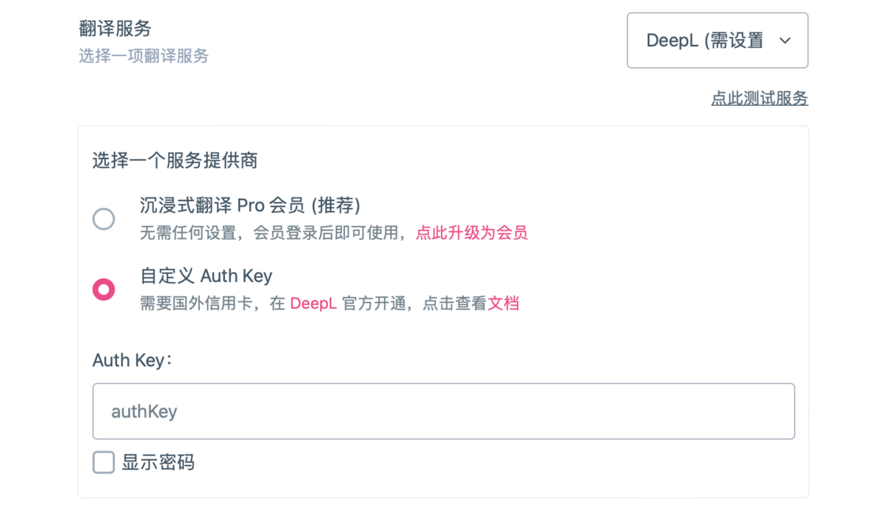
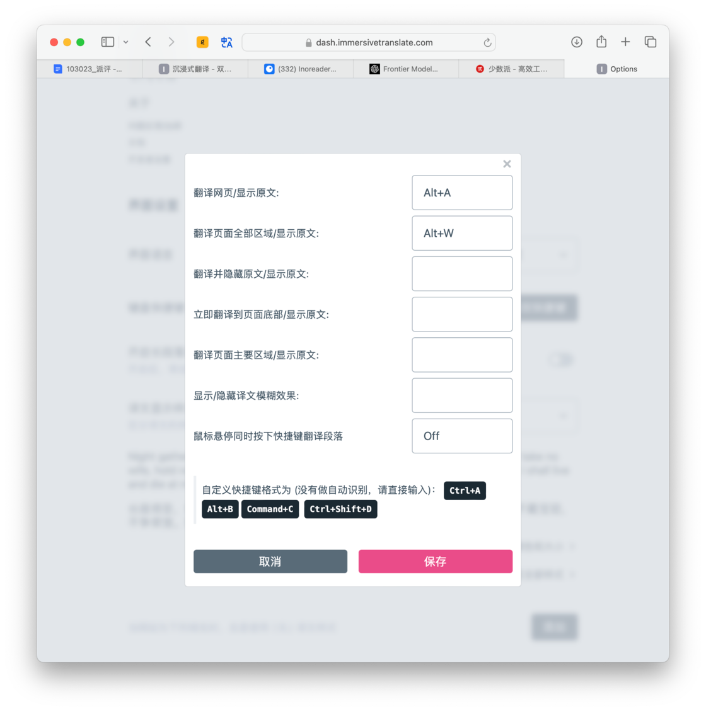
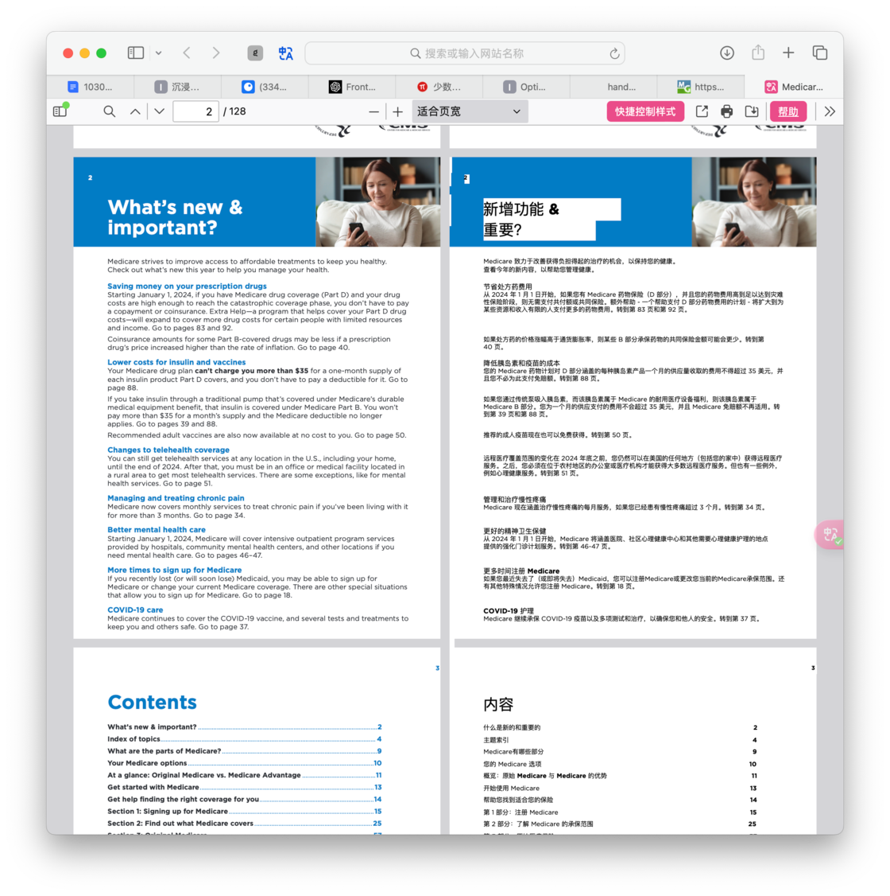
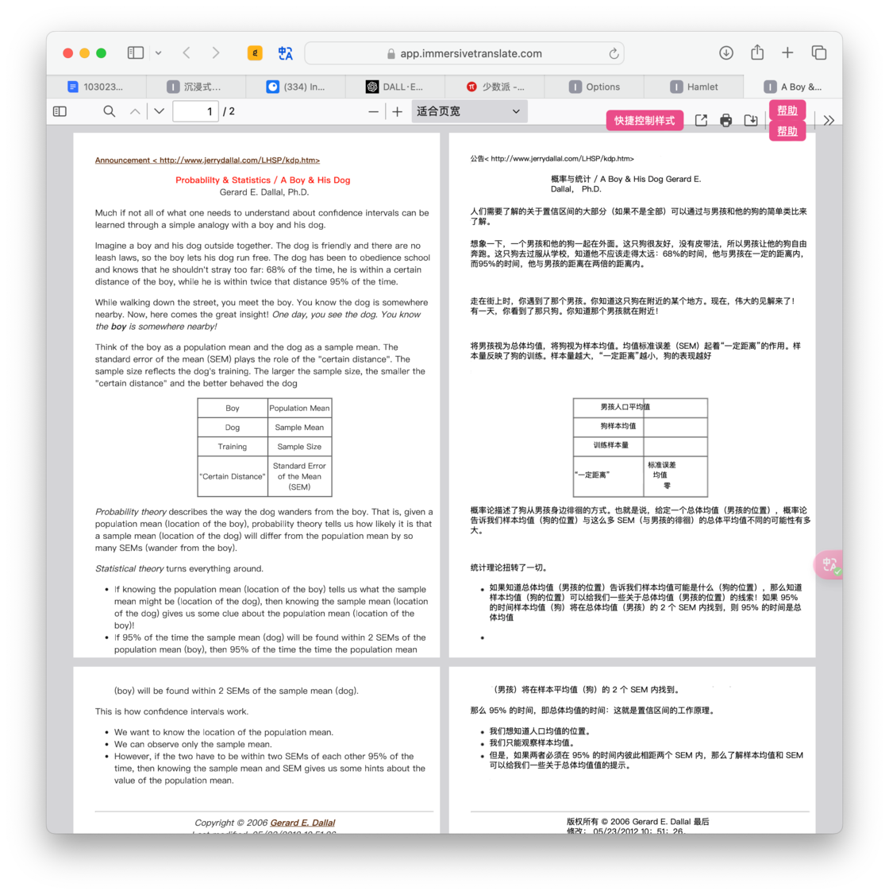
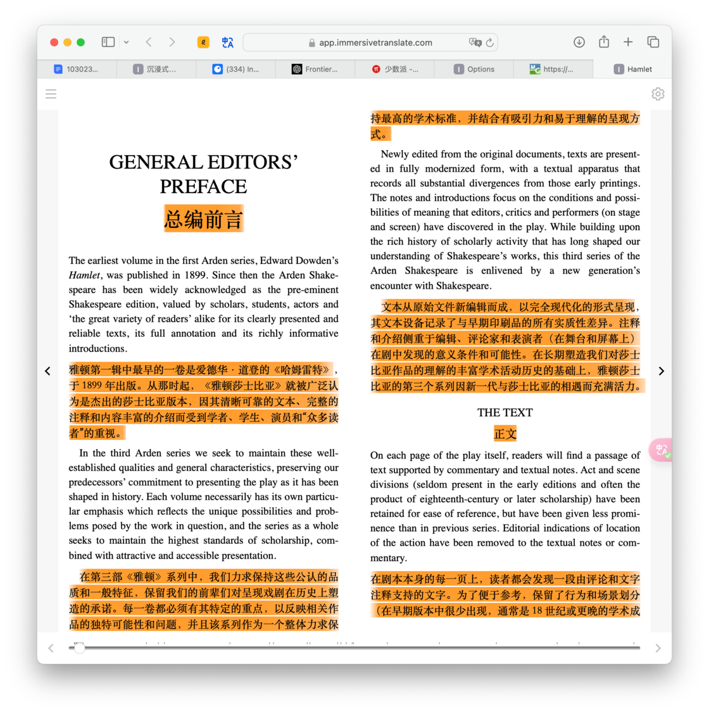
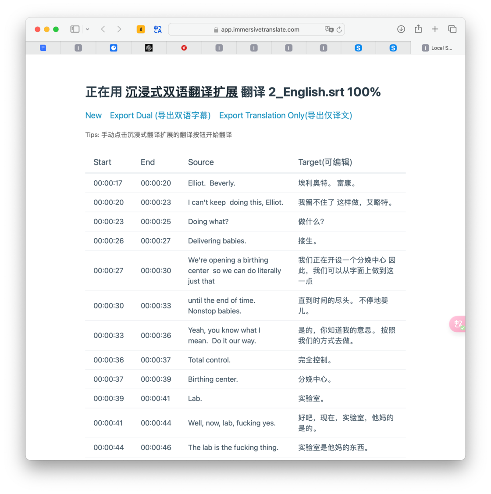

# App+1 | 给你不受语言限制、无需繁琐操作的冲浪体验：沉浸式翻译 - 少数派

关于翻译工具，我想大多人都已经非常熟悉，前有 Google Translate 这样的常青树，后有彩云小译这样的特定场景实用工具，不过这一类工具在很长一段时间内都没有什么突破性的发展。直到近年来大模型技术的成熟和落地，ChatGPT 的出世直接带动了全世界在大模型技术上的技术投入以及应用井喷，翻译作为其中最典型的应用场景之一，也进入了新的时代。翻译不再是机械性的字对字或者词对词，而是会根据语境和上下文进行更加恰当的表达。

在这当中，今年颇受浏览器扩展用户爱好者好评的[沉浸式翻译](https://sspai.com/link?target=https%3A%2F%2Fimmersivetranslate.com%2F)，则是第一款提供双语对照式翻译的浏览器插件。虽然后续诸如彩云小译、腾讯交互式翻译、欧陆词典等都提供了类似的工具，沉浸式翻译在陆续整合众多优秀第三方翻译服务并以网页翻译为基础上拓展出更多用法之后，目前已覆盖绝大多数互联网冲浪者们的日常使用场景，真正做到了好用、易用、常用。

## 多服务，多平台，多场景

打开沉浸式翻译的官网，我们就可以看到它的多样性和包容性。  
首先，沉浸式翻译提供了多个主流浏览器的插件，包括了 Edge、Chrome、Firefox、Safari 等桌面平台以及 iOS、Android 等移动平台。如果你想在更小众的浏览器上使用沉浸式翻译，那么你还可以通过油猴脚本、Zip 安装包或者安卓浏览器 apk 来进行安装插件。

其次，沉浸式翻译支持了多达 12 种翻译服务。目前，我们可以直接免费使用微软翻译、谷歌翻译、腾讯交互翻译，其它诸如 DeepL、OpenAI、百度翻译、彩云小译等服务需要在设置中添加 API 密钥等操作后方可正常调用。

如果你没有国外信用卡，不方便订阅 DeepL 或者 OpenAI 服务，那么沉浸式翻译提供了一个 Pro 会员，包年的价格为703.8 元，其中包含了不受限制、无需配置的 DeepL 和 OpenAI 翻译服务，另外还有优先的电子邮件支持和多设备同步配置。

最后，我们来看一看沉浸式翻译的多种使用场景。

对大多数人来说，翻译插件最常用的场景就是翻译网页上的外语。这个功能多年前我们在彩云小译等插件上就已经见过了，这么多年过去了，沉浸式翻译在易用性上做得更好自然也不奇怪。以 Safari 浏览器为例，安装并启用沉浸式翻译插件后，除了浏览器顶端地址栏旁边的插件按钮，沉浸式翻译还在网页右侧提供了一个悬浮球，点击这个悬浮球就可以按照预设的语言偏好和翻译服务进行一键翻译，并按照原文和翻译单独成段、互相对照的方式呈现。

除了悬浮球，我们还可以为沉浸式翻译设置键盘快捷键，通过快键键来更快地调用翻译服务。在设置中，我们为不同的翻译功能单独设置键盘快捷键，在不同的场景下进行快速的调用。

为了让翻译调用更快，沉浸式翻译提供了一个鼠标悬停翻译的功能。点击地址栏旁边的沉浸式翻译按钮，在鼠标悬停处选择「直接翻译该段」，这样一来我只需把鼠标放到原文处，就可以对当前段落进行翻译，兼顾了快速和精准定位两个优点。如果你担心这个功能会误触，还可以在设置处将鼠标悬停改为「+Ctrl/Shift/Alt 翻译/还原 该段」。

值得一提的是，沉浸式翻译还可以在设置中为译文调整显示样式，包含了虚线下划线、实线边框、高亮、马克笔等丰富多样的选项，同时我们还可以为译文自定义背景颜色和文字颜色，或者更改字体的缩放比例。如果你想要为不同的网页设置不同的显示样式，还可以为这些样式添加白名单。

沉浸式翻译的第二个使用场景是社交平台。在 X（原 Twitter）、Facebook、TikTok 等海外社交平台上，我们也可以使用沉浸式翻译来进行双语翻译，轻松地获取资讯或者与外国友人进行交流沟通。

沉浸式翻译的第三个使用场景是通讯工具。虽然大多数即时通讯工具都有自己的客户端，不过像 Telegram、Discord 等平台仍然提供了网页版，因此我们也可以使用沉浸式翻译在这些通讯工具中进行双语翻译，大大提高了互动的效率。

沉浸式翻译的第四个使用场景是 PDF 阅读。目前，Edge、Safari 等浏览器都提供了 PDF 预览的功能，那么我们就可以在浏览器中直接对 PDF 进行翻译了。沉浸式翻译在浏览器中对 PDF 的处理与其他场景有点不同，在启用翻译后它会弹出一个新的窗口，在这个窗口中沉浸式翻译会在每一页 PDF 后新建一个页面，用这个页面单独来显示译文，同时保留原文的排版，左右对比非常直观方便。

## 能力圈不止浏览器

沉浸式翻译最让我印象深刻的不是它在浏览器上的表现，而是它突破了浏览器的限制，让本地文件也可以享受到双语翻译的便利性。

前面我们已经看过了沉浸式翻译可以直接翻译网页上的 PDF 文件，如果你还想翻译本地的 PDF 文件，那么需要先点击浏览器地址栏旁边的插件按钮，然后通过右下角的「更多」按钮来启用「翻译本地 PDF 文件」功能。在弹出的新标签页中，将本地的 PDF 文件拖进来，沉浸式翻译就会开始进行双语翻译，并且通过单页对比的方式呈现。

除了 PDF 文件，我们还可以通过沉浸式翻译来帮助自己阅读外文书籍。目前，沉浸式翻译支持导入 epub、mobi、fb2 和 fbz 格式，导入后沉浸式翻译就会在电子书中将外文逐段进行翻译，阅读体验非常好，就像在读出版社制作的双语书籍一样。

如果你不喜欢通过浏览器进行阅读，那么沉浸式翻译还可以帮助你制作双语书籍，导出到本地后可以通过 Books、Calibre 等软件或者 Kindle 等硬件进行阅读或者阅读。在「更多」中启用「制作双语 EPUB 电子书」后，将本地的 EPUB 文件拖入，通过悬浮球或者键盘快捷键开始翻译，待翻译完成后点击「导出」按钮，就可以将翻译完的电子书导出到本地。

对于影视爱好者来说，沉浸式翻译也是一个非常实用的工具。在「更多」中，沉浸式翻译提供了一个「翻译本地字幕文件」的功能。将外语字幕导入后，沉浸式翻译会按照时间戳来展示原字幕，在翻译后又会按照时间戳来展示对应的字幕。在导出方面，沉浸式翻译贴心地提供了导出双语字幕和导出仅译文两种选项，方便大家进行观影或者学习。

## 实用功能，深藏不露

沉浸式翻译还有两个隐藏的比较深的功能，其中一个就是支持 YouTube 视频的实时字幕翻译。打开沉浸式翻译的设置界面，然后在「视频字幕」中启用「自动使用双语字幕」。这样一来，当我们在 YouTube 上观看视频时，如果上传者没有提供中文字幕，那就可以通过沉浸式翻译来将外文字幕进行实时翻译，在观看视频时获得更好的体验。值得一提的是，不管是视频上传者手动上传的字幕还是 YouTube 自动生成的字幕，沉浸式翻译都可以很好地支持，整个体验非常流畅。

另外，沉浸式翻译的设置界面中还有一个功能叫「输入框增强」。启用这个功能后，我们可以在浏览器的任意一处输入框中输入文本，然后快速连按三次空格键，沉浸式翻译就可以将我们在输入框中输入的文本立刻翻译为我们指定的目标语言。这个功能在使用搜索引擎、互动聊天等场景下非常实用。在沉浸式翻译的设置界面中，我们可以为「输入框增强」功能设置默认目标语言、翻译服务、分割字符、触发字符、间隔时间、网站黑名单等，充分考虑了每一个使用者的使用习惯。

## 总结

作为一款基本免费的翻译工具，沉浸式翻译提供了非常丰富的功能，包括了网页翻译、PDF 翻译、EPUB 翻译、字幕翻译以及相应的导出功能，同时通过悬浮球、键盘快捷键、鼠标悬浮等方式来提高翻译的效率，让优秀的功能不被麻烦的调用方式拖累。

同时，如果你还想获得更多强大的服务，既可以直接购买沉浸式翻译自己的 Pro 会员，也可以自由购买 DeepL、OpenAI 等第三方的服务，自由度很高。

\> 关注 [少数派公众号](https://sspai.com/s/J71e)，解锁全新阅读体验 📰

\> 实用、好用的 [正版软件](https://sspai.com/mall)，少数派为你呈现 🚀
