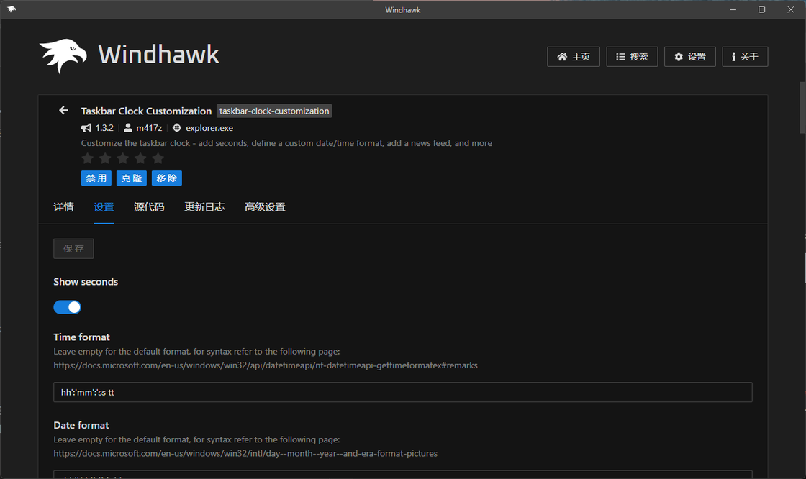
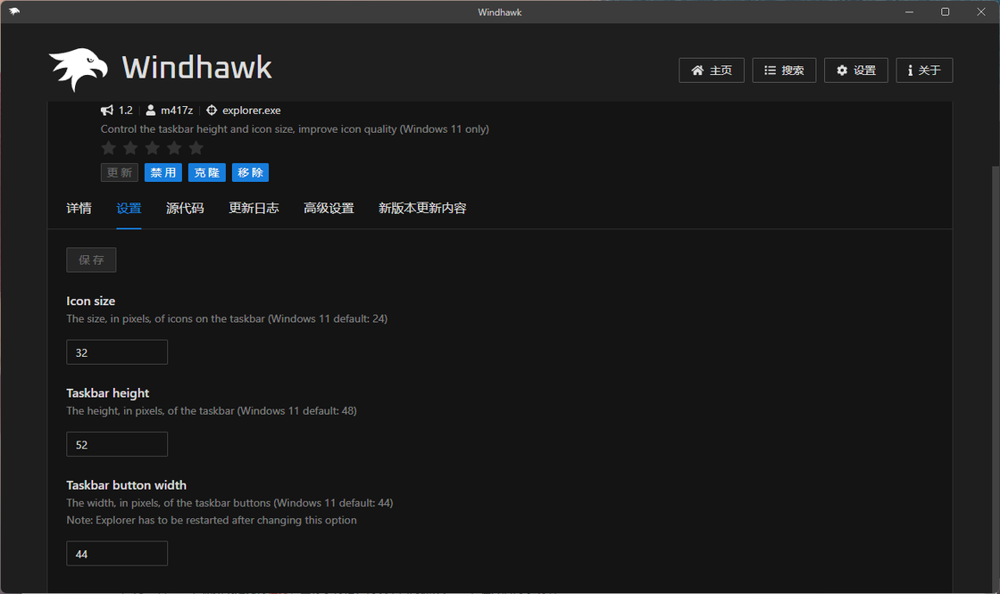

# App+1 | 给你的 Windows 系统打上 mod：Windhawk - 少数派

2021 年年底，曾经说过 Windows 10 是最后一款 Windows 的微软再一次食言——或许是为了进一步推动新硬件的销售，也或许是想摆脱经过妥协的 Windows 10，这一年微软推出了采用全新设计的 Windows 11 系统，虽然从视觉上以及交互上更像是一款「现代」操作系统，但也打破了很多用户以往的 Windows 操作习惯，比如开始菜单、任务栏、文件资源管理器等有着相当大调整。对于习惯旧版 Windows 系统的用户而言也确实较难适应。

而经过近两年三个大版本的更新，虽然微软不断的调整和优化 Windows 11 的设计，但依旧存在那些不那么趁手的设计，与其等着微软官方对设计进行调整，还有没有什么办法可以让我们自行解决呢？

## Windows 的模组商店

相比于直接使用第三方的开始菜单替换系统原生开始菜单这样的大工程，我们也可以通过给系统打上「自定义模组」这样的小手术来实现系统功能自定义，让你的 Windows 操作系统更符合你自己的操作习惯。

Windhawk 就是这样的一款 Windows 系统自定义功能模组平台，和很多游戏通过模组的方式扩展游戏玩法和内容一样，你可以在 Windhawk 找到很多开发者提供了系统增强模组，下载应用后就可以实现系统组件不能实现的新功能。

Windhawk 模组都是开发者通过其开发守则开发并自主提交。之所以能实现对系统的「修改」，是通过将相关的 DLL 全局注入进程中，从而实现对系统功能的控制。并且和修改系统组件有所不同的是，Windhawk 的操作均为可逆的，实际并没有对系统核心文件进行修改。更详细的内容可以查看作者博客。[参考来源](https://sspai.com/link?target=https%3A%2F%2Fm417z.com%2FImplementing-Global-Injection-and-Hooking-in-Windows%2F)

打开 Windhawk 之后我们就可以看到一些热门特色模组，有些是和系统本身原生组件有关，而有些模组则主要是功能增强。如果你在首页的特色 Mod 中没看到自己喜欢的模组，还可以点击更多 Mods 或者搜索来设置模组。

比如我希望 Windows 11 的状态栏可以像之前 Windows 7 那样，支持在任务栏上显示正在运行的程序的文本标签而不是简单的图标叠放，那么就选中「Taskbar Labels for Windows 11」的详情页面，然后点击上方的「安装」按钮进行安装，Windhawk 会在下载模组后，将相关的 mod 模块信息注入到系统相关的组件中，当模组页面显示的按钮变成「禁用」「克隆」以及「移除」之后就表示模组安装成功了。

你可以**注销系统再登录**来让配置生效，再次打开应用时就会发现，任务栏的软件图标右侧会出现相关的文本标签，这种方式也让应用在任务栏中变得更为醒目。

## 模组推荐

下面我推荐几个我正在用的模组，这些模组或多或少都会让你觉得系统操作会更顺手。

### Taskbar Clock Customization

一直觉得 Windows 11 的任务栏最右侧的时钟显示内容实在太过单一，那么 Taskbar Clock Customization 这个模组可能会让这个位置的信息呈现变得更为丰富。

你可以根据相关的规则来对时钟呈现的信息做出调整，在设置里面你可以通过字段信息来定制你的时间样式，比如呈现时区、周数等等。甚至在 Windows 11 22H2 以上的版本你还可以更改文本的样式，比如说字体、颜色以及大小等等。

但不要乱用 Comic Sans

### Taskbar Volume Control

简单来说，就是可以将鼠标停留在任务栏时，直接滑动滚轮就可以调节音量，不必限制悬停在音量图标上。

此外，这个模组也支持点击打开音量控件后滑动滚轮进行调节，尤其是在 Windows 11 改成了横向的音量调节控件后，这样控制方式也很像以前在 Windows 7 上调节音量的使用习惯。

### Chrome/Edge scroll tabs with mouse wheel

 顾名思义，就是可以当鼠标停留在标签页栏时，可以通过滑动鼠标滚轮来进行标签页的切换。

这个功能和使用键盘快捷键进行切换可以说是各有利弊，如果你打开的标签页多，那么使用滚轮切换可以更为快速，但如果打开的标签页不多，那么键盘快捷键切换反而更为快。好处就是一步解决多个浏览器，不用分别装扩展。

### Show all apps by default in start menu

原先的 Windows 11 开始菜单打开时会先显示已固定和推荐的项目，要想打开某个应用还要再点击「全部应用」，通过这个模块可以让 Windows 11 开始菜单直接显示「所有应用」的列表。

### Classic Explorer navigation bar

在 Windows 11 Moments 4 之后系统引入了一个新的资源管理器的导航栏效果，但比起以往的导航栏要显得层级过多，实际上使用并不那么方便。而这个模组就是让你一键还原回之前的文件资源管理器的导航栏，至少你可以回到熟悉的页面效果。

另外除了还原会原来有多标签页的文件资源管理器导航栏样式之外，你也可以还原会类似以前 Windows 10 那样的不支持多标签页的样式（个人倒是更熟悉以前 Windows 10 的文件资源管理器的样式）。

### Taskbar height and icon size

Windows 11 还有个比较烦人的地方在于他给予自定义外观的选择太少了。在以前的 Windows 中我们可以对任务栏高度、图标大小等进行充分的自定义。但现在这个可以扩展的内容都没有了，以至于当我们想要调整图标大小时显得无所适从。

而 Taskbar height and icon size 则可以让你充分自定义你的任务栏，比如你可以设置任务栏高度、图标的大小等等，你也可以通过这个模组间接的实现类似 Windows 10 的小任务栏按钮效果。

## 结语

随着 Windows 的更新与功能变化，模组的可用性也在不时改变。除了上面我提到的 mod 之外，有一部分上架的应用模组功能就在最新系统中被系统原生支持。比如在 Windows 11 23H2，系统的原生画图程序以及笔记本程序都已经支持深色主题，任务栏也支持了显示标签名称。

不过总的来说，Windhawk 通过这种近乎无损的方式来增强系统功能，对于不想当 Windows 新版本试验田的用户还是相当友好的，也可以让新系统用户继续延续之前的 Windows 使用习惯。你可以在 [Windhawk 官网下载](https://sspai.com/link?target=https%3A%2F%2Fwindhawk.net%2F)并安装这款系统「模块管理器」，无论是管理器本身还是 mod 模块均可免费下载使用。

另外需要说明的是，虽然从理论上 Windhawk 采用了非破坏性的方式对系统功能进行了调整，但由于 Windhawk 本身更像是一个 Mod 市场，因此并不能保证不同的 Mod 模块之间是否存在冲突，因此这里我的建议还是根据自己的使用需要先安装少量的 mod，当遇到模块之间存在冲突后及时卸载模块进行还原。

\> 关注 [少数派公众号](https://sspai.com/s/J71e)，解锁全新阅读体验 📰

\> 实用、好用的 [正版软件](https://sspai.com/mall)，少数派为你呈现 🚀
