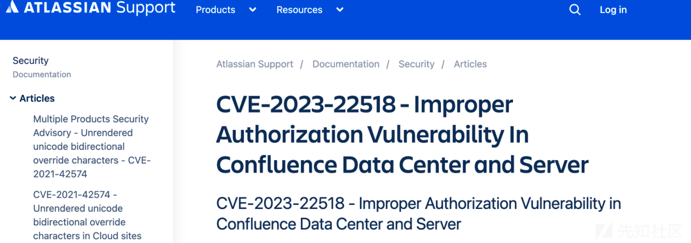

# Atlassian Confluence 远程代码执行漏洞分析(CVE-2023-22518) - 先知社区

Atlassian Confluence 远程代码执行漏洞分析(CVE-2023-22518)

* * *

# CVE-2023-22518漏洞分析

## 1、Confluence8.6.0 环境搭建

*   这个章节是环境搭建部分, 讲解了如何把数据库和confluence放在同一docker下进行搭建.
*   它也可以用于其他版本的confluence搭建.
*   如果已经搭建完成, 可以直接跳过该部分.

### 1.1、docker容器搭建

*   创建目录myconfluence, 并将环境配置的压缩包解压至其目录下.
    
*   在目录下创建一个data的文件夹.
    
*   `docker-compose -f docker-compose-confluence.yml up -d`即可(如果想复现其他版本,更改yml文件中的image即可)
    
*   进入docker, 进行初始化配置,输入以下命令即可:
    

```plain
apt-get update; apt-get install -y net-tools vim mysql-server netcat tcpdump
```

### 1.2、Confluence激活序列号

#### 1.1.1、方法1

*   通过官方免费获取:  
    [](https://xzfile.aliyuncs.com/media/upload/picture/20231103011525-69ad4654-79a3-1.png)

#### 1.1.2、方法2

*   访问8090端口, 复制ServerID:  
    [](https://xzfile.aliyuncs.com/media/upload/picture/20231103011606-8202191e-79a3-1.png)
    
*   进入docker中断, 执行以下命令:
    

```plain
cd /var/atlassian/ ;
java -jar atlassian-agent.jar -d -m test@test.com -n BAT -p 'conf' -o http://localhost:8090 -s <ServerID>
```

[](https://xzfile.aliyuncs.com/media/upload/picture/20231103011711-a8ba8942-79a3-1.png)

*   将License code 复制到confluence中
*   最后无脑下一步, 直到配置数据库环节即可.

### 1.3、配置数据库

#### 1.3.1、容器配置部分

```plain
docker cp ./my.cnf confluence:/etc/mysql/my.cnf
```

[](https://xzfile.aliyuncs.com/media/upload/picture/20231103011750-c040e8b8-79a3-1.png)

*   在mysql终端中, 输入以下SQL语句:

```plain
CREATE DATABASE confdb CHARACTER SET utf8mb4 COLLATE utf8mb4_bin;
CREATE USER 'testuser'@'%' IDENTIFIED BY 'test123';
GRANT ALL PRIVILEGES ON confluence.* TO 'testuser'@'%';
GRANT ALL PRIVILEGES ON *.* TO 'testuser'@'%';
FLUSH PRIVILEGES;
```

*   重启mysql服务:

```plain
service mysql restart
```

*   运行容器自动启动mysql的方法: 由于安装的镜像基于confluence官方, 所以把mysql做成一个自启动有点麻烦, 这里用了一个投机取巧的方法, 修改`/entrypoint.py`文件, 加入以下内容:

```plain
import os;os.system("service mysql start")
```

*   这样重启容器的时候mysql就可以自动运行.

#### 1.3.2、界面配置部分

*   在1.2中, 配置过序列号后,来到了数据库配置的界面
    
*   在之前已经创建好了数据库和连接的用户名密码, 这里直接按照下图输入, 测试连接即可:  
    [](https://xzfile.aliyuncs.com/media/upload/picture/20231103011933-fd5f717e-79a3-1.png)
    
*   如果出现连接失败, 请检查 “1.3.1步骤”是否正确配置.
    

### 1.4、创建管理员账号

*   因为我们是做漏洞复现, 所以创建一个示例站即可:

[](https://xzfile.aliyuncs.com/media/upload/picture/20231103012007-11dbc652-79a4-1.png)  
[](https://xzfile.aliyuncs.com/media/upload/picture/20231103012023-1b962f48-79a4-1.png)

*   输入账号密码,下一步即可:

[](https://xzfile.aliyuncs.com/media/upload/picture/20231103012051-2c3ddf80-79a4-1.png)

## 2、漏洞分析

### 2.1、diff更新

*   通过官方发布的公告,可以知道是权限分配不当的问题:  
    [](https://xzfile.aliyuncs.com/media/upload/picture/20231103012129-426e790e-79a4-1.png)

通过比较8.6.1(已经修复的版本)的com.atlassian.confluence\_confluence-8.6.1.jar, 发现大部分的action都加入了AdminOnly:  
[](https://xzfile.aliyuncs.com/media/upload/picture/20231103012230-674b2542-79a4-1.png)

*   由此可以猜测可能是某些action可以未授权访问,导致的该漏洞的产生
    
*   Confluence是基于Struct2框架开发的一个项目. 在查看Confluence的`struct.xml`配置文件时, 我们可以看到它主要使用了一种称为二级哈希表的数据结构来进行路由查找. 由于这种使用二级哈希表的一些特性, 导致了问题的产生
    
*   比如有一个哈希表, 它用来存储不同的namespace和与之相关联的action. 哈希表中的每个键都是一个namespace, 而对应的值是该namespace下的所有action, 这里有个细节, **hash表中除了存储当前package的action之外, 还从父级包中通过extend的方法继承了他们的action!**
    
*   换句话说, 当我们在当前 `<package>` 中定义一个action时, 它会被添加到哈希表中. 然而, 如果我们在当前 `<package>` 中使用了 `extends` 属性, 并指定了一个父级包, 那么我们也会继承父级包中的所有action, 并将它们一起添加到哈希表中.
    

[](https://xzfile.aliyuncs.com/media/upload/picture/20231103012315-81af05d4-79a4-1.png)

*   这里可以看到如果我们请求一个`/json/xxxaction`实际上会路由到`/admin/xxxaction`, 或者路由到`/setup/xxxaction` ......

*   到后边就卡住了, 因为平时分析二进制多一些, 没审过java, 也不太会调试, 不知道调用哪些方法可以未授权.

### 2.2、抓流量

*   某天看群的时候发现了长亭的大佬已经发布的有漏洞检测工具了(实际上在之前就看到过了,go编译的工具很难分析检测了什么), 在睡觉的时候突然看到了有朋友在问xpoc, 就想着xpoc上是不是已经有poc了
*   果然是有的..  
    [](https://xzfile.aliyuncs.com/media/upload/picture/20231103012433-b0860452-79a4-1.png)
    
*   通过下载该bin文件, 调用它进行检测:  
    [](https://xzfile.aliyuncs.com/media/upload/picture/20231103014753-f2de75d4-79a7-1.png)
    

*   同时在docker里安装一个tcpdump进行抓包:  
    `tcpdump port 8090 -w /tmp/p1.pcap`
    
*   拿到了流量包, 对这个流量包进行分析:  
    [](https://xzfile.aliyuncs.com/media/upload/picture/20231103012748-24a78ef0-79a5-1.png)
    
*   发现访问了`/json/setup-restore.action` 这个请求, 并且有一个`X-Atlassian-Token: no-check`的请求头
    
*   重放一下,成功访问:  
    [](https://xzfile.aliyuncs.com/media/upload/picture/20231103012806-2f3daca0-79a5-1.png)
    
*   他本来应该是`/setup/setup-restore.action`这个路由的, 这个页面直接访问, 则是已经安装好的界面  
    [](https://xzfile.aliyuncs.com/media/upload/picture/20231103012838-42578b76-79a5-1.png)
    
*   由于2.1中所提到的存在的问题, 导致了这个接口的未授权访问
    

## 3、漏洞利用

### 3.1、未授权恢复备份

*   通过后台备份功能, 将修改好密码的站点备份后, 从`/setup/setup-restore.action`接口处恢复备份
    
*   这里注意: 如果是一个空备份, 会导致**清空数据**的操作, 这里的上传备份文件类型仅适用于站点备份:  
    [](https://xzfile.aliyuncs.com/media/upload/picture/20231103013443-1bdbf792-79a6-1.png)
    
*   成功恢复备份:  
    [](https://xzfile.aliyuncs.com/media/upload/picture/20231103012909-54cda93e-79a5-1.png)
    
*   达到未授权登陆后台效果:  
    [](https://xzfile.aliyuncs.com/media/upload/picture/20231103012938-65f405d2-79a5-1.png)
    

### 3.2、结合利用, getshell

*   通过后台的“管理应用”->“上传应用”功能, 传一个马上去即可:  
    [](https://xzfile.aliyuncs.com/media/upload/picture/20231103013032-86382238-79a5-1.png)
    
*   最后达到未授权任意命令执行的效果:  
    [](https://xzfile.aliyuncs.com/media/upload/picture/20231103014647-cb37f532-79a7-1.png)
    

## 4、结语

*   由于漏洞易于利用且具有严重破坏性（导致数据丢失）, 因此本文章中不会公开该漏洞的利用程序. 感兴趣的读者, 可以按照文章中的思路来复现该漏洞. 请注意, 本文仅供学习目的使用.

### 4.1、环境搭建资源整合:

*   链接: [https://pan.baidu.com/s/1RVk9rp4lV4pZ9CbHpHwnCQ](https://pan.baidu.com/s/1RVk9rp4lV4pZ9CbHpHwnCQ) 提取码: asbw
*   链接失效的话可以看附件.

### 4.2、参考:

*   [https://mp.weixin.qq.com/s/Yh92tfQRgKXP0\_K4foWcfw](https://mp.weixin.qq.com/s/Yh92tfQRgKXP0_K4foWcfw)
*   [https://confluence.atlassian.com/security/cve-2023-22518-improper-authorization-vulnerability-in-confluence-data-center-and-server-1311473907.html](https://confluence.atlassian.com/security/cve-2023-22518-improper-authorization-vulnerability-in-confluence-data-center-and-server-1311473907.html)
*   [https://github.com/youcannotseemeagain/CVE-2023-22515\_RCE](https://github.com/youcannotseemeagain/CVE-2023-22515_RCE)

confluence\_860\_docker.zip (3.125 MB) [下载附件](https://xzfile.aliyuncs.com/upload/affix/20231103013853-b0c34a4a-79a6-1.zip)
