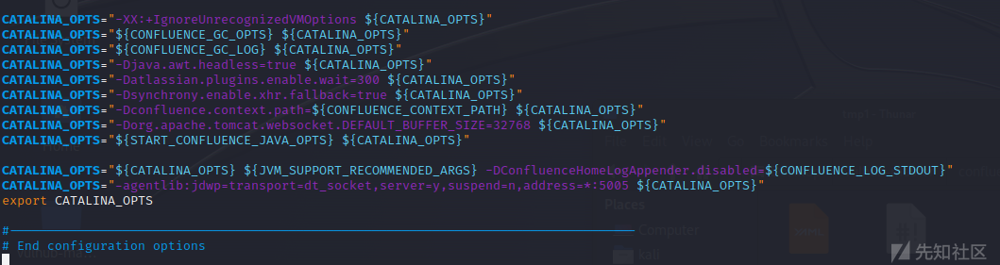
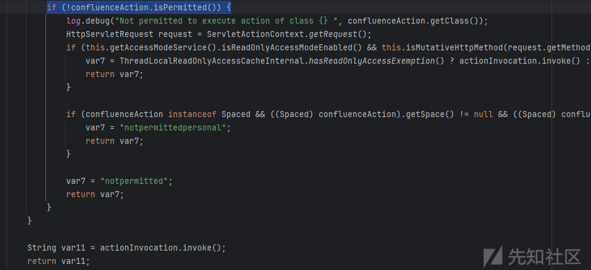
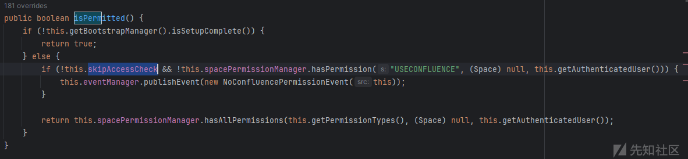

# Atlassian Confluence 远程代码执行漏洞原理层面补充分析(CVE-2023-22518) - 先知社区

Atlassian Confluence 远程代码执行漏洞原理层面补充分析(CVE-2023-22518)

- - -

# CVE-2023-22518分析

## 前言

看到社区已经有师傅发了CVE-2023-22518的复现，但漏洞在代码层面出现的原理没有讲清楚，我帮忙补充一下。

## 环境搭建

我这里使用的是docker来快速搭建漏洞复现环境，首先找到官方仓库，找到一个存在漏洞的镜像版本（我选的是`atlassian/confluence:8.5.2-ubuntu-jdk11`）。因为confluence还依赖数据库，我选择docker-compose来管理conflence和数据库容器。  
如下是我使用的docker-compose.yml文件，考虑到要进行远程调试，提前在配置文件里额外开放5005端口。

```plain
version: '2'
services:
  web:
    image: atlassian/confluence:8.5.2-ubuntu-jdk11
    ports:
      - "8090:8090"
      - "5005:5005"
    depends_on:
      - db
  db:
    image: postgres:10.7-alpine
    environment: 
    - POSTGRES_PASSWORD=postgres
    - POSTGRES_DB=confluence
    ports:
      - "5432:5432"
```

confluence是运行在tomcat上的，进行远程调试需要修改环境变量，我这里改的是`/opt/atlassian/confluence/bin/setenv.sh`,在`export CATALINA_OPTS`前一行加上  
`CATALINA_OPTS="-agentlib:jdwp=transport=dt_socket,server=y,suspend=n,address=*:5005 ${CATALINA_OPTS}"`，配置文件必须重启容器才能生效。  
[](https://xzfile.aliyuncs.com/media/upload/picture/20231106114325-a3d35534-7c56-1.png)

## idea调试设置

调试是需要源码或者jar包的，需要去官网下载一个同版本的tar.gz格式安装包，用idea打开这个目录。将`Confluence\confluence\WEB-INF`下的lib、atlassian-bundled-plugins、atlassian-bundled-plugins-setup添加为库。  
然后添加一个Remote JVM Debug运行配置即可。

## 漏洞简介

本质上是一个认证绕过漏洞，利用认证绕过调用某些高危接口，例如可以使用自己的数据还原confluence（原数据丢失）。

## 漏洞原理

confluence用两个interceptor（WebSudoInterceptor、PermissionCheckInterceptor）来完成接口的认证鉴权，可以在DefaultActionInvocation类的`this.resultCode = interceptor.intercept(this);`这一行打断点，观察interceptor处理前后action的变化来确认interceptor是否拦截掉了请求。

### PermissionCheckInterceptor存在缺陷，导致绕过认证和一次鉴权

PermissionCheckInterceptor用来判断用户是否登录并且是否有权限访问目标页面。关键步骤在于调用`confluenceAction.isPermitted()`方法，如果目标action没有重写`isPermitted`方法（例如EditTrustedApplicationAction等方法）时会去调用父类`ConfluenceActionSupport.isPermitted()`,`ConfluenceActionSupport.isPermitted()`尝试获取登录用户拥有的权限集，并确认用户是否有USECONFLUENCE权限。  
[](https://xzfile.aliyuncs.com/media/upload/picture/20231106114337-ab3f80d6-7c56-1.png)

但是代码实现里又添加了后门，我们可以通过调用ConfluenceActionSupport的setSkipAccessCheck()方法来绕过这一校验，具体方法为请求时额外添加`skipAccessCheck=true`参数。  
[](https://xzfile.aliyuncs.com/media/upload/picture/20231106114356-b62ee540-7c56-1.png)  
例如`ViewTrustedApplicationAction`接口，该接口没有重写isPermitted方法，鉴权时调用`ConfluenceActionSupport.isPermitted()`。我们可以通过请求`http://ip:port/json/trustedapp-view.action?skipAccessCheck=true`来验证这一绕过。

另外有些类重写的isPermitted方法直接返回true，可以不用`添加skipAccessCheck=true`可以直接访问目标接口。例如这次漏洞进行rce时用到的`SetupRestoreAction`就直接将isPermitted方法重写为return true，无需添加`skipAccessCheck=true`即可直接绕过认证。

1.  WebSudoInterceptor存在缺陷，导致绕过二次鉴权  
    WebSudoInterceptor首先获取请求的url，如果接口url以/admin/开头，则接口默认需要管理员二次登录，仅在接口方法有WebSudoNotRequired注解时无需管理员二次登录。  
    如果不以/admin/开头则默认不需要管理员二次登录，仅在接口方法有WebSudoRequired注解时需管理员二次登录。

```plain
if (!webSudoManager.matches(requestURI, actionClass, actionMethod)) {
            log.debug("web sudo check not required for {}.{}", actionClass, actionMethod);
            return actionInvocation.invoke();
    }
    public boolean matches(String requestURI, Class<?> actionClass, Method method) {
    if (requestURI.startsWith("/authenticate.action")) {
        return false;
    } else {
        boolean isAdmin = requestURI.startsWith("/admin/");
        if (isAdmin) {
            return method.getAnnotation(WebSudoNotRequired.class) == null && actionClass.getAnnotation(WebSudoNotRequired.class) == null && actionClass.getPackage().getAnnotation(WebSudoNotRequired.class) == null;
        } else {
            return method.getAnnotation(WebSudoRequired.class) != null || actionClass.getAnnotation(WebSudoRequired.class) != null || actionClass.getPackage().getAnnotation(WebSudoRequired.class) != null;
        }
    }
    }
```

上面的逻辑看上去没有问题，但是com.atlassian.confluence\_confluence-8.5.2.jar!\\struts.xml里用了package extends语法，  
令 /admin 路由集合 继承 /setup 路由集合，

```plain
<package name="admin" extends="setup" namespace="/admin">
        <default-interceptor-ref name="validatingStack"/>
        ....
</package>
```

令 /json 路由集合 继承 /admin 路由集合，

```plain
<package name="json" extends="admin" namespace="/json">
        <default-interceptor-ref name="validatingStack"/>
        ...
</package>
```

也就是说 通过/json路由前缀可以直接访问到/setup和/admin namespace里定义的接口，而WebSudoInterceptor又默认认为/json路由下的接口不需要管理员二次登录，仅在接口方法有WebSudoRequired注解时需管理员二次登录。  
另外又重写默认的interceptor stack为validatingStack而不是validatingSetupStack，绕过了`com.atlassian.confluence.setup.actions.SetupCheckInterceptor`的安装校验。

下面只需要找到一些没有重写isPermitted方法，或者直接重写为 return true的接口类，即可无认证访问。如下是一些符合条件的接口类，最终确认SetupRestoreAction类可用来重置系统，拿到管理员权限，最终通过后台上传app达成rce。  
`EditTrustedApplicationAction ViewTrustedApplicationsAction ForceUpgradeAction AttachmentMigrationAction ContentRemigrationAction FlushCacheAction SetupRestoreFileAction SetupRestoreAction`

## 漏洞利用

已经有[文章](https://xz.aliyun.com/t/12961#toc-9)先行贴出利用方式，我这里就不细讲了，可以参考他的文章。
