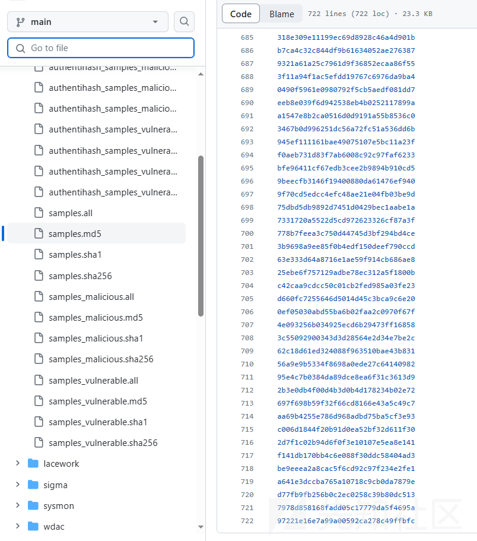
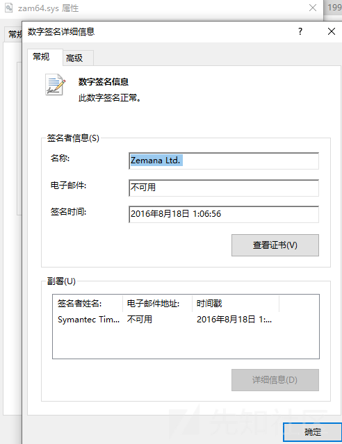
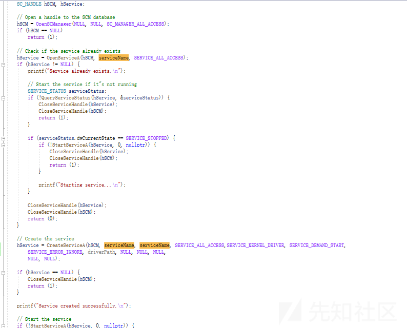
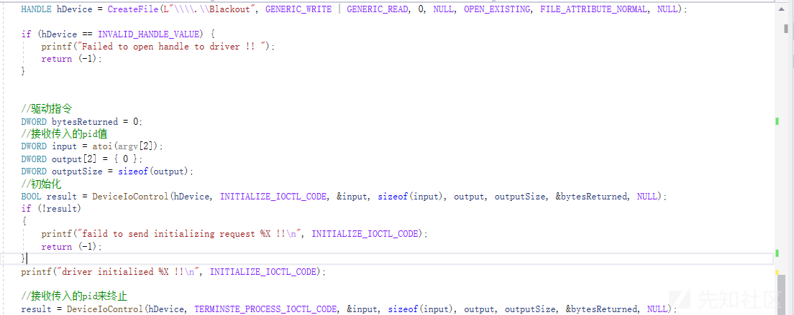

# BYOVD ATTACK 学习 - 先知社区

BYOVD ATTACK 学习

* * *

**BYOVD技术利用**  
BYOVD技术全程为Bring Your own vulnerable drier  
将存在漏洞的合法驱动投递到目标借助滥用的合法驱动签名,攻击者可以绕过DSE(强制驱动签名)的限制(测试模式下可以安装未签名的驱动但是实战的时候不存在这种情况)在Ring0完成攻击操作,这类攻击最初是被Turl和方程式这类顶级APT使用.

LOLDrivers当中记录了滥用的驱动有700+这里还是公开的没公开的合法驱动还是未知数  

**BYOVD ATTACK Kill AV/EDR 分析**  
加载驱动Kill AV的原理分析

  
zam64.sys驱动文件 Terminator项目  
这驱动文件存IOCTL函数(驱动和程序进行通讯的操作系统API用来控制驱动)  
zam64.sys当中有这两个IOCTL函数可以用来Kill驱动  
IOCTL 0x80002048（可以打开任何特权进程的句柄）  
IOCTL 0x80002010（可以在驱动程序中调用函数）

加载一个驱动程序->win API打开SCM创建一个服务然后启动该服务(服务名Terminator)-> 注册当前进程为受信任进程->checkprocess匹配进程KILL EDR->循环这些操作

项目链接  
[https://github.com/ZeroMemoryEx/Terminator](https://github.com/ZeroMemoryEx/Terminator)

**BYOVD ATTACK Kill AV/EDR实现过程**  
这里我用到是Gmer64.sys驱动程序  
用到的IOCTL参数  
IOCTL 0x9876C004  
IOCTL 0x9876C094

  
这OpneScManager获取scm数据的句柄允许和程序进程交互。  
OpenServiceA打开存在的服务存在就返回句柄不存在返回NULL  
检测hService是否为NUL来判断服务是否存在,再检测当前状态.  
服务不存在的话通过CreateServiceA来创建一个服务(服务名自定义)  
服务创建完成后通过StartServiceA启动刚刚创建的服务

  
CreateFile创建表访问Killav标志对该句柄有读写访问权限  
然后通过DeviceIoControl操控驱动发送IOCTL 0x9876C004(应该是完成初始化操作)  
最后通过第二个DeviceIoControl发送IOCTL 0x9876C094指令来kill指定的进程

这里是Gmer64.sys驱动分析的过程  
[https://www.binarydefense.com/resources/blog/threadsleeper-suspending-threads-via-gmer64-driver/](https://www.binarydefense.com/resources/blog/threadsleeper-suspending-threads-via-gmer64-driver/)

**总结**  
这类加载驱动干掉AV还是可以的,但是干掉EDR他的总控一眼就能发现问题,在实战环境当中还是要和EDR共存,BYOVD还能删除回调函数达到致盲效果,关闭/开启PPL保护,开启/关闭强制签名校验等多种高级利用技巧.
