BinaryFormatter 反序列化利用

- - -

## BinaryFormatter

```plain
System.Runtime.Serialization.Formatters.Binary.BinaryFormatter
```

`SoapFormatter`和`BinaryFormatter`类实现`IRemotingFormatter`接口以支持远程过程调用 (RPC)，并实现`IFormatter`接口.

根据微软的文档，当formatter调用Serialize方法的时候，会有以下的生命周期。

1.  首先确定formatter是否有代理选择器，如果有则检查代理选择器要处理的对象类型是否和给定的对象类型一致，如果一致，代理选择器会调用`ISerializable.GetObjectData()`。
2.  如果没有代理选择器，或者代理选择器不处理该对象类型，则检查对象是否有`[Serializable]`特性。如果不能序列化则抛出异常。
3.  检查该对象是否实现`ISerialized`接口，如果实现就调用其`GetObjectData`方法。
4.  如果没有实现ISerialized接口就使用默认的序列化策略，序列化所以没有标记`[NonSerialized]`的字段。

```plain
using System;
using System.Collections.Generic;
using System.IO;
using System.Linq;
using System.Runtime.Serialization.Formatters.Binary;
using System.Text;
using System.Threading.Tasks;
using static ConsoleApp4.Program;

namespace ConsoleApp4
{
    internal class Program
    {
        [Serializable]
        public class Myser()
        {

            public int a;
            public int b;
        }

        static void Main(string[] args)
        {

            Myser myser = new Myser();
            myser.a = 1;
            myser.b = 2;
            string filename = " C:\\Users\\sangfor\\source\\repos\\ConsoleApp4\\ConsoleApp4\\1.txt";
            //  SerializeToFile(filename, myser);
            FiletoDeserial(filename);
            Console.WriteLine();

        }


        static public void SerializeToFile(string filename , Myser myser) {
            // C:\\Users\\sangfor\\source\\repos\\ConsoleApp4\\ConsoleApp4\\1.txt

            FileStream fileStream = new FileStream(filename, FileMode.Create, FileAccess.Write, FileShare.None);
            BinaryFormatter binaryFormatter = new BinaryFormatter();
            binaryFormatter.Serialize(fileStream, myser);
        }
        static public void FiletoDeserial(string filename)
        {
            FileStream fileStream = new FileStream(filename, FileMode.Open, FileAccess.Read, FileShare.None);
            BinaryFormatter binaryFormatter = new BinaryFormatter();
            Myser myser1 =(Myser) binaryFormatter.Deserialize(fileStream);
            Console.WriteLine(myser1.a);
            Console.WriteLine(myser1.b);

            Console.WriteLine();

        }
    }
}
```

微软给定手册需要序列化的class需要使用`Serializable`特性来标记,也可以使用`NonSerialized`来标记不需要反序列化的属性

## ISerializable接口

自定义序列化是控制类型的序列化和反序列化的过程。通过控制序列化，可以确保序列化兼容性，即在不破坏类型的核心功能的情况下在类型的版本之间进行序列化和反序列化的能力。

控制二进制序列化的另一种方法是在对象上实现[ISerialized接口。](https://learn.microsoft.com/en-us/dotnet/api/system.runtime.serialization.iserializable)

当GetObjectData在序列化期间调用时，您负责填充随方法调用提供的[SerializationInfo 。](https://learn.microsoft.com/en-us/dotnet/api/system.runtime.serialization.serializationinfo)添加要序列化的变量作为名称和值对。任何文本都可以用作名称。您可以自由决定将哪些成员变量添加到 `SerializationInfo` 中[，](https://learn.microsoft.com/en-us/dotnet/api/system.runtime.serialization.serializationinfo)前提是序列化了足够的数据以在反序列化期间恢复对象。[如果基对象实现了ISerialized](https://learn.microsoft.com/en-us/dotnet/api/system.runtime.serialization.iserializable) ，则派生类应该调用GetObjectData基对象上的方法。

在实现ISerializable的时候必须实现带`SerializationInfo`的构造方法。

```plain
using System;
using System.Collections.Generic;
using System.IO;
using System.Linq;
using System.Runtime.Serialization;
using System.Runtime.Serialization.Formatters.Binary;
using System.Text;
using System.Threading.Tasks;
using static ConsoleApp4.Program;

namespace ConsoleApp4
{
    internal class Program
    {
        [Serializable]
        public class Myser : ISerializable
        {
            public int n1;
            public int n2;
            public String str;

            public Myser()
            {
            }

            //实现了ISerializable接口的类必须包含有序列化构造函数，否则会出错。
            protected Myser(SerializationInfo info, StreamingContext context)
            {
                Console.WriteLine("Deserial");
                n1 = info.GetInt32("i");
                n2 = info.GetInt32("j");
                str = info.GetString("k");
            }
            void ISerializable.GetObjectData(SerializationInfo info, StreamingContext context)
            {
                Console.WriteLine("Serialize");
                info.AddValue("i", n1);
                info.AddValue("j", n2);
                info.AddValue("k", str);

            }
        }

        static void Main(string[] args)
        {
            string filename = "C:\\Users\\sangfor\\source\\repos\\ConsoleApp4\\ConsoleApp4\\1.txt";
            Myser myser = new Myser();
            myser.n1 = 1;
            myser.n2 = 2;
            Console.WriteLine();
        //    SerializeToFile(filename, myser);
            FiletoDeserial(filename);
        }


        static public void SerializeToFile(string filename, Myser myser)
        {
            // C:\\Users\\sangfor\\source\\repos\\ConsoleApp4\\ConsoleApp4\\1.txt

            FileStream fileStream = new FileStream(filename, FileMode.Create, FileAccess.Write, FileShare.None);
            BinaryFormatter binaryFormatter = new BinaryFormatter();
            binaryFormatter.Serialize(fileStream, myser);
        }
        static public void FiletoDeserial(string filename)
        {
            FileStream fileStream = new FileStream(filename, FileMode.Open, FileAccess.Read, FileShare.None);
            BinaryFormatter binaryFormatter = new BinaryFormatter();
            Myser myser1 = (Myser)binaryFormatter.Deserialize(fileStream);
            Console.WriteLine(myser1.n1);
            Console.WriteLine(myser1.n2);

            Console.WriteLine();

        }
    }
}
```

如上所述，需要使用到序列化的值的话，需要在`GetObjectData`方法中进行`info.AddValue("i", n1);`赋值到键值对中，而在反序列化的需要取对应的值的话需要在自定义携带`SerializationInfo`的构造方法中`info.GetInt32("i");`获取反序列化需要取得的值 。

[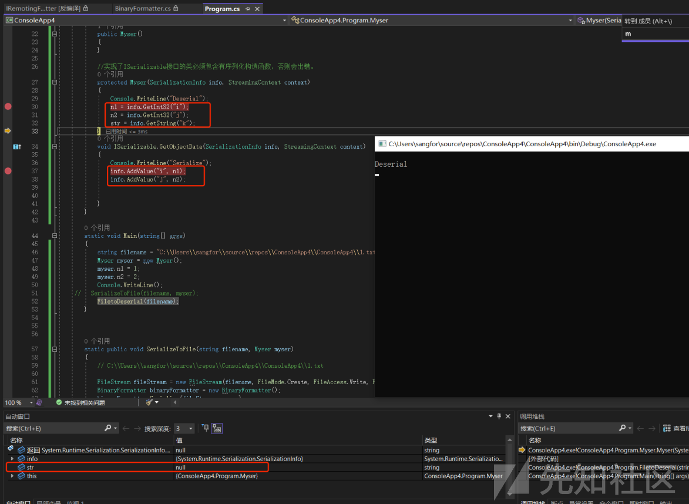](https://xzfile.aliyuncs.com/media/upload/picture/20231108201143-faef85ec-7e2f-1.png)

上图可以看到在str这个变量并没有在加入到`SerializationInfo`里面所以不会被序列化，反序列化取值肯定也是为空的

[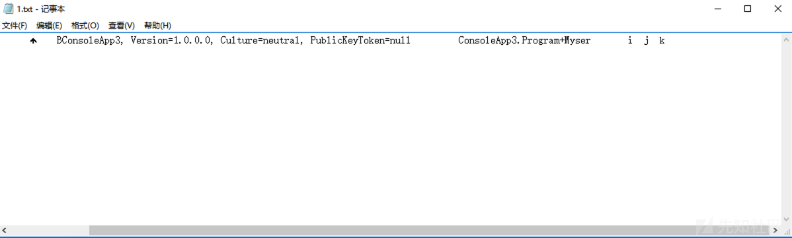](https://xzfile.aliyuncs.com/media/upload/picture/20231108201159-048c8078-7e30-1.png)

[https://learn.microsoft.com/zh-cn/previous-versions/dotnet/fundamentals/serialization/binary/custom-serialization](https://learn.microsoft.com/zh-cn/previous-versions/dotnet/fundamentals/serialization/binary/custom-serialization)

反序列化有如下四个事件

| 特性  | 调用关联的方法时 | 典型用法 |
| --- | --- | --- |
| [OnDeserializingAttribute](https://docs.microsoft.com/zh-cn/dotnet/api/system.runtime.serialization.ondeserializingattribute) | 反序列化之前 | 初始化可选字段的默认值。 |
| [OnDeserializedAttribute](https://docs.microsoft.com/zh-cn/dotnet/api/system.runtime.serialization.ondeserializedattribute) | 反序列化之后 | 根据其他字段的内容修改可选字段值。 |
| [OnSerializingAttribute](https://docs.microsoft.com/zh-cn/dotnet/api/system.runtime.serialization.onserializingattribute) | 序列化之前 | 准备序列化。 例如，创建可选数据结构。 |
| [OnSerializedAttribute](https://docs.microsoft.com/zh-cn/dotnet/api/system.runtime.serialization.onserializedattribute) | 序列化之后 | 记录序列化事件。 |

IFormatter定义了序列化和反序列化的两个方法，以及三个字段，其中每个字段含义如下：

| 类 字段名 | 含义用途 |
| --- | --- |
| ISurrogateSelector SurrogateSelector | 序列化代理选择器 接管formatter的序列化或反序列化处理 |
| SerializationBinder Binder | 用于控制在序列化和反序列化期间使用的实际类型 |
| StreamingContext Context | 序列化流上下文 其中states字段包含了序列化的来源和目的地 |

通过这三个字段，我们可以控制序列化和反序列化时数据的类型、值以及其他信息。

### SurrogateSelector

```plain
using System;
using System.IO;
using System.Runtime.Serialization;
using System.Runtime.Serialization.Formatters.Binary;
using System.Security.Permissions;

namespace NetSerializer
{
    [Serializable]
    public class MyObject : ISerializable
    {
        public string str { get; set; }
        public MyObject()
        {
        }
        //实现了ISerializable接口的类必须包含有序列化构造函数，否则会出错。
        protected MyObject(SerializationInfo info, StreamingContext context)
        {
            Console.WriteLine("MyObject(SerializationInfo info, StreamingContext context)");
            str = info.GetString("str");
        }

        [SecurityPermission(SecurityAction.LinkDemand, Flags = SecurityPermissionFlag.SerializationFormatter)]
        public virtual void GetObjectData(SerializationInfo info, StreamingContext context)
        {
            Console.WriteLine("GetObjectData of MyObject.class");
            info.AddValue("str", str, typeof(string));
        }

        [OnDeserializing]
        private void TestOnDeserializing(StreamingContext sc)
        {
            Console.WriteLine("TestOnDeserializing");

        }
        [OnDeserialized]
        private void TestOnDeserialized(StreamingContext sc)
        {
            Console.WriteLine("TestOnDeserialized");
        }
        [OnSerializing]
        private void TestOnSerializing(StreamingContext sc)
        {
            Console.WriteLine("TestOnSerializing");
        }
        [OnSerialized]
        private void TestOnSerialized(StreamingContext sc)
        {
            Console.WriteLine("TestOnSerialized");
        }
    }
    class MySerializationSurrogate : ISerializationSurrogate
    {
        public void GetObjectData(object obj, SerializationInfo info, StreamingContext context)
        {
            Console.WriteLine("GetObjectData of ISerializationSurrogate");
            info.AddValue("str", ((MyObject)obj).str);
        }

        public object SetObjectData(object obj, SerializationInfo info, StreamingContext context, ISurrogateSelector selector)
        {
            Console.WriteLine("SetObjectData of ISerializationSurrogate");
            MyObject m = new MyObject();
            m.str = (string)info.GetValue("str", typeof(string));
            return m;
        }
    }
    class Program
    {
        static void Main(string[] args)
        {
            try
            {
                MyObject myObject = new MyObject();
                myObject.str = "hello";

                using (MemoryStream memoryStream = new MemoryStream())
                {
                    // 构建formatter
                    BinaryFormatter binaryFormatter = new BinaryFormatter();

                    // 设置序列化代理选择器
                    SurrogateSelector ss = new SurrogateSelector();
                    ss.AddSurrogate(typeof(MyObject), binaryFormatter.Context, new MySerializationSurrogate());
                    // 赋值给formatter 这里是否设置代理选择器决定了序列化的生命周期
                    binaryFormatter.SurrogateSelector = ss;
                    // 序列化
                    binaryFormatter.Serialize(memoryStream, myObject);
                    // 重置stream
                    memoryStream.Position = 0;
                    myObject = null;
                    // 反序列化
                    myObject = (MyObject)binaryFormatter.Deserialize(memoryStream);
                    Console.WriteLine(myObject.str);    // hello
                }

            }
            catch (Exception e)
            {
                Console.WriteLine(e.StackTrace);
            }
            Console.ReadKey();
        }
    }
}
```

结果

```plain
TestOnSerializing
GetObjectData of ISerializationSurrogate
TestOnSerialized
TestOnDeserializing
SetObjectData of ISerializationSurrogate
TestOnDeserialized
hello
```

```plain
SurrogateSelector ss = new SurrogateSelector();
    s.AddSurrogate(typeof(MyObject), binaryFormatter.Context, new MySerializationSurrogate());
    // 赋值给formatter 这里是否设置代理选择器决定了序列化的生命周期
    binaryFormatter.SurrogateSelector = ss;
```

设置代理选择器后，在序列化化和反序列化过程中会执行`ISerializationSurrogate`接口实现的2个方法，分别是`GetObjectData`和`SetObjectData`,而不会执行`MyObject`里面的`GetObjectData`  
以下是流程图

[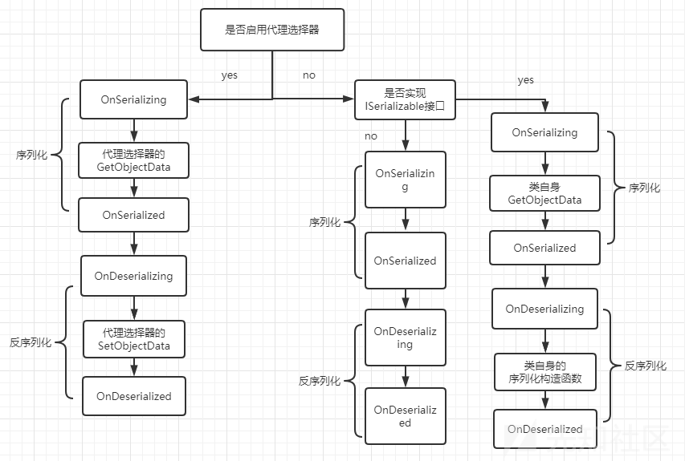](https://xzfile.aliyuncs.com/media/upload/picture/20231108201216-0eeb07a6-7e30-1.png)

### SerializationBinder

只有在完全确定要序列化哪些类的时候，才使用SerializationBinder。恶意类型可能会导致非预期的行为。是预防恶意反序列化利用的一种方式。

`SerializationBinder`继承时，必须重写`BindToType(String, String)`方法

(string assemblyName, string typeName)

`assemblyName`为程序集名称

```plain
using System;
using System.IO;
using System.Runtime.Serialization;
using System.Runtime.Serialization.Formatters.Binary;
using System.Reflection;
using static ConsoleApp3.Program;

namespace ConsoleApp3
{
    internal class Program
    {
        [Serializable]
        public class Myser : ISerializable
        {
            public int n1;
            public int n2;
            public String str;

            public Myser()
            {
            }

            //实现了ISerializable接口的类必须包含有序列化构造函数，否则会出错。
            protected Myser(SerializationInfo info, StreamingContext context)
            {
                Console.WriteLine("Deserial");
                n1 = info.GetInt32("i");
                n2 = info.GetInt32("j");
                str = info.GetString("k");
            }
            void ISerializable.GetObjectData(SerializationInfo info, StreamingContext context)
            {
                Console.WriteLine("Serialize");
                info.AddValue("i", n1);
                info.AddValue("j", n2);
                info.AddValue("k", str);

            }
        }
        [Serializable]
        class RCE
        {
            public string cmd;

            public RCE(string cmd)
            {
                this.cmd = cmd;
            }

            public override string ToString()
            {
                return "cmd";
            }
        }

        class Version2DeserializationBinder : SerializationBinder
        {
            public override Type BindToType(string assemblyName, string typeName)
            {
                Type type = Assembly.GetExecutingAssembly().GetType(typeName);
                if (type.Equals(typeof(RCE)))
                {
                    return null;
                }
                else
                {
                    Type typeToDeserialize = Type.GetType(String.Format("{0}, {1}", typeName, assemblyName));
                    return typeToDeserialize;
                }


                //    Console.WriteLine($"assemblyName:{assemblyName},typeName:{typeName}.");
                //    Type typeToDeserialize = Type.GetType(String.Format("{0}, {1}", typeName, assemblyName));

                //    if (typeToDeserialize.Equals(typeof(RCE)))
                //    {
                //        //throw new Exception("can't deseriliza rce class.");
                //        Console.WriteLine("can't deseriliza rce class.");
                //        return null;
                //    }
                //    return typeToDeserialize;
                //}


            }

            static void Main(string[] args)
            {
                string filename = @"C:\Users\Administrator\source\repos\ConsoleApp3\ConsoleApp3\2.txt";
                Myser myser = new Myser();
                myser.n1 = 1;
                myser.n2 = 2;
                RCE rce = new RCE("calc");

                Console.WriteLine();
                //SerializeToFile(filename, myser);
                //   SerializeToFile(filename, rce);
                FiletoDeserial(filename);
            }


            static public void SerializeToFile(string filename, object myser)
            {
                // C:\\Users\\sangfor\\source\\repos\\ConsoleApp4\\ConsoleApp4\\1.txt

                FileStream fileStream = new FileStream(filename, FileMode.Create, FileAccess.Write, FileShare.None);
                BinaryFormatter binaryFormatter = new BinaryFormatter();
                binaryFormatter.Serialize(fileStream, myser);
            }
            static public void FiletoDeserial(string filename)
            {
                FileStream fileStream = new FileStream(filename, FileMode.Open, FileAccess.Read, FileShare.None);
                BinaryFormatter binaryFormatter = new BinaryFormatter();
                binaryFormatter.Binder = new Version2DeserializationBinder();
                object obj = (object)binaryFormatter.Deserialize(fileStream);


                Console.WriteLine();

            }
        }
    }
}
```

### 失效的SerializationBinder

在调试过程中发现obj并不是为空的，而是被赋值了，说明是能正常反序列化的。`SerializationBinder`并没有起作用

[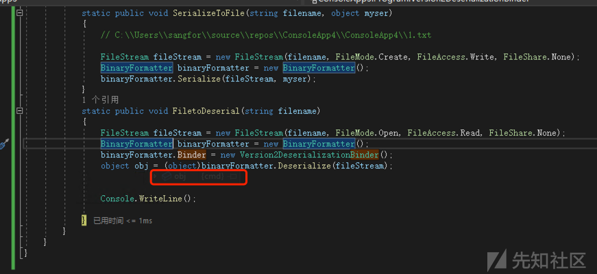](https://xzfile.aliyuncs.com/media/upload/picture/20231108201231-1759caa8-7e30-1.png)

```plain
internal object Deserialize(Stream serializationStream, HeaderHandler handler, bool fCheck, bool isCrossAppDomain, IMethodCallMessage methodCallMessage)
        {
            if (serializationStream == null)
            {
                throw new ArgumentNullException("serializationStream", Environment.GetResourceString("ArgumentNull_WithParamName", serializationStream));
            }

            if (serializationStream.CanSeek && serializationStream.Length == 0L)
            {
                throw new SerializationException(Environment.GetResourceString("Serialization_Stream"));
            }

            InternalFE internalFE = new InternalFE();
            internalFE.FEtypeFormat = m_typeFormat;
            internalFE.FEserializerTypeEnum = InternalSerializerTypeE.Binary;
            internalFE.FEassemblyFormat = m_assemblyFormat;
            internalFE.FEsecurityLevel = m_securityLevel;
            ObjectReader objectReader = new ObjectReader(serializationStream, m_surrogates, m_context, internalFE, m_binder);
            objectReader.crossAppDomainArray = m_crossAppDomainArray;
            return objectReader.Deserialize(handler, new __BinaryParser(serializationStream, objectReader), fCheck, isCrossAppDomain, methodCallMessage);
        }
```

调用`objectReader.Deserialize`进行解析，反序列化的时候会调用 `ObjectReader#GetType`\->`ObjectReader#Bind` 来获取 Type 类型

[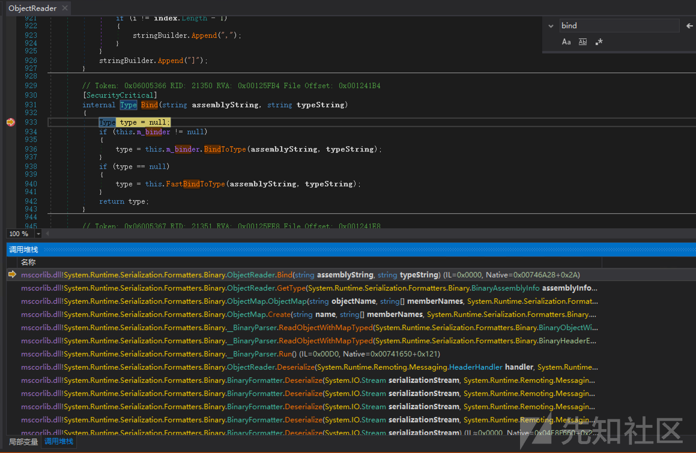](https://xzfile.aliyuncs.com/media/upload/picture/20231108201240-1d350956-7e30-1.png)

```plain
[SecurityCritical]
        internal Type Bind(string assemblyString, string typeString)
        {
            Type type = null;
            if (m_binder != null)
            {
                type = m_binder.BindToType(assemblyString, typeString);
            }

            if ((object)type == null)
            {
                type = FastBindToType(assemblyString, typeString);
            }

            return type;
        }
```

以上代码`type = m_binder.BindToType(assemblyString, typeString);`调用我们自定义的binder的BindToType方法获取Type对象，这里如果获取Type为空时，并不是直接抛出异常，而是调用`FastBindToType`方法继续获取Type。

[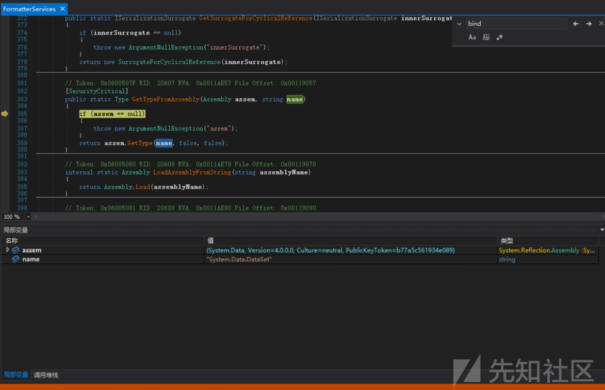](https://xzfile.aliyuncs.com/media/upload/picture/20231108201251-235a2712-7e30-1.png)

```plain
[SecurityCritical]
        internal Type FastBindToType(string assemblyName, string typeName)
        {
            Type type = null;
            ObjectReader.TypeNAssembly typeNAssembly = (ObjectReader.TypeNAssembly)this.typeCache.GetCachedValue(typeName);
            if (typeNAssembly == null || typeNAssembly.assemblyName != assemblyName)
            {
                Assembly assembly = null;
                if (this.bSimpleAssembly)
                {
                    try
                    {
                        ObjectReader.sfileIOPermission.Assert();
                        try
                        {
                            assembly = ObjectReader.ResolveSimpleAssemblyName(new AssemblyName(assemblyName));
                        }
                        finally
                        {
                            CodeAccessPermission.RevertAssert();
                        }
                    }
                    catch (Exception ex)
                    {
                    }
                    if (assembly == null)
                    {
                        return null;
                    }
                    ObjectReader.GetSimplyNamedTypeFromAssembly(assembly, typeName, ref type);
                }
```

`ObjectReader.ResolveSimpleAssemblyName(new AssemblyName(assemblyName));`获取Assembly对象，`ObjectReader.GetSimplyNamedTypeFromAssembly(assembly, typeName, ref type);`来获取Assembly里面的type对象

[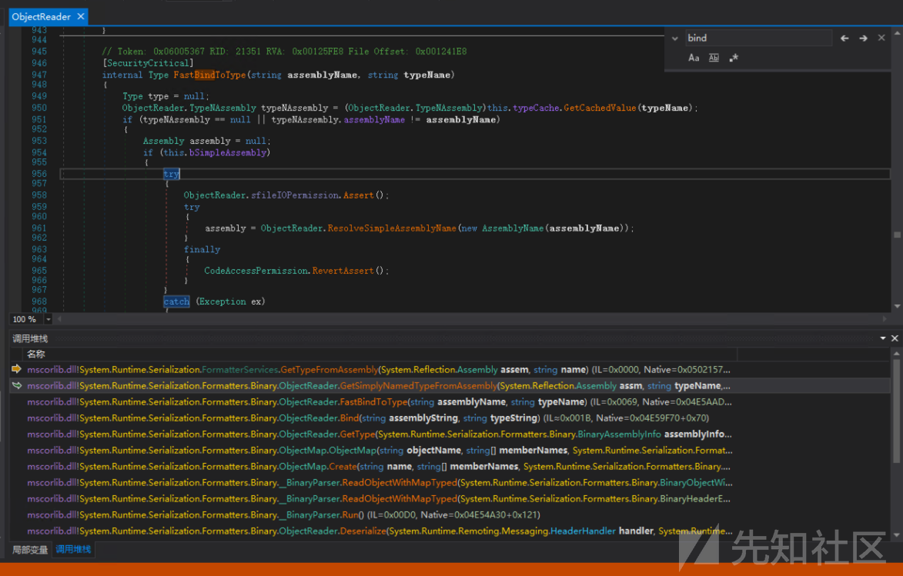](https://xzfile.aliyuncs.com/media/upload/picture/20231108201304-2b2a7ce4-7e30-1.png)

所以以上`SerializationBinder#BindToType`返回null其实是无效的，正确的做法是抛出异常

```plain
List<String> blackTypeName = new List<string> { };
       private void _AddBlackList()
       {
           blackTypeName.Add("System.Data.DataSet");
       }
       public override Type BindToType(string assemblyName, string typeName)
       {
           this._AddBlackList();
           foreach (var t in blackTypeName)
           {
               if (typeName.Equals(t))
               {
                   throw new Exception();
               }
           }
           return Type.GetType(typeName);
```

[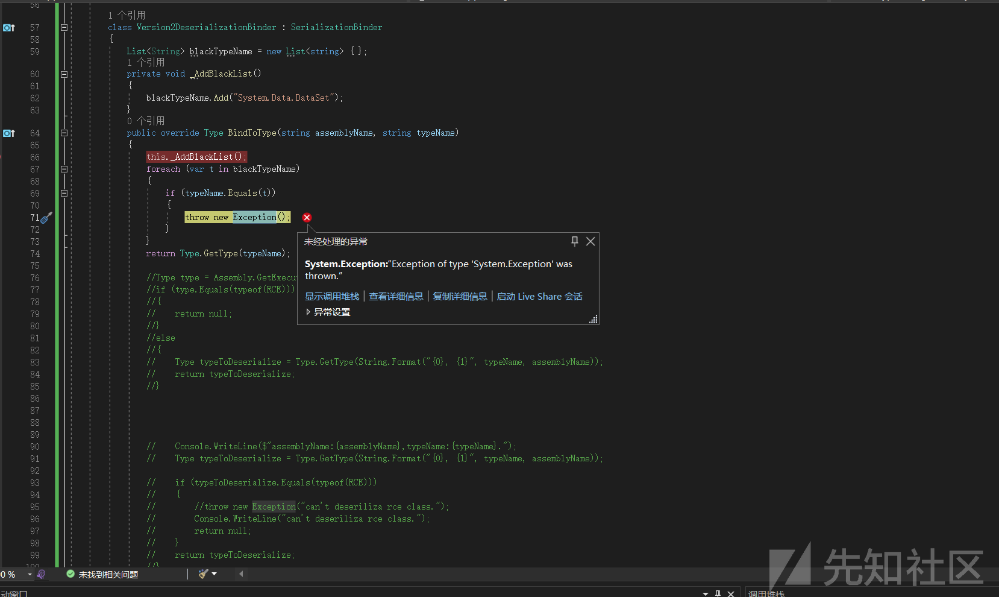](https://xzfile.aliyuncs.com/media/upload/picture/20231108201315-31fd14b4-7e30-1.png)

### SerializationBinder绕过

```plain
[SecurityCritical]
 internal Type FastBindToType(string assemblyName, string typeName)
 {
     Type type = null;
     TypeNAssembly typeNAssembly = (TypeNAssembly)typeCache.GetCachedValue(typeName);
     if (typeNAssembly == null || typeNAssembly.assemblyName != assemblyName)
     {
         Assembly assembly = null;
         if (bSimpleAssembly)
         {
             try
             {
                 sfileIOPermission.Assert();
                 try
                 {
                     assembly = ResolveSimpleAssemblyName(new AssemblyName(assemblyName));
                 }
                 finally
                 {
                     CodeAccessPermission.RevertAssert();
                 }
             }
             catch (Exception)
             {
             }

             if (assembly == null)
             {
                 return null;
             }

             GetSimplyNamedTypeFromAssembly(assembly, typeName, ref type);
         }
         else
         {
             try
             {
                 sfileIOPermission.Assert();
                 try
                 {
                     assembly = Assembly.Load(assemblyName);
                 }
                 finally
                 {
                     CodeAccessPermission.RevertAssert();
                 }
             }
             catch (Exception)
             {
             }

             if (assembly == null)
             {
                 return null;
             }

             type = FormatterServices.GetTypeFromAssembly(assembly, typeName);
         }

         if ((object)type == null)
         {
             return null;
         }

         CheckTypeForwardedTo(assembly, type.Assembly, type);
         typeNAssembly = new TypeNAssembly();
         typeNAssembly.type = type;
         typeNAssembly.assemblyName = assemblyName;
         typeCache.SetCachedValue(typeNAssembly);
     }

     return typeNAssembly.type;
 }
```

再来细看一下`FastBindToType`的代码

[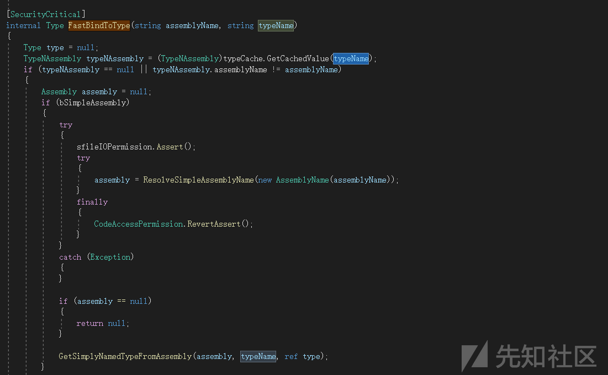](https://xzfile.aliyuncs.com/media/upload/picture/20231108201328-397bec06-7e30-1.png)

先使用`typeName`从缓存里面获取`TypeNAssembly`对象

[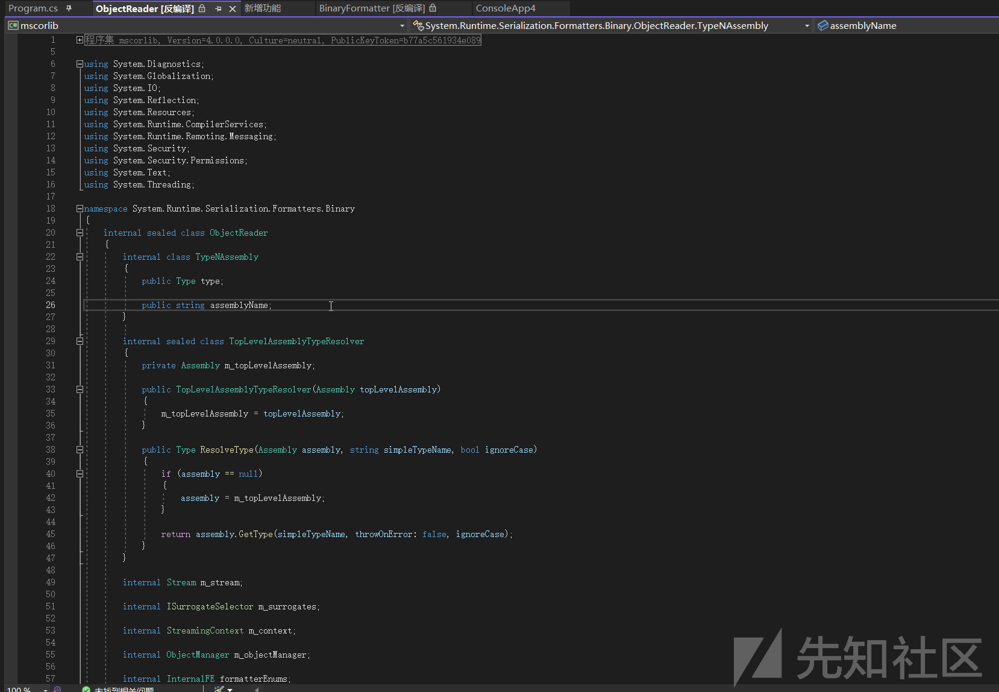](https://xzfile.aliyuncs.com/media/upload/picture/20231108201335-3d98f61c-7e30-1.png)

该对象存储`Type`和`assemblyName`程序集名

如果能从缓存中获取到则执行`typeNAssembly.type;`返回Type对象

如果获取为空，则走到上面的if判断，调用`ResolveSimpleAssemblyName(new AssemblyName(assemblyName));`获取`assemblyName`指定的`Assembly`对象，然后调用`GetSimplyNamedTypeFromAssembly(assembly, typeName, ref type);`获取对应的Type对象。

结合以上代码知道，在`BindToType`方法只检测`typeName`的时候可以通过在系列化修改`assemblyName`值的方式进行绕过。

修改`ysoserial\Generators\DataSetGenerator.cs`

```plain
public void GetObjectData(SerializationInfo info, StreamingContext context)
        {
            // info.SetType(typeof(System.Data.DataSet));

            Type type = typeof(System.Data.DataSet);
            info.FullTypeName = type.AssemblyQualifiedName;
            info.AddValue("DataSet.RemotingFormat", System.Data.SerializationFormat.Binary);
            info.AddValue("DataSet.DataSetName", "");
            info.AddValue("DataSet.Namespace", "");
            info.AddValue("DataSet.Prefix", "");
            info.AddValue("DataSet.CaseSensitive", false);
            info.AddValue("DataSet.LocaleLCID", 0x409);
            info.AddValue("DataSet.EnforceConstraints", false);
            info.AddValue("DataSet.ExtendedProperties", (System.Data.PropertyCollection)null);
            info.AddValue("DataSet.Tables.Count", 1);
            info.AddValue("DataSet.Tables_0", _fakeTable);
        }
```

[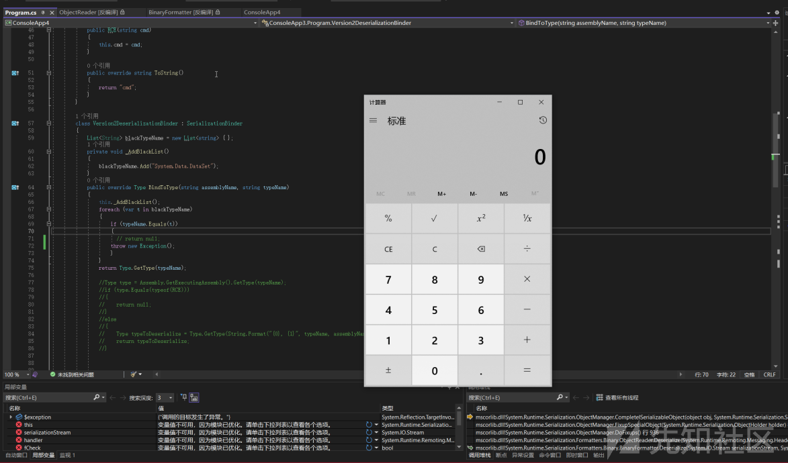](https://xzfile.aliyuncs.com/media/upload/picture/20231108201347-45057560-7e30-1.png)

原生POC

[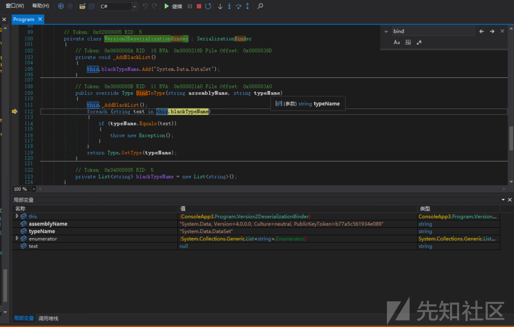](https://xzfile.aliyuncs.com/media/upload/picture/20231108201355-49840c8c-7e30-1.png)

修改 后的poc

[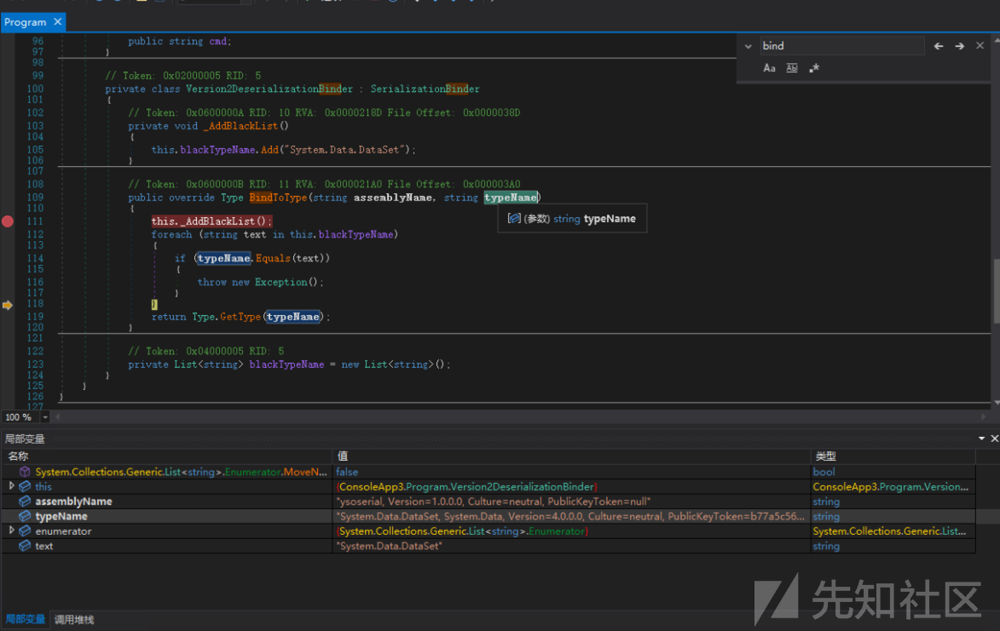](https://xzfile.aliyuncs.com/media/upload/picture/20231108201400-4cd512fa-7e30-1.png)

对比下来typeName 一个是`System.Data.DataSet`，一个是`System.Data.DataSet, System.Data, Version=4.0.0.0, Culture=neutral, PublicKeyToken=b77a5c561934e089`

但是传递`FullName` 去获取Type，其实都是为null。因为用的是`Type.GetType();`该方法需要`AssemblyQualifiedName`去获取这是判断逻辑的错误

[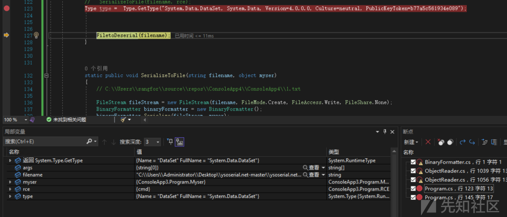](https://xzfile.aliyuncs.com/media/upload/picture/20231108201408-516a16ee-7e30-1.png)

以上的判断是因为判断不够严谨导致的绕过

[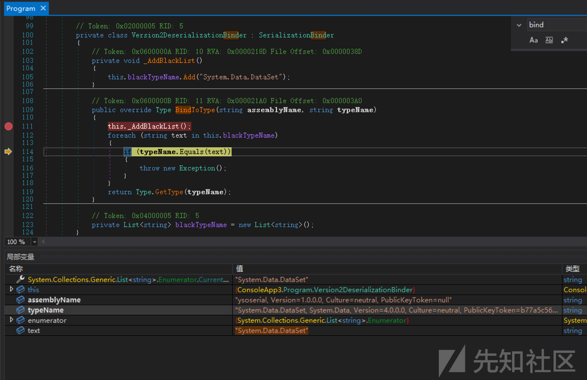](https://xzfile.aliyuncs.com/media/upload/picture/20231108201416-564511aa-7e30-1.png)

[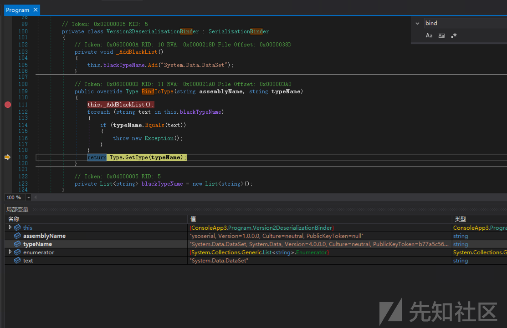](https://xzfile.aliyuncs.com/media/upload/picture/20231108201422-59c74e42-7e30-1.png)

### 字符绕过方式1

看到以下代码

```plain
string typeName = "\n\n\n\n\n\n\nSystem.Data.DataSet,\n\n\n\n\n\n\n System.Data, Version=4.0.0.0,\n\n\n\n\n\n\n Culture=neutral, PublicKeyToken=b77a5c561934e089\n\n\n\n\n\n\n";
            //  typeof(typeName)
            Type type = Type.GetType(typeName);
            Console.WriteLine(type.FullName);
            Console.WriteLine(type.AssemblyQualifiedName);
            Console.ReadLine();
```

[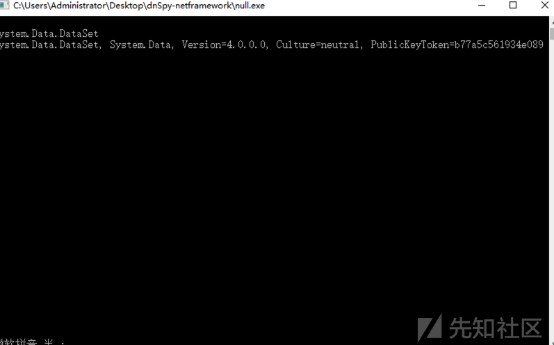](https://xzfile.aliyuncs.com/media/upload/picture/20231108201428-5d967836-7e30-1.png)

### 字符绕过方式2

面加一个`.`也可以解析

```plain
string typeName = ".\n\n\n\n\n\n\nSystem.Data.DataSet,\n\n\n\n\n\n\n System.Data, Version=4.0.0.0,\n\n\n\n\n\n\n Culture=neutral, PublicKeyToken=b77a5c561934e089\n\n\n\n\n\n\n";
            //  typeof(typeName)
            Type type = Type.GetType(typeName);
            Console.WriteLine(type.FullName);
            Console.WriteLine(type.AssemblyQualifiedName);
            Console.ReadLine();
```

前

### 字符绕过方式3

```plain
string typeName = ".System.Data.DataSet,\"System.Data\", Version=4.0.0.0, Culture=neutral, PublicKeyToken=b77a5c561934e089";
```

程序集`，`中间可以`"`隔开

### 绕过方式4

```plain
string typeName = "System.Data.DataSet, \"system.data\", version=4.0.0.0, culture=neutral, publicKeyToken=b77a5c561934e089";
```

程序集可以使用小写

前者的优点是类型解析成本较高，因此有些人[建议不要使用它，以防止可能的拒绝服务攻击](https://www.slideshare.net/MSbluehat/dangerous-contents-securing-net-deserialization)。

然而，另一方面，类型名称解析并不是那么简单，.NET 的内部类型解析器/绑定器允许一些意外的怪癖：

-   标记之间的空白字符（即 U+0009、U+000A、U+000D、U+0020）通常会被忽略，在某些情况下甚至会忽略更多字符
-   类型名称可以“ .”（句点）开头，例如，.System.Data.DataSet
-   程序集名称不区分大小写并且可以用引号引起来，例如MsCoRlIb和"mscorlib"
-   程序集属性值可以被引用，即使是不正确的，例如，PublicKeyToken="b77a5c561934e089"和PublicKeyToken='b77a5c561934e089
-   .NET Framework 程序集通常只需要PublicKey/PublicKeyToken属性，例如，System.Data.DataSet, System.Data, PublicKey=00000000000000000400000000000000或System.Data.DataSet, System.Data, PublicKeyToken=b77a5c561934e089
-   程序集属性可以是任意顺序，例如，System.Data, PublicKeyToken=b77a5c561934e089, Culture=neutral, Version=4.0.0.0
-   允许任意附加的程序集属性，例如，System.Data, Foo=bar, Version=4.0.0.0, Culture=neutral, PublicKeyToken=b77a5c561934e089, Baz=quux
-   程序集属性可以包含几乎任意数据（支持的转义序列：\\"、\\'、\\,、\\/、\\=、\\、\\n、\\r和\\t）

## 危险的替代方法

避免使用以下序列化程序：

-   [SoapFormatter](https://learn.microsoft.com/zh-cn/dotnet/api/system.runtime.serialization.formatters.soap.soapformatter)
-   [LosFormatter](https://learn.microsoft.com/zh-cn/dotnet/api/system.web.ui.losformatter)
-   [NetDataContractSerializer](https://learn.microsoft.com/zh-cn/dotnet/api/system.runtime.serialization.netdatacontractserializer)
-   [ObjectStateFormatter](https://learn.microsoft.com/zh-cn/dotnet/api/system.web.ui.objectstateformatter)

上述序列化程序都执行不受限制的多态反序列化，并且会带来风险，就像 BinaryFormatter 一样。

### 参考文章

[https://paper.seebug.org/1927/](https://paper.seebug.org/1927/)

[https://codewhitesec.blogspot.com/2022/06/bypassing-dotnet-serialization-binders.html](https://codewhitesec.blogspot.com/2022/06/bypassing-dotnet-serialization-binders.html)

[https://github.com/Y4er/dotnet-deserialization/blob/main/dotnet-serialize-101.md](https://github.com/Y4er/dotnet-deserialization/blob/main/dotnet-serialize-101.md)

[https://testbnull.medium.com/note-nhanh-v%E1%BB%81-binaryformatter-binder-v%C3%A0-cve-2022-23277-6510d469604c](https://testbnull.medium.com/note-nhanh-v%E1%BB%81-binaryformatter-binder-v%C3%A0-cve-2022-23277-6510d469604c)

[https://code-white.com/blog/https://research.nccgroup.com/2019/03/19/finding-and-exploiting-net-remoting-over-http-using-deserialisation/](https://code-white.com/blog/https://research.nccgroup.com/2019/03/19/finding-and-exploiting-net-remoting-over-http-using-deserialisation/)

[https://www.slideshare.net/MSbluehat/dangerous-contents-securing-net-deserialization](https://www.slideshare.net/MSbluehat/dangerous-contents-securing-net-deserialization)
