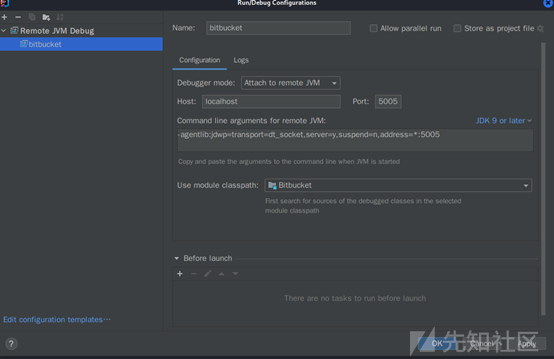

# Bitbucket Server and Data Center 命令注入漏洞（CVE-2022-43781） - 先知社区

Bitbucket Server and Data Center 命令注入漏洞（CVE-2022-43781）

- - -

## 漏洞简介

Atlassian Bitbucket Server 和 Data Center 是 Atlassian 推出的一款现代化代码协作平台，支持代码审查、分支权限管理、CICD 等功能。  
受影响的Bitbucket Server 和 Data Center版本存在使用环境变量的命令注入漏洞，具有控制其用户名权限的攻击者可以在系统上执行任意命令。

## 影响范围

Bitbucket Data Center and Server 7.0 到 7.21的版本。如果在bitbucket.properties中设置了mesh.enabled=false ，则 Bitbucket Server和 Data Center 的8.0 至 8.4 版也会受到此漏洞的影响  
• 7.0 to 7.5 (all versions)  
• 7.6.0 to 7.6.18  
• 7.7 to 7.16 (all versions)  
• 7.17.0 to 7.17.11  
• 7.18 to 7.20 (all versions)  
• 7.21.0 to 7.21.5  
• 8.0.0 to 8.0.4  
• 8.1.0 to 8.1.4  
• 8.2.0 to 8.2.3  
• 8.3.0 to 8.3.2  
• 8.4.0 to 8.4.1

## 调试环境设置

参考：[https://blog.csdn.net/u014513883/article/details/53583495](https://blog.csdn.net/u014513883/article/details/53583495)  
需要设置jvm参数，在启动文件start-bitbucket.sh中并没有发现相关参数，注意到这里加载了\_start-webapp.sh

  
在其中找到了JAVA\_OPTS参数并在最后加上：-Xdebug -Xnoagent -Djava.compiler=NONE -Xrunjdwp:transport=dt\_socket,address=5005,server=y,suspend=n"  
LAUNCHER="com.atlassian.bitbucket.internal.launcher.BitbucketServerLauncher

  
执行service atlbitbucket stop、service atlbitbucket start重启Bitbucket，观察进程发现带上了后面加的jvm参数

  
然后配置idea并调试启动

## 漏洞分析

根据漏洞影响范围下载了8.4.2和8.4.1版本进行对比后发现差异太大了，于是又下载了7.6.19和7.6.18版本。根据两个修复版本之间共同的差异最终锁定安全更新的部分为两个jar包：bitbucket-process-*.jar和nuprocess-*.jar  
反编译后进一步对比发现bitbucket-process-\*.jar中DefaultNioProcessConfigurer.java、NioProcessParameters.java、RemoteUserNioProcessConfigurer.java中的差异符合官方漏洞描述：有权控制其用户名权限的攻击者能够利用环境变量进行命令注入  
在\\com\\atlassian\\bitbucket\\internal\\process\\DefaultNioProcessConfigurer.java中将环境变量的设置改为了NioProcessParameters.environmentPutIfAbsent函数

  
这个函数是\\com\\atlassian\\bitbucket\\internal\\process\\NioProcessParameters.java中新增的，其中调用的函数对key进行了非空判断，对key和valve都进行了空字节的检测

  
在\\com\\atlassian\\bitbucket\\internal\\process\\RemoteUserNioProcessConfigurer.java中发现了官方描述的用户名环境变量：REMOTE\_USER

  
通过回溯相关类及其继承类的调用找到了路由入口，如：com.atlassian.stash.internal.rest.content.FileListResource  
联想到Bitbucket也是用于Git 代码管理，猜测这里会执行git命令

  
创建仓库后根据路由访问：

  
跟进看一下命令在哪里执行的以及环境变量用来干什么  
在RemoteUserNioProcessConfigurer中的configure方法成功命中断点，这里发现已经传入了git命令，但是漏洞描述说的是使用用户名环境变量造成的注入，所以只需关注环境变量部分

  
调用DefaultAuthenticationContext.getCurrentUser方法后生成user，其中包含注册的用户名：test

  
其getName方法主要逻辑就是返回注册信息中的用户名

  
随后赋值给环境变量REMOTE\_USER

  
返回之后回到NuNioProcessHelper.run方法

  
然后调用NuProcessBuilder.run方法，prepareEnvironment方法进行格式转换，取出环境变量中的key和value以’=’拼接放入字符数组

  
一直跟入后发现在LinuxProcess.prepareProcess方法中环境变量经过toEnvironmentBlock方法处理

  
该函数主要逻辑就是将环境变量数组中的全部环境变量转化为字节后赋值给新的block字节数组并返回。其中每次拷贝一个环境变量字节后新的拷贝位置会加一，以实现环境变量间的分隔。根据漏洞修复方式，在环境变量中使用空字节后，在这里空字节后面部分就是一个新的环境变量，猜测可能是注入了一个恶意环境变量

  
返回赋值给envBlock后调用LibJava10.Java\_java\_lang\_ProcessImpl\_forkAndExec方法，这里通过调用java native方法实现命令执行

  
这里并没有发现环境变量如何造成任意命令执行，回看其它地方也没有发现环境变量引入到命令执行触发点。相关的历史漏洞都是git参数注入，后来看到已经有相关的漏洞分析文章了：[https://x.threatbook.com/v5/article?threatInfoID=40211](https://x.threatbook.com/v5/article?threatInfoID=40211)

  
才意识到是git环境变量：[https://git-scm.com/book/zh/v2/Git-%E5%86%85%E9%83%A8%E5%8E%9F%E7%90%86-%E7%8E%AF%E5%A2%83%E5%8F%98%E9%87%8F](https://git-scm.com/book/zh/v2/Git-%E5%86%85%E9%83%A8%E5%8E%9F%E7%90%86-%E7%8E%AF%E5%A2%83%E5%8F%98%E9%87%8F)

  
简单来说就是执行git命令时会自动调用相关的环境变量，而某些环境变量可以执行命令如上面的GIT\_EXTERNAL\_DIFF  
根据文章描述该环境变量是在执行git diff时用到的，而上面的git命令用不到该环境变量  
按照描述注册一个用户名为：’test GIT\_EXTERNAL\_DIFF=touch /tmp/test’，然后去仓库执行diff操作

  
根据路由，调用到CommitDiffResource. streamDiff函数。后续流程和上面一样了，只是现在执行的git diff命令，会用到注入的git环境变量‘GIT\_EXTERNAL\_DIFF‘造成命令执行

## 漏洞复现

注册一个带有环境变量的用户名，然后burp拦截将空格改为%00

  
然后进入仓库进行diff

  
成功在/tmp目录下创建test文件

