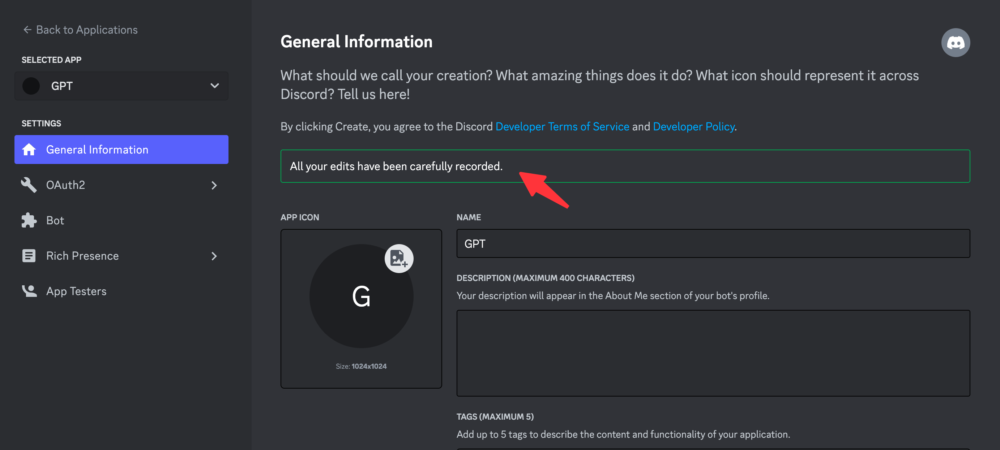

# Building your first Discord ChatGPT Bot - wuxinhua.com --- 构建您的第一个 Discord ChatGPT 机器人 - wuxinhua.com

# Building your first Discord ChatGPT Bot  
构建您的第一个 Discord ChatGPT 机器人

@0xinhua 发布于 2023年05月18日

## What we'll be building  
我们将构建的内容

In this tutorial, I will guide you through building your initial Discord app using JavaScript to interact with ChatGPT via slash commands.  
在本教程中，我将指导您使用 JavaScript 构建初始 Discord 应用程序，以通过斜杠命令与 ChatGPT 进行交互。

Here's what the finished Discord ChatGPT Bot will look like:  
以下是完成的 Discord ChatGPT Bot 的样子：

## Resources used in this guide  
本指南中使用的资源

-   [AirCode](https://aircode.io/) An online platform for Building and hosting Node.js Apps.  
    AirCode 用于构建和托管 Node.js 应用程序的在线平台。
-   [discord.js](https://discord.js.org/) [discord-interactions](https://github.com/discord/discord-interactions-js) Api and library types.  
    discord.js discord-interactions API 和库类型。
-   [OpenAI](https://www.npmjs.com/package/openai) Send messages to ChatGPT.  
    OpenAI 向 ChatGPT 发送消息。

## Step 1: Creating an App and Bot  
步骤 1：创建应用和机器人

First, you'll need to create an app in the developer portal if you don't have one already:  
首先，如果还没有应用，则需要在开发人员门户中创建应用：First， you'll need to create an app in the developer portal if you don't have already one：

1.  Go to [Discord Developer Portal.](https://discord.com/developers/applications) (login using your discord account if required). Click on the "New Application" button at the top right. Give your application a name and click "Create"  
    转到 Discord 开发者门户。（如果需要，请使用您的 Discord 帐户登录）。单击右上角的“新建应用程序”按钮。为您的应用程序命名，然后单击“创建”

2.  Copy your Public Key and Application ID, and put them somewhere locally (we'll need these later)  
    复制公钥和应用程序 ID，并将它们放在本地的某个位置（我们稍后会用到这些）

3.  Click on the "Bot" tab on the left side of the screen.Click on the "Add Bot" button on the right. After the bot is created, Reset the token for your bot, and store it somewhere safe as a secret.(we'll need these later)  
    单击屏幕左侧的“机器人”选项卡。单击右侧的“添加机器人”按钮。创建机器人后，重置机器人的令牌，并将其作为机密存储在安全的位置。（我们稍后会用到这些）

Once the application and bot is created, Here, you can customize them by adding an icon, description, etc.  
创建应用程序和机器人后，您可以在此处通过添加图标、描述等来自定义它们。

## Step 2: Setting Scope and Authorization  
步骤二：设置范围和授权

Click on OAuth2 in the left sidebar, then select URL Generator.  
单击左侧边栏中的 OAuth2，然后选择 URL 生成器。

Add two scopes: 添加两个范围：

-   `applications.commands` which allows your app to create commands. `bot` which adds your bot user.  
    `applications.commands` 这允许你的应用创建命令。 `bot` 这将添加您的机器人用户。
-   After you select bot, you can also select different permissions for your bot. For now, just check `Send Messages`.  
    选择机器人后，还可以为机器人选择不同的权限。现在，只需检查 `Send Messages` .

Copy the GENERATED URL from above, and paste it into your browser. You'll be guided through the installation flow, where you should make sure you're installing your app on a server where you can develop and test it.  
从上面复制生成的 URL，并将其粘贴到浏览器中。系统将引导你完成安装流程，确保在可以开发和测试应用的服务器上安装应用。

After authorized your app, you can head over to your server and see that -> GPT hopped into the server. ✨  
授权您的应用程序后，您可以前往您的服务器并看到 -> GPT 跳入服务器。✨

## Step 3: Get a copy and Deploy  
步骤 3：获取副本并部署

This guide uses [AirCode](https://aircode.io/) to host code, Before we get a copy, make sure you have a AirCode account.  
本指南使用 AirCode 来托管代码，在我们获取副本之前，请确保您拥有 AirCode 帐户。

1.  Go to this [Discord ChatGPT Bot Demo](https://aircode.cool/zsgdima57c). Click on the "Get a copy" button.  
    转到此 Discord ChatGPT 机器人演示。单击“获取副本”按钮。

2.  You'll be redirected to the Create app page, use the default name or type your own app name, then click "Create".  
    您将被重定向到“创建应用”页面，使用默认名称或键入您自己的应用名称，然后单击“创建”。

Paste the Bot token、OpenAI Key、Public Key、Application ID、earlier save from platform into the Environment variables. Make sure they are in the right key value place.  
将 Bot token、OpenAI Key、Public Key、Application ID、之前从平台保存的 Environment 变量粘贴到环境变量中。确保它们位于正确的键值位置。

Click on the "Deploy" button to deploy all files, the env changes will take effect online after deployment.  
点击“部署”按钮部署所有文件，环境更改将在部署后在线生效。

## Step 4: Register Command  
第 4 步：注册命令

The project contains a register command script you can use to install the commands, which is defined in register-command.js.  
该项目包含可用于安装命令的注册命令脚本，该脚本在 register-command.js 中定义。

Select register-command.js file, you will find a invoke url as following, Copy the URL and paste it into your browser URL address.  
选择register-command.js文件，你会发现一个调用url，如下所示，复制URL并将其粘贴到浏览器URL地址中。

You will register /chatgpt slash command into server.  
您将在服务器中注册 /chatgpt slash 命令。

## Step 5: Handling Interactivity  
第 5 步：处理交互性

To enable your app to receive slash command requests (and other interactions), Discord needs a public URL to send them.  
为了使您的应用程序能够接收斜杠命令请求（和其他交互），Discord 需要一个公共 URL 来发送它们。

Select interactions.js file, you will find a invoke URL as following, copy the link.  
选择交互.js文件，您将找到如下所示的调用URL，复制链接。

Back to Discord Applications, on your app's General Information page, there's an Interactive Endpoint URL option, where you can paste your interactions URL copied from AirCode.  
回到 Discord 应用程序，在应用的“常规信息”页面上，有一个交互式终端 URL 选项，您可以在其中粘贴从 AirCode 复制的交互 URL。

Make sure the save is successful.  
确保保存成功。

Test your ChatGPT bot by typing the command "/chatgpt".  
通过键入命令“/chatgpt”来测试您的 ChatGPT 机器人。

## Feedback 反馈

Join our [Discord server](https://discord.com/invite/XrMVdYdEuY) for help and discussion.  
加入我们的 Discord 服务器寻求帮助和讨论。
