# ByteCodeDL能找到log4shell(CVE-2021-44228)漏洞吗 - 先知社区

ByteCodeDL能找到log4shell(CVE-2021-44228)漏洞吗

- - -

## TL;DR

本文介绍了尝试使用[ByteCodeDL](https://github.com/BytecodeDL/ByteCodeDL)、[ByteCodeDL-PathFinder](https://github.com/BytecodeDL/bytecodedl-pathfinder-neo4j-procedure)、[ByteCodeDL-Neo4j-IDEA-Plugin](https://github.com/BytecodeDL/graphdb-intellij-plugin) 这些工具去复现log4shell漏洞的挖掘过程。

本文会尝试解决下面几个问题：

1.  节点过多，查不出路径怎么办？
2.  查到路径之后，如何排查路径的正确性？

## Challenges and Frustrations in ByteCodeDL

目前ByteCodeDL主要有以下问题，导致ByteCodeDL没有被用起来

1.  Datalog上手难度较高，大多数人不适应声明式编程语言
2.  CHA生成的调用图，边过多，存在环，导致先前直接用apoc.simpleAllPaths 查询非常慢，而且路径一长就查不出来
3.  查出来的路径如果想验证其正确性也很麻烦

我之前尝试使用ByteCodeDL复现log4shell的时候，遇到了痛点2和痛点3，中间也走了一些弯路，比如实现一个simple-cha方法，可以减少边和环的出现但是验证起来还是非常麻烦。魔改了neo4j-browser，增加了删除按钮等功能，虽然能在一定程度上改善上面的痛点，但是实际用起来还是很痛。

痛并思痛之后，有了现在的解决方案。

1.  写了neo4j自定义的procedure用于路径查询，为了性能考虑一次只返回一条路径，为了查询到更长的链路实现了一个双向查询的功能。
2.  魔改neo4j idea插件，在idea中显示neo4j的查询结果，将点和边绑定到代码跳转的事件，点击点会跳转到对应的声明方法，点击边会跳转到对应的调用点。
3.  在排查调用图是否正确时，重点排查两类情况
    1.  多态等导致的callee解析的不对
        1.  针对这种情况给边增加了仅保留正确callee的按钮，把其他解析错误的边删掉
    2.  条件语句等导致的不会走到callee对应的调用点
        1.  针对这种情况给边增加了全部删除该调用点的按钮

自己体验下来，排查的过程确实没有之前那么痛了。

## Cha-Log4Shell

下面展示如何利用上面那套组合拳，复现挖掘log4shell。

首先搭建一个log4shell的环境，然后编译，编译产物用于生成fact，后面也会用这个环境进行调试。

使用`git clone https://github.com/BytecodeDL/ByteCodeDL.git -b cha-log4shell`将cha-log4shell分支clone到本地。

执行`cd ByteCodeDL` 切换到ByteCodeDL目录，通过`docker-compose up -d` 启动docker。

上面的命令会创建两个容器

-   bytecodedl\_neo\_1
    -   neo4j server + bytecodedl-pathfinder-neo4j-procedure
-   bytecodedl\_bytecodedl\_1
    -   souffle + soot-fact-generator

通过执行

```plain
java -jar soot-fact-generator.jar -i log4shell.jar  -l /usr/lib/jvm/java-8-oracle/jre/lib/rt.jar --generate-jimple --allow-phantom --full -d log4j
```

生成fact

然后执行

```plain
souffle -F /root/log4j -D output example/cha-log4shell.dl -j 8
```

构建CHA调用图

cha-log4shell.dl 内容也非常短，就定义了source，sink以及bancaller

```plain
#define MAXSTEP 33
#define CHAO 1

#include "../logic/cha.dl"

BanCaller(method) :-
    MethodInfo(method, _, _, class, _, _, _),
    !contains("org.apache.logging.log4j", class).

SinkDesc("lookup", "javax.naming.Context").

// init entrypoint 
EntryPoint(simplename, descriptor, class) :-
    MethodInfo(_, simplename, _, class, _, descriptor, _),
    simplename = "error",
    class = "org.apache.logging.log4j.spi.AbstractLogger",
    descriptor = "(Ljava/lang/String;)V".
```

上面的分析过程大概不到5s

```plain
time souffle -F /root/log4j -D output example/cha-log4shell.dl -j 8 
souffle -F /root/log4j -D output example/cha-log4shell.dl -j 8  9.91s user 0.21s system 212% cpu 4.760 total
```

再执行

```plain
bash importOuput2Neo4j.sh neoImportCall.sh cha-log4shell
```

将调用图分析的结果导入到neo4j的数据库

导入过程大概花了不到2s

```plain
IMPORT DONE in 1s 163ms. 
Imported:
  1190 nodes
  3358 relationships
  1190 properties
```

可以在终端输出中看到实际的数据库名称

[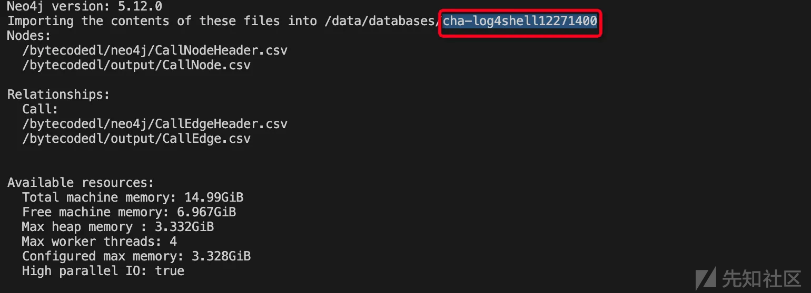](https://xzfile.aliyuncs.com/media/upload/picture/20240102200348-fcad0b90-a966-1.webp)

然后在**最新版**的IDEA中安装插件[https://github.com/BytecodeDL/graphdb-intellij-plugin/releases/tag/v1.0.0](https://github.com/BytecodeDL/graphdb-intellij-plugin/releases/tag/v1.0.0)

安装成功后填写对应的数据库地址和数据库名称

[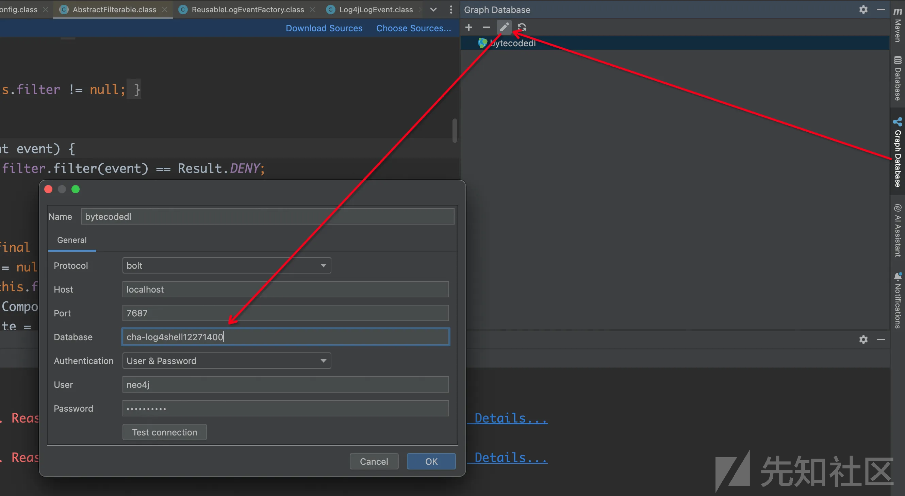](https://xzfile.aliyuncs.com/media/upload/picture/20240102200428-14966c60-a967-1.webp)

测试链接没问题后点击OK保存，然后双击数据库

[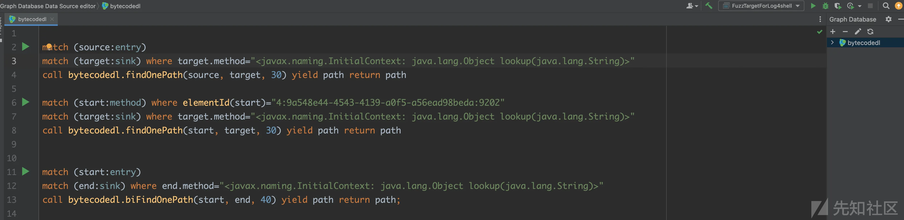](https://xzfile.aliyuncs.com/media/upload/picture/20240102200501-27d4597c-a967-1.webp)

进入到一个可以执行cypher语句的tag页面

然后填入cypher语句

```plain
match (source:entry)
match (target:sink) where target.method="<javax.naming.InitialContext: java.lang.Object lookup(java.lang.String)>"
call bytecodedl.findOnePath(source, target, 30) yield path return path
```

bytecodedl.findOnePath(source, target, 30)表示从source出发在30跳之内找到一条到达target的路径并返回

```plain
match (start:entry)
match (end:sink) where end.method="<javax.naming.InitialContext: java.lang.Object lookup(java.lang.String)>"
call bytecodedl.biFindOnePath(start, end, 40) yield path return path;
```

bytecodedl.biFindOnePath(start, end, 40) 也是找到一条start到end且长度小于40的路径。

bytecodedl.findOnePath 和 bytecodedl.biFindOnePath 不同点有

1.  唯一性不同
    1.  findOnePath的uniqueness是NODE\_GLOBAL，也就是路径中遍历过的节点不会在后续遍历中出现
    2.  biFindOnePath的uniqueness是RELATIONSHIP\_GLOBAL，也就是路径中遍历过的边不会在后续遍历中出现，但是可能会出现环的情况
2.  遍历方向不同
    1.  findOnePath是单向遍历，宽度优先遍历，遇到end就会停止
    2.  biFindOnePath是双向深度优先遍历，就是从source和end出发开始遍历，中间相遇的时候会停止

点击执行按钮可以获得查询结果。我们先使用findOnePath

1006ms 可以得到执行结果，结果如下

[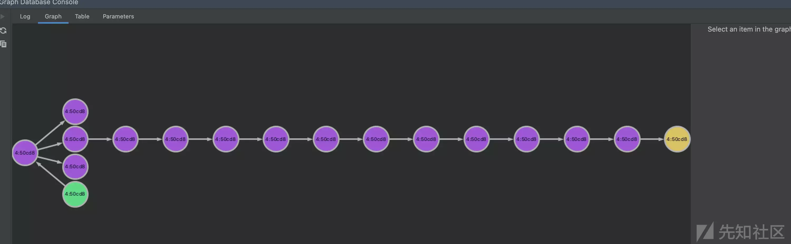](https://xzfile.aliyuncs.com/media/upload/picture/20240102200516-310782d0-a967-1.webp)

从图中可以发现存在三种颜色，绿色的为source 黄色的为sink，紫色的为中间的调用方法。

先从source出发进行排查该路径是不是正确的。

点击节点会跳转到对应的方法声明处，同时右边会显示该节点的详细信息

[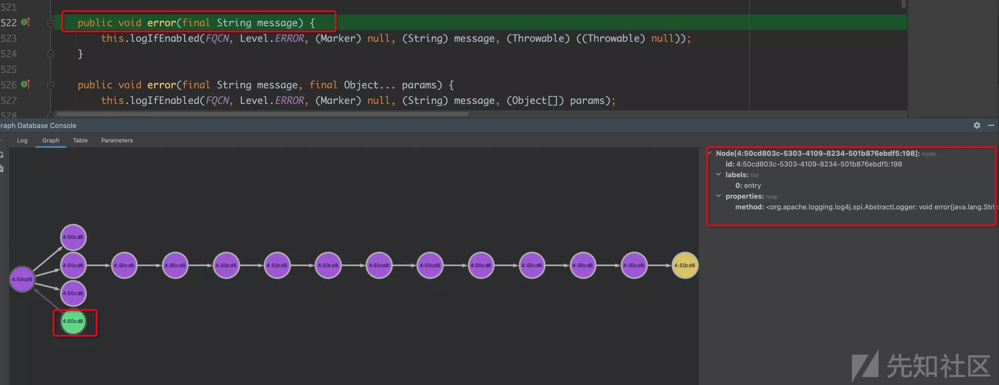](https://xzfile.aliyuncs.com/media/upload/picture/20240102200520-3349459c-a967-1.webp)

点击边会根据边的insn跳转到对应调用点，右下角也会显示边的详细信息

[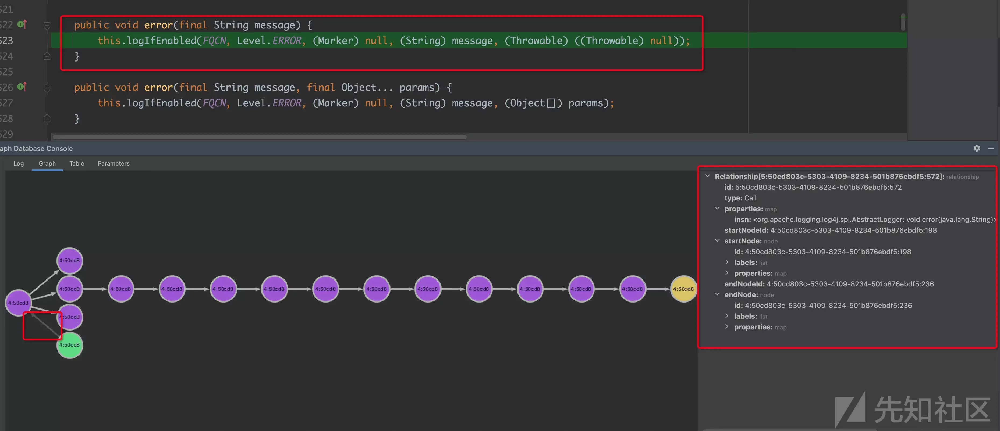](https://xzfile.aliyuncs.com/media/upload/picture/20240102200526-371a9f40-a967-1.webp)

再继续向下排查，会发现分叉了，不是说好的只返回一条边，为什么这里会分叉了呢？

这其实是故意设置的，在找到一条路径后，会从start开始遍历边，找到第一个不确定实际calle的边，然后把所有可能的callee一并返回，让安全研究人员重点排查该点的实际解析情况。

[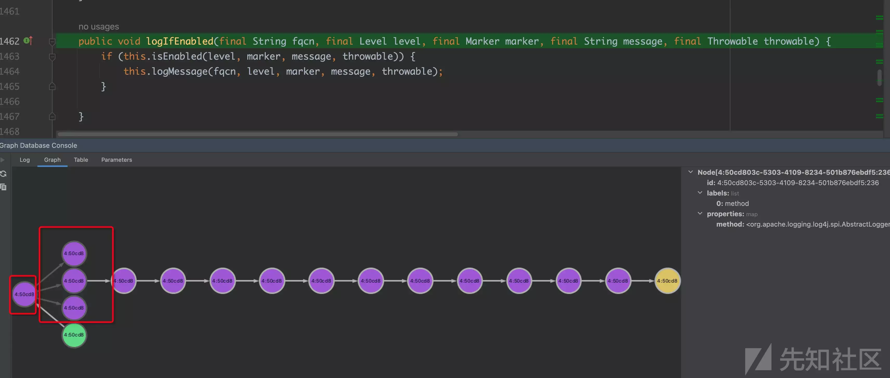](https://xzfile.aliyuncs.com/media/upload/picture/20240102200604-4dd5956e-a967-1.webp)

[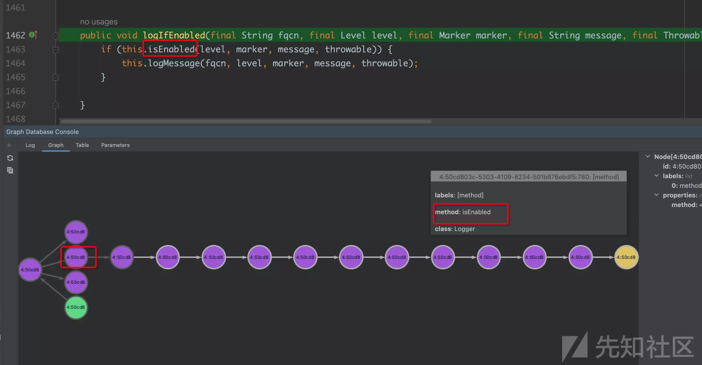](https://xzfile.aliyuncs.com/media/upload/picture/20240102200625-59ef7e64-a967-1.webp)

发现在调用点`this.isEnabled(level, marker, message, throwable)` 存在三个不同的解析，分别是

-   Logger#isEnabled
-   ExtendedLoggerWrapper#isEnabled
-   StatusLogger#isEnabled

所以我们需要人工判断实际情况会调用哪个函数？怎么判断呢？最简单的还是下个断点调试。

[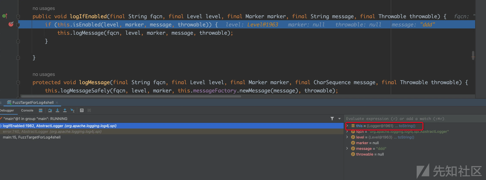](https://xzfile.aliyuncs.com/media/upload/picture/20240102200630-5d2de5fc-a967-1.webp)

根据调试结果，这里应该实际被解析为Logger#isEnabled，在确定正确的dispatch之后就可以把其他错误的dispatch结果删掉。

选中要保留的边，然后右击右边的relationship第一行，选择执行Only Leave this invocation，就会只保留这个边，把其他边删掉。

[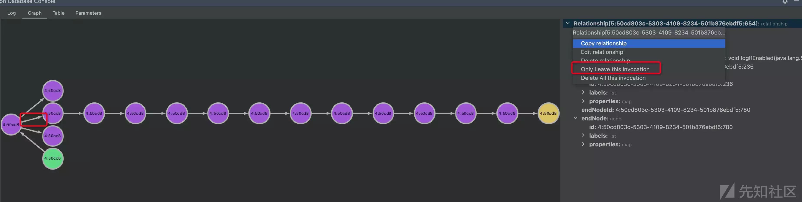](https://xzfile.aliyuncs.com/media/upload/picture/20240102200637-618dd404-a967-1.webp)

实际执行的语句是

```plain
Executing query: 
MATCH ()-[n:Call]->() WHERE elementId(n) <> $id and n.insn = $insn SET n.is_deleted=1 RETURN n
With parameters: 
id: 5:50cd803c-5303-4109-8234-501b876ebdf5:654
insn: <org.apache.logging.log4j.spi.AbstractLogger: void logIfEnabled(java.lang.String,org.apache.logging.log4j.Level,org.apache.logging.log4j.Marker,java.lang.String,java.lang.Throwable)>/org.apache.logging.log4j.spi.AbstractLogger.isEnabled/0
Query executed in 959ms. Query type: READ_WRITE.
```

为了防止删错了，这里用了软删除，设置了边的is\_deleted属性为1

下一步应该怎么办呢？

一种选择是再执行一遍刚才的cypher

还有一种选择是将当前排查过的点作为起点进行查询

先尝试第一种方式，重新执行后

[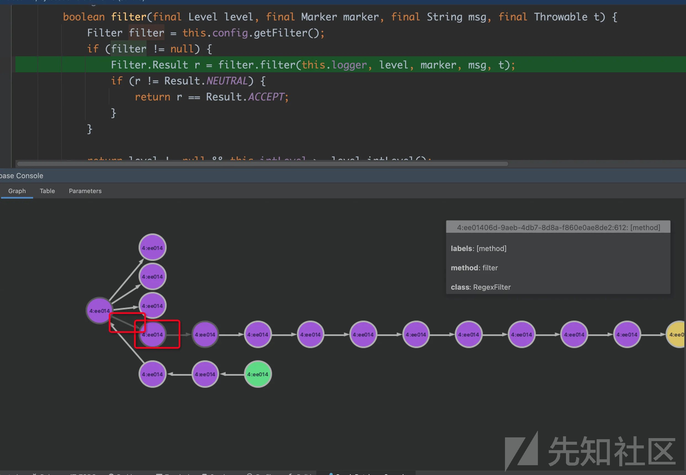](https://xzfile.aliyuncs.com/media/upload/picture/20240102200647-67700e14-a967-1.webp)

又遇到了分叉，接着通过调试判断真正被解析的函数。

[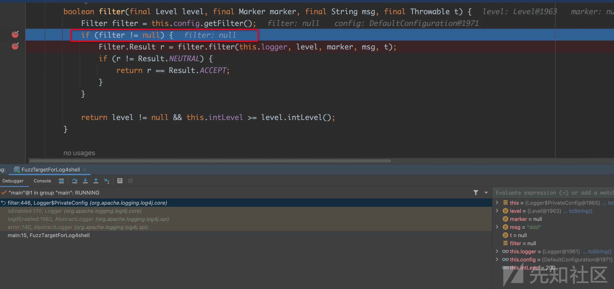](https://xzfile.aliyuncs.com/media/upload/picture/20240102200704-719f8e96-a967-1.webp)

从调试结果可以发现filter为null，实际不会调用到filter.filter这个调用点，这时候我们就需要通过Delete all invocation 删除实际不存在的调用，这个删除也是对边设置了is\_deleted=1

[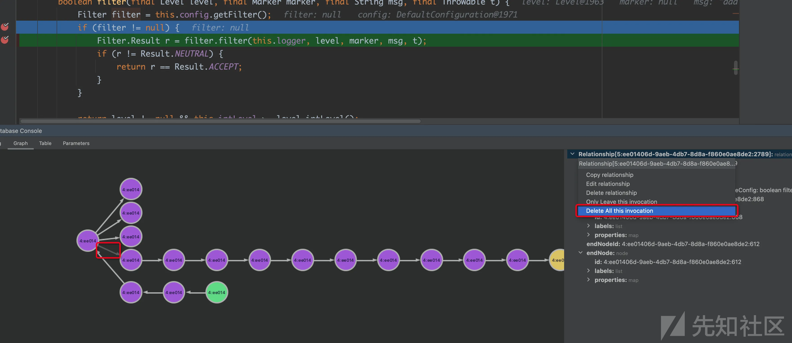](https://xzfile.aliyuncs.com/media/upload/picture/20240102200735-83f6a8a4-a967-1.webp)

接着查询

[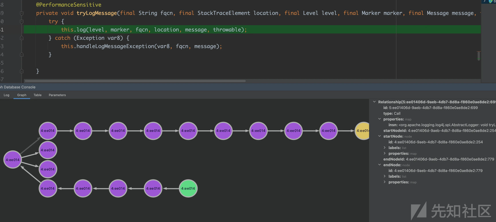](https://xzfile.aliyuncs.com/media/upload/picture/20240102200738-85cdc8d8-a967-1.webp)

接着通过debug进行判断

[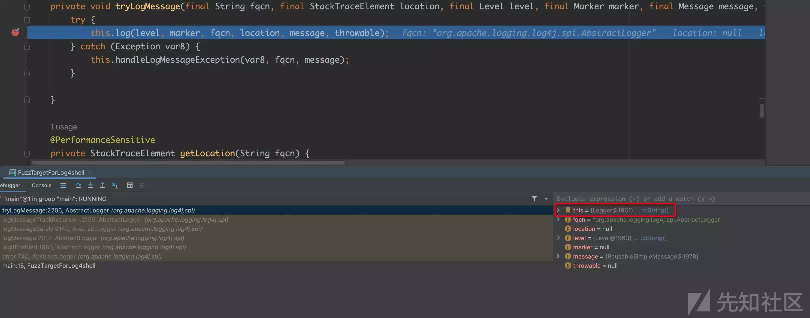](https://xzfile.aliyuncs.com/media/upload/picture/20240102200746-8aac4208-a967-1.webp)

删除其他错的边，重新查询，重复操作几次之后，会得到下面的图

[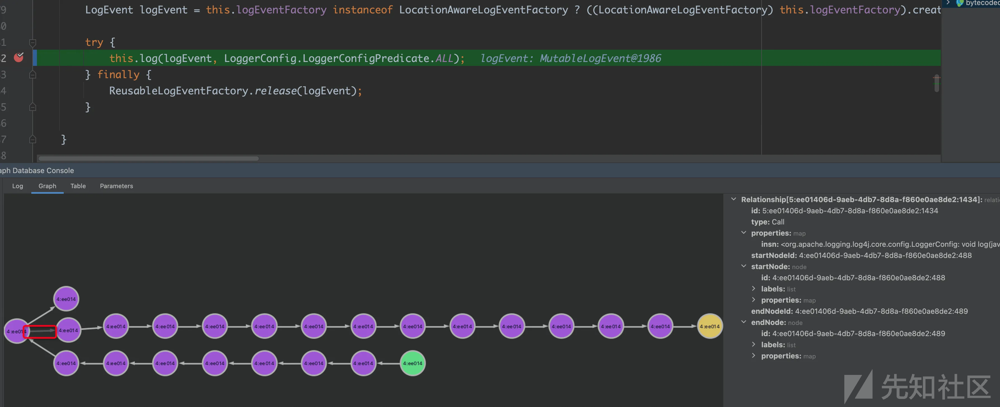](https://xzfile.aliyuncs.com/media/upload/picture/20240102200752-8e232e4c-a967-1.webp)

通过调试我们可以判断前面的边都是正确的，这时候可以换一种策略，把当前的已经排查过的点当成起点，进行查询。

[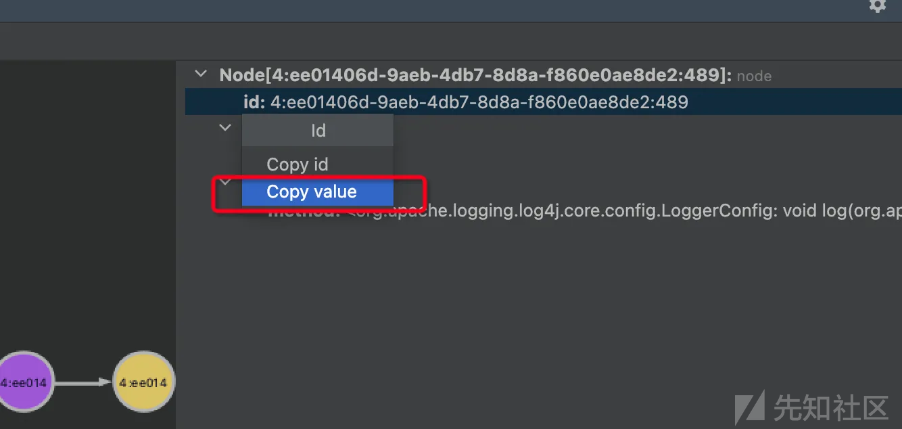](https://xzfile.aliyuncs.com/media/upload/picture/20240102200815-9bb14cc4-a967-1.webp)

执行下面的cypher语句

```plain
match (start:method) where elementId(start)="4:ee01406d-9aeb-4db7-8d8a-f860e0ae8de2:489"
match (target:sink) where target.method="<javax.naming.InitialContext: java.lang.Object lookup(java.lang.String)>"
call bytecodedl.findOnePath(start, target, 30) yield path return path
```

[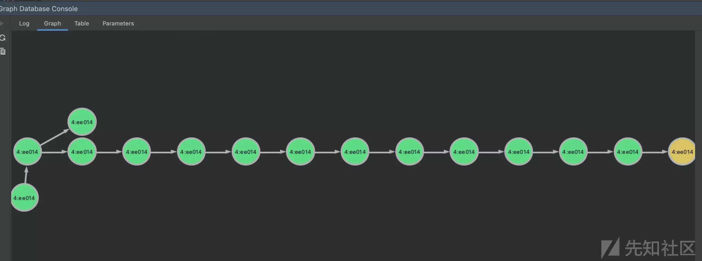](https://xzfile.aliyuncs.com/media/upload/picture/20240102200831-a544b0e6-a967-1.webp)

更换起点这种方式有两种好处

1.  可以保证排查的连续性，如果还是直接从source开始查，不一定查到的还是刚才的路径
2.  去掉前面的路径之后，可以排查更深的路径

接着探索会遇到

[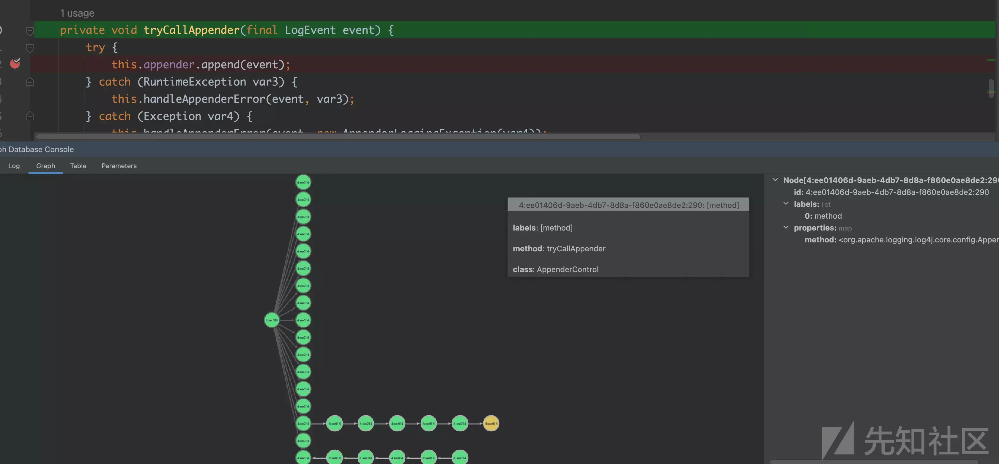](https://xzfile.aliyuncs.com/media/upload/picture/20240102200904-b8d3c43a-a967-1.webp)

[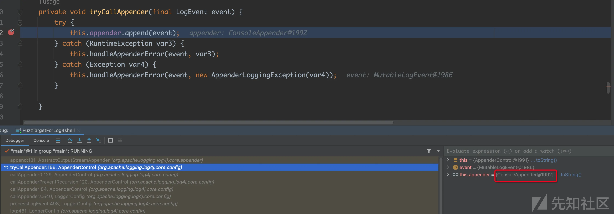](https://xzfile.aliyuncs.com/media/upload/picture/20240102200926-c61b603a-a967-1.webp)

会发现appender的实际类型是ConsoleAppender，但是排查节点的时候下一个节点里面并没有ConsoleAppender。这时候最简单的判断方式就是断点再执行一步跟进这个方法。

[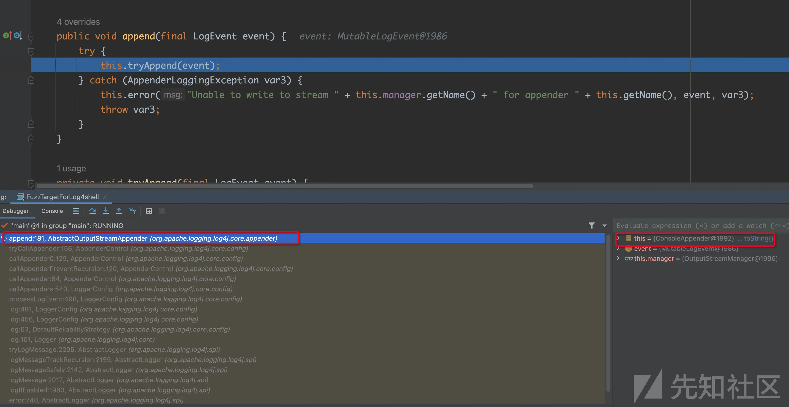](https://xzfile.aliyuncs.com/media/upload/picture/20240102201002-db7959b4-a967-1.webp)

这是因为ConsoleAppender继承了AbstractOuputStreamAppender，但是没有重载append方法。

继续排查会遇到这种情况，同一个调用点确实可能会被解析成多个callee

[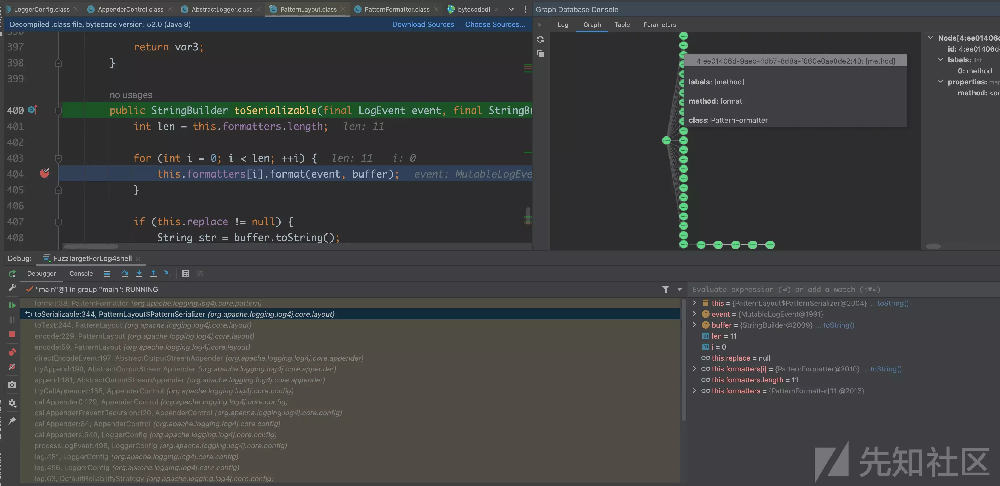](https://xzfile.aliyuncs.com/media/upload/picture/20240102201029-eb9dd9f0-a967-1.webp)

[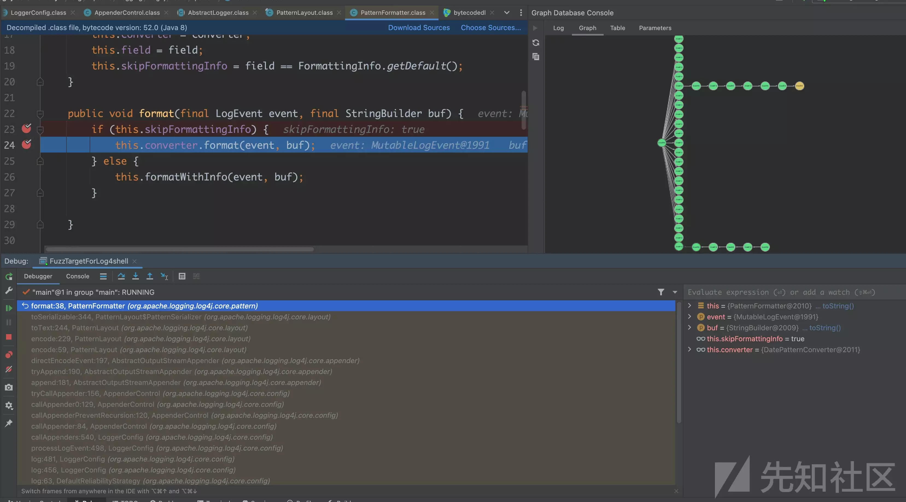](https://xzfile.aliyuncs.com/media/upload/picture/20240102201048-f6b24cc2-a967-1.webp)

通过在调试evaluation窗口执行

```plain
List<String> list = new ArrayList();
for (int j = 0; j < formatters.length; j++) {
    list.add(formatters[j].getConverter().getClass().getSimpleName());
}
return list;
```

可以得到所有可能的converter的类型

[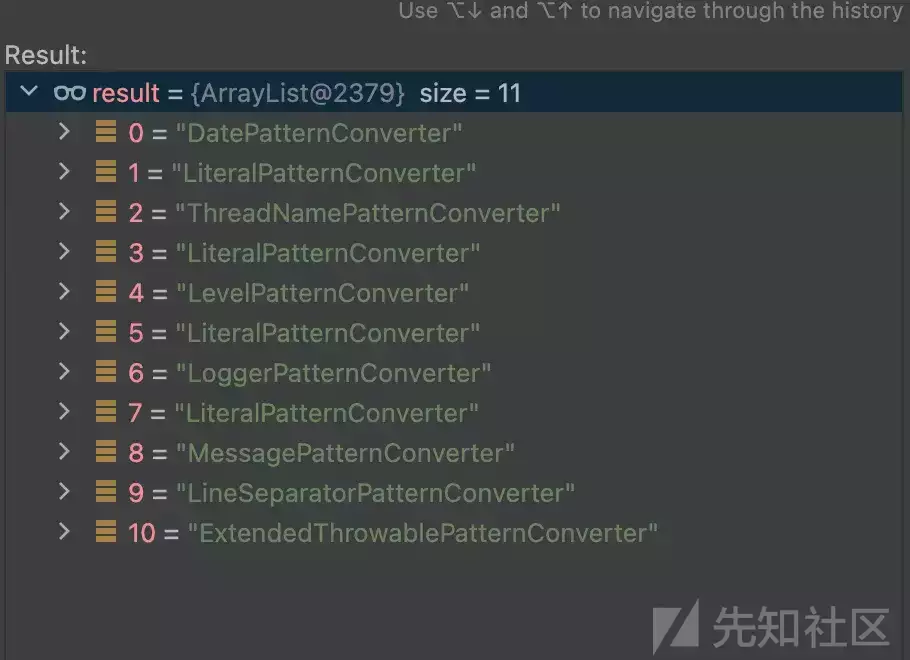](https://xzfile.aliyuncs.com/media/upload/picture/20240102201050-f869a9c0-a967-1.webp)

刚好是有MessagePatternConverter

[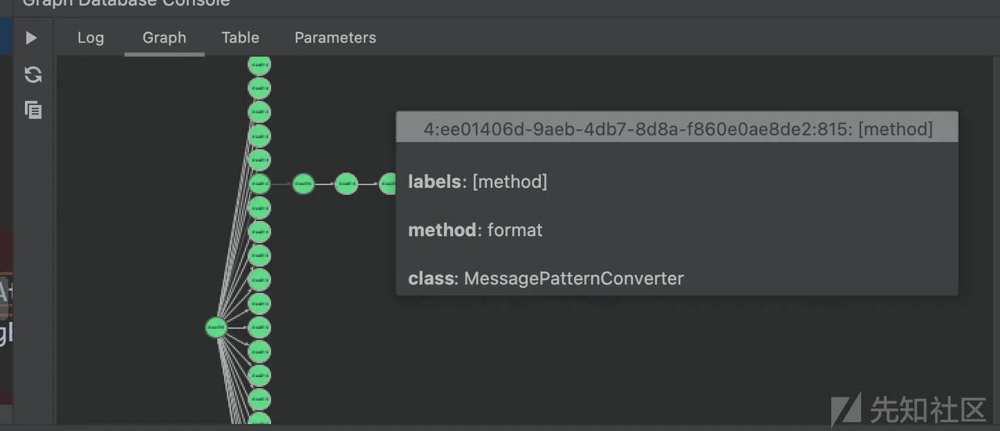](https://xzfile.aliyuncs.com/media/upload/picture/20240102201103-001103e4-a968-1.webp)

通过分析这段代码应该就能构造成payload ${dddd}

[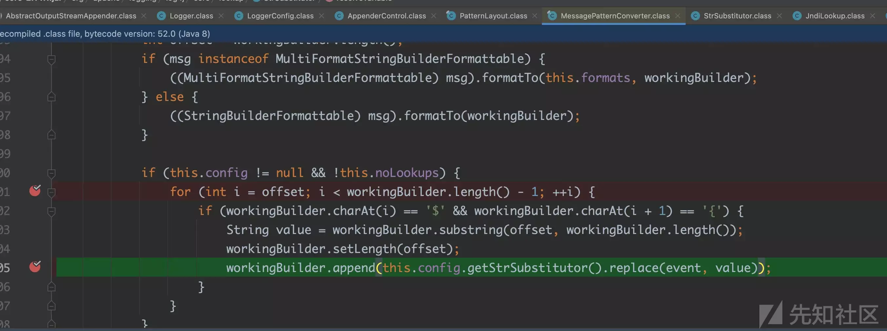](https://xzfile.aliyuncs.com/media/upload/picture/20240102201106-01f45670-a968-1.webp)

然后开始从MessagePatternConverter开始排查，会遇到下面这个分叉

[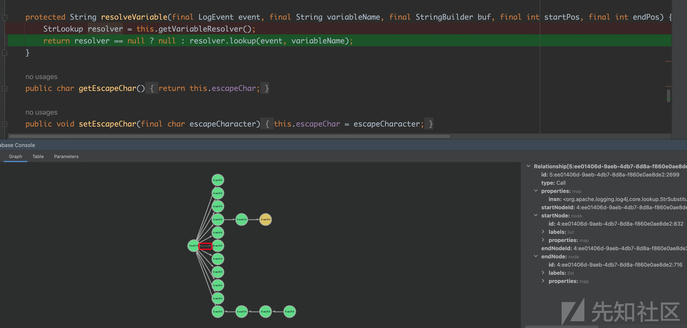](https://xzfile.aliyuncs.com/media/upload/picture/20240102201131-104d0488-a968-1.webp)

通过调试可以确定resolver类型为Interpolator

[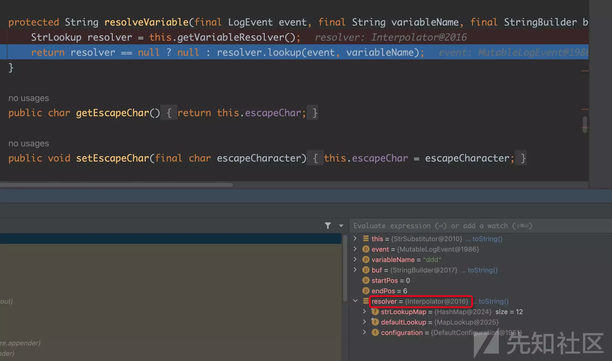](https://xzfile.aliyuncs.com/media/upload/picture/20240102201153-1d78476c-a968-1.webp)

继续进行调试，会走到下面这段代码，再结合这部分代码，就可以构造出payload `${jndi:xxx}` ，至此可以得出结论，ByteCodeDL在马后炮的情况下是可以发现log4shell漏洞的。

[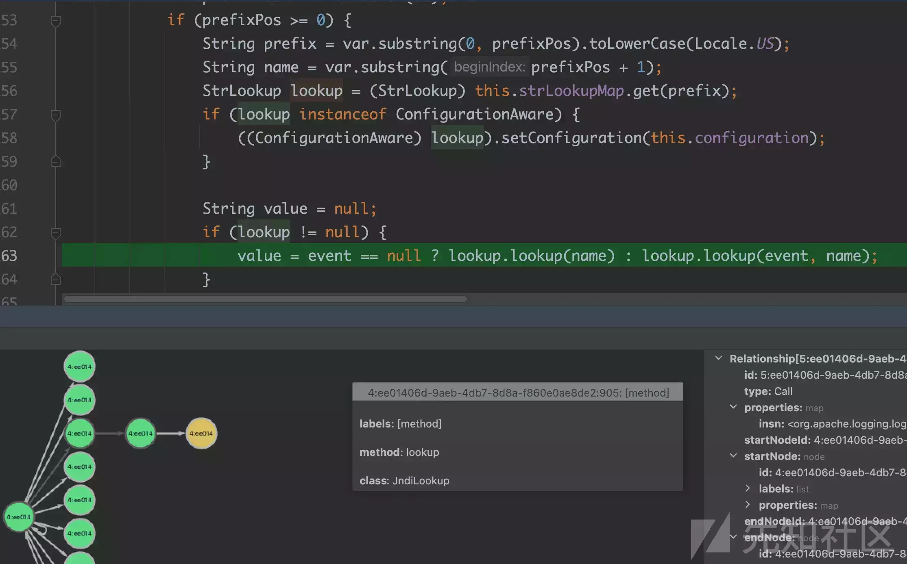](https://xzfile.aliyuncs.com/media/upload/picture/20240102201223-2fad5fda-a968-1.webp)

最后附上通过

```plain
match (start:entry)
match (end:sink) where end.method="<javax.naming.InitialContext: java.lang.Object lookup(java.lang.String)>"
call bytecodedl.biFindOnePath(start, end, 40) yield path return path;
```

[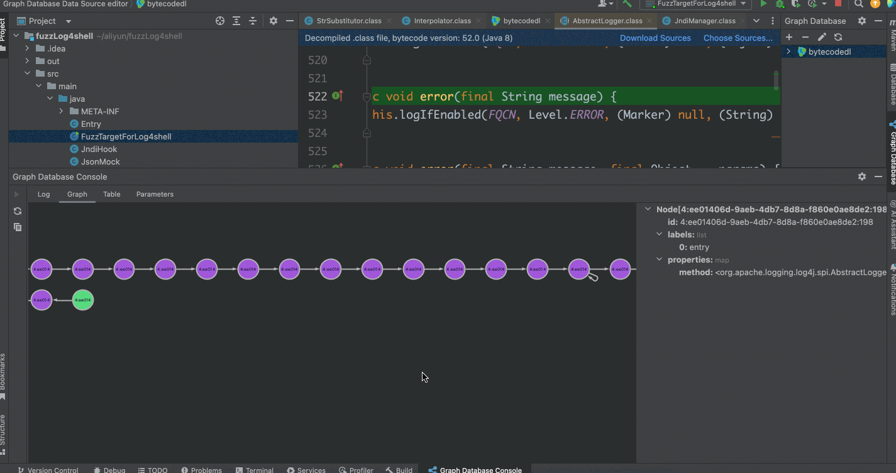](https://xzfile.aliyuncs.com/media/upload/picture/20240102184622-2b2ebc08-a95c-1.gif)

## Conclusion

从上面可以看出这套组合拳的核心功能

1.  速度较快CHA 调用图分析以及导入、查询功能
2.  将点和边和代码跳转进行绑定，更方便安全研究人员排查路径的准确
3.  通过删除不存在/错误的边，更换起点的方式可以加快排查过程

## Reference

-   [https://github.com/BytecodeDL/ByteCodeDL](https://github.com/BytecodeDL/ByteCodeDL)
-   [https://github.com/BytecodeDL/bytecodedl-pathfinder-neo4j-procedure](https://github.com/BytecodeDL/bytecodedl-pathfinder-neo4j-procedure)
-   [https://github.com/BytecodeDL/graphdb-intellij-plugin](https://github.com/BytecodeDL/graphdb-intellij-plugin)
