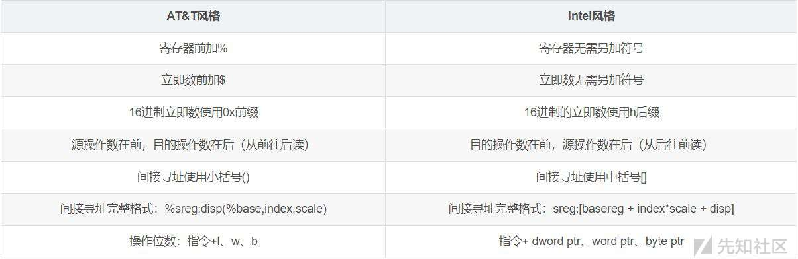

CSAPP Bomb Lab探究与解析

- - -

# CSAPP Bomb Lab探究与解析

## 具备条件

这个实验比较有意思，如果你正在学习汇编，那么这是一个对你所学的一个很好考察

-   汇编与反汇编
-   GDB调试
-   耐心与仔细

## 实验介绍

要求：分析汇编代码，找出每一关符合要求的输入，拆除炸弹

程序下载地址：[http://csapp.cs.cmu.edu/2e/labs.html](http://csapp.cs.cmu.edu/2e/labs.html)

[](https://xzfile.aliyuncs.com/media/upload/picture/20231114121431-4fbda0ae-82a4-1.png)

下载自学版本

导出汇编代码段：

```plain
objdump -d bomb >bomb_code.s
```

导出数据段：

```plain
objdump -s bomb >bomb_data.s
```

注意，这里导出的代码是AT&T风格的代码，如果不熟悉这种风格，可以在gdb里面查看汇编代码，这里说一下

### AT&T风格与Intel风格的x86汇编语法区别

[](https://xzfile.aliyuncs.com/media/upload/picture/20231114121613-8c44cebc-82a4-1.jpg)

## 解题过程

### Phase\_1

先查看main函数调用phase\_1函数的汇编代码：

```plain
400e28:   bf 78 23 40 00          mov    $0x402378,%edi         //将某个字符串地址移到寄存器edi
  400e2d:   e8 de fc ff ff          callq  400b10 <puts@plt>      //调用puts函数输出
  400e32:   e8 67 06 00 00          callq  40149e <read_line>     //调用read_line函数输入
  400e37:   48 89 c7                mov    %rax,%rdi              //将rax中赋值给rdi
  400e3a:   e8 a1 00 00 00          callq  400ee0 <phase_1>       //调用phase_1
```

**涉及知识点**：**在继续分析前需要熟悉下gcc在unix平台下编译x64指令的 调用约定fastcall：优先使用寄存器传递函数参数，传参顺序为rdi、rsi、rdx、rcx、r8、r9，多余的参数从右至左依次入栈；函数返回值保存在rax；栈帧由被调用者清理；调用者保存寄存器(易失)包括rax、rdi、rsi、rcx、rdx、r8、r9、r10、r11；被调用者保存寄存器包括rbx、rsp、rbp、r12、r13、r14、r15。以上约定均遵守 System V ABI 规范。**

因此puts输入的是地址0x402378中存储的字符串，read\_line函数返回的值(也就是我们输入的值)存储在rax。接着又将rax赋值给rdi，因此phase\_1函数调用中，参数保存在rdi。(这些都是最基本的知识，后面关卡不再详述)

查看phase\_1汇编代码：

```plain
0000000000400ee0 <phase_1>:
  400ee0:   48 83 ec 08             sub    $0x8,%rsp                 //给栈分配8字节
  400ee4:   be 00 24 40 00          mov    $0x402400,%esi            //将某个字符串地址存放在esi
  400ee9:   e8 4a 04 00 00          callq  401338 <strings_not_equal> //调用函数
  400eee:   85 c0                   test   %eax,%eax                  //检查eax是否为0，并影响标志寄存器的ZF位
  400ef0:   74 05                   je     400ef7 <phase_1+0x17>      //ZF被置为则跳转，没有置位则调用函数
  400ef2:   e8 43 05 00 00          callq  40143a <explode_bomb>      
  400ef7:   48 83 c4 08             add    $0x8,%rsp                  //保持堆栈平衡
  400efb:   c3                      retq
```

调用函数strings\_not\_equal的两个参数存放在rdi和rsi，分别是我们输入的字符串和另一个不明字符串地址(根据表面意思应该是需要比较的目标字符串)；返回的结果存放在eax，如果eax为0，即函数返回结果为0，test运算后，ZF则为1，则跳转到<phase\_1+0x17>，否则执行函数explode\_bomb

**知识点：test指令运算结果为0，就将标志位ZF置为1；je表示的的是等于则转移，检测的是标志位ZF=1**

在反汇编代码之前，先查看地址0x402400中的值是什么：(可以在开始导出的数据文件中查询，也可以在gdb调试中查看)

```plain
pwndbg> x /s 0x402400
0x402400:   "Border relations with Canada have never been better."
```

这么短的代码，使者反汇编以下：

```plain
void phase_1(char *input){
    if(strings_not_equal(input,"Border relations with Canada have never been better."))
    {
        explode_bomb();
    }
}
```

所以这一关的答案很显然。

分析其他函数strings\_not\_equal，汇编代码如下：

```plain
0000000000401338 <strings_not_equal>:
  401338:   41 54                   push   %r12                          //被调用者保护寄存器入栈
  40133a:   55                      push   %rbp
  40133b:   53                      push   %rbx
  40133c:   48 89 fb                mov    %rdi,%rbx             //先将两个参数保存，以免再函数执行中数据被破坏
  40133f:   48 89 f5                mov    %rsi,%rbp
  401342:   e8 d4 ff ff ff          callq  40131b <string_length>        //调用函数
  401347:   41 89 c4                mov    %eax,%r12d                  //将函数返回值存到r12
  40134a:   48 89 ef                mov    %rbp,%rdi                 //把保存后的值继续赋给rdi，这是目标字符串
  40134d:   e8 c9 ff ff ff          callq  40131b <string_length>
  401352:   ba 01 00 00 00          mov    $0x1,%edx                 //将1赋值给edx                 
  401357:   41 39 c4                cmp    %eax,%r12d                 //第二次调用的返回值跟前一次比较
  40135a:   75 3f                   jne    40139b <strings_not_equal+0x63>//不相等则跳转
  40135c:   0f b6 03                movzbl (%rbx),%eax //零扩展字节拷贝，即将rbx指向地址处的一个字节(刚好存一个字符)传送至eax寄存器，高位补0
  40135f:   84 c0                   test   %al,%al     //判断al是否为0，这里应该是
  401361:   74 25                   je     401388 <strings_not_equal+0x50>//如果al为0x00则跳转
  401363:   3a 45 00                cmp    0x0(%rbp),%al    //输入字符串和目标字符串比较
  401366:   74 0a                   je     401372 <strings_not_equal+0x3a>//相等则跳转继续比较
  401368:   eb 25                   jmp    40138f <strings_not_equal+0x57>//不相等则跳转到结束
  40136a:   3a 45 00                cmp    0x0(%rbp),%al   //这是循环结构的开始
  40136d:   0f 1f 00                nopl   (%rax)  //编译器开启优化后使指令按字对齐，减少取指令的时钟周期
  401370:   75 24                   jne    401396 <strings_not_equal+0x5e>
  401372:   48 83 c3 01             add    $0x1,%rbx    //为比较下一个字符
  401376:   48 83 c5 01             add    $0x1,%rbp
  40137a:   0f b6 03                movzbl (%rbx),%eax
  40137d:   84 c0                   test   %al,%al    //判断al是否为0
  40137f:   75 e9                   jne    40136a <strings_not_equal+0x32>//不为0则跳转
  401381:   ba 00 00 00 00          mov    $0x0,%edx
  401386:   eb 13                   jmp    40139b <strings_not_equal+0x63>
  401388:   ba 00 00 00 00          mov    $0x0,%edx
  40138d:   eb 0c                   jmp    40139b <strings_not_equal+0x63>
  40138f:   ba 01 00 00 00          mov    $0x1,%edx
  401394:   eb 05                   jmp    40139b <strings_not_equal+0x63>
  401396:   ba 01 00 00 00          mov    $0x1,%edx
  40139b:   89 d0                   mov    %edx,%eax        //返回值
  40139d:   5b                      pop    %rbx
  40139e:   5d                      pop    %rbp
  40139f:   41 5c                   pop    %r12
  4013a1:   c3                      retq
```

其实这一部分代码对于初学者来讲很难看懂，但是这是最简单最基本的汇编代码了，且跳转流程不多，下面是反汇编的C语言代码：

```plain
int strings_not_equal(char *input,char *target){
    if(string_length(input)!=string_length(target)){
        return 1;
    }
    if(*input=='\0')
    {
        return 0;
    }
    while(1){
        if(*input!=*target)
            return 1;
        input++;
        target++;
        if(*input!=0)
            return 0;
    }
}
```

是不是感受到了汇编的魅力所在，接着继续分析string\_length函数(通过对strings\_not\_equal函数的分析，发现此函数只要一个参数)：

string\_length函数的汇编代码：

```plain
000000000040131b <string_length>:
  40131b:   80 3f 00                cmpb   $0x0,(%rdi)     //首先将参数跟0比较
  40131e:   74 12                   je     401332 <string_length+0x17>//如果为0，则跳转结束
  401320:   48 89 fa                mov    %rdi,%rdx     
  401323:   48 83 c2 01             add    $0x1,%rdx     
  401327:   89 d0                   mov    %edx,%eax
  401329:   29 f8                   sub    %edi,%eax
  40132b:   80 3a 00                cmpb   $0x0,(%rdx)
  40132e:   75 f3                   jne    401323 <string_length+0x8>
  401330:   f3 c3                   repz retq 
  401332:   b8 00 00 00 00          mov    $0x0,%eax
  401337:   c3                      retq
```

反汇编成C语言代码：

```plain
int string_length(char *input){
    if(*input=='\0')
        return 0;
    int count=0;
    while(1){
        count++;
        if(input[count]=='\0')
            break;
    }
    return count;
}
```

再来分析explode\_bomb函数，查看器汇编代码：

```plain
000000000040143a <explode_bomb>:
  40143a:   48 83 ec 08             sub    $0x8,%rsp
  40143e:   bf a3 25 40 00          mov    $0x4025a3,%edi       //将地址为0x4025a3的内容输出
  401443:   e8 c8 f6 ff ff          callq  400b10 <puts@plt>
  401448:   bf ac 25 40 00          mov    $0x4025ac,%edi       //将地址为0x4025ac的内容输出
  40144d:   e8 be f6 ff ff          callq  400b10 <puts@plt>
  401452:   bf 08 00 00 00          mov    $0x8,%edi
  401457:   e8 c4 f7 ff ff          callq  400c20 <exit@plt>    //调用exit，返回码为8
```

反汇编后的C语言代码：

```plain
void explode_bomb(){
    puts("BOOM!!!");
    puts("The bomb has blown up.");
    exit(8);
}
```

所以，**Phase\_1的通关密码是：Border relations with Canada have never been better.**

#### 体会

通过这一关的训练，就能感受到基础汇编代码的分析基本流程。可以由外到内，也可以由内到外，里外结合也可以，只要能够找到适合自己的分析方法，打通程序执行的流程和分析基本的功能。这里还是比较简单，因为函数的功能在函数名中能够体现出来，且函数也并不复杂，但是最基本的程序才能让自己的基础知识发挥的更有作用。在实际分析汇编的过程中，往往没有这么多向上面这么多有利条件，但是利用的最基本的知识没有变，只是程序变得复杂了，内部跳转变多了，看来看去就这么几条常见的汇编指令，确能实现一个如此强大的程序，所以在分析的过程中最好能逐步理清思路，特别是跳转，最好画一个流程图。

如果能够通过汇编代码还原成源C代码，那么你的汇编已经有一定的水平了，所以对于这些简单的程序，尽量自己动手反汇编，后期熟练了可能只需要看懂就行。

多调试，看看代码是怎么一步一步执行的，值是怎么传递的，对照汇编指令一步一步走，你就会发现这其中的魅力

### Phase\_2

查看main函数中调用phase\_2的汇编代码：

```plain
400e44: bf a8 23 40 00          mov    $0x4023a8,%edi
  400e49:   e8 c2 fc ff ff          callq  400b10 <puts@plt>
  400e4e:   e8 4b 06 00 00          callq  40149e <read_line>
  400e53:   48 89 c7                mov    %rax,%rdi
  400e56:   e8 a1 00 00 00          callq  400efc <phase_2>
```

同样，将我们的输入放在了rdi中，这样phase\_2的参数就是我们输入的值了

查看phase\_2汇编代码：

```plain
0000000000400efc <phase_2>:
  400efc:   55                      push   %rbp
  400efd:   53                      push   %rbx
  400efe:   48 83 ec 28             sub    $0x28,%rsp      //开辟栈空间
  400f02:   48 89 e6                mov    %rsp,%rsi       //将此时的esp地址放入到rsi作为参数
  400f05:   e8 52 05 00 00          callq  40145c <read_six_numbers>  //调用函数
  400f0a:   83 3c 24 01             cmpl   $0x1,(%rsp)                //比较此时esp中的内容是否为1
  400f0e:   74 20                   je     400f30 <phase_2+0x34>     //是则跳转，不是则爆炸
  400f10:   e8 25 05 00 00          callq  40143a <explode_bomb>
  400f15:   eb 19                   jmp    400f30 <phase_2+0x34>     
  400f17:   8b 43 fc                mov    -0x4(%rbx),%eax          //(rbx-4)的值给eax
  400f1a:   01 c0                   add    %eax,%eax                //eax中的值相加
  400f1c:   39 03                   cmp    %eax,(%rbx)              //比较eax的值和(rbx)
  400f1e:   74 05                   je     400f25 <phase_2+0x29>    //相等则跳转到16行
  400f20:   e8 15 05 00 00          callq  40143a <explode_bomb>    //不相等则爆炸
  400f25:   48 83 c3 04             add    $0x4,%rbx                //rbx加4
  400f29:   48 39 eb                cmp    %rbp,%rbx              //在21行中给定了rbp，也就是第6个数后面的地址
  400f2c:   75 e9                   jne    400f17 <phase_2+0x1b>    //不相等则继续执行
  400f2e:   eb 0c                   jmp    400f3c <phase_2+0x40>    //否则比较结束，跳转结束程序
  400f30:   48 8d 5c 24 04          lea    0x4(%rsp),%rbx         //rsp+4的地址给rbx
  400f35:   48 8d 6c 24 18          lea    0x18(%rsp),%rbp        //rsp+24的地址给rbp
  400f3a:   eb db                   jmp    400f17 <phase_2+0x1b>  //跳转到11行
  400f3c:   48 83 c4 28             add    $0x28,%rsp             //维护堆栈指针平衡
  400f40:   5b                      pop    %rbx
  400f41:   5d                      pop    %rbp
  400f42:   c3                      retq
```

程序的功能还是很简单的，首先开辟开辟一段栈空间，然后调用read\_six\_numbers函数填充栈空间，从函数名来看表示输入6个数，但是即使没有函数的表面意思，通过下面的分析也可得知栈中有6个数，因为此函数比较了6次。而比较的过程中发现，都是前一个数的两倍和后一个数比较，起始的数为1，可见答案很清晰。

反汇编成C语言代码：

```plain
void phase_2(char *input){
    int arr[6];
    read_six_numbers(input, arr);
    if(arr[0]!=1){
        explode_bomb();
    }
    for(int i=1; i<6; i++){
        if(arr[i]!=2*arr[i-1]){
            explode_bomb();
        }
    }
}
```

下面分析read\_six\_numbers函数的真正功能，他的参数有我们输入字符串的存储地址和栈的esp，即栈顶地址

汇编代码如下：

```plain
000000000040145c <read_six_numbers>:
  40145c:   48 83 ec 18             sub    $0x18,%rsp        //开辟栈空间
  401460:   48 89 f2                mov    %rsi,%rdx         //将phase_2的栈空间地址赋给rdx
  401463:   48 8d 4e 04             lea    0x4(%rsi),%rcx    //rsi+4的地址给rcx
  401467:   48 8d 46 14             lea    0x14(%rsi),%rax   //rsi+20的地址给rax
  40146b:   48 89 44 24 08          mov    %rax,0x8(%rsp)    //rax给rsp+8
  401470:   48 8d 46 10             lea    0x10(%rsi),%rax   //(rsi+16)的值给rax
  401474:   48 89 04 24             mov    %rax,(%rsp)       //rax给(rsp)
  401478:   4c 8d 4e 0c             lea    0xc(%rsi),%r9     //rsi+12的地址给r9
  40147c:   4c 8d 46 08             lea    0x8(%rsi),%r8     //rsi+8地址给r8
  401480:   be c3 25 40 00          mov    $0x4025c3,%esi    //格式化字符串的地址给esi
  401485:   b8 00 00 00 00          mov    $0x0,%eax         //清0
  40148a:   e8 61 f7 ff ff          callq  400bf0 <__isoc99_sscanf@plt>
  40148f:   83 f8 05                cmp    $0x5,%eax         //读取的长度与5比较
  401492:   7f 05                   jg     401499 <read_six_numbers+0x3d>    //大于则跳转
  401494:   e8 a1 ff ff ff          callq  40143a <explode_bomb>    //否则爆炸
  401499:   48 83 c4 18             add    $0x18,%rsp
  40149d:   c3                      retq
```

0x4025c3中的内容：

```plain
pwndbg> x /s 0x4025c3
0x4025c3:   "%d %d %d %d %d %d"
```

是不是觉得有点模糊呢，callq 400bf0 \\[\_\_isoc99\_sscanf@plt](mailto:__isoc99_sscanf@plt)这句之前的代码都是为了传递参数。从调用从上往下找相应的寄存器。rdi存储的是输入的字符串地址，rsi存储的是0x4025c3，即格式化字符串的地址。rdx存储的是phase\_2的栈空间地址，即&arr\[0\]，rcx即是&arr\[1\],r8即是&arr\[2\],r9即是&arr\[3\],寄存器用完了，其他参数的地址就会存储在栈上，rsp上是&arr\[4\],rsp+8上是&arr\[5\]

反汇编成C语言代码：

```plain
void read_six_numbers(char *input, int* arr){
    int count = sscanf(input, "%d %d %d %d %d %d", &arr[0], &arr[1], &arr[2], &arr[3], &arr[4], &arr[5]);
    if(count>5)
        return;
    explode_bomb();
}
```

所以第二关的通关密码是：**1 2 4 8 16 32**

知识点：

```plain
//从字符串读取格式化输入
int sscanf(const char *str, const char *format, ...)
str:C字符串
format:格式化字符串，类似于%d%d等
附加参数:指针，对象类型由 format 字符串中相应的 % 标签指定，参数与 % 标签的顺序相同
返回值:如果成功，该函数返回成功匹配和赋值的个数。如果到达文件末尾或发生读错误，则返回 EOF
参考链接:https://www.runoob.com/cprogramming/c-function-sscanf.html
```

完成这关是不是有种成就感，这里涉及到了栈的相关知识，对于调用函数，搞清楚传递的参数；对于执行流程，理清楚跳转；

### Phase\_3

慢慢熟悉了套路，查看main函数中调用Phase\_3的情况：

```plain
400e60:    bf ed 22 40 00          mov    $0x4022ed,%edi
  400e65:   e8 a6 fc ff ff          callq  400b10 <puts@plt>
  400e6a:   e8 2f 06 00 00          callq  40149e <read_line>
  400e6f:   48 89 c7                mov    %rax,%rdi
  400e72:   e8 cc 00 00 00          callq  400f43 <phase_3>
```

同样是我们的输入作为参数调用phase\_3

分析phase\_3的汇编代码：

```plain
0000000000400f43 <phase_3>:
  400f43:   48 83 ec 18             sub    $0x18,%rsp                 //开辟栈空间
  400f47:   48 8d 4c 24 0c          lea    0xc(%rsp),%rcx             
  400f4c:   48 8d 54 24 08          lea    0x8(%rsp),%rdx
  400f51:   be cf 25 40 00          mov    $0x4025cf,%esi
  400f56:   b8 00 00 00 00          mov    $0x0,%eax                 //清0
  400f5b:   e8 90 fc ff ff          callq  400bf0 <__isoc99_sscanf@plt>    //调用函数，前面的代码都是参数部分
  400f60:   83 f8 01                cmp    $0x1,%eax                 //返回值与1比较     
  400f63:   7f 05                   jg     400f6a <phase_3+0x27>     //大于1则跳转，否则爆炸
  400f65:   e8 d0 04 00 00          callq  40143a <explode_bomb>
  400f6a:   83 7c 24 08 07          cmpl   $0x7,0x8(%rsp)             //(rsp+8)和7比较
  400f6f:   77 3c                   ja     400fad <phase_3+0x6a>      //无符号大于则跳转爆炸
  400f71:   8b 44 24 08             mov    0x8(%rsp),%eax             //将(rsp+8)给eax
  400f75:   ff 24 c5 70 24 40 00    jmpq   *0x402470(,%rax,8)     //见下面解析，等价于jmp 0x402470+8*%rax   
  400f7c:   b8 cf 00 00 00          mov    $0xcf,%eax             //从这开始就是switch里面的内容，rax=0
  400f81:   eb 3b                   jmp    400fbe <phase_3+0x7b>  
  400f83:   b8 c3 02 00 00          mov    $0x2c3,%eax                  //rax=2
  400f88:   eb 34                   jmp    400fbe <phase_3+0x7b>
  400f8a:   b8 00 01 00 00          mov    $0x100,%eax                  //rax=3
  400f8f:   eb 2d                   jmp    400fbe <phase_3+0x7b>
  400f91:   b8 85 01 00 00          mov    $0x185,%eax                  //rax=4
  400f96:   eb 26                   jmp    400fbe <phase_3+0x7b>
  400f98:   b8 ce 00 00 00          mov    $0xce,%eax                   //rax=5
  400f9d:   eb 1f                   jmp    400fbe <phase_3+0x7b>
  400f9f:   b8 aa 02 00 00          mov    $0x2aa,%eax                  //rax=6
  400fa4:   eb 18                   jmp    400fbe <phase_3+0x7b>
  400fa6:   b8 47 01 00 00          mov    $0x147,%eax                  //rax=7
  400fab:   eb 11                   jmp    400fbe <phase_3+0x7b>        
  400fad:   e8 88 04 00 00          callq  40143a <explode_bomb>
  400fb2:   b8 00 00 00 00          mov    $0x0,%eax
  400fb7:   eb 05                   jmp    400fbe <phase_3+0x7b>
  400fb9:   b8 37 01 00 00          mov    $0x137,%eax                  //rax=1
  400fbe:   3b 44 24 0c             cmp    0xc(%rsp),%eax               //将(rsp+12)与赋值的eax比较
  400fc2:   74 05                   je     400fc9 <phase_3+0x86>        //相等则跳转，否则爆炸
  400fc4:   e8 71 04 00 00          callq  40143a <explode_bomb>
  400fc9:   48 83 c4 18             add    $0x18,%rsp
  400fcd:   c3                      retq
```

jmpq 0x402470(,%rax,8)这条指令比较难理解，也蕴含着一个知识点。目的操作数使用了比较复杂的间接寻址，跳转的地址为0x402470+8*%rax，所以这条指令等价于jmp 0x402470+8\\*%rax 。**编译器通过这种方式实现地址索引表(也叫跳转表)，用于 switch关键字 的编译实现，即将switch所有分支的指令跳转地址在编译期存放于数据段，然后执行时根据case值动态读取地址索引表并执行对应分支的跳转。**

0x4025cf中的值：

```plain
pwndbg> x /s 0x4025cf
0x4025cf:   "%d %d"
```

0x402470中的值：

```plain
pwndbg> x /8gx 0x402470
0x402470:   0x0000000000400f7c  0x0000000000400fb9
0x402480:   0x0000000000400f83  0x0000000000400f8a
0x402490:   0x0000000000400f91  0x0000000000400f98
0x4024a0:   0x0000000000400f9f  0x0000000000400fa6
```

反汇编成C代码：

```plain
void phase_3(char *input){
    int a, b;
    int count = sscanf(input, "%d %d", &a, &b);
    if(count<=1)
        explode_bomb();
    if(a>7)
        explode_bomb();
    int key = a;
    switch (a){
        case 0: key = 0xcf; break;
        case 1: key = 0x137; break;
        case 2: key = 0x2c3; break;
        case 3: key = 0x100; break;
        case 4: key = 0x185; break;
        case 5: key = 0xce; break;
        case 6: key = 0x2aa; break;
        case 7: key = 0x147; break;
        default: explode_bomb(); key=0;
    }
    if(b!=key){
        explode_bomb();
    }
}
```

故第三关的答案有8组，分别是**0 207、1 311、2 707、3 256、4 389、5 206、6 682、7 327**

第三关主要考察了一个switch选择结构，将switch的分支跳转地址存储在数据段，然后通过一个动态的值来控制实际程序执行过程中的跳转。

### Phase\_4

查看调用phase\_4的main函数：

```plain
400e7c:    bf 0b 23 40 00          mov    $0x40230b,%edi
  400e81:   e8 8a fc ff ff          callq  400b10 <puts@plt>
  400e86:   e8 13 06 00 00          callq  40149e <read_line>
  400e8b:   48 89 c7                mov    %rax,%rdi
  400e8e:   e8 79 01 00 00          callq  40100c <phase_4>
```

还是输入作为参数

查看phase\_4的汇编代码：

```plain
000000000040100c <phase_4>:
  40100c:   48 83 ec 18             sub    $0x18,%rsp                //开辟栈空间
  401010:   48 8d 4c 24 0c          lea    0xc(%rsp),%rcx            
  401015:   48 8d 54 24 08          lea    0x8(%rsp),%rdx
  40101a:   be cf 25 40 00          mov    $0x4025cf,%esi
  40101f:   b8 00 00 00 00          mov    $0x0,%eax
  401024:   e8 c7 fb ff ff          callq  400bf0 <__isoc99_sscanf@plt>   //调用sscanf，前面都是参数部分
  401029:   83 f8 02                cmp    $0x2,%eax                  //返回值，即输入的参数是不是2
  40102c:   75 07                   jne    401035 <phase_4+0x29>      //不是则跳转爆炸，是则继续
  40102e:   83 7c 24 08 0e          cmpl   $0xe,0x8(%rsp)             //(rsp+8)与14比较
  401033:   76 05                   jbe    40103a <phase_4+0x2e>      //小于等于则跳转，否则爆炸
  401035:   e8 00 04 00 00          callq  40143a <explode_bomb>
  40103a:   ba 0e 00 00 00          mov    $0xe,%edx                  //为调用fun4做准备
  40103f:   be 00 00 00 00          mov    $0x0,%esi
  401044:   8b 7c 24 08             mov    0x8(%rsp),%edi
  401048:   e8 81 ff ff ff          callq  400fce <func4>             //调用
  40104d:   85 c0                   test   %eax,%eax                  //对返回值进行测试
  40104f:   75 07                   jne    401058 <phase_4+0x4c>      //如果返回值为0则继续，否则跳转爆炸
  401051:   83 7c 24 0c 00          cmpl   $0x0,0xc(%rsp)             //(rsp+12)与0比较
  401056:   74 05                   je     40105d <phase_4+0x51>      //不相等则爆炸
  401058:   e8 dd 03 00 00          callq  40143a <explode_bomb>
  40105d:   48 83 c4 18             add    $0x18,%rsp
  401061:   c3                      retq
```

0x4025cf中的内容：

```plain
pwndbg> x /s 0x4025cf
0x4025cf:   "%d %d"
```

反汇编成C代码：

```plain
void phase_4(char *input){
    int a, b;
    int count = sscanf(input, "%d %d", &a, &b);
    if(count!=2)
        explode_bomb();
    if(a>14)
        explode_bomb();
    if(fun4(a,0,14))
        explode_bomb();
    if(b!=0)
        explode_bomb();
}
```

由上面分析可知，fun4的参数分别是第一个输入的整数、0和14

分析函数fun4：

```plain
0000000000400fce <func4>:
  400fce:   48 83 ec 08             sub    $0x8,%rsp        //开辟栈空间
  400fd2:   89 d0                   mov    %edx,%eax        //eax=14
  400fd4:   29 f0                   sub    %esi,%eax        //eax=14-0
  400fd6:   89 c1                   mov    %eax,%ecx        //ecx=14
  400fd8:   c1 e9 1f                shr    $0x1f,%ecx       //逻辑右移31位
  400fdb:   01 c8                   add    %ecx,%eax
  400fdd:   d1 f8                   sar    %eax             //算数右移
  400fdf:   8d 0c 30                lea    (%rax,%rsi,1),%ecx   将rax+rsi*1给ecx
  400fe2:   39 f9                   cmp    %edi,%ecx        //输入的值与ecx比较
  400fe4:   7e 0c                   jle    400ff2 <func4+0x24>  //小于等于则跳转
  400fe6:   8d 51 ff                lea    -0x1(%rcx),%edx    //rcx-1给edx
  400fe9:   e8 e0 ff ff ff          callq  400fce <func4>     //再调用该程序
  400fee:   01 c0                   add    %eax,%eax          //返回值相加
  400ff0:   eb 15                   jmp    401007 <func4+0x39>     //跳转结束程序
  400ff2:   b8 00 00 00 00          mov    $0x0,%eax           //eax=0
  400ff7:   39 f9                   cmp    %edi,%ecx           //比较edi和ecx
  400ff9:   7d 0c                   jge    401007 <func4+0x39>    //大于等于则跳转结束程序
  400ffb:   8d 71 01                lea    0x1(%rcx),%esi         //rcx+1给esi
  400ffe:   e8 cb ff ff ff          callq  400fce <func4>         //再调用该函数
  401003:   8d 44 00 01             lea    0x1(%rax,%rax,1),%eax
  401007:   48 83 c4 08             add    $0x8,%rsp
  40100b:   c3                      retq
```

这个程序代码有点...，难度是有的，但也要尝试反汇编：

```plain
int func4(int a,int b, int c){
    int temp;
    temp=c-b;
    int value;
    /*
    value=temp;
    value=(unsigned int)value>>31;
    temp=temp+value;
    temp=temp>>1;
    value=temp+b;
    */
    //上面的这些可以转化成一句
    value = (temp+(unsigned int)temp>>31)>>1+b;
    if(value<=a){
        if(value>=a){
            return 0;
        }
        b=value-1;
        return func4(a,b,c)*2+1;
    }
    return 2*func4(a,b,value-1);
}
```

起始按照汇编语言一步一步写下来也不难，因次，我们要让返回的结果为0，b=0，c=14，求a？

当b=0且c>0时，value=c>>1=7，因此当a=7时，会返回0，得到第一组解(7,0)；当a<7时,就要使得2*func4(a,0,6)=0,则求解的a=3或1或0，则有多组解，分别为(3,0)，(1,0)，(0,0)；当a>7时，要使得2\\*func4(a,6,14)+1=0,不可能成立，故排除；

因此，phase\_4有4组答案：**7 0、3 0、1 0、0 0**

此关卡的知识点主要在于shr和sar，shr是逻辑右移，相当于无符号数右移；sar是算术右移，相当于有符号数右移；

func4代码可能复杂一些，里面带有函数嵌套，不过按照汇编一步一步来，还是能够还原的。

### Phase\_5

查看main函数后，还是以输入作为参数

直接查看phase\_5函数汇编代码：

```plain
0000000000401062 <phase_5>:
  401062:   53                      push   %rbx
  401063:   48 83 ec 20             sub    $0x20,%rsp
  401067:   48 89 fb                mov    %rdi,%rbx
  40106a:   64 48 8b 04 25 28 00    mov    %fs:0x28,%rax
  401071:   00 00 
  401073:   48 89 44 24 18          mov    %rax,0x18(%rsp)
  401078:   31 c0                   xor    %eax,%eax                   //清零操作
  40107a:   e8 9c 02 00 00          callq  40131b <string_length>      //计算输入的长度
  40107f:   83 f8 06                cmp    $0x6,%eax                   //比较长度是否为6
  401082:   74 4e                   je     4010d2 <phase_5+0x70>       //是则跳转到32行
  401084:   e8 b1 03 00 00          callq  40143a <explode_bomb>       //否则爆炸
  401089:   eb 47                   jmp    4010d2 <phase_5+0x70>
  40108b:   0f b6 0c 03             movzbl (%rbx,%rax,1),%ecx          //将rbx+rax*1的一个字节给ecx，高位补0
  40108f:   88 0c 24                mov    %cl,(%rsp)                  
  401092:   48 8b 14 24             mov    (%rsp),%rdx
  401096:   83 e2 0f                and    $0xf,%edx                   //逻辑与
  401099:   0f b6 92 b0 24 40 00    movzbl 0x4024b0(%rdx),%edx
  4010a0:   88 54 04 10             mov    %dl,0x10(%rsp,%rax,1)
  4010a4:   48 83 c0 01             add    $0x1,%rax
  4010a8:   48 83 f8 06             cmp    $0x6,%rax
  4010ac:   75 dd                   jne    40108b <phase_5+0x29>
  4010ae:   c6 44 24 16 00          movb   $0x0,0x16(%rsp)             //将栈中后面的内容置为0
  4010b3:   be 5e 24 40 00          mov    $0x40245e,%esi
  4010b8:   48 8d 7c 24 10          lea    0x10(%rsp),%rdi
  4010bd:   e8 76 02 00 00          callq  401338 <strings_not_equal>
  4010c2:   85 c0                   test   %eax,%eax
  4010c4:   74 13                   je     4010d9 <phase_5+0x77>
  4010c6:   e8 6f 03 00 00          callq  40143a <explode_bomb>
  4010cb:   0f 1f 44 00 00          nopl   0x0(%rax,%rax,1)
  4010d0:   eb 07                   jmp    4010d9 <phase_5+0x77>
  4010d2:   b8 00 00 00 00          mov    $0x0,%eax                    //eax清0
  4010d7:   eb b2                   jmp    40108b <phase_5+0x29>        //跳到14行
  4010d9:   48 8b 44 24 18          mov    0x18(%rsp),%rax
  4010de:   64 48 33 04 25 28 00    xor    %fs:0x28,%rax
  4010e5:   00 00 
  4010e7:   74 05                   je     4010ee <phase_5+0x8c>
  4010e9:   e8 42 fa ff ff          callq  400b30 <__stack_chk_fail@plt>
  4010ee:   48 83 c4 20             add    $0x20,%rsp
  4010f2:   5b                      pop    %rbx
  4010f3:   c3                      retq
```

40108b-4010a8主要的作用是：根据我们的输入，逐个取字符经过一定的操作生成索引号，即401099中的%rdx，然后根据索引号在字符串中取字符，字符串存在地址0x4024b0，将取出的字符存放在栈中，即rsp+0x10+rax，循环6次，这个循环中rax作为循环次数

0x4024b0中的内容：

```plain
pwndbg> x/s 0x4024b0
0x4024b0 <array>:   "maduiersnfotvbylSo you think you can stop the bomb with ctrl-c, do you?"
```

由于索引号经过了and $0xf,%edx处理，所以只跟前16个字符有关。

4010ae-4010c4主要的作用是：将上面步骤取出来存放在栈中的数据与0x40245e中的字符串进行比较

0x40245e中的内容：

```plain
pwndbg> x /s 0x40245e
0x40245e:   "flyers"
```

反汇编成C语言代码：

```plain
void phase_5(char *input){
    if(string_length(input)!=6){
        explode_bomb();
    }
    char str[6];
    char key[16] = {"maduiersnfotvbyl"};
    int i = 0;
    do{
        str[i] = key[input[i] & 0xf];
        i++;
    }
    while(i!=6);
    str[6]='\0';
    if(strings_not_equal(str, "flyers") != 0){
        explode_bomb();
    }
}
```

所以在"maduiersnfotvbyl"字符串中flyers字符对应的索引分别为：9、15、14、5、6、7；应为索引经过了input\[i\] & 0xf操作，所以只需需要索引的低四位为这些数字，高四位任意。这里有多组答案。

故phase\_5答案为：假设高四位为0100，则答案为：**IONEFG**

知识点：这里开头和结尾有几句汇编代码，这是编译器为了防止栈溢出攻击而插入的代码。等后面学到栈溢出就能够理解，后面也有针对此中保护机制的绕过方法。

canary是一种用来防护栈溢出的保护机制。其原理是在一个函数的入口处，先从fs/gs寄存器中取出一个4字节(eax)或者8字节(rax)的值存到栈上，当函数结束时会检查这个栈上的值是否和存进去的值一致, 一般32位编译器是在gs:14h，64位是在fs:28h，若一致则正常退出，如果是栈溢出或者其他原因导致canary的值发生变化，那么程序将执行\_\_\_stack\_chk\_fail函数，继而终止程序。一般情况只为局部变量中含有数组的函数插入保护。

### Phase\_6

同样查看main函数，还是我们输入的字符串作为参数

查看phase\_6的汇编代码(有点长，但不要慌...)：

```plain
00000000004010f4 <phase_6>:
  4010f4:   41 56                   push   %r14
  4010f6:   41 55                   push   %r13
  4010f8:   41 54                   push   %r12
  4010fa:   55                      push   %rbp
  4010fb:   53                      push   %rbx
  4010fc:   48 83 ec 50             sub    $0x50,%rsp                  //开辟栈空间
  401100:   49 89 e5                mov    %rsp,%r13                   //保存栈顶指针
  401103:   48 89 e6                mov    %rsp,%rsi
  401106:   e8 51 03 00 00          callq  40145c <read_six_numbers>     //往栈上读取6个数
  40110b:   49 89 e6                mov    %rsp,%r14
  40110e:   41 bc 00 00 00 00       mov    $0x0,%r12d                    //第一层循环次数
  401114:   4c 89 ed                mov    %r13,%rbp
  401117:   41 8b 45 00             mov    0x0(%r13),%eax                //将栈上的数以r13为索引地址给eax
  40111b:   83 e8 01                sub    $0x1,%eax
  40111e:   83 f8 05                cmp    $0x5,%eax
  401121:   76 05                   jbe    401128 <phase_6+0x34>          //小于等于则跳转，否则爆炸
  401123:   e8 12 03 00 00          callq  40143a <explode_bomb>
  401128:   41 83 c4 01             add    $0x1,%r12d                      //循环次数加1
  40112c:   41 83 fc 06             cmp    $0x6,%r12d                      //第一层总共循环6次，进行比较
  401130:   74 21                   je     401153 <phase_6+0x5f>           //不相等则继续往下执行
  401132:   44 89 e3                mov    %r12d,%ebx                      //以第一层循环次数作为开始
  401135:   48 63 c3                movslq %ebx,%rax                       //开始第二层循环
  401138:   8b 04 84                mov    (%rsp,%rax,4),%eax
  40113b:   39 45 00                cmp    %eax,0x0(%rbp)
  40113e:   75 05                   jne    401145 <phase_6+0x51>           //如果相等则爆炸
  401140:   e8 f5 02 00 00          callq  40143a <explode_bomb>
  401145:   83 c3 01                add    $0x1,%ebx
  401148:   83 fb 05                cmp    $0x5,%ebx
  40114b:   7e e8                   jle    401135 <phase_6+0x41>            //小于等于则跳转继续比较
  40114d:   49 83 c5 04             add    $0x4,%r13                      //跳出第二层循环，取下一个栈数据地址
  401151:   eb c1                   jmp    401114 <phase_6+0x20>
  401153:   48 8d 74 24 18          lea    0x18(%rsp),%rsi                  //跳出两层循环，栈上第7个位置
  401158:   4c 89 f0                mov    %r14,%rax                       //栈上第一个数地址
  40115b:   b9 07 00 00 00          mov    $0x7,%ecx
  401160:   89 ca                   mov    %ecx,%edx                        //循环处
  401162:   2b 10                   sub    (%rax),%edx                     //7-这个数
  401164:   89 10                   mov    %edx,(%rax)                      //这个数=7-这个数
  401166:   48 83 c0 04             add    $0x4,%rax                        //取下一个数
  40116a:   48 39 f0                cmp    %rsi,%rax                      //第6个数的结尾指针与当前栈指针比较
  40116d:   75 f1                   jne    401160 <phase_6+0x6c>           //不相等则继续循环
  40116f:   be 00 00 00 00          mov    $0x0,%esi
  401174:   eb 21                   jmp    401197 <phase_6+0xa3>
  401176:   48 8b 52 08             mov    0x8(%rdx),%rdx                  //另一层循环
  40117a:   83 c0 01                add    $0x1,%eax
  40117d:   39 c8                   cmp    %ecx,%eax
  40117f:   75 f5                   jne    401176 <phase_6+0x82>
  401181:   eb 05                   jmp    401188 <phase_6+0x94>
  401183:   ba d0 32 60 00          mov    $0x6032d0,%edx                 //循环
  401188:   48 89 54 74 20          mov    %rdx,0x20(%rsp,%rsi,2)         //rsp+rsi*2+0x20
  40118d:   48 83 c6 04             add    $0x4,%rsi                      //取下一个数
  401191:   48 83 fe 18             cmp    $0x18,%rsi
  401195:   74 14                   je     4011ab <phase_6+0xb7>         //相等则循环结束，则才是真正的结束
  401197:   8b 0c 34                mov    (%rsp,%rsi,1),%ecx            //rsp+rsi*1给ecx
  40119a:   83 f9 01                cmp    $0x1,%ecx
  40119d:   7e e4                   jle    401183 <phase_6+0x8f>         //小于或等于则跳转
  40119f:   b8 01 00 00 00          mov    $0x1,%eax
  4011a4:   ba d0 32 60 00          mov    $0x6032d0,%edx
  4011a9:   eb cb                   jmp    401176 <phase_6+0x82>
  4011ab:   48 8b 5c 24 20          mov    0x20(%rsp),%rbx              //指针数组开始值
  4011b0:   48 8d 44 24 28          lea    0x28(%rsp),%rax
  4011b5:   48 8d 74 24 50          lea    0x50(%rsp),%rsi
  4011ba:   48 89 d9                mov    %rbx,%rcx
  4011bd:   48 8b 10                mov    (%rax),%rdx                 //循环
  4011c0:   48 89 51 08             mov    %rdx,0x8(%rcx)
  4011c4:   48 83 c0 08             add    $0x8,%rax
  4011c8:   48 39 f0                cmp    %rsi,%rax
  4011cb:   74 05                   je     4011d2 <phase_6+0xde>       //结束位置
  4011cd:   48 89 d1                mov    %rdx,%rcx
  4011d0:   eb eb                   jmp    4011bd <phase_6+0xc9>
  4011d2:   48 c7 42 08 00 00 00    movq   $0x0,0x8(%rdx)             //最后一个节点设置成NULL
  4011d9:   00 
  4011da:   bd 05 00 00 00          mov    $0x5,%ebp                //验证函数
  4011df:   48 8b 43 08             mov    0x8(%rbx),%rax
  4011e3:   8b 00                   mov    (%rax),%eax
  4011e5:   39 03                   cmp    %eax,(%rbx)
  4011e7:   7d 05                   jge    4011ee <phase_6+0xfa>
  4011e9:   e8 4c 02 00 00          callq  40143a <explode_bomb>
  4011ee:   48 8b 5b 08             mov    0x8(%rbx),%rbx
  4011f2:   83 ed 01                sub    $0x1,%ebp
  4011f5:   75 e8                   jne    4011df <phase_6+0xeb>
  4011f7:   48 83 c4 50             add    $0x50,%rsp
  4011fb:   5b                      pop    %rbx
  4011fc:   5d                      pop    %rbp
  4011fd:   41 5c                   pop    %r12
  4011ff:   41 5d                   pop    %r13
  401201:   41 5e                   pop    %r14
  401203:   c3                      retq
```

反汇编代码：

```plain
struct Node {
    int value;
    int index;
    struct Node * next;
};
void phase_6(char *input){
    int arr[6];
    read_six_numbers(input, arr);
    int i=0;
    while(1){
        if(arr[i]-1>5)
            explode_bomb();
        i++;
        if(i==6)
            break;
        int j=i;
        do
        {
            if(arr[i-1]==arr[j])
                explode_bomb();
            j++;
        }while(j<=5);
    }
    i=0;
    while(i!=6){
        arr[i]=7-arr[i];
        i++;
    }
    Node node[6];//实际内存中已存在，这里就不单独赋值
    int pointer[6];
    i=0;
    while(i!=6)
    {
        //代码严重冗余,但差不多是这个意思
        if(arr[i]>1)
        {
            //这段代码中间其实可以不用反汇编，主要作用是想让arr[i]序号的next指针放在第i个序号的栈中
            int c=1;
            c++;
            while(c!=arr[i])
            {
                c++;
            }
            //
            pointer[i]=node[c]->next;
        }
        else
            pointer[i]=node[0]->next;
        i++;
    }
    //下面就是按pointer里面的顺序构成链表
    //令数组中第n个元素指向节点的next值为第n+1个元素指向的节点的地址
    //新建立的链表如果前面的值小于后面的值，则爆炸，所以链表中的值需要递减序列
}
```

0x6032d0中的内容，可以发现第一个字段就是数值，第二个字段是序号，第三个字段是下一个node的地址指针

```plain
pwndbg> x /24wx 0x6032d0
0x6032d0 <node1>:   0x0000014c  0x00000001  0x006032e0  0x00000000
0x6032e0 <node2>:   0x000000a8  0x00000002  0x006032f0  0x00000000
0x6032f0 <node3>:   0x0000039c  0x00000003  0x00603300  0x00000000
0x603300 <node4>:   0x000002b3  0x00000004  0x00603310  0x00000000
0x603310 <node5>:   0x000001dd  0x00000005  0x00603320  0x00000000
0x603320 <node6>:   0x000001bb  0x00000006  0x00000000  0x00000000
```

按照值的大小排序(递减序列)：3 4 5 6 1 2,由于之前做过arr\[i\]=7-arr\[i\]，则为4 3 2 1 6 5

故phase\_6答案为：**4 3 2 1 6 5**

这一关的难度瞬间加大，循环比较多，且存在嵌套。需要多加练习体会。

### secret\_phase

做完第六关你以为就结束了嘛，其实在解题的过程中我们还错过了很多惊喜呢

看源C文件结束部分：

```plain
/* Wow, they got it!  But isn't something... missing?  Perhaps
     * something they overlooked?  Mua ha ha ha ha! */

    return 0;
```

这就能够表明我们确实忽略了一些东西

查看汇编代码也可以知道，存在secret\_phase这个函数，但是secret\_phase函数是哪里调用的呢，其实很容易发现，在每完成一关后都会调用phase\_defused();而secret\_phase函数就是在这个函数中调用的。

先分析secret\_phase函数的功能，通过看phase\_defused()可知调用secret\_phase时无参数传递

```plain
0000000000401242 <secret_phase>:
  401242:   53                      push   %rbx
  401243:   e8 56 02 00 00          callq  40149e <read_line>
  401248:   ba 0a 00 00 00          mov    $0xa,%edx                
  40124d:   be 00 00 00 00          mov    $0x0,%esi
  401252:   48 89 c7                mov    %rax,%rdi      
  401255:   e8 76 f9 ff ff          callq  400bd0 <strtol@plt>       //前面输入参数，调用此函数
  40125a:   48 89 c3                mov    %rax,%rbx                 //rax为返回值
  40125d:   8d 40 ff                lea    -0x1(%rax),%eax           //返回值减一
  401260:   3d e8 03 00 00          cmp    $0x3e8,%eax               //减一后的返回值与0x3e8比较
  401265:   76 05                   jbe    40126c <secret_phase+0x2a>  //大于则爆炸
  401267:   e8 ce 01 00 00          callq  40143a <explode_bomb>
  40126c:   89 de                   mov    %ebx,%esi                  //还是之前的返回值
  40126e:   bf f0 30 60 00          mov    $0x6030f0,%edi
  401273:   e8 8c ff ff ff          callq  401204 <fun7>              //传递参数后调用函数
  401278:   83 f8 02                cmp    $0x2,%eax                  //返回值与2比较
  40127b:   74 05                   je     401282 <secret_phase+0x40>     //不相等则爆炸
  40127d:   e8 b8 01 00 00          callq  40143a <explode_bomb>
  401282:   bf 38 24 40 00          mov    $0x402438,%edi              
  401287:   e8 84 f8 ff ff          callq  400b10 <puts@plt>           //输出字符串
  40128c:   e8 33 03 00 00          callq  4015c4 <phase_defused>      //调用函数结束
  401291:   5b                      pop    %rbx
  401292:   c3                      retq   
  401293:   90                      nop
  401294:   90                      nop
  401295:   90                      nop
  401296:   90                      nop
  401297:   90                      nop
  401298:   90                      nop
  401299:   90                      nop
  40129a:   90                      nop
  40129b:   90                      nop
  40129c:   90                      nop
  40129d:   90                      nop
  40129e:   90                      nop
  40129f:   90                      nop
```

反汇编代码：

```plain
void secret_phase(){
  char * input = read_line();
  long number = strtol(input, NULL, 10);
  if(number-1 > 0x3e8){
    explode_bomb();
  }
  if(fun7(nodeArr, number)!=2){
    explode_bomb();
  }
  puts("Wow! You've defused the secret stage!");
  phase_defused();
}
```

其中nodeArr的地址是0x6030f0，查看内容：

```plain
pwndbg> x /20gx 0x6030f0
0x6030f0 <n1>:  0x0000000000000024  0x0000000000603110
0x603100 <n1+16>:   0x0000000000603130  0x0000000000000000
0x603110 <n21>: 0x0000000000000008  0x0000000000603190
0x603120 <n21+16>:  0x0000000000603150  0x0000000000000000
0x603130 <n22>: 0x0000000000000032  0x0000000000603170
0x603140 <n22+16>:  0x00000000006031b0  0x0000000000000000
0x603150 <n32>: 0x0000000000000016  0x0000000000603270
0x603160 <n32+16>:  0x0000000000603230  0x0000000000000000
0x603170 <n33>: 0x000000000000002d  0x00000000006031d0
0x603180 <n33+16>:  0x0000000000603290  0x0000000000000000
....
```

观察数据，可以看出这是一个数组，每个数组元素占有32个字节，前8个字节是一个数字，8-15和15-23都是地址指针，并且这些指针都指向其他数组元素的位置。可见这是一个类似于二叉树的结构，有左指针和右指针。后8个字节是为了每个元素对齐

```plain
struct Node {
    long value;
    struct Node * left;      //这里假设8-15为左节点
    struct Node * right;     //16-23为右节点
};
```

查看fun7汇编代码,参数为这个已知数组的指针和我们输入的数据经过strtol函数得到的结果

```plain
0000000000401204 <fun7>:
  401204:   48 83 ec 08             sub    $0x8,%rsp
  401208:   48 85 ff                test   %rdi,%rdi            //测试rdi是否为0
  40120b:   74 2b                   je     401238 <fun7+0x34>
  40120d:   8b 17                   mov    (%rdi),%edx          //将rdi的数据给edx
  40120f:   39 f2                   cmp    %esi,%edx            //与我们输入的数据比较
  401211:   7e 0d                   jle    401220 <fun7+0x1c>   //输入的数据大于或等于，则跳转
  401213:   48 8b 7f 08             mov    0x8(%rdi),%rdi       //输入的数据更小的情况，跳到左节点存储的地址
  401217:   e8 e8 ff ff ff          callq  401204 <fun7>        //调用此函数
  40121c:   01 c0                   add    %eax,%eax            //返回值相加
  40121e:   eb 1d                   jmp    40123d <fun7+0x39>    //返回
  401220:   b8 00 00 00 00          mov    $0x0,%eax           //eax=0
  401225:   39 f2                   cmp    %esi,%edx
  401227:   74 14                   je     40123d <fun7+0x39>   //两者相等，跳转返回0
  401229:   48 8b 7f 10             mov    0x10(%rdi),%rdi      //输入的数据更大时，跳到右节点存储的地址
  40122d:   e8 d2 ff ff ff          callq  401204 <fun7>        //再调用此函数
  401232:   8d 44 00 01             lea    0x1(%rax,%rax,1),%eax    //返回值rax+rax+1
  401236:   eb 05                   jmp    40123d <fun7+0x39>     
  401238:   b8 ff ff ff ff          mov    $0xffffffff,%eax      //返回-1
  40123d:   48 83 c4 08             add    $0x8,%rsp
  401241:   c3                      retq
```

代码其实很好理解，反汇编代码如下:

```plain
int fun7(struct Node *nodePointer, long number){
  if(nodeArr == NULL){
    return -1;
  }
  if(nodePointer->value <= number){
    if(nodePointer->value == number){
      return 0;
    }
    else{
      nodePointer = nodePointer->right;
      return 2*fun7(nodePointer, number)+1;
    }
  }
  else{
    nodePointer = nodePointer->left;
    return 2*fun7(nodePointer, number);
  }
}
```

从前面分析可得，我们需要使得fun7的返回值为2才能够不爆炸，观察fun7的四种返回值，-1肯定不可用，唯一有可能变成2的是`2*fun7(nodePointer, number)+1`中的1乘以2被就可以得到2，故路径应该是2\*(2\*(2\*2\*2…\*0)+1)=2，从外到内即可分析是左右左左左....再相等，这样我们就对0x6030f0上的数据依次分析查找，经计算，number为0x16，即22。（答案不唯一）

得到了secret\_phase的正确解后，前面也提到了phase\_defused()函数中调用了secret\_phase函数，所以进入secret\_phase函数的方法只能通过phase\_defused入手了，查看其反汇编代码：

```plain
00000000004015c4 <phase_defused>:
  4015c4:   48 83 ec 78             sub    $0x78,%rsp
  4015c8:   64 48 8b 04 25 28 00    mov    %fs:0x28,%rax         //前面提到过，一种栈的保护机制
  4015cf:   00 00 
  4015d1:   48 89 44 24 68          mov    %rax,0x68(%rsp)
  4015d6:   31 c0                   xor    %eax,%eax             //清零
  4015d8:   83 3d 81 21 20 00 06    cmpl   $0x6,0x202181(%rip)        # 603760 <num_input_strings>
  4015df:   75 5e                   jne    40163f <phase_defused+0x7b>    //不相等则结束
  4015e1:   4c 8d 44 24 10          lea    0x10(%rsp),%r8
  4015e6:   48 8d 4c 24 0c          lea    0xc(%rsp),%rcx
  4015eb:   48 8d 54 24 08          lea    0x8(%rsp),%rdx
  4015f0:   be 19 26 40 00          mov    $0x402619,%esi
  4015f5:   bf 70 38 60 00          mov    $0x603870,%edi
  4015fa:   e8 f1 f5 ff ff          callq  400bf0 <__isoc99_sscanf@plt>      //调用sscanf，上面是参数
  4015ff:   83 f8 03                cmp    $0x3,%eax                         //返回值与3比较
  401602:   75 31                   jne    401635 <phase_defused+0x71>       //不相等跳转28行
  401604:   be 22 26 40 00          mov    $0x402622,%esi                    //某字符串地址
  401609:   48 8d 7c 24 10          lea    0x10(%rsp),%rdi                   //sscanf中输入的字符串
  40160e:   e8 25 fd ff ff          callq  401338 <strings_not_equal>        //比较是否相等
  401613:   85 c0                   test   %eax,%eax                     
  401615:   75 1e                   jne    401635 <phase_defused+0x71>       
  401617:   bf f8 24 40 00          mov    $0x4024f8,%edi                    
  40161c:   e8 ef f4 ff ff          callq  400b10 <puts@plt>
  401621:   bf 20 25 40 00          mov    $0x402520,%edi
  401626:   e8 e5 f4 ff ff          callq  400b10 <puts@plt>
  40162b:   b8 00 00 00 00          mov    $0x0,%eax
  401630:   e8 0d fc ff ff          callq  401242 <secret_phase>
  401635:   bf 58 25 40 00          mov    $0x402558,%edi
  40163a:   e8 d1 f4 ff ff          callq  400b10 <puts@plt>
  40163f:   48 8b 44 24 68          mov    0x68(%rsp),%rax
  401644:   64 48 33 04 25 28 00    xor    %fs:0x28,%rax
  40164b:   00 00 
  40164d:   74 05                   je     401654 <phase_defused+0x90>
  40164f:   e8 dc f4 ff ff          callq  400b30 <__stack_chk_fail@plt>
  401654:   48 83 c4 78             add    $0x78,%rsp
  401658:   c3                      retq   
  401659:   90                      nop
  40165a:   90                      nop
  40165b:   90                      nop
  40165c:   90                      nop
  40165d:   90                      nop
  40165e:   90                      nop
  40165f:   90                      nop
```

反汇编：

```plain
void phase_defused(){
    int a,b;
    char * str;
    if(num_input_strings == 6){
        int count = sscanf(input_strings,"%d %d %s",a,b,str);
        if(count == 3){
            if(!strings_not_equal(str, "DrEvil")){
                puts("Curses, you've found the secret phase!");
                puts("But finding it and solving it are quite different...");
                secret_phase();
            }
        }
        puts("Congratulations! You've defused the bomb!");
    }
}
```

其中0x603870地址没有得到具体的来源，既然不是已知数据的地址，则猜测应该是偏移得来的。

```plain
pwndbg> x /s 0x603870
0x603870 <input_strings+240>:   ""
```

可以动态调试进行测试，原来在read\_line函数中每次只从标准输入或文件中读取的80字节大小的字符串并从地址0x603780开始保存，0x603870与0x603780相差0x240，故应该是phase\_4中输入的字符串。所以第4关除了需要输入正确的两个数字外，还要输入DrEvil

这样就能进入到secret\_phase

## 总结

体会在完成第一关的时候就写了，整个实验分析下来，其实分析汇编语言有他的规律，并且搞清楚了基本的指令，就很容易分析。当然，这是最基本的程序，里面稍微复杂的就是secret\_phase中的类似二叉树的结构，在真正的逆向分析的过程中，考察的不仅仅是汇编看代码的能力，更考察对于复杂数据结构和算法的反汇编能力。
