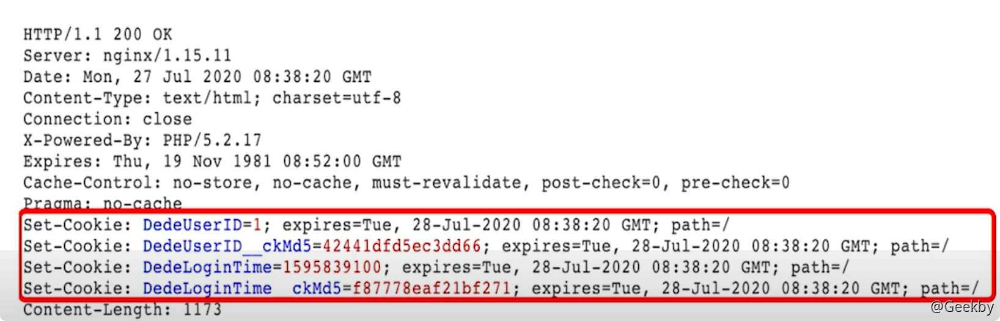
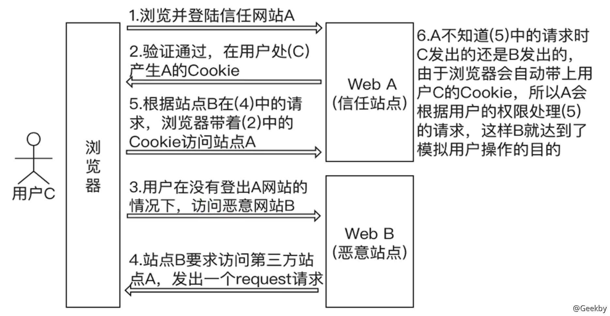

# CSRF漏洞相关

# CSRF 漏洞相关

## 1 定义与原理

> CSRF - 跨站请求伪造

### 1.1 cookie 相关

用户登录的数据包：

响应的数据包：

当提交了用户名和密码登录后，在服务器返回的数据包中携带类的 Set -Cookie 字段，该字段就是为当前登录用户设置的 Cookie 的值。

浏览器在接收到这些 Cookie 的值后会将 set-cookie 字段的值存放在浏览器中。

通过修改请求数据包的 Cookie 为管理员的 Cookie，即使不输入密码也可以登录网站后台。

数据包的中 Cookie的值是浏览器从本地存储中取出，并自动填充到数据包中如果攻击者控制了用户浏览器并且窃取了 cookie.浏览器会自动完成 Cookie的填充，目标网站会误认为该数据包就是管理员发送的，会以管理员的权限进行相关的操作。

### 1.2 CSRF

前提：数据包的中 Cookie 的值是浏览器从本地存储中取出，并自动填充到数据包中

攻击者在一定攻击条件下，利用被攻击者的身份向服务器发起请求，服务器可以正常解析并返回结果。

原理：一般来说，攻击者通过伪造用户的浏览器的请求，向访问用户自己曾经认证访问过的网站发送出去，使目标网站接收并误以为是用户的真实操作而去执行命令。

发生条件：

-   攻击者在网站 A 处于登录状态
-   必需要在网站 A 同浏览器中打开黑客提供的链接
-   后台身份验证不严格（例如除 Cookie 外无其它验证）

## 2 防御

### 2.1 HTTP Referer 限制

站点可以对一些敏感操作限制其 Referer 字段的值，比如某站点转账的时候使用：

`http://bank.example/withdraw?account=bob&am=1000000&for=Mallory`

转账的操作一定是用户登录之后在本站点的页面上操作的，因为可以将 Referer 字段限制为只允许本站点。

### 2.2 Token

CSRF 成功的原因在于站点对于用户身份的辨别依赖于 Cookie，因此攻击者可以在不知道用户口令的情况下直接使用用户的 Cookie 来通过安全验证。

在 HTTP 请求中以参数的形式加入一个随机产生的 HTTP Token，服务器接收到用户请求后会验证 Token，如果没有 Token 或者 Token 不正确都会被认为是攻击而直接丢弃

GET 请求： `http://url?csrftoken=tokenvalue`

POST 请求：`<input type="hidden" name="csrftoken" value="tokenvalue"/>`

信息

比如攻击者可以在网站发布自己服务器的地址，当普通用户点击了该地址后，由于该站点会在地址后面添加 Token，也就造成了 Token 的泄露。

因此要对站点对内链和外链进行区分，只在内链中添加 Token，对于外链就不添加 Token。
