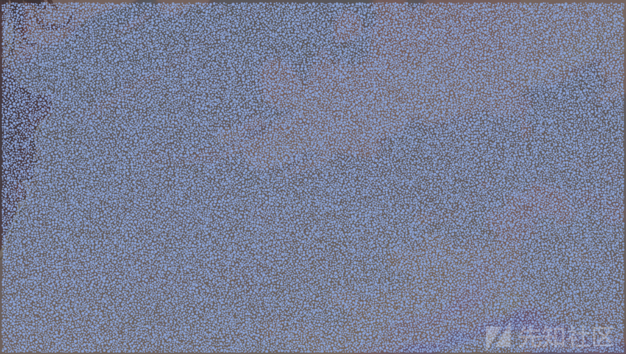

# CTF Misc隐写术原理和工具 - 先知社区

CTF Misc隐写术原理和工具

- - -

# Misc分类

个人认为Misc中的题目可分为七大类，图片隐写，音视频隐写，其它隐写(PPT、word文档等隐写)，压缩包破解，流量分析，取证，编码或密码。这里面涉及的知识点当然是很多的，有很多你意想不到的能藏东西的新颖方式，也正因为如此才十分有趣，利用这些知识，进行隐藏，传输等对于信息安全肯定有着至关重要的作用。

# 编码

## 贝斯家族

base编码有挺多的，一般常使用的有base16，base32，base45，base58，base62，base64，base85，base91，base100，不同的base编码的原理大同小异。

## base16

码表：

| 下标  | 编码值 | 下标  | 编码值 |
| --- | --- | --- | --- |
| 0   | 0   | 8   | 8   |
| 1   | 1   | 9   | 9   |
| 2   | 2   | 10  | A   |
| 3   | 3   | 11  | B   |
| 4   | 4   | 12  | C   |
| 5   | 5   | 13  | D   |
| 6   | 6   | 14  | E   |
| 7   | 7   | 15  | F   |

> 从码表可以看到base16的特征，数字0-9、A-F，而base16的原理十分简单，将对应的字符根据ASCII编码、UTF-8编码转成对应的二进制数，然后以4个为一组，转成对应的十进制数，再对应码表。
> 
> 比如：将Aiwin进行base16编码变成416977696E，首先转成ASCII码变成65，105，119，105，110，再将其转成二进制(8位)的格式01000001，01101001，01110111，01101001，01101110，分成每4位一组即为0100,0001,0110,1001,0111,0111,0110,1001,0110,1110再转成十进制为查表即得416977696E。

## base32

码表：

[](https://xzfile.aliyuncs.com/media/upload/picture/20240119212839-a7dd682e-b6ce-1.png)

> 特征：A-Z、0-7，base32隐写与base16大同小异，不过这次转为二进制后，5个二进制为一组，如果不足5位则低位补0，不足40位则补=,一个=相当于5位，补满40位为止。
> 
> 比如LOVE进行base32加密得到JRHVMRI=，先转成二进制分5位可得：01001，10001，00111，10101，01100，10001，01000，一共35位，换成十进制为9，17，7，21，12，17，8，因为不够40位，补一个=，得到结果JRHVMRI=

## base64

码表：

[](https://xzfile.aliyuncs.com/media/upload/picture/20240119212843-aa9f1d0a-b6ce-1.png)

> base64可打印字符有A~Z、a~z、0~9、+、/，原理就是将字符转成二进制串，6个二进制为1组，不足6位低位补0，转成对应的十进制数，查码表，若不足24位，则补=，一个=等于6个二进制位。
> 
> 如Hello!!，转成二进制字符串分6位为，010010，000110，010101，101100，011011，000110，111100，100001，001000，010000，转成十进制对应码表为SGVsbG8hIQ，因为一共60位，24的倍数对应72位，因此要补2个=，结果为SGVsbG8hIQ==,由于这种特性，尾部存在双=，可以确认为base64编码

## base62

> base62的码表就是base64的码表去除了+和/，默认的码表顺序为0123456789ABCDEFGHIJKLMNOPQRSTUVWXYZabcdefghijklmnopqrstuvwxyz  
> base62的原理如下：
> 
> 如果base62转换字符串，比如转换Ai，会先将Ai转成整型即16745，至于怎么转，参考如下：首先A和i的ASCII码分别为65和105，那么16745=65*2^8+105*2^0 以此类推。16745再与62取余，第一次余数为5，对应码表的5，16745//62变成了270，270取余62变成了22，对应码表的M，最后270//62变为4，对应码表4，结果为5M4，取倒序得到编码结果为4M5。

以下是参考脚本：

```plain
from Crypto.Util.number import bytes_to_long


BASE = 62
CHARSET_DEFAULT = "0123456789ABCDEFGHIJKLMNOPQRSTUVWXYZabcdefghijklmnopqrstuvwxyz"


def encode(n, minlen=1, charset=CHARSET_DEFAULT):
    chs = []
    while n > 0:
        r = n % BASE
        n //= BASE

        chs.append(charset[r])

    if len(chs) > 0:
        chs.reverse()
    else:
        chs.append("0")

    s = "".join(chs)
    s = charset[0] * max(minlen - len(s), 0) + s
    return s


print(encode(bytes_to_long(b'Ai')))
```

## base45

> base45的码表为base36加上空格$+-/.*%这几个符号。base45的码表为：  
> 0123456789ABCDEFGHIJKLMNOPQRSTUVWXYZ $%*+-./:  
> 加密原理如下：比如加密Hello  
> 首先每两个字节分开，即分成He，ll，o  
> 然后分别将两字节的字符串转成十进制分为别18533，27756，111，然后跟base62一样的操作得到余数分别为38 6 9对应码表为%69，剩下的整数依次操作得到结果%69 VDL2

编码如下：

```plain
from Crypto.Util.number import bytes_to_long

BASE = 45
CHARSET_DEFAULT = "0123456789ABCDEFGHIJKLMNOPQRSTUVWXYZ $%*+\-./:"


def encode(n, minlen=1, charset=CHARSET_DEFAULT):
    chs = []
    while n > 0:
        r = n % BASE
        n //= BASE

        chs.append(charset[r])

    s = "".join(chs)
    s = charset[0] * max(minlen - len(s), 0) + s
    return s

s='Hello'
result=''
for i in range(0,len(s),2):
    result+=encode(bytes_to_long(s[i:i+2].encode('utf-8')))
print(result)
```

## base58

> base58的码表为123456789ABCDEFGHJKLMNPQRSTUVWXYZabcdefghijkmnopqrstuvwxyz，原理与base62一样，把62换成58即可，不多阐述。

## base85

码表:

> base85有三种标准，一般题目用的是Ascii85标准，分别为Ascii85：Adobe ASCII85编码标准；  
> ZeroMQ：ZeroMQ编码标准；IPv6：IPv6编码标准。不同的标准代表着码表不同。

```plain
const ASCII85 ="!\"#$%&'()*+,-./0123456789:;<=>?@ABCDEFGHIJKLMNOPQRSTUVWXYZ[\]^_`abcdefghijklmnopqrstu";

const Z85 = "0123456789abcdefghijklmnopqrstuvwxyzABCDEFGHIJKLMNOPQRSTUVWXYZ.-:+=^!/*?&<>()[]{}@%$#";

const Z85BUG = "0123456789ABCDEFGHIJKLMNOPQRSTUVWXYZabcdefghijklmnopqrstuvwxyz.-:+=^!/*?&<>()[]{}@%$#";

const RFC1924 = "0123456789ABCDEFGHIJKLMNOPQRSTUVWXYZabcdefghijklmnopqrstuvwxyz!#$%&()*+-;<=>?@^_`{|}~";
```

> base85的加密原理是先将字符串转成二进制串，然后拼接起来，转成十进制，再进行85的取余，取余对码表。

## base91

> 示例，test加密后的结果为fPNKd，流程为：先取t，转为二进制01110100，不足13位则继续取后面的e转二进制为01100101，将二进制拼接(e在左边)为0110010101110100，一共16位，取13位转十进制1396，对91进行除法1396/91=15余31，15与31对码表为fP，然后再取s，二进制01110011，拼接到剩下3位的左边为01110011011，不满足13位，继续转化t为01110100，拼接到左边为0111010001110011011，取后13位，相同操作得到NK,最后余6位，直接转化为29，得到d，结果为fPNKd

加解密脚本：

```plain
import struct

base91_alphabet = ['A', 'B', 'C', 'D', 'E', 'F', 'G', 'H', 'I', 'J', 'K', 'L', 'M',
                   'N', 'O', 'P', 'Q', 'R', 'S', 'T', 'U', 'V', 'W', 'X', 'Y', 'Z',
                   'a', 'b', 'c', 'd', 'e', 'f', 'g', 'h', 'i', 'j', 'k', 'l', 'm',
                   'n', 'o', 'p', 'q', 'r', 's', 't', 'u', 'v', 'w', 'x', 'y', 'z',
                   '0', '1', '2', '3', '4', '5', '6', '7', '8', '9', '!', '#', '$',
                   '%', '&', '(', ')', '*', '+', ',', '.', '/', ':', ';', '<', '=',
                   '>', '?', '@', '[', ']', '^', '_', '`', '{', '|', '}', '~', '"']

decode_table = dict((v, k) for k, v in enumerate(base91_alphabet))


def decode(encoded_str):
    v = -1
    b = 0
    n = 0
    out = bytearray()
    for strletter in encoded_str:
        if not strletter in decode_table:
            continue
        c = decode_table[strletter]
        if (v < 0):
            v = c
        else:
            v += c * 91
            b |= v << n
            n += 13 if (v & 8191) > 88 else 14
            while True:
                out += struct.pack('B', b & 255)
                b >>= 8
                n -= 8
                if not n > 7:
                    break
            v = -1
    if v + 1:
        out += struct.pack('B', (b | v << n) & 255)
    return out


def encode(bindata):
    b = 0
    n = 0
    out = ''
    for count in range(len(bindata)):
        byte = bindata[count:count + 1]
        b |= struct.unpack('B', byte)[0] << n
        n += 8
        if n > 13:
            v = b & 8191
            if v > 88:
                b >>= 13
                n -= 13
            else:
                v = b & 16383
                b >>= 14
                n -= 14
            out += base91_alphabet[v % 91] + base91_alphabet[v // 91]
    if n:
        out += base91_alphabet[b % 91]
        if n > 7 or b > 90:
            out += base91_alphabet[b // 91]
    return out


print(encode('Aiwin'.encode('utf-8')))
```

## base100

> base100特征很明显，加密后的结果是一堆表情，又简称Emoji加密，每个表情符号代表字符串中的一个字符。

[](https://xzfile.aliyuncs.com/media/upload/picture/20240119212857-b2eb9cb8-b6ce-1.png)

可以看到鞋子对i，青蛙对A，以此类推

关于多种base编码的叠加，有时候难以看出是那种编码，可以尝试使用工具。  
推荐工具basecrack：[basecrack](https://github.com/mufeedvh/basecrack "basecrack")

## base换表

> 接触的挺多关于base的题目中，都会进行换表，就是把码表变换了，需要自己将码表与原码表对应转换，才能解码出正确的结果，参考例题：

\[网鼎杯 2022 玄武组\]misc999-base62换表

WP如下：

```plain
# 表 9876543210qwertyuiopasdfghjklzxcvbnmMNBVCXZLKJHGFDSAPOIUYTREWQ
# 密文 7dFRjPItGFkeXAALp6GMKE9Y4R4BuNtIUK1RECFlU4f3PomCzGnfemFvO


BASE = 62

CHARSET_DEFAULT = '9876543210qwertyuiopasdfghjklzxcvbnmMNBVCXZLKJHGFDSAPOIUYTREWQ'
str1 = "7dFRjPItGFkeXAALp6GMKE9Y4R4BuNtIUK1RECFlU4f3PomCzGnfemFvO"


def _value(ch, charset):
    try:
        return charset.index(ch)
    except ValueError:
        raise ValueError("base62: Invalid character (%s)" % ch)


def decode(encoded, charset=CHARSET_DEFAULT):
    if encoded.startswith("0z"):
        encoded = encoded[2:]

    l, i, v = len(encoded), 0, 0
    for x in encoded:
        v += _value(x, charset=charset) * (BASE ** (l - (i + 1)))
        i += 1

    return v


def decodebytes(encoded, charset=CHARSET_DEFAULT):
    decoded = decode(encoded, charset=charset)
    buf = bytearray()
    while decoded > 0:
        buf.append(decoded & 0xFF)
        decoded //= 256
    buf.reverse()

    return bytes(buf)


print(decodebytes(str1))
```

## base隐写

base64为例：

> 因为base64末端不足24位，会填充=的特性，在base64进行解码时，会先丢弃末尾的=，然后每个字符查表转换为6位的二进制串，最后从头开始，每次取8位转化为对应的ASCII字符，如果不足8位会丢弃。丢弃的数据也正是在编码时补的0，所以假如编码过程中不用0填充，用其它字符填充，依旧可以正常解码，在填充的数据中就可以进行隐写。要提取出隐写将不影响解码的结果提出来转ASCII字符串即可。过程大致如下：  
> 如果最后没有=，即说明没有隐写位，如果有1个=，说明有两位隐写位，将倒数第二个字符转化为对应的二进制索引，取后两位，如果有两个=，则将倒数第三个字符转为二进制，取后四位。最后将取出的二进制串八位一组转ASCII即可。
> 
> 拿字符A来说，转成二进制为01000001，base64编码就会识别为0100 0001 0000,然而最后的四个0000位最后解码都会被丢弃，因此字符即使换成0100 0001 1111解码依旧会是A，因此可以进行4个bit位的隐写.

例题：\[GXYCTF 2019\]SXMgdGhpcyBiYXNlPw==

WP：

```plain
import base64

base64chars = 'ABCDEFGHIJKLMNOPQRSTUVWXYZabcdefghijklmnopqrstuvwxyz0123456789+/'


def base64_stegan0graphy():
    flag = 'hzuctf{base64_stegan0graphy}'
    bin_str = ''.join([bin(ord(c)).replace('0b', '').zfill(8) for c in flag])
    with open('plaintext.txt', 'r') as plaintext, open('encrypt.txt', 'w+') as encrypt:
        for line in plaintext.readlines():
            base64_result = str(base64.b64encode((line.replace('\n', '')).encode('utf-8')), 'utf-8')
            equal_numbers = base64_result.count('=')
            if equal_numbers and len(bin_str):
                position = int(bin_str[:equal_numbers * 2], 2)  # 取相应的位数,二进制转十进制0
                last_char = base64_result[len(base64_result) - equal_numbers - 1]  # 取除等号最后一个字符
                base64_result = base64_result.replace(last_char,
                                                      base64chars[base64chars.index(last_char) + position])  # 改变字符
                bin_str = bin_str[equal_numbers * 2:]  # 减去改变的二进制位
            encrypt.write(base64_result + '\n')  # 写入


def solve():
    flag = ''
    with open('encrypt.txt') as f:
        for line in f.readlines():
            line = line[:-1]
            num = line.count('=')
            if num == 0:
                continue
            lastchar = line[-(num + 1)]
            myindex = base64chars.index(lastchar)
            bin_str = bin(myindex)[2:].zfill(6)
            flag += bin_str[6 - 2 * num:]
    print(''.join([chr(int(flag[i:i + 8], 2)) for i in range(0, len(flag), 8)]))


base64_stegan0graphy()
solve()
```

> 同样，base32也能进行这样的隐写。

base32隐写：

> base64加密的隐写位是2或4，对于base32根据分析可以知道1个等号->3个填充位，3个等号->1个填充位，4个等号->4个填充位，5个等号->1个填充位，6个等号->2个填充位。填充位参差不齐，但是不妨碍进行隐写，因此base32也能进行隐写，以下是个人脚本，存在一定的缺陷，可能会出现提取隐写数据最后面的时候出现紊乱，因为不一定每次都恰好提取到8的倍数，也就导致了最后面可能会拼上其它数据，导致紊乱。

```plain
## 1个等号->3个填充位
## 3个等号->1个填充位
## 4个等号->4个填充位
## 5个等号->1个填充位
## 6个等号->2个填充位

# A

import base64

base32chars = 'ABCDEFGHIJKLMNOPQRSTUVWXYZ234567'


def change(equal_numbers, offset, base32_result, bin_str):
    position = int(bin_str[:offset], 2)
    last_char = base32_result[len(base32_result) - equal_numbers - 1]
    base32_result = base32_result.replace(last_char,
                                          base32chars[base32chars.index(last_char) + position])
    bin_str = bin_str[offset:]
    return bin_str, base32_result


def base32_stegan0graphy():
    flag = 'hzuctf{base32_stegan0graphy_Y}'
    bin_str = ''.join([bin(ord(c)).replace('0b', '').zfill(8) for c in flag])
    print(bin_str)
    with open('plaintext.txt', 'r') as plaintext, open('encrypt.txt', 'w+') as encrypt:
        for line in plaintext.readlines():
            base32_result = str(base64.b32encode((line.replace('\n', '')).encode('utf-8')), 'utf-8')
            equal_numbers = base32_result.count('=')
            if equal_numbers == 1 and len(bin_str):
                bin_str, base32_result = change(1, 3, base32_result, bin_str)
            elif equal_numbers == 3 and len(bin_str):
                bin_str, base32_result = change(3, 1, base32_result, bin_str)
            elif equal_numbers == 4 and len(bin_str):
                bin_str, base32_result = change(4, 4, base32_result, bin_str)
            elif equal_numbers == 5 and len(bin_str):
                bin_str, base32_result = change(5, 1, base32_result, bin_str)
            elif equal_numbers == 6 and len(bin_str):
                bin_str, base32_result = change(6, 2, base32_result, bin_str)
            encrypt.write(base32_result + '\n')


def get_padding(line, num, offset, flag):
    last_char = line[-(num + 1)]
    myindex = base32chars.index(last_char)
    bin_str = bin(myindex)[2:].zfill(5)
    flag += bin_str[5 - offset:]
    return flag


def solve():
    flag = ''
    with open('encrypt.txt') as f:
        for line in f.readlines():
            line = line.replace('\n', '')
            num = line.count('=')
            if num == 0:
                continue
            elif num == 1:
                flag = get_padding(line, num, 3, flag)
            elif num == 3:
                flag = get_padding(line, num, 1, flag)
            elif num == 4:
                flag = get_padding(line, num, 4, flag)
            elif num == 5:
                flag = get_padding(line, num, 1, flag)
            elif num == 6:
                flag = get_padding(line, num, 2, flag)

    print(''.join([chr(int(flag[i:i + 8], 2)) for i in range(0, len(flag), 8)]))

base32_stegan0graphy()
solve()
```

## WhiteSpace编码

> 顾名思义，白空格编码，是一种只用空白字符(空格，TAB和回车)编程的语言，而其它可见字符统统为注释，本身是个指令式、基于堆栈的语言。

参考例题：\[HNCTF 2022 WEEK3\]看不见的代码

运行网站：[WhiteSpace](https://vii5ard.github.io/whitespace/ "WhiteSpace")

## 零宽隐写

> 零宽隐写在一般的文本编辑器中不可见，但是如果你使用Vim，或者010等编辑器是可以看见的，其实就是一些不可见，不可打印的字符，属于Unicode编码用于调整字符显示格式使用的。一般不同的解码工具零宽度字符隐写可能会存在差异，但是一般下面三个解码网站可解决绝大部分。至于加密的方式就比较多式多样，可以转成摩斯的，也可以转成二进制串的，因为二进制串与摩斯编码都仅有几个字符类型，然后使用各种零宽字符的排列组合来代替这些字符的排列形式。

参考例题：2021网刃杯CTF签到题

[](https://xzfile.aliyuncs.com/media/upload/picture/20240119212918-bf52ea56-b6ce-1.png)

```plain
https://330k.github.io/misc_tools/unicode_steganography.html
https://yuanfux.github.io/zero-width-web/
https://www.mzy0.com/ctftools/zerowidth1/
```

## 垃圾邮件加密

> 这种加解密我从\[NKCTF2023\]first spam of rabbit year中见识到的，可以把一段短编码生成一封很正式的邮件，根据网站的阐述，模仿的是彼得·韦纳的模仿引擎的垃圾邮件语法，这种编码方式的思想出现在<<消失的密码学>>这本书中，至于究竟是如何编码的，网上资料少的可怜，估计得读下这本书才知晓。

工具：[垃圾邮件](https://www.spammimic.com/decode.shtml "垃圾邮件")

## JSfuck

> JSfuck的编码思想就是利用()+\[\]!六种符号来编写编码，这六种字符通过javascript的强制类型转换就可以取到undefined、true、false、NaN等关键字的字符，并组装成一些函数，比如+\[\]==0，+!+\[\]==1，又比如要标识字符t，结果为(!!\[\]+\[\])\[+\[\]\]，将其分解，!!\[\]+\[\]=="true"，+\[\]==0，最终表示true\[0\]，也就是说这种jsfuck表达式，只是通过下标来取特定的字符串。

官网：[JSfuck](http://www.jsfuck.com/ "JSfuck")

## 当铺密码

> 当铺密码原理就是通过中文汉字来表示数字，汉字多少笔画就转化为数字几，可以联合ASCII或utf-8编码藏各种字符串等，比如王夫 井工 夫口 由中人 井中 夫夫 由中大，转换成数字为67 84 70 123 82 77 125，再转换成对应的ASCII编码为CTF{RM}。

参考例题：\[GKCTF2020\]汉字的秘密

## 百家姓

> 通过百家姓中的73个不同的中文，用来代替数字0-9，字母a-z，以及一些常用符号的一种加密方式，比如赵钱孙李对应的是0123，以此类推。遇到的比较不错的出发就是通过故事的形式，讲述人物故事，然后从人物的名称中隐藏信息。

参考例题：\[UUCTF 2022 新生赛\]搬好小板凳听故事  
解密工具：[百家姓](http://www.atoolbox.net/Tool.php?Id=1050 "百家姓")

## Wakandan符号

> 印象比较深，是一种不知道谁发明的符号字体，可以通过符号字体表示英文字母。

[](https://xzfile.aliyuncs.com/media/upload/picture/20240119212933-c834efb6-b6ce-1.png)

参考例题：\[WEEK3\]symbol

## 九宫八卦

> 通过洛书的九宫与八卦对应图，根据九宫图可以转码成9进制，1->0,9->8,就能通过此来对ASCII的字符进行编码

[](https://xzfile.aliyuncs.com/media/upload/picture/20240119212940-cc8d0a6c-b6ce-1.png)

例题：\[HSCSEC2023\]Deduced gossip

```plain
str = '☲☵ ☷☵☳ ☶空 ☷☵☳ ☶☱ ☶空 ☷空☱ ☶空 ☷☳☰ ☷☳☱ ☷☴☳ ☷☳☳ ☷☴☶ ☷☳☳ ☷☷☰ ☷☳空 ☰☴ ☷☴☶ ☷☴☶ ☷☴空 ☷空☲'

# 九宫八卦
dict = {'☵': '0', '☷': '1', '☳': '2', '☴': '3',
        '空': '4', '☰': '5', '☱': '6', '☶': '7', '☲': '8'}
flag = ''
for i in str:
    if i == ' ':
        flag += ' '
        continue
    flag += dict.get(i)
print(flag)
# 80 102 74 102 76 74 146 74 125 126 132 122 137 122 115 124 53 137 137 134 148
# 九进制
flag = flag.split()
real_flag = ''
for x in range(len(flag)):
    real_flag += chr(int(flag[x], 9))
print(real_flag)
```

## 二十八星宿

> 通过二十八星宿指向的四大神兽对应的东西南北构成四进制的符号集，然后对字符进行编码。

例题：\[HSCSEC2023\]Watch the sky at night

```plain
a = '''
斗木獬角木蛟奎木狼亢金龙 牛金牛女土蝠氐土貉井木犴
虚日鼠房日兔心月狐鬼金羊 危月燕室火猪尾火虎柳土獐
壁水貐箕水豹斗木獬牛金牛 女土蝠角木蛟亢金龙星日马
虚日鼠张月鹿娄金狗翼火蛇 危月燕氐土貉房日兔轸水蚓
室火猪心月狐井木犴胃土雉 壁水貐斗木獬鬼金羊柳土獐
牛金牛尾火虎箕水豹女土蝠 虚日鼠昴日鸡柳土獐毕月乌
危月燕觜火猴角木蛟星日马 室火猪参水猿奎木狼壁水貐
斗木獬娄金狗牛金牛女土蝠 虚日鼠胃土雉张月鹿昴日鸡
危月燕翼火蛇室火猪亢金龙 壁水貐斗木獬轸水蚓井木犴
牛金牛氐土貉房日兔女土蝠 虚日鼠危月燕心月狐尾火虎
室火猪鬼金羊柳土獐壁水貐'''
# 应为 壁水獝
dic = {
    'E': ['角木蛟', '亢金龙', '氐土貉', '房日兔', '心月狐', '尾火虎', '箕水豹'],
    'S': ['井木犴', '鬼金羊', '柳土獐', '星日马', '张月鹿', '翼火蛇', '轸水蚓'],
    'W': ['奎木狼', '娄金狗', '胃土雉', '昴日鸡', '毕月乌', '觜火猴', '参水猿'],
    'N': ['斗木獬', '牛金牛', '女土蝠', '虚日鼠', '危月燕', '室火猪', '壁水貐']}

f = ''
a = a.replace('\r\n', '').replace(' ', '').replace('\n', '')
for i in range(0, len(a), 3):
    v = a[i:i + 3]
    for j in dic:
        if v in dic[j]:
            f += j
print(f)
tmp = f.replace('N', '1').replace('S', '3').replace('W', '2').replace('E', '0')
flag = ''.join([chr(int(tmp[m:m + 4], 4)) for m in range(0, len(tmp), 4)])
print(flag)
```

[](https://xzfile.aliyuncs.com/media/upload/picture/20240119212950-d241bb92-b6ce-1.png)

## 拼音编码

> 通过汉字的拼音字母和声调音节来组成ASCII编码从而对flag编码，可以使用python的pinyin库进行处理。

## 编码总结

Misc中编码的方式有很多，这里只列举一些自己感觉比较有趣的部分，不同的编码有不同的特征，根据特征去寻找对应的编码即可，重要的是去了解编码的思想或者说编码和解码的大致流程，随时随地，自己也可以变种，诞生有自己想法的编码方式，至于解码的一些工具，网上有很多，以下是一个比较全的收录网站。

[Misc解码收录网站](https://blog.csdn.net/mochu7777777/article/details/108542237 "Misc解码收录网站")

# 压缩包

## 爆破

> 一般在无任何提示或者知道任何东西的前提下，压缩包被加密，可以考虑两种情况，一种是伪加密，一种是直接爆破，这里推荐工具ARCHPR，有多种攻击模式，包括口令、明文、掩码，暴力等等。

## 伪加密

> 像rar和zip类型的压缩包都存在伪加密，伪加密的意思就是解压的时候需要输入密码，但是实际上并没有进行加密。zip伪加密的特点就是压缩源文件数据区全局方式位标记为00 00，但是压缩源文件目录区的全局方式位为0奇数，00。

[](https://xzfile.aliyuncs.com/media/upload/picture/20240119212957-d6a28806-b6ce-1.png)

> rar伪加密当你使用软件进行解压的时候，由于rar存在头部校验，所以打开文件就会出现报错，打开rar文件，找到第24个字节，字节尾数为0表示无加密，4表示加密，若是改成则会是伪加密。

## CRC爆破

> 因为zip压缩包在压缩文件后会进行冗余校验，也就是存在冗余校验位，那么当被加密压缩的文件中的数据足够小，大小仅为几个字节的时候，就可以使用穷举数据的办法，进行CRC32的碰撞，当与冗余校验相同的时候，被加密的数据也就自然出来了。

推荐工具：[CRC32-master](https://github.com/theonlypwner/crc32 "CRC32-master")

当然也可以自己写一个简单的脚本

```plain
from binascii import crc32
import string
import zipfile

dic = string.printable


def CrackCrc(crc):
    for i in dic:
        for j in dic:
            for p in dic:
                for q in dic:
                    s = i + j + p + q
                    if crc == (crc32(bytes(s, 'ascii')) & 0xffffffff):
                        print(s)
                        return


def getcrc32(fname):
    l = []
    file = fname
    f = zipfile.ZipFile(file, 'r')
    global fileList
    fileList = f.namelist()
    print(fileList)
    for filename in fileList:
        Fileinfo = f.getinfo(filename)
        crc = Fileinfo.CRC
        l.append(crc)
    return l


def main(filename=None):
    l = getcrc32(filename)
    for i in range(len(l)):
        print(fileList[i], end='的内容是:')
        CrackCrc(l[i])


if __name__ == "__main__":
    main(r'A:\下载\cccccrc.zip')
```

## 明文攻击

> 明文攻击也是常用的方法，当然存在限制性，最简单的明文攻击就是被设置好那样，被加密压缩的文件中存在一个已有的相同的文件，要成功需要满足三个条件：
> 
> 1.  完整的明文文件
> 2.  明文文件需要被相同的压缩算法标准压缩（也可理解为被相同压缩工具压缩）
> 3.  明文对应文件的加密算法需要是 ZipCrypto Store  
>     这种属于浅显的明文攻击，像美团杯等各种大赛中都曾出现了ZIP深入明文攻击的利用，当已知明文的12字节和偏移，其中至少8个字节连续的时候，可以通过爆破得知压缩包的密钥，加密方式仅限ZipCrypto Store。

参考题目：2021年美团网络安全杯\[오징어 게임 鱿鱼游戏\]

# PNG隐写

> 在当前的CTF比赛中，PNG的图片隐写大致有如下的解题方法：
> 
> 1.  PNG文件宽高分析，宽高是否被修改
> 2.  文件是否逆序，是否存在高低字节转换
> 3.  尾部或其它地方是否藏有多余数据
> 4.  IDAT块的校验，是否异常
> 5.  是否利用图片隐藏了数据，如Lsb，pixel，盲水印等

## 宽高修改

> 顾名思义，就是说修改高度或者宽度，使得图片没有放全，从而部分数据看不见，这时候只需要根据图片的IDHR计算出图片的宽高，恢复即可，通常只改一个拖入010等会报错。当然有一些题法比较变态的会把IDHR也修改成相应的，实在发现不了其它思路，可以尝试下修改。

简单的宽高校验脚本：

```plain
import zlib
import struct

import itertools

bin_data = open("图片路径", 'rb').read()
crc32key = zlib.crc32(bin_data[12:29])  # 计算crc的值 12:29是IHDR的4位+13位
original_crc32 = int(bin_data[29:33].hex(), 16)  # 原始crc #提取IHDR的17位后的4位CRC

if crc32key == original_crc32:  # 计算crc对比原始crc
    print('宽高没有问题!')
else:
    input_ = input("宽高被改了, 是否CRC爆破宽高? (Y/n):")
    if input_ not in ["Y", "y", ""]:
        exit()
    else:
        for i, j in itertools.product(range(4095),
                                      range(4095)):  # 理论上0x FF FF FF FF，但考虑到屏幕实际/cpu，0x 0F FF就差不多了，也就是4095宽度和高度
            data = bin_data[12:16] + struct.pack('>i', i) + struct.pack('>i', j) + bin_data[24:29]  # IHDR+修改的宽+高+CRC前5位
            crc32 = zlib.crc32(data)  # 计算CRC
            if crc32 == original_crc32:  # 计算当图片大小为i:j时的CRC校验值，与图片中的CRC比较，当相同，则图片大小已经确定
                print(f"\nCRC32: {hex(original_crc32)}")
                print(f"宽度: {i}, hex: {hex(i)}")
                print(f"高度: {j}, hex: {hex(j)}")
                exit(0)
```

参考例题：\[HNCTF2022\]Capture!

## IDAT块隐写

> 图像数据块IDAT，存储实际的数据，在数据流中包含多个连续的图像数据块，一般采用zlib进行解压缩，可以通过pngcheck或观察010中的IDAT长度查看是否异常，异常是指某些块长度突然不一样，前面的块并未倒满，那么就可以从可疑的IDAT块中提取数据进行分析。

[](https://xzfile.aliyuncs.com/media/upload/picture/20240119213021-e5239546-b6ce-1.png)

例题：\[SCTF 2014\]misc400

WP如下：

```plain
import zlib

# if __name__ =="__main__":
#     fd = open("A:\下载\sctf.png","rb")
#     data = fd.read()
#     fd.close()
#     fd = open("sctf.txt","wb")
#     data = data[0x15AFFB:]
#     fd.write(zlib.decompress(data))
#     fd.close()

from PIL import Image

#data="1111111000100001101111111100000101110010110100000110111010100000000010111011011101001000000001011101101110101110110100101110110000010101011011010000011111111010101010101111111000000001011101110000000011010011000001010011101101111010101001000011100000000000101000000001001001101000100111001111011100111100001110111110001100101000110011100001010100011010001111010110000010100010110000011011101100100001110011100100001011111110100000000110101001000111101111111011100001101011011100000100001100110001111010111010001101001111100001011101011000111010011100101110100100111011011000110000010110001101000110001111111011010110111011011"

f=open("sctf.txt",'r')
data=f.read()
width = 25
height = 25

im = Image.new("RGB", (width, height))  # 创建图片
for i in range(0, width):
    line = data[width*i:width*(i+1)]   # 获取一行
    for j in range(0, height):
        if line[j] == '0':
            im.putpixel((i, j), (255, 255, 255))  # rgb转化为像素
        else:
            im.putpixel((i, j), (0, 0, 0))       # rgb转化为像素
im.save("sctf.png")
```

## lsb隐写

> lsb隐写简单的可以理解为颜色通道或者像素点隐写，每张图片都会存在多个颜色通道，最多会存在32个颜色通道ARGB，分别代表透明，红，绿，蓝，再通过这三种颜色不同比例衍生出其它颜色，一共包含了256^3种即16777216种颜色，而人类能够明显区分的颜色约为一千万种，因此就可以将要藏匿的数据转化为二进制位，然后修改对应颜色通道的值，嵌入数据，看上去并无异常。可以藏匿各个通道，每个通道的多位。比如，白色(255,255,255)对应二进制bin(11111111,11111111,11111111)，改成bin(11111110,11111110,11111110)肉眼分辨不出,但是却隐写了3位二进制000，当然也可以藏到其它为位通道。

[](https://xzfile.aliyuncs.com/media/upload/picture/20240119213029-e9e292b2-b6ce-1.png)

观察工具：StegSolve.jar、zsteg、提取像素点都可。

> zsteg属于无脑一把梭工具，一般能看到高位隐写的数据，低位的一般看不出来，StegSolve则相对需要自己慢慢观察颜色通道，这里说的高低位是指当有多个通道被隐写时，读取顺序的问题，比如2、3位被隐写，从7往0读会先提3再提2，而低位则为先提取2再提取3，这也就是MSB和LSB的区别
> 
> 当然，lsb的隐写方式层出不穷，在之前部分比赛的会常用到加密型的lsb，即先对隐写数据进行AES加密，再将数据进行隐写，一般使用如下工具就可解码

[cloacked-pixel](https://github.com/cyberinc/cloacked-pixel "cloacked-pixel")

参考例题：  
\[NKCTF2023\]easy\_rgb，cloacked-pixel隐写  
\[NSSRound#3 Team\]funnypng，位深度隐写

funnypng的WP如下：

```plain
#图片的位深度为48bit,位深度太大,一般高只显示8bit,所以RGB分别占16bit,还有8bit被隐藏了,提取出来
from PIL import Image
import png

img = png.Reader('funnypng.png')
imginfo = img.read()
print(imginfo)
w, h, imgdata = imginfo[:3]

data = []
for linedata in imgdata:
    line = []
    for d in linedata:
        line.append(d%(2**8)) #取后8位隐藏的bit
    data.append(line)
with open('front.png', 'wb') as f:
    img2 = png.Writer(width=w, height=h, greyscale=False, bitdepth=8)
    img2.write(f, data)

img1 = Image.open('funnypng.png')
img2 = Image.open('front.png')
w, h = img1.size
img_er = Image.new('1', (370, 370))
for i in range(w):
    for j in range(h):
        if i < 370 and j < 185:
            r1, g1, b1 = img1.getpixel((i, j))
            r2, g2, b2 = img2.getpixel((i, j))  # getpixel获取某一个像素点RGB的颜色值
            a = int(bin(r1)[-1])
            b = int(bin(b2)[-1])
            img_er.putpixel((i, j), (a))  # putpixel()填写某位置的像素
            img_er.putpixel((i, j + 185), (b))
img_er.save('qr.png')
```

## 盲水印隐写

> 水印原本是为了声明版权而添加的，盲水印顾名思义则是添加看不见的水印，即保护版本，也不影响图片的正常使用。盲水印隐写与离散傅里叶变换有关，解水印则是逆过程。一般这种情况会出现两张相同的图片，一张图片被盲水印隐写了。数学好的可以参考文章

[盲水印与傅里叶变换](https://zhuanlan.zhihu.com/p/33523996 "傅里叶变换")

[盲水印提取与嵌入工具](https://github.com/chishaxie/BlindWaterMark#blindwatermark "盲水印提取与嵌入工具")

当然，出现两张图片猜测被盲水印隐写了只是一种方向，不一定是，因为还有其它方式能够在不改变图片的外观下隐藏数据，比如SSuite-Picsel军用级别的隐藏。

[SSuite-Picsel](https://download.cnet.com/SSuite-Picsel-Security/3000-2092_4-75992724.html "SSuite-Picsel")

## 猫脸变换

> 猫脸变换属于杂项的一些小知识点，原理就是通过矩阵和逆矩阵的预算将各个像素点置换，位置发生改变，从而一张有意义的图片变的毫无意义，简单的猫脸变换可以只变换一次，也可以变换多次，使其变复杂。

[](https://xzfile.aliyuncs.com/media/upload/picture/20240120192501-8ce7cf56-b786-1.png)

[](https://xzfile.aliyuncs.com/media/upload/picture/20240120192523-9a247dea-b786-1.png)

参考题目：\[NewStarCTF2022\]qsdz's girlfriend 2

WP如下：

```plain
import numpy as np
import cv2


def arnold_decode(image, arnold_times):
    a = 0x6f6c64
    b = 0x726e
    # 1:创建新图像,全为0的三维数组
    decode_image = np.zeros(shape=image.shape)
    # 读取图片的长宽像素,这里是98x98,即总像素点
    height, width = image.shape[0], image.shape[1]
    N = height  # N是正方形的边长

    for time in range(arnold_times):  # 变换的次数
        # 遍历图片的像素点坐标
        for old_x in range(height):
            for old_y in range(width):
                # 根据猫脸公式矩阵即像素点的逆置换,得到原未经过猫脸变换的图片
                new_x = ((a * b + 1) * old_x + (-a) * old_y) % N  #原像素点的x坐标值
                new_y = ((-b) * old_x + old_y) % N              #原像素点y的坐标值
                decode_image[new_x, new_y, :] = image[old_x, old_y, :]
    cv2.imwrite('flag.png', decode_image, [int(cv2.IMWRITE_PNG_COMPRESSION), 0])  # 以PNG写入图片
    return decode_image


if __name__ == '__main__':
    # imread(path,flag)读取图片,加载彩色图片默认参数值是flag=1,灰度是0,透明度-1,结果是三维数组,前两维是像素坐标,最后一维是通道索引
    it = cv2.imread('girlfriend.png')
    arnold_decode(it, 1)
```

# SVG图片

svg几乎不怎么遇到，svg属于一种利用XML格式定义的可伸缩的矢量图片，可以看作是前端的东西，但是曾遇过一道有趣的题目，值得记录一下，它通过利用class类的命名去除某些circle数据显示出flag。

题目：\[SDCTF 2022\]Ishihara test++.

[](https://xzfile.aliyuncs.com/media/upload/picture/20240119213052-f753c6f0-b6ce-1.png)

[](https://xzfile.aliyuncs.com/media/upload/picture/20240119213057-fa7b247c-b6ce-1.png)

```plain
header = '''<?xml version="1.0" encoding="UTF-8" ?>
<svg width="1920" height="1080" viewBox="0 0 1920 1080" xmlns="http://www.w3.org/2000/svg" version="1.1">'''
footer = '</svg>'

c1_c3_c6 = []

with open("flag.svg", "r") as f:
    content = f.read().split('\n')
    for i in content:
        if "c1" in i:
            c1_c3_c6.append(i)
        if "c3" in i:
            c1_c3_c6.append(i)
        if "c6" in i:
            c1_c3_c6.append(i)


with open("sanitized_flag.svg", "w") as f:

    f.write(f"{header}\n")

    for i in c1_c3_c6:
        f.write(f"{i}\n")

    f.write(f"{footer}")
```

# 取证

> 取证题一般会直接给出一个磁盘文件或者虚拟机镜像文件等等，取证题能联合以上的任意方式进行，只能慢慢观察给出的文件中的数据，特别留意图片、文本，回收站，压缩包，注册表，系统外的应用程序等的数据，用到的软件一般有Volatility，DiskGenius，VeraCrypt等。

[Volatility](https://www.volatilityfoundation.org/26 "Volatility")  
[DiskGenius](https://www.diskgenius.cn/ "DiskGenius")  
[Vecraypt](https://veracrypt.fr/en/Home.html "Vecrypt")

# JPG图片隐写

## DCT域隐写

> JPEG图像格式使用离散余弦变换（Discrete Cosine Transform，DCT）函数来压缩图像，而这个图像压缩方法的核心是：通过识别每个8×8像素块中相邻像素的重复像素来减少显示图像所需的位数，并使用近似估算法降低其冗余度。因此，我们可以把DCT看作一个用于执行压缩的近似计算方法。因为丢失了部分数据，所以DCT是一种有损压缩（Loss Compression）技术，但一般不会影响图像的视觉效果，经过DCT变换，重要的信息会几种在低频部分，不重要的信息会出现在高频部分。DCT域隐写简单的理解就是按某种规则对图片得到的DCT系数进行修改，将要隐藏的信息嵌入到DCT系数后再生成新的图片。常见的隐写方法有JSteg、JPHide、Outguess、F5等

工具：Stegdetect可用于分析JPEG文件，检测过JSteg、JPHide、OutGuess等多种图片的隐写信息和方式。

隐写工具一般用到的有：OutGuess，slienteye，F5-steganography等

# PPT，word等隐写

> 像PPT，word这种就是一个压缩包，可以把它改成压缩包的形式，然后会看到很多XML文件和数据，仔细从里面寻找一般就能解决大部分的问题，当然也有一些工具可能会使用，比如wbStego进行PDF隐写等。

# 工具

工具有助于快速解题，但是切记过度依赖工具哦  
最后附上一些收集的工具：

> [https://pan.baidu.com/s/1aUm4wUS2PkhkSYETrB5LMw?pwd=an1o](https://pan.baidu.com/s/1aUm4wUS2PkhkSYETrB5LMw?pwd=an1o)
